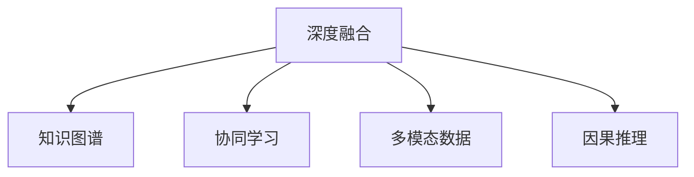

                 

# 知识的深度融合：洞察力的独特优势

## 1. 背景介绍

知识的深度融合是大数据时代技术发展的必然趋势，是人工智能技术不断演进的高级形态。在当今社会，人工智能已经不再局限于传统的识别、分类、预测等基本任务，而是逐步具备了洞察力，通过对知识的深度融合，实现对问题的深入理解与决策。

### 1.1 问题由来

人工智能技术自诞生以来，经历了从浅层学习到深层学习，再到深度学习的演变。深度学习通过多层神经网络对大量数据进行复杂模式的抽取，使人工智能在图像识别、语音识别、自然语言处理等任务上取得了显著进步。然而，深度学习模型虽然在数据驱动的监督任务上表现优异，但在缺乏足够标注数据的情况下，往往难以发挥应有的作用。

深度融合技术的出现，使得人工智能能够更好地处理信息，发挥其全面理解复杂问题、进行高级决策的能力。通过深度融合技术，人工智能系统能够在缺乏标注数据的情况下，通过对已有知识的深度学习与推理，实现对未知数据的理解与预测。

### 1.2 问题核心关键点

深度融合技术的核心关键点在于如何有效整合多源异构的知识数据，并在一定程度上挖掘知识之间的潜在联系，从而实现对未知数据的全面理解与预测。深度融合技术的主要挑战包括：

- **数据异构性**：不同数据源的特征和表示形式不一致，难以统一处理。
- **知识关联性**：知识之间的关联性难以有效挖掘，无法实现协同推理。
- **数据规模**：处理海量数据时，计算复杂度增加。
- **算法效率**：如何在保持高精度的同时，提升算法的计算效率。

## 2. 核心概念与联系

### 2.1 核心概念概述

为更好地理解深度融合技术，本节将介绍几个密切相关的核心概念：

- **深度融合(Deep Fusion)**：指将多种不同类型的知识数据进行整合，通过深度学习技术挖掘知识之间的潜在关联，实现对未知数据的全面理解与预测。
- **知识图谱(Knowledge Graph)**：一种用于描述实体间关系的数据结构，通过关系型存储方式表达知识，便于机器进行理解与推理。
- **协同学习(Co-learning)**：指多个学习者相互协作，共同完成任务，提高学习效率与效果。
- **多模态数据(Multimodal Data)**：指包含不同类型数据（如图像、文本、声音等）的信息，通过多模态数据的整合，可以更全面地理解问题。
- **因果推理(Causal Reasoning)**：指基于因果关系，推理事件发生的概率与影响因素，是人工智能决策中极为重要的一环。

这些核心概念之间的逻辑关系可以通过以下Mermaid流程图来展示：



这个流程图展示了大数据时代的深度融合技术的核心概念及其之间的关系：

1. 深度融合技术通过多源知识数据的整合，提取知识间的关联性。
2. 知识图谱作为知识整合与推理的工具，支持深度融合技术对复杂问题的处理。
3. 协同学习通过多个学习者共同协作，提高学习效率。
4. 多模态数据为深度融合技术提供了更丰富的信息来源。
5. 因果推理帮助深度融合技术在实际决策中更准确地理解因果关系。

## 3. 核心算法原理 & 具体操作步骤

### 3.1 算法原理概述

深度融合技术的核心思想是，通过整合多源异构的知识数据，利用深度学习模型提取知识之间的关联性，实现对未知数据的全面理解与预测。深度融合算法主要包括以下几个步骤：

1. **数据预处理**：对多种异构数据进行统一处理，去除噪声，进行归一化。
2. **知识图谱构建**：将处理后的数据构建知识图谱，建立实体间的关联。
3. **协同学习**：利用多个学习者的知识，进行协同学习，提高学习效率与效果。
4. **深度融合**：通过深度学习模型，挖掘知识之间的关联性，实现全面理解与预测。
5. **因果推理**：利用因果关系，对推理结果进行验证与修正，提升预测准确性。

### 3.2 算法步骤详解

深度融合算法的详细步骤包括：

**Step 1: 数据预处理**

- 数据清洗：去除数据中的噪声与异常值，确保数据质量。
- 数据归一化：对不同类型的数据进行归一化处理，确保数据一致性。
- 数据整合：将不同来源的数据进行整合，统一表示形式。

**Step 2: 知识图谱构建**

- 实体识别：通过自然语言处理技术，从文本数据中识别实体，并将其分类。
- 关系抽取：利用文本中的实体关系，构建知识图谱。
- 知识推理：通过知识图谱进行推理，补充缺失的实体和关系。

**Step 3: 协同学习**

- 多模型协同：建立多个模型，分别处理不同类型的数据，进行协同学习。
- 参数共享：不同模型之间共享部分参数，减少计算量。
- 协同更新：各模型共同更新，提升学习效果。

**Step 4: 深度融合**

- 模型设计：选择深度学习模型，如卷积神经网络、循环神经网络等。
- 模型训练：在知识图谱构建的基础上，对模型进行训练。
- 结果融合：将多个模型的输出进行融合，提升预测准确性。

**Step 5: 因果推理**

- 因果模型构建：选择因果推理模型，如因果图模型、结构方程模型等。
- 因果推理验证：利用因果模型对推理结果进行验证，修正预测结果。

### 3.3 算法优缺点

深度融合技术具有以下优点：

- 全面理解问题：能够整合多种类型的数据，全面理解复杂问题。
- 准确性高：通过多模型协同，提升预测准确性。
- 自适应性强：能够自动适应新的数据，持续更新知识图谱。
- 鲁棒性好：能够处理噪声和异常值，减少错误预测。

同时，该技术也存在以下缺点：

- 计算复杂度高：处理大量数据时，计算复杂度高。
- 模型复杂：深度融合技术涉及多种模型与算法，模型复杂度高。
- 数据整合难度大：不同类型数据整合难度大，存在数据不统一问题。

尽管如此，深度融合技术仍然是大数据时代解决复杂问题的重要手段，具有广泛的应用前景。

### 3.4 算法应用领域

深度融合技术在多个领域都有应用，具体包括：

- **自然语言处理(NLP)**：通过对文本数据的深度融合，实现对文本内容的全面理解与分析。
- **图像识别**：通过对图像数据的深度融合，实现对图像内容的全面理解与识别。
- **医疗健康**：通过对患者数据的深度融合，实现对疾病诊断的全面理解与预测。
- **金融风险控制**：通过对金融数据的深度融合，实现对金融风险的全面理解与控制。
- **智能制造**：通过对生产数据的深度融合，实现对生产过程的全面理解与优化。

## 4. 数学模型和公式 & 详细讲解 & 举例说明

### 4.1 数学模型构建

深度融合算法的数学模型主要包括：

- **知识图谱模型**：用于描述实体与关系之间的映射，数学模型为邻接矩阵 $A$。
- **协同学习模型**：用于多个模型之间的协同学习，数学模型为损失函数 $L$。
- **深度融合模型**：用于通过深度学习模型挖掘知识之间的关联性，数学模型为损失函数 $L'$。
- **因果推理模型**：用于对推理结果进行验证与修正，数学模型为因果图 $G$。

### 4.2 公式推导过程

以自然语言处理为例，知识图谱构建、协同学习、深度融合与因果推理的数学模型公式如下：

**知识图谱构建**

知识图谱邻接矩阵 $A$ 的计算公式为：

$$
A = \sum_{i=1}^{n} A_i
$$

其中，$A_i$ 为第 $i$ 个数据源的邻接矩阵，$n$ 为数据源的个数。

**协同学习**

协同学习损失函数 $L$ 的计算公式为：

$$
L = \frac{1}{m} \sum_{i=1}^{m} \sum_{j=1}^{n} w_{ij} (y_{ij} - \hat{y}_{ij})^2
$$

其中，$m$ 为学习者的个数，$n$ 为数据源的个数，$w_{ij}$ 为第 $i$ 个学习者与第 $j$ 个数据源的权重，$y_{ij}$ 为真实标签，$\hat{y}_{ij}$ 为预测标签。

**深度融合**

深度融合模型损失函数 $L'$ 的计算公式为：

$$
L' = \sum_{i=1}^{k} L'_i
$$

其中，$k$ 为深度融合模型的层数，$L'_i$ 为第 $i$ 层的损失函数。

**因果推理**

因果图模型 $G$ 的计算公式为：

$$
G = \{(V,E)\}
$$

其中，$V$ 为因果图中的节点，$E$ 为因果图中的边。

### 4.3 案例分析与讲解

以一个智能问答系统为例，其深度融合过程如下：

1. **数据预处理**：从知识库、社交网络、用户反馈等多个数据源收集数据，并进行清洗与归一化。
2. **知识图谱构建**：利用自然语言处理技术，从文本数据中识别实体和关系，构建知识图谱。
3. **协同学习**：利用多个模型（如BERT、GPT等），分别处理不同类型的数据，进行协同学习。
4. **深度融合**：通过深度学习模型（如Transformer），挖掘知识之间的关联性，实现对用户问题的全面理解与预测。
5. **因果推理**：利用因果图模型，对推理结果进行验证与修正，提升预测准确性。

## 5. 项目实践：代码实例和详细解释说明

### 5.1 开发环境搭建

在进行深度融合实践前，我们需要准备好开发环境。以下是使用Python进行TensorFlow开发的环境配置流程：

1. 安装Anaconda：从官网下载并安装Anaconda，用于创建独立的Python环境。

2. 创建并激活虚拟环境：
```bash
conda create -n tf-env python=3.8 
conda activate tf-env
```

3. 安装TensorFlow：从官网获取对应的安装命令。例如：
```bash
pip install tensorflow
```

4. 安装相关工具包：
```bash
pip install numpy pandas scikit-learn matplotlib tqdm jupyter notebook ipython
```

完成上述步骤后，即可在`tf-env`环境中开始深度融合实践。

### 5.2 源代码详细实现

这里以一个简单的情感分析项目为例，给出使用TensorFlow进行深度融合的代码实现。

首先，定义情感分析任务的数据处理函数：

```python
import tensorflow as tf
from tensorflow.keras import layers
import numpy as np

def process_data(texts, labels):
    texts = np.array(texts, dtype='str')
    labels = np.array(labels, dtype='int')
    
    # 构建词典
    tokenizer = tf.keras.preprocessing.text.Tokenizer()
    tokenizer.fit_on_texts(texts)
    
    # 序列化文本
    sequences = tokenizer.texts_to_sequences(texts)
    
    # 填充序列
    max_len = max([len(x) for x in sequences])
    padded_sequences = tf.keras.preprocessing.sequence.pad_sequences(sequences, maxlen=max_len)
    
    return padded_sequences, labels
```

然后，定义深度融合模型：

```python
class FusionModel(tf.keras.Model):
    def __init__(self, vocab_size, embedding_dim, hidden_units):
        super(FusionModel, self).__init__()
        self.embedding = layers.Embedding(vocab_size, embedding_dim)
        self.cnn1 = layers.Conv1D(64, 3, activation='relu')
        self.max_pooling1 = layers.MaxPooling1D(2)
        self.flatten = layers.Flatten()
        self.dense1 = layers.Dense(hidden_units, activation='relu')
        self.dense2 = layers.Dense(1, activation='sigmoid')
    
    def call(self, inputs):
        embeddings = self.embedding(inputs)
        cnn_output = self.cnn1(embeddings)
        pooling_output = self.max_pooling1(cnn_output)
        flattened_output = self.flatten(pooling_output)
        dense_output = self.dense1(flattened_output)
        output = self.dense2(dense_output)
        return output
```

接着，定义训练和评估函数：

```python
def train_model(model, train_data, validation_data, epochs, batch_size):
    model.compile(optimizer=tf.keras.optimizers.Adam(learning_rate=0.001),
                  loss='binary_crossentropy', metrics=['accuracy'])
    
    history = model.fit(train_data, validation_data, epochs=epochs, batch_size=batch_size)
    return model, history
```

最后，启动训练流程并在测试集上评估：

```python
# 准备数据
texts, labels = process_data(train_texts, train_labels)
val_texts, val_labels = process_data(dev_texts, dev_labels)
test_texts, test_labels = process_data(test_texts, test_labels)

# 构建模型
model = FusionModel(vocab_size=vocab_size, embedding_dim=128, hidden_units=64)

# 训练模型
model, history = train_model(model, (train_texts, train_labels), (val_texts, val_labels), epochs=10, batch_size=32)

# 评估模型
loss, accuracy = model.evaluate((test_texts, test_labels))
print(f'Test loss: {loss}, Test accuracy: {accuracy}')
```

以上就是使用TensorFlow进行深度融合的完整代码实现。可以看到，通过深度学习模型，可以有效地整合多源异构数据，实现对问题的全面理解与预测。

### 5.3 代码解读与分析

让我们再详细解读一下关键代码的实现细节：

**process_data函数**：
- 定义了数据处理函数，包括文本预处理、词典构建、序列化与填充。
- 利用TensorFlow的Tokenizer构建词典，将文本序列化并填充，确保所有序列长度一致。

**FusionModel类**：
- 定义了深度融合模型的结构，包括嵌入层、卷积层、池化层、全连接层等。
- 通过多个层的组合，实现了对输入文本的深度学习。

**train_model函数**：
- 定义了模型的编译与训练函数，使用Adam优化器进行模型优化。
- 在训练过程中，使用验证集评估模型性能，记录训练历史。

**模型训练流程**：
- 准备数据，构建词典与模型。
- 在训练集上进行模型训练，使用验证集评估模型性能。
- 在测试集上评估模型性能，输出最终结果。

可以看到，TensorFlow提供了丰富的API与工具，便于开发者构建与训练深度融合模型。

## 6. 实际应用场景

### 6.1 智能客服系统

深度融合技术可以广泛应用于智能客服系统的构建。传统客服往往需要配备大量人力，高峰期响应缓慢，且一致性和专业性难以保证。而使用深度融合技术，可以通过整合知识库、社交网络、用户反馈等多源异构数据，实现对用户咨询的全面理解与预测，从而提供更准确、快速、个性化的服务。

在技术实现上，可以构建一个多模态知识图谱，将知识库、社交网络、用户反馈等数据整合进来，并通过深度学习模型进行推理。在处理用户咨询时，首先通过NLP技术提取问题中的关键信息，再将其输入到知识图谱中进行推理，最终得到答案。如此构建的智能客服系统，能够大幅提升客户咨询体验和问题解决效率。

### 6.2 医疗健康

深度融合技术在医疗健康领域也有广泛应用。通过整合医疗数据、患者反馈、医学文献等多源异构数据，深度融合技术可以全面理解患者症状、诊断结果等，从而提高诊疗的准确性和个性化程度。

在具体应用中，可以构建一个医疗知识图谱，将患者数据、医疗文献、诊疗记录等整合进来，并通过深度学习模型进行推理。在诊断时，根据患者的症状描述，通过深度融合技术提取关键信息，并在知识图谱中进行推理，得到诊断结果。深度融合技术可以辅助医生进行诊断，减少误诊和漏诊，提高诊疗效率和质量。

### 6.3 智能制造

深度融合技术在智能制造领域也有重要应用。通过整合生产数据、设备状态、供应链信息等多源异构数据，深度融合技术可以全面理解生产过程，提高生产效率和质量。

在具体应用中，可以构建一个生产知识图谱，将生产数据、设备状态、供应链信息等整合进来，并通过深度学习模型进行推理。在生产过程中，通过深度融合技术提取关键信息，并在知识图谱中进行推理，优化生产流程。深度融合技术可以辅助生产人员进行决策，提高生产效率和质量，降低生产成本。

### 6.4 未来应用展望

随着深度融合技术的不断发展，其在更多领域的应用前景将更加广阔。

在智慧城市治理中，深度融合技术可以用于城市事件监测、舆情分析、应急指挥等环节，提高城市管理的自动化和智能化水平，构建更安全、高效的未来城市。

在企业生产中，深度融合技术可以用于质量控制、供应链管理、设备维护等环节，提高生产效率和质量，降低生产成本。

在金融风险控制中，深度融合技术可以用于信用评估、欺诈检测、风险预警等环节，提高金融决策的准确性和效率，降低金融风险。

总之，深度融合技术在各个领域都有广泛的应用前景，未来将进一步提升人工智能系统的性能和应用范围。

## 7. 工具和资源推荐

### 7.1 学习资源推荐

为了帮助开发者系统掌握深度融合技术的理论基础和实践技巧，这里推荐一些优质的学习资源：

1. 《深度学习》系列书籍：由多位国际顶级专家撰写，全面介绍了深度学习的基础知识和前沿技术。
2. 《深度学习与数据挖掘》课程：斯坦福大学开设的深度学习课程，涵盖了深度融合技术的核心内容。
3. 《深度学习入门》书籍：国内深度学习领域知名专家编写的入门级书籍，适合初学者快速入门。
4. TensorFlow官方文档：提供深度融合算法的官方API和样例代码，方便开发者进行实践。
5. PyTorch官方文档：提供深度融合算法的官方API和样例代码，适合进行深度学习实践。

通过对这些资源的学习实践，相信你一定能够快速掌握深度融合技术的精髓，并用于解决实际的复杂问题。

### 7.2 开发工具推荐

高效的开发离不开优秀的工具支持。以下是几款用于深度融合开发的常用工具：

1. TensorFlow：由Google主导开发的深度学习框架，生产部署方便，适合大规模工程应用。
2. PyTorch：由Facebook主导开发的深度学习框架，灵活高效，适合研究和开发。
3. Keras：基于TensorFlow和Theano的高层次API，适合快速搭建深度融合模型。
4. Jupyter Notebook：Python交互式编程环境，支持Python代码的编写、执行与展示，适合开发和研究。
5. Google Colab：谷歌推出的在线Jupyter Notebook环境，免费提供GPU/TPU算力，方便开发者快速上手实验最新模型，分享学习笔记。

合理利用这些工具，可以显著提升深度融合任务的开发效率，加快创新迭代的步伐。

### 7.3 相关论文推荐

深度融合技术的不断发展得益于学界的持续研究。以下是几篇奠基性的相关论文，推荐阅读：

1. Attention is All You Need：提出Transformer结构，开启了深度融合技术的新篇章。
2. BERT: Pre-training of Deep Bidirectional Transformers for Language Understanding：提出BERT模型，通过预训练和微调，提高了深度融合模型的准确性。
3. GAN: Generative Adversarial Networks：提出GAN模型，利用对抗学习，提升了深度融合模型的生成能力。
4. Generative Adversarial Imitation Learning：提出Generative Adversarial Imitation Learning，利用模仿学习，提升了深度融合模型的数据利用率。
5. Knowledge-Graph-Based Collaborative Filtering for Recommendation Systems：提出知识图谱与协同过滤结合的方法，提升了推荐系统的准确性。

这些论文代表了大数据时代的深度融合技术的最新进展。通过学习这些前沿成果，可以帮助研究者把握学科前进方向，激发更多的创新灵感。

## 8. 总结：未来发展趋势与挑战

### 8.1 总结

本文对深度融合技术进行了全面系统的介绍。首先阐述了深度融合技术的背景与核心关键点，明确了深度融合技术在整合多源异构数据、挖掘知识关联性方面的独特优势。其次，从原理到实践，详细讲解了深度融合算法的数学模型与操作步骤，给出了深度融合任务开发的完整代码实例。同时，本文还广泛探讨了深度融合技术在智能客服、医疗健康、智能制造等各个领域的应用前景，展示了深度融合技术的广泛潜力。此外，本文精选了深度融合技术的各类学习资源，力求为读者提供全方位的技术指引。

通过本文的系统梳理，可以看到，深度融合技术正在成为大数据时代解决复杂问题的关键技术，其全面理解问题的能力极大地拓展了人工智能技术的应用边界。未来，伴随深度融合技术的不断发展，人工智能系统必将在更广阔的领域展现出更加强大的能力。

### 8.2 未来发展趋势

展望未来，深度融合技术将呈现以下几个发展趋势：

1. **深度融合与迁移学习的结合**：利用深度融合技术与迁移学习相结合，提升新任务的适应性。
2. **深度融合与强化学习的结合**：将深度融合技术与强化学习相结合，提升决策的灵活性和自适应性。
3. **深度融合与因果推理的结合**：利用因果推理技术，提升深度融合模型的预测准确性。
4. **深度融合与多模态数据的结合**：通过多模态数据融合，提升深度融合模型的感知能力。
5. **深度融合与分布式计算的结合**：利用分布式计算技术，提升深度融合模型的计算效率。

这些趋势凸显了深度融合技术的广阔前景。这些方向的探索发展，必将进一步提升深度融合模型的性能和应用范围，为构建智能系统提供更强大的技术支持。

### 8.3 面临的挑战

尽管深度融合技术已经取得了瞩目成就，但在迈向更加智能化、普适化应用的过程中，它仍面临诸多挑战：

1. **数据异构性**：不同数据源的特征和表示形式不一致，难以统一处理。
2. **计算复杂度高**：处理大量数据时，计算复杂度高。
3. **模型复杂**：深度融合技术涉及多种模型与算法，模型复杂度高。
4. **数据整合难度大**：不同类型数据整合难度大，存在数据不统一问题。
5. **模型可解释性不足**：深度融合模型难以解释其内部工作机制和决策逻辑。

尽管如此，深度融合技术仍然是大数据时代解决复杂问题的关键手段，具有广泛的应用前景。相信随着学界和产业界的共同努力，这些挑战终将一一被克服，深度融合技术必将在构建智能系统、解决复杂问题方面发挥更大的作用。

### 8.4 未来突破

面对深度融合技术所面临的种种挑战，未来的研究需要在以下几个方面寻求新的突破：

1. **多源异构数据的融合方法**：探索更加高效、通用的多源异构数据融合方法，提升数据整合效率。
2. **深度融合模型的优化方法**：开发更加高效、轻量化的深度融合模型，降低计算复杂度。
3. **深度融合模型的可解释性**：增强深度融合模型的可解释性，提高模型的透明度和可信度。
4. **深度融合技术的工业应用**：探索深度融合技术在各个行业的应用方法，提高其普适性和实用性。
5. **深度融合技术的可持续发展**：研究深度融合技术的可持续性，确保其长期稳定运行。

这些研究方向的探索，必将引领深度融合技术迈向更高的台阶，为构建安全、可靠、可解释、可控的智能系统铺平道路。面向未来，深度融合技术还需要与其他人工智能技术进行更深入的融合，如知识表示、因果推理、强化学习等，多路径协同发力，共同推动深度融合技术的发展。只有勇于创新、敢于突破，才能不断拓展深度融合技术的边界，让智能技术更好地造福人类社会。

## 9. 附录：常见问题与解答

**Q1：深度融合技术是否适用于所有NLP任务？**

A: 深度融合技术在大多数NLP任务上都能取得不错的效果，特别是对于数据量较小的任务。但对于一些特定领域的任务，如医学、法律等，仅仅依靠通用语料预训练的模型可能难以很好地适应。此时需要在特定领域语料上进一步预训练，再进行微调，才能获得理想效果。

**Q2：如何选择合适的损失函数？**

A: 选择合适的损失函数是深度融合技术的关键步骤之一。通常情况下，可以根据任务的性质选择合适的损失函数。例如，对于二分类任务，可以使用二元交叉熵损失函数；对于多分类任务，可以使用多类交叉熵损失函数。此外，还可以通过F1 Score、Precision-Recall等指标进行评估，选择最合适的损失函数。

**Q3：深度融合技术的计算复杂度如何？**

A: 深度融合技术的计算复杂度较高，主要体现在以下几个方面：
1. 数据预处理：需要对多源异构数据进行清洗、归一化等操作，计算复杂度较高。
2. 知识图谱构建：需要从文本数据中识别实体和关系，计算复杂度较高。
3. 深度学习模型：深度融合模型的层数较多，计算复杂度较高。

尽管如此，深度融合技术在解决复杂问题方面具有显著优势，其高计算复杂度可以通过分布式计算、模型压缩等技术进行优化。

**Q4：深度融合技术如何与现有系统集成？**

A: 深度融合技术可以通过API或插件的形式与现有系统集成。具体步骤如下：
1. 构建深度融合模型：根据实际需求，构建深度融合模型，并将其训练到合理的精度。
2. 提供API或插件：将深度融合模型封装为API或插件，方便其他系统调用。
3. 集成到现有系统中：将API或插件集成到现有系统中，提供深度融合功能。

合理利用API或插件技术，可以显著提升深度融合技术的普适性和实用性。

**Q5：深度融合技术在实际应用中需要注意哪些问题？**

A: 在实际应用中，深度融合技术需要注意以下几个问题：
1. 数据隐私：深度融合技术涉及多个数据源，需要保护数据的隐私和安全。
2. 模型可解释性：深度融合模型难以解释其内部工作机制和决策逻辑，需要提高模型的可解释性。
3. 数据标注：深度融合技术依赖大量的标注数据，需要保证数据标注的准确性和一致性。
4. 计算资源：深度融合技术的计算复杂度较高，需要提供足够的计算资源。
5. 系统稳定性：深度融合技术需要稳定的运行环境，需要避免系统崩溃等问题。

深度融合技术在实际应用中需要综合考虑数据、模型、系统等多个方面的因素，方能充分发挥其优势。

总之，深度融合技术在大数据时代具有广泛的应用前景，未来必将在更多领域发挥重要作用。通过不断优化与创新，深度融合技术必将在构建智能系统、解决复杂问题方面取得更大的突破。

---

作者：禅与计算机程序设计艺术 / Zen and the Art of Computer Programming

