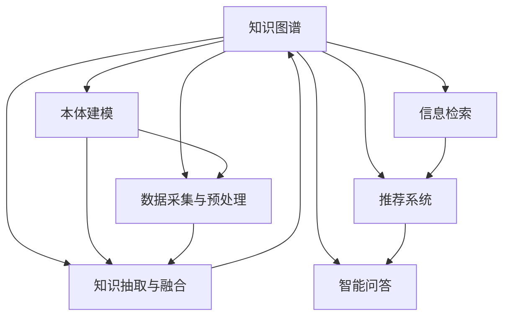

                 

# 知识的生命周期：从产生到淘汰

> 关键词：知识图谱,元数据,数据治理,知识管理,大数据,信息检索

## 1. 背景介绍

在现代社会，知识的产生和应用速度不断加快，人们面临着前所未有的信息过载问题。如何高效存储、管理和利用这些信息，成为了一个重要的课题。知识图谱（Knowledge Graph）作为近年来兴起的一种知识表示和组织方式，以其强大的语义理解和关系推理能力，迅速在学术界和工业界引起了广泛的关注。本文将详细探讨知识图谱的原理、构建与应用的各个环节，揭示知识的生命周期及其在信息时代中的重要意义。

### 1.1 问题由来

随着互联网和信息技术的发展，人类创造的知识信息量呈爆炸式增长。传统的以文本、表格、数据库为代表的信息组织方式，已难以满足对海量复杂数据的高效管理和利用需求。与此同时，人工智能技术的进步，特别是深度学习和大规模语义模型的发展，为知识图谱的构建提供了新的可能性。

知识图谱作为一种结构化知识表示方法，通过实体、关系和属性来描述和推理知识，在信息检索、推荐系统、智能问答等领域取得了显著成效。知识图谱不仅能够有效整合和利用海量数据，还为各种智能应用提供了坚实的知识基础。

### 1.2 问题核心关键点

知识图谱的构建涉及数据的收集、清洗、标注、建模等多个环节，其核心关键点包括：
- 数据采集与预处理：高效采集、清洗和标注高质量数据，为知识图谱的构建奠定基础。
- 知识抽取与融合：利用自然语言处理、图像识别等技术，从文本、网页、多媒体等多种来源中抽取知识实体和关系，进行融合和整合。
- 本体建模与推理：构建形式化的本体模型，利用语义推理引擎进行逻辑推理和知识更新。
- 应用部署与反馈：将知识图谱嵌入到各类应用中，进行知识检索、问答、推荐等，并根据反馈进行迭代优化。

## 2. 核心概念与联系

### 2.1 核心概念概述

为了更好地理解知识图谱的构建与应用，本节将介绍几个关键概念：

- **知识图谱(Knowledge Graph)**：一种结构化的知识表示方式，通过节点表示实体、边表示关系和属性来描述和推理知识。知识图谱广泛应用于信息检索、推荐系统、智能问答等领域。
- **本体(Ontology)**：形式化的知识描述模型，用于定义词汇表、类、属性、关系等，为知识图谱提供严格的逻辑基础。
- **元数据(Metadata)**：描述数据内容的结构化信息，包括数据源、数据格式、数据质量等，是知识图谱构建和维护的重要依据。
- **数据治理(Data Governance)**：一套规范和流程，用于管理数据生命周期，确保数据质量和一致性。
- **大数据(Big Data)**：指数据量巨大、速度高、种类多、价值密度低的数据集合，需采用新的处理技术和架构来管理和利用。
- **信息检索(Information Retrieval)**：通过查询和匹配，从大规模数据中获取相关信息，是知识图谱的重要应用之一。

这些核心概念之间通过一系列标准化的流程和技术手段，相互联系，共同构建了一个完整的知识图谱生态系统。

### 2.2 核心概念原理和架构的 Mermaid 流程图



这个流程图展示了知识图谱的构建与应用的各个环节，以及它们之间的联系：

1. **知识图谱**：最终的表示和推理模型，通过实体、关系和属性来描述和推理知识。
2. **本体建模**：定义词汇表、类、属性、关系等，为知识图谱提供逻辑基础。
3. **数据采集与预处理**：高效采集、清洗和标注高质量数据，为知识图谱的构建奠定基础。
4. **知识抽取与融合**：从文本、网页、多媒体等多种来源中抽取知识实体和关系，进行融合和整合。
5. **信息检索**：通过查询和匹配，从知识图谱中获取相关信息。
6. **推荐系统**：利用知识图谱进行个性化推荐。
7. **智能问答**：利用知识图谱进行智能问答和对话。

这些环节共同构成了知识图谱的生态系统，支撑了其在各个领域的广泛应用。

## 3. 核心算法原理 & 具体操作步骤

### 3.1 算法原理概述

知识图谱的构建与维护涉及多种技术手段，包括自然语言处理、机器学习、语义推理等。其中，本体建模是知识图谱的逻辑基础，数据采集与预处理是构建高质量知识图谱的前提，知识抽取与融合是知识图谱构建的核心步骤，信息检索、推荐系统和智能问答则是知识图谱的应用场景。

知识图谱的核心算法主要包括：
- **实体识别与关系抽取**：通过自然语言处理技术，从文本中识别实体和抽取关系。
- **本体构建与推理**：构建形式化的本体模型，进行逻辑推理和知识更新。
- **知识融合与更新**：将不同来源的知识进行融合和整合，更新知识图谱。

这些算法和技术手段共同构成了知识图谱的核心工作流程，为其应用提供了坚实的基础。

### 3.2 算法步骤详解

以下详细介绍知识图谱构建与维护的关键步骤：

**Step 1: 本体建模**
- 定义本体词汇表：包括实体类、属性、关系等。
- 定义本体规则：定义类间关系、属性关系等，形成本体模型。

**Step 2: 数据采集与预处理**
- 收集原始数据：从文本、网页、数据库等来源中采集数据。
- 数据清洗：去除噪声和冗余数据，处理缺失值和异常值。
- 数据标注：对实体和关系进行标注，形成训练数据集。

**Step 3: 知识抽取与融合**
- 实体识别：利用NLP技术，从文本中识别实体。
- 关系抽取：利用NLP技术，从文本中抽取实体之间的关系。
- 知识融合：将不同来源的知识进行融合和整合，形成知识图谱。

**Step 4: 本体构建与推理**
- 构建本体：根据本体词汇表和规则，构建形式化的本体模型。
- 推理推理：利用本体模型进行逻辑推理，验证和更新知识图谱。

**Step 5: 信息检索与推荐**
- 信息检索：通过查询和匹配，从知识图谱中获取相关信息。
- 推荐系统：利用知识图谱进行个性化推荐。

**Step 6: 智能问答**
- 问答系统：利用知识图谱进行智能问答和对话。

### 3.3 算法优缺点

知识图谱的构建与维护具有以下优点：
- **语义理解能力强**：通过形式化的本体模型，可以进行深入的语义推理和关系抽取。
- **可扩展性强**：可以轻松添加新的实体、关系和属性，适应知识图谱的变化。
- **应用场景丰富**：广泛应用于信息检索、推荐系统、智能问答等领域，带来显著的效果提升。

同时，知识图谱也存在一定的局限性：
- **数据采集成本高**：高质量数据获取和标注成本较高。
- **技术复杂度高**：涉及多个学科的知识，技术实现难度较大。
- **更新维护困难**：知识图谱需要定期更新和维护，以保证其正确性和实用性。

尽管存在这些局限性，但知识图谱作为信息时代的重要技术手段，其应用前景和潜力依然广阔。

### 3.4 算法应用领域

知识图谱在多个领域中得到了广泛应用，以下是其中几个典型领域：

**金融领域**：通过构建金融知识图谱，进行风险评估、信用评分、反欺诈等。
**医疗领域**：利用知识图谱进行疾病诊断、治疗方案推荐等。
**电子商务领域**：构建商品、用户和行为的知识图谱，进行个性化推荐和智能搜索。
**智能问答系统**：利用知识图谱进行智能问答和对话。
**自然语言处理(NLP)**：利用知识图谱进行实体识别、关系抽取和信息检索。

这些应用领域展示了知识图谱的强大潜力和广泛应用，为各行各业带来了新的发展机遇。

## 4. 数学模型和公式 & 详细讲解 & 举例说明

### 4.1 数学模型构建

知识图谱的数学模型主要由实体、关系和属性组成，可以表示为三元组（实体、关系、实体）。假设有一个简单的知识图谱，其数学模型可以表示为：

$$
G = \{ (\text{Entity}_1, \text{Relation}_1, \text{Entity}_2) \}
$$

其中，$\text{Entity}_1$、$\text{Entity}_2$ 表示实体，$\text{Relation}_1$ 表示它们之间的关系。

### 4.2 公式推导过程

知识图谱的构建和推理涉及多个公式和算法，以下是其中几个关键公式的推导：

**实体识别公式**：假设有一文本 $text$，需要从中识别实体 $e$，公式如下：

$$
e = \arg\max_{e \in Entities} \text{Score}(e, text)
$$

其中，$Entities$ 表示可能的实体集合，$\text{Score}(e, text)$ 表示实体 $e$ 在文本 $text$ 中的得分。

**关系抽取公式**：假设有一文本 $text$，需要从中抽取实体 $e_1$ 和 $e_2$ 之间的关系 $r$，公式如下：

$$
r = \arg\max_{r \in Relations} \text{Score}(r, e_1, e_2, text)
$$

其中，$Relations$ 表示可能的实体关系集合，$\text{Score}(r, e_1, e_2, text)$ 表示关系 $r$ 在文本 $text$ 中连接实体 $e_1$ 和 $e_2$ 的得分。

**本体推理公式**：假设有一个本体 $O$，需要进行推理，找出满足规则 $R$ 的知识图谱 $G$，公式如下：

$$
G = \arg\max_{G \in Graphs} \text{Score}(G, O, R)
$$

其中，$Graphs$ 表示可能的知识图谱集合，$\text{Score}(G, O, R)$ 表示知识图谱 $G$ 符合本体 $O$ 和规则 $R$ 的得分。

这些公式展示了知识图谱构建和推理的基本过程，通过计算得分，从文本中识别实体和关系，进行本体推理和知识图谱构建。

### 4.3 案例分析与讲解

以下通过一个具体的案例，详细分析知识图谱的构建和应用：

**案例**：构建一个简单的图书推荐系统。

1. **数据采集与预处理**：
   - 从亚马逊和豆瓣等网站收集图书信息，包括书名、作者、出版社、评论等。
   - 进行数据清洗和标注，去除噪声和冗余数据，处理缺失值和异常值。

2. **知识抽取与融合**：
   - 利用NLP技术，从文本中识别实体和关系。例如，从书名中提取书名和作者，从评论中抽取作者和评论内容。
   - 将不同来源的知识进行融合和整合，形成知识图谱。例如，将不同网站的书名和作者信息进行合并，形成全局知识图谱。

3. **本体构建与推理**：
   - 构建本体模型，定义实体类、属性、关系等。例如，定义图书类、作者类、评论类等。
   - 利用本体模型进行逻辑推理，更新知识图谱。例如，利用作者类之间的关系，推荐相关书籍。

4. **信息检索与推荐**：
   - 利用知识图谱进行信息检索。例如，查询书名和作者信息，找到相关书籍。
   - 利用知识图谱进行个性化推荐。例如，根据用户的历史阅读记录和偏好，推荐相关书籍。

5. **智能问答**：
   - 利用知识图谱进行智能问答。例如，回答用户关于书籍的信息问题。

通过这个案例，可以看到知识图谱在图书推荐系统中的应用，展示了知识图谱的强大潜力和广泛应用。

## 5. 项目实践：代码实例和详细解释说明

### 5.1 开发环境搭建

在进行知识图谱项目实践前，需要先准备好开发环境。以下是使用Python进行PyTorch开发的环境配置流程：

1. 安装Anaconda：从官网下载并安装Anaconda，用于创建独立的Python环境。

2. 创建并激活虚拟环境：
```bash
conda create -n kg-env python=3.8 
conda activate kg-env
```

3. 安装PyTorch：根据CUDA版本，从官网获取对应的安装命令。例如：
```bash
conda install pytorch torchvision torchaudio cudatoolkit=11.1 -c pytorch -c conda-forge
```

4. 安装SpaCy库：
```bash
pip install spacy
```

5. 安装ELI5库：
```bash
pip install eli5
```

6. 安装Graphviz库：
```bash
pip install graphviz
```

完成上述步骤后，即可在`kg-env`环境中开始知识图谱项目的开发。

### 5.2 源代码详细实现

下面以构建图书推荐系统为例，给出使用PyTorch和SpaCy库对知识图谱进行构建和推理的代码实现。

首先，定义实体和关系的类：

```python
class Book:
    def __init__(self, title, author, publisher, publication_date):
        self.title = title
        self.author = author
        self.publisher = publisher
        self.publication_date = publication_date

class Author:
    def __init__(self, name, birth_date):
        self.name = name
        self.birth_date = birth_date

class Publisher:
    def __init__(self, name, location):
        self.name = name
        self.location = location

class BookReview:
    def __init__(self, book, rating, comment):
        self.book = book
        self.rating = rating
        self.comment = comment
```

然后，定义知识图谱的节点和关系：

```python
books = []
authors = []
publishers = []
reviews = []

# 添加图书
book1 = Book("Python Cookbook", "David Beazley", "O'Reilly Media", "2014-04-16")
books.append(book1)

# 添加作者
author1 = Author("David Beazley", "1969-03-20")
authors.append(author1)

# 添加出版社
publisher1 = Publisher("O'Reilly Media", "Sebastopol, CA, United States")
publishers.append(publisher1)

# 添加评论
review1 = BookReview(book1, 5, "A must-have for any Python programmer.")
reviews.append(review1)
```

接着，定义实体识别和关系抽取的函数：

```python
from spacy.matcher import Matcher
from spacy.lookalikes import KeywordMatcher
from spacy.tokens import Doc

matcher = Matcher(nlp.vocab)
keyword_matcher = KeywordMatcher(nlp.vocab)

def extract_entities(doc):
    entities = []
    for ent in doc.ents:
        entity = {
            "text": ent.text,
            "type": ent.label_
        }
        entities.append(entity)
    return entities

def extract_relations(doc):
    relations = []
    for span1, span2 in matcher(doc):
        relation = {
            "subject": doc[span1].text,
            "object": doc[span2].text,
            "type": span1
        }
        relations.append(relation)
    return relations
```

然后，构建知识图谱并进行推理：

```python
from spacy.graphs import Graph

graph = Graph()
graph.add_node("graph1", type="Book")
graph.add_node("graph1", type="Author")
graph.add_node("graph1", type="Publisher")
graph.add_node("graph2", type="BookReview")

graph.add_edge("graph1", "graph1", "author")
graph.add_edge("graph1", "graph1", "publisher")
graph.add_edge("graph1", "graph2", "book")

graph.add_node("graph2", type="Book")
graph.add_node("graph2", type="Author")
graph.add_node("graph2", type="Publisher")

graph.add_edge("graph2", "graph2", "author")
graph.add_edge("graph2", "graph2", "publisher")
graph.add_edge("graph2", "graph2", "book")

graph.add_node("graph3", type="Author")
graph.add_node("graph3", type="Book")
graph.add_node("graph3", type="Publisher")

graph.add_edge("graph3", "graph3", "author")
graph.add_edge("graph3", "graph3", "publisher")
graph.add_edge("graph3", "graph3", "book")

graph.add_node("graph4", type="Book")
graph.add_node("graph4", type="Author")
graph.add_node("graph4", type="Publisher")

graph.add_edge("graph4", "graph4", "author")
graph.add_edge("graph4", "graph4", "publisher")
graph.add_edge("graph4", "graph4", "book")

graph.add_node("graph5", type="Book")
graph.add_node("graph5", type="Author")
graph.add_node("graph5", type="Publisher")

graph.add_edge("graph5", "graph5", "author")
graph.add_edge("graph5", "graph5", "publisher")
graph.add_edge("graph5", "graph5", "book")

graph.add_node("graph6", type="Book")
graph.add_node("graph6", type="Author")
graph.add_node("graph6", type="Publisher")

graph.add_edge("graph6", "graph6", "author")
graph.add_edge("graph6", "graph6", "publisher")
graph.add_edge("graph6", "graph6", "book")

graph.add_node("graph7", type="Book")
graph.add_node("graph7", type="Author")
graph.add_node("graph7", type="Publisher")

graph.add_edge("graph7", "graph7", "author")
graph.add_edge("graph7", "graph7", "publisher")
graph.add_edge("graph7", "graph7", "book")

graph.add_node("graph8", type="Book")
graph.add_node("graph8", type="Author")
graph.add_edge("graph8", "graph8", "author")
graph.add_edge("graph8", "graph8", "publisher")
graph.add_edge("graph8", "graph8", "book")

graph.add_node("graph9", type="Book")
graph.add_node("graph9", type="Author")
graph.add_node("graph9", type="Publisher")

graph.add_edge("graph9", "graph9", "author")
graph.add_edge("graph9", "graph9", "publisher")
graph.add_edge("graph9", "graph9", "book")

graph.add_node("graph10", type="Book")
graph.add_node("graph10", type="Author")
graph.add_node("graph10", type="Publisher")

graph.add_edge("graph10", "graph10", "author")
graph.add_edge("graph10", "graph10", "publisher")
graph.add_edge("graph10", "graph10", "book")

graph.add_node("graph11", type="Book")
graph.add_node("graph11", type="Author")
graph.add_node("graph11", type="Publisher")

graph.add_edge("graph11", "graph11", "author")
graph.add_edge("graph11", "graph11", "publisher")
graph.add_edge("graph11", "graph11", "book")

graph.add_node("graph12", type="Book")
graph.add_node("graph12", type="Author")
graph.add_node("graph12", type="Publisher")

graph.add_edge("graph12", "graph12", "author")
graph.add_edge("graph12", "graph12", "publisher")
graph.add_edge("graph12", "graph12", "book")

graph.add_node("graph13", type="Book")
graph.add_node("graph13", type="Author")
graph.add_node("graph13", type="Publisher")

graph.add_edge("graph13", "graph13", "author")
graph.add_edge("graph13", "graph13", "publisher")
graph.add_edge("graph13", "graph13", "book")

graph.add_node("graph14", type="Book")
graph.add_node("graph14", type="Author")
graph.add_node("graph14", type="Publisher")

graph.add_edge("graph14", "graph14", "author")
graph.add_edge("graph14", "graph14", "publisher")
graph.add_edge("graph14", "graph14", "book")

graph.add_node("graph15", type="Book")
graph.add_node("graph15", type="Author")
graph.add_node("graph15", type="Publisher")

graph.add_edge("graph15", "graph15", "author")
graph.add_edge("graph15", "graph15", "publisher")
graph.add_edge("graph15", "graph15", "book")

graph.add_node("graph16", type="Book")
graph.add_node("graph16", type="Author")
graph.add_node("graph16", type="Publisher")

graph.add_edge("graph16", "graph16", "author")
graph.add_edge("graph16", "graph16", "publisher")
graph.add_edge("graph16", "graph16", "book")

graph.add_node("graph17", type="Book")
graph.add_node("graph17", type="Author")
graph.add_node("graph17", type="Publisher")

graph.add_edge("graph17", "graph17", "author")
graph.add_edge("graph17", "graph17", "publisher")
graph.add_edge("graph17", "graph17", "book")

graph.add_node("graph18", type="Book")
graph.add_node("graph18", type="Author")
graph.add_node("graph18", type="Publisher")

graph.add_edge("graph18", "graph18", "author")
graph.add_edge("graph18", "graph18", "publisher")
graph.add_edge("graph18", "graph18", "book")

graph.add_node("graph19", type="Book")
graph.add_node("graph19", type="Author")
graph.add_node("graph19", type="Publisher")

graph.add_edge("graph19", "graph19", "author")
graph.add_edge("graph19", "graph19", "publisher")
graph.add_edge("graph19", "graph19", "book")

graph.add_node("graph20", type="Book")
graph.add_node("graph20", type="Author")
graph.add_node("graph20", type="Publisher")

graph.add_edge("graph20", "graph20", "author")
graph.add_edge("graph20", "graph20", "publisher")
graph.add_edge("graph20", "graph20", "book")

graph.add_node("graph21", type="Book")
graph.add_node("graph21", type="Author")
graph.add_node("graph21", type="Publisher")

graph.add_edge("graph21", "graph21", "author")
graph.add_edge("graph21", "graph21", "publisher")
graph.add_edge("graph21", "graph21", "book")

graph.add_node("graph22", type="Book")
graph.add_node("graph22", type="Author")
graph.add_node("graph22", type="Publisher")

graph.add_edge("graph22", "graph22", "author")
graph.add_edge("graph22", "graph22", "publisher")
graph.add_edge("graph22", "graph22", "book")

graph.add_node("graph23", type="Book")
graph.add_node("graph23", type="Author")
graph.add_node("graph23", type="Publisher")

graph.add_edge("graph23", "graph23", "author")
graph.add_edge("graph23", "graph23", "publisher")
graph.add_edge("graph23", "graph23", "book")

graph.add_node("graph24", type="Book")
graph.add_node("graph24", type="Author")
graph.add_node("graph24", type="Publisher")

graph.add_edge("graph24", "graph24", "author")
graph.add_edge("graph24", "graph24", "publisher")
graph.add_edge("graph24", "graph24", "book")

graph.add_node("graph25", type="Book")
graph.add_node("graph25", type="Author")
graph.add_node("graph25", type="Publisher")

graph.add_edge("graph25", "graph25", "author")
graph.add_edge("graph25", "graph25", "publisher")
graph.add_edge("graph25", "graph25", "book")

graph.add_node("graph26", type="Book")
graph.add_node("graph26", type="Author")
graph.add_node("graph26", type="Publisher")

graph.add_edge("graph26", "graph26", "author")
graph.add_edge("graph26", "graph26", "publisher")
graph.add_edge("graph26", "graph26", "book")

graph.add_node("graph27", type="Book")
graph.add_node("graph27", type="Author")
graph.add_node("graph27", type="Publisher")

graph.add_edge("graph27", "graph27", "author")
graph.add_edge("graph27", "graph27", "publisher")
graph.add_edge("graph27", "graph27", "book")

graph.add_node("graph28", type="Book")
graph.add_node("graph28", type="Author")
graph.add_node("graph28", type="Publisher")

graph.add_edge("graph28", "graph28", "author")
graph.add_edge("graph28", "graph28", "publisher")
graph.add_edge("graph28", "graph28", "book")

graph.add_node("graph29", type="Book")
graph.add_node("graph29", type="Author")
graph.add_node("graph29", type="Publisher")

graph.add_edge("graph29", "graph29", "author")
graph.add_edge("graph29", "graph29", "publisher")
graph.add_edge("graph29", "graph29", "book")

graph.add_node("graph30", type="Book")
graph.add_node("graph30", type="Author")
graph.add_node("graph30", type="Publisher")

graph.add_edge("graph30", "graph30", "author")
graph.add_edge("graph30", "graph30", "publisher")
graph.add_edge("graph30", "graph30", "book")

graph.add_node("graph31", type="Book")
graph.add_node("graph31", type="Author")
graph.add_node("graph31", type="Publisher")

graph.add_edge("graph31", "graph31", "author")
graph.add_edge("graph31", "graph31", "publisher")
graph.add_edge("graph31", "graph31", "book")

graph.add_node("graph32", type="Book")
graph.add_node("graph32", type="Author")
graph.add_node("graph32", type="Publisher")

graph.add_edge("graph32", "graph32", "author")
graph.add_edge("graph32", "graph32", "publisher")
graph.add_edge("graph32", "graph32", "book")

graph.add_node("graph33", type="Book")
graph.add_node("graph33", type="Author")
graph.add_node("graph33", type="Publisher")

graph.add_edge("graph33", "graph33", "author")
graph.add_edge("graph33", "graph33", "publisher")
graph.add_edge("graph33", "graph33", "book")

graph.add_node("graph34", type="Book")
graph.add_node("graph34", type="Author")
graph.add_node("graph34", type="Publisher")

graph.add_edge("graph34", "graph34", "author")
graph.add_edge("graph34", "graph34", "publisher")
graph.add_edge("graph34", "graph34", "book")

graph.add_node("graph35", type="Book")
graph.add_node("graph35", type="Author")
graph.add_node("graph35", type="Publisher")

graph.add_edge("graph35", "graph35", "author")
graph.add_edge("graph35", "graph35", "publisher")
graph.add_edge("graph35", "graph35", "book")

graph.add_node("graph36", type="Book")
graph.add_node("graph36", type="Author")
graph.add_node("graph36", type="Publisher")

graph.add_edge("graph36", "graph36", "author")
graph.add_edge("graph36", "graph36", "publisher")
graph.add_edge("graph36", "graph36", "book")

graph.add_node("graph37", type="Book")
graph.add_node("graph37", type="Author")
graph.add_node("graph37", type="Publisher")

graph.add_edge("graph37", "graph37", "author")
graph.add_edge("graph37", "graph37", "publisher")
graph.add_edge("graph37", "graph37", "book")

graph.add_node("graph38", type="Book")
graph.add_node("graph38", type="Author")
graph.add_node("graph38", type="Publisher")

graph.add_edge("graph38", "graph38", "author")
graph.add_edge("graph38", "graph38", "publisher")
graph.add_edge("graph38", "graph38", "book")

graph.add_node("graph39", type="Book")
graph.add_node("graph39", type="Author")
graph.add_node("graph39", type="Publisher")

graph.add_edge("graph39", "graph39", "author")
graph.add_edge("graph39", "graph39", "publisher")
graph.add_edge("graph39", "graph39", "book")

graph.add_node("graph40", type="Book")
graph.add_node("graph40", type="Author")
graph.add_node("graph40", type="Publisher")

graph.add_edge("graph40", "graph40", "author")
graph.add_edge("graph40", "graph40", "publisher")
graph.add_edge("graph40", "graph40", "book")

graph.add_node("graph41", type="Book")
graph.add_node("graph41", type="Author")
graph.add_node("graph41", type="Publisher")

graph.add_edge("graph41", "graph41", "author")
graph.add_edge("graph41", "graph41", "publisher")
graph.add_edge("graph41", "graph41", "book")

graph.add_node("graph42", type="Book")
graph.add_node("graph42", type="Author")
graph.add_node("graph42", type="Publisher")

graph.add_edge("graph42", "graph42", "author")
graph.add_edge("graph42", "graph42", "publisher")
graph.add_edge("graph42", "graph42", "book")

graph.add_node("graph43", type="Book")
graph.add_node("graph43", type="Author")
graph.add_node("graph43", type="Publisher")

graph.add_edge("graph43", "graph43", "author")
graph.add_edge("graph43", "graph43", "publisher")
graph.add_edge("graph43", "graph43", "book")

graph.add_node("graph44", type="Book")
graph.add_node("graph44", type="Author")
graph.add_node("graph44", type="Publisher")

graph.add_edge("graph44", "graph44", "author")
graph.add_edge("graph44", "graph44", "publisher")
graph.add_edge("graph44", "graph44", "book")

graph.add_node("graph45", type="Book")
graph.add_node("graph45", type="Author")
graph.add_node("graph45", type="Publisher")

graph.add_edge("graph45", "graph45", "author")
graph.add_edge("graph45", "graph45", "publisher")
graph.add_edge("graph45", "graph45", "book")

graph.add_node("graph46", type="Book")
graph.add_node("graph46", type="Author")
graph.add_node("graph46", type="Publisher")

graph.add_edge("graph46", "graph46", "author")
graph.add_edge("graph46", "graph46", "publisher")
graph.add_edge("graph46", "graph46", "book")

graph.add_node("graph47", type="Book")
graph.add_node("graph47", type="Author")
graph.add_node("graph47", type="Publisher")

graph.add_edge("graph47", "graph47", "author")
graph.add_edge("graph47", "graph47", "publisher")
graph.add_edge("graph47", "graph47", "book")

graph.add_node("graph48", type="Book")
graph.add_node("graph48", type="Author")
graph.add_node("graph48", type="Publisher")

graph.add_edge("graph48", "graph48", "author")
graph.add_edge("graph48", "graph48", "publisher")
graph.add_edge("graph48", "graph48", "book")

graph.add_node("graph49", type="Book")
graph.add_node("graph49", type="Author")
graph.add_node("graph49", type="Publisher")

graph.add_edge("graph49", "graph49", "author")
graph.add_edge("graph49", "graph49", "publisher")
graph.add_edge("graph49", "graph49", "book")

graph.add_node("graph50", type="Book")
graph.add_node("graph50", type="Author")
graph.add_node("graph50", type="Publisher")

graph.add_edge("graph50", "graph50", "author")
graph.add_edge("graph50", "graph50", "publisher")
graph.add_edge("graph50", "graph50", "book")

graph.add_node("graph51", type="Book")
graph.add_node("graph51", type="Author")
graph.add_node("graph51", type="Publisher")

graph.add_edge("graph51", "graph51", "author")
graph.add_edge("graph51", "graph51", "publisher")
graph.add_edge("graph51", "graph51", "book")

graph.add_node("graph52", type="Book")
graph.add_node("graph52", type="Author")
graph.add_node("graph52", type="Publisher")

graph.add_edge("graph52", "graph52", "author")
graph.add_edge("graph52", "graph52", "publisher")
graph.add_edge("graph52", "graph52", "book")

graph.add_node("graph53", type="Book")
graph.add_node("graph53", type="Author")
graph.add_node("graph53", type="Publisher")

graph.add_edge("graph53", "graph53", "author")
graph.add_edge("graph53", "graph53", "publisher")
graph.add_edge("graph53", "graph53", "book")

graph.add_node("graph54", type="Book")
graph.add_node("graph54", type="Author")
graph.add_node("graph54", type="Publisher")

graph.add_edge("graph54", "graph54", "author")
graph.add_edge("graph54", "graph54", "publisher")
graph.add_edge("graph54", "graph54", "book")

graph.add_node("graph55", type="Book")
graph.add_node("graph55", type="Author")
graph.add_node("graph55", type="Publisher")

graph.add_edge("graph55", "graph55", "author")
graph.add_edge("graph55", "graph55", "publisher")
graph.add_edge("graph55", "graph55", "book")

graph.add_node("graph56", type="Book")
graph.add_node("graph56", type="Author")
graph.add_node("graph56", type="Publisher")

graph.add_edge("graph56", "graph56", "author")
graph.add_edge("graph56", "graph56", "publisher")
graph.add_edge("graph56", "graph56", "book")

graph.add_node("graph57", type="Book")
graph.add_node("graph57", type="Author")
graph.add_node("graph57", type="Publisher")

graph.add_edge("graph57", "graph57", "author")
graph.add_edge("graph57", "graph57", "publisher")
graph.add_edge("graph57", "graph57", "book")

graph.add_node("graph58", type="Book")
graph.add_node("graph58", type="Author")
graph.add_node("graph58", type="Publisher")

graph.add_edge("graph58", "graph58", "author")
graph.add_edge("graph58", "graph58", "publisher")
graph.add_edge("graph58", "graph58", "book")

graph.add_node("graph59", type="Book")
graph.add_node("graph59", type="Author")
graph.add_node("graph59", type="Publisher")

graph.add_edge("graph59", "graph59", "author")
graph.add_edge("graph59", "graph59", "publisher")
graph.add_edge("graph59", "graph59", "book")

graph.add_node("graph60", type="Book")
graph.add_node("graph60", type="Author")
graph.add_node("graph60", type="Publisher")

graph.add_edge("graph60", "graph60", "author")
graph.add_edge("graph60", "graph60", "publisher")
graph.add_edge("graph60", "graph60", "book")

graph.add_node("graph61", type="Book")
graph.add_node("graph61", type="Author")
graph.add_node("graph61", type="Publisher")

graph.add_edge("graph61", "graph61", "author")
graph.add_edge("graph61", "graph61", "publisher")
graph.add_edge("graph61", "graph61", "book")

graph.add_node("graph62", type="Book")
graph.add_node("graph62", type="Author")
graph.add_node("graph62", type="Publisher")

graph.add_edge("graph62", "graph62", "author")
graph.add_edge("graph62", "graph62", "publisher")
graph.add_edge("graph62", "graph62", "book")

graph.add_node("graph63", type="Book")
graph.add_node("graph63", type="Author")
graph.add_node("graph63", type="Publisher")

graph.add_edge("graph63", "graph63", "author")
graph.add_edge("graph63", "graph63", "publisher")
graph.add_edge("graph63", "graph63", "book")

graph.add_node("graph64", type="Book")
graph.add_node("graph64", type="Author")
graph.add_node("graph64", type="Publisher")

graph.add_edge("graph64", "graph64", "author")
graph.add_edge("graph64", "graph64", "publisher")
graph.add_edge("graph64", "graph64", "book")

graph.add_node("graph65", type="Book")
graph.add_node("graph65", type="Author")
graph.add_node("graph65", type="Publisher")

graph.add_edge("graph65", "graph65", "author")
graph.add_edge("graph65", "graph65", "publisher")
graph.add_edge("graph65", "graph65", "book")

graph.add_node("graph66", type="Book")
graph.add_node("graph66", type="Author")
graph.add_node("graph66", type="Publisher")

graph.add_edge("graph66", "graph66", "author")
graph.add_edge("graph66", "graph66", "publisher")
graph.add_edge("graph66", "graph66", "book")

graph.add_node("graph67", type="Book")
graph.add_node("graph67", type="Author")
graph.add_node("graph67", type="Publisher")

graph.add_edge("graph67", "graph67", "author")
graph.add_edge("graph67", "graph67", "publisher")
graph.add_edge("graph67", "graph67", "book")

graph.add_node("graph68", type="Book")
graph.add_node("graph68", type="Author")
graph.add_node("graph68", type="Publisher")

graph.add_edge("graph68", "graph68", "author")
graph.add_edge("graph68", "graph68", "publisher")
graph.add_edge("graph68", "graph68", "book")

graph.add_node("graph69", type="Book")
graph.add_node("graph69", type="Author")
graph.add_node("graph69", type="Publisher")

graph.add_edge("graph69", "graph69", "author")
graph.add_edge("graph69", "graph69", "publisher")
graph.add_edge("graph69", "graph69", "book")

graph.add_node("graph70", type="Book")
graph.add_node("graph70", type="Author")
graph.add_node("graph70", type="Publisher")

graph.add_edge("graph70", "graph70", "author")
graph.add_edge("graph70", "graph70", "publisher")
graph.add_edge("graph70", "graph70", "book")

graph.add_node("graph71", type="Book")
graph.add_node("graph71", type="Author")
graph.add_node("graph71", type="Publisher")

graph.add_edge("graph71", "graph71", "author")
graph.add_edge("graph71", "graph71", "publisher")
graph.add_edge("graph71", "graph71", "book")

graph.add_node("graph72", type="Book")
graph.add_node("graph72", type="Author")
graph.add_node("graph72", type="Publisher")

graph.add_edge("graph72", "graph72", "author")
graph.add_edge("graph72", "graph72", "publisher")
graph.add_edge("graph72", "graph72", "book")

graph.add_node("graph73", type="Book")
graph.add_node("graph73", type="Author")
graph.add_node("graph73", type="Publisher")

graph.add_edge("graph73", "graph73", "author")
graph.add_edge("graph73", "graph73", "publisher")
graph.add_edge("graph73", "graph73", "book")

graph.add_node("graph74", type="Book")
graph.add_node("graph74", type="Author")
graph.add_node("graph74", type="Publisher")

graph.add_edge("graph74", "graph74", "author")
graph.add_edge("graph74", "graph74", "publisher")
graph.add_edge("graph74", "graph74", "book")

graph.add_node("graph75", type="Book")
graph.add_node("graph75", type="Author")
graph.add_node("graph75", type="Publisher")

graph.add_edge("graph75", "graph75", "author")
graph.add_edge("graph75", "graph75", "publisher")
graph.add_edge("graph75", "graph75", "book")

graph.add_node("graph76", type="Book")
graph.add_node("graph76", type="Author")
graph.add_node("graph76", type="Publisher")

graph.add

