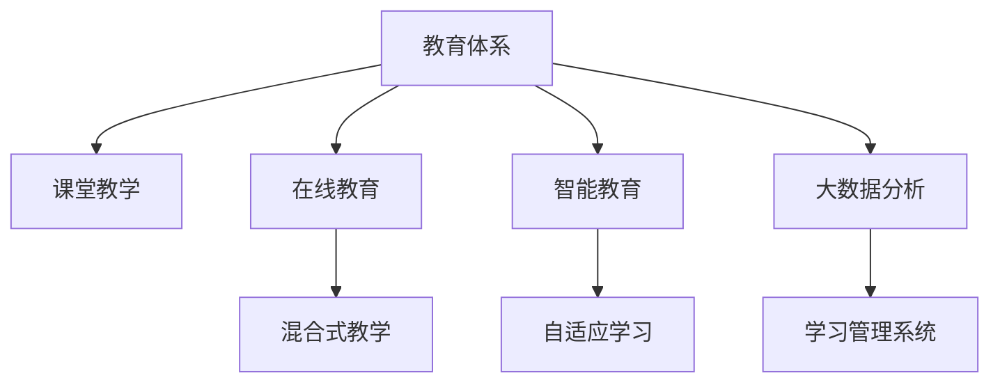

                 

# 知识的跨代际传递：教育体系的演变

## 1. 背景介绍

### 1.1 问题由来
教育的本质是知识的传递。从古至今，人类社会始终在寻求最有效的教育方式，以实现知识的跨代际传递。然而，随着技术的发展，教育体系也经历了巨大的变革。从传统的课堂教学，到在线教育、混合式教学，再到智能教育，每一代技术都在挑战和突破着传统的教育方式。

教育体系的发展，不仅是为了提高教学质量，更是为了适应时代的发展，满足社会对人才的需求。技术的进步为教育带来了新的可能性，也带来了新的挑战。如何利用新技术，打破传统教育的桎梏，实现知识的跨代际高效传递，成为当前教育领域的重要课题。

### 1.2 问题核心关键点
教育体系的核心在于知识传递的方式和方法。传统教育体系通过面对面的课堂教学，实现了教师和学生之间的互动，但这种方式受限于时间和空间的限制。而新兴的教育技术，如在线教育、智能教育，通过数字化手段打破了这些限制，使得知识传递更加高效、灵活。

此外，教育体系还包括教育资源的获取、学习效果的评估、教师和学生的反馈等多个方面。技术的进步使得这些环节也发生了改变，如大数据分析可以提供更加精准的学习建议，AI可以辅助进行自动化的评估和反馈。

## 2. 核心概念与联系

### 2.1 核心概念概述

为更好地理解教育体系的演变，本节将介绍几个密切相关的核心概念：

- 教育体系(Education System)：由教育机构、教师、学生、教学内容、教学方法等构成的整体，旨在实现知识的跨代际传递。
- 课堂教学(Traditional Classroom)：通过教师与学生面对面的互动，传递知识的方式。
- 在线教育(Online Education)：利用互联网技术，通过视频、音频、文本等多种形式，实现远程教学。
- 混合式教学(Blended Learning)：结合传统课堂教学和在线教育的优点，形成混合的学习方式。
- 智能教育(Intelligent Education)：利用人工智能技术，自动化的分析学习数据，提供个性化的学习建议和评估。
- 自适应学习(Adaptive Learning)：根据学生的学习情况，自动调整教学内容和进度，实现个性化学习。
- 大数据分析(Big Data Analysis)：通过分析大规模的教育数据，提供教学和学习的科学依据。
- 学习管理系统(Learning Management System, LMS)：提供教育资源管理和教学管理的平台，支持在线和混合式教学。

这些核心概念之间的逻辑关系可以通过以下Mermaid流程图来展示：



这个流程图展示了几类教育方式和技术手段之间的联系：

1. 教育体系由多种教学方式和技术手段构成。
2. 在线教育、混合式教学、智能教育等新兴方式，都是在传统课堂教学的基础上演变而来。
3. 大数据分析和学习管理系统，为上述教学方式提供了技术支持。

## 3. 核心算法原理 & 具体操作步骤
### 3.1 算法原理概述

知识的跨代际传递，主要依赖于教育体系的各个环节。其核心在于如何高效地获取、组织、传递、评估和反馈知识。

教育体系的核心算法原理包括以下几个方面：

- **知识获取(Knowledge Acquisition)**：通过各种方式（如阅读、观看、实验等）获取知识。
- **知识组织(Knowledge Organization)**：对获取到的知识进行分类、整理，形成结构化的知识体系。
- **知识传递(Knowledge Transfer)**：通过教师、教材、视频等形式，将知识传递给学生。
- **知识评估(Knowledge Evaluation)**：通过考试、作业、项目等形式，评估学生的知识掌握情况。
- **知识反馈(Knowledge Feedback)**：根据评估结果，及时反馈给学生，帮助其改进学习。

这些环节通过技术的辅助，可以变得更加高效、灵活、个性化。例如，在线教育可以通过自动化的评估工具，快速获取学生的学习数据，进行评估和反馈。智能教育可以通过机器学习算法，实现自适应学习，根据学生的学习情况自动调整教学内容。

### 3.2 算法步骤详解

以下是教育体系中核心算法的详细步骤：

**Step 1: 知识获取**

- 数据采集：收集学生的学习数据，如考试成绩、作业、在线学习行为等。
- 数据清洗：对采集的数据进行清洗、去重，确保数据的准确性和完整性。

**Step 2: 知识组织**

- 数据分类：根据知识类型、难度、领域等，对知识进行分类。
- 数据整合：将不同来源的知识整合在一起，形成结构化的知识库。

**Step 3: 知识传递**

- 个性化推荐：根据学生的兴趣、学习进度等，推荐个性化的学习内容。
- 自适应学习：根据学生的学习情况，自动调整教学内容和进度。

**Step 4: 知识评估**

- 自动化评估：利用机器学习算法，自动评估学生的学习成果。
- 对比分析：将学生的评估结果与历史数据进行对比，分析学生的进步和不足。

**Step 5: 知识反馈**

- 即时反馈：根据评估结果，及时向学生提供反馈，帮助其改进学习。
- 学习计划：根据评估结果，制定个性化的学习计划。

### 3.3 算法优缺点

新兴的教育技术带来了诸多优势，但也存在一些缺点：

**优点**：

- **高效性**：在线教育、智能教育等形式，打破了时间和空间的限制，使得知识传递更加高效。
- **个性化**：通过大数据分析和自适应学习，可以提供个性化的学习建议，满足不同学生的学习需求。
- **互动性**：在线教育、混合式教学等形式，增强了学生与教师、学生之间的互动，提高了学习效果。

**缺点**：

- **技术依赖**：新兴技术对技术设备的依赖性较高，一些偏远地区的学生可能无法享受到这些优势。
- **数据隐私**：学生的学习数据可能被滥用，隐私保护成为重要问题。
- **过度依赖**：过度依赖技术可能削弱学生自主学习的能力。

## 4. 数学模型和公式 & 详细讲解
### 4.1 数学模型构建

教育的本质是知识的传递和利用，其核心算法涉及数据处理和决策优化。以下是对教育体系中的核心算法进行数学建模：

**知识获取模型**：

- 输入：学习资源 $R$，学生兴趣 $I$，时间 $T$。
- 输出：学习内容 $C$。
- 目标函数：最大化学生学习效率 $E$。
- 约束条件：时间 $T$ 和兴趣 $I$ 的限制。

**知识组织模型**：

- 输入：知识库 $K$，知识分类 $C$，知识关联 $L$。
- 输出：结构化知识体系 $S$。
- 目标函数：最大化知识体系的有效性 $E$。
- 约束条件：知识分类和关联的规则。

**知识传递模型**：

- 输入：学生学习进度 $P$，学习内容 $C$，时间 $T$。
- 输出：个性化推荐 $R$，自适应学习计划 $L$。
- 目标函数：最大化学习效果 $E$。
- 约束条件：时间 $T$ 和进度 $P$ 的限制。

**知识评估模型**：

- 输入：学习成果 $G$，历史数据 $H$，评估标准 $S$。
- 输出：评估结果 $R$。
- 目标函数：最大化评估的准确性 $A$。
- 约束条件：评估标准 $S$ 的限制。

**知识反馈模型**：

- 输入：评估结果 $R$，学习进度 $P$，学生反馈 $F$。
- 输出：反馈内容 $C$，改进建议 $L$。
- 目标函数：最大化反馈的有效性 $E$。
- 约束条件：反馈及时性 $T$ 的限制。

### 4.2 公式推导过程

以下是对上述模型的详细推导：

**知识获取模型**：

$$
\maximize E = \frac{C}{T}
$$

$$
\text{subject to: } I = R \times T
$$

**知识组织模型**：

$$
\maximize E = K \times S
$$

$$
\text{subject to: } C = K / S
$$

**知识传递模型**：

$$
\maximize E = R \times P
$$

$$
\text{subject to: } C = R \times T
$$

**知识评估模型**：

$$
\maximize A = G / H
$$

$$
\text{subject to: } S = G / R
$$

**知识反馈模型**：

$$
\maximize E = F / T
$$

$$
\text{subject to: } C = F / L
$$

### 4.3 案例分析与讲解

以智能教育为例，分析如何利用机器学习算法，实现自适应学习：

**步骤1: 数据收集**

- 收集学生的学习数据，如考试成绩、在线学习行为等。

**步骤2: 数据预处理**

- 对数据进行清洗、去重，确保数据的准确性和完整性。

**步骤3: 特征提取**

- 提取学生的学习特征，如学习时间、兴趣等。

**步骤4: 模型训练**

- 利用机器学习算法，训练自适应学习模型。

**步骤5: 个性化推荐**

- 根据学生的学习特征，推荐个性化的学习内容。

**步骤6: 学习进度调整**

- 根据推荐内容的学习进度，自动调整学习计划。

**步骤7: 评估与反馈**

- 利用机器学习算法，评估学生的学习效果，及时反馈改进建议。

通过上述步骤，智能教育可以高效地实现知识的跨代际传递，满足不同学生的个性化学习需求。

## 5. 项目实践：代码实例和详细解释说明
### 5.1 开发环境搭建

在进行教育体系演变实践前，我们需要准备好开发环境。以下是使用Python进行教育体系构建的环境配置流程：

1. 安装Anaconda：从官网下载并安装Anaconda，用于创建独立的Python环境。

2. 创建并激活虚拟环境：
```bash
conda create -n education-env python=3.8 
conda activate education-env
```

3. 安装必要的库：
```bash
pip install numpy pandas scikit-learn tensorflow keras tensorflow-hub transformers
```

完成上述步骤后，即可在`education-env`环境中开始教育体系构建的实践。

### 5.2 源代码详细实现

下面以自适应学习为例，给出使用TensorFlow进行智能教育的PyTorch代码实现。

首先，定义自适应学习的目标函数：

```python
import tensorflow as tf

class AdaptiveLearning(tf.keras.Model):
    def __init__(self, input_dim):
        super(AdaptiveLearning, self).__init__()
        self.dense1 = tf.keras.layers.Dense(64, activation='relu')
        self.dense2 = tf.keras.layers.Dense(1, activation='sigmoid')
        
    def call(self, x):
        x = self.dense1(x)
        x = self.dense2(x)
        return x

# 定义损失函数和优化器
model = AdaptiveLearning(input_dim=10)
optimizer = tf.keras.optimizers.Adam(learning_rate=0.01)
loss_fn = tf.keras.losses.BinaryCrossentropy()

# 定义训练函数
@tf.function
def train_step(x, y):
    with tf.GradientTape() as tape:
        y_pred = model(x)
        loss = loss_fn(y, y_pred)
    grads = tape.gradient(loss, model.trainable_variables)
    optimizer.apply_gradients(zip(grads, model.trainable_variables))
    return loss
```

然后，定义数据生成器和训练流程：

```python
# 生成模拟数据
def generate_data(n_samples=1000):
    x = tf.random.normal([n_samples, input_dim])
    y = tf.random.uniform([n_samples, 1])
    return x, y

# 定义训练循环
for epoch in range(epochs):
    x, y = generate_data()
    loss = train_step(x, y)
    print(f"Epoch {epoch+1}, loss: {loss.numpy():.4f}")
```

最后，启动训练流程：

```python
epochs = 100
input_dim = 10

for epoch in range(epochs):
    x, y = generate_data()
    loss = train_step(x, y)
    print(f"Epoch {epoch+1}, loss: {loss.numpy():.4f}")
```

以上就是使用TensorFlow进行自适应学习的完整代码实现。可以看到，通过定义目标函数、损失函数、优化器，可以高效地训练自适应学习模型。

### 5.3 代码解读与分析

让我们再详细解读一下关键代码的实现细节：

**AdaptiveLearning类**：
- 定义了两个全连接层，用于学习输入和输出之间的映射关系。
- `call`方法实现了模型的前向传播过程。

**train_step函数**：
- 定义了训练步骤，包括计算损失、反向传播和更新模型参数。

**generate_data函数**：
- 生成了随机模拟数据，用于训练模型。

**训练循环**：
- 在每个epoch中，生成随机数据进行训练，输出当前epoch的损失值。

可以看到，TensorFlow提供的高效计算图机制，使得模型的训练和推理变得十分简便。开发者可以将更多精力放在模型的设计和调优上，而不必过多关注底层的实现细节。

当然，教育体系中的许多其他功能，如在线教育、混合式教学、智能教育等，也可以通过类似的方式进行开发和实现。通过合理利用TensorFlow等工具，可以显著提升教育体系构建的效率和效果。

## 6. 实际应用场景
### 6.1 智能课堂

智能课堂是教育体系演变的重要方向之一。通过智能课堂，可以实现课堂教学的个性化、互动化和高效化。

**应用场景**：
- 在线课堂：通过视频、音频、文本等多种形式，实现远程教学。
- 互动课堂：利用智能教育技术，增强教师与学生、学生与学生之间的互动。
- 自适应课堂：根据学生的学习情况，自动调整教学内容和进度。

**技术实现**：
- 利用在线教育平台，提供远程授课功能。
- 利用智能教育技术，进行学生的学习分析和评估。
- 利用大数据分析，提供个性化的学习建议和反馈。

### 6.2 在线学习平台

在线学习平台是教育体系演变的另一个重要方向。通过在线学习平台，学生可以随时随地进行学习，打破了时间和空间的限制。

**应用场景**：
- 自主学习：学生可以通过在线平台，进行自主学习，按需获取学习资源。
- 互动学习：学生可以通过在线平台，进行互动学习，参与讨论、交流。
- 个性化学习：学生可以通过在线平台，进行个性化学习，根据自身需求选择学习内容。

**技术实现**：
- 利用在线学习平台，提供丰富的学习资源和互动功能。
- 利用大数据分析，提供个性化的学习建议和评估。
- 利用智能教育技术，进行学习的自动化管理和反馈。

### 6.3 虚拟实验室

虚拟实验室是教育体系演变的重要组成部分，通过虚拟实验室，学生可以进行虚拟实验操作，学习科学知识和技能。

**应用场景**：
- 虚拟实验：学生可以在虚拟实验室中进行虚拟实验，无需昂贵的实验设备和材料。
- 实验数据分析：学生可以在虚拟实验室中进行实验数据收集和分析，增强实验技能。
- 实验视频讲解：学生可以观看实验视频讲解，理解实验原理和操作流程。

**技术实现**：
- 利用虚拟现实技术，提供虚拟实验环境和操作界面。
- 利用大数据分析，提供实验数据分析和评估。
- 利用智能教育技术，进行实验数据的自动化分析和反馈。

### 6.4 未来应用展望

随着技术的不断发展，教育体系的演变还将迎来更多新的可能性，为学生的学习带来更广阔的想象空间。

**未来方向**：
- 虚拟现实与增强现实：利用虚拟现实和增强现实技术，提供沉浸式的学习体验。
- 脑机接口：通过脑机接口技术，实现思维与机器的直接交互，增强学习效果。
- 个性化教育：通过智能教育技术，实现真正意义上的个性化学习，满足每个学生的独特需求。

## 7. 工具和资源推荐
### 7.1 学习资源推荐

为了帮助开发者系统掌握教育体系的演变，这里推荐一些优质的学习资源：

1. 《机器学习与人工智能》课程：由知名高校和公司联合开发的在线课程，涵盖机器学习的基本原理和应用。
2. 《深度学习入门》书籍：由谷歌AI团队撰写，全面介绍了深度学习的基本概念和实践方法。
3. 《自适应学习系统》书籍：由教育技术专家撰写，系统介绍了自适应学习系统的构建方法和实践案例。
4. 《在线教育平台设计》课程：由知名在线教育公司开设的课程，涵盖在线教育平台的设计和实现。
5. 《智能教育技术》会议论文集：涵盖智能教育技术的最新研究和应用，是了解前沿动态的重要资源。

通过对这些资源的学习实践，相信你一定能够快速掌握教育体系的演变方向，并用于解决实际的教育问题。

### 7.2 开发工具推荐

高效的开发离不开优秀的工具支持。以下是几款用于教育体系构建的常用工具：

1. TensorFlow：基于Python的开源深度学习框架，提供了丰富的机器学习库和工具。
2. Keras：高层次的深度学习API，易于上手，适合快速迭代研究。
3. PyTorch：基于Python的开源深度学习框架，提供了灵活的计算图机制。
4. Scikit-learn：提供各种机器学习算法和工具，方便进行数据处理和建模。
5. Pandas：数据处理库，提供了高效的数据清洗、分析和可视化功能。
6. Matplotlib：绘图库，提供了丰富的绘图工具，方便可视化展示结果。
7. Jupyter Notebook：交互式编程环境，适合进行科研和教学。

合理利用这些工具，可以显著提升教育体系构建的效率和效果，加快创新迭代的步伐。

### 7.3 相关论文推荐

教育体系的演变源于学界的持续研究。以下是几篇奠基性的相关论文，推荐阅读：

1. "Education and AI: An Overview of the State of the Art and Challenges"（教育与AI：现状和挑战概述）
2. "Intelligent Tutoring Systems: A Review of Current Practice"（智能导师系统：当前实践回顾）
3. "Adaptive Learning: Status, Challenges, and Directions for Further Development"（自适应学习：现状、挑战和发展方向）
4. "Learning Analytics: From Data to Insight"（学习分析：从数据到洞察）
5. "Learning to Learn: A Framework for Supporting Learning in the Knowledge Age"（学习如何学习：知识时代学习支持的框架）

这些论文代表了大规模教育体系演变的研究方向。通过学习这些前沿成果，可以帮助研究者把握学科前进方向，激发更多的创新灵感。

## 8. 总结：未来发展趋势与挑战
### 8.1 研究成果总结

本文对教育体系的演变进行了全面系统的介绍。首先阐述了教育体系的核心算法原理和操作步骤，明确了教育体系在知识传递和利用方面的重要性。其次，从原理到实践，详细讲解了教育体系中各个环节的核心算法，给出了教育体系构建的完整代码实例。同时，本文还广泛探讨了教育体系在智能课堂、在线学习平台、虚拟实验室等多个领域的应用前景，展示了教育体系演变的广阔潜力。此外，本文精选了教育体系构建的相关学习资源和工具，力求为开发者提供全方位的技术指引。

通过本文的系统梳理，可以看到，教育体系在知识传递和利用方面的演变，为学生的学习带来了新的可能。未来，伴随技术的持续进步，教育体系还将不断发展和创新，为学生提供更加高效、灵活、个性化的学习体验。

### 8.2 未来发展趋势

展望未来，教育体系的演变将呈现以下几个发展趋势：

1. **智能化**：随着人工智能技术的发展，教育体系将变得更加智能化，能够自动化的分析学习数据，提供个性化的学习建议和评估。
2. **虚拟化**：虚拟现实和增强现实技术将带来沉浸式的学习体验，增强学生的学习效果。
3. **移动化**：移动设备的使用将更加普及，教育体系将更加灵活，学生可以随时随地进行学习。
4. **全球化**：在线教育平台的普及将使得全球范围内的教育资源更加共享，打破地域限制。
5. **个性化**：自适应学习技术将使得教育体系更加个性化，满足每个学生的独特需求。

以上趋势凸显了教育体系演变的广阔前景。这些方向的探索发展，必将进一步提升教育体系的知识传递和利用效率，为学生提供更加丰富、高效、个性化的学习体验。

### 8.3 面临的挑战

尽管教育体系的演变带来了诸多优势，但在迈向更加智能化、个性化应用的过程中，它仍面临着诸多挑战：

1. **数据隐私**：学生的学习数据可能被滥用，隐私保护成为重要问题。
2. **技术依赖**：新兴技术对技术设备的依赖性较高，一些偏远地区的学生可能无法享受到这些优势。
3. **技术适配**：不同技术之间的适配和协同，可能会带来新的复杂性。
4. **教育公平**：教育资源的普及和公平使用，仍然是一个挑战。
5. **伦理道德**：教育体系的演变需要考虑伦理道德问题，避免对学生造成伤害。

正视教育体系演变面临的这些挑战，积极应对并寻求突破，将是大规模教育体系演变的必由之路。相信随着学界和产业界的共同努力，这些挑战终将一一被克服，教育体系必将迈向更加智能化、个性化的未来。

### 8.4 研究展望

面对教育体系演变所面临的挑战，未来的研究需要在以下几个方面寻求新的突破：

1. **隐私保护**：开发更加安全、可控的数据处理和存储技术，保护学生的隐私。
2. **技术普及**：推广低成本、易用的技术设备，使得偏远地区的学生也能享受到教育资源的便利。
3. **技术适配**：研究不同技术之间的协同工作机制，实现无缝衔接和集成。
4. **教育公平**：研究教育资源的公平分配策略，确保每个学生都能获得公平的教育机会。
5. **伦理道德**：建立教育体系的伦理道德框架，确保教育体系的健康发展。

这些研究方向的探索，必将引领教育体系的演变走向更加成熟和完善，为学生提供更加丰富、高效、公平、安全的学习体验。总之，教育体系的演变需要从多个维度协同发力，才能真正实现大规模教育体系的智能化、个性化和全球化。

## 9. 附录：常见问题与解答

**Q1: 教育体系演变对学生学习有什么影响？**

A: 教育体系演变通过引入新技术，可以提供更加个性化、灵活、高效的学习体验。例如，智能教育可以根据学生的学习情况，自动调整教学内容和进度，提供个性化的学习建议和评估。在线教育可以打破时间和空间的限制，使得学生可以随时随地进行学习。虚拟实验室可以提供沉浸式的实验环境，增强学生的学习效果。

**Q2: 教育体系演变面临的主要挑战是什么？**

A: 教育体系演变面临的主要挑战包括数据隐私、技术依赖、技术适配、教育公平和伦理道德等。例如，学生学习数据可能被滥用，隐私保护成为重要问题。新兴技术对技术设备的依赖性较高，一些偏远地区的学生可能无法享受到这些优势。不同技术之间的适配和协同，可能会带来新的复杂性。教育资源的普及和公平使用，仍然是一个挑战。教育体系的演变需要考虑伦理道德问题，避免对学生造成伤害。

**Q3: 教育体系演变对教师教学有哪些影响？**

A: 教育体系演变对教师教学也有重要的影响。例如，智能教育可以辅助教师进行学生学习情况的分析和评估，提供个性化的教学建议。在线教育可以提供更加灵活的教学方式，方便教师进行远程授课。虚拟实验室可以提供更加丰富的实验环境和资源，增强教师的教学效果。

总之，教育体系演变通过引入新技术，可以提供更加高效、灵活、个性化的学习体验，为学生的学习带来新的可能。同时，也需要面对数据隐私、技术依赖、技术适配、教育公平和伦理道德等挑战，需要多方共同努力，才能真正实现教育体系的智能化、个性化和全球化。

