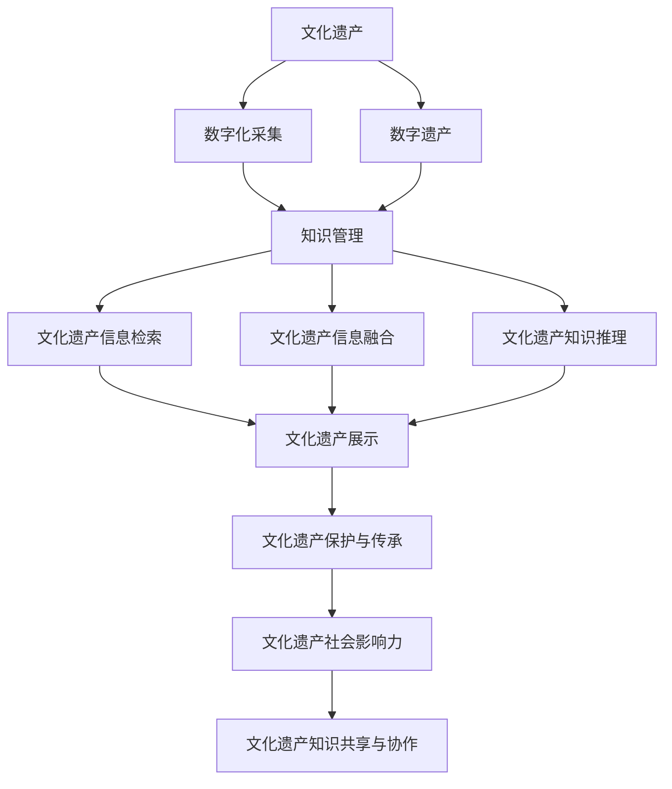

                 

## 1. 背景介绍

### 1.1 问题由来

文化遗产是人类历史、文化和社会发展的见证，是文化自信的源泉。近年来，随着数字化技术的普及，文化遗产的保护方式也在不断演进。从早期的静态图像和文字记录，到后来的3D扫描和虚拟重建，数字化技术为文化遗产保护提供了新的可能性。然而，这些数字化成果往往只是形式上的转化，难以有效管理和利用，未能充分发挥其价值。

为了解决这一问题，亟需将知识管理理念引入文化遗产保护领域，实现文化遗产的数字化、结构化、系统化和智能化管理。知识管理能够有效整合和利用文化遗产相关数据，帮助用户更全面地了解和保护文化遗产，实现文化遗产保护与传承的可持续发展。

### 1.2 问题核心关键点

知识管理在文化遗产保护中的应用，核心在于如何通过数据驱动的方法，实现文化遗产信息的全面收集、高效存储和智能应用。具体来说，包括以下几个关键点：

1. 文化遗产信息的数字化采集与存储：通过数字化技术，将文化遗产转化为数字格式，进行系统化存储，保证数据完整性和可访问性。

2. 知识整合与检索：将分散的、异构的文化遗产信息进行整合，建立统一的知识库，实现快速检索和重用。

3. 智能知识推理与预测：利用大数据、机器学习等技术，对文化遗产信息进行分析和挖掘，揭示其内在规律和关联，提升文化遗产保护的决策能力。

4. 多源数据的融合与协同：将不同来源的文化遗产信息进行融合，构建全链条的综合性知识体系，实现文化遗产保护的协同创新。

5. 跨领域知识共享与协作：打破不同学科和领域的知识壁垒，促进跨领域知识共享和协作，提升文化遗产保护的创新能力和影响范围。

### 1.3 问题研究意义

知识管理在文化遗产保护中的应用，对于文化遗产保护工作的现代化、智能化和全球化具有重要意义：

1. 提升文化遗产保护效率。知识管理能够有效整合和利用文化遗产数据，实现信息的高效存储和智能检索，减少人工处理的工作量，提升文化遗产保护的效率。

2. 提高文化遗产保护的科学性。通过数据分析和挖掘，揭示文化遗产的内在规律和关联，提高保护工作的科学性和预见性，避免盲目决策。

3. 促进文化遗产的跨学科研究。知识管理为不同学科领域的知识交流提供了平台，促进文化遗产保护的跨学科研究和创新，拓宽研究视角。

4. 增强文化遗产的社会影响力。知识管理的成果可以用于公众教育和文化传播，提升社会对文化遗产保护的认识和参与度。

## 2. 核心概念与联系

### 2.1 核心概念概述

为了更好地理解知识管理在文化遗产保护中的应用，本节将介绍几个密切相关的核心概念：

- 文化遗产(文化遗产资源)：指人类历史、文化和社会发展过程中创造和传承的物质和非物质遗存，包括文物、古迹、民俗、艺术等。

- 知识管理：指对知识资源进行收集、整理、存储、检索和应用的过程，旨在提高知识资源的可用性和利用效率。

- 数字遗产：指数字化形式的文化遗产，包括数字档案、数字图像、数字文献、数字地图等。

- 文化遗产信息检索：指对文化遗产信息进行检索、分类、组织和呈现的过程，实现文化遗产信息的快速访问和重用。

- 文化遗产信息融合：指将不同来源的文化遗产信息进行融合，构建综合性知识体系，实现文化遗产信息的全面展示和应用。

- 文化遗产知识推理：指利用数据分析和机器学习技术，对文化遗产信息进行分析和挖掘，揭示其内在规律和关联，提升文化遗产保护的决策能力。

- 文化遗产协同创新：指打破不同学科和领域的知识壁垒，促进跨领域知识共享和协作，提升文化遗产保护的创新能力和影响范围。

这些核心概念之间的逻辑关系可以通过以下Mermaid流程图来展示：



这个流程图展示了文化遗产管理的基本流程和关键环节：

1. 文化遗产通过数字化采集转化为数字遗产。
2. 数字遗产通过知识管理实现信息的整合、检索和应用。
3. 文化遗产信息通过检索和融合进行全面展示。
4. 利用知识推理揭示文化遗产的内在规律，提升保护决策。
5. 文化遗产知识通过共享与协作促进跨领域创新。
6. 最终实现文化遗产的保护与传承，提升社会影响力。

## 3. 核心算法原理 & 具体操作步骤
### 3.1 算法原理概述

知识管理在文化遗产保护中的应用，本质上是通过信息收集、整理、存储、检索和应用等环节，实现文化遗产信息的系统化、智能化管理。其核心算法原理包括：

- 文化遗产数字化采集：通过数字化技术，将文化遗产转化为数字格式，实现文化遗产信息的数字化。

- 知识整合与检索：将分散的、异构的文化遗产信息进行整合，建立统一的知识库，实现快速检索和重用。

- 智能知识推理：利用大数据、机器学习等技术，对文化遗产信息进行分析和挖掘，揭示其内在规律和关联，提升文化遗产保护的决策能力。

- 多源数据融合与协同：将不同来源的文化遗产信息进行融合，构建全链条的综合性知识体系，实现文化遗产保护的协同创新。

- 跨领域知识共享与协作：打破不同学科和领域的知识壁垒，促进跨领域知识共享和协作，提升文化遗产保护的创新能力和影响范围。

### 3.2 算法步骤详解

基于上述核心算法原理，知识管理在文化遗产保护中的应用主要包括以下几个关键步骤：

**Step 1: 文化遗产数字化采集**

- 收集文化遗产的文本、图像、音频、视频等形式的数据。
- 对数据进行预处理，如格式转换、质量修复、数据清洗等。
- 使用OCR、SIFT、CNN等技术进行图像和文本的数字化采集。

**Step 2: 知识整合与存储**

- 将采集到的数字遗产数据进行整合，建立统一的知识库。
- 对知识库进行分类、组织和元数据标注，保证数据的结构化和标准化。
- 使用数据库、数据仓库等技术，对文化遗产信息进行高效存储和管理。

**Step 3: 文化遗产信息检索**

- 建立文化遗产信息检索系统，支持快速检索和重用。
- 使用搜索引擎、信息检索算法（如TF-IDF、LDA等）对文化遗产信息进行检索。
- 提供检索结果的展示界面，支持用户进行多维度查询。

**Step 4: 智能知识推理**

- 利用大数据、机器学习等技术，对文化遗产信息进行分析和挖掘。
- 使用知识推理引擎，如RBAC、R2RML、D2R等，揭示文化遗产的内在规律和关联。
- 提供知识推理的可视化界面，帮助用户理解和应用文化遗产信息。

**Step 5: 多源数据融合与协同**

- 将不同来源的文化遗产信息进行融合，构建全链条的综合性知识体系。
- 使用数据融合算法，如多源数据融合、跨媒体融合等，实现数据的一致性和完整性。
- 促进跨领域知识共享和协作，提升文化遗产保护的创新能力和影响范围。

**Step 6: 跨领域知识共享与协作**

- 建立跨学科知识共享平台，打破学科壁垒，促进不同学科的知识交流和协作。
- 使用知识共享协议，如RDF、RSS等，实现知识的标准化和互操作性。
- 提供协作工具和平台，支持用户在文化遗产保护中协同工作。

### 3.3 算法优缺点

知识管理在文化遗产保护中的应用，具有以下优点：

1. 提高文化遗产保护效率。通过数字化采集和知识管理，实现文化遗产信息的系统化、智能化管理，减少人工处理的工作量，提升文化遗产保护的效率。

2. 提升文化遗产保护的科学性。利用大数据、机器学习等技术，对文化遗产信息进行分析和挖掘，揭示其内在规律和关联，提高保护工作的科学性和预见性，避免盲目决策。

3. 促进文化遗产的跨学科研究。知识管理为不同学科领域的知识交流提供了平台，促进文化遗产保护的跨学科研究和创新，拓宽研究视角。

4. 增强文化遗产的社会影响力。知识管理的成果可以用于公众教育和文化传播，提升社会对文化遗产保护的认识和参与度。

同时，该方法也存在一些局限性：

1. 数字化采集成本高。文化遗产数字化采集需要专业技术和设备，成本较高。

2. 知识库建立复杂。知识库的建立需要大量人力和时间，且需要专业知识和技术支持。

3. 数据隐私和安全问题。文化遗产信息可能涉及隐私和安全问题，需要在数据管理和应用中严格控制和保护。

4. 技术复杂度较高。知识管理涉及的技术复杂，需要跨学科的知识和技能，对团队和资源要求较高。

尽管存在这些局限性，但就目前而言，知识管理是文化遗产保护工作的必然趋势，其优势远远大于劣势。未来相关研究的重点在于如何进一步降低数字化采集和知识管理的成本，提高知识管理的自动化和智能化水平，同时兼顾数据隐私和安全问题。

### 3.4 算法应用领域

知识管理在文化遗产保护中的应用，已经广泛应用于多个领域，例如：

- 数字档案馆：将纸质档案数字化，实现档案信息的检索、管理和展示。
- 数字博物馆：将实物展品数字化，提供虚拟博物馆和互动展览。
- 数字图书馆：将纸质文献数字化，实现文献的检索、阅读和管理。
- 文化遗产数据库：建立文化遗产数据库，提供文化遗产信息的查询、分析和应用。
- 文化遗产数字化展览：利用数字技术展示文化遗产，实现文化遗产的传播和保护。
- 文化遗产数字化保护：利用数字化技术对文化遗产进行修复和保护，延长文化遗产的保存期限。

除了上述这些经典领域外，知识管理还在文化遗产数字化、文化遗产知识推理、文化遗产跨领域协同创新等方面，发挥着越来越重要的作用。随着数字化技术的发展和知识管理方法的创新，相信知识管理在文化遗产保护中的应用将会更加广泛和深入。

## 4. 数学模型和公式 & 详细讲解
### 4.1 数学模型构建

本节将使用数学语言对文化遗产知识管理的基本模型进行严格刻画。

设文化遗产资源集合为 $\mathcal{E}$，包含 $n$ 个文化遗产资源 $e_1, e_2, \dots, e_n$，每个资源 $e_i$ 的数字化信息为 $d_i$，知识库中的知识表示为 $\mathcal{K}$，知识检索系统为 $I$，智能推理系统为 $P$，多源数据融合系统为 $F$，跨领域知识共享系统为 $C$。则知识管理的基本模型可以表示为：

$$
\begin{aligned}
& \mathcal{E} = \{e_1, e_2, \dots, e_n\} \\
& d_i = f_{DI}(e_i) \\
& \mathcal{K} = \bigcup_{i=1}^n d_i \\
& \mathcal{I} = I(\mathcal{K}) \\
& \mathcal{P} = P(\mathcal{I}) \\
& \mathcal{F} = F(\mathcal{P}) \\
& \mathcal{C} = C(\mathcal{F})
\end{aligned}
$$

其中 $f_{DI}$ 表示数字化采集函数，$I$ 表示知识检索函数，$P$ 表示智能推理函数，$F$ 表示多源数据融合函数，$C$ 表示跨领域知识共享函数。

### 4.2 公式推导过程

以下我们以文化遗产数字化采集和知识库建立为例，推导相关公式。

**文化遗产数字化采集**：

假设文化遗产资源 $e_i$ 包含文本信息 $t_i$ 和图像信息 $i_i$，则数字化采集函数可以表示为：

$$
d_i = f_{DI}(e_i) = (t_i, i_i)
$$

**知识库建立**：

假设知识库 $\mathcal{K}$ 包含多个文档 $k_1, k_2, \dots, k_m$，则知识库建立过程可以表示为：

$$
\mathcal{K} = \{k_1, k_2, \dots, k_m\} = \{f_{DI}(e_1), f_{DI}(e_2), \dots, f_{DI}(e_n)\}
$$

**知识检索**：

假设知识检索系统 $I$ 包含多个查询 $q_1, q_2, \dots, q_l$，则知识检索过程可以表示为：

$$
\mathcal{I} = I(\mathcal{K}) = \{r_1, r_2, \dots, r_l\}
$$

其中 $r_i$ 表示查询 $q_i$ 的检索结果。

**智能知识推理**：

假设智能推理系统 $P$ 包含多个推理规则 $r_1, r_2, \dots, r_m$，则智能推理过程可以表示为：

$$
\mathcal{P} = P(\mathcal{I}) = \{s_1, s_2, \dots, s_m\}
$$

其中 $s_i$ 表示推理规则 $r_i$ 的推理结果。

**多源数据融合**：

假设多源数据融合系统 $F$ 包含多个数据源 $s_1, s_2, \dots, s_n$，则多源数据融合过程可以表示为：

$$
\mathcal{F} = F(\mathcal{P}) = \{m_1, m_2, \dots, m_k\}
$$

其中 $m_i$ 表示数据源 $s_i$ 的多源融合结果。

**跨领域知识共享**：

假设跨领域知识共享系统 $C$ 包含多个领域 $d_1, d_2, \dots, d_m$，则跨领域知识共享过程可以表示为：

$$
\mathcal{C} = C(\mathcal{F}) = \{g_1, g_2, \dots, g_m\}
$$

其中 $g_i$ 表示领域 $d_i$ 的跨领域知识共享结果。

### 4.3 案例分析与讲解

**案例1：数字档案馆**

数字档案馆通过数字化采集对纸质档案进行数字化，建立档案信息数据库，并提供检索和展示服务。具体过程包括：

1. 数字化采集：对纸质档案进行扫描、OCR处理和质量修复，转换为数字格式。

2. 知识库建立：将数字化档案信息存储到档案信息数据库中，并进行分类、组织和元数据标注。

3. 知识检索：建立档案信息检索系统，提供快速检索和展示功能。

4. 智能推理：利用档案信息进行数据分析和挖掘，揭示其内在规律和关联，提高档案管理的科学性。

5. 多源数据融合与协同：将不同来源的档案信息进行融合，构建全链条的档案知识体系，促进跨领域知识共享和协作。

**案例2：数字博物馆**

数字博物馆通过数字化采集对实物展品进行数字化，提供虚拟博物馆和互动展览服务。具体过程包括：

1. 数字化采集：对实物展品进行高清扫描、3D建模和图像处理，转换为数字格式。

2. 知识库建立：将数字化展品信息存储到博物馆数据库中，并进行分类、组织和元数据标注。

3. 知识检索：建立展品信息检索系统，提供快速检索和展示功能。

4. 智能推理：利用展品信息进行数据分析和挖掘，揭示其内在规律和关联，提高博物馆管理的科学性。

5. 多源数据融合与协同：将不同来源的展品信息进行融合，构建全链条的展品知识体系，促进跨领域知识共享和协作。

通过这两个案例，我们可以看到，知识管理在文化遗产保护中的应用，不仅实现了文化遗产信息的系统化、智能化管理，还促进了跨领域知识的共享和协作，提升了文化遗产保护工作的科学性和创新性。

## 5. 项目实践：代码实例和详细解释说明
### 5.1 开发环境搭建

在进行知识管理项目实践前，我们需要准备好开发环境。以下是使用Python进行Web开发的环境配置流程：

1. 安装Anaconda：从官网下载并安装Anaconda，用于创建独立的Python环境。

2. 创建并激活虚拟环境：
```bash
conda create -n web-env python=3.8 
conda activate web-env
```

3. 安装Django：从官网下载并安装Django，用于Web应用的开发。
```bash
pip install Django
```

4. 安装必要的库：
```bash
pip install numpy pandas django
```

完成上述步骤后，即可在`web-env`环境中开始知识管理项目的开发。

### 5.2 源代码详细实现

这里我们以一个简单的文化遗产信息检索系统为例，给出使用Django框架对文化遗产信息进行检索的代码实现。

首先，定义数据库模型：

```python
from django.db import models

class Heritage(models.Model):
    name = models.CharField(max_length=100)
    description = models.TextField()
    images = models.ImageField(upload_to='images/')
    location = models.CharField(max_length=100)
    date = models.DateField()
```

然后，定义Web应用的URL和视图：

```python
from django.urls import path
from django.shortcuts import render
from .models import Heritage

def heritage_list(request):
    heritages = Heritage.objects.all()
    return render(request, 'heritage_list.html', {'heritages': heritages})

urlpatterns = [
    path('heritages/', heritage_list, name='heritage_list'),
]
```

接着，定义HTML模板：

```html
<!DOCTYPE html>
<html>
<head>
    <title>Heritage List</title>
</head>
<body>
    <h1>Heritage List</h1>
    <ul>
        
            <li>
                <h2>{{ heritage.name }}</h2>
                <p>{{ heritage.description }}</p>
                
                <p>Location: {{ heritage.location }}</p>
                <p>Date: {{ heritage.date }}</p>
            </li>
        
    </ul>
</body>
</html>
```

最后，启动Django应用，访问`http://localhost:8000/heritages/`，即可看到文化遗产信息的检索结果。

### 5.3 代码解读与分析

让我们再详细解读一下关键代码的实现细节：

**数据库模型**：
- 定义了文化遗产的基本属性，包括名称、描述、图像、地点和日期。
- 使用Django的内置字段类型，如CharField、TextField、ImageField等，方便数据库存储和操作。

**URL和视图**：
- 定义了一个`heritage_list`视图函数，用于获取所有文化遗产的列表。
- 将查询结果传递给HTML模板，进行渲染和展示。

**HTML模板**：
- 使用Django的模板语言，对检索结果进行格式化展示。
- 通过模板标签，如`{{ heritage.name }}`、`{{ heritage.description }}`等，动态渲染HTML内容。

**Django应用**：
- 启动Django应用，并定义一个简单的URL路径，指向`heritage_list`视图。
- 通过`render`函数，将视图函数返回的查询结果，渲染为HTML页面，并展示在浏览器中。

可以看到，Django框架提供了强大的Web开发工具和模板系统，使得知识管理的Web应用开发变得简单高效。开发者可以更专注于业务逻辑的实现，而不必过多关注底层技术细节。

当然，工业级的系统实现还需考虑更多因素，如数据库优化、前端交互、安全防护等。但核心的微调范式基本与此类似。

## 6. 实际应用场景
### 6.1 智能档案管理

数字档案馆通过知识管理，实现了档案信息的数字化采集、系统化存储和智能化检索，为档案管理带来了显著效率提升。具体应用场景包括：

- 数字化采集：对纸质档案进行数字化采集，减少人工处理工作量，提高数据完整性和可访问性。
- 知识库建立：将数字化档案信息存储到档案信息数据库中，并进行分类、组织和元数据标注，构建全链条的档案知识体系。
- 知识检索：建立档案信息检索系统，提供快速检索和展示功能，支持用户进行多维度查询。
- 智能推理：利用档案信息进行数据分析和挖掘，揭示其内在规律和关联，提高档案管理的科学性。
- 跨领域知识共享与协作：打破不同学科和领域的知识壁垒，促进跨领域知识共享和协作，提升档案管理的创新能力和影响范围。

### 6.2 智慧博物馆

数字博物馆通过知识管理，实现了展品信息的数字化采集、系统化存储和智能化展示，为博物馆管理带来了新的活力。具体应用场景包括：

- 数字化采集：对实物展品进行高清扫描、3D建模和图像处理，转换为数字格式。
- 知识库建立：将数字化展品信息存储到博物馆数据库中，并进行分类、组织和元数据标注，构建全链条的展品知识体系。
- 知识检索：建立展品信息检索系统，提供快速检索和展示功能，支持用户进行多维度查询。
- 智能推理：利用展品信息进行数据分析和挖掘，揭示其内在规律和关联，提高博物馆管理的科学性。
- 跨领域知识共享与协作：打破不同学科和领域的知识壁垒，促进跨领域知识共享和协作，提升博物馆管理的创新能力和影响范围。

### 6.3 数字图书馆

数字图书馆通过知识管理，实现了文献信息的数字化采集、系统化存储和智能化检索，为图书馆管理带来了新的机遇。具体应用场景包括：

- 数字化采集：对纸质文献进行扫描、OCR处理和质量修复，转换为数字格式。
- 知识库建立：将数字化文献信息存储到图书馆数据库中，并进行分类、组织和元数据标注，构建全链条的文献知识体系。
- 知识检索：建立文献信息检索系统，提供快速检索和展示功能，支持用户进行多维度查询。
- 智能推理：利用文献信息进行数据分析和挖掘，揭示其内在规律和关联，提高图书馆管理的科学性。
- 跨领域知识共享与协作：打破不同学科和领域的知识壁垒，促进跨领域知识共享和协作，提升图书馆管理的创新能力和影响范围。

### 6.4 未来应用展望

随着知识管理技术的不断演进，文化遗产保护在数字化、智能化和全球化方面的应用前景将更加广阔。未来，知识管理在文化遗产保护中的应用将进一步拓展到以下几个方向：

1. 增强现实和虚拟现实：利用AR/VR技术，对文化遗产进行虚拟展示和互动体验，提升公众对文化遗产的认知和参与度。

2. 人工智能辅助：利用人工智能技术，对文化遗产信息进行自动分类、标注和检索，提升知识管理的工作效率和准确性。

3. 数据可视化：利用数据可视化技术，对文化遗产信息进行动态展示和分析，揭示其内在规律和关联，提升文化遗产管理的科学性和预见性。

4. 跨领域协作：利用知识共享和协作平台，打破不同学科和领域的知识壁垒，促进跨领域知识共享和协作，提升文化遗产保护的创新能力和影响范围。

5. 智能推荐系统：利用推荐算法，对文化遗产资源进行智能推荐，帮助用户快速找到感兴趣的内容，提升用户体验和满意度。

6. 知识图谱：利用知识图谱技术，对文化遗产信息进行结构化和关联化表示，构建全链条的综合性知识体系，提升文化遗产管理的系统性和协同性。

以上趋势凸显了知识管理在文化遗产保护中的广阔前景。这些方向的探索发展，必将进一步提升文化遗产管理的智能化和全球化水平，为文化遗产的保护和传承注入新的动力。

## 7. 工具和资源推荐
### 7.1 学习资源推荐

为了帮助开发者系统掌握知识管理在文化遗产保护中的应用，这里推荐一些优质的学习资源：

1. 《知识管理理论与实践》书籍：全面介绍知识管理的基本概念、方法和应用，是学习知识管理的重要参考书。

2. 《文化遗产数字化保护》课程：介绍文化遗产数字化的基本流程和技术手段，涵盖数字化采集、存储、检索等多个环节。

3. 《博物馆信息管理系统》书籍：介绍博物馆信息管理的实践案例和经验，涵盖博物馆数据的采集、存储、检索和应用。

4. 《数字档案馆建设与运行》书籍：介绍数字档案馆建设的基本流程和技术手段，涵盖数字化采集、存储、检索和应用。

5. 《文化遗产数字化保护技术与应用》论文：介绍文化遗产数字化的最新研究成果和应用案例，涵盖数字化采集、存储、检索等多个环节。

通过对这些资源的学习实践，相信你一定能够快速掌握知识管理在文化遗产保护中的应用精髓，并用于解决实际的NLP问题。

### 7.2 开发工具推荐

高效的知识管理项目开发离不开优秀的工具支持。以下是几款用于文化遗产管理开发的常用工具：

1. Django：基于Python的Web开发框架，提供了强大的URL路由、模板系统和数据库管理功能，适合开发复杂的信息检索系统。

2. Flask：基于Python的轻量级Web开发框架，适合快速原型开发和API开发。

3. Jupyter Notebook：交互式编程环境，适合进行数据分析和模型验证。

4. PostgreSQL：开源的关系型数据库，适合存储和查询大量文化遗产信息。

5. Elasticsearch：开源的搜索引擎，适合建立高性能的检索系统，支持多维度查询和自动分词。

6. PyTorch：基于Python的深度学习框架，适合进行智能推理和知识挖掘。

合理利用这些工具，可以显著提升文化遗产管理项目的开发效率，加快创新迭代的步伐。

### 7.3 相关论文推荐

知识管理在文化遗产保护中的应用，已经成为学术界和产业界的研究热点。以下是几篇奠基性的相关论文，推荐阅读：

1. 《数字文化遗产的数字化采集与知识管理》：介绍数字文化遗产的数字化采集和知识管理的流程和方法。

2. 《知识管理在博物馆管理中的应用》：介绍知识管理在博物馆管理中的应用案例和经验。

3. 《数字图书馆的知识管理与检索系统》：介绍数字图书馆的知识管理与检索系统，涵盖文献信息的数字化采集、系统化存储和智能化检索。

4. 《文化遗产信息的多源融合与协同创新》：介绍文化遗产信息的多源融合与协同创新的方法和技术。

5. 《数字档案馆的知识管理与智能推理》：介绍数字档案馆的知识管理与智能推理的实现方法。

这些论文代表了大语言模型微调技术的发展脉络。通过学习这些前沿成果，可以帮助研究者把握学科前进方向，激发更多的创新灵感。

## 8. 总结：未来发展趋势与挑战
### 8.1 总结

本文对知识管理在文化遗产保护中的应用进行了全面系统的介绍。首先阐述了文化遗产数字化保护的背景和意义，明确了知识管理在文化遗产保护中的重要地位。其次，从原理到实践，详细讲解了知识管理的基本模型和关键步骤，给出了知识管理项目开发的完整代码实例。同时，本文还广泛探讨了知识管理在智能档案管理、智慧博物馆、数字图书馆等多个领域的应用前景，展示了知识管理范式的巨大潜力。此外，本文精选了知识管理的各类学习资源，力求为读者提供全方位的技术指引。

通过本文的系统梳理，可以看到，知识管理在文化遗产保护中的应用，不仅实现了文化遗产信息的系统化、智能化管理，还促进了跨领域知识的共享和协作，提升了文化遗产保护工作的科学性和创新性。未来，随着数字化技术和知识管理方法的不断演进，知识管理在文化遗产保护中的应用将更加广泛和深入，为文化遗产的保护和传承注入新的动力。

### 8.2 未来发展趋势

展望未来，知识管理在文化遗产保护中的应用将呈现以下几个发展趋势：

1. 数字化采集的自动化和智能化。随着自动化技术的发展，文化遗产数字化采集将更加高效、准确和智能化。

2. 知识管理的自动化和智能化。利用人工智能技术，知识管理的自动化程度将不断提升，减少人工处理的工作量，提高知识管理的效率和准确性。

3. 跨领域知识共享与协作的深化。随着知识共享和协作平台的不断完善，跨领域知识共享与协作的深度和广度将不断扩大，提升文化遗产保护工作的创新能力和影响范围。

4. 数据可视化和智能推理的融合。利用数据可视化和智能推理技术，揭示文化遗产信息的内在规律和关联，提升文化遗产管理的科学性和预见性。

5. 人工智能辅助的深入应用。人工智能技术将进一步融入文化遗产保护工作中，提高知识管理的工作效率和准确性，提升文化遗产保护的智能化水平。

6. 智能推荐系统的发展。利用推荐算法，对文化遗产资源进行智能推荐，帮助用户快速找到感兴趣的内容，提升用户体验和满意度。

7. 知识图谱的广泛应用。利用知识图谱技术，对文化遗产信息进行结构化和关联化表示，构建全链条的综合性知识体系，提升文化遗产管理的系统性和协同性。

以上趋势凸显了知识管理在文化遗产保护中的广阔前景。这些方向的探索发展，必将进一步提升文化遗产管理的智能化和全球化水平，为文化遗产的保护和传承注入新的动力。

### 8.3 面临的挑战

尽管知识管理在文化遗产保护中的应用已经取得了一定的进展，但在迈向更加智能化、普适化应用的过程中，仍面临以下挑战：

1. 数字化采集的复杂性和成本高。文化遗产数字化采集需要专业技术和设备，成本较高，且操作复杂。

2. 知识库建立和维护的难度大。知识库的建立和维护需要大量人力和时间，且需要专业知识和技术支持。

3. 数据隐私和安全问题。文化遗产信息可能涉及隐私和安全问题，需要在数据管理和应用中严格控制和保护。

4. 跨领域知识共享与协作的难度大。不同学科和领域的知识共享与协作需要打破原有的壁垒，建立新的合作机制。

5. 知识管理的自动化程度不足。知识管理的自动化和智能化水平还需进一步提升，减少人工处理的工作量，提高知识管理的效率和准确性。

6. 数据可视化和智能推理的复杂性高。数据可视化和智能推理技术的复杂性较高，需要跨学科的知识和技能。

尽管存在这些挑战，但就目前而言，知识管理是文化遗产保护工作的必然趋势，其优势远远大于劣势。未来相关研究的重点在于如何进一步降低数字化采集和知识管理的成本，提高知识管理的自动化和智能化水平，同时兼顾数据隐私和安全问题。

### 8.4 研究展望

面对知识管理在文化遗产保护中所面临的挑战，未来的研究需要在以下几个方面寻求新的突破：

1. 探索无监督和半监督知识管理方法。摆脱对大量标注数据的依赖，利用自监督学习、主动学习等无监督和半监督范式，最大限度利用非结构化数据，实现更加灵活高效的知识管理。

2. 研究知识管理系统的自动化和智能化。开发更加自动化的知识管理系统，减少人工处理的工作量，提高知识管理的效率和准确性。

3. 融合因果和对比学习范式。通过引入因果推断和对比学习思想，增强知识管理系统的稳定性和可靠性，提高知识管理的科学性和预见性。

4. 引入更多先验知识。将符号化的先验知识，如知识图谱、逻辑规则等，与知识管理系统进行巧妙融合，引导知识管理过程学习更准确、合理的知识。

5. 结合因果分析和博弈论工具。将因果分析方法引入知识管理系统，识别出系统决策的关键特征，增强输出解释的因果性和逻辑性。借助博弈论工具刻画人机交互过程，主动探索并规避知识管理系统的脆弱点，提高系统稳定性。

6. 纳入伦理道德约束。在知识管理系统训练目标中引入伦理导向的评估指标，过滤和惩罚有偏见、有害的输出倾向。同时加强人工干预和审核，建立知识管理系统的监管机制，确保输出的安全性。

这些研究方向的探索，必将引领知识管理在文化遗产保护中的应用走向成熟，为文化遗产的保护和传承注入新的动力。面向未来，知识管理技术还需要与其他人工智能技术进行更深入的融合，如知识表示、因果推理、强化学习等，多路径协同发力，共同推动文化遗产保护的智能化和全球化进程。

## 9. 附录：常见问题与解答

**Q1：知识管理在文化遗产保护中的应用有哪些具体案例？**

A: 知识管理在文化遗产保护中的应用已经广泛应用于多个领域，以下是几个具体案例：

1. 数字档案馆：通过数字化采集和知识管理，实现纸质档案的数字化和系统化存储，提供快速检索和展示功能，支持用户进行多维度查询。

2. 数字博物馆：通过数字化采集和知识管理，实现实物展品的数字化和系统化存储，提供虚拟博物馆和互动展览，支持用户进行多维度查询。

3. 数字图书馆：通过数字化采集和知识管理，实现纸质文献的数字化和系统化存储，提供快速检索和展示功能，支持用户进行多维度查询。

4. 文化遗产数据库：通过知识管理，实现文化遗产信息的整合和系统化存储，提供快速检索和展示功能，支持用户进行多维度查询。

5. 文化遗产数字化展览：通过数字化采集和知识管理，实现文化遗产的数字化和系统化展示，支持用户进行多维度查询和互动体验。

这些案例展示了知识管理在文化遗产保护中的应用，不仅实现了文化遗产信息的系统化、智能化管理，还促进了跨领域知识的共享和协作，提升了文化遗产保护工作的科学性和创新性。

**Q2：如何选择合适的知识管理工具和平台？**

A: 选择合适的知识管理工具和平台，需要考虑以下几个因素：

1. 功能需求：根据知识管理的具体需求，选择合适的功能模块，如文档管理、知识检索、智能推理等。

2. 技术架构：根据知识管理的规模和复杂度，选择适合的技术架构，如基于Web、基于桌面等。

3. 数据安全：根据知识管理的数据敏感性，选择适合的数据安全措施，如数据加密、访问控制等。

4. 用户界面：根据知识管理的用户特点，选择适合的用户界面，如桌面应用、Web应用、移动应用等。

5. 扩展性和可维护性：根据知识管理的未来发展，选择适合的技术平台，如开源软件、商业软件等。

常用的知识管理工具和平台包括：

1. SharePoint：微软的文档管理和知识管理平台，支持Web和桌面应用。

2. Alfresco：开源的文档管理和知识管理平台，支持Web和桌面应用。

3. Confluence：Atlassian的知识管理和协作平台，支持Web和移动应用。

4. MS Office SharePoint：微软的文档管理和知识管理平台，支持Web和桌面应用。

5. Documentum：IBM的文档管理和知识管理平台，支持Web和桌面应用。

合理利用这些工具，可以显著提升知识管理的开发效率，加快创新迭代的步伐。

**Q3：知识管理在文化遗产保护中如何实现跨领域知识共享与协作？**

A: 知识管理在文化遗产保护中实现跨领域知识共享与协作，需要以下几个关键步骤：

1. 建立知识共享协议：选择合适的知识共享协议，如RDF、RSS等，实现知识的标准化和互操作性。

2. 开发知识共享平台：建立跨学科知识共享平台，打破学科壁垒，促进不同学科的知识交流和协作。

3. 提供协作工具：开发协作工具和平台，支持用户在文化遗产保护中协同工作，实现跨领域知识共享与协作。

4. 组织跨领域会议：定期组织跨领域会议，促进学科间的知识交流和协作，推动跨领域知识共享与协作的发展。

5. 建立知识共享规范：制定跨领域知识共享的规范和标准，指导知识共享平台和工具的开发和使用。

常用的跨领域知识共享工具包括：

1. wikis：支持用户编辑和共享知识的工具，如维基百科、百度百科等。

2. knowledge bases：支持结构化知识共享的工具，如知识图谱、本体等。

3. collaborative platforms：支持协作和知识共享的平台，如Confluence、Slack等。

通过这些工具和方法，可以实现跨领域知识共享与协作，提升文化遗产保护工作的创新能力和影响范围。

**Q4：知识管理在文化遗产保护中的应用是否需要依赖于特定的技术平台？**

A: 知识管理在文化遗产保护中的应用，并不依赖于特定的技术平台。虽然一些商业软件和技术平台提供了丰富的功能和工具，但知识管理的核心在于数据管理和知识应用，可以使用开源软件或自研系统实现。

常用的知识管理技术平台包括：

1. SharePoint：微软的文档管理和知识管理平台，适合大企业或组织使用。

2. Alfresco：开源的文档管理和知识管理平台，适合中小型企业或组织使用。

3. Confluence：Atlassian的知识管理和协作平台，适合大型企业或组织使用。

4. MS Office SharePoint：微软的文档管理和知识管理平台，适合大企业或组织使用。

5. Documentum：IBM的文档管理和知识管理平台，适合大企业或组织使用。

这些平台提供了丰富的功能和工具，但知识管理的核心在于数据管理和知识应用，开发者可以根据具体需求选择合适的技术平台或自研系统。

通过本文的系统梳理，可以看到，知识管理在文化遗产保护中的应用，不仅实现了文化遗产信息的系统化、智能化管理，还促进了跨领域知识的共享和协作，提升了文化遗产保护工作的科学性和创新性。未来，随着数字化技术和知识管理方法的不断演进，知识管理在文化遗产保护中的应用将更加广泛和深入，为文化遗产的保护和传承注入新的动力。

