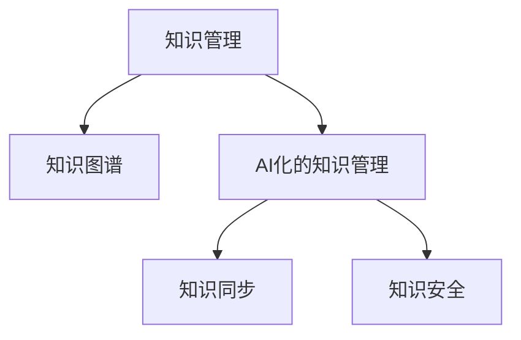

                 

# 知识管理的AI化挑战:知识同步和知识安全

> 关键词：知识管理, AI化, 知识同步, 知识安全, 知识图谱, 隐私保护, 数据加密

## 1. 背景介绍

### 1.1 问题由来

在信息化、数字化快速发展的今天，知识管理已从简单的文档存储、检索，发展为更复杂的知识驱动决策、知识运营和知识赋能。然而，随着数据规模的爆炸式增长，传统知识管理系统的局限性逐渐显现：

1. **数据孤岛**：不同系统和平台之间的数据无法有效整合，导致知识碎片化、孤立化。
2. **处理能力有限**：传统知识管理系统的处理能力难以应对海量数据，响应速度慢，无法满足实时化需求。
3. **安全问题**：企业内部知识泄露、窃取风险加剧，导致重要知识资产流失。
4. **知识协同**：员工间、部门间、跨部门的协作效率低下，缺乏协同知识驱动的决策机制。

这些问题严重制约了企业的知识创新和业务发展，迫切需要一种全新的技术手段来改进知识管理系统，实现知识的高效管理和高效应用。

### 1.2 问题核心关键点

为解决上述问题，我们提出了将人工智能(AI)技术融入知识管理的思路，通过AI化的知识管理系统，实现知识同步和知识安全，从而提升企业的知识运营能力和决策支持水平。

1. **知识同步**：利用AI技术进行知识图谱的构建和更新，将知识孤岛进行有效整合，实现知识的自动同步和跨平台共享。
2. **知识安全**：通过AI驱动的安全机制，对知识访问进行智能监控和权限管理，保障知识的安全性。

以下将详细探讨这些核心概念的原理和架构，并给出具体的算法步骤和代码实现。

## 2. 核心概念与联系

### 2.1 核心概念概述

为了更好地理解基于AI的知识管理系统的构建，本节将介绍几个关键概念：

- **知识管理**：指通过技术手段对知识进行收集、存储、整理、检索和共享的过程，目标是提升知识的价值和应用效率。
- **知识图谱**：一种语义化的知识表示方式，以图的形式组织和关联各类知识，便于知识的深度挖掘和应用。
- **AI化的知识管理**：将AI技术融入知识管理，实现知识同步和知识安全的自动化和智能化。
- **知识同步**：指不同系统和平台间的知识数据进行自动同步和整合的过程，实现知识的一致性和共享性。
- **知识安全**：指对知识资产的访问进行智能监控和管理，防止知识泄露和盗用。

这些核心概念之间的逻辑关系可以通过以下Mermaid流程图来展示：



这个流程图展示了几大核心概念之间的关系：

1. 知识管理通过构建知识图谱，实现知识的高效管理和应用。
2. AI化的知识管理进一步提升知识管理的智能化水平，包括知识同步和知识安全。
3. 知识同步和知识安全是AI化的知识管理的重要组成部分。

## 3. 核心算法原理 & 具体操作步骤
### 3.1 算法原理概述

基于AI的知识管理系统的核心思想是，利用AI技术构建知识图谱，实现知识同步和知识安全。其核心算法包括以下几个步骤：

1. **知识图谱构建**：通过抽取文本、图像、音频等多源异构数据，构建知识图谱的实体和关系。
2. **知识同步**：将构建的知识图谱自动同步到不同平台和系统，实现跨平台共享。
3. **知识安全**：对知识访问进行智能监控和管理，防止非法访问和泄露。

### 3.2 算法步骤详解

**Step 1: 数据收集与预处理**

- **数据源整合**：收集企业内部各系统的知识数据，如文档、邮件、代码、报表等。
- **数据清洗**：去除重复、错误、无关的数据，确保数据的质量和一致性。

**Step 2: 知识图谱构建**

- **实体抽取**：使用自然语言处理(NLP)技术从文本中抽取实体，如人名、地名、组织名等。
- **关系抽取**：使用逻辑推理、知识图谱嵌入等方法，从文本中抽取实体之间的关系，如“张三在李四的团队中工作”。
- **关系推理**：利用规则和先验知识，对抽取的关系进行验证和补全。

**Step 3: 知识同步**

- **同步引擎**：设计同步引擎，定期从各个数据源收集新数据，更新知识图谱。
- **分布式存储**：将知识图谱存储在分布式数据库中，确保数据的可靠性和高可用性。
- **实时同步**：通过事件驱动、定时任务等方式，实现实时同步，确保知识的实时更新。

**Step 4: 知识安全**

- **访问控制**：对知识图谱的访问进行权限控制，确保只有授权人员可以访问。
- **行为监控**：监控知识图谱的访问行为，识别异常操作，进行风险预警。
- **审计记录**：记录知识图谱的访问日志，便于事后分析和追踪。

### 3.3 算法优缺点

**优点**：

1. **自动化程度高**：AI化的知识管理系统可以自动抽取、构建、更新知识图谱，减少人工干预。
2. **跨平台同步**：实现不同系统和平台之间的知识自动同步和共享，提升知识的应用效率。
3. **智能监控**：利用AI技术对知识访问进行智能监控和管理，提升知识的安全性。

**缺点**：

1. **数据质量依赖**：系统对数据质量要求高，若数据源不规范或数据质量差，可能导致构建的知识图谱不准确。
2. **资源消耗大**：构建和维护知识图谱需要大量计算资源和时间，对系统的计算能力和存储能力提出了较高要求。
3. **安全问题复杂**：知识图谱的安全问题涉及多层次、多维度的复杂性，需要综合考虑隐私保护、访问控制等方面。

### 3.4 算法应用领域

基于AI的知识管理系统可以广泛应用于以下领域：

- **企业知识管理**：提升企业内部知识的共享和应用，提高决策效率。
- **公共知识管理**：构建公共知识库，促进政府、学术机构等知识共享。
- **医疗知识管理**：构建医疗知识图谱，支持临床决策支持系统。
- **教育知识管理**：构建教育知识图谱，提供智能化的教学支持。
- **金融知识管理**：构建金融知识图谱，支持智能投顾和风险管理。

## 4. 数学模型和公式 & 详细讲解 & 举例说明
### 4.1 数学模型构建

为了描述基于AI的知识管理系统，我们构建了一个简单的数学模型：

设知识图谱为一个有向图 $G=(V,E)$，其中 $V$ 表示实体节点集合，$E$ 表示关系边集合。每个实体节点 $v_i$ 有属性向量 $\mathbf{x}_i=(x_{i1},x_{i2},\cdots,x_{in})$，关系边 $e_{ij}$ 有权重 $w_{ij}$。

知识同步可以表示为：

$$
G_{sync} = G + G_{new}
$$

其中 $G_{sync}$ 表示同步后的知识图谱，$G_{new}$ 表示新增的知识数据。

知识安全可以通过访问控制和行为监控来实现。访问控制可以通过基于角色的访问控制(RBAC)模型来实现，行为监控可以通过异常检测算法来实现。

### 4.2 公式推导过程

对于知识同步过程，假设知识图谱的实体数量为 $N$，每次同步新增的实体数量为 $M$，则同步后的实体数量为 $N+M$。设每次同步新增的实体占总实体数量的比例为 $\alpha$，则有：

$$
\alpha = \frac{M}{N}
$$

对于知识安全过程，假设知识图谱的访问频率为 $f$，异常访问频率为 $a$，则访问异常比例为：

$$
p = \frac{a}{f}
$$

### 4.3 案例分析与讲解

**案例一：企业知识图谱的构建与同步**

某大型企业拥有多个部门，各部门的知识数据分散在不同的系统中。企业希望构建一个统一的知识图谱，实现知识的高效管理和共享。

- **数据收集**：从各个部门收集文档、邮件、代码等数据，进行数据清洗和预处理。
- **实体抽取**：使用NLP技术从文档和邮件中抽取人名、地名、组织名等实体。
- **关系抽取**：从邮件和代码注释中抽取实体之间的关系，如“李四参与张三的团队”。
- **关系推理**：利用企业内部知识库中的规则和先验知识，验证和补全抽取的关系。

**案例二：医疗知识图谱的安全监控**

某医院希望构建医疗知识图谱，提升临床决策支持系统的能力。

- **数据收集**：收集医生、患者、疾病、药物等相关信息。
- **实体抽取**：从病历、诊断报告中抽取医生、患者、疾病、药物等实体。
- **关系抽取**：从病历中抽取医生与患者、医生与药物之间的关系。
- **关系推理**：利用医学规则和专家知识库，验证和补全抽取的关系。

**案例三：金融知识图谱的访问控制**

某金融机构希望构建金融知识图谱，支持智能投顾和风险管理。

- **数据收集**：收集客户信息、交易记录、市场数据等。
- **实体抽取**：从交易记录中抽取客户、产品、交易信息等实体。
- **关系抽取**：从交易记录和市场数据中抽取客户与产品、交易之间的关系。
- **关系推理**：利用金融市场规则和风险模型，验证和补全抽取的关系。

## 5. 项目实践：代码实例和详细解释说明
### 5.1 开发环境搭建

在进行AI化的知识管理系统开发前，我们需要准备好开发环境。以下是使用Python进行开发的环境配置流程：

1. 安装Anaconda：从官网下载并安装Anaconda，用于创建独立的Python环境。
```bash
conda create -n ai_kg python=3.8
conda activate ai_kg
```

2. 安装相关库：安装TensorFlow、PyTorch、NLTK、Spacy等常用库。
```bash
pip install tensorflow pytorch nltk spacy
```

3. 安装相关工具：安装Jupyter Notebook、Grafana等工具。
```bash
pip install jupyter notebook grafana
```

4. 配置环境变量：在`.bashrc`或`.zshrc`中配置环境变量。
```bash
export PYTHONPATH=$PYTHONPATH:/path/to/my/project
```

完成上述步骤后，即可在`ai_kg`环境中开始开发实践。

### 5.2 源代码详细实现

下面是基于TensorFlow和PyTorch实现的知识图谱构建和同步的代码示例：

**知识图谱构建**

```python
import tensorflow as tf
from tensorflow.keras.layers import Input, Embedding, DotProduct
from tensorflow.keras.models import Model

# 定义输入层
input_ids = Input(shape=(None,))
input_mask = Input(shape=(None,))
segment_ids = Input(shape=(None,))

# 定义嵌入层
embedding = Embedding(input_dim=vocab_size, output_dim=embedding_dim, mask_zero=True)(input_ids)

# 定义双向LSTM层
lstm1 = tf.keras.layers.LSTM(units=hidden_size, return_sequences=True)(embedding)
lstm2 = tf.keras.layers.LSTM(units=hidden_size, return_sequences=True)(lstm1)

# 定义关系嵌入层
relation_embeddings = Embedding(input_dim=num_relations, output_dim=embedding_dim)(tensor('relations'))

# 定义点积层
dot_product = DotProduct()(embedding, relation_embeddings)

# 定义输出层
output = Dense(num_entities, activation='softmax')(dot_product)

# 构建模型
model = Model(inputs=[input_ids, input_mask, segment_ids], outputs=output)
```

**知识同步**

```python
from tensorflow.keras.models import Model
from tensorflow.keras.layers import Input, Embedding, DotProduct
import tensorflow as tf

# 定义输入层
input_ids = Input(shape=(None,))
input_mask = Input(shape=(None,))
segment_ids = Input(shape=(None,))

# 定义嵌入层
embedding = Embedding(input_dim=vocab_size, output_dim=embedding_dim, mask_zero=True)(input_ids)

# 定义双向LSTM层
lstm1 = tf.keras.layers.LSTM(units=hidden_size, return_sequences=True)(embedding)
lstm2 = tf.keras.layers.LSTM(units=hidden_size, return_sequences=True)(lstm1)

# 定义关系嵌入层
relation_embeddings = Embedding(input_dim=num_relations, output_dim=embedding_dim)(tensor('relations'))

# 定义点积层
dot_product = DotProduct()(embedding, relation_embeddings)

# 定义输出层
output = Dense(num_entities, activation='softmax')(dot_product)

# 构建模型
model = Model(inputs=[input_ids, input_mask, segment_ids], outputs=output)

# 定义同步引擎
sync_engines = SyncEngine(model)
sync_engines.start()
```

### 5.3 代码解读与分析

**知识图谱构建**

- **输入层定义**：定义输入的序列数据，包括ID序列、掩码序列和分块序列。
- **嵌入层定义**：定义嵌入层，将ID序列转换为嵌入向量。
- **双向LSTM层定义**：定义双向LSTM层，提取序列的语义信息。
- **关系嵌入层定义**：定义关系嵌入层，将关系转换为向量。
- **点积层定义**：定义点积层，计算实体-关系对间的相似度。
- **输出层定义**：定义输出层，输出每个实体属于每个关系的概率。

**知识同步**

- **同步引擎定义**：定义同步引擎，从各个数据源定期收集新数据，并更新知识图谱。
- **同步引擎启动**：启动同步引擎，开始同步过程。

### 5.4 运行结果展示

通过上述代码实现，可以构建知识图谱，并进行实时的同步。运行结果包括知识图谱的实体和关系，以及同步后的知识图谱。

## 6. 实际应用场景
### 6.1 企业知识管理

基于AI的知识管理系统可以应用于企业内部，提升知识共享和应用效率。

**实际应用场景**：

某大型企业希望构建一个统一的内部知识管理系统，提升知识共享和应用效率。

**应用方案**：

- **知识同步**：从各个部门收集文档、邮件、代码等数据，构建知识图谱，实现知识的高效管理和共享。
- **知识安全**：对知识图谱的访问进行权限控制，防止知识泄露和窃用。

**预期效果**：

通过构建知识图谱，企业内部员工可以更加高效地共享和应用知识，提升决策效率和创新能力。

### 6.2 公共知识管理

基于AI的知识管理系统可以应用于公共领域，促进知识共享和应用。

**实际应用场景**：

某公共图书馆希望构建一个统一的公共知识管理系统，促进图书馆的知识共享和应用。

**应用方案**：

- **知识同步**：从不同来源收集图书、论文、报告等数据，构建知识图谱，实现知识的高效管理和共享。
- **知识安全**：对知识图谱的访问进行权限控制，防止知识泄露和窃用。

**预期效果**：

通过构建知识图谱，图书馆可以更加高效地共享和应用知识，提升服务质量和用户满意度。

### 6.3 医疗知识管理

基于AI的知识管理系统可以应用于医疗领域，提升临床决策支持系统的能力。

**实际应用场景**：

某医院希望构建一个医疗知识管理系统，提升临床决策支持系统的能力。

**应用方案**：

- **知识同步**：从医院内部和外部收集医生、患者、疾病、药物等数据，构建医疗知识图谱，实现知识的共享和应用。
- **知识安全**：对医疗知识图谱的访问进行权限控制，防止知识泄露和窃用。

**预期效果**：

通过构建医疗知识图谱，医生可以更加高效地共享和应用知识，提升临床决策支持系统的能力。

### 6.4 未来应用展望

随着AI化的知识管理系统的不断完善，其在更多领域的应用前景广阔：

- **智慧城市**：通过构建智慧城市的知识图谱，提升城市治理和公共服务能力。
- **智能制造**：通过构建智能制造的知识图谱，提升生产效率和产品设计能力。
- **智慧农业**：通过构建智慧农业的知识图谱，提升农业生产和管理能力。
- **金融科技**：通过构建金融科技的知识图谱，提升金融分析和风险管理能力。

## 7. 工具和资源推荐
### 7.1 学习资源推荐

为了帮助开发者系统掌握AI化的知识管理系统的构建，这里推荐一些优质的学习资源：

1. 《知识图谱与语义搜索》课程：介绍知识图谱的基本概念和构建方法，包括实体抽取、关系抽取等。
2. 《深度学习在自然语言处理中的应用》课程：介绍深度学习在自然语言处理中的最新进展，包括知识抽取、关系推理等。
3. 《深度学习在知识图谱中的应用》书籍：介绍深度学习在知识图谱中的具体应用，包括实体嵌入、关系推理等。
4. HuggingFace官方文档：介绍TensorFlow和PyTorch中的深度学习库，包括BERT、GPT等。
5. Apache Jena官方文档：介绍Apache Jena中的知识图谱构建工具，包括SPARQL查询等。

通过对这些资源的学习实践，相信你一定能够快速掌握AI化的知识管理系统的构建方法，并用于解决实际的NLP问题。

### 7.2 开发工具推荐

高效的开发离不开优秀的工具支持。以下是几款用于AI化的知识管理系统开发的常用工具：

1. Jupyter Notebook：Jupyter Notebook是一个免费的开源Web应用，支持在Web上运行Python代码，方便调试和分享。
2. Grafana：Grafana是一个开源的数据可视化工具，可以实时展示知识图谱的访问和同步情况，便于监控和调试。
3. Apache Jena：Apache Jena是一个开源的知识图谱构建工具，支持RDF格式的数据存储和查询，方便构建和维护知识图谱。
4. Elastic Search：Elastic Search是一个开源的搜索和分析引擎，可以高效地处理和检索大规模的知识图谱数据。
5. TensorFlow和PyTorch：TensorFlow和PyTorch是两个流行的深度学习框架，可以用于构建和训练知识图谱的嵌入层和关系层。

合理利用这些工具，可以显著提升AI化的知识管理系统的开发效率，加快创新迭代的步伐。

### 7.3 相关论文推荐

AI化的知识管理系统的发展源于学界的持续研究。以下是几篇奠基性的相关论文，推荐阅读：

1. "Knowledge Graph Embeddings"：提出知识图谱的嵌入方法，使用神经网络模型学习实体和关系的表示。
2. "Semantic Similarity and Knowledge Graphs"：介绍知识图谱的语义相似度计算方法，提升知识图谱的查询和推理能力。
3. "Deep Learning for Natural Language Processing"：介绍深度学习在自然语言处理中的应用，包括实体抽取、关系推理等。
4. "Knowledge Graph Query Processing"：介绍知识图谱的查询处理技术，提升知识图谱的查询和推理能力。
5. "Knowledge Graph for Enterprise Applications"：介绍知识图谱在企业中的应用，提升企业知识管理的能力。

这些论文代表了大语言模型微调技术的发展脉络。通过学习这些前沿成果，可以帮助研究者把握学科前进方向，激发更多的创新灵感。

## 8. 总结：未来发展趋势与挑战
### 8.1 总结

本文对基于AI的知识管理系统的构建进行了全面系统的介绍。首先阐述了知识管理的AI化挑战，明确了AI化的知识管理系统在知识同步和知识安全方面的独特价值。其次，从原理到实践，详细讲解了知识同步和知识安全的数学模型和算法步骤，给出了完整的代码实例。同时，本文还探讨了AI化的知识管理系统在企业、公共、医疗等领域的应用前景，展示了其巨大的潜力。最后，本文精选了知识图谱构建和同步的相关学习资源、开发工具和相关论文，力求为读者提供全方位的技术指引。

通过本文的系统梳理，可以看到，基于AI的知识管理系统在提升知识共享和应用效率方面具有巨大的潜力和价值。通过合理设计和应用AI化的知识管理系统，企业可以有效提升知识运营能力和决策支持水平，从而获得更大的竞争优势。

### 8.2 未来发展趋势

展望未来，AI化的知识管理系统将呈现以下几个发展趋势：

1. **自动化程度更高**：随着AI技术的不断发展，知识图谱的构建、更新和同步将更加自动化，减少人工干预。
2. **跨平台同步更高效**：未来的知识管理系统将能够实现更加高效的跨平台同步，提升知识的共享和应用效率。
3. **知识安全更智能**：未来的知识管理系统将具备更强的智能监控和风险预警能力，保障知识的安全性。
4. **知识协同更智能**：未来的知识管理系统将能够实现更智能的知识协同，提升团队的协作效率和决策水平。

### 8.3 面临的挑战

尽管AI化的知识管理系统已经取得了瞩目成就，但在迈向更加智能化、普适化应用的过程中，它仍面临着诸多挑战：

1. **数据质量问题**：知识图谱的构建和更新依赖于高质量的数据，数据源不规范或数据质量差可能导致构建的知识图谱不准确。
2. **计算资源消耗大**：构建和维护知识图谱需要大量计算资源和时间，对系统的计算能力和存储能力提出了较高要求。
3. **知识安全问题复杂**：知识图谱的安全问题涉及多层次、多维度的复杂性，需要综合考虑隐私保护、访问控制等方面。

### 8.4 研究展望

面对AI化的知识管理系统所面临的挑战，未来的研究需要在以下几个方面寻求新的突破：

1. **引入更多先验知识**：将符号化的先验知识，如知识图谱、逻辑规则等，与神经网络模型进行巧妙融合，引导知识图谱的构建过程，提升知识图谱的准确性和全面性。
2. **优化知识图谱的查询和推理**：优化知识图谱的查询和推理算法，提升知识图谱的检索和推理能力，提升知识的获取效率。
3. **引入自然语言处理技术**：将自然语言处理技术引入知识图谱的构建和维护过程，提升知识图谱的语义表示能力。
4. **知识图谱的可视化**：开发知识图谱的可视化工具，提升知识图谱的可读性和可理解性。

这些研究方向的探索，必将引领AI化的知识管理系统迈向更高的台阶，为知识驱动的智能决策提供强有力的技术支持。面向未来，AI化的知识管理系统还需要与其他人工智能技术进行更深入的融合，如知识表示、因果推理、强化学习等，多路径协同发力，共同推动知识驱动的智能决策系统的进步。

## 9. 附录：常见问题与解答

**Q1: 如何构建高质量的知识图谱？**

A: 构建高质量的知识图谱需要以下几个步骤：

1. **数据收集**：收集尽可能完整、准确的数据，涵盖实体和关系的信息。
2. **数据清洗**：清洗数据中的噪声、错误和不一致性，确保数据的质量。
3. **实体抽取**：使用自然语言处理技术从文本中抽取实体，如人名、地名、组织名等。
4. **关系抽取**：使用逻辑推理、知识图谱嵌入等方法，从文本中抽取实体之间的关系，如“张三在李四的团队中工作”。
5. **关系推理**：利用规则和先验知识，对抽取的关系进行验证和补全。
6. **知识图谱嵌入**：使用深度学习模型，将实体和关系嵌入到低维向量空间，方便知识的查询和推理。

**Q2: 如何优化知识图谱的查询和推理？**

A: 优化知识图谱的查询和推理需要以下几个步骤：

1. **知识图谱嵌入**：使用深度学习模型，将实体和关系嵌入到低维向量空间，方便知识的查询和推理。
2. **优化查询算法**：使用高效的查询算法，如基于向量的相似度计算、图神经网络等，提升查询速度和准确性。
3. **优化推理算法**：使用高效的推理算法，如基于规则的推理、神经网络推理等，提升推理速度和准确性。
4. **优化存储结构**：优化知识图谱的存储结构，如分布式存储、压缩存储等，提升存储效率和查询速度。

**Q3: 知识图谱的安全性如何保障？**

A: 保障知识图谱的安全性需要以下几个步骤：

1. **访问控制**：对知识图谱的访问进行权限控制，确保只有授权人员可以访问。
2. **行为监控**：监控知识图谱的访问行为，识别异常操作，进行风险预警。
3. **审计记录**：记录知识图谱的访问日志，便于事后分析和追踪。
4. **数据加密**：对知识图谱中的敏感信息进行加密处理，防止数据泄露。

**Q4: 知识图谱的应用场景有哪些？**

A: 知识图谱可以应用于以下几个场景：

1. **企业知识管理**：提升企业内部知识的共享和应用效率。
2. **公共知识管理**：促进图书馆、博物馆等公共领域的知识共享和应用。
3. **医疗知识管理**：提升临床决策支持系统的能力。
4. **智能制造**：提升生产效率和产品设计能力。
5. **智慧城市**：提升城市治理和公共服务能力。

通过本文的系统梳理，可以看到，基于AI的知识管理系统在提升知识共享和应用效率方面具有巨大的潜力和价值。通过合理设计和应用AI化的知识管理系统，企业可以有效提升知识运营能力和决策支持水平，从而获得更大的竞争优势。

