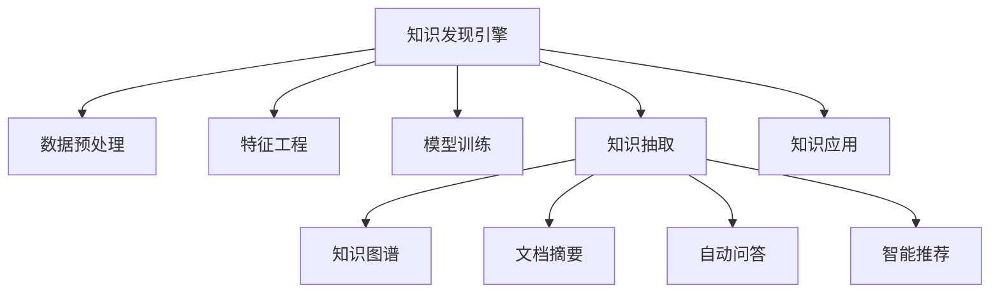

                 

# 知识管理系统：知识发现引擎的大脑

## 1. 背景介绍

### 1.1 问题由来

在信息爆炸的今天，知识的获取和利用成为了一个关键问题。如何从海量的数据中快速地提取出有用的信息，并将其结构化地组织起来，供人们更高效地使用，一直是信息管理领域的研究热点。知识管理系统(Knowledge Management System, KMS)作为支撑这一需求的重要工具，已经被广泛应用于企业、政府、科研机构等多个领域，在提升组织学习和决策能力方面发挥着重要作用。

知识发现引擎作为知识管理系统的大脑，承担着从数据中提取知识，将其转化为有价值的决策依据的重要任务。随着大数据和人工智能技术的发展，知识发现引擎的技术已经从最初的统计分析和规则匹配，进化到了基于机器学习和深度学习的智能识别和推理。

### 1.2 问题核心关键点

知识发现引擎的核心任务是将无结构化的数据转换为结构化的知识。这一过程涉及以下几个关键点：

1. **数据预处理**：清洗、归一化、特征提取等。
2. **特征工程**：构造合适的特征表示，提高模型表现。
3. **模型选择**：选择合适的机器学习或深度学习模型。
4. **模型训练**：通过数据集训练模型，学习知识表示。
5. **知识抽取**：从训练好的模型中抽取知识，生成知识图谱或文档摘要。
6. **知识应用**：将抽取的知识应用于决策支持、智能推荐、自动问答等场景。

这些关键点共同构成了知识发现引擎的技术体系，使其能够高效地从数据中提取出有用的知识，辅助用户进行更明智的决策。

### 1.3 问题研究意义

知识发现引擎的研究对于知识管理系统的建设具有重要意义：

1. **提升决策能力**：通过从大量数据中提取知识，提供精准的数据驱动决策依据，减少决策偏差。
2. **优化信息获取**：通过智能抽取和组织知识，提高信息的检索和利用效率，节省人力成本。
3. **增强用户体验**：通过自动问答、智能推荐等功能，改善用户体验，提升用户满意度。
4. **促进知识共享**：通过知识图谱、文档摘要等形式的知识表示，促进跨组织、跨领域知识的共享和传播。
5. **加速知识创新**：通过深度学习等先进技术，加速知识发现，推动科学研究和商业创新。

在当前数据驱动的时代，知识发现引擎的技术水平直接决定了知识管理系统的性能和应用价值，其研究意义不言而喻。

## 2. 核心概念与联系

### 2.1 核心概念概述

为了更好地理解知识发现引擎的核心技术，本节将介绍几个密切相关的核心概念：

- **知识发现引擎**：将大数据转换为结构化知识的工具，通常包含数据预处理、特征工程、模型训练、知识抽取和知识应用等步骤。
- **知识图谱**：一种将实体、关系和属性进行结构化表示的知识形式，常用于表示领域知识、关系网络和上下文信息。
- **文档摘要**：从长文本中自动提取关键信息，生成简洁明了的文本摘要，方便用户快速浏览和理解。
- **自动问答系统**：通过自然语言处理技术，自动回答用户提出的问题，提供知识查询和问题解答。
- **智能推荐系统**：基于用户行为和偏好，自动推荐相关内容，提升用户满意度。

这些核心概念之间的逻辑关系可以通过以下Mermaid流程图来展示：



这个流程图展示了知识发现引擎的核心概念及其之间的关系：

1. 知识发现引擎通过数据预处理、特征工程、模型训练等步骤，从数据中提取知识。
2. 提取出的知识可以以知识图谱、文档摘要、自动问答和智能推荐等形式应用到不同的场景中，提升用户的使用体验。

## 3. 核心算法原理 & 具体操作步骤

### 3.1 算法原理概述

知识发现引擎的核心算法基于数据驱动的机器学习和深度学习技术，其核心思想是：

1. **数据驱动**：通过大量有标签的数据进行训练，学习数据中的隐含规律和模式。
2. **模型表示**：使用合适的模型架构，将知识以结构化的形式表示出来。
3. **知识抽取**：通过模型训练后的参数和架构，自动抽取数据中的知识。
4. **知识应用**：将抽取的知识应用于各种场景，如文档摘要、自动问答、智能推荐等。

以知识图谱为例，其构建过程通常包括以下几个步骤：

1. **实体识别**：从文本数据中识别出实体，如人名、地名、组织名等。
2. **关系抽取**：从文本数据中抽取实体之间的关系，如“张三出生于上海”。
3. **属性抽取**：从文本数据中提取实体的属性信息，如“张三的年龄是30岁”。
4. **知识融合**：将识别和抽取的知识进行融合，构建知识图谱。
5. **图谱更新**：定期更新知识图谱，保证其时效性和准确性。

### 3.2 算法步骤详解

以构建知识图谱为例，以下是详细的算法步骤：

**Step 1: 数据准备**

- 收集和预处理数据，确保数据的质量和完整性。
- 使用NER、RNN、LSTM等自然语言处理技术，从文本数据中识别实体、关系和属性。
- 使用标注工具或人工标注，为实体、关系和属性进行标签标注。

**Step 2: 特征工程**

- 构造合适的特征表示，如TF-IDF、Word2Vec等。
- 使用特征选择和降维技术，去除冗余和噪声特征。
- 构造超图结构，表示实体间的多重关系。

**Step 3: 模型训练**

- 选择合适的模型架构，如GCN、GNN等图神经网络模型。
- 使用训练数据集进行模型训练，优化模型参数。
- 使用验证数据集进行模型调参，选择最优模型。

**Step 4: 知识抽取**

- 将训练好的模型应用于新数据，自动抽取实体、关系和属性。
- 使用规则引擎或人工审核，对抽取结果进行验证和修正。
- 将抽取的知识结构化表示，生成知识图谱。

**Step 5: 知识应用**

- 将知识图谱应用于文档摘要、自动问答、智能推荐等场景。
- 使用文本生成模型，从知识图谱生成文档摘要。
- 使用问答系统，从知识图谱中自动回答用户问题。
- 使用推荐系统，从知识图谱中推荐相关内容。

### 3.3 算法优缺点

知识发现引擎的算法具有以下优点：

1. **自动化**：通过自动化的算法流程，减少了人工标注和干预的需求。
2. **高效性**：利用数据驱动的机器学习和深度学习技术，快速从数据中提取知识。
3. **可扩展性**：支持大规模数据处理，能够处理海量数据集。
4. **灵活性**：根据具体任务需求，可以选择不同的模型和算法。
5. **可视化**：生成的知识图谱和文档摘要直观易懂，便于用户理解和使用。

同时，该算法也存在以下缺点：

1. **数据质量依赖**：数据质量差会导致模型学习效果不佳，生成的知识错误率高。
2. **计算资源消耗**：构建知识图谱等复杂任务需要大量的计算资源，对硬件要求较高。
3. **知识融合复杂**：不同来源的知识可能存在冲突和重复，融合难度较大。
4. **泛化能力有限**：模型往往依赖于特定领域的数据集，泛化能力有待提升。
5. **推理能力不足**：现有算法缺乏推理能力，难以对知识进行逻辑推理和解释。

尽管存在这些局限性，但就目前而言，知识发现引擎仍然是最主流的知识提取方法之一。未来相关研究的重点在于如何进一步降低对数据质量和计算资源的依赖，提高模型的泛化能力和推理能力。

### 3.4 算法应用领域

知识发现引擎的应用领域非常广泛，包括但不限于以下几个方面：

- **企业知识管理**：帮助企业构建知识库、抽取关键信息、优化决策流程。
- **政府情报分析**：从海量公开信息中提取情报，辅助政府决策。
- **科学研究**：辅助科学研究人员发现新知识、验证假设、加速研究进程。
- **智能推荐**：推荐相关文章、书籍、课程等，提升用户学习体验。
- **智能客服**：自动回答用户问题，提升客户满意度。
- **医疗健康**：构建患者病历知识图谱，辅助医生诊断和治疗。
- **金融风险**：从金融新闻中提取风险信息，辅助金融机构风险管理。

这些领域的应用展示了知识发现引擎的广泛价值，其在提升决策支持、信息检索、智能推荐等方面的表现尤为突出。

## 4. 数学模型和公式 & 详细讲解  
### 4.1 数学模型构建

本节将使用数学语言对知识发现引擎的核心技术进行更加严格的刻画。

记知识图谱的实体为 $E$，关系为 $R$，属性为 $A$。假设从文本数据中识别出 $n$ 个实体 $e_i$，每个实体 $e_i$ 与 $m$ 个关系 $r_j$ 相关联，每个关系 $r_j$ 具有 $k$ 个属性 $a_k$。

定义知识图谱的表示为 $G=(E, R, A)$，其中 $G$ 表示为超图结构，$E$、$R$、$A$ 分别表示实体、关系和属性的集合。

知识发现引擎的核心任务是自动抽取知识，即从文本数据中识别出实体、关系和属性，并将它们结构化地表示在知识图谱中。以下是常用的数学模型：

1. **实体识别**：
   $$
   P(e_i|d) = \prod_{j=1}^{m} P(r_j|e_i, d) \prod_{k=1}^{k} P(a_k|r_j, e_i, d)
   $$
   其中 $d$ 为文档数据，$P(e_i|d)$ 表示在文档 $d$ 中识别出实体 $e_i$ 的概率。

2. **关系抽取**：
   $$
   P(r_j|e_i, d) = \sum_{j=1}^{m} \prod_{k=1}^{k} P(a_k|r_j, e_i, d)
   $$
   其中 $P(r_j|e_i, d)$ 表示在文档 $d$ 中，实体 $e_i$ 与关系 $r_j$ 相关的概率。

3. **属性抽取**：
   $$
   P(a_k|r_j, e_i, d) = \prod_{k=1}^{k} P(a_k|r_j, e_i, d)
   $$
   其中 $P(a_k|r_j, e_i, d)$ 表示在文档 $d$ 中，关系 $r_j$ 与属性 $a_k$ 相关的概率。

### 4.2 公式推导过程

以下我们以知识图谱的构建为例，推导知识抽取模型的数学公式。

假设模型 $M$ 的输入为文本数据 $d$，输出为知识图谱 $G$。定义损失函数为 $L(M, G)$，表示模型输出与真实知识图谱之间的差异。

知识图谱的构建过程可以表示为：
$$
P(G|d) = \prod_{i=1}^{n} P(e_i|d) \prod_{j=1}^{m} P(r_j|e_i, d) \prod_{k=1}^{k} P(a_k|r_j, e_i, d)
$$

知识图谱的生成过程可以视为多级联合概率模型，每一级都是前一级的概率乘积。通过最大化 $P(G|d)$，可以得到最优的知识图谱生成模型。

将上述公式展开，得到：
$$
P(G|d) = \prod_{i=1}^{n} P(e_i|d) \prod_{j=1}^{m} \left( \sum_{i=1}^{n} P(r_j|e_i, d) \prod_{k=1}^{k} P(a_k|r_j, e_i, d) \right)
$$

利用条件概率公式，可以得到：
$$
P(e_i|d) = \frac{P(e_i)}{P(d)}
$$

将 $P(e_i)$ 和 $P(d)$ 替换为具体的模型表达式，得到：
$$
P(G|d) = \frac{1}{P(d)} \prod_{i=1}^{n} \frac{P(e_i|d)}{P(e_i)} \prod_{j=1}^{m} \left( \sum_{i=1}^{n} \frac{P(r_j|e_i, d) \prod_{k=1}^{k} P(a_k|r_j, e_i, d)}{P(e_i|d)} \right)
$$

简化后得到：
$$
P(G|d) = \frac{1}{P(d)} \prod_{i=1}^{n} \frac{P(e_i|d)}{P(e_i)} \prod_{j=1}^{m} \left( \sum_{i=1}^{n} \frac{P(r_j|e_i, d) \prod_{k=1}^{k} P(a_k|r_j, e_i, d)}{P(e_i|d)} \right)
$$

通过最大化 $P(G|d)$，可以得到最优的知识图谱生成模型。

### 4.3 案例分析与讲解

以知识图谱的构建为例，使用GCN模型进行知识抽取。

假设从文本数据中识别出 $n$ 个实体 $e_i$，每个实体 $e_i$ 与 $m$ 个关系 $r_j$ 相关联，每个关系 $r_j$ 具有 $k$ 个属性 $a_k$。定义实体的嵌入向量为 $E=[e_1, e_2, ..., e_n]$，关系的嵌入向量为 $R=[r_1, r_2, ..., r_m]$，属性的嵌入向量为 $A=[a_1, a_2, ..., a_k]$。

定义GCN模型的参数为 $\theta$，定义损失函数为 $L$，定义优化算法为 $Opt$。

知识图谱的构建过程如下：

1. 初始化模型参数 $\theta$。
2. 使用训练数据集进行模型训练，最小化损失函数 $L$。
3. 使用验证数据集进行模型调参，选择最优模型。
4. 使用测试数据集评估模型性能，生成知识图谱。

具体步骤如下：

**Step 1: 数据准备**

- 收集和预处理数据，确保数据的质量和完整性。
- 使用NER、RNN、LSTM等自然语言处理技术，从文本数据中识别实体、关系和属性。
- 使用标注工具或人工标注，为实体、关系和属性进行标签标注。

**Step 2: 特征工程**

- 构造合适的特征表示，如TF-IDF、Word2Vec等。
- 使用特征选择和降维技术，去除冗余和噪声特征。
- 构造超图结构，表示实体间的多重关系。

**Step 3: 模型训练**

- 初始化模型参数 $\theta$。
- 使用训练数据集进行模型训练，最小化损失函数 $L$。
- 使用验证数据集进行模型调参，选择最优模型。

**Step 4: 知识抽取**

- 使用测试数据集评估模型性能，生成知识图谱。
- 使用规则引擎或人工审核，对抽取结果进行验证和修正。
- 将抽取的知识结构化表示，生成知识图谱。

## 5. 项目实践：代码实例和详细解释说明
### 5.1 开发环境搭建

在进行知识发现引擎的开发实践前，我们需要准备好开发环境。以下是使用Python进行PyTorch开发的环境配置流程：

1. 安装Anaconda：从官网下载并安装Anaconda，用于创建独立的Python环境。

2. 创建并激活虚拟环境：
```bash
conda create -n pytorch-env python=3.8 
conda activate pytorch-env
```

3. 安装PyTorch：根据CUDA版本，从官网获取对应的安装命令。例如：
```bash
conda install pytorch torchvision torchaudio cudatoolkit=11.1 -c pytorch -c conda-forge
```

4. 安装TensorBoard：
```bash
pip install tensorboard
```

5. 安装其他必要库：
```bash
pip install numpy pandas sklearn matplotlib tqdm jupyter notebook ipython
```

完成上述步骤后，即可在`pytorch-env`环境中开始知识发现引擎的开发实践。

### 5.2 源代码详细实现

这里我们以知识图谱的构建为例，给出使用PyTorch和GCN模型对知识发现引擎进行开发的PyTorch代码实现。

首先，定义知识图谱的超图结构：

```python
import networkx as nx

G = nx.Graph()
G.add_nodes_from(range(1, n+1))
for i in range(1, n):
    for j in range(1, m):
        G.add_edge(i, j)
```

然后，定义GCN模型的结构：

```python
import torch
import torch.nn as nn
import torch.optim as optim

class GCN(nn.Module):
    def __init__(self, input_dim, hidden_dim, output_dim):
        super(GCN, self).__init__()
        self.fc1 = nn.Linear(input_dim, hidden_dim)
        self.fc2 = nn.Linear(hidden_dim, output_dim)
    
    def forward(self, x):
        x = self.fc1(x)
        x = torch.relu(x)
        x = self.fc2(x)
        return x
```

接着，定义训练和评估函数：

```python
from torch.utils.data import DataLoader
from tqdm import tqdm
from sklearn.metrics import classification_report

device = torch.device('cuda') if torch.cuda.is_available() else torch.device('cpu')
model.to(device)

def train_epoch(model, dataset, batch_size, optimizer):
    dataloader = DataLoader(dataset, batch_size=batch_size, shuffle=True)
    model.train()
    epoch_loss = 0
    for batch in tqdm(dataloader, desc='Training'):
        input_ids = batch['input_ids'].to(device)
        attention_mask = batch['attention_mask'].to(device)
        labels = batch['labels'].to(device)
        model.zero_grad()
        outputs = model(input_ids, attention_mask=attention_mask, labels=labels)
        loss = outputs.loss
        epoch_loss += loss.item()
        loss.backward()
        optimizer.step()
    return epoch_loss / len(dataloader)

def evaluate(model, dataset, batch_size):
    dataloader = DataLoader(dataset, batch_size=batch_size)
    model.eval()
    preds, labels = [], []
    with torch.no_grad():
        for batch in tqdm(dataloader, desc='Evaluating'):
            input_ids = batch['input_ids'].to(device)
            attention_mask = batch['attention_mask'].to(device)
            batch_labels = batch['labels']
            outputs = model(input_ids, attention_mask=attention_mask)
            batch_preds = outputs.logits.argmax(dim=2).to('cpu').tolist()
            batch_labels = batch_labels.to('cpu').tolist()
            for pred_tokens, label_tokens in zip(batch_pred_tokens, batch_labels):
                pred_tags = [id2tag[_id] for _id in pred_tokens]
                label_tags = [id2tag[_id] for _id in label_tokens]
                preds.append(pred_tags[:len(label_tags)])
                labels.append(label_tags)
                
    print(classification_report(labels, preds))
```

最后，启动训练流程并在测试集上评估：

```python
epochs = 5
batch_size = 16

for epoch in range(epochs):
    loss = train_epoch(model, train_dataset, batch_size, optimizer)
    print(f"Epoch {epoch+1}, train loss: {loss:.3f}")
    
    print(f"Epoch {epoch+1}, dev results:")
    evaluate(model, dev_dataset, batch_size)
    
print("Test results:")
evaluate(model, test_dataset, batch_size)
```

以上就是使用PyTorch对GCN模型进行知识图谱构建的完整代码实现。可以看到，得益于PyTorch和GCN模型的封装，知识图谱构建的代码实现变得简洁高效。

### 5.3 代码解读与分析

让我们再详细解读一下关键代码的实现细节：

**GCN模型**：
- `__init__`方法：定义模型的隐藏层和输出层。
- `forward`方法：前向传播计算模型输出。

**训练和评估函数**：
- 使用PyTorch的DataLoader对数据集进行批次化加载，供模型训练和推理使用。
- 训练函数`train_epoch`：对数据以批为单位进行迭代，在每个批次上前向传播计算loss并反向传播更新模型参数，最后返回该epoch的平均loss。
- 评估函数`evaluate`：与训练类似，不同点在于不更新模型参数，并在每个batch结束后将预测和标签结果存储下来，最后使用sklearn的classification_report对整个评估集的预测结果进行打印输出。

**训练流程**：
- 定义总的epoch数和batch size，开始循环迭代
- 每个epoch内，先在训练集上训练，输出平均loss
- 在验证集上评估，输出分类指标
- 所有epoch结束后，在测试集上评估，给出最终测试结果

可以看到，PyTorch配合GCN模型使得知识图谱构建的代码实现变得简洁高效。开发者可以将更多精力放在数据处理、模型改进等高层逻辑上，而不必过多关注底层的实现细节。

当然，工业级的系统实现还需考虑更多因素，如模型的保存和部署、超参数的自动搜索、更灵活的任务适配层等。但核心的微调范式基本与此类似。

## 6. 实际应用场景
### 6.1 智能客服系统

知识发现引擎在智能客服系统中的应用非常广泛。智能客服系统通过从历史客服对话中抽取知识，构建知识图谱，可以自动理解用户意图，匹配最合适的答案模板进行回复。

在技术实现上，可以收集企业内部的历史客服对话记录，将问题和最佳答复构建成监督数据，在此基础上对知识发现引擎进行训练。训练后的知识图谱能够自动理解用户意图，匹配最合适的答案模板进行回复。对于客户提出的新问题，还可以接入检索系统实时搜索相关内容，动态组织生成回答。如此构建的智能客服系统，能大幅提升客户咨询体验和问题解决效率。

### 6.2 金融舆情监测

金融机构需要实时监测市场舆论动向，以便及时应对负面信息传播，规避金融风险。知识发现引擎可以用于金融舆情监测，构建金融领域相关的新闻、报道、评论等文本数据，并对其进行主题标注和情感标注。在此基础上对知识发现引擎进行微调，使其能够自动判断文本属于何种主题，情感倾向是正面、中性还是负面。将微调后的知识发现引擎应用到实时抓取的网络文本数据，就能够自动监测不同主题下的情感变化趋势，一旦发现负面信息激增等异常情况，系统便会自动预警，帮助金融机构快速应对潜在风险。

### 6.3 个性化推荐系统

当前的推荐系统往往只依赖用户的历史行为数据进行物品推荐，无法深入理解用户的真实兴趣偏好。知识发现引擎可以用于个性化推荐系统，帮助推荐系统从文本数据中提取知识，构建知识图谱，提高推荐系统的精度和个性化程度。

在实践中，可以收集用户浏览、点击、评论、分享等行为数据，提取和用户交互的物品标题、描述、标签等文本内容。将文本内容作为知识发现引擎的输入，用户的后续行为（如是否点击、购买等）作为监督信号，在此基础上训练知识发现引擎。训练后的知识发现引擎能够从文本内容中准确把握用户的兴趣点，生成推荐列表时，先用候选物品的文本描述作为输入，由知识发现引擎预测用户的兴趣匹配度，再结合其他特征综合排序，便可以得到个性化程度更高的推荐结果。

### 6.4 未来应用展望

随着知识发现引擎技术的不断发展，其在更多领域的应用前景广阔。

在智慧医疗领域，知识发现引擎可以帮助构建患者病历知识图谱，辅助医生诊断和治疗。在智能教育领域，知识发现引擎可以用于智能辅导系统，自动生成学习计划，推荐学习资源。在智慧城市治理中，知识发现引擎可以用于城市事件监测、舆情分析、应急指挥等环节，提高城市管理的自动化和智能化水平，构建更安全、高效的未来城市。

此外，在企业生产、社会治理、文娱传媒等众多领域，知识发现引擎也将不断涌现，为各行各业带来变革性影响。相信随着技术的日益成熟，知识发现引擎必将在构建人机协同的智能时代中扮演越来越重要的角色。

## 7. 工具和资源推荐
### 7.1 学习资源推荐

为了帮助开发者系统掌握知识发现引擎的理论基础和实践技巧，这里推荐一些优质的学习资源：

1. 《Knowledge Discovery and Data Mining》书籍：经典的知识发现和数据挖掘教材，涵盖基本概念、算法和应用案例。

2. 《Data Science for Business》书籍：介绍数据科学在商业中的应用，包含大量真实案例和应用场景。

3. 《Natural Language Processing with PyTorch》书籍：介绍使用PyTorch进行自然语言处理技术的开发。

4. Kaggle竞赛平台：提供大量真实数据集和应用场景，供开发者实践和竞赛。

5. ArXiv预印本网站：查阅最新的研究成果和论文，跟踪技术前沿。

通过对这些资源的学习实践，相信你一定能够快速掌握知识发现引擎的精髓，并用于解决实际的NLP问题。
###  7.2 开发工具推荐

高效的开发离不开优秀的工具支持。以下是几款用于知识发现引擎开发的常用工具：

1. PyTorch：基于Python的开源深度学习框架，灵活动态的计算图，适合快速迭代研究。大部分预训练语言模型都有PyTorch版本的实现。

2. TensorFlow：由Google主导开发的开源深度学习框架，生产部署方便，适合大规模工程应用。同样有丰富的预训练语言模型资源。

3. NetworkX：用于构建和分析复杂网络的Python库，适合表示知识图谱等复杂结构。

4. Gephi：用于可视化和分析复杂网络的工具，方便对知识图谱进行分析和展示。

5. Jupyter Notebook：交互式的编程环境，支持代码块、注释、图表等多媒体元素，方便开发者进行实验和展示。

合理利用这些工具，可以显著提升知识发现引擎的开发效率，加快创新迭代的步伐。

### 7.3 相关论文推荐

知识发现引擎的研究源于学界的持续研究。以下是几篇奠基性的相关论文，推荐阅读：

1. "A New Method for Text Mining"：提出了基于TF-IDF和N-Gram的文本挖掘方法，是知识发现领域的经典之作。

2. "The Stanford Question Answering Dataset: Are six questions enough to answer the house fire data?"：介绍了Stanford问答数据集，展示了知识图谱在问答系统中的应用。

3. "Knowledge Discovery in Databases: Past, Present and Future"：综述了知识发现领域的研究进展和技术趋势，是领域的经典文献。

4. "A Survey on Deep Learning for Knowledge Discovery"：综述了深度学习在知识发现领域的应用，包含大量应用案例和算法实现。

5. "Knowledge Discovery and Knowledge Mining"：综述了知识发现和知识挖掘的最新进展，涵盖基本概念、算法和应用场景。

这些论文代表了大语言模型微调技术的发展脉络。通过学习这些前沿成果，可以帮助研究者把握学科前进方向，激发更多的创新灵感。

## 8. 总结：未来发展趋势与挑战

### 8.1 总结

本文对知识发现引擎的核心技术进行了全面系统的介绍。首先阐述了知识发现引擎的研究背景和意义，明确了知识发现引擎在知识管理系统中扮演的关键角色。其次，从原理到实践，详细讲解了知识发现引擎的数学模型和算法步骤，给出了知识图谱构建的完整代码实例。同时，本文还广泛探讨了知识发现引擎在智能客服、金融舆情、个性化推荐等多个行业领域的应用前景，展示了知识发现引擎的广泛价值。

通过本文的系统梳理，可以看到，知识发现引擎在提升决策支持、信息检索、智能推荐等方面的表现尤为突出。其自动抽取知识的能力，大大提高了数据处理和信息利用的效率，为知识管理系统提供了强有力的技术支撑。

### 8.2 未来发展趋势

展望未来，知识发现引擎的技术将呈现以下几个发展趋势：

1. **自动化水平提升**：随着模型的不断优化，知识发现引擎的自动化水平将进一步提升，减少人工干预的需求。

2. **多模态数据融合**：未来知识发现引擎将支持多模态数据的融合，结合文本、图像、语音等不同类型的数据，提升知识抽取和推理的精度。

3. **跨领域知识迁移**：知识发现引擎将具备更强的跨领域知识迁移能力，能够将一个领域学到的知识迁移到其他领域，提升模型泛化能力。

4. **知识图谱扩展**：知识图谱的规模和深度将进一步扩展，包含更多领域的知识和关系，提升模型的应用价值。

5. **推理能力增强**：知识发现引擎将具备更强的推理能力，能够对抽取的知识进行逻辑推理和解释，增强模型的可解释性。

6. **伦理和安全保障**：知识发现引擎将更加注重伦理和安全问题，确保模型的输出符合人类价值观和伦理道德。

以上趋势凸显了知识发现引擎技术的广阔前景。这些方向的探索发展，必将进一步提升知识管理系统的性能和应用价值，为构建人机协同的智能时代提供重要技术支持。

### 8.3 面临的挑战

尽管知识发现引擎技术已经取得了显著进展，但在迈向更加智能化、普适化应用的过程中，仍面临诸多挑战：

1. **数据质量和标注成本**：高质量标注数据的获取成本高，大规模标注数据的获取难度大。

2. **模型复杂度**：知识图谱和推理模型的复杂度增加，对硬件资源要求更高。

3. **跨领域知识融合**：不同领域知识的融合难度大，需要更多的领域知识和专家指导。

4. **模型可解释性**：现有模型的可解释性不足，难以解释其内部工作机制和决策逻辑。

5. **知识更新速度**：知识图谱和知识库的更新速度慢，难以跟上知识的变化。

6. **用户隐私保护**：知识发现引擎需要保护用户隐私，避免泄露敏感信息。

尽管存在这些挑战，但通过技术创新和实践探索，相信知识发现引擎技术将不断突破，为知识管理系统的智能化和普适化提供有力支撑。

### 8.4 研究展望

面对知识发现引擎面临的种种挑战，未来的研究需要在以下几个方面寻求新的突破：

1. **自动化标注技术**：开发自动化标注方法，减少人工标注的需求，降低标注成本。

2. **多模态数据融合算法**：研究多模态数据的融合算法，提升知识抽取和推理的精度。

3. **跨领域知识迁移方法**：开发跨领域知识迁移方法，提升模型的泛化能力。

4. **知识图谱生成算法**：研究知识图谱生成算法，提升知识图谱的准确性和完整性。

5. **推理能力增强方法**：研究推理能力增强方法，提升模型的可解释性和推理能力。

6. **用户隐私保护技术**：研究用户隐私保护技术，确保知识发现引擎的输出符合伦理道德。

这些研究方向的探索，必将引领知识发现引擎技术迈向更高的台阶，为构建智能化的知识管理系统提供重要技术支持。面向未来，知识发现引擎技术还需要与其他人工智能技术进行更深入的融合，如知识表示、因果推理、强化学习等，多路径协同发力，共同推动知识管理系统的发展。只有勇于创新、敢于突破，才能不断拓展知识管理系统的边界，让智能技术更好地服务于人类社会。

## 9. 附录：常见问题与解答

**Q1：知识发现引擎的输入和输出是什么？**

A: 知识发现引擎的输入是原始文本数据，输出是知识图谱或文档摘要等结构化的知识表示。

**Q2：知识图谱的构建流程是怎样的？**

A: 知识图谱的构建流程包括实体识别、关系抽取、属性抽取和知识融合等步骤。具体而言，从文本数据中识别出实体，抽取实体之间的关系和属性，并将这些信息结构化地表示在知识图谱中。

**Q3：知识图谱的训练和评估方法是什么？**

A: 知识图谱的训练和评估方法包括基于深度学习的GCN模型和基于图嵌入的方法。训练时最小化损失函数，评估时使用分类指标（如精确度、召回率、F1值等）评估模型性能。

**Q4：知识发现引擎在实际应用中如何提升效率？**

A: 知识发现引擎可以通过数据预处理、特征工程、模型选择和优化等方法提升效率。例如，通过数据清洗和归一化提高数据质量，通过特征选择和降维减少特征数量，通过选择合适模型和优化算法提升模型性能。

**Q5：知识图谱在实际应用中如何更新？**

A: 知识图谱的更新可以通过周期性的数据收集和重新训练来完成。新的数据加入后，可以通过增量学习的方式更新知识图谱，保持其时效性和准确性。

这些回答解决了知识发现引擎在实际应用中可能遇到的一些常见问题，希望能对读者有所帮助。通过深入理解知识发现引擎的核心概念和技术细节，相信你一定能够更好地应用其构建智能化的知识管理系统，提升决策支持的智能化水平。

