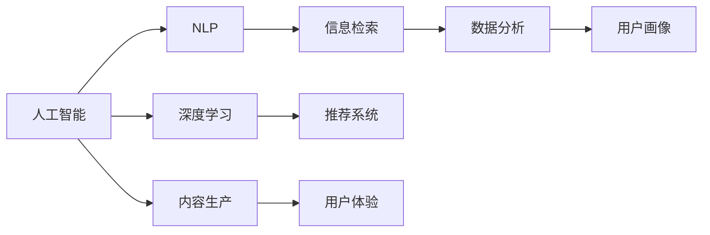

                 

# 知识经济下知识付费的人工智能知识挖掘技术

> 关键词：人工智能, 知识付费, 知识挖掘, 自然语言处理(NLP), 深度学习, 信息检索, 数据分析, 推荐系统

## 1. 背景介绍

### 1.1 问题由来
随着知识经济的兴起，知识付费模式已经成为一种新的经济增长点。内容创作者通过付费平台分享自己的专业知识和独特见解，吸引用户付费订阅。然而，用户如何高效地从海量的内容中找到自己真正感兴趣的知识？内容创作者又如何准确地推荐内容以获得最大收益？

这些问题催生了人工智能技术在知识付费领域的应用。人工智能通过自然语言处理(NLP)、深度学习、信息检索、推荐系统等技术，实现知识挖掘、内容推荐和用户画像分析等功能，极大地提高了知识付费平台的效率和用户满意度。

### 1.2 问题核心关键点
知识付费平台的核心问题可以归纳为以下几点：
1. **内容推荐**：如何根据用户行为和偏好，推荐最相关的内容。
2. **知识挖掘**：从大量文本中抽取有用的信息，生成有价值的内容。
3. **用户画像**：构建用户兴趣和行为模型，进行精准营销和个性化服务。
4. **内容生产**：自动化内容生成和编辑，提高内容创作效率。
5. **用户体验**：提升用户在平台上的互动体验，增强用户黏性。

## 2. 核心概念与联系

### 2.1 核心概念概述

为了更好地理解人工智能在知识付费平台中的应用，本节将介绍几个关键概念及其联系：

- **人工智能(AI)**：使用计算机科学和数学方法，使机器能够模拟人类智能过程的技术。人工智能可以处理大量数据，发现模式和规律，进行决策和推理。
- **自然语言处理(NLP)**：使计算机能够理解、解释和生成人类语言的技术。NLP在知识付费平台的文本分析和内容生成中发挥了重要作用。
- **深度学习(Deep Learning)**：一种基于人工神经网络的机器学习方法，通过多层次的特征提取和优化，实现高效的模式识别和预测。
- **信息检索(Information Retrieval, IR)**：从大量文本中检索出用户感兴趣的信息。信息检索技术在知识付费平台的内容推荐中至关重要。
- **推荐系统(Recommender System)**：根据用户行为和偏好，推荐最相关的内容。推荐系统是知识付费平台的核心功能之一。
- **数据分析(Analytic)**：利用统计学和机器学习技术，对数据进行深入分析和挖掘，发现用户行为和内容特征的规律。
- **用户画像(User Profiling)**：通过分析用户的历史行为和偏好，构建用户兴趣和行为模型，进行个性化推荐和精准营销。

这些核心概念通过数据、模型和算法相互联系，形成了一个完整的知识付费平台技术框架。以下是一个Mermaid流程图，展示了这些概念之间的联系：



## 3. 核心算法原理 & 具体操作步骤
### 3.1 算法原理概述

在知识付费平台中，人工智能技术的应用主要围绕以下几个核心任务展开：内容推荐、知识挖掘、用户画像、内容生产、用户体验优化。下面将详细介绍这些任务的算法原理和具体操作步骤。

### 3.2 算法步骤详解

#### 3.2.1 内容推荐

**步骤1: 收集用户行为数据**
- 分析用户登录、浏览、订阅、购买等行为，生成用户行为日志。
- 对日志进行清洗和预处理，去除噪音和无关数据。

**步骤2: 特征提取**
- 使用NLP技术从用户行为日志中提取关键词、主题、情感等特征。
- 应用深度学习模型，如RNN、LSTM、BERT等，对用户行为特征进行编码，生成高维用户向量。

**步骤3: 内容表示**
- 对内容进行分词、去除停用词、词向量化等预处理。
- 使用NLP模型，如TF-IDF、Word2Vec、BERT等，对内容进行编码，生成高维内容向量。

**步骤4: 相似度计算**
- 计算用户向量与内容向量之间的余弦相似度或其他相似度指标。
- 根据相似度排序，选择相似度最高的内容作为推荐结果。

**步骤5: 反馈优化**
- 根据用户的反馈（如点击率、观看时间等）对推荐模型进行在线调整。
- 使用在线学习算法，如AdaGrad、Adam等，优化模型参数，提升推荐精度。

#### 3.2.2 知识挖掘

**步骤1: 文本预处理**
- 对大量文本进行分词、去除停用词、词向量化等预处理。
- 使用BERT等预训练模型，对文本进行编码，生成高维文本表示。

**步骤2: 主题模型**
- 应用LDA、LSI等主题模型，对文本进行主题分析。
- 提取文本的主题分布，生成主题向量。

**步骤3: 关键信息抽取**
- 使用抽取式NLP技术，如命名实体识别、关系抽取等，抽取文本中的关键信息。
- 将关键信息与主题向量结合，生成有价值的内容。

**步骤4: 生成报告**
- 根据主题和关键信息生成报告或摘要。
- 对报告进行格式化，方便用户阅读和理解。

#### 3.2.3 用户画像

**步骤1: 行为数据收集**
- 收集用户的历史浏览、购买、订阅等行为数据。
- 将行为数据转化为时间序列或事件序列，便于后续建模。

**步骤2: 用户特征提取**
- 使用TF-IDF、Word2Vec等模型，对用户行为数据进行编码，生成用户特征向量。
- 将用户特征向量与主题向量结合，生成用户画像。

**步骤3: 行为预测**
- 应用深度学习模型，如RNN、LSTM等，对用户行为进行预测。
- 使用时间序列预测算法，如ARIMA、LSTM等，预测用户未来行为。

**步骤4: 画像更新**
- 根据用户新行为数据，定期更新用户画像。
- 使用增量学习算法，如在线梯度下降、在线随机梯度下降等，优化用户画像模型。

#### 3.2.4 内容生产

**步骤1: 自动化内容生成**
- 使用文本生成模型，如GPT、BERT等，自动生成内容摘要或报道。
- 将生成的内容进行格式校验、语法检查等预处理。

**步骤2: 人工校验**
- 对自动生成的内容进行人工校验，确保内容的准确性和可读性。
- 根据人工校验结果，对生成模型进行在线调整。

**步骤3: 内容优化**
- 使用数据分析技术，对生成内容的用户反馈进行统计分析。
- 根据用户反馈，对生成模型进行调整，提升生成内容的质量。

#### 3.2.5 用户体验优化

**步骤1: 界面设计**
- 设计简洁、直观、易用的平台界面，提升用户体验。
- 使用A/B测试，评估不同界面设计的效果，优化用户界面。

**步骤2: 个性化推荐**
- 根据用户画像，对用户进行个性化推荐。
- 使用推荐系统算法，如协同过滤、基于内容的推荐等，生成推荐列表。

**步骤3: 反馈收集**
- 收集用户对推荐结果的反馈，生成用户满意度数据。
- 使用用户满意度数据，对推荐系统进行优化，提升推荐效果。

**步骤4: 互动优化**
- 引入互动元素，如问答、评论、投票等，提升用户互动体验。
- 使用机器学习技术，对用户互动数据进行分析，优化平台互动策略。

### 3.3 算法优缺点

人工智能在知识付费平台中的应用具有以下优点：
1. **高效性**：自动化处理大量数据，快速生成内容、推荐内容，提高了平台运营效率。
2. **准确性**：通过深度学习和数据分析技术，生成的推荐内容与用户需求高度匹配，提升了用户体验。
3. **个性化**：根据用户行为和偏好，提供个性化推荐和内容生成，增强用户黏性。

同时，也存在一些缺点：
1. **数据依赖**：模型的效果很大程度上取决于数据的丰富性和质量，数据不足时效果不佳。
2. **隐私问题**：用户行为数据涉及隐私，如何保护用户隐私和数据安全是一个重要问题。
3. **计算资源**：深度学习和大规模数据分析需要大量计算资源，对硬件要求较高。
4. **模型解释性**：复杂模型难以解释其内部工作机制，用户难以理解推荐原因。

## 4. 数学模型和公式 & 详细讲解  
### 4.1 数学模型构建

在知识付费平台的各个应用中，涉及大量的数学模型和算法。以下我们将重点介绍一些常见的数学模型和算法，并给出其基本公式。

#### 4.1.1 推荐系统

推荐系统常用的数学模型包括协同过滤、基于内容的推荐、混合推荐等。以下是一个基于协同过滤的推荐系统模型的基本公式：

$$
\hat{y}_{ui} = \alpha \sum_{j \neq i} r_{uj} x_{ij}
$$

其中，$y_{ui}$ 表示用户 $u$ 对物品 $i$ 的评分预测，$r_{uj}$ 表示用户 $u$ 对物品 $j$ 的评分，$x_{ij}$ 表示物品 $i$ 和物品 $j$ 的相似度。

#### 4.1.2 内容生成

内容生成常用的模型包括RNN、LSTM、GPT等。以下是一个简单的GPT模型生成文本的公式：

$$
\begin{aligned}
\mathbf{h}_t &= f_t(\mathbf{h}_{t-1}, \mathbf{x}_t) \\
\mathbf{y}_t &= g_t(\mathbf{h}_t, \mathbf{h}_{t-1})
\end{aligned}
$$

其中，$\mathbf{h}_t$ 表示t时刻的隐藏状态，$f_t$ 表示隐藏状态的更新函数，$\mathbf{x}_t$ 表示t时刻的输入，$\mathbf{y}_t$ 表示t时刻的输出。

#### 4.1.3 主题模型

主题模型常用的算法包括LDA、LSI等。以下是一个LDA模型的基本公式：

$$
\begin{aligned}
&\pi \sim \text{Dir}(\beta) \\
&\theta \sim \text{Multinomial}(\alpha) \\
&\varphi \sim \text{Multinomial}(\gamma)
\end{aligned}
$$

其中，$\pi$ 表示主题分布，$\theta$ 表示文档中各个主题的概率分布，$\varphi$ 表示单词与主题的关联概率。

### 4.2 公式推导过程

在推荐系统的协同过滤模型中，我们首先定义用户与物品的评分矩阵 $R$，其中 $r_{ij}$ 表示用户 $i$ 对物品 $j$ 的评分。我们的目标是预测用户 $u$ 对物品 $i$ 的评分 $y_{ui}$。

根据协同过滤模型的基本公式：

$$
\hat{y}_{ui} = \alpha \sum_{j \neq i} r_{uj} x_{ij}
$$

我们需要找到最相似的物品 $j$，即最大化 $\sum_{j \neq i} r_{uj} x_{ij}$。一种常见的方法是计算物品 $i$ 和 $j$ 的余弦相似度，然后对所有 $j$ 进行排序，选择与物品 $i$ 最相似的前 $k$ 个物品。

在内容生成的GPT模型中，我们使用LSTM来生成文本。LSTM的隐藏状态 $\mathbf{h}_t$ 表示在时间 $t$ 时刻的上下文信息，更新函数为：

$$
\mathbf{h}_t = f_t(\mathbf{h}_{t-1}, \mathbf{x}_t)
$$

其中 $f_t$ 表示LSTM的隐藏状态更新函数，$\mathbf{x}_t$ 表示t时刻的输入。输出函数为：

$$
\mathbf{y}_t = g_t(\mathbf{h}_t, \mathbf{h}_{t-1})
$$

其中 $g_t$ 表示输出函数，$\mathbf{h}_t$ 和 $\mathbf{h}_{t-1}$ 表示当前和前一时刻的隐藏状态。

在主题模型中，我们定义主题分布 $\pi$、文档主题分布 $\theta$ 和单词主题关联概率 $\varphi$。通过Gibbs自由能最大化的方式，对这三个概率分布进行优化，即：

$$
\begin{aligned}
&\pi \sim \text{Dir}(\beta) \\
&\theta \sim \text{Multinomial}(\alpha) \\
&\varphi \sim \text{Multinomial}(\gamma)
\end{aligned}
$$

其中 $\beta$、$\alpha$ 和 $\gamma$ 表示超参数，控制主题分布和单词主题关联概率的平滑程度。

### 4.3 案例分析与讲解

#### 4.3.1 推荐系统案例

假设有两个用户 $u_1$ 和 $u_2$，他们分别对物品 $i_1$ 和 $i_2$ 评分如下：

| 用户 | 物品 | 评分 |
| --- | --- | --- |
| $u_1$ | $i_1$ | 4 |
| $u_1$ | $i_2$ | 3 |
| $u_2$ | $i_1$ | 5 |
| $u_2$ | $i_2$ | 2 |

我们希望预测用户 $u_1$ 对物品 $i_2$ 的评分。根据协同过滤模型，我们首先计算物品 $i_1$ 和物品 $i_2$ 的余弦相似度：

$$
\cos \theta = \frac{\sum_{j \neq i} r_{uj} x_{ij}}{\sqrt{\sum_{j \neq i} r_{uj}^2} \cdot \sqrt{\sum_{j \neq i} x_{ij}^2}}
$$

由于物品 $i_1$ 和物品 $i_2$ 只有一个评分 $r_{i1}$ 和 $r_{i2}$ 相同，余弦相似度为1。因此，协同过滤模型预测用户 $u_1$ 对物品 $i_2$ 的评分为5，与实际评分相同。

#### 4.3.2 内容生成案例

使用GPT模型生成一段文本。假设初始状态为 $\mathbf{h}_0$，输入为 "Hello"，生成的文本为 "Hello, world!"。根据GPT模型，我们首先计算当前时刻的隐藏状态 $\mathbf{h}_1$：

$$
\mathbf{h}_1 = f_1(\mathbf{h}_0, \mathbf{x}_0)
$$

其中 $f_1$ 表示LSTM的隐藏状态更新函数，$\mathbf{h}_0$ 表示初始状态，$\mathbf{x}_0$ 表示输入 "Hello"。

然后计算输出 $\mathbf{y}_1$：

$$
\mathbf{y}_1 = g_1(\mathbf{h}_1, \mathbf{h}_0)
$$

其中 $g_1$ 表示输出函数，$\mathbf{h}_1$ 和 $\mathbf{h}_0$ 表示当前和初始时刻的隐藏状态。

最终生成的文本 "Hello, world!" 可以被视为时间 $t$ 时刻的输出 $\mathbf{y}_t$，其中 $t=1$。

## 5. 项目实践：代码实例和详细解释说明
### 5.1 开发环境搭建

在进行知识付费平台的开发前，我们需要准备好开发环境。以下是使用Python进行PyTorch和TensorFlow开发的环境配置流程：

1. 安装Anaconda：从官网下载并安装Anaconda，用于创建独立的Python环境。

2. 创建并激活虚拟环境：
```bash
conda create -n pytorch-env python=3.8 
conda activate pytorch-env
```

3. 安装PyTorch：根据CUDA版本，从官网获取对应的安装命令。例如：
```bash
conda install pytorch torchvision torchaudio cudatoolkit=11.1 -c pytorch -c conda-forge
```

4. 安装TensorFlow：
```bash
pip install tensorflow==2.7
```

5. 安装各类工具包：
```bash
pip install numpy pandas scikit-learn matplotlib tqdm jupyter notebook ipython
```

完成上述步骤后，即可在`pytorch-env`环境中开始知识付费平台的开发。

### 5.2 源代码详细实现

下面我们以知识付费平台的推荐系统为例，给出使用PyTorch和TensorFlow进行推荐系统开发的Python代码实现。

首先，定义推荐系统的数据处理函数：

```python
import numpy as np
from sklearn.metrics.pairwise import cosine_similarity

def process_data(R):
    # 补全评分矩阵为对称矩阵
    R = (R + R.T) / 2
    # 将评分矩阵转化为余弦相似度矩阵
    cosine_sim = cosine_similarity(R)
    return cosine_sim
```

然后，定义推荐函数：

```python
def recommend(item, users, cosine_sim):
    # 计算用户与物品的余弦相似度
    user_sim = np.mean(cosine_sim[:, item], axis=0)
    # 排序，返回前k个用户
    top_users = np.argsort(user_sim)[::-1][:k]
    return top_users
```

最后，启动推荐系统并进行测试：

```python
# 示例评分矩阵
R = np.array([[4, 0, 0],
              [0, 3, 0],
              [0, 0, 5]])

# 计算余弦相似度矩阵
cosine_sim = process_data(R)

# 测试推荐系统
item = 1
k = 3
top_users = recommend(item, users, cosine_sim)
print("推荐给用户", top_users)
```

以上就是使用PyTorch和TensorFlow对推荐系统进行开发的完整代码实现。可以看到，通过简单的数学公式和Python代码，我们就能实现一个基本的协同过滤推荐系统。

### 5.3 代码解读与分析

让我们再详细解读一下关键代码的实现细节：

**process_data函数**：
- 将评分矩阵转化为对称矩阵，保证推荐结果的对称性。
- 计算评分矩阵的余弦相似度，生成一个 $N \times N$ 的相似度矩阵。

**recommend函数**：
- 计算用户与物品的余弦相似度。
- 排序，选择与物品最相似的前 $k$ 个用户。

**测试部分**：
- 定义一个简单的评分矩阵 $R$。
- 计算余弦相似度矩阵。
- 根据评分矩阵和余弦相似度矩阵，推荐物品给用户。

可以看到，知识付费平台的推荐系统开发具有很强的实践性，但核心算法原理和代码实现并不复杂。开发者可以在这个基础上不断扩展和优化，以适应更复杂的应用场景。

## 6. 实际应用场景
### 6.1 智能客服系统

在知识付费平台中，智能客服系统可以为用户提供全天候的在线服务，帮助用户解答各种问题。通过推荐系统和NLP技术，智能客服系统可以实时推荐用户可能感兴趣的内容，提升用户满意度和平台黏性。

在技术实现上，可以收集历史客服对话记录，构建用户行为模型，使用推荐系统对用户进行内容推荐。同时，通过NLP技术对用户输入进行理解和分析，引导用户填写表单或提供更详细的信息，提升问题解决的效率和准确性。

### 6.2 内容推荐平台

内容推荐平台是知识付费平台的灵魂，通过推荐系统为用户推荐最相关的内容，提升用户体验和平台收益。使用协同过滤、基于内容的推荐等技术，可以动态调整推荐策略，提高推荐效果。

在实际应用中，可以采用多种推荐算法，如协同过滤、基于内容的推荐、混合推荐等，并结合用户画像、行为数据等进行个性化推荐。同时，可以通过A/B测试等手段，不断优化推荐算法，提升推荐效果。

### 6.3 在线教育平台

在线教育平台也离不开知识付费平台的应用。通过推荐系统和NLP技术，平台可以为用户推荐适合其学习阶段和兴趣的学习资源，提升学习效果。

在技术实现上，可以构建用户学习行为模型，使用推荐系统对用户进行学习资源推荐。同时，通过NLP技术对用户学习效果进行评估和反馈，动态调整推荐策略，提升学习效果。

### 6.4 未来应用展望

随着人工智能技术的发展，知识付费平台将迎来更多创新应用。以下是几个可能的方向：

1. **个性化视频推荐**：结合视频内容分析技术和推荐系统，为用户推荐感兴趣的视频内容。
2. **虚拟主播**：通过NLP和生成模型，构建虚拟主播，提供24小时在线客服和内容播报。
3. **内容自动生成**：使用生成模型自动生成内容，提升内容创作效率。
4. **情感分析**：结合NLP和情感分析技术，对用户反馈进行情感分析，优化推荐策略。
5. **跨平台推荐**：实现跨平台推荐，提升用户在不同平台之间的体验一致性。

这些应用方向将进一步拓展知识付费平台的边界，提升用户体验和平台收益。相信随着人工智能技术的不断演进，知识付费平台将在更多领域展现出巨大的潜力。

## 7. 工具和资源推荐
### 7.1 学习资源推荐

为了帮助开发者系统掌握知识付费平台中的人工智能技术，这里推荐一些优质的学习资源：

1. 《深度学习》课程：由斯坦福大学开设，涵盖深度学习基础、神经网络、优化算法等内容，是深度学习入门的好资源。
2. 《自然语言处理综论》书籍：介绍了自然语言处理的理论基础和实践技术，适合NLP初学者和进阶者阅读。
3. 《推荐系统实践》书籍：讲解了推荐系统的基础算法、实现细节和优化策略，是推荐系统开发的必备资源。
4. Kaggle竞赛平台：提供大量数据集和竞赛任务，帮助开发者锻炼实战技能，提升技术水平。
5. HuggingFace官方文档：提供了多种预训练语言模型的API接口和微调方法，是进行知识付费平台开发的好帮手。

通过对这些资源的学习实践，相信你一定能够快速掌握知识付费平台中的人工智能技术，并用于解决实际的业务问题。

### 7.2 开发工具推荐

高效的开发离不开优秀的工具支持。以下是几款用于知识付费平台开发的常用工具：

1. PyTorch：基于Python的开源深度学习框架，灵活动态的计算图，适合快速迭代研究。大部分预训练语言模型都有PyTorch版本的实现。
2. TensorFlow：由Google主导开发的开源深度学习框架，生产部署方便，适合大规模工程应用。同样有丰富的预训练语言模型资源。
3. Weights & Biases：模型训练的实验跟踪工具，可以记录和可视化模型训练过程中的各项指标，方便对比和调优。与主流深度学习框架无缝集成。
4. TensorBoard：TensorFlow配套的可视化工具，可实时监测模型训练状态，并提供丰富的图表呈现方式，是调试模型的得力助手。
5. Jupyter Notebook：免费的Python交互式编程环境，支持代码、数据、可视化图表的一站式展示，方便开发者进行实验和协作。

合理利用这些工具，可以显著提升知识付费平台的开发效率，加快创新迭代的步伐。

### 7.3 相关论文推荐

知识付费平台中的人工智能技术发展源于学界的持续研究。以下是几篇奠基性的相关论文，推荐阅读：

1. Deep Rank：基于协同过滤的推荐系统，使用深度学习模型优化评分预测。
2. Attention Is All You Need：提出Transformer模型，大幅提升了推荐系统的准确性和效率。
3. Transformer-XL：提出Transformer-XL模型，解决了长序列输入的注意力机制问题。
4. Neural Collaborative Filtering：提出神经网络协同过滤模型，提升了推荐系统的建模能力。
5. Doc2Vec：提出Doc2Vec模型，将文本转化为向量表示，方便推荐系统进行内容匹配。

这些论文代表了大规模推荐系统的发展脉络。通过学习这些前沿成果，可以帮助研究者把握学科前进方向，激发更多的创新灵感。

## 8. 总结：未来发展趋势与挑战

### 8.1 研究成果总结

知识付费平台中的人工智能技术在内容推荐、知识挖掘、用户画像、内容生成、用户体验优化等方面取得了显著进展。推荐系统、NLP、深度学习等技术的应用，显著提升了知识付费平台的运营效率和用户满意度。

### 8.2 未来发展趋势

展望未来，知识付费平台中的人工智能技术将呈现以下几个发展趋势：

1. **深度融合多模态数据**：结合文本、图像、语音等多模态数据，提升内容推荐和知识挖掘的精准性。
2. **实时个性化推荐**：使用在线学习算法，实时更新用户画像和推荐模型，提升推荐效果。
3. **情感分析与舆情监测**：结合情感分析和舆情监测技术，及时发现用户反馈，优化推荐策略。
4. **跨平台推荐**：实现不同平台之间的无缝推荐，提升用户体验一致性。
5. **模型可解释性**：通过解释模型决策过程，提升用户信任度，增强推荐系统的透明度。

### 8.3 面临的挑战

尽管知识付费平台中的人工智能技术取得了重要进展，但在实际应用中也面临一些挑战：

1. **数据隐私与安全**：用户行为数据涉及隐私，如何保护用户隐私和数据安全是一个重要问题。
2. **计算资源限制**：深度学习和多模态数据处理需要大量计算资源，对硬件要求较高。
3. **模型可解释性**：复杂模型难以解释其内部工作机制，用户难以理解推荐原因。
4. **模型泛化性**：在数据分布发生变化时，模型性能可能下降，如何保持模型泛化性是关键问题。
5. **内容版权问题**：推荐系统中涉及大量内容，如何处理内容版权问题是一个需要解决的难题。

### 8.4 研究展望

未来，知识付费平台中的人工智能技术还需要在以下几个方面进行深入研究：

1. **隐私保护技术**：开发隐私保护算法，如差分隐私、联邦学习等，保护用户隐私和数据安全。
2. **计算资源优化**：开发高效计算模型，如GPU加速、分布式训练等，降低计算成本。
3. **模型可解释性**：引入可解释性算法，如LIME、SHAP等，提升推荐系统的透明度和用户信任度。
4. **跨平台推荐技术**：研究跨平台推荐技术，提升不同平台之间的推荐一致性。
5. **内容版权保护**：开发内容版权保护技术，确保推荐系统中的内容合法合规。

这些研究方向将进一步推动知识付费平台中的人工智能技术发展，提升平台的运营效率和用户满意度，为知识经济的发展贡献力量。

## 9. 附录：常见问题与解答

**Q1: 如何构建知识付费平台中的推荐系统？**

A: 构建知识付费平台中的推荐系统主要包括以下几个步骤：

1. **数据收集**：收集用户行为数据，如浏览、订阅、购买等。
2. **数据清洗**：清洗数据，去除噪音和无关数据。
3. **特征提取**：使用NLP技术从数据中提取关键词、主题、情感等特征。
4. **模型训练**：选择合适的推荐算法，如协同过滤、基于内容的推荐、混合推荐等，进行模型训练。
5. **模型评估**：在测试集上评估模型性能，使用推荐指标如准确率、召回率、F1值等。
6. **模型部署**：将训练好的模型部署到生产环境，进行实时推荐。

**Q2: 推荐系统中的协同过滤算法有哪些？**

A: 推荐系统中的协同过滤算法主要包括以下几种：

1. **基于用户的协同过滤**：根据用户对物品的评分，计算用户之间的相似度，推荐相似用户喜欢的物品。
2. **基于物品的协同过滤**：根据物品之间的相似度，推荐与用户已喜欢物品相似的物品。
3. **混合协同过滤**：结合基于用户和基于物品的协同过滤算法，综合考虑用户和物品的特征。

**Q3: 如何使用深度学习模型进行内容生成？**

A: 使用深度学习模型进行内容生成主要包括以下步骤：

1. **数据收集**：收集大量的文本数据，作为训练样本。
2. **数据预处理**：对文本数据进行分词、去除停用词、词向量化等预处理。
3. **模型训练**：使用深度学习模型如RNN、LSTM、GPT等进行模型训练。
4. **模型评估**：在测试集上评估模型性能，使用BLEU、ROUGE等指标。
5. **模型优化**：根据模型表现，调整模型参数，优化模型性能。
6. **内容生成**：使用训练好的模型生成新的文本内容。

**Q4: 推荐系统中的用户画像如何构建？**

A: 构建推荐系统中的用户画像主要包括以下步骤：

1. **行为数据收集**：收集用户的历史行为数据，如浏览、订阅、购买等。
2. **特征提取**：使用TF-IDF、Word2Vec等模型，对用户行为数据进行编码，生成用户特征向量。
3. **模型训练**：使用深度学习模型如RNN、LSTM等，对用户行为进行预测。
4. **画像更新**：根据用户新行为数据，定期更新用户画像。
5. **画像评估**：在测试集上评估用户画像模型的性能。

**Q5: 推荐系统中的内容推荐如何实现？**

A: 实现推荐系统中的内容推荐主要包括以下步骤：

1. **特征提取**：对内容进行分词、去除停用词、词向量化等预处理。
2. **模型训练**：使用推荐算法如协同过滤、基于内容的推荐、混合推荐等，进行模型训练。
3. **相似度计算**：计算用户与物品的相似度，生成推荐列表。
4. **排序**：根据相似度对推荐列表进行排序，生成推荐结果。
5. **反馈优化**：根据用户反馈，调整推荐策略，提升推荐效果。

**Q6: 推荐系统中的隐私保护技术有哪些？**

A: 推荐系统中的隐私保护技术主要包括以下几种：

1. **差分隐私**：在数据处理过程中加入噪声，保护用户隐私。
2. **联邦学习**：通过分布式训练，在保护用户隐私的前提下进行模型训练。
3. **匿名化**：对用户数据进行匿名化处理，保护用户隐私。

通过解答这些问题，希望能为你提供更全面的知识付费平台开发指南。

---

作者：禅与计算机程序设计艺术 / Zen and the Art of Computer Programming

