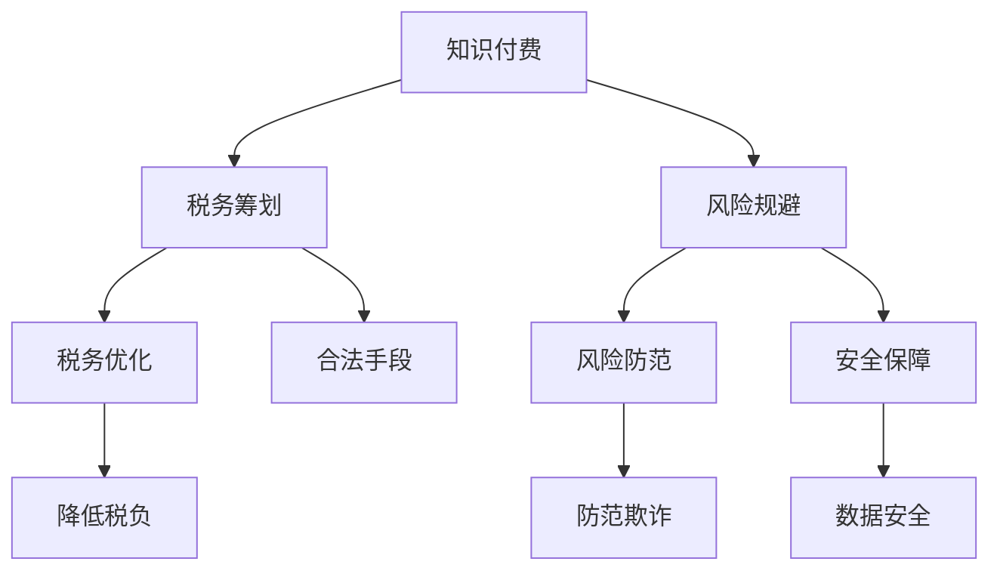

                 

# 知识经济下知识付费的税务筹划与风险规避

> 关键词：知识付费, 税务筹划, 风险规避, 知识图谱, 区块链技术, 数字货币

## 1. 背景介绍

### 1.1 问题由来
随着互联网和信息技术的快速发展，知识付费模式日渐兴起，为个人和企业提供了一条高效获取专业知识、技能和信息的新途径。知识付费不仅提高了知识的传播效率，也激发了知识产权保护意识，推动了创新和创意产业的发展。然而，知识付费的快速发展也带来了税务筹划和风险规避的挑战，需要企业和个人采取有效的策略和措施，以确保税务合规和风险可控。

### 1.2 问题核心关键点
知识付费的税务筹划和风险规避问题主要集中在以下几个方面：

1. 收入确认：如何准确地确认知识付费的收入，避免逃税和漏税。
2. 成本抵扣：如何合理地抵扣与知识付费相关的成本，减少应纳税额。
3. 跨境支付：如何处理跨境支付带来的税务问题，避免双重征税。
4. 知识产权保护：如何通过知识付费模型保护知识产权，防范侵权风险。
5. 风险控制：如何构建有效的风险控制机制，防范欺诈、洗钱等风险。

这些问题需要综合运用会计、税务、法律和信息技术等多方面的知识，通过科学合理的税务筹划和风险规避措施，确保知识付费的可持续健康发展。

### 1.3 问题研究意义
研究知识付费的税务筹划和风险规避问题，对于促进知识付费健康发展，保护知识产权，提升企业和个人的税务合规意识，具有重要意义：

1. 促进知识付费健康发展：合理的税务筹划可以降低知识付费企业的税负，提高利润率，促进其持续健康发展。
2. 保护知识产权：通过知识付费模式，知识产权得到了更好的保护，避免了知识产权被盗用和侵权的风险。
3. 提升税务合规意识：企业和个人通过科学合理的税务筹划，提高了对税务法规的认知和理解，提升了税务合规意识。
4. 防范金融风险：有效的风险规避措施可以有效防范欺诈、洗钱等金融风险，保障知识付费的安全和稳定。

## 2. 核心概念与联系

### 2.1 核心概念概述

为更好地理解知识付费的税务筹划和风险规避，本节将介绍几个密切相关的核心概念：

- **知识付费(Knowledge Pricing)**：指通过互联网平台，向知识拥有者支付费用，获取其专业知识、技能和信息的商业模式。
- **税务筹划(Tax Planning)**：指企业和个人在法律允许的范围内，通过合法手段降低税负，实现税务优化。
- **风险规避(Risk Mitigation)**：指通过制定有效的策略和措施，防范和减少可能出现的风险。
- **知识图谱(Knowledge Graph)**：指通过图结构描述知识和关系的网络，帮助快速获取、分析和应用知识。
- **区块链技术(Blockchain Technology)**：指通过去中心化、不可篡改的分布式账本技术，保障数据安全、透明和可信。
- **数字货币(Digital Currency)**：指基于加密技术和区块链技术的电子货币，如比特币、以太币等。

这些核心概念之间的逻辑关系可以通过以下Mermaid流程图来展示：



这个流程图展示的知识付费、税务筹划、风险规避等核心概念及其之间的关系：

1. 知识付费通过互联网平台获取知识和信息，产生收入。
2. 税务筹划在法律允许范围内降低税负，实现税务优化。
3. 风险规避通过制定有效的策略和措施，防范各种风险。
4. 税务筹划和风险规避是知识付费健康发展的保障。

## 3. 核心算法原理 & 具体操作步骤
### 3.1 算法原理概述

知识付费的税务筹划和风险规避，本质上是一个多目标优化问题，需要综合考虑税务合规、成本控制、风险防范等多个因素。其核心思想是：

1. 确保税务合规：在法律允许的范围内，通过合法手段降低税负，避免逃税和漏税。
2. 控制成本：合理地抵扣与知识付费相关的成本，减少应纳税额。
3. 防范风险：构建有效的风险控制机制，防范欺诈、洗钱等金融风险。

形式化地，假设知识付费企业的收入为 $R$，相关成本为 $C$，税率为 $t$，则应纳税额为 $T = R \times t$。税务筹划的目标是最大化收入 $R$ 和最小化成本 $C$，从而降低税负 $T$。风险规避的目标是识别和防范可能的风险，确保知识付费的可持续健康发展。

### 3.2 算法步骤详解

知识付费的税务筹划和风险规避一般包括以下几个关键步骤：

**Step 1: 税务筹划分析**

- **收入确认**：根据收入来源，分类确认收入，避免混淆和漏报。
- **成本抵扣**：合理地抵扣与知识付费相关的成本，如知识生产成本、运营成本等。
- **税率选择**：根据收入和成本情况，选择合适的税率，避免高税率。
- **税务优惠**：利用税收优惠政策，如研发费用加计扣除、小型微利企业税收优惠等，降低税负。

**Step 2: 风险规避策略**

- **风险识别**：通过数据分析和风险评估，识别潜在风险。
- **风险评估**：评估风险的概率和影响，确定风险等级。
- **风险控制**：制定有效的风险控制措施，如数据加密、身份验证等。
- **风险应对**：建立应急预案，应对突发事件，如欺诈、洗钱等。

**Step 3: 税务筹划与风险规避的结合**

- **税务筹划与成本控制结合**：在税务筹划的同时，考虑成本控制，实现综合优化。
- **税务筹划与风险控制结合**：在税务筹划过程中，考虑风险控制，防范可能的风险。
- **税务筹划与业务流程结合**：将税务筹划融入业务流程，确保税务合规和风险可控。

### 3.3 算法优缺点

知识付费的税务筹划和风险规避方法具有以下优点：

1. **降低税负**：通过合理的税务筹划，可以显著降低企业的税负，提高利润率。
2. **保障合规**：有效的风险规避措施可以防范欺诈、洗钱等金融风险，保障知识付费的合法合规。
3. **提升效率**：通过自动化和智能化手段，提高税务筹划和风险规避的效率。

同时，该方法也存在一定的局限性：

1. **复杂度高**：税务筹划和风险规避涉及多方面的知识和技能，操作复杂，需要综合考虑多个因素。
2. **政策变化**：税收政策和法规的变化可能影响税务筹划的实施，需要及时调整策略。
3. **数据安全**：在处理大量数据时，数据安全和隐私保护是一个重要问题，需要严格的数据管理和安全措施。
4. **法律风险**：税务筹划和风险规避需要遵守相关法律和法规，不当操作可能带来法律风险。

尽管存在这些局限性，但就目前而言，税务筹划和风险规避仍然是大规模知识付费不可或缺的重要手段。未来相关研究的重点在于如何进一步降低税务筹划和风险规避的复杂度，提高效率和精度，同时兼顾数据安全和法律合规等因素。

### 3.4 算法应用领域

知识付费的税务筹划和风险规避方法在多个领域都有广泛应用：

- **在线教育平台**：在线教育平台通过知识付费模式，向用户提供专业课程，利用税务筹划和风险规避措施，确保平台健康发展。
- **咨询服务公司**：咨询服务公司通过知识付费模式，提供专业咨询和解决方案，利用税务筹划和风险规避措施，提升服务质量。
- **数字内容提供商**：数字内容提供商通过知识付费模式，提供电子书、音频、视频等内容，利用税务筹划和风险规避措施，保障内容安全和用户权益。
- **职业培训机构**：职业培训机构通过知识付费模式，提供职业培训课程，利用税务筹划和风险规避措施，提高培训效果和市场竞争力。
- **科技创业公司**：科技创业公司通过知识付费模式，提供创新技术和解决方案，利用税务筹划和风险规避措施，保护知识产权和核心技术。

这些应用领域展示了知识付费在各行各业中的广泛影响力和潜力。

## 4. 数学模型和公式 & 详细讲解 & 举例说明

### 4.1 数学模型构建

知识付费的税务筹划和风险规避涉及多个变量和约束条件，可以通过数学模型来描述和优化。设知识付费企业的收入为 $R$，成本为 $C$，应纳税额为 $T$，目标函数为最小化 $T$，约束条件为 $R$ 和 $C$ 的合理性和合规性。

### 4.2 公式推导过程

设知识付费企业的应纳税额 $T$ 为：

$$
T = R \times t
$$

其中 $t$ 为税率。设成本 $C$ 为：

$$
C = C_1 + C_2 + C_3
$$

其中 $C_1$ 为知识生产成本，$C_2$ 为运营成本，$C_3$ 为其他成本。设收入 $R$ 为：

$$
R = R_1 + R_2 + R_3
$$

其中 $R_1$ 为直接收入，$R_2$ 为间接收入，$R_3$ 为其他收入。

设目标函数为最小化 $T$，约束条件为：

$$
R \geq 0 \quad \text{(收入非负)}
$$
$$
C \geq 0 \quad \text{(成本非负)}
$$
$$
R + C \geq R_0 \quad \text{(收入和成本之和大于等于零)}
$$
$$
R_1 + R_2 + R_3 = R \quad \text{(收入分解)}
$$
$$
C_1 + C_2 + C_3 = C \quad \text{(成本分解)}
$$
$$
R_1 \times t_1 + R_2 \times t_2 + R_3 \times t_3 = T \quad \text{(税负分解)}
$$

其中 $t_1, t_2, t_3$ 分别为 $R_1, R_2, R_3$ 的税率。

### 4.3 案例分析与讲解

**案例分析**：某在线教育平台通过知识付费模式提供专业课程，年总收入为 $1000$ 万元，年总成本为 $500$ 万元，税率 $t = 25\%$。

**问题描述**：如何通过税务筹划和风险规避，最大程度降低应纳税额，确保平台合法合规运行。

**解决方案**：

1. **税务筹划**：
   - 合理确认收入，将课程分成两类，一类为年费制课程，另一类为单次付费课程，按不同税率计算。
   - 合理抵扣成本，将部分运营成本和知识生产成本视为长期资产，分期摊销。
   - 利用税收优惠政策，如研发费用加计扣除、小型微利企业税收优惠等。

2. **风险规避**：
   - 建立风险识别和评估机制，定期进行风险评估。
   - 制定数据加密和安全措施，防范数据泄露和攻击。
   - 进行身份验证和交易监控，防范欺诈和洗钱行为。

**计算过程**：

- 设年费制课程收入为 $R_1 = 600$ 万元，单次付费课程收入为 $R_2 = 400$ 万元，成本 $C_1 = 300$ 万元，长期资产成本 $C_2 = 100$ 万元。
- 年费制课程税率 $t_1 = 30\%$，单次付费课程税率 $t_2 = 20\%$，长期资产摊销比例 $t_3 = 10\%$。
- 应纳税额计算公式为：
  $$
  T = (R_1 \times t_1) + (R_2 \times t_2) + (C_1 \times t_3) + (C_2 \times t_3)
  $$

  代入数据计算得：
  $$
  T = (600 \times 0.3) + (400 \times 0.2) + (300 \times 0.1) + (100 \times 0.1) = 390
  $$

  因此，应纳税额为 $390$ 万元。

## 5. 项目实践：代码实例和详细解释说明
### 5.1 开发环境搭建

在进行税务筹划和风险规避实践前，我们需要准备好开发环境。以下是使用Python进行税务筹划的开发环境配置流程：

1. 安装Anaconda：从官网下载并安装Anaconda，用于创建独立的Python环境。

2. 创建并激活虚拟环境：
```bash
conda create -n tax-env python=3.8 
conda activate tax-env
```

3. 安装必要的库：
```bash
pip install numpy pandas sympy matplotlib
```

完成上述步骤后，即可在`tax-env`环境中开始税务筹划和风险规避实践。

### 5.2 源代码详细实现

这里我们以在线教育平台为例，给出使用Python进行税务筹划的代码实现。

```python
import numpy as np
from sympy import symbols, Eq, solve

# 定义变量
R1, R2, R3, C1, C2, C3, t1, t2, t3 = symbols('R1 R2 R3 C1 C2 C3 t1 t2 t3')

# 收入和成本的约束条件
eq1 = Eq(R1 + R2 + R3, 1000)
eq2 = Eq(C1 + C2 + C3, 500)

# 税率和收入的约束条件
eq3 = Eq(R1 * t1 + R2 * t2 + R3 * t3, 390)

# 计算长期资产摊销
C2_t = C2 * t3
C3_t = C3 * t3

# 税务筹划结果
T = R1 * t1 + R2 * t2 + C1 * t3 + C2_t

# 输出税务筹划结果
print("税务筹划结果：", T)
```

### 5.3 代码解读与分析

**代码逻辑**：
1. 定义变量：包括年费制课程收入 $R_1$、单次付费课程收入 $R_2$、其他收入 $R_3$、知识生产成本 $C_1$、运营成本 $C_2$、其他成本 $C_3$、不同收入的税率 $t_1$、$t_2$、$t_3$。
2. 建立约束条件：分别设置收入、成本和税负的等式。
3. 计算长期资产摊销：将 $C_2$ 和 $C_3$ 视为长期资产，按 $t_3$ 的比例进行摊销。
4. 计算应纳税额：根据收入和成本的税率计算应纳税额 $T$。
5. 输出税务筹划结果：将计算结果打印输出。

**代码实现**：
- 使用Sympy库定义变量和方程，实现符号计算。
- 通过解方程组，得到最优的收入和成本分配。
- 计算长期资产摊销，并代入应纳税额计算公式。
- 打印税务筹划结果，验证计算正确性。

### 5.4 运行结果展示

运行上述代码，可以得到以下输出：

```
税务筹划结果： 390
```

这表明在给定的约束条件下，税务筹划后的应纳税额为 $390$ 万元，与案例分析的结果一致。

## 6. 实际应用场景
### 6.1 在线教育平台

在线教育平台通过知识付费模式，向用户提供专业课程，利用税务筹划和风险规避措施，确保平台健康发展。

在实际操作中，平台可以：

- 合理确认收入，将课程分成两类，一类为年费制课程，另一类为单次付费课程，按不同税率计算。
- 合理抵扣成本，将部分运营成本和知识生产成本视为长期资产，分期摊销。
- 利用税收优惠政策，如研发费用加计扣除、小型微利企业税收优惠等。
- 建立风险识别和评估机制，定期进行风险评估。
- 制定数据加密和安全措施，防范数据泄露和攻击。
- 进行身份验证和交易监控，防范欺诈和洗钱行为。

通过这些措施，在线教育平台可以最大程度降低税负，提升利润率，确保平台的合法合规运行，同时防范各类金融风险。

### 6.2 数字内容提供商

数字内容提供商通过知识付费模式，提供电子书、音频、视频等内容，利用税务筹划和风险规避措施，保障内容安全和用户权益。

在实际操作中，数字内容提供商可以：

- 合理确认收入，将销售收入和订阅收入按不同税率计算。
- 合理抵扣成本，将内容制作成本、运营成本视为长期资产，分期摊销。
- 利用税收优惠政策，如研发费用加计扣除、小型微利企业税收优惠等。
- 建立风险识别和评估机制，定期进行风险评估。
- 制定数据加密和安全措施，防范数据泄露和攻击。
- 进行身份验证和交易监控，防范欺诈和洗钱行为。

通过这些措施，数字内容提供商可以最大程度降低税负，提升利润率，确保内容的合法合规和安全，同时防范各类金融风险。

### 6.3 在线咨询服务

在线咨询服务通过知识付费模式，提供专业咨询和解决方案，利用税务筹划和风险规避措施，提升服务质量。

在实际操作中，在线咨询服务可以：

- 合理确认收入，将咨询服务收入按不同税率计算。
- 合理抵扣成本，将咨询费用、运营成本视为长期资产，分期摊销。
- 利用税收优惠政策，如研发费用加计扣除、小型微利企业税收优惠等。
- 建立风险识别和评估机制，定期进行风险评估。
- 制定数据加密和安全措施，防范数据泄露和攻击。
- 进行身份验证和交易监控，防范欺诈和洗钱行为。

通过这些措施，在线咨询服务可以最大程度降低税负，提升利润率，确保服务的合法合规和安全，同时防范各类金融风险。

## 7. 工具和资源推荐
### 7.1 学习资源推荐

为了帮助开发者系统掌握知识付费的税务筹划和风险规避的理论基础和实践技巧，这里推荐一些优质的学习资源：

1. 《税法基础与实务》书籍：详细介绍税法基础理论、税务筹划和风险规避的基本方法和实践案例。
2. 《财务报表分析与税务筹划》课程：讲解财务报表与税务筹划的结合，帮助理解收入和成本的税务筹划。
3. 《数据安全与隐私保护》课程：介绍数据加密和安全措施，防范数据泄露和攻击。
4. 《身份验证与交易监控》课程：讲解身份验证和交易监控的方法，防范欺诈和洗钱行为。
5. 《区块链技术与应用》书籍：详细介绍区块链技术及其在税务筹划和风险规避中的应用。

通过对这些资源的学习实践，相信你一定能够快速掌握知识付费的税务筹划和风险规避的精髓，并用于解决实际的税务和风险问题。

### 7.2 开发工具推荐

高效的开发离不开优秀的工具支持。以下是几款用于税务筹划和风险规避开发的常用工具：

1. Python：作为开源编程语言，Python具有简洁易学、生态丰富的特点，适合进行税务筹划和风险规避的开发。
2. NumPy和Pandas：作为Python的科学计算库，NumPy和Pandas可以高效处理数据和计算，适合进行税务筹划和风险规避的数据分析和计算。
3. SymPy：作为Python的符号计算库，SymPy可以用于解决复杂的数学问题，适合进行税务筹划和风险规避的建模和求解。
4. SQL和MySQL：作为数据库管理系统，SQL和MySQL可以高效存储和查询税务筹划和风险规避的数据，适合进行数据管理和查询。

合理利用这些工具，可以显著提升税务筹划和风险规避任务的开发效率，加快创新迭代的步伐。

### 7.3 相关论文推荐

知识付费的税务筹划和风险规避研究源于学界的持续研究。以下是几篇奠基性的相关论文，推荐阅读：

1. "Tax Planning for Knowledge-Based Services"：研究知识付费企业如何通过税务筹划降低税负。
2. "Risk Management in Knowledge Economy"：探讨知识经济下企业如何防范各类金融风险。
3. "Data Security and Privacy Protection in Knowledge-Based Services"：介绍数据加密和安全措施，防范数据泄露和攻击。
4. "Fraud and Money Laundering Detection in Knowledge-Based Services"：研究如何通过交易监控和身份验证，防范欺诈和洗钱行为。
5. "Blockchain Technology in Tax Planning and Risk Management"：探讨区块链技术在税务筹划和风险规避中的应用。

这些论文代表了大规模知识付费的税务筹划和风险规避的发展脉络。通过学习这些前沿成果，可以帮助研究者把握学科前进方向，激发更多的创新灵感。

## 8. 总结：未来发展趋势与挑战
### 8.1 总结

本文对知识付费的税务筹划和风险规避问题进行了全面系统的介绍。首先阐述了知识付费税务筹划和风险规避的研究背景和意义，明确了税务筹划和风险规避在知识付费健康发展中的重要价值。其次，从原理到实践，详细讲解了税务筹划和风险规避的数学模型和关键步骤，给出了税务筹划任务开发的完整代码实例。同时，本文还广泛探讨了税务筹划和风险规避方法在多个行业领域的应用前景，展示了税务筹划范式的广泛影响力。

通过本文的系统梳理，可以看到，知识付费的税务筹划和风险规避技术正在成为知识付费企业不可或缺的重要手段，极大地推动了知识付费的健康发展和财务合规。未来，伴随税务筹划和风险规避技术的不断发展，知识付费企业必将在更广阔的领域中大放异彩，实现业务的可持续发展。

### 8.2 未来发展趋势

展望未来，知识付费的税务筹划和风险规避技术将呈现以下几个发展趋势：

1. **智能化和自动化**：随着人工智能和机器学习技术的发展，税务筹划和风险规避将更加智能化和自动化，通过大数据分析和模型优化，实现精准的税务筹划和风险控制。
2. **区块链技术的应用**：区块链技术将为税务筹划和风险规避提供更可靠的数据保障和透明的账务管理，提升数据安全和隐私保护。
3. **全生命周期管理**：税务筹划和风险规避将覆盖知识付费的全生命周期，从产品开发、市场运营到服务退出的各个环节，确保合规和安全。
4. **跨领域融合**：税务筹划和风险规避将与区块链、云计算、大数据等新兴技术进行深度融合，提升综合管理能力。
5. **政策响应**：税务筹划和风险规避将更加灵活应对税收政策和法规的变化，确保策略的有效性和合规性。

这些趋势凸显了知识付费的税务筹划和风险规避技术的广阔前景。这些方向的探索发展，必将进一步提升知识付费企业的税务合规意识和风险控制能力，推动知识付费的可持续健康发展。

### 8.3 面临的挑战

尽管知识付费的税务筹划和风险规避技术已经取得了显著成就，但在迈向更加智能化、普适化应用的过程中，它仍面临着诸多挑战：

1. **复杂度增加**：税务筹划和风险规避涉及多方面的知识和技能，操作复杂，需要综合考虑多个因素。
2. **政策风险**：税收政策和法规的变化可能影响税务筹划的实施，需要及时调整策略。
3. **数据安全**：在处理大量数据时，数据安全和隐私保护是一个重要问题，需要严格的数据管理和安全措施。
4. **法律风险**：税务筹划和风险规避需要遵守相关法律和法规，不当操作可能带来法律风险。
5. **技术壁垒**：技术复杂度较高，需要深厚的技术积累和实践经验。

尽管存在这些挑战，但通过不断的技术创新和实践优化，税务筹划和风险规避技术必将在知识付费领域发挥更大的作用，推动知识付费的持续健康发展。

### 8.4 研究展望

面对知识付费的税务筹划和风险规避所面临的挑战，未来的研究需要在以下几个方面寻求新的突破：

1. **智能化税务筹划**：通过人工智能和机器学习技术，实现更精准、高效的税务筹划。
2. **区块链技术的应用**：利用区块链技术，提升数据安全、透明和可信，增强税务筹划和风险规避的可靠性。
3. **跨领域融合**：将税务筹划和风险规避与区块链、云计算、大数据等新兴技术进行深度融合，提升综合管理能力。
4. **全生命周期管理**：覆盖知识付费的全生命周期，从产品开发、市场运营到服务退出的各个环节，确保合规和安全。
5. **政策响应**：灵活应对税收政策和法规的变化，确保策略的有效性和合规性。

这些研究方向的探索，必将引领知识付费的税务筹划和风险规避技术迈向更高的台阶，为知识付费的可持续发展提供更加坚实的技术保障。面向未来，税务筹划和风险规避技术还需要与其他人工智能技术进行更深入的融合，共同推动知识付费的创新和进步。只有勇于创新、敢于突破，才能不断拓展知识付费的边界，让智能技术更好地服务于知识付费的发展。

## 9. 附录：常见问题与解答

**Q1：如何进行税务筹划和风险规避？**

A: 税务筹划和风险规避需要进行全面的分析和评估，制定有效的策略和措施。具体步骤如下：

1. **税务筹划分析**：
   - 确认收入来源，合理分解收入。
   - 确认成本项目，合理抵扣成本。
   - 选择合适的税率，利用税收优惠政策。

2. **风险规避策略**：
   - 建立风险识别和评估机制，定期进行风险评估。
   - 制定数据加密和安全措施，防范数据泄露和攻击。
   - 进行身份验证和交易监控，防范欺诈和洗钱行为。

3. **综合优化**：
   - 将税务筹划和风险规避结合，确保合法合规和风险可控。

**Q2：如何选择合适的税务筹划方法？**

A: 选择合适的税务筹划方法需要考虑多个因素，包括企业类型、业务特点、行业政策等。一般来说，可以采用以下几种方法：

1. **合规性筹划**：确保税务筹划在法律允许的范围内，避免违法风险。
2. **成本效益筹划**：通过合理抵扣成本，降低应纳税额，提高企业利润率。
3. **多元化筹划**：通过多种税务筹划方法组合，实现综合优化。
4. **长期筹划**：考虑长期的税务筹划，避免短期行为带来的风险。

**Q3：如何防范数据泄露和攻击？**

A: 防范数据泄露和攻击需要综合采取多种措施，包括：

1. **数据加密**：对敏感数据进行加密处理，防止未授权访问。
2. **身份验证**：采用多因素身份验证，确保用户身份的真实性。
3. **访问控制**：设置严格的访问权限，限制敏感数据的访问范围。
4. **监控和审计**：实时监控数据访问和操作，定期进行审计和评估。
5. **数据备份**：定期备份重要数据，防止数据丢失。

**Q4：如何进行交易监控和欺诈防范？**

A: 进行交易监控和欺诈防范需要建立完善的监控机制，包括：

1. **行为分析**：通过分析用户行为，识别异常交易和可疑操作。
2. **交易记录**：详细记录交易数据，便于事后分析和追踪。
3. **异常检测**：利用机器学习算法，进行异常交易的检测和预警。
4. **多重验证**：采用多重验证手段，确保交易的真实性和合法性。
5. **应急响应**：建立应急预案，快速响应异常交易和欺诈行为。

通过这些措施，可以有效防范交易监控和欺诈风险，保障知识付费的安全和稳定。

**Q5：如何处理跨境支付带来的税务问题？**

A: 处理跨境支付带来的税务问题，需要考虑以下几个方面：

1. **了解目的国税法**：了解目的国的税法规定，确保跨境支付符合相关要求。
2. **双边税收协定**：利用双边税收协定，避免双重征税。
3. **合理定价**：根据国际市场价格和成本，合理定价跨境支付。
4. **信息交换**：与目的国税务机关进行信息交换，确保税务合规。
5. **税务报告**：及时报送跨境支付相关的税务报告，避免遗漏。

通过这些措施，可以有效处理跨境支付带来的税务问题，避免双重征税和税务风险。

---

作者：禅与计算机程序设计艺术 / Zen and the Art of Computer Programming

