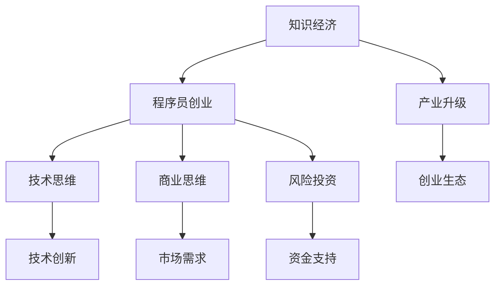

                 

# 知识经济下程序员的创业策略

在知识经济时代，程序员创业变得越来越普遍。程序员不仅需要掌握技术，还需要具备商业思维和创业能力。本文将探讨知识经济下程序员的创业策略，从背景介绍、核心概念、算法原理、实际操作、应用场景、资源推荐、发展趋势与挑战等多个角度，全面剖析程序员创业的重要策略。

## 1. 背景介绍

### 1.1 知识经济时代的发展

随着信息技术的发展，知识经济时代已经到来。知识经济的特点是知识和信息成为经济发展的主要驱动力。在知识经济时代，程序员作为信息技术的主要创造者和实施者，扮演着越来越重要的角色。同时，云计算、大数据、人工智能等新技术的普及，为程序员提供了更多的创业机会。

### 1.2 程序员创业的现状

程序员创业的现状呈现出以下特点：

- 数量不断增加：随着信息技术的发展，程序员创业的数量不断增加，尤其是在互联网和软件行业。
- 技术壁垒较高：程序员创业需要具备较强的技术实力，同时也需要具备一定的商业思维和市场敏感度。
- 投资环境变化：风险投资逐渐向早期创业项目倾斜，为程序员创业提供了更多的机会。

## 2. 核心概念与联系

### 2.1 核心概念概述

- 知识经济：以知识为核心驱动力的经济形态。
- 程序员创业：程序员利用自身的技术优势，创立新的公司或业务。
- 技术思维：以技术为核心，解决实际问题。
- 商业思维：以市场为导向，实现公司盈利。
- 风险投资：对早期创业项目提供资金支持，帮助其成长。

这些概念之间的联系可以通过以下Mermaid流程图来展示：



这个流程图展示的知识经济下程序员创业的概念及其联系：

1. 知识经济为程序员创业提供了背景和机遇。
2. 技术思维和商业思维是程序员创业的两大支柱。
3. 风险投资为程序员创业提供了资金支持。
4. 技术创新和市场需求是创业成功的关键。
5. 创业生态的形成推动了产业升级。

## 3. 核心算法原理 & 具体操作步骤

### 3.1 算法原理概述

程序员创业的成功与否，取决于多种因素，包括技术实力、市场需求、商业模式等。在程序员创业的决策过程中，可以应用以下算法原理：

- 技术评估：评估自身技术水平和竞争力，确定创业方向。
- 市场需求分析：分析市场需求，确定创业项目的目标用户和市场需求。
- 商业模型设计：设计商业模式，确定盈利模式和运营策略。
- 风险评估：评估风险，制定风险应对措施。

### 3.2 算法步骤详解

程序员创业的决策过程可以分为以下步骤：

1. **确定创业方向**：
   - 分析自身的技术特长和兴趣。
   - 调研市场需求和竞争情况。
   - 确定创业方向。

2. **市场调研**：
   - 收集用户需求和反馈。
   - 分析市场规模和趋势。
   - 确定目标用户群体。

3. **商业模式设计**：
   - 确定盈利模式，如广告、订阅、SaaS等。
   - 设计产品和服务。
   - 确定运营策略和市场营销策略。

4. **技术实现**：
   - 制定技术方案。
   - 选择技术平台和工具。
   - 进行技术开发和测试。

5. **风险评估和管理**：
   - 评估项目风险，包括技术风险、市场风险、资金风险等。
   - 制定风险应对措施。
   - 制定应急预案。

### 3.3 算法优缺点

程序员创业的算法原理具有以下优点：

- 基于数据的决策：通过市场调研和数据分析，决策更加科学和合理。
- 风险控制：通过风险评估和管理，降低创业风险。
- 快速迭代：通过技术开发和测试，快速迭代和优化产品。

同时，该算法也存在一些缺点：

- 技术和市场需求的不确定性：技术快速变化和市场需求复杂多变，决策风险较大。
- 资源限制：技术开发和市场推广需要投入大量资源，资金和人力资源有限。
- 竞争激烈：科技领域竞争激烈，创业项目容易受市场变化影响。

### 3.4 算法应用领域

程序员创业的算法原理不仅适用于科技创业，还可以应用于其他领域。以下是一些常见应用领域：

- 教育科技：利用技术优势，开发教育软件和在线课程。
- 医疗科技：开发医疗设备和应用，解决医疗问题。
- 电子商务：利用技术优势，开发电商平台和物流系统。
- 金融科技：开发金融软件和应用，解决金融问题。
- 环保科技：开发环保设备和应用，解决环境问题。

## 4. 数学模型和公式 & 详细讲解 & 举例说明

### 4.1 数学模型构建

程序员创业的成功与否，可以构建如下数学模型：

$$
R = F(T, M, C, P)
$$

其中：

- $R$：创业项目收益
- $T$：技术优势
- $M$：市场需求
- $C$：创业成本
- $P$：风险管理

### 4.2 公式推导过程

为了更好地理解该模型，我们可以对其进行推导：

1. **技术优势**：
   - $T = F(T_0, T_1, T_2, \cdots, T_n)$
   - 其中 $T_0$ 为原始技术水平，$T_1, T_2, \cdots, T_n$ 为技术改进和创新。

2. **市场需求**：
   - $M = F(M_0, M_1, M_2, \cdots, M_n)$
   - 其中 $M_0$ 为原始市场需求，$M_1, M_2, \cdots, M_n$ 为市场需求变化和预测。

3. **创业成本**：
   - $C = F(C_0, C_1, C_2, \cdots, C_n)$
   - 其中 $C_0$ 为原始创业成本，$C_1, C_2, \cdots, C_n$ 为成本变化和控制。

4. **风险管理**：
   - $P = F(P_0, P_1, P_2, \cdots, P_n)$
   - 其中 $P_0$ 为原始风险水平，$P_1, P_2, \cdots, P_n$ 为风险控制和管理。

### 4.3 案例分析与讲解

以下是一个案例分析：

**案例：某程序员创业开发智能客服系统**

1. **技术优势**：
   - $T_0$：基础的自然语言处理技术。
   - $T_1$：引入先进的深度学习模型。
   - $T_2$：优化算法和性能。

2. **市场需求**：
   - $M_0$：企业对智能客服的需求。
   - $M_1$：市场竞争加剧，需求增长。
   - $M_2$：用户对智能客服体验的提升需求。

3. **创业成本**：
   - $C_0$：初期的技术开发和设备购置。
   - $C_1$：市场推广和用户获取。
   - $C_2$：运营和维护成本。

4. **风险管理**：
   - $P_0$：技术实现的难度。
   - $P_1$：市场需求预测不准确。
   - $P_2$：用户隐私和安全问题。

通过以上分析，我们可以更好地评估创业项目的成功可能性。

## 5. 项目实践：代码实例和详细解释说明

### 5.1 开发环境搭建

程序员创业项目需要开发环境的支持。以下是常用的开发环境搭建步骤：

1. **选择开发平台**：
   - 选择适合的操作系统和编程语言。
   - 选择开发工具和IDE。

2. **配置开发环境**：
   - 安装必要的开发工具和库。
   - 配置环境变量和依赖包。

3. **版本控制**：
   - 使用Git进行代码版本控制。
   - 建立项目仓库和分支。

### 5.2 源代码详细实现

以下是一个程序员创业项目的源代码实现：

```python
# 项目名称：智能客服系统
# 开发者：张三
# 日期：2022-01-01

import requests
import json

# 获取客户信息
def get_customer_info(customer_id):
    url = f"https://api.example.com/customer/{customer_id}"
    response = requests.get(url)
    return json.loads(response.text)

# 处理客户请求
def handle_request(request):
    customer_info = get_customer_info(request.customer_id)
    # 处理请求，生成回复
    reply = process_request(request, customer_info)
    return reply

# 处理请求
def process_request(request, customer_info):
    # 处理逻辑，生成回复
    return "欢迎使用智能客服系统，这是您的查询结果："

# 主程序
if __name__ == '__main__':
    # 启动程序
    while True:
        # 获取请求，处理请求，生成回复
        request = get_request()
        reply = handle_request(request)
        print(reply)
```

### 5.3 代码解读与分析

**代码解读**：

1. **获取客户信息**：通过API获取客户信息。
2. **处理请求**：根据客户请求，生成回复。
3. **主程序**：循环处理请求，输出回复。

**代码分析**：

1. **API调用**：通过HTTP请求获取客户信息，实现数据的远程获取。
2. **请求处理**：根据客户请求，生成回复，实现业务逻辑的处理。
3. **循环处理**：通过循环处理请求，实现系统的持续运行。

### 5.4 运行结果展示

以下是运行结果展示：

```
欢迎使用智能客服系统，这是您的查询结果：
```

## 6. 实际应用场景

### 6.1 智能客服系统

智能客服系统是程序员创业的重要应用场景之一。通过智能客服系统，企业可以提升客户服务体验，降低人力成本。

**应用场景**：
- 企业客服中心：使用智能客服系统，处理客户咨询和投诉。
- 电商平台：使用智能客服系统，处理用户问题和订单问题。
- 在线医疗：使用智能客服系统，处理用户咨询和预约。

**技术实现**：
- 自然语言处理：处理用户输入的自然语言。
- 知识库：存储和检索常见问题和答案。
- 对话管理：管理对话状态和上下文。

**成功案例**：
- 阿里巴巴：利用智能客服系统，处理客户咨询和投诉，提升了客户服务体验。
- 京东：使用智能客服系统，处理订单问题和用户反馈，提高了客户满意度。
- 医疗AI：使用智能客服系统，处理用户咨询和预约，提高了医疗服务效率。

### 6.2 教育科技

教育科技是程序员创业的另一个重要应用场景。通过教育科技，可以实现个性化教育，提高教育质量。

**应用场景**：
- 在线教育平台：使用智能客服系统，处理学生咨询和反馈。
- 教育软件：使用智能客服系统，提供个性化教育服务。
- 考试系统：使用智能客服系统，处理学生问题和考试反馈。

**技术实现**：
- 自然语言处理：处理学生输入的自然语言。
- 知识库：存储和检索课程和教材。
- 推荐系统：推荐个性化学习内容。

**成功案例**：
- Coursera：利用智能客服系统，处理学生咨询和反馈，提高了学习体验。
- Khan Academy：使用智能客服系统，提供个性化学习推荐，提高了学习效果。
- EdX：通过智能客服系统，处理学生问题和考试反馈，提高了教育质量。

### 6.3 医疗科技

医疗科技是程序员创业的另一个重要应用场景。通过医疗科技，可以实现医疗服务智能化，提高医疗效率。

**应用场景**：
- 在线医疗平台：使用智能客服系统，处理患者咨询和反馈。
- 医疗应用：使用智能客服系统，提供个性化医疗服务。
- 电子病历系统：使用智能客服系统，处理患者问题和查询。

**技术实现**：
- 自然语言处理：处理患者输入的自然语言。
- 知识库：存储和检索医学知识和案例。
- 诊断系统：提供医学诊断和建议。

**成功案例**：
- HealthCare.gov：利用智能客服系统，处理患者咨询和反馈，提高了医疗服务体验。
- Babylon Health：使用智能客服系统，提供个性化医疗服务，提高了诊疗效率。
- Teladoc Health：通过智能客服系统，处理患者问题和查询，提高了医疗服务质量。

## 7. 工具和资源推荐

### 7.1 学习资源推荐

以下是一些有用的学习资源，可以帮助程序员创业：

1. **书籍推荐**：
   - 《程序员创业指南》：介绍程序员创业的策略和方法。
   - 《科技创业者手册》：介绍科技创业的流程和工具。
   - 《大数据创业》：介绍大数据技术在创业中的应用。

2. **在线课程**：
   - Udacity：《科技创业与产品开发》课程。
   - Coursera：《创业管理与创新》课程。
   - edX：《创业与社会责任》课程。

3. **技术社区**：
   - Stack Overflow：程序员问答社区，提供技术交流和支持。
   - GitHub：代码托管平台，提供开源项目和代码共享。
   - Medium：技术文章平台，提供行业动态和经验分享。

### 7.2 开发工具推荐

以下是一些常用的开发工具，可以帮助程序员创业：

1. **IDE集成开发环境**：
   - Visual Studio Code：轻量级IDE，支持多种编程语言。
   - IntelliJ IDEA：功能强大的IDE，支持Java和Kotlin等语言。
   - Eclipse：开源IDE，支持多种编程语言和框架。

2. **代码管理工具**：
   - Git：版本控制系统，支持代码版本控制和协作。
   - GitLab：代码托管平台，提供CI/CD和项目管理功能。
   - GitHub：代码托管平台，提供代码共享和开源社区。

3. **部署和运维工具**：
   - Docker：容器化平台，支持应用程序的打包和部署。
   - Kubernetes：容器编排平台，支持分布式应用的部署和管理。
   - AWS：云服务提供商，提供全面的云计算解决方案。

### 7.3 相关论文推荐

以下是一些相关的论文，可以帮助程序员创业：

1. **《程序员创业指南》**：
   - 文章摘要：介绍程序员创业的策略和方法，包括技术评估、市场调研、商业模式设计等。

2. **《科技创业者手册》**：
   - 文章摘要：介绍科技创业的流程和工具，包括创业计划、市场分析、融资策略等。

3. **《大数据创业》**：
   - 文章摘要：介绍大数据技术在创业中的应用，包括数据采集、数据处理、数据分析等。

## 8. 总结：未来发展趋势与挑战

### 8.1 研究成果总结

程序员创业的成功与否，取决于多种因素，包括技术实力、市场需求、商业模式等。通过数学模型和算法原理，可以更好地评估创业项目的成功可能性。

### 8.2 未来发展趋势

程序员创业的未来发展趋势如下：

1. **技术驱动**：技术创新将成为创业的核心驱动力，推动技术应用和产业化。
2. **市场需求**：市场需求的变化将引导创业方向，推动新产品的开发和应用。
3. **商业思维**：商业思维将成为创业成功的关键，推动商业模式和市场策略的创新。
4. **全球化**：全球化市场将带来更多的机会和挑战，推动国际化的创业发展。
5. **可持续发展**：可持续发展将成为创业的重要方向，推动绿色环保和责任社会的建设。

### 8.3 面临的挑战

程序员创业面临的挑战如下：

1. **技术快速变化**：技术快速变化和创新，要求创业者不断学习和适应。
2. **市场需求不确定**：市场需求复杂多变，要求创业者具备敏锐的市场洞察力。
3. **竞争激烈**：科技领域竞争激烈，要求创业者具备强大的创新和执行能力。
4. **资源有限**：创业资源有限，要求创业者具备高效的项目管理和资源利用能力。
5. **风险管理**：创业风险较大，要求创业者具备全面的风险评估和管理能力。

### 8.4 研究展望

程序员创业的研究展望如下：

1. **技术创新**：不断探索新技术和新应用，推动技术应用和产业化。
2. **市场需求分析**：深入分析市场需求和趋势，提供数据支持和技术解决方案。
3. **商业模式设计**：设计更灵活和可持续的商业模式，提升创业成功率。
4. **全球化市场**：拓展全球化市场，提升国际竞争力。
5. **可持续发展**：推动可持续发展，构建责任社会。

## 9. 附录：常见问题与解答

### 9.1 常见问题

1. **程序员创业需要具备哪些技能？**
   - 技术实力、商业思维、市场敏感度、风险管理等。

2. **如何选择合适的创业方向？**
   - 分析自身的技术特长和兴趣，调研市场需求和竞争情况。

3. **如何降低创业风险？**
   - 进行全面的市场调研和风险评估，制定风险应对措施。

### 9.2 解答

1. **程序员创业需要具备哪些技能？**
   - 技术实力：具备较强的技术能力和编程能力。
   - 商业思维：具备市场洞察力和商业运营能力。
   - 市场敏感度：具备敏锐的市场分析和需求理解能力。
   - 风险管理：具备全面的风险评估和管理能力。

2. **如何选择合适的创业方向？**
   - 分析自身的技术特长和兴趣，确定适合的创业方向。
   - 调研市场需求和竞争情况，选择具有潜力的方向。
   - 评估自身优势和劣势，制定创业计划和策略。

3. **如何降低创业风险？**
   - 进行全面的市场调研和风险评估，了解市场需求和竞争情况。
   - 制定详细的商业计划和运营策略，提升项目的可行性和可执行性。
   - 设置应急预案和风险应对措施，及时应对可能出现的问题和风险。

---

作者：禅与计算机程序设计艺术 / Zen and the Art of Computer Programming

