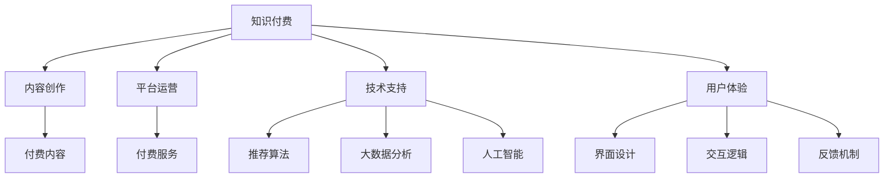

                 

# 知识经济时代下的知识付费创新商业模式运营

> 关键词：知识付费, 知识经济, 商业模式, 技术驱动, 用户需求, 平台经济

## 1. 背景介绍

### 1.1 问题由来
随着知识经济时代的到来，全球进入了一个全新的发展阶段。以知识和信息为核心的生产要素，开始占据主导地位。人们在获取信息、学习新知、提升能力等方面的需求日益增长，知识付费模式应运而生，并逐渐成为互联网经济的重要组成部分。

知识付费是一种基于用户对知识和信息的需求，通过付费方式获取专属内容和服务的新型商业模式。这一模式通过付费机制，激发内容生产者的积极性，形成良性循环，推动高质量内容的生产与传播，满足用户多样化、个性化的知识需求。

### 1.2 问题核心关键点
知识付费模式的核心在于如何构建有效的商业模式，最大化发挥知识经济的价值。这一过程涉及到内容创作、平台运营、用户体验、技术支持等多个环节，需要通过技术手段不断优化和创新。

本文将从核心概念、算法原理、具体步骤、数学模型、实践案例、实际应用和未来展望等多个角度，深入分析知识付费的创新商业模式运营，为行业内的从业者提供全面的指导和参考。

## 2. 核心概念与联系

### 2.1 核心概念概述

为更好地理解知识付费的创新商业模式运营，本节将介绍几个关键概念及其相互关系：

- **知识付费**：基于知识经济，通过付费获取知识和信息的模式。它不仅包含付费内容，还包括付费服务，如一对一辅导、专业咨询等。
- **内容创作**：知识付费的核心在于高质量内容的生产。内容创作者需要具备深度知识储备和专业技能，以产出有价值的内容。
- **平台运营**：知识付费的实现需要依赖在线平台，平台提供便捷的支付、推荐、用户交互等功能，保障知识服务的顺畅流通。
- **技术支持**：技术是知识付费模式得以高效运行的基础，涉及内容推荐算法、大数据分析、人工智能等技术。
- **用户体验**：良好的用户体验能够提升用户满意度，促进内容付费。用户界面、交互逻辑、反馈机制等都是影响用户体验的关键因素。

这些概念之间的逻辑关系可以通过以下Mermaid流程图来展示：



这个流程图展示了知识付费模式的关键环节及其相互关系：

1. 知识付费的基础是内容创作。
2. 平台运营保障内容的高效流通。
3. 技术支持为平台和内容创作提供技术保障。
4. 用户体验影响用户满意度和留存率。
5. 付费内容和服务是用户支付的直接对象。

## 3. 核心算法原理 & 具体操作步骤
### 3.1 算法原理概述

知识付费模式涉及多个算法和技术的综合应用。核心算法包括推荐系统、搜索排序、个性化定价等，这些算法构成了知识付费商业模式的基础。

以推荐系统为例，其目标是根据用户的历史行为和兴趣，推荐符合其需求的高质量内容。推荐系统通常基于协同过滤、基于内容的推荐、混合推荐等算法，通过数据分析和机器学习技术，不断优化推荐效果。

推荐系统的工作原理可简述为：
1. 数据收集：收集用户的行为数据，如浏览、点赞、收藏、评论等。
2. 特征提取：提取用户和内容的特征，如用户偏好、内容质量、热门程度等。
3. 模型训练：使用协同过滤、基于内容的推荐等算法，训练推荐模型。
4. 推荐输出：根据模型预测用户可能感兴趣的潜在内容，进行推荐。

### 3.2 算法步骤详解

知识付费平台的核心算法步骤包括数据收集、特征提取、模型训练和推荐输出。

1. **数据收集**：
    - 用户行为数据：通过用户注册、浏览、购买等行为收集用户信息。
    - 内容数据：从专业机构、作者、网站等处获取内容数据，并进行清洗和标注。

2. **特征提取**：
    - 用户特征：用户基本信息、历史行为、浏览偏好等。
    - 内容特征：标题、摘要、标签、作者等。

3. **模型训练**：
    - 协同过滤：基于用户之间的相似性，推荐其他用户喜欢的内容。
    - 基于内容的推荐：通过内容特征预测用户兴趣。
    - 混合推荐：综合使用多种算法，提高推荐效果。

4. **推荐输出**：
    - 实时推荐：根据用户实时行为，动态调整推荐内容。
    - 个性化定价：根据内容价值和使用频率，动态调整价格。

### 3.3 算法优缺点

知识付费模式的推荐系统具有以下优点：
1. 个性化强：能够根据用户兴趣和行为，提供个性化推荐，提升用户满意度。
2. 覆盖广：通过数据驱动，可以覆盖更多内容和服务。
3. 高效运营：自动化推荐算法，减少人工干预，提升运营效率。

同时，该系统也存在以下局限性：
1. 数据依赖性强：推荐系统依赖于大量用户行为数据，数据质量直接影响推荐效果。
2. 冷启动问题：新用户或新内容没有足够的数据，推荐效果不佳。
3. 算法复杂度高：推荐系统算法复杂，模型训练和维护成本高。

### 3.4 算法应用领域

推荐系统不仅应用于知识付费平台，还广泛应用于电商、社交媒体、新闻推荐等领域。以下列举几个典型应用场景：

- **电商推荐**：电商平台通过推荐系统，向用户推荐可能感兴趣的商品，提高转化率。
- **社交媒体**：社交平台通过推荐系统，向用户推荐朋友动态、兴趣内容，提升用户粘性。
- **新闻推荐**：新闻平台通过推荐系统，向用户推荐相关新闻和文章，提高阅读量。

## 4. 数学模型和公式 & 详细讲解 & 举例说明

### 4.1 数学模型构建

知识付费推荐系统的数学模型主要包括协同过滤模型和基于内容的推荐模型。

以协同过滤模型为例，假设用户集合为 $U=\{u_1,u_2,...,u_m\}$，物品集合为 $V=\{v_1,v_2,...,v_n\}$。用户 $u_i$ 对物品 $v_j$ 的评分记为 $r_{i,j}$，矩阵 $R$ 表示用户-物品评分矩阵，其中 $R_{i,j}=r_{i,j}$。

协同过滤模型的目标是通过用户-物品评分矩阵 $R$，预测用户对物品的评分，从而推荐物品。

### 4.2 公式推导过程

协同过滤模型可以使用矩阵分解的方法进行推导。假设 $R$ 可以分解为两个矩阵的乘积，即 $R=\hat{P}\hat{Q}$。其中 $\hat{P}$ 为用户隐向量矩阵，$\hat{Q}$ 为物品隐向量矩阵。通过最小化损失函数 $\mathcal{L}$，可以求解 $\hat{P}$ 和 $\hat{Q}$。

$$
\mathcal{L}(\hat{P},\hat{Q}) = \frac{1}{2}\sum_{i,j}(R_{i,j}-\hat{P}_i^T\hat{Q}_j)^2
$$

其中 $\hat{P}_i$ 和 $\hat{Q}_j$ 分别表示用户 $i$ 和物品 $j$ 的隐向量。

### 4.3 案例分析与讲解

以Netflix推荐系统为例，Netflix使用基于矩阵分解的协同过滤模型进行推荐。其基本流程如下：

1. 收集用户行为数据：用户对电影的评分。
2. 分解评分矩阵：使用奇异值分解(SVD)，将评分矩阵分解为 $\hat{P}\hat{Q}$。
3. 预测评分：根据用户隐向量 $\hat{P}_i$ 和物品隐向量 $\hat{Q}_j$，预测用户对物品的评分。
4. 推荐物品：将评分高于阈值 $t$ 的物品推荐给用户。

Netflix通过不断优化模型和算法，实现了高精度的个性化推荐，极大地提升了用户满意度。

## 5. 项目实践：代码实例和详细解释说明
### 5.1 开发环境搭建

在进行知识付费推荐系统的开发前，需要准备好开发环境。以下是使用Python进行PyTorch开发的环境配置流程：

1. 安装Anaconda：从官网下载并安装Anaconda，用于创建独立的Python环境。

2. 创建并激活虚拟环境：
```bash
conda create -n pytorch-env python=3.8 
conda activate pytorch-env
```

3. 安装PyTorch：根据CUDA版本，从官网获取对应的安装命令。例如：
```bash
conda install pytorch torchvision torchaudio cudatoolkit=11.1 -c pytorch -c conda-forge
```

4. 安装Transformers库：
```bash
pip install transformers
```

5. 安装各类工具包：
```bash
pip install numpy pandas scikit-learn matplotlib tqdm jupyter notebook ipython
```

完成上述步骤后，即可在`pytorch-env`环境中开始开发实践。

### 5.2 源代码详细实现

下面我们以知识付费平台推荐系统为例，给出使用Transformers库进行协同过滤推荐系统的PyTorch代码实现。

首先，定义推荐系统数据处理函数：

```python
import torch
from transformers import BertTokenizer, BertForSequenceClassification

class RecommendationDataset(torch.utils.data.Dataset):
    def __init__(self, data, tokenizer):
        self.data = data
        self.tokenizer = tokenizer
    
    def __len__(self):
        return len(self.data)
    
    def __getitem__(self, item):
        movie_title = self.data[item]['title']
        genre = self.data[item]['genre']
        rating = self.data[item]['rating']
        user_id = self.data[item]['user_id']
        
        movie_tokens = self.tokenizer.tokenize(movie_title)
        genre_tokens = self.tokenizer.tokenize(genre)
        rating_tokens = self.tokenizer.tokenize(str(rating))
        
        user_tokens = self.tokenizer.tokenize(str(user_id))
        tokens = [user_tokens, movie_tokens, genre_tokens, rating_tokens]
        segment_ids = [1] * len(tokens)
        attention_mask = [1] * len(tokens)
        return {'input_ids': torch.tensor(tokens), 
                'attention_mask': torch.tensor(attention_mask), 
                'segment_ids': torch.tensor(segment_ids)}
```

然后，定义推荐模型和优化器：

```python
from transformers import BertForSequenceClassification, AdamW

model = BertForSequenceClassification.from_pretrained('bert-base-uncased', num_labels=2)
optimizer = AdamW(model.parameters(), lr=2e-5)
```

接着，定义训练和评估函数：

```python
def train_epoch(model, data_loader, optimizer):
    model.train()
    total_loss = 0
    for batch in data_loader:
        input_ids = batch['input_ids'].to(device)
        attention_mask = batch['attention_mask'].to(device)
        labels = batch['labels'].to(device)
        
        optimizer.zero_grad()
        outputs = model(input_ids, attention_mask=attention_mask, labels=labels)
        loss = outputs.loss
        total_loss += loss.item()
        loss.backward()
        optimizer.step()
    return total_loss / len(data_loader)
    
def evaluate(model, data_loader):
    model.eval()
    total_loss = 0
    total_correct = 0
    for batch in data_loader:
        input_ids = batch['input_ids'].to(device)
        attention_mask = batch['attention_mask'].to(device)
        labels = batch['labels'].to(device)
        
        with torch.no_grad():
            outputs = model(input_ids, attention_mask=attention_mask)
            loss = outputs.loss
            total_loss += loss.item()
            logits = outputs.logits.argmax(dim=1)
            total_correct += (logits == labels).sum().item()
    return total_loss / len(data_loader), total_correct / len(data_loader)
```

最后，启动训练流程并在测试集上评估：

```python
epochs = 5
batch_size = 16

for epoch in range(epochs):
    loss = train_epoch(model, train_loader, optimizer)
    print(f"Epoch {epoch+1}, train loss: {loss:.3f}")
    
    test_loss, test_correct = evaluate(model, test_loader)
    print(f"Epoch {epoch+1}, test loss: {test_loss:.3f}, test accuracy: {test_correct:.3f}")
```

以上就是使用PyTorch对协同过滤推荐系统进行知识付费平台开发的完整代码实现。可以看到，通过结合Bert模型和Transformers库，我们可以很方便地实现协同过滤推荐算法。

### 5.3 代码解读与分析

让我们再详细解读一下关键代码的实现细节：

**RecommendationDataset类**：
- `__init__`方法：初始化数据和分词器等关键组件。
- `__len__`方法：返回数据集的样本数量。
- `__getitem__`方法：对单个样本进行处理，将电影标题、类型、评分等文本信息转换为分词器接受的格式，并计算注意力权重。

**模型定义**：
- 使用BertForSequenceClassification模型，设定分类数为2，对应电影评分的高低。

**训练和评估函数**：
- 使用PyTorch的DataLoader对数据集进行批次化加载，供模型训练和推理使用。
- 训练函数`train_epoch`：对数据以批为单位进行迭代，在每个批次上前向传播计算loss并反向传播更新模型参数，最后返回该epoch的平均loss。
- 评估函数`evaluate`：与训练类似，不同点在于不更新模型参数，并在每个batch结束后将预测和标签结果存储下来，最后使用准确率指标输出。

**训练流程**：
- 定义总的epoch数和batch size，开始循环迭代
- 每个epoch内，先在训练集上训练，输出平均loss
- 在测试集上评估，输出准确率
- 所有epoch结束后，输出训练和测试结果

可以看到，通过PyTorch配合Transformers库，我们可以迅速实现一个简单的协同过滤推荐系统。这体现了深度学习技术在知识付费推荐系统开发中的强大潜力。

当然，工业级的系统实现还需考虑更多因素，如模型的保存和部署、超参数的自动搜索、更灵活的任务适配层等。但核心的推荐范式基本与此类似。

## 6. 实际应用场景

### 6.1 智能学习平台

智能学习平台通过推荐系统，为用户推荐个性化的学习内容和学习路径。系统根据用户的学习行为和兴趣，动态调整推荐内容，提升学习效果。

在技术实现上，可以收集用户的学习历史、浏览记录、评价反馈等数据，训练推荐模型，使用户能够快速找到适合自己的学习材料，提高学习效率。智能学习平台可以帮助用户系统化地掌握知识，提升学习成果。

### 6.2 健康管理平台

健康管理平台通过推荐系统，为用户推荐个性化的健康建议和方案。系统根据用户的健康数据、生活习惯等，动态调整推荐内容，提供科学的健康指导。

在技术实现上，可以收集用户的健康数据、饮食记录、运动数据等，训练推荐模型，使用户能够获得个性化的健康方案。健康管理平台可以帮助用户养成良好生活习惯，提升健康水平。

### 6.3 企业培训平台

企业培训平台通过推荐系统，为用户推荐个性化的培训课程和培训路径。系统根据员工的工作岗位、技能水平、学习习惯等，动态调整推荐内容，提升员工的技能水平和职业发展。

在技术实现上，可以收集员工的学习历史、培训记录、绩效数据等，训练推荐模型，使用户能够快速找到适合自己的培训课程。企业培训平台可以帮助员工提升技能，增强竞争力。

### 6.4 未来应用展望

随着推荐系统的不断发展，基于知识付费的商业模式将在更多领域得到应用，为社会带来变革性影响。

在智慧医疗领域，基于推荐系统的个性化健康建议系统，可以提升医疗服务的智能化水平，辅助医生诊疗，提升医疗质量。

在智能教育领域，推荐系统可以应用于在线教育平台，提供个性化的学习内容和课程推荐，促进教育公平，提高教学质量。

在企业培训领域，推荐系统可以应用于企业内部培训平台，提供个性化的培训课程和路径，提升员工技能，增强企业竞争力。

此外，在电商、新闻、娱乐等领域，基于推荐系统的知识付费模式也将不断涌现，为经济社会发展注入新的动力。相信随着技术的日益成熟，推荐系统必将在更广阔的应用领域大放异彩。

## 7. 工具和资源推荐
### 7.1 学习资源推荐

为了帮助开发者系统掌握推荐系统的理论基础和实践技巧，这里推荐一些优质的学习资源：

1. 《推荐系统实战》书籍：介绍推荐系统的工作原理、算法实现和应用案例，适合初学者和进阶者。

2. 《深度学习推荐系统》课程：斯坦福大学开设的推荐系统课程，涵盖推荐算法、评价指标、系统实现等内容，是推荐系统的入门必选。

3. KDD论文库：收集了大量推荐系统的最新研究成果和论文，是学习和研究推荐系统的宝贵资源。

4. RecSys conference：推荐系统的顶级会议，汇集了最新的研究方向和应用案例，值得持续关注。

5. Kaggle推荐系统竞赛：通过参加竞赛，积累实践经验，了解推荐系统在实际应用中的挑战和解决方案。

通过对这些资源的学习实践，相信你一定能够快速掌握推荐系统的精髓，并用于解决实际的推荐问题。

### 7.2 开发工具推荐

高效的开发离不开优秀的工具支持。以下是几款用于推荐系统开发的常用工具：

1. PyTorch：基于Python的开源深度学习框架，灵活动态的计算图，适合快速迭代研究。

2. TensorFlow：由Google主导开发的开源深度学习框架，生产部署方便，适合大规模工程应用。

3. Scikit-learn：基于Python的机器学习库，提供丰富的模型和工具，适合推荐系统中的特征工程和评估。

4. Hadoop：大数据处理平台，支持分布式计算和存储，适合处理大规模数据。

5. Elasticsearch：搜索引擎，支持高效的数据检索和推荐。

6. Apache Spark：大数据处理引擎，支持分布式计算和机器学习。

合理利用这些工具，可以显著提升推荐系统的开发效率，加快创新迭代的步伐。

### 7.3 相关论文推荐

推荐系统的不断发展离不开学界的持续研究。以下是几篇奠基性的相关论文，推荐阅读：

1. Matrix Factorization Techniques for Recommender Systems（矩阵分解算法）：介绍基于矩阵分解的协同过滤算法，是推荐系统的经典方法。

2. Deep Collaborative Filtering（深度协同过滤）：使用深度神经网络进行推荐，提升推荐精度和效果。

3. Factorization Machines（因子分解机）：结合矩阵分解和神经网络，提升推荐系统的泛化能力。

4. Attention-based Recommender Systems（基于注意的推荐系统）：引入注意力机制，提高推荐系统的多样性和个性化。

5. Multi-Task Learning for Recommender Systems（多任务学习）：通过多任务学习，提升推荐系统的效果和鲁棒性。

这些论文代表了大规模推荐系统的最新研究进展，值得深入学习和参考。

## 8. 总结：未来发展趋势与挑战

### 8.1 总结

本文对基于知识付费的推荐系统进行了全面系统的介绍。首先阐述了推荐系统的核心概念和工作原理，明确了其在知识经济中的重要地位。其次，从算法原理、具体操作步骤、数学模型、实践案例等方面，详细讲解了推荐系统的实现方法。同时，本文还探讨了推荐系统在多个领域的应用前景，展示了其巨大的商业价值。

通过本文的系统梳理，可以看到，基于知识付费的推荐系统正在成为知识经济中的重要工具，极大地提升了内容推荐的效果和用户满意度。未来，伴随推荐算法的不断优化和创新，知识付费模式必将迎来更大的发展机遇，为人类社会带来更深远的影响。

### 8.2 未来发展趋势

展望未来，推荐系统的不断演进将引领知识付费模式的进一步发展，推动知识经济的繁荣：

1. 个性化推荐：随着用户行为数据的不断积累，推荐系统将更加个性化，提供更精准的推荐服务。

2. 实时推荐：推荐系统将具备实时推荐能力，根据用户实时行为，动态调整推荐内容。

3. 跨领域推荐：推荐系统将跨领域融合，实现不同领域内容的推荐。

4. 多模态推荐：推荐系统将融合视觉、语音等多模态数据，提升推荐效果。

5. 协同学习：推荐系统将利用协同学习思想，提升推荐模型的泛化能力和鲁棒性。

6. 元学习：推荐系统将通过元学习，动态优化推荐模型，提高推荐效率。

以上趋势凸显了推荐系统的发展前景，其不断进步将为知识付费模式的创新提供更多可能。

### 8.3 面临的挑战

尽管推荐系统已经取得了瞩目成就，但在迈向更加智能化、普适化应用的过程中，仍面临诸多挑战：

1. 数据隐私和安全：推荐系统需要处理大量的用户数据，如何在保护用户隐私的同时，利用数据提升推荐效果，是亟待解决的问题。

2. 推荐系统的公平性：推荐系统存在冷启动和偏见问题，如何设计公平的推荐算法，避免对某些用户的歧视，是未来的研究方向。

3. 推荐系统的透明度：推荐系统的决策过程往往是"黑盒"，如何提高推荐系统的透明度，提供可解释的推荐依据，是提高用户信任的关键。

4. 推荐系统的鲁棒性：推荐系统在面对恶意攻击和异常数据时，如何保持稳定性和鲁棒性，是推荐系统可靠性的重要保障。

5. 推荐系统的实时性：推荐系统需要处理实时数据，如何在保证推荐精度的同时，提升系统实时性，是推荐系统技术优化的一个重要方向。

6. 推荐系统的可持续性：推荐系统需要持续学习，如何在保证推荐质量的同时，避免过度拟合和灾难性遗忘，是推荐系统长期稳定运行的关键。

以上挑战展示了推荐系统在发展过程中需要不断克服的技术难题，未来的研究需要在这些方面持续努力，才能实现推荐系统的可持续发展。

### 8.4 研究展望

面对推荐系统面临的挑战，未来的研究需要在以下几个方面寻求新的突破：

1. 数据隐私保护技术：开发更加安全、高效的数据隐私保护技术，确保推荐系统在保护用户隐私的同时，能够充分利用数据进行推荐。

2. 推荐系统的公平性算法：设计公平、透明的推荐算法，避免对某些用户或群体的歧视，提升推荐系统的社会效益。

3. 推荐系统的可解释性：引入可解释性技术，提供推荐结果的透明化依据，提升用户对推荐系统的信任度。

4. 推荐系统的鲁棒性优化：研究鲁棒性优化算法，提升推荐系统对异常数据和恶意攻击的抵御能力。

5. 实时推荐系统的优化：改进实时推荐算法，提升推荐系统的实时性和效率。

6. 推荐系统的可持续学习：开发可持续学习算法，避免推荐模型在长期运行中的过拟合和遗忘问题。

这些研究方向的探索，必将引领推荐系统向更高的台阶迈进，为知识付费模式带来更多的创新突破。面向未来，推荐系统将在构建人机协同的智能系统方面发挥越来越重要的作用。只有勇于创新、敢于突破，才能不断拓展推荐系统的边界，让知识付费模式更好地服务于人类社会。

## 9. 附录：常见问题与解答

**Q1：推荐系统是否适用于所有领域？**

A: 推荐系统可以应用于各种领域，如电商、新闻、娱乐、教育等。但具体应用需要根据领域特点进行调整。例如，电商推荐系统需要关注用户购买行为，新闻推荐系统需要关注用户阅读偏好，教育推荐系统需要关注用户学习历史等。

**Q2：如何提高推荐系统的推荐效果？**

A: 提高推荐系统的推荐效果需要从多个方面入手：
1. 数据质量：保证数据准确性、完整性、一致性，避免数据噪声对推荐效果的影响。
2. 算法优化：选择适合推荐场景的算法，不断优化算法模型。
3. 特征工程：提取有意义的特征，提升模型预测能力。
4. 模型更新：使用实时数据进行模型更新，避免过时数据对推荐效果的影响。

**Q3：推荐系统存在哪些潜在风险？**

A: 推荐系统存在以下潜在风险：
1. 数据隐私风险：推荐系统需要处理大量用户数据，存在隐私泄露风险。
2. 信息泡沫风险：推荐系统可能加剧用户的信息泡沫效应，造成信息茧房。
3. 偏见和歧视风险：推荐算法可能存在偏见，对某些用户或群体产生歧视。
4. 系统风险：推荐系统可能受到恶意攻击和异常数据的影响，影响推荐效果和用户体验。

这些风险需要在使用推荐系统时加以注意，并采取相应的防范措施。

**Q4：推荐系统如何应对冷启动问题？**

A: 冷启动问题是指新用户或新物品没有足够的数据进行推荐。解决冷启动问题的方法包括：
1. 利用领域知识：通过先验知识，提供初始化推荐。
2. 混合推荐策略：结合协同过滤和基于内容的推荐，提升推荐效果。
3. 数据增强：通过数据增强技术，提高新用户和新物品的数据质量。

通过以上方法，可以在冷启动阶段提供更好的推荐服务。

**Q5：推荐系统如何处理异常数据？**

A: 异常数据可能影响推荐系统的推荐效果和用户体验。处理异常数据的方法包括：
1. 数据清洗：去除数据中的噪声和异常值。
2. 异常检测：使用异常检测算法，识别和处理异常数据。
3. 鲁棒推荐算法：设计鲁棒算法，降低异常数据对推荐结果的影响。

这些方法可以帮助推荐系统应对异常数据，提升系统的鲁棒性。

---

作者：禅与计算机程序设计艺术 / Zen and the Art of Computer Programming

