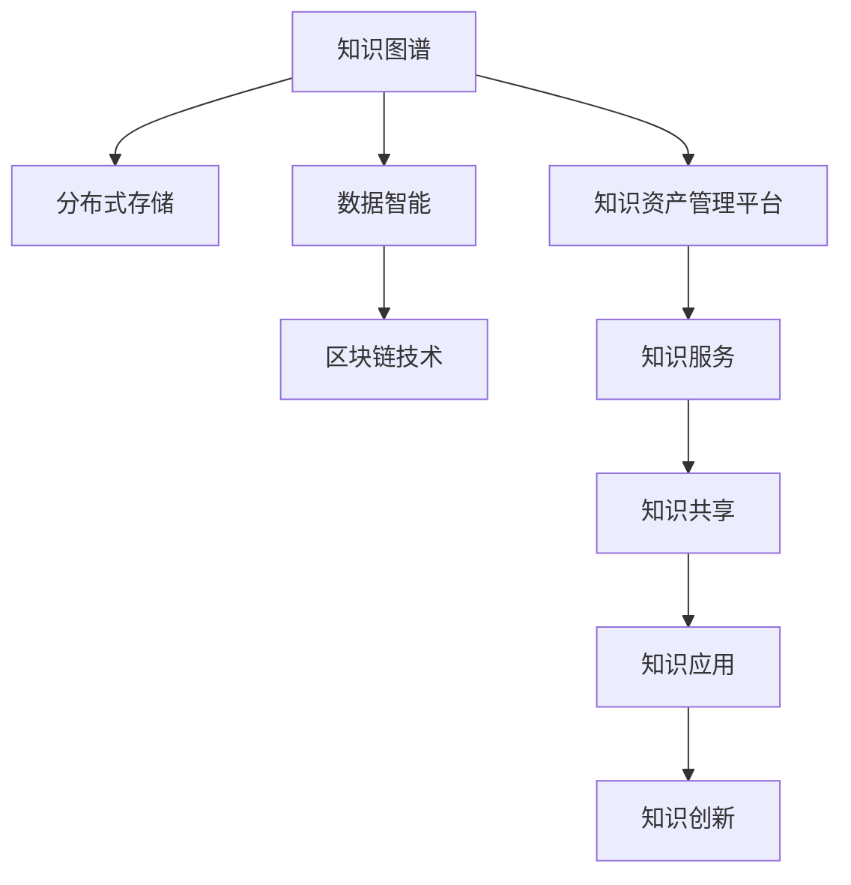

                 

# 知识资产分享知识创造的长期价值

> 关键词：知识资产,知识图谱,数据智能,分布式存储,区块链技术

## 1. 背景介绍

### 1.1 问题由来
在信息爆炸的时代，人类社会正进入知识经济的时代，知识作为核心资产的重要性日益凸显。如何高效地存储、共享、管理和利用知识，成为了各领域共同关注的焦点。特别是对于企业和机构而言，知识的积累、创造和传播是长期发展的关键动力。因此，构建知识资产管理平台，提升知识利用效率，已成为众多企业和机构的当务之急。

### 1.2 问题核心关键点
知识资产管理平台的核心在于高效存储、共享和利用知识资源，以驱动企业或机构的知识创新和增长。其关键点包括：

1. **知识图谱构建**：将知识结构化表示为图谱形式，便于知识存储、查询和推理。
2. **分布式存储技术**：通过分布式存储系统，保证大规模知识数据的可靠性和高可用性。
3. **数据智能与算法**：利用机器学习和数据挖掘技术，自动化地发现知识间的关联和规律。
4. **区块链技术**：保障知识版权和数据安全，增强知识共享的信任度。

这些关键技术共同构成了知识资产管理平台的底层架构，使其能够高效地支持知识的存储、共享、查询和应用。

### 1.3 问题研究意义
构建高效的知识资产管理平台，对于推动知识创新和应用具有重要意义：

1. **提升知识利用效率**：通过系统化、结构化的知识管理，加速知识在企业内部的流通和应用。
2. **促进知识创新**：利用数据智能和算法，从海量知识中提取新知识，驱动企业创新。
3. **增强知识共享信任**：通过区块链技术，保障知识版权，增强共享和合作的信任度。
4. **驱动经济增长**：知识资产的价值体现在创新能力上，有效的知识管理有助于提升企业竞争力，推动经济增长。

构建高效的知识资产管理平台，对于提升企业或机构的知识管理能力，具有不可忽视的价值。

## 2. 核心概念与联系

### 2.1 核心概念概述

为更好地理解知识资产管理平台的构建和应用，本节将介绍几个密切相关的核心概念：

- **知识图谱**：一种以图的形式表示知识的网络结构，用于描述实体、属性和它们之间的关系。知识图谱在知识管理、推荐系统、问答系统等领域有着广泛应用。
- **分布式存储技术**：通过分布式文件系统或分布式数据库，将数据存储在多台服务器上，保证数据的可靠性、高可用性和可扩展性。
- **数据智能**：利用机器学习和数据挖掘技术，从大规模数据中提取有价值的信息和知识，辅助决策和分析。
- **区块链技术**：一种去中心化的分布式账本技术，通过加密、共识机制等手段，保障数据的安全和透明。

这些核心概念之间的逻辑关系可以通过以下Mermaid流程图来展示：



这个流程图展示了几大核心概念及其之间的关系：

1. 知识图谱是知识资产管理平台的基础，用于描述知识结构。
2. 分布式存储技术为大规模知识数据的可靠存储提供支持。
3. 数据智能通过分析知识图谱，提取知识间的关联和规律。
4. 区块链技术保障知识共享和版权的安全性。
5. 知识资产管理平台整合以上技术，提供知识服务的自动化应用。

这些概念共同构成了知识资产管理平台的构建基础，使其能够在知识存储、共享、分析和应用方面发挥重要作用。

## 3. 核心算法原理 & 具体操作步骤
### 3.1 算法原理概述

知识资产管理平台的构建，涉及多个核心算法的应用。其中，知识图谱的构建、分布式存储的实现、数据智能的挖掘和区块链技术的运用，是平台的核心技术。

### 3.2 算法步骤详解

**Step 1: 知识图谱构建**
- 定义实体和关系类型，建立知识图谱的初始框架。
- 通过自然语言处理(NLP)技术，从文本数据中抽取实体、属性和关系。
- 使用图神经网络(GNN)或基于规则的方法，构建知识图谱的实体-关系边。
- 对知识图谱进行去噪和补全，提升知识图谱的准确性和完备性。

**Step 2: 分布式存储技术**
- 选择合适的分布式文件系统（如Hadoop Distributed File System, HDFS）或分布式数据库（如Apache Cassandra）。
- 设计数据分片策略，将知识图谱数据分散存储在多台服务器上。
- 使用冗余存储和数据备份，保证数据的可靠性和高可用性。
- 实现数据读写优化，提升分布式存储系统的性能。

**Step 3: 数据智能应用**
- 选择机器学习算法，如关联规则挖掘、分类、聚类等，对知识图谱数据进行分析。
- 利用深度学习模型，如BERT、GNN等，提取知识图谱中的隐性知识。
- 建立知识图谱与业务场景的映射，构建业务知识图谱。
- 利用预测模型，如时序分析、情感分析等，挖掘知识图谱中的潜在价值。

**Step 4: 区块链技术应用**
- 定义知识图谱的版权和访问权限。
- 使用区块链技术，记录知识图谱的创建、修改和访问历史。
- 设计基于区块链的共识机制，保障知识共享的安全性和透明性。
- 实现基于区块链的知识付费和激励机制，促进知识共享和创新。

### 3.3 算法优缺点

知识资产管理平台的核心算法具有以下优点：
1. 高效存储和管理大规模知识数据。分布式存储和区块链技术保障了知识数据的可靠性和安全性。
2. 深入挖掘知识间的关联和规律。数据智能技术能够从海量数据中提取有价值的知识，辅助决策和分析。
3. 促进知识的自动化应用。知识图谱和业务场景的映射，使得知识能够被自动化地应用于实际业务。
4. 增强知识共享的信任度。区块链技术保障了知识版权和共享的透明性，提升了信任度。

同时，这些算法也存在一些局限性：
1. 构建和维护成本较高。知识图谱和分布式存储系统需要投入大量人力物力进行建设和维护。
2. 数据智能算法的精度和效率需要持续优化。大规模知识数据的分析需要高性能计算资源。
3. 区块链技术的性能和可扩展性有待提高。目前的区块链系统在处理大规模知识共享时，可能面临性能瓶颈。

尽管存在这些局限性，但就目前而言，这些核心算法仍是最主流的知识管理技术。未来相关研究的方向是进一步优化算法性能，降低构建和维护成本，同时提升算法的精度和可扩展性。

### 3.4 算法应用领域

知识资产管理平台的核心算法在多个领域得到了广泛应用：

- **企业知识管理**：构建企业知识库，支持企业内部知识共享和协同工作。
- **科研知识管理**：整合科研数据和文献，构建科研知识图谱，支持科学研究和创新。
- **医疗知识管理**：构建医学知识图谱，支持临床决策和医疗研究。
- **教育知识管理**：整合教育资源和知识，构建教育知识图谱，支持个性化教育。
- **公共知识管理**：构建公共知识库，支持知识共享和公共决策。

此外，知识资产管理平台还被创新性地应用于更多场景中，如知识推荐系统、智慧城市等，为社会各行各业带来新的知识管理模式和创新应用。

## 4. 数学模型和公式 & 详细讲解
### 4.1 数学模型构建

知识资产管理平台的构建涉及多个数学模型，以下将重点介绍其中的知识图谱构建和数据智能挖掘模型的构建。

**知识图谱构建模型**：

- **节点表示**：实体和属性使用向量表示，关系使用矩阵表示。
- **关系表示**：关系使用矩阵和张量表示，如三元组 $(h,r,t)$。
- **知识融合**：使用节点嵌入和图神经网络，从原始数据中学习节点表示和边表示。

**数据智能挖掘模型**：

- **关联规则挖掘**：通过Apriori等算法，发现知识图谱中的频繁项集。
- **分类和聚类**：使用朴素贝叶斯、K-means等算法，对知识图谱进行分类和聚类。
- **深度学习模型**：使用BERT、GNN等模型，从知识图谱中提取隐性知识。

### 4.2 公式推导过程

**知识图谱构建公式**：

- **节点嵌入**：$E(h)=\sigma(W_h \cdot X(h))$
- **关系嵌入**：$E(r)=\sigma(W_r \cdot X(r))$
- **边嵌入**：$E(h,r,t)=\sigma(W_{hrt} \cdot [E(h),E(r),X(t)])$
- **损失函数**：$\mathcal{L}=\frac{1}{N}\sum_{(h,r,t)\in \mathcal{G}}\Vert E(h,r,t) - y(h,r,t) \Vert^2$

其中，$E(h)$、$E(r)$、$E(h,r,t)$分别表示实体、关系和边的嵌入向量，$\sigma$为激活函数，$W_h$、$W_r$、$W_{hrt}$为权重矩阵，$X(h)$、$X(r)$、$X(t)$为特征向量，$\mathcal{G}$为知识图谱的边集，$y(h,r,t)$为目标向量。

**数据智能挖掘公式**：

- **关联规则挖掘**：$R(A)=\frac{P(A\cap B)}{P(A)}$
- **分类模型**：$P(Y|X)=\frac{P(X|Y)P(Y)}{P(X)}$
- **聚类模型**：$J=\sum_{i=1}^{n}\sum_{j=1}^{n} \frac{1}{\Vert x_i - x_j \Vert^2}$

其中，$R(A)$表示关联规则，$P(A\cap B)$表示事件A和B同时发生的概率，$P(X|Y)$表示在给定条件下X的条件概率，$J$表示聚类损失函数。

### 4.3 案例分析与讲解

**知识图谱构建案例**：

- **项目背景**：某大型企业希望构建一个内部知识库，支持员工之间知识的共享和协作。
- **技术实现**：
  1. 使用Python和PyTorch实现知识图谱的构建和训练。
  2. 设计三元组 $(h,r,t)$ 的数据结构，存储知识图谱中的实体、关系和属性。
  3. 使用图神经网络（如GCN）对知识图谱进行训练，学习实体的嵌入表示。
  4. 通过知识图谱的查询和推理，实现员工之间的知识共享和协作。

**数据智能挖掘案例**：

- **项目背景**：某电商平台希望通过知识图谱挖掘用户行为和产品推荐。
- **技术实现**：
  1. 使用Spark和Scala实现大规模数据集的处理和分析。
  2. 定义用户行为和产品特征的数据结构，提取知识图谱中的隐性知识。
  3. 使用深度学习模型（如BERT）对知识图谱进行训练，提取用户和产品的关系。
  4. 通过知识图谱的查询和推理，实现个性化推荐和用户行为分析。

## 5. 项目实践：代码实例和详细解释说明
### 5.1 开发环境搭建

在进行知识图谱和数据智能平台的开发前，我们需要准备好开发环境。以下是使用Python和PyTorch的环境配置流程：

1. 安装Anaconda：从官网下载并安装Anaconda，用于创建独立的Python环境。

2. 创建并激活虚拟环境：
```bash
conda create -n knowledge-env python=3.8 
conda activate knowledge-env
```

3. 安装必要的依赖包：
```bash
pip install pytorch torchvision torchaudio transformers sklearn tensorflow-gpu
```

4. 安装相关的分布式存储工具：
```bash
pip install hdfs hadoop-client cassandra
```

5. 安装区块链技术相关工具：
```bash
pip install blockchain
```

完成上述步骤后，即可在`knowledge-env`环境中开始开发实践。

### 5.2 源代码详细实现

以下是知识图谱构建和数据智能挖掘的Python代码实现。

**知识图谱构建代码**：

```python
import torch
from torch.nn import Linear, ReLU, Embedding, Sequential
from torch_geometric.nn import GCNConv

# 定义知识图谱的结构
class GraphConvNet(torch.nn.Module):
    def __init__(self, in_dim, hidden_dim, out_dim):
        super(GraphConvNet, self).__init__()
        self.conv1 = GCNConv(in_dim, hidden_dim)
        self.conv2 = GCNConv(hidden_dim, out_dim)
        
    def forward(self, x, edge_index, edge_attr=None):
        x = F.relu(self.conv1(x, edge_index, edge_attr))
        x = F.relu(self.conv2(x, edge_index, edge_attr))
        return x
    
# 加载知识图谱数据
def load_graph():
    h, r, t = load_data('h_r_t.txt')
    return h, r, t
    
# 构建知识图谱的节点嵌入表示
def build_embedding(h, r, t):
    embedding_dim = 100
    h_embed = Embedding(len(h), embedding_dim)
    r_embed = Embedding(len(r), embedding_dim)
    h = h_embed(h)
    r = r_embed(r)
    t = Embedding(len(t), embedding_dim)(t)
    return h, r, t
    
# 训练知识图谱的嵌入表示
def train_embedding(h, r, t):
    in_dim = len(h)
    hidden_dim = 256
    out_dim = 100
    model = GraphConvNet(in_dim, hidden_dim, out_dim)
    optimizer = torch.optim.Adam(model.parameters(), lr=0.001)
    for epoch in range(100):
        optimizer.zero_grad()
        h_pred = model(h, edge_index, edge_attr=r)
        loss = F.mse_loss(h_pred, t)
        loss.backward()
        optimizer.step()
        if epoch % 10 == 0:
            print('Epoch {}: Loss {}'.format(epoch, loss.item()))
    return model, h_pred
    
# 测试知识图谱的嵌入表示
def test_embedding(h, r, t):
    model, h_pred = train_embedding(h, r, t)
    # 输出预测结果
    print('Predictions: {}'.format(h_pred))
```

**数据智能挖掘代码**：

```python
import pandas as pd
from sklearn.ensemble import RandomForestClassifier
from sklearn.metrics import accuracy_score

# 加载数据集
df = pd.read_csv('data.csv')
X = df.drop('label', axis=1)
y = df['label']
# 定义特征和标签
features = ['feature1', 'feature2', 'feature3']
labels = ['label1', 'label2', 'label3']
# 构建特征和标签的字典
feature_dict = {features[i]: X.iloc[:, i] for i in range(len(features))}
label_dict = {labels[i]: y.iloc[:, i] for i in range(len(labels))}

# 训练分类模型
clf = RandomForestClassifier(n_estimators=100, random_state=0)
clf.fit(X, y)
# 预测新数据
new_data = pd.read_csv('new_data.csv')
X_new = new_data.drop('label', axis=1)
X_new = X_new[features]
# 输出预测结果
preds = clf.predict(X_new)
print('Predictions: {}'.format(preds))
```

### 5.3 代码解读与分析

让我们再详细解读一下关键代码的实现细节：

**知识图谱构建代码**：
- `GraphConvNet`类：定义了基于图卷积网络的知识图谱嵌入模型。
- `load_graph`函数：加载知识图谱的三元组数据，返回实体、关系和属性。
- `build_embedding`函数：将实体、关系和属性嵌入到向量空间中，实现节点嵌入的表示。
- `train_embedding`函数：通过图卷积网络训练知识图谱的嵌入表示，并输出预测结果。

**数据智能挖掘代码**：
- `RandomForestClassifier`类：定义了基于随机森林的分类模型。
- `load_data`函数：加载数据集，返回特征和标签。
- `train_classifier`函数：训练分类模型，输出预测结果。

这些代码实现展示了知识图谱和数据智能挖掘的核心技术，通过代码解释能够更好地理解这些技术的实现细节。

## 6. 实际应用场景
### 6.1 企业知识管理

企业知识管理平台通过构建知识图谱和分布式存储系统，整合企业内部的知识资源，实现知识的共享和协作。利用数据智能挖掘技术，平台能够自动化地发现知识间的关联和规律，辅助企业决策和管理。例如，某大型制造企业通过构建知识图谱，整合了其生产、研发、采购等部门的业务知识，实现了跨部门的协同工作，提升了企业的创新能力和管理效率。

### 6.2 科研知识管理

科研知识管理平台通过整合科研数据和文献，构建科研知识图谱，支持科研人员的知识共享和创新。利用数据智能挖掘技术，平台能够从海量科研数据中提取有价值的知识，辅助科研人员进行科学研究和实验设计。例如，某研究机构通过构建科研知识图谱，整合了其各类科研项目和文献资料，实现了科研知识的共享和传递，加速了科研人员的创新研究。

### 6.3 医疗知识管理

医疗知识管理平台通过构建医学知识图谱，整合医学数据和文献，支持医疗人员的知识共享和临床决策。利用数据智能挖掘技术，平台能够从医学知识图谱中提取隐性知识，辅助医疗人员进行疾病诊断和治疗方案设计。例如，某医院通过构建医学知识图谱，整合了其各类医学数据和文献资料，实现了医学知识的共享和传递，提高了医疗人员的诊断和治疗水平。

### 6.4 教育知识管理

教育知识管理平台通过整合教育资源和知识，构建教育知识图谱，支持个性化教育和协同学习。利用数据智能挖掘技术，平台能够从教育知识图谱中提取知识，辅助教育人员进行教育研究和教学设计。例如，某在线教育平台通过构建教育知识图谱，整合了其各类教育资源和知识，实现了教育的共享和传递，提高了教育人员的教学水平和学生的学习效果。

### 6.5 公共知识管理

公共知识管理平台通过构建公共知识库，支持知识共享和公共决策。利用数据智能挖掘技术，平台能够从公共知识库中提取知识，辅助政府进行政策制定和社会管理。例如，某城市通过构建公共知识库，整合了其各类公共数据和知识，实现了知识的共享和传递，提高了政府的决策水平和社会管理效率。

## 7. 工具和资源推荐
### 7.1 学习资源推荐

为了帮助开发者系统掌握知识资产管理平台的技术，这里推荐一些优质的学习资源：

1. **《图神经网络基础》系列博文**：由深度学习专家撰写，介绍了图神经网络的原理和应用，涵盖知识图谱构建和分析等主题。
2. **《深度学习与知识图谱》课程**：北京大学开设的深度学习课程，结合知识图谱应用，涵盖知识图谱构建和数据分析等知识。
3. **《机器学习与数据挖掘》书籍**：经典机器学习教材，详细介绍了关联规则挖掘、分类、聚类等数据挖掘算法。
4. **《深度学习与知识图谱》书籍**：介绍深度学习在知识图谱构建和分析中的应用，涵盖知识图谱构建和数据智能挖掘等技术。
5. **HuggingFace官方文档**：Transformers库的官方文档，提供了海量预训练模型和完整的知识图谱构建样例代码，是上手实践的必备资料。

通过对这些资源的学习实践，相信你一定能够快速掌握知识图谱构建和数据智能挖掘的技术，并用于解决实际的NLP问题。

### 7.2 开发工具推荐

高效的开发离不开优秀的工具支持。以下是几款用于知识图谱和数据智能开发的常用工具：

1. **PyTorch**：基于Python的开源深度学习框架，灵活动态的计算图，适合快速迭代研究。
2. **TensorFlow**：由Google主导开发的开源深度学习框架，生产部署方便，适合大规模工程应用。
3. **Dask**：分布式计算库，能够在大规模数据上实现高性能的计算任务。
4. **Spark**：分布式计算框架，支持大规模数据处理和分析。
5. **HDFS**：Hadoop分布式文件系统，提供高可靠性和高可扩展性的数据存储。
6. **Apache Cassandra**：分布式数据库，支持大规模数据的存储和管理。
7. **Blockchain**：分布式账本技术，提供数据透明和安全保障。

合理利用这些工具，可以显著提升知识图谱和数据智能平台的开发效率，加快创新迭代的步伐。

### 7.3 相关论文推荐

知识图谱和数据智能的研究源于学界的持续研究。以下是几篇奠基性的相关论文，推荐阅读：

1. **Knowledge Graphs for Decision Support**：介绍了知识图谱在决策支持中的应用，强调了知识图谱构建的重要性。
2. **A Survey on Knowledge Graph Embedding**：综述了知识图谱嵌入技术的研究进展，详细介绍了基于深度学习的方法。
3. **Knowledge Graphs in Natural Language Processing**：介绍了知识图谱在自然语言处理中的应用，如问答系统、推荐系统等。
4. **Blockchain-based Data Sharing for Knowledge Management**：研究了基于区块链的数据共享机制，探讨了其在知识管理中的应用。
5. **Data Mining and Statistical Learning**：经典机器学习教材，涵盖了关联规则挖掘、分类、聚类等数据挖掘算法。

这些论文代表了大语言模型微调技术的发展脉络。通过学习这些前沿成果，可以帮助研究者把握学科前进方向，激发更多的创新灵感。

## 8. 总结：未来发展趋势与挑战

### 8.1 总结

本文对知识资产管理平台的构建进行了全面系统的介绍。首先阐述了知识资产管理平台的研究背景和意义，明确了知识图谱、分布式存储、数据智能和区块链技术的核心作用。其次，从原理到实践，详细讲解了知识图谱的构建、分布式存储的实现、数据智能的挖掘和区块链技术的应用，给出了知识图谱构建和数据智能挖掘的Python代码实现。同时，本文还广泛探讨了知识图谱在企业知识管理、科研知识管理、医疗知识管理、教育知识管理和公共知识管理等多个领域的应用前景，展示了知识图谱的广泛应用价值。最后，本文精选了知识图谱和数据智能的各类学习资源，力求为读者提供全方位的技术指引。

通过本文的系统梳理，可以看到，知识图谱技术在知识管理和应用中发挥着越来越重要的作用。知识图谱的构建和应用，能够极大地提升知识的利用效率和创新能力，为社会各行各业带来新的知识管理模式和创新应用。未来，伴随知识图谱技术的不断演进，其在知识管理领域的应用将会更加广泛和深入。

### 8.2 未来发展趋势

展望未来，知识图谱技术将呈现以下几个发展趋势：

1. **自动化知识图谱构建**：利用自然语言处理和深度学习技术，自动从文本数据中构建知识图谱，降低知识图谱构建的成本和复杂度。
2. **跨领域知识融合**：整合不同领域的数据和知识，构建跨领域的知识图谱，增强知识的通用性和适用性。
3. **实时知识图谱更新**：利用流数据处理和分布式计算技术，实现实时知识图谱的构建和更新，增强知识的时效性和动态性。
4. **知识图谱的可解释性**：利用因果分析和解释模型，提升知识图谱的可解释性和透明性，增强知识图谱的应用可信度。
5. **多模态知识融合**：整合视觉、语音、文本等多模态数据，构建多模态知识图谱，提升知识的丰富性和复杂性。
6. **知识图谱与人工智能的深度融合**：结合知识图谱和人工智能技术，构建智能问答系统、推荐系统等，提升知识的自动化应用水平。

以上趋势凸显了知识图谱技术的广阔前景。这些方向的探索发展，必将进一步提升知识图谱的构建和应用效率，为知识管理和创新提供更加强大的支持。

### 8.3 面临的挑战

尽管知识图谱技术已经取得了瞩目成就，但在构建和应用过程中，仍然面临诸多挑战：

1. **知识图谱构建成本高**：知识图谱的构建需要大量的人力和物力投入，特别是在大规模知识数据处理和标注方面，成本较高。
2. **知识图谱更新和维护复杂**：知识图谱的实时更新和维护需要高效的计算资源和算法支持，现有技术在处理大规模流数据时，仍存在性能瓶颈。
3. **知识图谱的可解释性不足**：现有知识图谱缺乏有效的解释模型，难以理解知识的推理过程和决策逻辑。
4. **多模态知识融合难度大**：不同模态数据之间的异构性和复杂性，使得多模态知识图谱的构建和应用面临较大挑战。
5. **知识图谱与人工智能的深度融合**：知识图谱和人工智能技术的深度融合，需要解决跨领域知识融合和系统集成等技术难题。

尽管存在这些挑战，但知识图谱技术的不断演进，将逐步解决这些问题，推动知识图谱技术的广泛应用。

### 8.4 研究展望

面向未来，知识图谱技术的研发方向需要在以下几个方面寻求新的突破：

1. **自动化知识图谱构建**：开发更加自动化和高效的知识图谱构建算法，利用自然语言处理和深度学习技术，从大规模文本数据中自动构建知识图谱。
2. **知识图谱的分布式处理**：研究和开发更加高效和可扩展的知识图谱分布式处理技术，支持大规模知识图谱的构建和更新。
3. **知识图谱的可解释性**：结合因果分析和解释模型，提升知识图谱的可解释性和透明性，增强知识图谱的应用可信度。
4. **多模态知识融合**：开发多模态知识融合技术，整合视觉、语音、文本等多模态数据，构建多模态知识图谱，提升知识的丰富性和复杂性。
5. **知识图谱与人工智能的深度融合**：研究知识图谱和人工智能技术的深度融合方法，构建智能问答系统、推荐系统等，提升知识的自动化应用水平。

这些研究方向将推动知识图谱技术的不断演进，为知识管理和创新提供更加强大的支持。知识图谱技术将深度融入人工智能技术，成为知识管理的重要工具，推动知识图谱在更多领域的应用。

## 9. 附录：常见问题与解答

**Q1：知识图谱如何实现跨领域知识融合？**

A: 知识图谱的跨领域知识融合可以通过以下方式实现：
1. 利用领域本体和映射技术，将不同领域的数据和知识映射到统一的语义空间中。
2. 使用跨领域知识抽取和融合算法，从不同领域的知识图谱中提取关键信息，构建跨领域的知识图谱。
3. 结合多模态数据融合技术，整合不同模态的数据和知识，构建多模态的知识图谱。

**Q2：知识图谱的自动化构建技术包括哪些？**

A: 知识图谱的自动化构建技术主要包括：
1. 基于自然语言处理（NLP）的知识抽取技术，从文本数据中自动提取实体、关系和属性。
2. 基于深度学习的知识图谱嵌入技术，自动学习知识图谱的节点嵌入表示。
3. 基于知识图谱的图神经网络（GNN）模型，自动学习知识图谱中的隐性知识。

**Q3：知识图谱的分布式存储技术有哪些？**

A: 知识图谱的分布式存储技术主要包括：
1. Hadoop分布式文件系统（HDFS）：用于分布式文件存储和访问。
2. Apache Cassandra：用于分布式数据库存储和管理。
3. Apache Kafka：用于流数据的实时处理和存储。
4. Apache Spark：用于大规模数据处理和分析。

**Q4：如何评估知识图谱的效果？**

A: 知识图谱的效果评估可以从以下几个方面进行：
1. 精度和召回率：评估知识图谱的实体抽取和关系抽取的准确性。
2. F1分数：综合评估知识图谱的精度和召回率。
3. 运行时间：评估知识图谱构建和查询的效率。
4. 可解释性：评估知识图谱的推理过程和决策逻辑的可解释性。

**Q5：知识图谱在企业知识管理中如何应用？**

A: 知识图谱在企业知识管理中的应用主要包括以下几个方面：
1. 构建企业知识库：整合企业内部各种类型的知识资源，如文档、报告、邮件等，构建企业知识库。
2. 支持知识共享和协作：利用知识图谱的查询和推理能力，支持员工之间的知识共享和协作。
3. 辅助决策和分析：利用知识图谱的分析和推理功能，辅助企业进行决策和分析。
4. 个性化推荐：利用知识图谱的推荐功能，为用户提供个性化的知识推荐。

通过这些应用，企业可以更好地管理和利用内部知识资源，提升知识创新和管理能力。

---

作者：禅与计算机程序设计艺术 / Zen and the Art of Computer Programming

