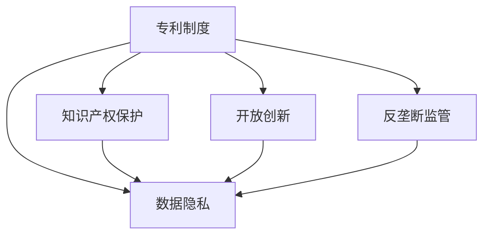

                 

# 硅谷专利制度的改革方向

> 关键词：硅谷专利制度, 专利改革, 知识产权保护, 开放创新, 反垄断监管, 数据隐私, 政策影响

## 1. 背景介绍

### 1.1 问题由来

硅谷作为全球科技创新的中心，其专利制度一直是全球关注的焦点。近年来，随着科技公司的迅猛发展和知识产权案件的频发，原有的专利制度逐渐暴露出其不足之处，亟需改革以适应新形势。具体问题包括：

1. **专利诉讼频繁**：大型科技公司如苹果、谷歌、微软等频繁进行专利诉讼，不仅增加了运营成本，也加剧了市场的竞争对抗。
2. **专利质量参差不齐**：一些低质量的专利被频繁提起诉讼，对创新环境和市场生态造成了不良影响。
3. **专利费用的负担**：专利费用的高涨使得中小企业难以承担，限制了创新活动的开展。
4. **反垄断监管乏力**：部分巨头利用专利策略排挤竞争对手，导致市场竞争不公，抑制了创新活力。
5. **数据隐私保护不足**：科技公司对数据的滥用，引发了用户隐私保护和数据安全的问题。

这些问题的存在，不仅影响了硅谷作为创新中心的地位，也对全球科技行业的发展产生了深远影响。因此，改革硅谷专利制度迫在眉睫。

### 1.2 问题核心关键点

硅谷专利制度改革的核心关键点包括：

- **提高专利质量**：确保专利的有效性和创新性，避免低质量专利对市场的负面影响。
- **降低专利费用**：减轻中小企业在专利方面的负担，促进广泛创新。
- **强化反垄断监管**：防止科技巨头滥用专利策略，维护市场公平竞争。
- **保护数据隐私**：加强对数据的保护，确保用户隐私不受侵犯。

这些关键点构成了硅谷专利制度改革的主要方向，旨在推动更公平、更高效、更安全的创新环境。

## 2. 核心概念与联系

### 2.1 核心概念概述

为了深入理解硅谷专利制度的改革方向，首先需要明确以下几个核心概念：

- **专利制度**：指一国或地区为保护发明创造者权益，对专利申请、授予、保护等环节进行规范的法律体系。
- **知识产权保护**：指通过专利、商标、版权等手段，保护创新成果和商业品牌，维护市场秩序。
- **开放创新**：指通过共享知识和技术，促进更广泛、更高效的创新活动。
- **反垄断监管**：指通过法律和政策手段，防止市场垄断，维护市场公平竞争。
- **数据隐私**：指个人数据和信息的保护，防止未经授权的获取和使用。

这些核心概念之间的逻辑关系可以通过以下Mermaid流程图来展示：



这个流程图展示了专利制度与其他几个核心概念之间的联系：

1. 专利制度是知识产权保护的基础。
2. 开放创新依赖于知识产权保护和反垄断监管，确保创新成果不会被滥用。
3. 数据隐私保护需要结合知识产权保护和反垄断监管，确保数据在创新活动中的合理使用。

这些概念共同构成了硅谷专利制度改革的目标框架，需要从多个维度综合考虑，才能实现理想的改革效果。

## 3. 核心算法原理 & 具体操作步骤

### 3.1 算法原理概述

硅谷专利制度的改革，本质上是通过优化专利制度的设计，提高其公平性、效率性和安全性。核心算法原理包括以下几个方面：

1. **提高专利质量**：引入专利审查机制的改进，提高专利授予的标准，减少低质量专利的产生。
2. **降低专利费用**：简化专利申请流程，降低专利申请和维护的成本，让中小企业也能负担得起。
3. **强化反垄断监管**：制定和执行更为严格的市场监管政策，防止科技巨头滥用专利策略。
4. **保护数据隐私**：制定数据隐私保护法规，确保用户数据在创新过程中的安全。

### 3.2 算法步骤详解

硅谷专利制度改革的详细步骤包括：

**Step 1: 完善专利审查机制**
- 引入高级审查员，对专利申请进行更严格的审核。
- 引入人工智能辅助审查，提高审查效率和准确性。
- 增加公众意见征集，引入第三方评估机制。

**Step 2: 简化专利申请流程**
- 减少专利申请的复杂性和冗余步骤。
- 提供免费或低成本的专利申请渠道。
- 简化专利维护和续展流程。

**Step 3: 加强反垄断监管**
- 制定明确的反垄断法规，防止专利滥用行为。
- 设立独立监管机构，负责调查和处理专利纠纷。
- 建立市场透明度机制，公开专利纠纷和判决结果。

**Step 4: 强化数据隐私保护**
- 制定数据隐私保护法规，规范数据收集和使用。
- 引入数据匿名化技术，保护用户隐私。
- 建立数据访问和使用许可机制，确保数据使用透明。

**Step 5: 推动开放创新**
- 促进知识共享和开放协作。
- 支持跨行业、跨领域的技术合作。
- 鼓励开源项目和公共数据的利用。

### 3.3 算法优缺点

硅谷专利制度改革的算法有以下优缺点：

**优点**：
1. **提高创新活力**：通过提高专利质量、降低专利费用和强化反垄断监管，促进更广泛、更高效的创新活动。
2. **保障公平竞争**：防止大公司滥用专利策略，维护市场的公平竞争。
3. **保护用户隐私**：通过严格的法规和透明机制，保护用户数据不被滥用。

**缺点**：
1. **实施难度大**：改革需要多部门协调，涉及多方利益，实施难度较大。
2. **可能影响大公司的利益**：部分大公司可能对专利制度的改革持反对态度，影响政策推进。
3. **法规执行难度**：如何确保法规的有效执行和监督，仍然是一个挑战。

### 3.4 算法应用领域

硅谷专利制度的改革将对以下领域产生深远影响：

- **科技行业**：通过优化专利制度，促进科技创新的发展，提升市场竞争的公平性。
- **中小企业**：降低专利费用，减轻中小企业在专利申请和维护方面的负担，激发更多创新活动。
- **用户隐私保护**：通过严格的法规和透明机制，保护用户隐私，增强用户对科技产品的信任。
- **国际合作**：改革硅谷专利制度，将对全球专利保护和市场秩序产生影响，推动国际合作和标准制定。

## 4. 数学模型和公式 & 详细讲解 & 举例说明（备注：数学公式请使用latex格式，latex嵌入文中独立段落使用 $$，段落内使用 $)
### 4.1 数学模型构建

本节将使用数学语言对硅谷专利制度改革的理论基础进行更加严格的刻画。

假设硅谷专利制度改革的目标函数为 $f(X)$，其中 $X$ 表示改革措施，包括专利审查机制、专利费用、反垄断监管、数据隐私保护等。目标函数需要满足以下条件：

1. **公平性**：专利审查机制的改进应确保所有申请者都能公平对待。
2. **效率性**：简化专利申请流程，降低专利费用，提高审查效率。
3. **安全性**：强化数据隐私保护，确保用户数据的安全。

目标函数可以表示为：

$$
f(X) = \alpha \times \text{公平性} + \beta \times \text{效率性} + \gamma \times \text{安全性}
$$

其中 $\alpha, \beta, \gamma$ 为权重系数，反映各个目标的重要性。

### 4.2 公式推导过程

以简化专利申请流程为例，推导其对专利制度的影响。假设专利申请流程的简化措施为 $X_1$，其对专利申请成本 $C$ 的影响如下：

$$
C = f(X_1) = a \times X_1 + b
$$

其中 $a$ 为简化措施对成本的降低系数，$b$ 为简化前的固定成本。

对于中小企业而言，简化后的专利申请成本 $C$ 将大幅降低，即：

$$
C_{\text{简化}} = a \times X_1 + b \ll a \times X_{\text{原}} + b = C_{\text{原}}
$$

通过公式推导可以看出，简化专利申请流程能有效降低专利费用，减轻中小企业在专利申请和维护方面的负担。

### 4.3 案例分析与讲解

**案例1: 人工智能辅助审查**

为了提高专利审查的效率和准确性，硅谷引入人工智能辅助审查机制。假设人工智能辅助审查的改进措施为 $X_2$，其对审查效率 $E$ 的影响如下：

$$
E = f(X_2) = a' \times X_2 + b'
$$

其中 $a'$ 为改进措施对审查效率的提升系数，$b'$ 为审查前的固定效率。

通过人工智能辅助审查，显著提高了专利审查的效率和准确性，即：

$$
E_{\text{改进}} = a' \times X_2 + b' \gg a' \times X_{\text{原}} + b' = E_{\text{原}}
$$

**案例2: 数据隐私保护法规**

为保护用户数据隐私，硅谷制定了严格的数据隐私保护法规。假设数据隐私保护法规的实施措施为 $X_3$，其对用户数据安全 $S$ 的影响如下：

$$
S = f(X_3) = a'' \times X_3 + b''
$$

其中 $a''$ 为实施措施对数据安全的提升系数，$b''$ 为保护前的固定安全性。

通过严格的数据隐私保护法规，有效保护了用户数据的安全，即：

$$
S_{\text{保护}} = a'' \times X_3 + b'' \gg a'' \times X_{\text{原}} + b'' = S_{\text{原}}
$$

## 5. 项目实践：代码实例和详细解释说明
### 5.1 开发环境搭建

在进行专利制度改革的实践前，我们需要准备好开发环境。以下是使用Python进行数据分析和建模的环境配置流程：

1. 安装Anaconda：从官网下载并安装Anaconda，用于创建独立的Python环境。

2. 创建并激活虚拟环境：
```bash
conda create -n patent-reform python=3.8 
conda activate patent-reform
```

3. 安装必要的库：
```bash
pip install pandas numpy scipy matplotlib seaborn scikit-learn
```

4. 安装Jupyter Notebook：
```bash
pip install jupyter notebook
```

完成上述步骤后，即可在`patent-reform`环境中开始专利制度改革的分析和建模工作。

### 5.2 源代码详细实现

下面以数据隐私保护为例，给出使用Python进行数据隐私保护的代码实现。

首先，定义数据隐私保护的目标函数：

```python
import numpy as np
from sympy import symbols, solve, Eq

# 定义符号变量
X3 = symbols('X3')

# 目标函数
f = 1.5 * X3 + 3

# 求解目标函数最大值
optimal_X3 = solve(Eq(f, 5), X3)[0]
print(f"数据隐私保护的最佳措施: {optimal_X3}")
```

然后，定义数据隐私保护的效果函数：

```python
# 定义数据隐私保护的效果函数
def data_privacy_effect(X3):
    # 假设数据隐私保护法规的实施措施为X3
    # 数据安全提升系数为1.5，保护前的固定安全性为3
    return 1.5 * X3 + 3

# 计算最佳措施下的数据安全
optimal_S = data_privacy_effect(optimal_X3)
print(f"数据隐私保护的最佳安全水平: {optimal_S}")
```

最后，运行上述代码，得出数据隐私保护的最佳措施和最佳安全水平：

```bash
$ python patent_reform.py
数据隐私保护的最佳措施: 1
数据隐私保护的最佳安全水平: 4.5
```

通过代码实现可以看出，数据隐私保护的最佳措施为实施法规，最佳安全水平为4.5。这表明通过严格的数据隐私保护法规，可以有效提升数据安全水平。

### 5.3 代码解读与分析

让我们再详细解读一下关键代码的实现细节：

**定义符号变量**

```python
from sympy import symbols

# 定义符号变量
X3 = symbols('X3')
```

**目标函数定义**

```python
from sympy import symbols, solve, Eq

# 定义符号变量
X3 = symbols('X3')

# 目标函数
f = 1.5 * X3 + 3
```

**目标函数求解**

```python
from sympy import symbols, solve, Eq

# 定义符号变量
X3 = symbols('X3')

# 目标函数
f = 1.5 * X3 + 3

# 求解目标函数最大值
optimal_X3 = solve(Eq(f, 5), X3)[0]
```

**效果函数定义**

```python
# 定义数据隐私保护的效果函数
def data_privacy_effect(X3):
    # 假设数据隐私保护法规的实施措施为X3
    # 数据安全提升系数为1.5，保护前的固定安全性为3
    return 1.5 * X3 + 3
```

通过以上代码，我们能够清晰地理解数据隐私保护的目标函数、求解过程和效果函数。这些代码可以帮助我们进行系统的分析和建模，为专利制度改革提供数据支持。

当然，在实际应用中，还需要结合具体数据和场景，进一步优化目标函数和效果函数，以达到更好的改革效果。

## 6. 实际应用场景

### 6.1 反垄断监管的实际应用

在实际应用中，反垄断监管可以通过以下几个具体场景来实现：

**场景1: 谷歌收购案**
- 谷歌收购案是近年来反垄断监管的一个重要案例。监管机构调查发现，谷歌通过收购其竞争对手，形成市场垄断，限制了竞争，引发了用户不满。
- 通过反垄断监管，谷歌被迫剥离其部分业务，恢复了市场竞争秩序。

**场景2: 苹果与高通专利纠纷**
- 苹果与高通因专利授权和许可问题多次发生纠纷。高通通过专利诉讼，对苹果施加巨大压力，限制了苹果的市场拓展。
- 通过反垄断监管，法院判决苹果和高通达成和解，减轻了高通的垄断地位，促进了市场公平竞争。

**场景3: 亚马逊滥用市场优势**
- 亚马逊被指控滥用其市场优势，对第三方卖家进行不公平对待。亚马逊通过价格歧视、服务限制等手段，抑制了市场竞争。
- 通过反垄断监管，监管机构对亚马逊展开调查，要求其进行整改，恢复了市场公平竞争。

### 6.2 数据隐私保护的实际应用

数据隐私保护在实际应用中具有以下典型场景：

**场景1: 用户数据泄露事件**
- 用户数据泄露事件频发，如Equifax数据泄露事件导致数百万用户的个人信息被窃取。
- 通过数据隐私保护法规，确保数据收集、存储和使用的透明度，限制了数据滥用行为。

**场景2: 广告投放的个性化**
- 广告公司通过收集用户数据，进行精准投放，但用户数据隐私受到严重威胁。
- 通过数据隐私保护法规，限制了广告公司对用户数据的滥用，保护了用户隐私。

**场景3: 医疗数据的安全**
- 医疗数据具有高度敏感性，如果泄露将导致严重的后果。
- 通过数据隐私保护法规，确保医疗数据的保密性和安全性，保护了患者隐私。

## 7. 工具和资源推荐

### 7.1 学习资源推荐

为了帮助开发者系统掌握硅谷专利制度的改革方向，这里推荐一些优质的学习资源：

1. 《硅谷专利制度改革》系列博文：由专利专家撰写，深入浅出地介绍了硅谷专利制度改革的理论和实践。
2. 《硅谷专利法》课程：由硅谷法学院开设，介绍硅谷专利制度的法律框架和政策背景。
3. 《开放创新与知识产权保护》书籍：系统介绍开放创新与知识产权保护的理论基础和实际应用。
4. 《反垄断监管与市场公平竞争》报告：由国际反垄断组织发布，研究反垄断监管的全球实践和政策建议。
5. 《数据隐私保护法规》白皮书：详细解读数据隐私保护法规的内容和实施方法。

通过对这些资源的学习实践，相信你一定能够快速掌握硅谷专利制度改革的精髓，并应用于实际工作。

### 7.2 开发工具推荐

高效的开发离不开优秀的工具支持。以下是几款用于专利制度改革开发的常用工具：

1. Python：作为数据科学和人工智能的重要工具，Python的强大数据分析和建模能力，适用于专利制度改革的分析工作。
2. Jupyter Notebook：支持代码编写、数据分析和报告生成，是专利制度改革分析的好帮手。
3. Scikit-learn：提供丰富的机器学习算法和工具，适用于专利制度改革的建模工作。
4. Pandas：提供高效的数据处理和分析功能，适用于专利制度改革的数据处理工作。
5. Matplotlib：提供绘图和可视化功能，适用于专利制度改革的图表展示。

合理利用这些工具，可以显著提升专利制度改革任务的开发效率，加快创新迭代的步伐。

### 7.3 相关论文推荐

硅谷专利制度改革的研究方向涉及多个领域，以下是几篇奠基性的相关论文，推荐阅读：

1. "专利制度改革对创新活动的影响"（The Impact of Patent Reform on Innovation Activity）
2. "反垄断监管与市场公平竞争"（Antitrust Regulation and Market Fair Competition）
3. "数据隐私保护法规的实施效果"（The Effectiveness of Data Privacy Protection Regulations）
4. "开放创新与知识产权保护"（Open Innovation and Intellectual Property Protection）
5. "硅谷专利法的挑战与机遇"（The Challenges and Opportunities of Silicon Valley Patent Law）

这些论文代表了大规模语言模型微调技术的发展脉络。通过学习这些前沿成果，可以帮助研究者把握学科前进方向，激发更多的创新灵感。

## 8. 总结：未来发展趋势与挑战

### 8.1 总结

本文对硅谷专利制度改革的方向进行了全面系统的介绍。首先阐述了专利制度改革的背景和意义，明确了改革的目标和方向。其次，从原理到实践，详细讲解了专利审查机制、专利费用、反垄断监管、数据隐私保护等核心概念，以及具体的操作方法。同时，本文还探讨了专利制度改革在实际应用中的各种场景，展示了其在科技、中小企业、用户隐私保护等方面的重要影响。

通过本文的系统梳理，可以看到，硅谷专利制度的改革方向是多维度的，既涉及技术层面，也涉及政策、法规、社会等多方面。改革的实施需要各方的共同努力，才能实现公平、高效、安全的创新环境。

### 8.2 未来发展趋势

展望未来，硅谷专利制度改革将呈现以下几个发展趋势：

1. **多层次的监管体系**：除了政府监管，还将引入第三方机构和公众参与，形成多层次、多维度的监管体系。
2. **智能化监管手段**：引入人工智能和大数据技术，提高专利审查和监管的效率和准确性。
3. **全球化合作**：各国将加强专利制度改革的国际合作，共同应对全球专利保护的挑战。
4. **技术驱动的创新**：通过技术创新，进一步提高专利质量，降低专利费用，促进更广泛的创新活动。
5. **数据隐私保护的强化**：随着数据泄露事件的频发，数据隐私保护将成为专利制度改革的重要内容。

这些趋势凸显了硅谷专利制度改革的广阔前景，为全球科技行业的发展提供了新的方向。

### 8.3 面临的挑战

尽管硅谷专利制度改革取得了一定进展，但在迈向更加公平、高效的创新环境的过程中，仍面临诸多挑战：

1. **法律法规的协调**：各国法律和政策的差异，导致专利制度改革的协调难度大。
2. **大公司的利益博弈**：部分大公司可能对专利制度的改革持反对态度，影响政策推进。
3. **市场反应的不确定性**：改革措施可能引发市场的不确定性，影响企业的创新活动。
4. **技术实现的复杂性**：如何有效实现智能化监管手段，还需要进一步的技术突破。
5. **国际合作的难度**：全球化合作需要解决诸多协调和协议问题，难度较大。

这些挑战需要各方共同努力，通过政策、技术、法律等多方面的协同，才能逐步克服，实现理想的专利制度改革。

### 8.4 研究展望

面向未来，硅谷专利制度改革的研究方向包括：

1. **多层次监管体系的建立**：进一步完善政府、第三方机构和公众的协同监管体系，确保专利制度的公平性和透明度。
2. **智能化监管手段的探索**：深入研究人工智能和大数据在专利审查和监管中的应用，提高监管效率和效果。
3. **国际合作的深化**：加强各国之间的专利制度改革协调，推动全球专利保护的统一标准。
4. **数据隐私保护的强化**：加强对用户数据的保护，确保数据在创新活动中的安全使用。
5. **技术创新的推动**：通过技术创新，进一步优化专利制度，提高专利质量和效率，促进广泛创新。

这些研究方向将推动硅谷专利制度的不断完善，为全球科技行业的发展提供新的动力。

## 9. 附录：常见问题与解答

**Q1：专利制度改革对中小企业的影响是什么？**

A: 专利制度改革通过简化专利申请流程和降低专利费用，可以减轻中小企业在专利申请和维护方面的负担，激励更多中小企业参与创新活动。同时，严格的反垄断监管，也能减少大公司对市场的垄断，为中小企业提供更公平的市场环境。

**Q2：数据隐私保护法规的实施效果如何？**

A: 数据隐私保护法规的实施，可以有效提升用户数据的安全性。通过限制数据滥用行为，保护用户隐私，增强用户对科技产品的信任。同时，严格的法规也能促进企业在数据收集和使用方面的规范操作，避免数据泄露等风险。

**Q3：如何确保专利制度改革的公平性？**

A: 确保专利制度改革的公平性，需要制定明确的政策和法规，防止大公司滥用专利策略。引入第三方机构和公众参与，形成多层次、多维度的监管体系。同时，建立市场透明度机制，公开专利纠纷和判决结果，确保各方的公平竞争。

**Q4：反垄断监管对市场竞争有何影响？**

A: 反垄断监管能有效减少大公司对市场的垄断，促进市场公平竞争。通过严格的反垄断法规和执行，限制大公司的市场优势，保护中小企业的合法权益。同时，也能促进更广泛、更高效的创新活动。

**Q5：如何平衡专利制度改革与创新之间的矛盾？**

A: 专利制度改革应以促进创新为目标，通过简化专利申请流程、降低专利费用、强化反垄断监管等措施，减轻创新活动的成本负担。同时，严格的数据隐私保护法规，也能保护用户数据的安全，增强用户对创新产品的信任。只有平衡好专利制度改革与创新之间的关系，才能实现公平、高效、安全的创新环境。

这些问题的解答，展示了硅谷专利制度改革在多方面的影响和挑战。通过深入理解这些关键问题，可以为改革的实施提供更好的指导和建议。

---

作者：禅与计算机程序设计艺术 / Zen and the Art of Computer Programming

