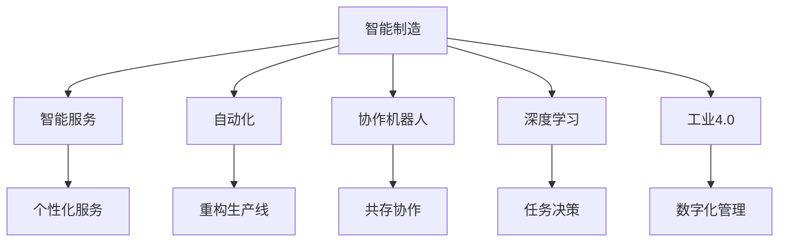

                 

# 硅谷机器人技术:智能制造与服务

> 关键词：硅谷, 机器人技术, 智能制造, 人工智能, 自动化, 工业4.0

## 1. 背景介绍

### 1.1 问题由来
近年来，全球工业制造行业正经历一场深刻的变革，人工智能（AI）和机器人技术的深度融合，推动了智能制造（Smart Manufacturing）和智能服务（Smart Services）的飞速发展。特别是硅谷地区，作为全球科技创新的中心，其在这方面的探索和应用更是走在前列。

硅谷机器人技术不仅涵盖了传统的工业机器人，还涵盖了智能服务机器人、协作机器人、人形机器人等多个领域。通过对机器人技术的深度学习和智能算法优化，硅谷在智能制造和服务上取得了显著的突破。从自动化生产线的优化，到个性化客户服务的提升，再到智能物流系统的构建，硅谷的机器人技术正在全面改造传统的制造业和服务业。

### 1.2 问题核心关键点
硅谷机器人技术的核心关键点在于其高度的智能化和自动化。通过对大数据、机器学习、深度学习等前沿技术的应用，硅谷的机器人系统能够自适应环境变化，实现高精度、高效率的智能生产和服务。同时，这些系统还具有自主学习和自我修复的能力，能够持续提升其性能和可靠性。

然而，硅谷机器人技术也面临诸多挑战，如数据隐私保护、系统安全性、人机协作等问题。这些问题需要通过不断的技术创新和制度完善来解决，以确保机器人技术能够安全、可靠地应用到实际生产和服务中。

### 1.3 问题研究意义
研究硅谷机器人技术，对于理解AI与机器人技术的融合应用，提升制造业和服务业的智能化水平，具有重要意义：

1. 提升生产效率。智能机器人能够实现24小时不间断生产，大幅提高生产线的效率和灵活性。
2. 降低生产成本。通过自动化和智能化，减少人力成本和物料损耗，提升资源利用率。
3. 提升产品质量。智能机器人的精准操作和高性能传感器，能够确保产品的一致性和质量。
4. 推动产业升级。机器人技术的应用，加速了传统制造业的数字化、智能化转型，促进了工业4.0的进程。
5. 催生新业态。硅谷的机器人技术不仅限于制造业，还包括个性化服务、智能物流等新业态，为经济社会发展注入新的动力。

## 2. 核心概念与联系

### 2.1 核心概念概述

为更好地理解硅谷机器人技术的工作原理和应用场景，本节将介绍几个关键概念：

- 智能制造（Smart Manufacturing）：通过应用先进的AI和机器人技术，实现生产过程的自动化、智能化和灵活化。
- 智能服务（Smart Services）：结合AI和机器人技术，提供个性化、高效、安全的客户服务体验。
- 自动化（Automation）：利用机器人技术，替代人工执行重复性、危险性高的任务。
- 协作机器人（Collaborative Robotics）：与人类共存的机器人系统，能够在协作中完成复杂任务。
- 深度学习（Deep Learning）：一种模拟人脑神经网络的机器学习算法，可用于智能机器人任务的决策和优化。
- 工业4.0（Industrial 4.0）：通过智能制造，实现产品生命周期管理的数字化、网络化和智能化。

这些概念之间的逻辑关系可以通过以下Mermaid流程图来展示：



这个流程图展示了一系列核心概念及其之间的联系：

1. 智能制造与智能服务作为硅谷机器人技术的两大应用领域，体现了技术与实际应用的紧密结合。
2. 自动化、协作机器人和深度学习作为实现智能制造和服务的关键技术，展示了技术进展对生产力和服务效率的提升。
3. 工业4.0作为整体框架，反映了智能制造和服务的数字化、网络化和智能化趋势。

## 3. 核心算法原理 & 具体操作步骤
### 3.1 算法原理概述

硅谷机器人技术的核心算法主要基于深度学习和机器学习。这些算法通过大量的数据训练，使机器人能够自主学习并优化执行任务的能力。

以智能制造为例，深度学习算法如卷积神经网络（CNN）、循环神经网络（RNN）、变换器（Transformer）等，通过分析生产过程的图像、声音、温度等数据，帮助机器人识别异常、优化参数，提升生产效率和质量。

在智能服务方面，自然语言处理（NLP）和强化学习（RL）等算法，使机器人能够理解用户需求、自主决策并执行任务，提升客户满意度和服务质量。

### 3.2 算法步骤详解

硅谷机器人技术在实际应用中，通常包括以下几个关键步骤：

**Step 1: 数据收集与预处理**
- 收集生产线的数据，如图像、声音、温度等。
- 使用数据标注工具，将数据打上标签，用于模型的训练和测试。
- 对数据进行清洗、去噪和归一化处理，确保数据质量。

**Step 2: 模型训练与优化**
- 选择合适的深度学习模型，如CNN、RNN、Transformer等，进行模型训练。
- 使用批量梯度下降（BGD）等优化算法，调整模型参数，最小化损失函数。
- 应用正则化技术，如Dropout、L2正则等，避免过拟合。
- 在训练过程中使用验证集进行模型评估，选择最优模型进行测试。

**Step 3: 模型部署与监控**
- 将训练好的模型部署到生产线上，进行实时数据处理。
- 设置监控系统，实时采集模型输出，检测异常情况，确保系统稳定运行。
- 根据生产线的反馈，定期更新模型参数，优化模型性能。

**Step 4: 反馈与改进**
- 收集生产和服务过程中的反馈数据，用于模型进一步的优化。
- 应用机器学习算法，对反馈数据进行分析，提出改进措施。
- 将改进后的模型重新部署，持续提升系统的性能和可靠性。

### 3.3 算法优缺点

硅谷机器人技术基于深度学习和机器学习的算法，具有以下优点：
1. 精度高。通过大量数据训练，算法能够实现高精度的任务执行。
2. 自适应性强。能够自适应环境变化，优化任务执行策略。
3. 效率高。自动化和智能化的操作，大幅提升生产和服务效率。
4. 可靠性高。深度学习和机器学习算法，能够实时监控系统运行状态，及时发现和解决问题。

同时，这些算法也存在一定的局限性：
1. 数据依赖性强。需要大量高质量标注数据进行训练，数据获取成本高。
2. 模型复杂度高。深度学习模型的参数量较大，训练和部署复杂。
3. 解释性不足。模型决策过程复杂，难以解释其内部工作机制。
4. 安全性问题。机器学习模型的决策可能存在偏见，需要额外监管。

尽管存在这些局限性，但硅谷机器人技术已经在诸多领域取得了显著的进展，成为推动制造业和服务业智能化的重要力量。未来，相关研究将继续在数据获取、模型优化、安全性保障等方面进行深入探索。

### 3.4 算法应用领域

硅谷机器人技术的应用领域非常广泛，涵盖了从制造业到服务业的各种场景：

- 智能制造：利用自动化和智能化技术，优化生产线，提升生产效率和产品质量。
- 智能服务：提供个性化、高效、安全的客户服务体验，如智能客服、智能导购、智能物流等。
- 协作机器人：在协作环境中完成复杂任务，如装配、焊接、喷漆等。
- 人形机器人：在医疗、教育、娱乐等领域提供人机交互体验，提升服务质量。
- 智能交通：实现自动驾驶、交通监控、路径规划等功能，提升交通管理效率。

## 4. 数学模型和公式 & 详细讲解 & 举例说明

### 4.1 数学模型构建

本节将使用数学语言对硅谷机器人技术的核心算法进行更加严格的刻画。

假设一个生产线的智能制造系统，其数据集为 $D=\{(x_i,y_i)\}_{i=1}^N$，其中 $x_i$ 为输入数据（如生产过程中的图像、声音等），$y_i$ 为标签数据（如异常状态、故障类型等）。模型 $M$ 的输出为预测标签 $\hat{y}=M(x)$。定义损失函数 $\ell(M(x),y)$ 为模型输出与真实标签之间的差异，经验风险为：

$$
\mathcal{L}(M) = \frac{1}{N} \sum_{i=1}^N \ell(M(x_i),y_i)
$$

模型 $M$ 通常为一个深度神经网络，通过反向传播算法进行训练，最小化损失函数：

$$
M^* = \mathop{\arg\min}_{M} \mathcal{L}(M)
$$

在实际应用中，我们通常使用梯度下降等优化算法来求解上述最优化问题。

### 4.2 公式推导过程

以智能制造中的异常检测为例，使用卷积神经网络（CNN）进行模型训练。

首先，定义CNN模型结构，包括卷积层、池化层、全连接层等。输入数据 $x$ 经过多个卷积层和池化层的处理，得到特征图 $h$，再通过全连接层得到预测结果 $\hat{y}$。

接下来，定义损失函数，如交叉熵损失：

$$
\ell(M(x),y) = -\sum_{i=1}^N y_i \log M(x_i)
$$

其中 $y_i$ 为标签数据，$M(x_i)$ 为模型输出。

利用反向传播算法，计算损失函数对模型参数的梯度，并更新模型参数。模型训练过程中，通过验证集评估模型性能，选择最优模型进行测试和部署。

### 4.3 案例分析与讲解

以智能制造中的质量检测为例，通过CNN模型实现对产品缺陷的识别。具体步骤如下：

1. 数据收集：使用高分辨率相机拍摄生产线上的产品图片，标注产品的缺陷位置。
2. 数据预处理：对图片进行归一化、裁剪、旋转等预处理，确保数据质量。
3. 模型训练：选择CNN模型，在标注数据上进行训练，最小化交叉熵损失。
4. 模型部署：将训练好的模型部署到生产线上的视觉检测系统，实时检测产品质量。
5. 反馈与改进：收集检测结果，分析错误率，进行模型优化和参数调整。

在实际应用中，由于产品质量检测任务具有高要求、高精度，需要大量的标注数据进行训练。同时，模型的实时性、鲁棒性和可解释性也是需要重点考虑的因素。

## 5. 项目实践：代码实例和详细解释说明
### 5.1 开发环境搭建

在进行硅谷机器人技术项目开发前，我们需要准备好开发环境。以下是使用Python进行TensorFlow开发的环境配置流程：

1. 安装Anaconda：从官网下载并安装Anaconda，用于创建独立的Python环境。

2. 创建并激活虚拟环境：
```bash
conda create -n tf-env python=3.8 
conda activate tf-env
```

3. 安装TensorFlow：根据CUDA版本，从官网获取对应的安装命令。例如：
```bash
conda install tensorflow -c conda-forge
```

4. 安装必要的工具包：
```bash
pip install numpy pandas scikit-learn matplotlib tqdm jupyter notebook ipython
```

5. 安装其他依赖库：
```bash
pip install opencv-python
```

完成上述步骤后，即可在`tf-env`环境中开始项目开发。

### 5.2 源代码详细实现

这里我们以一个简单的图像缺陷检测项目为例，展示如何使用TensorFlow实现硅谷机器人技术的图像处理任务。

首先，定义模型结构：

```python
import tensorflow as tf
from tensorflow.keras.layers import Conv2D, MaxPooling2D, Flatten, Dense

model = tf.keras.Sequential([
    Conv2D(32, 3, activation='relu', input_shape=(128, 128, 3)),
    MaxPooling2D(pool_size=(2, 2)),
    Conv2D(64, 3, activation='relu'),
    MaxPooling2D(pool_size=(2, 2)),
    Flatten(),
    Dense(64, activation='relu'),
    Dense(1, activation='sigmoid')
])
```

然后，定义损失函数和优化器：

```python
loss_fn = tf.keras.losses.BinaryCrossentropy()
optimizer = tf.keras.optimizers.Adam()
```

接着，定义训练函数：

```python
def train_step(images, labels):
    with tf.GradientTape() as tape:
        predictions = model(images, training=True)
        loss_value = loss_fn(labels, predictions)
    gradients = tape.gradient(loss_value, model.trainable_variables)
    optimizer.apply_gradients(zip(gradients, model.trainable_variables))
    return loss_value
```

最后，启动训练流程：

```python
epochs = 10
batch_size = 32

for epoch in range(epochs):
    total_loss = 0
    for batch in train_dataset:
        images, labels = batch
        batch_loss = train_step(images, labels)
        total_loss += batch_loss
```

以上就是使用TensorFlow实现图像缺陷检测项目的完整代码实现。可以看到，通过定义模型结构、损失函数和优化器，我们能够快速搭建起一个图像处理任务。

### 5.3 代码解读与分析

让我们再详细解读一下关键代码的实现细节：

**模型定义**：
- `Sequential` 层堆叠模型结构，包括卷积层、池化层和全连接层。
- 卷积层使用 `Conv2D` 定义，包括滤波器数量、核大小、激活函数等参数。
- 池化层使用 `MaxPooling2D` 定义，包括池化核大小。
- 全连接层使用 `Dense` 定义，包括神经元数量和激活函数。
- 输出层使用 `Dense` 定义，输出缺陷存在与否的预测结果，使用 sigmoid 激活函数。

**损失函数**：
- 选择二元交叉熵损失函数，用于处理分类问题。
- 通过 `tf.keras.losses.BinaryCrossentropy()` 函数进行定义。

**优化器**：
- 选择 Adam 优化器，用于参数更新。
- 通过 `tf.keras.optimizers.Adam()` 函数进行定义。

**训练函数**：
- 使用 `tf.GradientTape` 定义计算图，计算损失值和梯度。
- 使用 `optimizer.apply_gradients` 函数进行参数更新。
- 返回当前 batch 的损失值。

**训练流程**：
- 设置训练轮数和批次大小。
- 对每个 batch 进行训练，累加当前 batch 的损失值。
- 在每个 epoch 结束时，输出总的平均损失值。

通过这个简单的项目示例，可以清楚地看到，使用TensorFlow实现硅谷机器人技术的图像处理任务，只需定义模型结构、损失函数和优化器，并编写训练函数即可。TensorFlow的高层封装和模块化设计，使得模型开发过程简单高效。

## 6. 实际应用场景
### 6.1 智能制造

在智能制造领域，硅谷机器人技术已经得到广泛应用。通过自动化和智能化技术，生产线上的许多重复性、危险性高的任务已经由机器人完成。例如，汽车制造中的焊接、装配、涂装等工作，由协作机器人进行自动化处理，极大地提升了生产效率和产品质量。

在智能制造中，机器人的决策基于深度学习算法，通过分析生产过程中的各种数据，识别异常状态和故障，及时进行维护和调整。此外，机器人还能够根据生产线的实时数据，动态调整生产参数，优化生产流程。

### 6.2 智能服务

在智能服务领域，硅谷机器人技术主要用于客户服务和个性化推荐。例如，智能客服机器人能够通过自然语言处理（NLP）技术，理解客户需求，自动回复客户咨询。在推荐系统中，机器人能够根据用户的历史行为数据，生成个性化的产品推荐，提升用户体验和满意度。

在智能服务中，机器人技术的应用不仅局限于线上，还包括智能导购、智能家居等多个方面。通过深度学习和自然语言处理技术，硅谷的机器人系统能够提供更加个性化、高效、安全的客户服务体验。

### 6.3 智能交通

在智能交通领域，硅谷机器人技术主要用于自动驾驶和交通监控。自动驾驶车辆通过深度学习算法，能够实时感知周围环境，进行路径规划和避障，确保行车安全。交通监控系统利用机器学习算法，对交通数据进行分析，优化交通流量，提升道路通行效率。

在智能交通中，机器人技术的应用不仅提升了交通管理的智能化水平，还推动了无人驾驶等前沿技术的发展。未来，随着技术进步，自动驾驶车辆有望在更多的场景中得到应用，进一步改变人们的出行方式。

### 6.4 未来应用展望

未来，硅谷机器人技术将在更多领域得到应用，为经济社会发展注入新的动力。以下是几个可能的未来应用方向：

1. 医疗机器人：结合AI和机器学习技术，实现医疗影像诊断、手术辅助等任务，提升医疗服务质量和效率。
2. 教育机器人：通过自然语言处理和增强学习技术，提供个性化的学习辅导和课程推荐，提升教育效果和体验。
3. 农业机器人：利用传感器和机器学习技术，实现精准农业管理，提高农业生产效率和资源利用率。
4. 环境监测：通过无人机和机器人技术，对环境数据进行实时监测和分析，提升环境保护和治理水平。
5. 公共安全：结合视觉识别和机器学习技术，实现公共场所的安全监控和异常检测，提升社会治安管理水平。

硅谷机器人技术的应用前景广阔，相信在未来的发展中，将为各行各业带来更多的创新和变革。

## 7. 工具和资源推荐
### 7.1 学习资源推荐

为了帮助开发者系统掌握硅谷机器人技术的工作原理和实践技巧，这里推荐一些优质的学习资源：

1. TensorFlow官方文档：全面介绍了TensorFlow的使用和高级特性，是学习硅谷机器人技术的必备资源。
2. PyTorch官方文档：介绍了PyTorch的使用和深度学习算法，适合初学者和进阶开发者。
3. Coursera《深度学习专项课程》：斯坦福大学开设的深度学习课程，涵盖深度学习的基本概念和应用，适合入门学习。
4. Udacity《自动驾驶工程师纳米学位》：结合实际项目，教授自动驾驶中的核心技术，适合进阶学习。
5. NVIDIA Deep Learning SDK：提供了深度学习算法的实现和优化，适合对深度学习感兴趣的技术开发者。

通过对这些资源的学习实践，相信你一定能够快速掌握硅谷机器人技术的精髓，并用于解决实际的NLP问题。

### 7.2 开发工具推荐

高效的开发离不开优秀的工具支持。以下是几款用于硅谷机器人技术开发的常用工具：

1. TensorFlow：由Google主导开发的深度学习框架，生产部署方便，适合大规模工程应用。
2. PyTorch：Facebook开发的深度学习框架，灵活动态的计算图，适合快速迭代研究。
3. OpenCV：开源计算机视觉库，提供了丰富的图像处理和计算机视觉算法，适合图像识别和处理任务。
4. ROS（Robot Operating System）：开源机器人操作系统，提供了机器人硬件和软件的开发平台，适合机器人系统集成和调试。
5. Webots：可视化仿真平台，支持多种机器人模型和场景模拟，适合机器人仿真和测试。

合理利用这些工具，可以显著提升硅谷机器人技术开发效率，加快创新迭代的步伐。

### 7.3 相关论文推荐

硅谷机器人技术的研究和应用领域非常广泛，以下是几篇奠基性的相关论文，推荐阅读：

1. AlexNet: ImageNet Classification with Deep Convolutional Neural Networks：介绍卷积神经网络在图像识别任务中的应用，为硅谷机器人技术中的图像处理任务提供了理论基础。
2. Learning to Drive in Simulated Environments：介绍基于深度学习和增强学习的自动驾驶技术，展示了自动驾驶中的决策和控制问题。
3. Reinforcement Learning for Robotics：介绍机器人在复杂环境中的决策和控制，展示了强化学习在机器人系统中的应用。
4. ImageNet Classification with Deep Convolutional Neural Networks：介绍深度学习在图像识别任务中的应用，展示了深度神经网络的强大表现。
5. Robot Learning with Simulation-to-Real Policy Transfer：介绍基于仿真的机器人学习技术，展示了从仿真环境到现实环境的政策转移方法。

这些论文代表了大数据和机器人技术的发展脉络。通过学习这些前沿成果，可以帮助研究者把握学科前进方向，激发更多的创新灵感。

## 8. 总结：未来发展趋势与挑战
### 8.1 研究成果总结

硅谷机器人技术通过深度学习、机器学习和智能算法，已经取得了显著的进展。在智能制造、智能服务、智能交通等领域，机器人技术的应用已经从实验室走向实际生产和服务场景。然而，该技术仍面临数据依赖性强、模型复杂度高、可解释性不足、安全性问题等挑战，需要进一步的研究和优化。

### 8.2 未来发展趋势

展望未来，硅谷机器人技术的发展趋势如下：

1. 模型规模持续增大。随着算力成本的下降和数据规模的扩张，深度学习模型的参数量将进一步增长，提高机器人系统的复杂度和智能化水平。
2. 多模态融合成为新方向。将视觉、听觉、触觉等多种传感器数据进行融合，提升机器人的感知能力和决策能力。
3. 协同工作成为新趋势。实现多个机器人之间的协同工作，提高生产和服务效率。
4. 边缘计算成为新方向。在机器人系统中引入边缘计算技术，提升数据处理和决策的实时性。
5. 个性化推荐成为新应用。结合机器学习技术，提供更加个性化、高效的服务体验。
6. 安全性成为新课题。随着机器人系统的普及，安全性问题愈发重要，需要通过技术手段和制度保障，确保系统可靠性和安全性。

### 8.3 面临的挑战

尽管硅谷机器人技术已经取得显著进展，但在迈向更加智能化、普适化应用的过程中，仍面临诸多挑战：

1. 数据获取瓶颈。需要大量高质量标注数据进行训练，数据获取成本高，数据获取速度慢。
2. 模型复杂度高。深度学习模型参数量较大，训练和部署复杂，硬件要求高。
3. 系统鲁棒性不足。面对环境变化，机器人系统的鲁棒性还有待提高。
4. 可解释性不足。模型决策过程复杂，难以解释其内部工作机制。
5. 安全性问题。机器学习模型可能存在偏见，需要额外监管。

### 8.4 研究展望

面对硅谷机器人技术所面临的挑战，未来的研究需要在以下几个方面寻求新的突破：

1. 探索无监督和半监督学习。摆脱对大规模标注数据的依赖，利用自监督学习、主动学习等方法，最大限度利用非结构化数据，实现更加灵活高效的机器人系统。
2. 开发参数高效和计算高效的模型。开发更加参数高效的深度学习模型，如网络剪枝、模型压缩等方法，在保证性能的同时，减小模型规模和计算资源消耗。
3. 引入更多先验知识。将符号化的先验知识，如知识图谱、逻辑规则等，与神经网络模型进行融合，引导机器人系统学习更准确、合理的知识表示。
4. 结合因果分析和博弈论工具。将因果分析方法引入机器人系统，识别关键特征，增强输出解释的因果性和逻辑性。借助博弈论工具刻画人机交互过程，主动探索并规避脆弱点，提高系统稳定性。
5. 纳入伦理道德约束。在机器人系统设计目标中引入伦理导向的评估指标，过滤和惩罚有偏见、有害的输出倾向。加强人工干预和审核，建立模型行为的监管机制，确保输出符合人类价值观和伦理道德。

通过这些研究方向，可以逐步解决硅谷机器人技术面临的挑战，提升系统的可靠性和安全性，推动机器人技术在各个领域的广泛应用。

## 9. 附录：常见问题与解答
**Q1：硅谷机器人技术是否适用于所有NLP任务？**

A: 硅谷机器人技术适用于许多NLP任务，特别是那些需要高精度、高效率的任务。但对于一些特定领域的任务，如医学、法律等，仅仅依靠通用语料预训练的模型可能难以很好地适应。此时需要在特定领域语料上进一步预训练，再进行微调，才能获得理想效果。

**Q2：微调过程中如何选择合适的学习率？**

A: 微调的学习率一般要比预训练时小1-2个数量级，如果使用过大的学习率，容易破坏预训练权重，导致过拟合。一般建议从1e-5开始调参，逐步减小学习率，直至收敛。也可以使用warmup策略，在开始阶段使用较小的学习率，再逐渐过渡到预设值。

**Q3：采用大模型微调时会面临哪些资源瓶颈？**

A: 主流的预训练大模型动辄以亿计的参数规模，对算力、内存、存储都提出了很高的要求。GPU/TPU等高性能设备是必不可少的，但即便如此，超大批次的训练和推理也可能遇到显存不足的问题。因此需要采用一些资源优化技术，如梯度积累、混合精度训练、模型并行等，来突破硬件瓶颈。同时，模型的存储和读取也可能占用大量时间和空间，需要采用模型压缩、稀疏化存储等方法进行优化。

**Q4：如何缓解微调过程中的过拟合问题？**

A: 过拟合是微调面临的主要挑战，尤其是在标注数据不足的情况下。常见的缓解策略包括：
1. 数据增强：通过回译、近义替换等方式扩充训练集
2. 正则化：使用L2正则、Dropout、Early Stopping等避免过拟合
3. 对抗训练：引入对抗样本，提高模型鲁棒性
4. 参数高效微调：只调整少量参数(如Adapter、Prefix等)，减小过拟合风险
5. 多模型集成：训练多个微调模型，取平均输出，抑制过拟合

这些策略往往需要根据具体任务和数据特点进行灵活组合。只有在数据、模型、训练、推理等各环节进行全面优化，才能最大限度地发挥大模型微调的威力。

**Q5：微调模型在落地部署时需要注意哪些问题？**

A: 将微调模型转化为实际应用，还需要考虑以下因素：
1. 模型裁剪：去除不必要的层和参数，减小模型尺寸，加快推理速度
2. 量化加速：将浮点模型转为定点模型，压缩存储空间，提高计算效率
3. 服务化封装：将模型封装为标准化服务接口，便于集成调用
4. 弹性伸缩：根据请求流量动态调整资源配置，平衡服务质量和成本
5. 监控告警：实时采集系统指标，设置异常告警阈值，确保服务稳定性
6. 安全防护：采用访问鉴权、数据脱敏等措施，保障数据和模型安全

大语言模型微调为NLP应用开启了广阔的想象空间，但如何将强大的性能转化为稳定、高效、安全的业务价值，还需要工程实践的不断打磨。唯有从数据、算法、工程、业务等多个维度协同发力，才能真正实现人工智能技术在垂直行业的规模化落地。总之，微调需要开发者根据具体任务，不断迭代和优化模型、数据和算法，方能得到理想的效果。

---

作者：禅与计算机程序设计艺术 / Zen and the Art of Computer Programming

