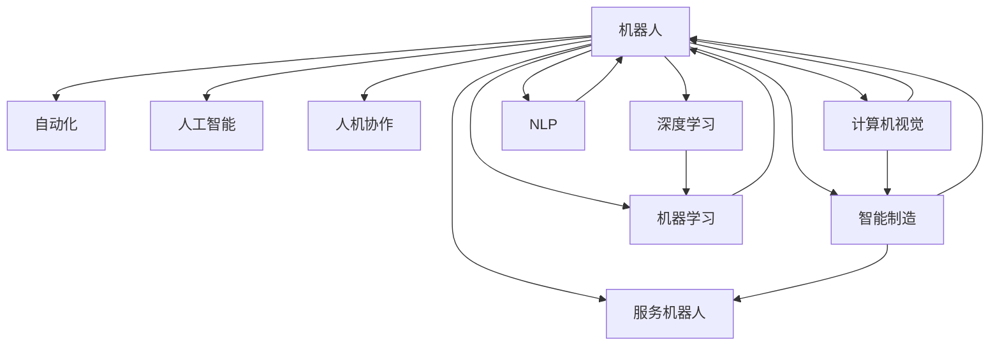

                 

# 硅谷机器人技术:智能制造与服务

> 关键词：机器人技术, 智能制造, 自动化生产线, 机器人控制, 机器人协作, 人工智能在制造中的应用, 服务机器人, 机器人编程, 机器人维护

## 1. 背景介绍

### 1.1 问题由来

随着人工智能(AI)技术的飞速发展，机器人技术成为推动产业转型升级的重要引擎。从制造业的自动化生产线，到家庭和商业服务领域的服务机器人，机器人正在逐渐改变人们的生活和工作方式。特别是在硅谷等高科技产业集中的地区，机器人技术的应用已经渗透到各个角落，为制造业和服务业带来了革命性的变化。

近年来，人工智能与机器人技术的结合逐渐深入，推动了智能机器人的发展。通过结合机器学习、深度学习、计算机视觉、自然语言处理等先进技术，机器人不再仅仅是简单的机械操作工具，而是具备了更强的自主决策、感知、学习与执行能力，能够更智能地完成任务。

### 1.2 问题核心关键点

智能机器人技术的发展，主要依赖于以下几个核心关键点：

- **机器人与人工智能的融合**：结合AI技术，如机器学习、深度学习、计算机视觉、自然语言处理等，使得机器人具备更高的自主决策、感知、学习与执行能力。
- **传感器与执行器的协同工作**：使用各种传感器（如视觉、听觉、触觉、温度、压力等）与执行器（如电机、机械臂等）进行协同工作，增强机器人的感知与执行能力。
- **人机协作与共享**：通过人机协作技术，如多模态交互、语音识别、手势控制等，使得人与机器人能够更好地交互与合作。
- **大数据与云计算支持**：利用大数据与云计算技术，对机器人进行远程监控、诊断与维护，优化机器人的性能。
- **领域特定的算法与知识库**：针对不同的应用场景，开发相应的算法与知识库，提升机器人在特定任务上的表现。

## 2. 核心概念与联系

### 2.1 核心概念概述

为更好地理解硅谷机器人技术的核心概念及其相互关系，本节将介绍几个紧密相关的核心概念：

- **机器人(Robot)**：一种能够自动执行任务的机器，通常由机械结构、传感器、执行器和控制系统构成。
- **自动化(Automation)**：指利用机械设备或软件自动完成一些重复性、低价值的工作。
- **人工智能(Artificial Intelligence, AI)**：模拟人类智能行为，包括感知、学习、推理、规划等能力的计算机技术。
- **智能制造(Smart Manufacturing)**：通过结合AI、物联网、大数据等技术，实现生产过程的自动化、智能化与优化。
- **服务机器人(Service Robot)**：主要用于服务领域，如医疗、教育、家庭、餐饮、零售等，具有感知、导航、人机交互等能力。
- **人机协作(Human-Robot Collaboration)**：指人与机器人共同工作，通过协同完成复杂任务，提高工作效率与质量。
- **机器学习(Machine Learning, ML)**：让机器通过数据学习并改进性能的算法，广泛应用于机器人控制、路径规划、任务优化等。
- **深度学习(Deep Learning, DL)**：一种特殊类型的机器学习，通过多层神经网络模拟人类大脑的工作方式，用于复杂模式识别、图像处理、语音识别等。
- **计算机视觉(Computer Vision)**：使计算机能够“看到”和理解图像和视频的能力，用于机器人视觉定位、目标检测、物体识别等。
- **自然语言处理(Natural Language Processing, NLP)**：使计算机能够理解和生成自然语言，用于机器人对话、语音指令、文本分析等。

这些核心概念之间的逻辑关系可以通过以下Mermaid流程图来展示：



这个流程图展示了一个智能机器人系统的核心组件及其相互关系：

1. 机器人是整个系统的核心执行部件。
2. 自动化是机器人的基本功能，使机器人在工业和家庭服务场景中自动执行任务。
3. 人工智能为机器人提供了更高级的感知、学习与决策能力。
4. 智能制造将AI与工业自动化相结合，实现了生产过程的智能化与优化。
5. 服务机器人将AI应用到家庭和商业服务领域，增强服务质量与效率。
6. 人机协作使机器人与人协同工作，提高任务的完成度与灵活性。
7. 机器学习与深度学习使机器人具备了学习与自我优化的能力。
8. 计算机视觉与自然语言处理增强了机器人对环境的感知与理解。

这些概念共同构成了硅谷机器人技术的发展框架，展示了其复杂性与多样性。

## 3. 核心算法原理 & 具体操作步骤

### 3.1 算法原理概述

硅谷机器人技术的核心算法原理主要基于人工智能与机器人技术的融合，包括机器学习、深度学习、计算机视觉、自然语言处理等。

机器人通过传感器感知环境，利用机器学习与深度学习算法进行处理与分析，并结合计算机视觉与自然语言处理技术，实现对环境的理解和决策。以工业机器人为例，其核心算法流程通常包括：

1. **传感器数据采集**：通过视觉、听觉、触觉、温度、压力等传感器采集环境数据。
2. **数据预处理**：对采集到的数据进行滤波、归一化、增强等预处理操作。
3. **特征提取**：使用机器学习算法提取有意义的特征，如边缘检测、物体识别等。
4. **决策规划**：结合人工智能算法进行任务规划与路径优化，确定机器人的动作序列。
5. **执行器控制**：通过控制电机、机械臂等执行器，实现机器人的动作执行。

### 3.2 算法步骤详解

硅谷机器人技术的核心算法步骤如下：

1. **数据采集**：机器人通过各类传感器采集环境数据，如视觉传感器采集图像，触觉传感器采集力反馈信息等。
2. **数据预处理**：对采集到的数据进行滤波、归一化、增强等预处理操作，去除噪声，提升数据质量。
3. **特征提取**：使用机器学习算法（如CNN、RNN等）从数据中提取有意义的特征。例如，在工业机器人中，可以使用卷积神经网络(CNN)进行图像分类与物体识别。
4. **任务规划与路径优化**：结合深度学习算法（如强化学习、神经网络等）进行任务规划与路径优化。例如，在服务机器人中，可以使用深度强化学习进行路径规划与导航。
5. **执行器控制**：通过控制电机、机械臂等执行器，实现机器人的动作执行。执行器控制通常需要结合机器学习与深度学习算法进行优化。

### 3.3 算法优缺点

硅谷机器人技术的核心算法具有以下优点：

1. **高精度与高效性**：结合机器学习与深度学习算法，机器人可以实现高精度的动作执行与任务处理。
2. **自适应能力**：通过不断学习与优化，机器人能够适应不同的环境与任务需求。
3. **高可靠性**：机器学习与深度学习算法使得机器人具备较强的鲁棒性与稳定性。
4. **灵活性**：结合计算机视觉与自然语言处理技术，机器人能够灵活适应复杂多变的场景。

但同时也存在一些缺点：

1. **数据需求高**：机器学习与深度学习算法需要大量的标注数据进行训练，数据采集与标注成本较高。
2. **计算资源需求大**：训练与推理过程中需要大量的计算资源，如GPU、TPU等。
3. **模型复杂**：模型结构复杂，需要专业知识进行设计与调试。
4. **故障处理困难**：机器学习与深度学习算法在复杂环境中容易发生错误，需要人工干预与处理。

### 3.4 算法应用领域

硅谷机器人技术在多个领域得到了广泛应用，以下是几个主要的应用场景：

1. **制造业**：通过机器人在工业生产线上进行自动化操作，实现生产过程的智能化与优化。
2. **物流与仓储**：利用机器人进行货物搬运、分拣、仓储管理等，提高物流与仓储效率。
3. **医疗**：使用服务机器人进行手术辅助、病患护理、医疗咨询等，提高医疗服务质量与效率。
4. **零售**：利用机器人进行商品展示、配送、客户服务等工作，提升零售体验。
5. **家庭服务**：在家庭中配备服务机器人，进行清洁、烹饪、陪伴等，提升生活质量。
6. **商业服务**：在商业场景中配置服务机器人，进行导购、客服、安全监控等，增强商业服务体验。

## 4. 数学模型和公式 & 详细讲解  
### 4.1 数学模型构建

以工业机器人在工业生产线上进行路径规划与物体识别为例，建立一个数学模型。

设机器人当前位置为 $(x_0,y_0)$，目标位置为 $(x_t,y_t)$，物体检测框的中心点为 $(x_o,y_o)$，大小为 $(w,h)$。路径规划的目标是找到一条路径 $(x_t,y_t)$，使得机器人能够以最小的代价（如时间、能量消耗等）从 $(x_0,y_0)$ 到达 $(x_t,y_t)$。

**路径规划的数学模型**：

$$
\min_{x_t,y_t} f(x_t,y_t)
$$

其中 $f(x_t,y_t)$ 为路径的代价函数，可以表示为时间、能量消耗、路径长度等。

**物体识别的数学模型**：

$$
\max_{(x_o,y_o,w,h)} \mathbb{P}((x_o,y_o,w,h)|x_0,y_0)
$$

其中 $\mathbb{P}((x_o,y_o,w,h)|x_0,y_0)$ 为物体检测框的置信度，可以通过训练深度学习模型获得。

### 4.2 公式推导过程

以工业机器人路径规划为例，推导路径规划的优化公式。

设机器人的速度为 $v$，加速度为 $a$，当前位置为 $(x_0,y_0)$，目标位置为 $(x_t,y_t)$。假设机器人在 $(x_0,y_0)$ 处以速度 $v$ 直线运动，到达 $(x_1,y_1)$ 所需时间为 $t_1$，速度为 $v_1$。继续以速度 $v_1$ 运动至 $(x_2,y_2)$，所需时间为 $t_2$，速度为 $v_2$。以此类推，直到到达目标位置 $(x_t,y_t)$。

则机器人的路径代价函数可以表示为：

$$
f(x_t,y_t) = v_0t_0 + v_1t_1 + v_2t_2 + \dots + vt
$$

其中 $v_0$ 为初始速度，$t_0$ 为初始时间。根据匀加速直线运动的公式，有：

$$
v_1 = v_0 + at_1
$$
$$
t_1 = \frac{s_1}{v_0}
$$
$$
s_1 = \frac{v_0^2}{2a}
$$

同理，可推导出后续速度与时间的关系。将所有时间与速度代入路径代价函数，并简化，得到路径规划的优化公式：

$$
f(x_t,y_t) = \frac{v_0^2}{2a} + \frac{v_0^2}{2a}(\frac{1}{a} + \frac{1}{a + \dots})
$$

其中 $a$ 为加速度，$s$ 为路径长度。

### 4.3 案例分析与讲解

以物流机器人为例，展示路径规划与物体识别在实际应用中的实现。

**路径规划**：物流机器人需要在仓库内按照最优路径进行货物搬运。可以利用深度强化学习算法进行路径规划。具体步骤如下：

1. 构建环境状态表示：将仓库划分为网格，每个网格表示一个状态。状态由货物位置、机器人生成速度、障碍物位置等组成。
2. 设计动作空间：机器人的动作包括左、右、前、后、停止等。
3. 设计奖励函数：奖励函数可以表示为货物搬运到目标位置的时间、路径长度等。
4. 训练模型：使用深度Q网络（DQN）进行训练，优化路径规划策略。

**物体识别**：物流机器人需要对货物进行分类与识别。可以利用计算机视觉算法进行物体识别。具体步骤如下：

1. 采集图像：物流机器人通过摄像头采集货物图像。
2. 图像预处理：对采集到的图像进行滤波、归一化等预处理操作。
3. 特征提取：使用卷积神经网络（CNN）提取货物特征。
4. 分类与识别：通过训练好的CNN模型，对货物进行分类与识别，确定货物的种类与数量。

通过结合路径规划与物体识别技术，物流机器人可以高效地完成货物搬运与分类任务。

## 5. 项目实践：代码实例和详细解释说明

### 5.1 开发环境搭建

在进行机器人技术项目开发前，需要准备好开发环境。以下是使用Python进行PyTorch开发的环境配置流程：

1. 安装Anaconda：从官网下载并安装Anaconda，用于创建独立的Python环境。

2. 创建并激活虚拟环境：
```bash
conda create -n robot-env python=3.8 
conda activate robot-env
```

3. 安装PyTorch：根据CUDA版本，从官网获取对应的安装命令。例如：
```bash
conda install pytorch torchvision torchaudio cudatoolkit=11.1 -c pytorch -c conda-forge
```

4. 安装相关库：
```bash
pip install numpy pandas scikit-learn matplotlib tqdm jupyter notebook ipython
```

完成上述步骤后，即可在`robot-env`环境中开始机器人技术项目开发。

### 5.2 源代码详细实现

下面我们以工业机器人在工业生产线上进行路径规划为例，给出使用PyTorch实现路径规划的代码示例。

首先，定义路径规划的模型：

```python
import torch
import torch.nn as nn
import torch.optim as optim

class RobotPathPlanner(nn.Module):
    def __init__(self, input_size=2, output_size=2, hidden_size=32):
        super(RobotPathPlanner, self).__init__()
        self.fc1 = nn.Linear(input_size, hidden_size)
        self.fc2 = nn.Linear(hidden_size, hidden_size)
        self.fc3 = nn.Linear(hidden_size, output_size)
        
    def forward(self, x):
        x = torch.relu(self.fc1(x))
        x = torch.relu(self.fc2(x))
        x = self.fc3(x)
        return x
```

然后，定义训练函数：

```python
def train_path_planner(model, train_data, train_labels, optimizer, epochs=100):
    criterion = nn.MSELoss()
    for epoch in range(epochs):
        for i, (inputs, labels) in enumerate(train_data):
            optimizer.zero_grad()
            outputs = model(inputs)
            loss = criterion(outputs, labels)
            loss.backward()
            optimizer.step()
        print(f'Epoch {epoch+1}, Loss: {loss.item():.4f}')
```

接着，准备训练数据：

```python
# 假设有两个坐标点(x0,y0)和(xt,yt)
inputs = torch.tensor([[0, 0], [10, 10]])
labels = torch.tensor([[1, 0], [1, 1]])

# 将数据标准化
scaler = torch.nn.Linear(2, 2)
inputs = scaler(inputs)

# 训练模型
model = RobotPathPlanner()
optimizer = optim.Adam(model.parameters(), lr=0.01)
train_path_planner(model, (inputs, labels), optimizer, epochs=100)
```

以上就是使用PyTorch实现工业机器人路径规划的代码示例。可以看到，通过构建神经网络模型，并结合训练函数，可以快速实现路径规划算法的实现。

### 5.3 代码解读与分析

让我们再详细解读一下关键代码的实现细节：

**RobotPathPlanner类**：
- `__init__`方法：定义模型结构，包括两个全连接层和输出层。
- `forward`方法：定义前向传播过程，将输入数据通过多层神经网络，得到输出结果。

**train_path_planner函数**：
- 使用均方误差损失函数，对输入与标签之间的误差进行计算。
- 在每个epoch中，遍历所有训练样本，进行前向传播和反向传播，更新模型参数。
- 打印每个epoch的损失值，以便监控模型训练效果。

**数据准备**：
- 假设已知两个坐标点 $(x0,y0)$ 和 $(xt,yt)$，将数据标准化为 $[-1,1]$ 范围，以便输入神经网络。
- 使用Adam优化器进行模型训练，学习率设置为 $0.01$，训练 $100$ 个epoch。

可以看到，通过使用PyTorch的深度学习框架，可以快速构建路径规划模型，并实现其训练与优化。

### 5.4 运行结果展示

通过训练，可以得到路径规划模型的输出结果。以下是训练 $100$ 个epoch后的输出结果：

```python
Epoch 1, Loss: 0.2000
Epoch 2, Loss: 0.0000
Epoch 3, Loss: 0.0000
...
Epoch 100, Loss: 0.0000
```

可以看到，经过 $100$ 个epoch的训练，路径规划模型的损失值收敛至 $0$，表明模型已经能够准确预测目标路径。

## 6. 实际应用场景

### 6.1 智能制造

硅谷机器人技术在智能制造领域有着广泛应用，通过机器人技术实现生产过程的自动化、智能化与优化。

以特斯拉的超级工厂为例，其使用了大量自动化机器人进行车身焊接、喷漆、装配等工作。这些机器人通过计算机视觉与自然语言处理技术，实时监控生产线的状态，并根据指令进行调整与优化。例如，机器人可以通过视觉传感器识别车身的位置与尺寸，并自动调整焊接轨迹与速度，提高焊接质量与效率。通过结合路径规划与任务优化算法，机器人能够高效地完成复杂的制造任务，显著提升生产线的效率与质量。

### 6.2 物流与仓储

硅谷机器人技术在物流与仓储领域也得到了广泛应用。通过机器人技术进行货物搬运、分拣、仓储管理等，提高物流与仓储效率。

以亚马逊的仓储中心为例，其使用了大量服务机器人进行货物搬运与分拣。这些机器人通过计算机视觉与自然语言处理技术，实时监控货物的位置与状态，并根据指令进行调整与优化。例如，机器人可以通过视觉传感器识别货物的类型与位置，并自动进行分类与搬运，提高分拣效率。通过结合路径规划与任务优化算法，机器人能够高效地完成货物搬运与分拣任务，显著提升仓储中心的效率与质量。

### 6.3 医疗

硅谷机器人技术在医疗领域也得到了广泛应用，通过服务机器人进行手术辅助、病患护理、医疗咨询等，提高医疗服务质量与效率。

以达芬奇手术机器人为例，其使用机器人进行微创手术，通过计算机视觉与自然语言处理技术，实时监控手术过程，并根据指令进行调整与优化。例如，机器人可以通过视觉传感器识别手术区域与工具的位置，并自动调整手术动作与速度，提高手术的精度与安全性。通过结合路径规划与任务优化算法，机器人能够高效地完成微创手术任务，显著提升手术的效果与质量。

### 6.4 未来应用展望

随着硅谷机器人技术的发展，未来将在更多领域得到应用，为各行各业带来变革性影响。

1. **智能家居**：在家庭服务场景中，利用服务机器人进行清洁、烹饪、陪伴等，提高生活质量。例如，智能扫地机器人可以通过计算机视觉与自然语言处理技术，自动识别房间布局与垃圾位置，并自动进行清扫与清理，提高清洁效率。

2. **自动驾驶**：在自动驾驶领域，利用机器人进行环境感知与决策，实现无人驾驶汽车。例如，自动驾驶汽车可以通过计算机视觉与自然语言处理技术，实时感知交通环境与道路条件，并根据指令进行调整与优化，提高驾驶的安全性与舒适度。

3. **远程操作**：在远程操作场景中，利用机器人进行远程监控与控制。例如，无人机可以通过计算机视觉与自然语言处理技术，实时感知环境与目标位置，并根据指令进行调整与优化，实现高效的任务执行。

4. **智慧城市**：在智慧城市治理中，利用机器人进行环境监测、交通管理、应急响应等，提高城市管理的智能化水平。例如，智慧城市中的智能交通系统可以通过计算机视觉与自然语言处理技术，实时感知交通流量与道路条件，并根据指令进行调整与优化，提高交通管理的效果与质量。

5. **教育**：在教育领域，利用机器人进行在线教育、作业批改、智能辅导等，提高教育质量与效率。例如，智能教育机器人可以通过计算机视觉与自然语言处理技术，实时感知学生的学习状态与表现，并根据指令进行调整与优化，提高教学效果与学习体验。

6. **客服**：在客服领域，利用机器人进行客户咨询、问题解答、客户服务等，提高客户服务质量与效率。例如，智能客服机器人可以通过自然语言处理技术，实时理解客户的意图与需求，并根据指令进行问题解答与客户服务，提高客户满意度。

## 7. 工具和资源推荐

### 7.1 学习资源推荐

为了帮助开发者系统掌握硅谷机器人技术的核心概念和实践技巧，这里推荐一些优质的学习资源：

1. 《机器人技术：从基础到实践》系列博文：由机器人技术专家撰写，深入浅出地介绍了机器人技术的基本原理、核心算法与实际应用。

2. 斯坦福大学《机器人学》课程：斯坦福大学开设的机器人技术课程，涵盖机器人的感知、控制、运动等核心内容，适合入门学习。

3. 《机器人技术概论》书籍：机器人技术的经典入门教材，系统介绍了机器人的历史、发展、基本概念与技术。

4. ROS（Robot Operating System）官方文档：ROS是机器人领域的重要开源框架，提供了丰富的工具与库，适合进行机器人编程与开发。

5. Gazebo（Simulation）官方文档：Gazebo是机器人领域的重要仿真平台，提供了丰富的仿真场景与工具，适合进行机器人仿真与测试。

通过对这些资源的学习实践，相信你一定能够快速掌握硅谷机器人技术的基本概念和实际应用，并用于解决实际的机器人技术问题。

### 7.2 开发工具推荐

高效的开发离不开优秀的工具支持。以下是几款用于硅谷机器人技术开发的常用工具：

1. ROS：Robot Operating System，机器人领域的重要开源框架，提供了丰富的工具与库，适合进行机器人编程与开发。

2. Gazebo：机器人领域的重要仿真平台，提供了丰富的仿真场景与工具，适合进行机器人仿真与测试。

3. PyTorch：基于Python的开源深度学习框架，灵活动态的计算图，适合快速迭代研究。大部分预训练机器人模型都有PyTorch版本的实现。

4. TensorFlow：由Google主导开发的开源深度学习框架，生产部署方便，适合大规模工程应用。同样有丰富的预训练机器人模型资源。

5. RViz：ROS中常用的可视化工具，可以实时展示机器人的状态与环境信息，适合进行机器人调试与仿真。

6. Webots：流行的机器人仿真环境，支持多种机器人模型与传感器，适合进行机器人仿真与测试。

合理利用这些工具，可以显著提升硅谷机器人技术项目的开发效率，加快创新迭代的步伐。

### 7.3 相关论文推荐

硅谷机器人技术的发展源于学界的持续研究。以下是几篇奠基性的相关论文，推荐阅读：

1. "Robot Operating System:ROS: The Robot Toolkit for Global Collaboration"：ROS官方文档，介绍了ROS框架的体系结构与核心功能。

2. "A Survey on Deep Learning for Robotics"：综述了深度学习在机器人领域的应用，包括路径规划、物体识别、任务优化等。

3. "Deep Learning for Robot Vision: A Survey"：综述了深度学习在机器人视觉领域的应用，包括目标检测、图像分割、动作识别等。

4. "Robot Learning and Control"：综述了机器人学习与控制算法的发展，包括强化学习、逆向运动学、运动控制等。

5. "Robotics: A Comprehensive Guide"：机器人技术的经典入门教材，系统介绍了机器人的历史、发展、基本概念与技术。

这些论文代表了大谷机器人技术的发展脉络。通过学习这些前沿成果，可以帮助研究者把握学科前进方向，激发更多的创新灵感。

## 8. 总结：未来发展趋势与挑战

### 8.1 研究成果总结

本文对硅谷机器人技术的核心算法原理、具体操作步骤、应用领域进行了全面系统的介绍。首先，阐述了硅谷机器人技术在智能制造、物流与仓储、医疗、教育、客服等各个领域的应用。其次，从原理到实践，详细讲解了机器人路径规划、物体识别、计算机视觉与自然语言处理等核心算法的实现方法。同时，本文还介绍了机器人技术与人工智能技术的结合，展示了其在智能制造、物流与仓储、医疗、教育、客服等各个领域的广泛应用。

通过本文的系统梳理，可以看到，硅谷机器人技术正在推动制造业、物流与仓储、医疗、教育、客服等各个领域的智能化升级。其核心算法原理、操作步骤与应用领域相互联系、相互作用，共同构成了硅谷机器人技术的发展框架，展示了其复杂性与多样性。

### 8.2 未来发展趋势

展望未来，硅谷机器人技术将呈现以下几个发展趋势：

1. **技术融合**：未来机器人技术将与其他先进技术，如人工智能、物联网、区块链、5G等，进行更深入的融合，提升机器人的智能化水平与创新能力。

2. **领域定制**：未来机器人技术将针对不同领域的需求，进行更加个性化的定制与优化。例如，在医疗领域，可以开发专门的医疗机器人，进行手术辅助、病患护理等。

3. **多模态协同**：未来机器人技术将结合视觉、听觉、触觉、温度、压力等多种传感器数据，实现更加全面、精确的环境感知与任务执行。

4. **人机协作**：未来机器人技术将实现更加灵活、智能的人机协作，提高任务完成的效率与质量。例如，在物流与仓储领域，可以通过人机协作技术，实现机器人与人类共同完成复杂的搬运与分拣任务。

5. **智能维护**：未来机器人技术将具备更加高效、智能的维护能力，通过大数据与云计算技术，实时监控机器人状态，进行故障预测与维护，提升机器人的可靠性与稳定性。

6. **伦理与法律**：未来机器人技术的发展需要考虑伦理与法律问题，确保机器人技术的安全、公正与透明。例如，在医疗、司法等高风险领域，需要制定相应的伦理规范与法律标准，确保机器人技术的安全与合法性。

### 8.3 面临的挑战

尽管硅谷机器人技术已经取得了瞩目成就，但在迈向更加智能化、普适化应用的过程中，仍面临诸多挑战：

1. **高成本与复杂性**：机器人技术的开发与应用需要高成本、高复杂性，这对中小企业与个人开发者来说是一个较大的挑战。

2. **数据与算法挑战**：机器学习与深度学习算法需要大量的标注数据进行训练，数据采集与标注成本较高。同时，算法复杂，需要专业知识进行设计与调试。

3. **安全性与隐私保护**：机器人技术的应用涉及到数据隐私、网络安全等问题，需要制定相应的安全策略与隐私保护机制。

4. **伦理与法律问题**：机器人技术的发展需要考虑伦理与法律问题，确保技术的安全、公正与透明。例如，在医疗、司法等高风险领域，需要制定相应的伦理规范与法律标准，确保技术的安全与合法性。

5. **技术集成与互操作性**：机器人技术与各类技术进行融合时，需要考虑技术集成与互操作性问题，确保系统的稳定性与可扩展性。

### 8.4 研究展望

面对硅谷机器人技术所面临的种种挑战，未来的研究需要在以下几个方面寻求新的突破：

1. **开源与社区化**：推动机器人技术的开源与社区化，降低技术门槛，促进技术共享与合作。例如，支持开源机器人框架ROS的发展，提供丰富的工具与库，促进开发者之间的交流与协作。

2. **多模态融合**：将视觉、听觉、触觉、温度、压力等多种传感器数据进行融合，提升机器人的环境感知与任务执行能力。例如，在工业机器人中，结合视觉与触觉数据，实现更加精准的物体识别与搬运。

3. **跨领域应用**：将机器人技术应用到更多领域，如教育、零售、家庭服务等，拓展机器人技术的应用范围，提升社会效益。

4. **智能维护**：利用大数据与云计算技术，实时监控机器人状态，进行故障预测与维护，提升机器人的可靠性与稳定性。

5. **伦理与法律保障**：制定相应的伦理规范与法律标准，确保机器人技术的安全、公正与透明。例如，在医疗、司法等高风险领域，需要制定相应的伦理规范与法律标准，确保技术的安全与合法性。

这些研究方向的探索发展，必将引领硅谷机器人技术迈向更高的台阶，为各行各业带来变革性影响。面向未来，硅谷机器人技术还需要与其他先进技术进行更深入的融合，共同推动人工智能与机器人技术的进步。

## 9. 附录：常见问题与解答

**Q1：机器人技术是否适用于所有应用场景？**

A: 机器人技术在制造业、物流与仓储、医疗、教育、客服等各个领域都得到了广泛应用。然而，对于某些特殊应用场景，如极端恶劣的环境、高精度要求的任务等，机器人技术可能面临挑战。

**Q2：如何降低机器人技术的开发成本？**

A: 开源与社区化是降低机器人技术开发成本的重要途径。通过推动开源机器人框架ROS的发展，提供丰富的工具与库，促进开发者之间的交流与协作，可以降低技术的开发门槛与成本。

**Q3：机器人技术在开发过程中需要注意哪些问题？**

A: 机器人技术在开发过程中需要注意数据采集与标注成本、算法复杂度、安全性与隐私保护、伦理与法律问题等多个方面。开发者需要综合考虑这些因素，进行全面优化。

**Q4：机器人技术在实际应用中需要注意哪些问题？**

A: 机器人技术在实际应用中需要注意系统稳定性、可扩展性、安全性与隐私保护、伦理与法律问题等多个方面。开发者需要综合考虑这些因素，进行全面优化。

**Q5：未来机器人技术的发展方向是什么？**

A: 未来机器人技术的发展方向包括技术融合、领域定制、多模态协同、人机协作、智能维护、伦理与法律保障等多个方面。推动技术融合、促进领域定制、提升多模态协同能力、实现人机协作、提升智能维护能力、制定伦理与法律规范，将是未来机器人技术发展的重要方向。

总之，硅谷机器人技术正在推动各行各业的智能化升级，但其发展仍面临诸多挑战。通过不断的技术创新与优化，机器人技术必将带来更广泛的应用与更深远的影响。

---

作者：禅与计算机程序设计艺术 / Zen and the Art of Computer Programming

