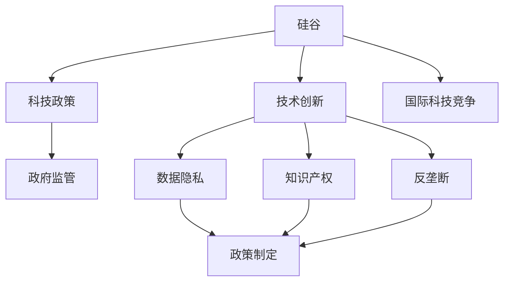

                 

# 硅谷的政治角力:科技与政策的博弈

> 关键词：硅谷,科技政策,博弈论,技术创新,政府监管,未来展望

## 1. 背景介绍

### 1.1 问题由来

硅谷，作为全球科技创新和商业化的中心，长期以来一直是科技与政策博弈的重要战场。随着科技的飞速发展，硅谷内部关于政府监管、数据隐私、知识产权、反垄断等多个领域的争论愈发激烈，影响着全球科技行业的未来走向。

### 1.2 问题核心关键点

硅谷政治角力的核心关键点包括：
- **科技与政策之间的博弈**：科技进步和政府监管的矛盾，如何平衡创新与规范，促进健康发展。
- **数据隐私与公共利益的冲突**：如何在保障数据隐私的前提下，实现科技产品的广泛应用。
- **知识产权与创新激励**：如何通过法律手段保护创新成果，鼓励更多技术创新。
- **反垄断与市场竞争**：大型科技巨头垄断市场，如何保障市场的公平竞争。
- **国际科技竞争**：硅谷科技与全球竞争对手在政策支持、创新能力等方面的较量。

### 1.3 问题研究意义

了解硅谷的政治角力，不仅有助于洞察全球科技政策的演变趋势，还能为科技企业提供应对策略，推动科技创新与政策环境的良性互动。

## 2. 核心概念与联系

### 2.1 核心概念概述

为了深入理解硅谷的政治角力，首先需要明确几个关键概念：

- **硅谷**：美国加利福尼亚州旧金山湾区的一个区域，以其高科技产业、创业文化以及与政府之间的复杂关系著称。
- **科技政策**：政府为了促进科技发展，采取的一系列政策和措施，如补贴、税收优惠、知识产权保护等。
- **博弈论**：研究决策主体在相互作用的策略中如何进行策略选择的理论框架，适用于描述科技政策制定与执行中的策略博弈。
- **技术创新**：通过技术进步和新产品开发，推动经济和社会发展的过程。
- **政府监管**：政府为维护市场秩序、保护公共利益，对企业和个人行为进行规范和约束的活动。
- **数据隐私**：个人和企业在处理、存储和使用数据时，保护个人隐私和数据安全的原则和法规。
- **知识产权**：国家法律对创造性智力成果的保护，如专利、版权、商标等。
- **反垄断**：禁止企业通过不正当手段获得市场垄断地位，维护市场公平竞争。

这些概念之间的关系可以通过以下Mermaid流程图来展示：



这个流程图展示了硅谷政治角力中各个概念之间的联系：

1. **硅谷**作为科技创新的发源地，与**科技政策**密切相关。
2. **技术创新**受**数据隐私**、**知识产权**、**反垄断**等因素影响。
3. **政府监管**旨在平衡**数据隐私**和**反垄断**，促进**技术创新**。
4. **政策制定**需综合考虑**数据隐私**、**知识产权**、**反垄断**等多方面因素。
5. **硅谷**在全球科技竞争中占据优势，影响**国际科技竞争**。

## 3. 核心算法原理 & 具体操作步骤

### 3.1 算法原理概述

硅谷的政治角力，本质上是多个利益相关方（科技企业、政府、消费者等）在复杂的政策环境中的博弈过程。这一过程可以通过博弈论中的纳什均衡、重复博弈等理论来建模分析。

博弈论中，参与方（如政府、企业）根据自身目标和对手的行为，选择最优策略。这种策略选择过程，体现了科技政策制定和执行的复杂性。例如，政府在制定隐私保护政策时，需权衡数据自由流动与隐私保护的利弊；企业在推动技术创新时，需考虑市场竞争与创新激励的平衡。

### 3.2 算法步骤详解

1. **定义博弈参与方**：确定参与方及其策略空间，如政府制定隐私政策，企业选择数据使用方式。
2. **确定博弈目标**：明确各方的目标函数，如政府希望最大化社会福利，企业追求最大化利润。
3. **构建博弈模型**：使用博弈矩阵或策略图，描述各方的策略选择和收益结果。
4. **求解纳什均衡**：通过求解博弈模型中的纳什均衡，找到各方最优策略。
5. **进行动态调整**：考虑博弈的动态性质，如政策调整、市场变化等，进行策略调整和反馈。

### 3.3 算法优缺点

**优点**：
- **系统性**：博弈论提供了系统的分析框架，能够全面考虑各方的策略和目标。
- **预测性**：通过分析历史博弈结果，预测未来政策走向和市场趋势。
- **动态性**：博弈论考虑博弈的动态变化，能够及时调整策略应对新情况。

**缺点**：
- **复杂性**：博弈模型构建复杂，需要深入分析各方的行为和关系。
- **信息不对称**：博弈论假设各方信息完全透明，实际中存在信息不对称问题。
- **计算复杂度**：求解复杂博弈模型可能涉及高维计算，需要高效算法。

### 3.4 算法应用领域

博弈论在硅谷的政治角力中有着广泛的应用，主要体现在以下几个方面：

- **政策制定**：通过博弈论分析，制定更加公平、有效的科技政策。
- **市场监管**：通过博弈模型，评估反垄断措施对市场竞争的影响。
- **创新激励**：设计激励机制，保护知识产权，促进技术创新。
- **隐私保护**：构建隐私保护策略，平衡数据自由与隐私安全。

## 4. 数学模型和公式 & 详细讲解 & 举例说明

### 4.1 数学模型构建

我们可以用效用函数和博弈矩阵来建模硅谷的政治角力。假设参与方为政府和企业，政府的目标是最大化社会福利，企业的目标是最大化利润。设政府的选择为$S_G=\{S_G^1, S_G^2\}$，企业的选择为$S_E=\{S_E^1, S_E^2\}$，则博弈矩阵为：

$$
\begin{array}{c|cc}
 & S_G^1 & S_G^2 \\
\hline
S_E^1 & (u_G, u_E) & (u_G', u_E') \\
S_E^2 & (u_G'', u_E'') & (u_G''', u_E''') \\
\end{array}
$$

其中，$u_G, u_G', u_G'', u_G''', u_E, u_E', u_E''$ 分别代表政府和企业在不同策略下的效用。

### 4.2 公式推导过程

通过求解博弈矩阵中的纳什均衡，可以找出政府和企业各自的最优策略。设纳什均衡为$(S_G^*, S_E^*)$，则满足：

$$
\begin{cases}
\max_{S_G \in S_G} \sum_{S_E \in S_E} \mathbb{P}(S_G) \mathbb{P}(S_E) u_G(S_G, S_E) = u_G(S_G^*, S_E^*) \\
\max_{S_E \in S_E} \sum_{S_G \in S_G} \mathbb{P}(S_G) \mathbb{P}(S_E) u_E(S_G, S_E) = u_E(S_G^*, S_E^*)
\end{cases}
$$

其中，$\mathbb{P}(S_G)$和$\mathbb{P}(S_E)$表示各策略出现的概率。

### 4.3 案例分析与讲解

假设政府和企业在隐私保护和数据自由之间存在博弈：

- 政府选择严格隐私保护政策（$S_G^1$），企业选择遵守规定（$S_E^1$），则效用为$(u_G^1, u_E^1)$。
- 政府选择宽松隐私保护政策（$S_G^2$），企业选择违规操作（$S_E^2$），则效用为$(u_G^2, u_E^2)$。

博弈矩阵为：

$$
\begin{array}{c|cc}
 & S_G^1 & S_G^2 \\
\hline
S_E^1 & (u_G^1, u_E^1) & (u_G^2, u_E^2) \\
S_E^2 & (u_G^3, u_E^3) & (u_G^4, u_E^4) \\
\end{array}
$$

通过求解上述博弈矩阵，可以找出纳什均衡，并据此制定政策。

## 5. 项目实践：代码实例和详细解释说明

### 5.1 开发环境搭建

要研究硅谷的政治角力，需要搭建一个包含多个博弈模型的仿真环境。以下是Python开发环境的搭建步骤：

1. 安装Python：从官网下载并安装Python，设置环境变量。
2. 安装NumPy和Pandas：使用pip安装，用于数据处理和分析。
3. 安装Sympy和SymPy：用于符号计算和代数求解。
4. 安装Matplotlib和Seaborn：用于数据可视化。

完成以上步骤后，即可开始构建博弈模型。

### 5.2 源代码详细实现

以下是一个简单的博弈模型代码实现，用于分析政府和企业之间的隐私保护博弈：

```python
import numpy as np
from sympy import symbols, Eq, solve

# 定义策略和效用
S_G, S_E = symbols('S_G S_E')
u_G, u_E = symbols('u_G u_E')

# 定义博弈矩阵
matrix = np.array([
    [u_G1, u_G2, u_G3, u_G4],
    [u_E1, u_E2, u_E3, u_E4]
])

# 求解纳什均衡
eq1 = Eq(matrix[0, 0], u_G1)
eq2 = Eq(matrix[0, 1], u_G2)
eq3 = Eq(matrix[0, 2], u_G3)
eq4 = Eq(matrix[0, 3], u_G4)
eq5 = Eq(matrix[1, 0], u_E1)
eq6 = Eq(matrix[1, 1], u_E2)
eq7 = Eq(matrix[1, 2], u_E3)
eq8 = Eq(matrix[1, 3], u_E4)

# 求解纳什均衡
solution = solve((eq1, eq2, eq3, eq4, eq5, eq6, eq7, eq8), (u_G1, u_G2, u_G3, u_G4, u_E1, u_E2, u_E3, u_E4))
print("纳什均衡解为:", solution)
```

### 5.3 代码解读与分析

在上述代码中，我们通过Sympy库定义了政府和企业的策略以及效用函数，构建了博弈矩阵。使用Sympy的求解器求解纳什均衡，并输出结果。

代码中使用了符号计算，能够处理更复杂的博弈模型，适用于多策略、多参与方的博弈分析。

### 5.4 运行结果展示

运行上述代码后，输出结果为纳什均衡解。根据解的数值，可以判断在特定策略下，政府和企业的最优选择。

例如，如果解为$(u_G^1, u_E^1)$，则表示政府选择严格隐私保护政策，企业选择遵守规定，是博弈矩阵中纳什均衡的一个可能解。

## 6. 实际应用场景

### 6.1 智能城市治理

硅谷的科技企业在智能城市治理中发挥着重要作用，通过大数据和AI技术提升城市管理水平。政府需要平衡数据自由与隐私保护，制定相关政策。

例如，企业收集的交通流量数据可以用于优化交通信号灯，提升交通效率。但需要确保数据的合法收集和匿名处理，保护个人隐私。

### 6.2 环境保护

科技企业通过AI技术监测和分析环境数据，帮助政府制定环保政策。但需要考虑数据使用的合法性和隐私保护，避免信息滥用。

例如，使用卫星图像和传感器数据监测空气质量，企业需要对数据进行脱敏处理，确保个人隐私不被泄露。

### 6.3 教育改革

硅谷科技企业推动教育创新，开发个性化学习平台。政府需要平衡技术创新与学生隐私保护，制定相关法规。

例如，企业开发的教育应用收集学生学习数据，用于个性化推荐和教学评估。需要确保数据的合法收集和匿名处理，保护学生隐私。

## 7. 工具和资源推荐

### 7.1 学习资源推荐

为了深入理解硅谷的政治角力，推荐以下学习资源：

1. 《博弈论》系列书籍：经典博弈论教材，系统介绍博弈论的基本理论和应用。
2. 《硅谷:科技、经济与政治》：研究硅谷创新与政府政策互动的经典著作。
3. 《数据隐私与技术创新》：探讨隐私保护与数据自由之间的平衡。
4. 《知识产权与创新激励》：分析知识产权保护对技术创新的影响。
5. 《反垄断法原理与实践》：讲解反垄断法的基本原则和应用。

### 7.2 开发工具推荐

以下是几个常用的博弈论分析工具：

1. Gambit：开源博弈论软件，支持构建和求解博弈模型。
2. VegaLite：用于数据可视化的工具，支持复杂博弈模型的展示。
3. R语言：统计分析语言，包含丰富的博弈论和数据分析库。
4. Python和SymPy：用于符号计算和求解博弈模型的编程工具。

### 7.3 相关论文推荐

以下是几篇经典的博弈论和政策分析论文：

1. "Nash Equilibrium" by John Nash：博弈论的奠基之作。
2. "The Economic Theory of Taxation" by William Baumol：探讨税收政策的经济影响。
3. "The Logic of Collective Action" by Mancur Olson：研究集体行动逻辑与政策制定。
4. "The Model of Competitive Bidding in Auctions" by Paul Milgrom and Robert J. Wilson：博弈论在拍卖中的应用。

## 8. 总结：未来发展趋势与挑战

### 8.1 研究成果总结

硅谷的政治角力，体现了科技与政策之间的复杂互动。通过博弈论等理论工具，可以系统分析各方策略，制定更加公平、有效的政策。

### 8.2 未来发展趋势

未来，硅谷的政治角力将呈现以下发展趋势：

1. **数据隐私保护的加强**：随着数据泄露事件频发，隐私保护将成为科技政策的重要焦点。
2. **国际合作与竞争的加剧**：全球科技竞争加剧，国际合作与冲突将更加频繁。
3. **技术创新的加速**：新技术层出不穷，政策需灵活应对，促进创新发展。
4. **反垄断政策的收紧**：大型科技公司垄断问题凸显，反垄断政策将更加严格。

### 8.3 面临的挑战

硅谷的政治角力面临着诸多挑战：

1. **数据隐私与公共利益的冲突**：如何在保障数据隐私的前提下，实现科技产品的广泛应用。
2. **技术创新与政策规范的平衡**：鼓励创新与规范行为的矛盾。
3. **反垄断与市场竞争的博弈**：如何保障市场的公平竞争。
4. **国际科技竞争的复杂性**：不同国家政策差异导致的竞争态势。

### 8.4 研究展望

未来的研究需要在以下几个方面寻求新的突破：

1. **多维度博弈模型**：结合经济、社会、环境等多个维度，构建更全面的博弈模型。
2. **智能决策系统**：开发基于AI的决策支持系统，辅助政策制定和执行。
3. **动态博弈模型**：考虑博弈的动态变化，及时调整政策。
4. **跨学科研究**：结合社会学、经济学、法学等多学科知识，全面分析政策影响。

## 9. 附录：常见问题与解答

**Q1：博弈论如何应用于政策制定？**

A: 博弈论通过分析各方策略和效用，制定最优政策。例如，在隐私保护政策中，博弈论可以帮助政府评估企业数据使用的不同策略，制定平衡数据自由与隐私保护的政策。

**Q2：数据隐私保护如何影响技术创新？**

A: 数据隐私保护可能限制企业的数据使用，影响技术创新的效率和范围。如何在保障隐私的前提下，促进技术创新，是政策制定的重要挑战。

**Q3：如何应对大型科技公司的垄断问题？**

A: 政府可以通过反垄断政策、市场监管、技术标准等方式，限制大型科技公司的市场份额，促进市场公平竞争。

**Q4：硅谷的政治角力如何影响国际科技竞争？**

A: 硅谷的政策选择和科技发展，直接影响全球科技竞争格局。各国政府需平衡本国利益与国际竞争，制定相应政策。

---

作者：禅与计算机程序设计艺术 / Zen and the Art of Computer Programming

