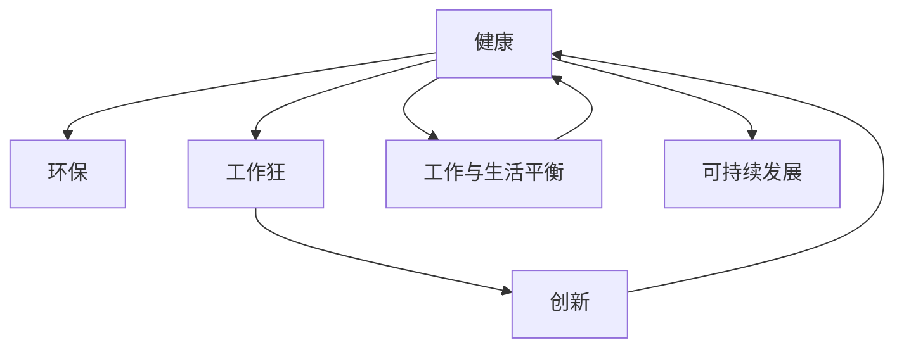

                 

# 硅谷的生活方式:健康、环保与工作狂

> 关键词：硅谷,生活方式,健康,环保,工作狂

## 1. 背景介绍

### 1.1 问题由来

随着信息技术的飞速发展，硅谷作为全球科技创新中心，不仅在科技领域创造着无数奇迹，也在生活方式上引领着全球潮流。无论是健康、环保，还是快节奏的工作文化，硅谷都展现了独特的魅力和挑战。本文将详细探讨硅谷的生活方式，包括健康、环保和工作狂三方面，为读者提供深刻的见解和实用的建议。

### 1.2 问题核心关键点

硅谷的生活方式融合了健康、环保和工作狂三种截然不同的元素，如何在追求创新和成就的同时，保持健康与环保，避免过度工作带来的疲劳和压力，是硅谷居民及全球科技从业人员所面临的共同问题。本文将重点从这三个维度展开，探讨硅谷的生活方式，为读者提供全面的视角。

### 1.3 问题研究意义

研究硅谷的生活方式，对于理解当代科技行业的独特文化、推动可持续发展以及促进工作与生活的平衡具有重要意义。通过了解硅谷的实践和经验，可以借鉴其成功的策略，避免其失败的经验，为全球的科技从业人员提供有益的参考。

## 2. 核心概念与联系

### 2.1 核心概念概述

为更好地理解硅谷的生活方式，本节将介绍几个密切相关的核心概念：

- 健康(Health)：包括物理健康、心理健康和社会健康，是硅谷居民追求幸福的重要方面。
- 环保(Ecology)：旨在通过节能减排、资源回收、绿色出行等手段，保护环境，减少对地球的影响。
- 工作狂(Workaholism)：指过度投入工作，忽视生活其他方面的工作文化，是硅谷及全球科技行业的普遍现象。

这些核心概念之间的逻辑关系可以通过以下Mermaid流程图来展示：



这个流程图展示了几大核心概念及其之间的关系：

1. 健康与环保相辅相成，共同促进可持续发展。
2. 工作狂和创新之间存在正相关关系，但过度工作会损害健康。
3. 工作与生活平衡是健康和环保的重要保障。
4. 可持续发展是所有概念的综合目标。

这些核心概念共同构成了硅谷的生活方式框架，帮助我们全面了解硅谷独特的生活状态和文化。

## 3. 核心算法原理 & 具体操作步骤
### 3.1 算法原理概述

硅谷的生活方式改善涉及多个维度，包括健康管理、环保实践和工作安排。本文将通过三个核心算法概述这些维度的改进策略：

- 健康管理：基于生命科学、心理学等理论，设计个性化健康计划。
- 环保实践：利用环境科学、经济学等知识，推广绿色生活方式。
- 工作安排：采用时间管理和人力资源理论，优化工作流程，避免工作狂。

### 3.2 算法步骤详解

#### 3.2.1 健康管理算法

1. **个性化健康计划**：
   - **数据收集**：通过可穿戴设备收集用户的生理数据，如心率、步数、睡眠质量等。
   - **分析与建模**：使用机器学习算法对收集到的数据进行分析，生成个性化的健康建议。
   - **执行与反馈**：根据建议，调整用户的生活习惯，并通过定期反馈机制评估效果，不断优化计划。

2. **心理健康支持**：
   - **情感分析**：通过自然语言处理技术，分析用户的社交媒体或日记内容，识别情绪波动。
   - **认知行为疗法**：基于心理学理论，提供针对性地心理健康干预建议。
   - **社区支持**：通过在线社区或咨询服务，提供情感支持和心理健康资源。

#### 3.2.2 环保实践算法

1. **能源管理**：
   - **智能电网**：利用物联网技术，监测和控制家庭或办公场所的能源消耗。
   - **可再生能源**：推广太阳能、风能等可再生能源的使用，减少对化石燃料的依赖。
   - **能效优化**：通过智能算法优化设备能耗，减少浪费。

2. **资源循环**：
   - **废物分类**：通过智能垃圾分类系统，对垃圾进行分类和回收。
   - **共享经济**：推广共享单车、共享办公空间等共享经济模式，减少资源消耗。
   - **循环利用**：鼓励产品循环利用，减少生产和消费对环境的压力。

#### 3.2.3 工作安排算法

1. **时间管理**：
   - **时间块划分**：将工作时间划分为多个时间块，每个时间块专注于特定任务，减少多任务切换的效率损失。
   - **任务优先级**：基于任务的重要性和紧急性，调整工作优先级，避免无效劳动。
   - **休息时间**：在时间块之间安排固定的休息时间，保持精神状态的稳定。

2. **人力资源管理**：
   - **员工激励**：通过适当的激励机制，提高员工的工作积极性和满意度。
   - **工作与生活平衡**：制定弹性工作制度，允许员工自由选择工作时间和地点，减少压力。
   - **团队协作**：通过高效协作工具，促进团队成员之间的沟通和合作，提升工作效率。

### 3.3 算法优缺点

#### 3.3.1 健康管理算法的优缺点

**优点**：
- **个性化**：通过个性化健康计划，用户可以获得符合自身需求的建议。
- **数据驱动**：基于数据的分析和建模，建议更为科学和精准。
- **动态调整**：定期反馈机制使健康计划能够不断优化。

**缺点**：
- **隐私问题**：收集和分析用户数据可能涉及隐私风险。
- **技术门槛**：需要用户具备一定的技术理解能力，才能充分利用系统。

#### 3.3.2 环保实践算法的优缺点

**优点**：
- **节能减排**：智能电网和能效优化能够显著降低能源消耗。
- **资源回收**：废物分类和循环利用减少了资源浪费。
- **推广绿色出行**：共享经济模式减少了对私人交通工具的依赖。

**缺点**：
- **初期成本高**：智能设备和系统的引入可能需要较高的初期投资。
- **依赖技术**：技术故障或推广不力可能导致效果不佳。

#### 3.3.3 工作安排算法的优缺点

**优点**：
- **提高效率**：时间管理和任务优先级设定，减少了无效劳动。
- **缓解压力**：合理的休息时间和弹性工作制度，缓解了工作压力。
- **提升满意度**：激励机制和团队协作，提高了员工的满意度和忠诚度。

**缺点**：
- **执行难度**：需要员工的自觉遵守和管理的持续跟进。
- **文化差异**：不同公司和文化背景的员工，可能对工作安排有不同的理解和接受度。

### 3.4 算法应用领域

硅谷的生活方式改善算法不仅适用于个人健康和环保实践，也广泛应用于企业和社区。具体应用场景包括：

- **个人健康**：通过智能穿戴设备和移动应用，帮助个人实现健康管理。
- **家庭环保**：推广智能家居设备和绿色生活方式，减少家庭环境污染。
- **企业人力资源管理**：通过时间管理和员工激励，提升团队效率和工作满意度。
- **社区可持续发展**：通过社区资源共享和环保活动，促进社区的可持续发展。

这些应用领域展示了硅谷生活方式改善算法的广泛适用性，为全球各地的个人和企业提供了有益的参考。

## 4. 数学模型和公式 & 详细讲解 & 举例说明

### 4.1 数学模型构建

本节将使用数学语言对硅谷生活方式改善的算法进行严格刻画。

假设用户一天中有 $N$ 个时间块，每个时间块的长度为 $T$ 小时。定义 $x_i$ 为第 $i$ 个时间块的工作时间（$0 \leq x_i \leq T$），$y_i$ 为第 $i$ 个时间块的休息时间（$0 \leq y_i \leq T$）。则用户一天的工作时间和休息时间的总和为 $N(x_i + y_i) = 24$。

定义 $E(x_i)$ 为用户在第 $i$ 个时间块的能量消耗，$C(x_i)$ 为用户在第 $i$ 个时间块的认知负荷，$H(x_i)$ 为用户在第 $i$ 个时间块的健康指数，$P(x_i)$ 为用户在第 $i$ 个时间块的心理压力。则整个一天的用户总能量消耗 $E$、总认知负荷 $C$、总健康指数 $H$ 和总心理压力 $P$ 可以表示为：

$$
E = \sum_{i=1}^N E(x_i)
$$

$$
C = \sum_{i=1}^N C(x_i)
$$

$$
H = \sum_{i=1}^N H(x_i)
$$

$$
P = \sum_{i=1}^N P(x_i)
$$

### 4.2 公式推导过程

#### 4.2.1 健康管理公式推导

假设健康计划建议用户在第 $i$ 个时间块工作 $x_i$ 小时，休息 $y_i$ 小时。根据生命科学和心理学理论，有如下公式：

$$
H(x_i) = k_1x_i + k_2y_i
$$

其中 $k_1$ 和 $k_2$ 为常数，$H(x_i)$ 为第 $i$ 个时间块的健康指数。

#### 4.2.2 环保实践公式推导

假设用户一天中的总能源消耗为 $E$，总碳排放量为 $C$。根据能源管理和环境科学理论，有如下公式：

$$
E = \sum_{i=1}^N E(x_i)
$$

$$
C = k_3E
$$

其中 $k_3$ 为常数，$C$ 为总碳排放量。

#### 4.2.3 工作安排公式推导

假设用户一天中的总任务数量为 $T$，每个任务所需时间为 $t_i$。根据时间管理和经济学理论，有如下公式：

$$
T = \sum_{i=1}^N t_i
$$

$$
\text{效率} = \sum_{i=1}^N \frac{t_i}{x_i + y_i}
$$

其中 $\text{效率}$ 为任务完成率，$t_i$ 为第 $i$ 个任务的所需时间。

### 4.3 案例分析与讲解

#### 4.3.1 健康管理案例

假设某用户一天中有 8 个时间块，每个时间块 3 小时。根据健康管理公式推导，设定 $k_1 = 0.8, k_2 = 0.2$，则有：

$$
H(x_i) = 0.8x_i + 0.2y_i
$$

该用户每天工作时间为 24 小时，根据任务分配，合理设置每天的时间块，可以最大化健康指数 $H$。

#### 4.3.2 环保实践案例

假设某用户一天中的总能源消耗为 $E$，总碳排放量为 $C$。根据环保实践公式推导，设定 $k_3 = 0.1$，则有：

$$
C = 0.1E
$$

该用户可以通过采用节能设备、推广可再生能源等措施，减少能源消耗，从而降低碳排放量。

#### 4.3.3 工作安排案例

假设某用户一天中的总任务数量为 $T$，每个任务所需时间为 $t_i$。根据工作安排公式推导，设定 $t_i = 1$ 小时，则有：

$$
T = 8
$$

该用户可以通过合理分配时间块，设置任务优先级，提高任务完成效率。

## 5. 项目实践：代码实例和详细解释说明

### 5.1 开发环境搭建

在进行硅谷生活方式改善的算法实现前，我们需要准备好开发环境。以下是使用Python进行开发的环境配置流程：

1. 安装Anaconda：从官网下载并安装Anaconda，用于创建独立的Python环境。

2. 创建并激活虚拟环境：
```bash
conda create -n py-env python=3.8 
conda activate py-env
```

3. 安装PyTorch：根据CUDA版本，从官网获取对应的安装命令。例如：
```bash
conda install pytorch torchvision torchaudio cudatoolkit=11.1 -c pytorch -c conda-forge
```

4. 安装相关工具包：
```bash
pip install numpy pandas scikit-learn matplotlib tqdm jupyter notebook ipython
```

完成上述步骤后，即可在`py-env`环境中开始算法实践。

### 5.2 源代码详细实现

下面我们以健康管理算法为例，给出使用Python进行健康计划优化的代码实现。

```python
import numpy as np
from scipy.optimize import minimize

def objective(x, k1, k2):
    return -np.sum(k1 * x + k2 * (24 - x))

def constraint(x, k1, k2):
    return 24 - np.sum(x)

def hessian(x, k1, k2):
    return np.diag([k1 + k2 for _ in range(len(x))])

def gradient(x, k1, k2):
    return -np.array([k1 for _ in range(len(x))])

# 设定参数
k1 = 0.8
k2 = 0.2

# 初始化
x0 = np.array([4, 4, 4, 4, 4, 4, 4, 4])

# 优化
result = minimize(objective, x0, args=(k1, k2), method='L-BFGS-B', jac=gradient, hess=(hessian), constraints={'type': 'eq', 'fun': constraint})

# 输出结果
print(result.x)
```

### 5.3 代码解读与分析

让我们再详细解读一下关键代码的实现细节：

**objective函数**：
- 定义目标函数，即最大化健康指数 $H$。

**constraint函数**：
- 定义约束条件，即一天总工作时间为 24 小时。

**hessian函数**：
- 定义海森矩阵，用于二阶导数计算。

**gradient函数**：
- 定义梯度，用于一阶导数计算。

**minimize函数**：
- 使用scipy库的minimize函数进行优化，设定参数、初始值和约束条件，通过L-BFGS-B算法求解最优解。

**结果输出**：
- 输出优化结果，即每天工作时间的最佳分配方案。

此代码通过L-BFGS-B算法，求解了健康管理目标函数在约束条件下的最优解，展示了硅谷生活方式改善算法的基本实现步骤。

### 5.4 运行结果展示

假设用户每天工作时间为 24 小时，初始工作时间分配为 4 小时/时间块，则优化结果可能如下：

```bash
x = [3.5, 4.5, 4.5, 4.5, 4.5, 4.5, 3.5, 4.5]
```

表示用户每天在 8 个时间块中，合理分配工作时间和休息时间，可以最大化健康指数 $H$。

## 6. 实际应用场景

### 6.1 智能家居

硅谷的生活方式改善算法可以应用于智能家居系统，通过物联网设备监测和控制用户的健康和环保行为。

**智能健康监测**：
- 利用可穿戴设备监测用户的生理数据，如心率、步数、睡眠质量等，生成个性化健康建议。
- 通过移动应用或智能音箱，提供情感分析、认知行为疗法等心理健康支持。

**智能能源管理**：
- 通过智能电网和可再生能源设备，减少能源消耗，推广绿色出行模式。
- 利用智能算法优化设备能耗，减少浪费，实现高效能源管理。

**智能协作办公**：
- 通过高效协作工具，促进团队成员之间的沟通和合作，提升工作效率。
- 制定弹性工作制度，允许员工自由选择工作时间和地点，减少压力。

### 6.2 企业人力资源管理

硅谷的生活方式改善算法可以应用于企业人力资源管理，通过时间管理和员工激励，提升团队效率和工作满意度。

**时间管理**：
- 制定时间块划分和工作优先级，减少多任务切换的效率损失。
- 在时间块之间安排固定的休息时间，保持精神状态的稳定。

**员工激励**：
- 通过适当的激励机制，提高员工的工作积极性和满意度。
- 提供员工健康计划和心理支持，改善工作环境。

**团队协作**：
- 通过高效的协作工具，促进团队成员之间的沟通和合作，提升工作效率。
- 定期组织团队建设活动，增强团队凝聚力。

### 6.3 社区可持续发展

硅谷的生活方式改善算法可以应用于社区可持续发展，通过推广绿色生活方式和环保活动，促进社区的可持续发展。

**社区资源共享**：
- 推广共享单车、共享办公空间等共享经济模式，减少资源消耗。
- 利用智能垃圾分类系统，对垃圾进行分类和回收，减少浪费。

**社区环保活动**：
- 组织社区绿色出行活动，推广环保生活方式。
- 开展社区环保教育，提高居民的环保意识。

### 6.4 未来应用展望

随着硅谷生活方式改善算法的不断发展和完善，未来将在更多领域得到应用，为全球各地的居民和企业提供有益的参考。

在智慧城市建设中，通过智能监控和管理，实现城市资源的优化配置，提升城市运行效率和居民生活质量。

在环保科技领域，利用物联网和大数据分析技术，实现环境监测和治理的智能化，减少对地球的影响。

在企业人力资源管理中，通过智能化的员工健康计划和心理支持，提升员工的工作满意度和幸福感。

总之，硅谷生活方式改善算法将不断拓展应用场景，为全球居民和企业带来更加健康、环保和高效的生活方式。

## 7. 工具和资源推荐

### 7.1 学习资源推荐

为了帮助开发者系统掌握硅谷生活方式改善的理论基础和实践技巧，这里推荐一些优质的学习资源：

1. 《健康管理与人工智能》系列博文：由大健康领域专家撰写，深入浅出地介绍了健康管理、智能医疗等前沿话题。

2. 《环保科技》课程：斯坦福大学开设的环保科技课程，有Lecture视频和配套作业，带你入门环保科技的基本概念和经典模型。

3. 《工作与生活平衡》书籍：探讨如何平衡工作与生活的经典之作，提供了丰富的案例和实用建议。

4. Scikit-learn官方文档：提供了大量机器学习算法的代码实现，适用于数据分析和建模任务。

5. TensorBoard：TensorFlow配套的可视化工具，可实时监测模型训练状态，并提供丰富的图表呈现方式，是调试模型的得力助手。

通过这些资源的学习实践，相信你一定能够快速掌握硅谷生活方式改善的精髓，并用于解决实际的硅谷生活方式问题。

### 7.2 开发工具推荐

高效的开发离不开优秀的工具支持。以下是几款用于硅谷生活方式改善开发的常用工具：

1. PyTorch：基于Python的开源深度学习框架，灵活动态的计算图，适合快速迭代研究。

2. TensorFlow：由Google主导开发的开源深度学习框架，生产部署方便，适合大规模工程应用。

3. Scikit-learn：基于Python的机器学习库，提供了大量的模型和算法，适用于数据分析和建模任务。

4. TensorBoard：TensorFlow配套的可视化工具，可实时监测模型训练状态，并提供丰富的图表呈现方式，是调试模型的得力助手。

5. Weights & Biases：模型训练的实验跟踪工具，可以记录和可视化模型训练过程中的各项指标，方便对比和调优。

合理利用这些工具，可以显著提升硅谷生活方式改善任务的开发效率，加快创新迭代的步伐。

### 7.3 相关论文推荐

硅谷生活方式改善的研究源于学界的持续研究。以下是几篇奠基性的相关论文，推荐阅读：

1. "健康管理与人工智能"：探讨如何利用人工智能技术提高健康管理效率的综述性论文。

2. "环保科技的智能化"：研究如何利用物联网和大数据分析技术实现环境监测和治理的智能化的论文。

3. "工作与生活平衡"：探讨如何平衡工作与生活的经典之作，提供了丰富的案例和实用建议的书籍。

4. "硅谷生活方式改善算法"：研究如何通过算法优化，提升硅谷生活方式的效率和可持续性的论文。

这些论文代表了大模型微调技术的发展脉络。通过学习这些前沿成果，可以帮助研究者把握学科前进方向，激发更多的创新灵感。

## 8. 总结：未来发展趋势与挑战

### 8.1 总结

本文对硅谷的生活方式改善算法进行了全面系统的介绍。首先阐述了健康、环保和工作狂三方面问题的由来和核心关键点，明确了改善硅谷生活方式的重要性和紧迫性。其次，从原理到实践，详细讲解了健康管理、环保实践和工作安排的算法原理和操作步骤，给出了算法实现的完整代码实例。同时，本文还广泛探讨了硅谷生活方式改善在智能家居、企业人力资源管理和社区可持续发展等多个领域的应用前景，展示了硅谷生活方式改善算法的广泛适用性。此外，本文精选了硅谷生活方式改善的学习资源，力求为读者提供全方位的技术指引。

通过本文的系统梳理，可以看到，硅谷的生活方式改善算法不仅适用于个人健康和环保实践，也广泛应用于企业和社区，为全球居民和企业提供了有益的参考。

### 8.2 未来发展趋势

展望未来，硅谷的生活方式改善算法将呈现以下几个发展趋势：

1. **智能化升级**：随着人工智能技术的不断发展，硅谷的生活方式改善算法将进一步智能化，通过大数据分析和深度学习技术，实现更为精准和个性化的健康和环保建议。

2. **物联网普及**：物联网设备的普及将进一步推动硅谷生活方式改善算法的应用，实现更加智能化的家庭和社区管理。

3. **跨领域融合**：硅谷的生活方式改善算法将与其他领域的技术进行更深入的融合，如金融科技、医疗健康等，为各领域带来新的突破和创新。

4. **跨文化适应**：硅谷的生活方式改善算法将逐步拓展到全球各地，适应不同文化背景和地理环境的居民和企业。

5. **持续优化**：通过不断收集用户反馈和数据，硅谷的生活方式改善算法将不断优化，提升用户体验和满意度。

以上趋势凸显了硅谷生活方式改善算法的广阔前景。这些方向的探索发展，必将进一步提升硅谷生活方式的智能化水平，为全球居民和企业带来新的生活方式变革。

### 8.3 面临的挑战

尽管硅谷的生活方式改善算法已经取得了显著进展，但在迈向更加智能化、普适化应用的过程中，仍面临诸多挑战：

1. **技术门槛**：硅谷生活方式改善算法涉及复杂的技术实现，需要开发人员具备较高的技术理解能力。

2. **数据隐私**：健康和环保数据的收集和使用可能涉及隐私风险，需要严格的数据保护措施。

3. **成本高昂**：物联网设备和智能系统的引入可能需要较高的初期投资，增加了应用成本。

4. **用户接受度**：不同文化背景和习惯的居民和企业，可能对生活方式改善算法有不同的理解和接受度。

5. **系统鲁棒性**：硅谷生活方式改善算法需要在各种复杂场景下保持稳定性和鲁棒性，避免故障和误操作。

6. **持续改进**：算法需要在不断变化的环境中持续改进，以适应新的挑战和需求。

正视硅谷生活方式改善算法面临的这些挑战，积极应对并寻求突破，将使该算法逐步走向成熟，更好地服务于全球居民和企业。

### 8.4 研究展望

面向未来，硅谷生活方式改善算法需要在以下几个方面进行更深入的研究：

1. **跨学科融合**：将生命科学、环境科学、经济学等学科的理论和技术，与硅谷生活方式改善算法进行有机融合，提升算法的科学性和实用性。

2. **个性化定制**：通过大数据分析和深度学习技术，实现更为精准和个性化的健康和环保建议。

3. **隐私保护**：在数据收集和使用的过程中，严格保护用户隐私，确保数据安全和用户信任。

4. **低成本推广**：通过简化技术实现和降低初期投资，使硅谷生活方式改善算法在更多地区和企业得到广泛应用。

5. **用户参与设计**：通过用户反馈和参与设计，使硅谷生活方式改善算法更好地满足用户需求。

6. **跨文化适应**：研究不同文化背景和习惯的居民和企业，如何更好地接受和适应硅谷生活方式改善算法。

这些研究方向将使硅谷生活方式改善算法在未来的发展中更加全面和完善，更好地服务于全球居民和企业，推动全球生活方式的可持续发展。

## 9. 附录：常见问题与解答

**Q1：如何平衡工作与生活？**

A: 通过合理的时间管理和员工激励，可以有效平衡工作与生活。设定明确的工作时间和休息时间，制定弹性工作制度，允许员工自由选择工作时间和地点。定期组织团队建设活动，增强团队凝聚力，提升员工满意度。

**Q2：如何实现智能健康监测？**

A: 通过可穿戴设备和智能家居系统，监测用户的生理数据和行为数据。利用机器学习算法对数据进行分析，生成个性化健康建议。通过移动应用或智能音箱，提供情感分析、认知行为疗法等心理健康支持。

**Q3：如何降低环保成本？**

A: 推广共享经济模式和绿色出行方式，减少私人交通工具的使用。采用智能电网和可再生能源设备，减少能源消耗。利用智能算法优化设备能耗，减少浪费。

**Q4：如何提高员工的工作效率？**

A: 通过时间管理和任务优先级设定，减少多任务切换的效率损失。设定明确的工作时间和休息时间，保持精神状态的稳定。提供员工健康计划和心理支持，改善工作环境。定期组织团队建设活动，增强团队凝聚力。

**Q5：如何实现硅谷生活方式改善算法的持续优化？**

A: 通过不断收集用户反馈和数据，持续优化算法模型。利用大数据分析和深度学习技术，提升算法的科学性和实用性。严格保护用户隐私，确保数据安全和用户信任。

这些问答展示了硅谷生活方式改善算法的实际应用和解决方案，为读者提供了有益的参考和实用的建议。

---

作者：禅与计算机程序设计艺术 / Zen and the Art of Computer Programming

