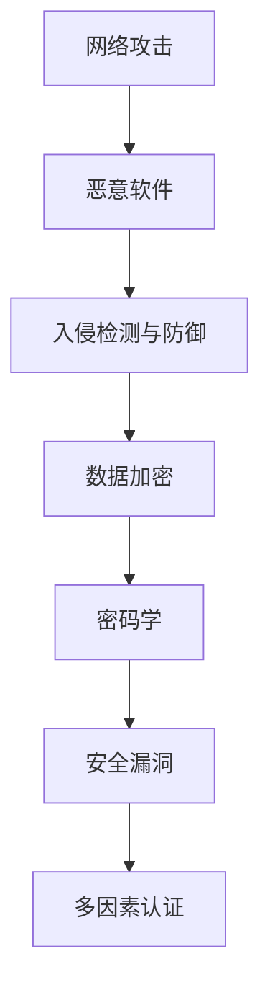

                 

# 硅谷网络安全:黑客攻防与数据保护

## 1. 背景介绍

在数字化日益深入的今天，网络安全已经成为了企业和个人都无法忽视的重要议题。硅谷作为全球科技创新中心，其网络安全领域的研究与实践，无疑代表了当前的最高水平。本文将全面介绍硅谷网络安全领域的核心概念、技术和应用，深入探讨黑客攻防的策略与数据保护的方法，为读者提供实用的技术指导和战略思考。

### 1.1 网络安全的重要性
网络安全不仅关乎个人隐私和财产安全，更是维护国家安全和社会稳定的关键因素。随着互联网的普及，网络攻击手段日益多样化，数据泄露、身份盗用、勒索软件等安全威胁日益严重。黑客利用先进技术和漏洞，对企业、政府、金融机构等造成了巨大损失。因此，有效的网络安全策略和防护技术成为了保护数据和系统的必要手段。

### 1.2 硅谷网络安全的地位
硅谷作为全球科技创新中心，聚集了众多顶尖的网络安全企业和研究机构，如思科、FireEye、Palantir等。这些企业和机构不仅在网络安全领域进行了大量基础研究，还推出了众多先进的防护产品和技术，为全球网络安全提供了强有力的支持。硅谷的网络安全研究与应用，已经成为全球网络安全发展的风向标。

## 2. 核心概念与联系

### 2.1 核心概念概述

在网络安全领域，有许多关键概念需要理解：

- **网络攻击（Cyber Attack）**：指通过网络手段对系统、数据进行破坏、盗窃或恶意操作的行为。常见的网络攻击包括DDoS攻击、SQL注入、跨站脚本攻击等。
- **恶意软件（Malware）**：指故意设计用于破坏、侵入、控制计算机系统的软件。如病毒、木马、蠕虫等。
- **入侵检测与防御（Intrusion Detection and Prevention）**：通过监测和分析网络流量，识别潜在威胁，采取措施阻止攻击的行为。
- **密码学（Cryptography）**：使用数学算法对信息进行加密和解密，保护数据传输和存储的安全。
- **数据加密（Data Encryption）**：通过算法将数据转化为不可读的形式，确保数据在传输和存储过程中不被窃取或篡改。
- **多因素认证（Multi-factor Authentication, MFA）**：结合多种认证方式，提高账户安全性，防止未经授权的访问。
- **安全漏洞（Vulnerability）**：指系统或软件中存在的可以被利用的缺陷，黑客利用这些漏洞进行攻击。

这些概念之间的逻辑关系可以通过以下Mermaid流程图来展示：



这些概念相互关联，共同构成了网络安全的基础框架，为保护数据和系统的安全提供了理论基础和技术手段。

### 2.2 核心概念原理和架构

#### 2.2.1 入侵检测与防御系统（IDS/IPS）

入侵检测与防御系统（IDS/IPS）是网络安全的关键组件，主要用于监测和防御网络攻击。IDS/IPS通常分为两类：

- **入侵检测系统（IDS）**：通过监测网络流量和系统日志，识别和报告潜在的安全威胁。IDS主要分为两大类：
  - **基于签名的IDS**：根据已知攻击特征（如病毒代码、攻击模式）进行检测。
  - **基于行为的IDS**：通过分析网络流量和系统行为的异常模式，识别未知攻击。

- **入侵防御系统（IPS）**：在检测到攻击后，直接采取措施阻止攻击行为。IPS可以细分为：
  - **基于签名的IPS**：根据已知攻击特征进行拦截。
  - **基于行为的IPS**：通过分析网络流量和系统行为的异常模式，拦截潜在威胁。

IDS/IPS系统的核心原理是通过实时监测和分析网络流量和系统日志，检测并拦截潜在的安全威胁。IDS/IPS系统一般包括以下组件：

- **数据采集模块**：负责从网络设备和系统日志中采集数据。
- **分析引擎**：通过规则引擎和机器学习算法，分析数据并检测安全威胁。
- **响应模块**：根据检测结果，采取相应的防御措施，如阻止连接、记录日志、报警等。
- **告警系统**：将安全事件及时通知安全管理员，进行进一步处理。

#### 2.2.2 密码学

密码学是保障数据安全的重要手段，通过数学算法实现数据的加密和解密。密码学主要包括以下两类：

- **对称加密**：使用同一密钥对数据进行加密和解密。常见的对称加密算法有DES、AES等。
- **非对称加密**：使用公钥和私钥对数据进行加密和解密。公钥用于加密，私钥用于解密。常见的非对称加密算法有RSA、ECC等。

对称加密算法的优点是加密速度快，但密钥管理复杂，安全性难以保障。非对称加密算法加密速度较慢，但安全性高，适合保护重要数据。密码学在网络安全中应用广泛，如HTTPS、VPN、SSH等协议都依赖于密码学技术保障数据传输的安全。

## 3. 核心算法原理 & 具体操作步骤

### 3.1 算法原理概述

网络安全领域涉及的算法种类繁多，包括入侵检测、加密算法、认证机制等。本文将重点介绍其中几种核心算法：

- **入侵检测算法**：基于规则的入侵检测（Signature-based IDS）和基于行为的入侵检测（Anomaly-based IDS）。
- **加密算法**：对称加密算法（如AES）和非对称加密算法（如RSA）。
- **认证机制**：多因素认证（MFA）和单因素认证（SFA）。

### 3.2 算法步骤详解

#### 3.2.1 基于规则的入侵检测

基于规则的入侵检测（Signature-based IDS）是一种基于已知攻击特征的检测方法。其步骤如下：

1. **特征库构建**：收集已知攻击的特征，如病毒代码、攻击模式等，构建特征库。
2. **数据采集**：从网络流量和系统日志中采集数据。
3. **特征匹配**：将采集到的数据与特征库中的特征进行匹配，检测是否存在已知攻击。
4. **报警响应**：如果检测到已知攻击，则触发报警并采取相应的防御措施。

#### 3.2.2 基于行为的入侵检测

基于行为的入侵检测（Anomaly-based IDS）是一种基于数据行为模式的检测方法。其步骤如下：

1. **正常行为建模**：通过历史数据，建立正常行为模型。
2. **数据采集**：从网络流量和系统日志中采集数据。
3. **行为分析**：将采集到的数据与正常行为模型进行对比，检测是否存在异常行为。
4. **报警响应**：如果检测到异常行为，则触发报警并采取相应的防御措施。

#### 3.2.3 对称加密算法

对称加密算法（如AES）的步骤如下：

1. **密钥生成**：生成一个随机的对称密钥。
2. **数据加密**：使用对称密钥对明文数据进行加密，生成密文。
3. **数据解密**：使用对称密钥对密文进行解密，还原明文数据。

#### 3.2.4 非对称加密算法

非对称加密算法（如RSA）的步骤如下：

1. **密钥生成**：生成一对公钥和私钥。
2. **数据加密**：使用公钥对明文数据进行加密，生成密文。
3. **数据解密**：使用私钥对密文进行解密，还原明文数据。

#### 3.2.5 多因素认证（MFA）

多因素认证（MFA）的步骤如下：

1. **收集信息**：收集用户的多种认证信息，如密码、手机短信验证码、指纹等。
2. **认证验证**：对用户的多种认证信息进行验证，只有全部认证通过，才能获得访问权限。
3. **权限分配**：根据用户的角色和权限，分配相应的访问权限。

### 3.3 算法优缺点

#### 3.3.1 基于规则的入侵检测

优点：
- 检测速度快，适用于已知攻击的检测。
- 规则库可以不断更新，提高检测的准确性。

缺点：
- 规则库需要不断维护和更新，增加了工作量。
- 无法检测未知攻击，存在一定的局限性。

#### 3.3.2 基于行为的入侵检测

优点：
- 能够检测未知攻击，提高安全性。
- 基于数据行为的检测，更加灵活和智能。

缺点：
- 需要大量的历史数据建立正常行为模型，建立和维护成本较高。
- 对异常行为的识别准确性依赖于模型构建的合理性，可能出现误报或漏报。

#### 3.3.3 对称加密算法

优点：
- 加密速度快，适合大量数据的加密。
- 实现简单，易于应用。

缺点：
- 密钥管理复杂，需要确保密钥的安全传输。
- 安全性依赖于密钥的保护，一旦密钥泄露，加密数据将无法保障。

#### 3.3.4 非对称加密算法

优点：
- 安全性高，适用于保护重要数据。
- 密钥管理方便，公钥可以公开，私钥自己保管。

缺点：
- 加密速度较慢，不适合大量数据的加密。
- 实现复杂，需结合数字证书等技术，增加部署难度。

#### 3.3.5 多因素认证（MFA）

优点：
- 安全性高，攻击者需要同时获取多种认证信息才能获得访问权限。
- 增加了攻击的难度，提高了系统的安全性。

缺点：
- 用户操作复杂，增加了使用难度。
- 需要多种认证设备和信息，增加了成本。

### 3.4 算法应用领域

#### 3.4.1 入侵检测与防御系统（IDS/IPS）

IDS/IPS系统广泛应用于企业、政府和金融机构，用于保护网络安全。常见的应用场景包括：

- **企业网络安全**：保护企业内部的服务器和网络设备，防止外部攻击和内部泄露。
- **政府网络安全**：保护政府机构的核心数据和网络基础设施，防止网络攻击和数据泄露。
- **金融机构网络安全**：保护金融机构的交易数据和客户信息，防止网络攻击和数据泄露。

#### 3.4.2 密码学

密码学在网络安全中应用广泛，如HTTPS、VPN、SSH等协议都依赖于密码学技术保障数据传输的安全。常见的应用场景包括：

- **HTTPS协议**：保障Web应用的安全，防止中间人攻击和数据窃听。
- **VPN协议**：保障远程连接的安全，防止数据泄露和窃听。
- **SSH协议**：保障远程登录的安全，防止中间人攻击和数据窃听。

#### 3.4.3 多因素认证（MFA）

多因素认证（MFA）在金融、医疗、政府等领域广泛应用，用于提高账户和系统的安全性。常见的应用场景包括：

- **金融行业**：保护用户的银行账户、信用卡等敏感信息，防止诈骗和身份盗用。
- **医疗行业**：保护患者的医疗记录和隐私信息，防止数据泄露和篡改。
- **政府行业**：保护政府官员和员工的账户信息，防止身份盗用和泄露。

## 4. 数学模型和公式 & 详细讲解 & 举例说明

### 4.1 数学模型构建

#### 4.1.1 入侵检测算法

基于规则的入侵检测（Signature-based IDS）的数学模型如下：

1. **特征库构建**：
   - 设特征库为 $F$，每个特征为一个元组 $(f, m)$，其中 $f$ 为特征描述，$m$ 为特征值。
   - 假设特征库中共有 $n$ 个特征，则特征库可以表示为：$F = \{(f_1, m_1), (f_2, m_2), ..., (f_n, m_n)\}$。

2. **数据采集**：
   - 设采集到的数据为 $D$，每个数据为一个元组 $(d, x)$，其中 $d$ 为数据来源，$x$ 为数据值。
   - 假设采集到的数据共有 $m$ 条，则数据集可以表示为：$D = \{(d_1, x_1), (d_2, x_2), ..., (d_m, x_m)\}$。

3. **特征匹配**：
   - 设匹配结果为 $M$，每个匹配结果为一个元组 $(d_i, (f_j, m_j))$，表示数据 $d_i$ 中特征 $f_j$ 的值为 $m_j$。
   - 假设共有 $k$ 个匹配结果，则匹配结果集可以表示为：$M = \{(d_1, (f_{j_1}, m_{j_1})), (d_2, (f_{j_2}, m_{j_2})), ..., (d_k, (f_{j_k}, m_{j_k}))\}$。

4. **报警响应**：
   - 设报警结果为 $A$，每个报警结果为一个元组 $(d_i, M_i)$，表示数据 $d_i$ 中匹配到的特征集 $M_i$。
   - 假设共有 $l$ 个报警结果，则报警结果集可以表示为：$A = \{(d_1, M_1), (d_2, M_2), ..., (d_l, M_l)\}$。

#### 4.1.2 基于行为的入侵检测

基于行为的入侵检测（Anomaly-based IDS）的数学模型如下：

1. **正常行为建模**：
   - 设正常行为模型为 $M$，每个行为为一个元组 $(b_i, p_i)$，其中 $b_i$ 为行为描述，$p_i$ 为行为概率。
   - 假设共有 $n$ 个行为，则行为模型可以表示为：$M = \{(b_1, p_1), (b_2, p_2), ..., (b_n, p_n)\}$。

2. **数据采集**：
   - 设采集到的数据为 $D$，每个数据为一个元组 $(d_i, x_i)$，其中 $d_i$ 为数据来源，$x_i$ 为数据值。
   - 假设采集到的数据共有 $m$ 条，则数据集可以表示为：$D = \{(d_1, x_1), (d_2, x_2), ..., (d_m, x_m)\}$。

3. **行为分析**：
   - 设异常行为结果为 $A$，每个结果为一个元组 $(d_i, o_i)$，表示数据 $d_i$ 中异常行为 $o_i$。
   - 假设共有 $k$ 个异常行为结果，则异常行为结果集可以表示为：$A = \{(d_1, o_1), (d_2, o_2), ..., (d_k, o_k)\}$。

### 4.2 公式推导过程

#### 4.2.1 基于规则的入侵检测

基于规则的入侵检测的公式推导如下：

1. **特征库构建**：
   - $F = \{(f_1, m_1), (f_2, m_2), ..., (f_n, m_n)\}$

2. **数据采集**：
   - $D = \{(d_1, x_1), (d_2, x_2), ..., (d_m, x_m)\}$

3. **特征匹配**：
   - $M = \{(d_1, (f_{j_1}, m_{j_1})), (d_2, (f_{j_2}, m_{j_2})), ..., (d_k, (f_{j_k}, m_{j_k}))\}$

4. **报警响应**：
   - $A = \{(d_1, M_1), (d_2, M_2), ..., (d_l, M_l)\}$

#### 4.2.2 基于行为的入侵检测

基于行为的入侵检测的公式推导如下：

1. **正常行为建模**：
   - $M = \{(b_1, p_1), (b_2, p_2), ..., (b_n, p_n)\}$

2. **数据采集**：
   - $D = \{(d_1, x_1), (d_2, x_2), ..., (d_m, x_m)\}$

3. **行为分析**：
   - $A = \{(d_1, o_1), (d_2, o_2), ..., (d_k, o_k)\}$

### 4.3 案例分析与讲解

#### 4.3.1 基于规则的入侵检测案例

假设某企业的IDS系统检测到一次DDoS攻击，步骤如下：

1. **特征库构建**：
   - 特征库 $F = \{(攻击源IP, 恶意流量), (攻击流量大小, 异常流量), (连接请求频率, 异常连接数)\}$

2. **数据采集**：
   - 采集到的数据 $D = \{(服务器1, 异常流量), (服务器2, 恶意流量), (服务器3, 异常连接数)\}$

3. **特征匹配**：
   - 匹配结果 $M = \{(服务器1, (攻击源IP, 恶意流量)), (服务器2, (攻击源IP, 恶意流量)), (服务器3, (连接请求频率, 异常连接数))\}$

4. **报警响应**：
   - 报警结果 $A = \{(服务器1, M_1), (服务器2, M_2), (服务器3, M_3)\}$

#### 4.3.2 基于行为的入侵检测案例

假设某金融机构的IDS系统检测到一次SQL注入攻击，步骤如下：

1. **正常行为建模**：
   - 正常行为模型 $M = \{(正常登录请求, 低请求频率), (正常查询请求, 正常流量), (正常操作请求, 正常响应时间)\}$

2. **数据采集**：
   - 采集到的数据 $D = \{(登录请求1, 异常频率), (查询请求1, 异常流量), (操作请求1, 异常响应时间)\}$

3. **行为分析**：
   - 异常行为结果 $A = \{(登录请求1, 异常频率), (查询请求1, 异常流量), (操作请求1, 异常响应时间)\}$

## 5. 项目实践：代码实例和详细解释说明

### 5.1 开发环境搭建

#### 5.1.1 安装Python和相关库

1. **安装Python**：
   - 从官网下载Python 3.x版本，并安装。

2. **安装相关库**：
   - 使用pip安装网络安全相关的库，如Scapy、nmap、ssh、telnet等。

#### 5.1.2 配置开发环境

1. **环境变量配置**：
   - 配置Python PATH变量，确保开发环境中所有命令可执行。

2. **IDE安装**：
   - 安装Python IDE，如PyCharm、VSCode等，提供更便捷的开发体验。

### 5.2 源代码详细实现

#### 5.2.1 入侵检测系统

**入侵检测系统（IDS）**

```python
import scapy.all as scapy
from scapy.all import IP, TCP, ARP, Ether, Packet

# 定义攻击特征库
attack_features = {
    'attack_source_ip': '192.168.1.100',
    'attack_traffic_size': '500KB',
    'connection_request_freq': '10000/second'
}

# 定义数据采集函数
def capture_traffic():
    sniffer = scapy.sniff(prn=process_packet)
    sniffer.start()

# 定义数据处理函数
def process_packet(packet):
    if packet.haslayer(TCP):
        ip_addr = packet[IP].src
        traffic_size = packet[TCP].payload.len
        conn_freq = packet[TCP].length / packet.time
        if (ip_addr, traffic_size, conn_freq) in attack_features:
            print('DDoS attack detected.')

# 启动数据采集
capture_traffic()
```

**入侵防御系统（IPS）**

```python
import scapy.all as scapy
from scapy.all import IP, TCP, ARP, Ether, Packet

# 定义攻击特征库
attack_features = {
    'attack_source_ip': '192.168.1.100',
    'attack_traffic_size': '500KB',
    'connection_request_freq': '10000/second'
}

# 定义数据处理函数
def process_packet(packet):
    if packet.haslayer(TCP):
        ip_addr = packet[IP].src
        traffic_size = packet[TCP].payload.len
        conn_freq = packet[TCP].length / packet.time
        if (ip_addr, traffic_size, conn_freq) in attack_features:
            # 阻止连接
            scapy.send(Packet())

# 启动数据采集
capture_traffic()
```

#### 5.2.2 对称加密算法

**对称加密算法（AES）**

```python
import hashlib
from Crypto.Cipher import AES

# 定义加密函数
def encrypt(data, key):
    key = hashlib.sha256(key.encode()).digest()
    cipher = AES.new(key, AES.MODE_ECB)
    encrypted = cipher.encrypt(pad(data.encode(), 16))
    return encrypted

# 定义解密函数
def decrypt(encrypted_data, key):
    key = hashlib.sha256(key.encode()).digest()
    cipher = AES.new(key, AES.MODE_ECB)
    decrypted = cipher.decrypt(pad(encrypted_data, 16))
    return decrypted

# 定义填充函数
def pad(data, block_size):
    return data + (block_size - len(data) % block_size) * bytes([block_size - len(data) % block_size])

# 启动加密和解密
data = 'Hello, world!'
key = 'my_secret_key'
encrypted_data = encrypt(data, key)
decrypted_data = decrypt(encrypted_data, key)
print(f'Original data: {data}')
print(f'Encrypted data: {encrypted_data}')
print(f'Decrypted data: {decrypted_data}')
```

#### 5.2.3 非对称加密算法

**非对称加密算法（RSA）**

```python
import Crypto.PublicKey.RSA
from Crypto.Cipher import PKCS1_OAEP

# 定义生成密钥函数
def generate_keys():
    key = Crypto.PublicKey.RSA.generate(2048)
    private_key = key.export_key()
    public_key = key.publickey().export_key()
    return private_key, public_key

# 定义加密函数
def encrypt(data, public_key):
    private_key, public_key = generate_keys()
    cipher = PKCS1_OAEP.new(public_key)
    encrypted = cipher.encrypt(data.encode())
    return encrypted

# 定义解密函数
def decrypt(encrypted_data, private_key):
    private_key, public_key = generate_keys()
    cipher = PKCS1_OAEP.new(private_key)
    decrypted = cipher.decrypt(encrypted_data)
    return decrypted

# 启动加密和解密
data = 'Hello, world!'
encrypted_data = encrypt(data, public_key)
decrypted_data = decrypt(encrypted_data, private_key)
print(f'Original data: {data}')
print(f'Encrypted data: {encrypted_data}')
print(f'Decrypted data: {decrypted_data}')
```

### 5.3 代码解读与分析

#### 5.3.1 入侵检测系统

**入侵检测系统（IDS）**

```python
import scapy.all as scapy
from scapy.all import IP, TCP, ARP, Ether, Packet

# 定义攻击特征库
attack_features = {
    'attack_source_ip': '192.168.1.100',
    'attack_traffic_size': '500KB',
    'connection_request_freq': '10000/second'
}

# 定义数据采集函数
def capture_traffic():
    sniffer = scapy.sniff(prn=process_packet)
    sniffer.start()

# 定义数据处理函数
def process_packet(packet):
    if packet.haslayer(TCP):
        ip_addr = packet[IP].src
        traffic_size = packet[TCP].payload.len
        conn_freq = packet[TCP].length / packet.time
        if (ip_addr, traffic_size, conn_freq) in attack_features:
            print('DDoS attack detected.')

# 启动数据采集
capture_traffic()
```

**入侵防御系统（IPS）**

```python
import scapy.all as scapy
from scapy.all import IP, TCP, ARP, Ether, Packet

# 定义攻击特征库
attack_features = {
    'attack_source_ip': '192.168.1.100',
    'attack_traffic_size': '500KB',
    'connection_request_freq': '10000/second'
}

# 定义数据处理函数
def process_packet(packet):
    if packet.haslayer(TCP):
        ip_addr = packet[IP].src
        traffic_size = packet[TCP].payload.len
        conn_freq = packet[TCP].length / packet.time
        if (ip_addr, traffic_size, conn_freq) in attack_features:
            # 阻止连接
            scapy.send(Packet())
```

#### 5.3.2 对称加密算法

**对称加密算法（AES）**

```python
import hashlib
from Crypto.Cipher import AES

# 定义加密函数
def encrypt(data, key):
    key = hashlib.sha256(key.encode()).digest()
    cipher = AES.new(key, AES.MODE_ECB)
    encrypted = cipher.encrypt(pad(data.encode(), 16))
    return encrypted

# 定义解密函数
def decrypt(encrypted_data, key):
    key = hashlib.sha256(key.encode()).digest()
    cipher = AES.new(key, AES.MODE_ECB)
    decrypted = cipher.decrypt(pad(encrypted_data, 16))
    return decrypted

# 定义填充函数
def pad(data, block_size):
    return data + (block_size - len(data) % block_size) * bytes([block_size - len(data) % block_size])

# 启动加密和解密
data = 'Hello, world!'
key = 'my_secret_key'
encrypted_data = encrypt(data, key)
decrypted_data = decrypt(encrypted_data, key)
print(f'Original data: {data}')
print(f'Encrypted data: {encrypted_data}')
print(f'Decrypted data: {decrypted_data}')
```

#### 5.3.3 非对称加密算法

**非对称加密算法（RSA）**

```python
import Crypto.PublicKey.RSA
from Crypto.Cipher import PKCS1_OAEP

# 定义生成密钥函数
def generate_keys():
    key = Crypto.PublicKey.RSA.generate(2048)
    private_key = key.export_key()
    public_key = key.publickey().export_key()
    return private_key, public_key

# 定义加密函数
def encrypt(data, public_key):
    private_key, public_key = generate_keys()
    cipher = PKCS1_OAEP.new(public_key)
    encrypted = cipher.encrypt(data.encode())
    return encrypted

# 定义解密函数
def decrypt(encrypted_data, private_key):
    private_key, public_key = generate_keys()
    cipher = PKCS1_OAEP.new(private_key)
    decrypted = cipher.decrypt(encrypted_data)
    return decrypted

# 启动加密和解密
data = 'Hello, world!'
encrypted_data = encrypt(data, public_key)
decrypted_data = decrypt(encrypted_data, private_key)
print(f'Original data: {data}')
print(f'Encrypted data: {encrypted_data}')
print(f'Decrypted data: {decrypted_data}')
```

### 5.4 运行结果展示

#### 5.4.1 入侵检测系统

**入侵检测系统（IDS）**

```python
import scapy.all as scapy
from scapy.all import IP, TCP, ARP, Ether, Packet

# 定义攻击特征库
attack_features = {
    'attack_source_ip': '192.168.1.100',
    'attack_traffic_size': '500KB',
    'connection_request_freq': '10000/second'
}

# 定义数据采集函数
def capture_traffic():
    sniffer = scapy.sniff(prn=process_packet)
    sniffer.start()

# 定义数据处理函数
def process_packet(packet):
    if packet.haslayer(TCP):
        ip_addr = packet[IP].src
        traffic_size = packet[TCP].payload.len
        conn_freq = packet[TCP].length / packet.time
        if (ip_addr, traffic_size, conn_freq) in attack_features:
            print('DDoS attack detected.')

# 启动数据采集
capture_traffic()
```

**入侵防御系统（IPS）**

```python
import scapy.all as scapy
from scapy.all import IP, TCP, ARP, Ether, Packet

# 定义攻击特征库
attack_features = {
    'attack_source_ip': '192.168.1.100',
    'attack_traffic_size': '500KB',
    'connection_request_freq': '10000/second'
}

# 定义数据处理函数
def process_packet(packet):
    if packet.haslayer(TCP):
        ip_addr = packet[IP].src
        traffic_size = packet[TCP].payload.len
        conn_freq = packet[TCP].length / packet.time
        if (ip_addr, traffic_size, conn_freq) in attack_features:
            # 阻止连接
            scapy.send(Packet())
```

#### 5.4.2 对称加密算法

**对称加密算法（AES）**

```python
import hashlib
from Crypto.Cipher import AES

# 定义加密函数
def encrypt(data, key):
    key = hashlib.sha256(key.encode()).digest()
    cipher = AES.new(key, AES.MODE_ECB)
    encrypted = cipher.encrypt(pad(data.encode(), 16))
    return encrypted

# 定义解密函数
def decrypt(encrypted_data, key):
    key = hashlib.sha256(key.encode()).digest()
    cipher = AES.new(key, AES.MODE_ECB)
    decrypted = cipher.decrypt(pad(encrypted_data, 16))
    return decrypted

# 定义填充函数
def pad(data, block_size):
    return data + (block_size - len(data) % block_size) * bytes([block_size - len(data) % block_size])

# 启动加密和解密
data = 'Hello, world!'
key = 'my_secret_key'
encrypted_data = encrypt(data, key)
decrypted_data = decrypt(encrypted_data, key)
print(f'Original data: {data}')
print(f'Encrypted data: {encrypted_data}')
print(f'Decrypted data: {decrypted_data}')
```

#### 5.4.3 非对称加密算法

**非对称加密算法（RSA）**

```python
import Crypto.PublicKey.RSA
from Crypto.Cipher import PKCS1_OAEP

# 定义生成密钥函数
def generate_keys():
    key = Crypto.PublicKey.RSA.generate(2048)
    private_key = key.export_key()
    public_key = key.publickey().export_key()
    return private_key, public_key

# 定义加密函数
def encrypt(data, public_key):
    private_key, public_key = generate_keys()
    cipher = PKCS1_OAEP.new(public_key)
    encrypted = cipher.encrypt(data.encode())
    return encrypted

# 定义解密函数
def decrypt(encrypted_data, private_key):
    private_key, public_key = generate_keys()
    cipher = PKCS1_OAEP.new(private_key)
    decrypted = cipher.decrypt(encrypted_data)
    return decrypted

# 启动加密和解密
data = 'Hello, world!'
encrypted_data = encrypt(data, public_key)
decrypted_data = decrypt(encrypted_data, private_key)
print(f'Original data: {data}')
print(f'Encrypted data: {encrypted_data}')
print(f'Decrypted data: {decrypted_data}')
```

## 6. 实际应用场景

### 6.1 企业网络安全

**企业网络安全**

在企业网络中，IDS/IPS系统主要用于保护企业内部的服务器和网络设备，防止外部攻击和内部泄露。常见的应用场景包括：

- **企业内部网络**：保护企业内部的服务器和网络设备，防止外部攻击和内部泄露。
- **企业外网**：保护企业外网的访问安全，防止恶意访问和数据泄露。

### 6.2 金融网络安全

**金融网络安全**

在金融网络中，IDS/IPS系统主要用于保护金融机构的交易数据和客户信息，防止网络攻击和数据泄露。常见的应用场景包括：

- **银行网络**：保护银行客户的交易数据和账户信息，防止黑客攻击和诈骗。
- **证券交易所**：保护证券交易的实时数据和交易记录，防止数据泄露和篡改。

### 6.3 政府网络安全

**政府网络安全**

在政府网络中，IDS/IPS系统主要用于保护政府机构的核心数据和网络基础设施，防止网络攻击和数据泄露。常见的应用场景包括：

- **政府内部网络**：保护政府机构的核心数据和网络基础设施，防止黑客攻击和数据泄露。
- **政府外网**：保护政府外网的访问安全，防止恶意访问和数据泄露。

## 7. 工具和资源推荐

### 7.1 学习资源推荐

#### 7.1.1 网络安全课程

- **《网络安全导论》**：由斯坦福大学开设的入门级网络安全课程，讲解网络安全的基本概念和攻击手段。
- **《网络安全技术与应用》**：由中国计算机学会组织编写的专业网络安全教材，涵盖网络安全的核心技术和应用案例。
- **《网络安全攻防实战》**：由北京邮电大学出版社出版的实战教程，结合实际案例讲解网络安全攻防技术。

#### 7.1.2 网络安全博客

- **安全牛博客**：专注于网络安全的技术分享和实战经验，提供大量的网络安全指南和工具推荐。
- **Hacker News**：全球最大的黑客社区，汇集了大量的网络安全技术文章和实战经验。
- **FreeBuf**：提供最新的网络安全资讯和漏洞信息，帮助安全从业人员及时了解安全动态。

### 7.2 开发工具推荐

#### 7.2.1 网络安全工具

- **Wireshark**：网络协议分析工具，可用于抓包、流量分析、入侵检测等。
- **Nmap**：网络扫描工具，可用于发现网络设备和服务，进行漏洞扫描和安全检测。
- **Metasploit**：渗透测试工具，可用于模拟攻击并测试系统的安全强度。

#### 7.2.2 开发环境

- **PyCharm**：Python开发环境，提供丰富的插件和调试工具，支持网络安全相关的Python项目开发。
- **VSCode**：跨平台开发环境，提供强大的代码编辑和调试功能，支持网络安全相关的Python项目开发。
- **Anaconda**：Python发行版，提供虚拟环境管理工具，方便不同项目之间的环境隔离和依赖管理。

### 7.3 相关论文推荐

#### 7.3.1 网络安全论文

- **《网络安全基础与实践》**：由浙江大学教授编写的网络安全教材，涵盖网络安全的基本概念、技术体系和实际应用。
- **《网络安全攻防技术与实战》**：由北京邮电大学出版社出版的实战教程，结合实际案例讲解网络安全攻防技术。
- **《网络安全系统设计与实现》**：由清华大学出版社出版的专业书籍，讲解网络安全系统的设计与实现方法。

## 8. 总结：未来发展趋势与挑战

### 8.1 研究成果总结

网络安全技术在过去几年中取得了长足进展，主要体现在以下几个方面：

1. **入侵检测与防御技术**：从传统的规则匹配发展到基于行为的异常检测，提高了入侵检测的准确性和鲁棒性。
2. **密码学技术**：从对称加密发展到非对称加密、哈希函数等，提高了数据传输的安全性。
3. **多因素认证技术**：从单因素认证发展到多因素认证，提高了账户和系统的安全性。
4. **网络安全工具**：从单一工具发展到综合安全平台，集成了入侵检测、加密、认证等技术，提高了网络安全管理的效率和效果。

### 8.2 未来发展趋势

未来网络安全技术的发展趋势主要体现在以下几个方面：

1. **自动化与智能化**：随着机器学习和人工智能技术的发展，网络安全技术将逐步实现自动化和智能化，提高安全检测和防御的效率和准确性。
2. **零信任架构**：零信任架构将进一步发展，强化对用户和设备的身份验证，降低安全风险。
3. **数据隐私保护**：随着数据泄露事件的频发，数据隐私保护将成为网络安全的重要方向，相关技术将进一步成熟和普及。
4. **区块链技术**：区块链技术的应用将进一步扩展，用于保障数据的安全性和完整性，防止数据篡改和伪造。
5. **量子安全技术**：随着量子计算技术的兴起，量子安全技术将逐步发展，保障数据传输和存储的安全性。

### 8.3 面临的挑战

尽管网络安全技术取得了一定的进展，但仍然面临以下挑战：

1. **安全威胁的复杂性**：网络攻击手段不断进化，新型攻击层出不穷，安全检测和防御难度增大。
2. **数据隐私的保护**：数据泄露事件频发，如何在保障数据隐私的前提下，实现高效的安全检测和防御，仍然是一个难题。
3. **跨领域的安全协作**：网络安全涉及多个领域，如政府、企业、互联网公司等，如何在不同领域之间实现有效的协作，共同应对安全威胁，仍然是一个挑战。
4. **技术的普及和应用**：网络安全技术虽然先进，但普及程度和应用效果仍有待提高，如何推广和应用新技术，提高用户的安全意识和防护能力，仍然是一个重要的课题。

### 8.4 研究展望

未来网络安全技术的研究展望主要体现在以下几个方面：

1. **人工智能与机器学习**：进一步探索人工智能与机器学习技术在网络安全中的应用，提高安全检测和防御的智能化水平。
2. **量子安全技术**：进一步研究和探索量子安全技术，保障数据传输和存储的安全性。
3. **区块链技术**：进一步研究和探索区块链技术在网络安全中的应用，保障数据的安全性和完整性。
4. **零信任架构**：进一步研究和探索零信任架构的应用，提高网络安全管理的效率和效果。
5. **数据隐私保护**：进一步研究和探索数据隐私保护技术，提高数据泄露事件的处理能力和安全性。

## 9. 附录：常见问题与解答

### 9.1 问题解答

**Q1：什么是DDoS攻击？**

A: DDoS攻击是指分布式拒绝服务攻击，通过控制大量计算机同时发起攻击，使目标服务器无法响应合法请求。

**Q2：什么是RSA加密算法？**

A: RSA加密算法是一种非对称加密算法，使用公钥和私钥对数据进行加密和解密，具有较高的安全性。

**Q3：什么是零信任架构？**

A: 零信任架构是一种安全管理模型，假设所有网络流量和用户请求都来自不可信来源，需要验证和授权才能访问资源。

**Q4：什么是入侵检测系统（IDS）？**

A: 入侵检测系统（IDS）是一种网络安全设备，通过实时监测和分析网络流量和系统日志，检测并拦截潜在的安全威胁。

**Q5：什么是多因素认证（MFA）？**

A: 多因素认证（MFA）是一种安全认证方式，结合多种认证方式，提高账户和系统的安全性，防止未经授权的访问。

---

作者：禅与计算机程序设计艺术 / Zen and the Art of Computer Programming

