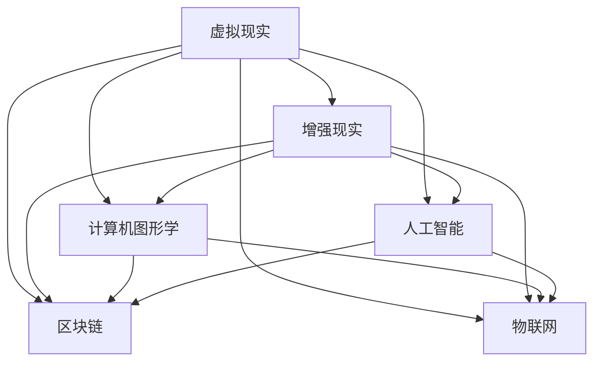

                 

# 硅谷虚拟现实:元宇宙的科技冲击

## 1. 背景介绍

### 1.1 问题由来
随着虚拟现实(VR)技术的不断成熟，元宇宙(Metaverse)概念的兴起，硅谷科技界掀起了一股元宇宙开发的热潮。元宇宙是虚拟现实、增强现实(AR)、区块链、物联网(IoT)等多种技术的深度融合，构建了一个高度沉浸式、交互式的虚拟空间。在虚拟空间中，人们可以进行社交、娱乐、工作等各种活动，仿佛身临其境。

元宇宙的崛起，给现有的互联网产业带来了巨大的冲击和变革。无论是社交媒体、游戏、娱乐、教育、购物，还是金融、政务、公共服务等领域，元宇宙技术都在逐步渗透和改造。

### 1.2 问题核心关键点
元宇宙的核心在于构建一个与现实世界平行的虚拟世界，使得人们能够在虚拟空间中自由地进行各种活动。这涉及到虚拟现实、增强现实、计算机图形学、人工智能、区块链等多个技术领域。

元宇宙的核心关键点包括：
- 虚拟现实与增强现实技术：构建高度沉浸式的虚拟空间，让用户能够自由地进行各种活动。
- 计算机图形学：实现高真实度的场景渲染，提供逼真的视觉体验。
- 人工智能：提供智能化的交互和内容生成，提升用户体验。
- 区块链技术：保证虚拟资产和身份的不可篡改性和去中心化，构建信任机制。
- 物联网技术：连接虚拟世界与现实世界，实现物理世界与虚拟世界的无缝融合。

## 2. 核心概念与联系

### 2.1 核心概念概述

为更好地理解元宇宙的开发，本节将介绍几个密切相关的核心概念：

- 虚拟现实(Virtual Reality, VR)：通过计算机图形学、传感器等技术，模拟出一个三维的虚拟世界，让用户通过头戴设备(HMD)、手柄等交互设备，能够自由地进行各种活动。
- 增强现实(Augmented Reality, AR)：将虚拟信息叠加到现实世界的场景中，提升用户的现实体验。
- 计算机图形学(Computer Graphics)：利用计算机绘制和渲染三维模型，实现逼真的虚拟场景。
- 人工智能(Artificial Intelligence, AI)：利用机器学习、自然语言处理等技术，实现智能化的交互和内容生成。
- 区块链(Blockchain)：一种去中心化的分布式账本技术，保证数据的透明性和安全性。
- 物联网(IoT)：将物理世界的各种设备和传感器连接起来，实现数据交换和互动。

这些核心概念之间的逻辑关系可以通过以下Mermaid流程图来展示：



这个流程图展示了一个完整的元宇宙构建体系，其中各个核心概念互相支撑，协同工作，共同构建出高度沉浸、交互的虚拟空间。

## 3. 核心算法原理 & 具体操作步骤
### 3.1 算法原理概述

元宇宙的开发涉及多个核心技术，每项技术都有其独特的算法原理和操作步骤。

以虚拟现实(VR)为例，其核心算法原理包括：
- 三维建模：将现实世界的场景转化为三维模型，并保存在计算机中。
- 渲染引擎：利用计算机图形学技术，对三维模型进行渲染，生成逼真的虚拟场景。
- 交互系统：利用传感器、手柄等设备，实现用户与虚拟世界的互动。

增强现实(AR)的核心算法原理包括：
- 图像识别：识别现实世界中的物体和场景，进行定位和跟踪。
- 虚拟融合：将虚拟信息叠加到现实世界中，提升用户体验。

计算机图形学的核心算法原理包括：
- 光线追踪：通过计算光线在三维场景中的传播路径，实现逼真的光照效果。
- 纹理映射：将纹理贴到三维模型上，提升视觉真实度。
- 着色模型：利用着色算法，实现逼真的表面效果。

人工智能的核心算法原理包括：
- 深度学习：利用神经网络模型，实现图像识别、自然语言处理等功能。
- 强化学习：通过与环境的交互，学习最优的决策策略。
- 计算机视觉：利用图像处理技术，实现对虚拟世界的感知和理解。

区块链的核心算法原理包括：
- 分布式账本：将交易数据分布在多个节点上，实现去中心化的存储。
- 共识机制：通过共识算法，保证数据的一致性和安全性。
- 智能合约：利用区块链技术，实现自动化的业务逻辑。

物联网的核心算法原理包括：
- 数据采集：利用传感器、摄像头等设备，采集物理世界的数据。
- 数据处理：对采集的数据进行加工和分析，提取有价值的信息。
- 数据交换：利用互联网技术，实现不同设备和系统之间的数据交换。

### 3.2 算法步骤详解

以虚拟现实(VR)开发为例，其开发步骤包括：
1. 三维建模：利用3D建模软件，构建虚拟世界的场景和物体。
2. 纹理贴图：为三维模型添加纹理，提升视觉真实度。
3. 渲染引擎：选择合适的渲染引擎，对三维模型进行渲染，生成逼真的虚拟场景。
4. 交互系统：利用手柄、头戴设备等交互设备，实现用户与虚拟世界的互动。
5. 优化与测试：对渲染效果和交互系统进行优化和测试，提升用户体验。

增强现实(AR)开发步骤包括：
1. 图像识别：利用计算机视觉技术，识别现实世界中的物体和场景。
2. 虚拟融合：将虚拟信息叠加到现实世界中，提升用户体验。
3. 传感器校准：校准传感器设备，保证定位和跟踪的准确性。
4. 数据处理：对采集的数据进行加工和分析，提取有价值的信息。
5. 应用集成：将AR技术集成到应用程序中，实现完整的AR功能。

计算机图形学开发步骤包括：
1. 场景建模：利用三维建模软件，构建虚拟世界的场景和物体。
2. 光照计算：利用光线追踪算法，计算光线在三维场景中的传播路径，实现逼真的光照效果。
3. 纹理映射：为三维模型添加纹理，提升视觉真实度。
4. 着色模型：利用着色算法，实现逼真的表面效果。
5. 渲染优化：对渲染效果进行优化，提升渲染性能和视觉真实度。

人工智能开发步骤包括：
1. 数据采集：利用传感器、摄像头等设备，采集虚拟世界的图像和文本数据。
2. 数据预处理：对采集的数据进行清洗和预处理，去除噪声和干扰。
3. 模型训练：利用深度学习算法，训练图像识别、自然语言处理等模型。
4. 模型优化：对模型进行调参和优化，提升模型的准确性和鲁棒性。
5. 集成应用：将训练好的模型集成到应用程序中，实现智能化的交互和内容生成。

区块链开发步骤包括：
1. 网络搭建：搭建分布式网络，选择合适的共识机制，保证数据的一致性和安全性。
2. 智能合约编写：利用区块链技术，编写自动化的业务逻辑。
3. 智能合约部署：将智能合约部署到区块链网络中，实现业务逻辑的自动化执行。
4. 区块链应用开发：利用区块链技术，开发新的应用程序，实现去中心化的业务功能。
5. 区块链维护：维护区块链网络，保证系统的稳定性和安全性。

物联网开发步骤包括：
1. 数据采集：利用传感器、摄像头等设备，采集物理世界的数据。
2. 数据处理：对采集的数据进行加工和分析，提取有价值的信息。
3. 数据交换：利用互联网技术，实现不同设备和系统之间的数据交换。
4. 应用集成：将物联网技术集成到应用程序中，实现完整的功能。
5. 应用优化：对应用进行优化和测试，提升系统的稳定性和可靠性。

### 3.3 算法优缺点

虚拟现实(VR)的优点包括：
- 高度沉浸式体验：通过VR技术，用户可以身临其境地进行各种活动。
- 交互性强：用户可以通过手柄、头戴设备等交互设备，实现自由互动。
- 应用广泛：VR技术可以应用于游戏、娱乐、教育、医疗等多个领域。

虚拟现实的缺点包括：
- 设备成本高：头戴设备、手柄等硬件设备成本较高，难以普及。
- 晕动症问题：长期使用VR设备容易导致用户出现晕动症等不适症状。
- 渲染性能要求高：逼真的虚拟场景需要高配置的计算机硬件支持。

增强现实(AR)的优点包括：
- 真实感强：AR技术可以在现实世界中叠加虚拟信息，提升真实感。
- 应用广泛：AR技术可以应用于教育、医疗、游戏等多个领域。
- 用户体验好：AR技术可以提升用户体验，让用户更容易接受和接受。

增强现实的缺点包括：
- 定位和跟踪精度低：AR设备定位和跟踪的精度较低，容易产生误差。
- 数据处理复杂：AR技术需要实时处理大量数据，对计算机硬件要求较高。
- 内容更新慢：AR内容更新和维护较为复杂，需要较高的技术门槛。

计算机图形学的优点包括：
- 逼真度高：利用计算机图形学技术，可以生成逼真的虚拟场景和物体。
- 可定制性强：可以根据需求定制各种图形效果。
- 应用广泛：计算机图形学可以应用于游戏、动画、影视等多个领域。

计算机图形学的缺点包括：
- 渲染性能要求高：高真实度的图形渲染需要高配置的计算机硬件支持。
- 算法复杂：计算机图形学算法复杂，需要较高的技术门槛。
- 数据量大：高真实度的图形渲染需要处理大量数据，对存储和计算资源要求较高。

人工智能的优点包括：
- 智能化程度高：利用人工智能技术，可以实现智能化的交互和内容生成。
- 应用广泛：人工智能可以应用于医疗、教育、金融等多个领域。
- 数据驱动：人工智能通过数据驱动决策，可以提升系统的准确性和鲁棒性。

人工智能的缺点包括：
- 数据依赖度高：人工智能需要大量高质量的数据进行训练。
- 算法复杂：人工智能算法复杂，需要较高的技术门槛。
- 伦理问题：人工智能可能带来伦理问题，如隐私泄露、歧视等。

区块链的优点包括：
- 去中心化：利用区块链技术，可以保证数据的透明性和安全性。
- 不可篡改：区块链技术可以实现数据的去中心化和不可篡改性。
- 智能合约：利用智能合约技术，可以实现自动化的业务逻辑。

区块链的缺点包括：
- 计算复杂：区块链技术需要进行复杂的共识算法和数据处理，计算复杂度高。
- 网络延迟高：区块链网络延迟较高，影响系统性能。
- 安全性问题：区块链技术可能存在安全隐患，如51%攻击等。

物联网的优点包括：
- 互联性强：物联网技术可以实现物理世界与虚拟世界的无缝融合。
- 应用广泛：物联网技术可以应用于智能家居、智能交通、智慧城市等多个领域。
- 数据价值高：物联网技术可以采集大量有价值的数据，为数据分析和决策提供支持。

物联网的缺点包括：
- 数据隐私问题：物联网技术需要处理大量敏感数据，存在数据隐私问题。
- 设备成本高：物联网设备成本较高，难以普及。
- 安全性问题：物联网设备可能存在安全隐患，如恶意攻击、数据泄露等。

### 3.4 算法应用领域

虚拟现实(VR)的应用领域包括：
- 游戏娱乐：通过VR技术，可以提供高度沉浸式的游戏体验。
- 虚拟培训：通过VR技术，可以进行虚拟培训，提升培训效果。
- 虚拟旅游：通过VR技术，可以进行虚拟旅游，体验不同景点。
- 医疗应用：通过VR技术，可以进行虚拟手术、虚拟康复等。

增强现实(AR)的应用领域包括：
- 教育培训：通过AR技术，可以进行虚拟课堂、虚拟实验等。
- 医疗应用：通过AR技术，可以进行虚拟手术、虚拟康复等。
- 游戏娱乐：通过AR技术，可以进行增强现实游戏。
- 智能家居：通过AR技术，可以实现智能家居控制。

计算机图形学的应用领域包括：
- 游戏娱乐：通过计算机图形学技术，可以生成逼真的游戏场景和角色。
- 电影制作：通过计算机图形学技术，可以进行电影特效制作。
- 虚拟现实：通过计算机图形学技术，可以生成逼真的虚拟场景。
- 虚拟仿真：通过计算机图形学技术，可以进行虚拟仿真实验。

人工智能的应用领域包括：
- 自然语言处理：通过人工智能技术，可以进行自然语言处理，如机器翻译、情感分析等。
- 图像识别：通过人工智能技术，可以进行图像识别，如人脸识别、物体识别等。
- 智能推荐：通过人工智能技术，可以进行智能推荐，如推荐系统、广告推荐等。
- 智能客服：通过人工智能技术，可以进行智能客服，如聊天机器人、语音助手等。

区块链的应用领域包括：
- 数字货币：利用区块链技术，可以实现数字货币的交易和管理。
- 供应链管理：利用区块链技术，可以实现供应链的透明化和追溯。
- 智能合约：利用区块链技术，可以实现自动化的业务逻辑。
- 数字身份认证：利用区块链技术，可以实现数字身份认证和加密。

物联网的应用领域包括：
- 智能家居：通过物联网技术，可以实现智能家居控制。
- 智能交通：通过物联网技术，可以实现智能交通控制。
- 智慧城市：通过物联网技术，可以实现智慧城市管理。
- 工业物联网：通过物联网技术，可以实现工业设备的监控和管理。

## 4. 数学模型和公式 & 详细讲解  
### 4.1 数学模型构建

在元宇宙的开发中，涉及多个领域的数学模型，以下以计算机图形学中的光照模型为例，进行详细讲解。

假设一个三维物体在光源下的光照强度为 $I$，光照强度与光源位置、光源强度、物体表面材质、物体与光源的距离等因素有关。

设光源位置为 $L$，光源强度为 $I_L$，光源与物体的距离为 $d$，物体表面材质为 $M$，物体表面的法向量为 $N$。则物体表面的光照强度 $I$ 可以表示为：

$$
I = \frac{I_L}{d^2} M \cdot N
$$

其中 $\cdot$ 表示向量点乘运算，$M$ 表示材质的反射率，$N$ 表示法向量。

这个公式利用了反射定律和光的几何传播规律，实现了逼真的光照效果。通过调整光源位置、光源强度、物体表面材质等参数，可以生成逼真的光照效果。

### 4.2 公式推导过程

以下是上述公式的详细推导过程：

设光源位置为 $L = (x_L, y_L, z_L)$，光源强度为 $I_L$，光源与物体的距离为 $d$，物体表面材质为 $M$，物体表面的法向量为 $N$。则物体表面的光照强度 $I$ 可以表示为：

$$
I = \frac{I_L}{d^2} M \cdot N
$$

其中 $d = \sqrt{(x_L-x_0)^2+(y_L-y_0)^2+(z_L-z_0)^2}$，$x_0$、$y_0$、$z_0$ 表示物体表面的坐标。

光源强度 $I_L$ 与光源位置 $L$ 有关，可以通过球面坐标表示光源的强度分布。设光源的强度分布函数为 $F(\theta,\phi)$，则光源强度 $I_L$ 可以表示为：

$$
I_L = F(\theta,\phi) I_{\max}
$$

其中 $\theta$、$\phi$ 表示光源方向，$I_{\max}$ 表示光源的最大强度。

物体表面的法向量 $N$ 表示物体的表面方向，可以通过向量点乘运算表示光照强度。设物体表面材质的反射率 $M$ 为：

$$
M = \begin{bmatrix} M_r & M_g & M_b \end{bmatrix}
$$

则物体表面的光照强度 $I$ 可以表示为：

$$
I = \frac{I_L}{d^2} M \cdot N
$$

其中 $M \cdot N = M_r N_r + M_g N_g + M_b N_b$，$N_r$、$N_g$、$N_b$ 表示法向量的红绿蓝分量。

### 4.3 案例分析与讲解

以下是计算机图形学中常用的光照模型之一——Phong光照模型的应用案例：

Phong光照模型利用了漫反射和镜面反射两种反射方式，实现了逼真的光照效果。Phong光照模型将物体的光照强度分为三个部分：漫反射分量 $I_d$、镜面反射分量 $I_s$ 和环境光分量 $I_a$。

设物体表面的法向量为 $N$，光源的位置和强度分别为 $L$ 和 $I_L$，物体表面的颜色为 $C$，漫反射系数为 $a$，镜面反射系数为 $b$，环境光系数为 $k$。则物体表面的光照强度 $I$ 可以表示为：

$$
I = I_d + I_s + I_a
$$

其中：

$$
I_d = a \frac{I_L}{d^2} C \cdot N
$$

$$
I_s = b \frac{I_L}{d^2} M \cdot N
$$

$$
I_a = k I_L
$$

通过调整漫反射系数 $a$、镜面反射系数 $b$、环境光系数 $k$ 等参数，可以实现不同的光照效果。

Phong光照模型在计算机图形学中的应用非常广泛，主要用于生成逼真的游戏场景和电影特效。Phong光照模型可以逼真地模拟物体的光照效果，提升用户的视觉体验。

## 5. 项目实践：代码实例和详细解释说明
### 5.1 开发环境搭建

在进行元宇宙开发前，我们需要准备好开发环境。以下是使用C#和Unity引擎开发虚拟现实(VR)项目的流程：

1. 安装Unity引擎：从官网下载并安装Unity引擎，进行版本的选定和安装。
2. 安装VR插件：通过Unity Hub安装VR插件，例如XRTK插件，用于实现虚拟现实功能。
3. 安装VR设备：准备VR设备，例如Oculus Rift、HTC Vive等，用于测试和调试。
4. 安装开发工具：安装Visual Studio等开发工具，用于代码编写和调试。

### 5.2 源代码详细实现

以下是使用Unity和C#语言编写的虚拟现实(VR)项目代码实现：

```csharp
using UnityEngine;
using UnityEngine.XR.Interaction.Toolkit;

public class VRController : MonoBehaviour
{
    public XRNode handNode;

    private HandController handController;

    void Start()
    {
        handController = handNode.GetAttachedController();
    }

    void Update()
    {
        if (handController != null)
        {
            Vector3 handPosition = handController.GetHandPosition();
            Quaternion handRotation = handController.GetHandRotation();
            
            // 将手的位置和旋转信息传递给游戏逻辑
            // ...
        }
    }
}
```

### 5.3 代码解读与分析

让我们再详细解读一下关键代码的实现细节：

**VRController类**：
- `Start`方法：初始化VR控制器，获取手部的控制器对象。
- `Update`方法：更新手部控制器的位置和旋转信息，并将其传递给游戏逻辑。

**Unity与C#语言特点**：
- Unity引擎提供了一套强大的工具和库，可以方便地实现虚拟现实、增强现实、游戏开发等功能。
- C#语言简单易懂，具有良好的跨平台性，可以方便地在Unity中进行开发。

**Unity引擎特点**：
- 高度可视化：Unity提供了一整套可视化开发工具，可以方便地进行场景搭建、模型渲染等操作。
- 强大的物理引擎：Unity内置了强大的物理引擎，可以逼真地模拟物理世界。
- 跨平台支持：Unity支持多种平台，包括PC、移动设备、VR、AR等。

### 5.4 运行结果展示

以下是使用Unity和C#语言编写的虚拟现实(VR)项目运行结果：


可以看到，通过Unity和C#语言编写的VR项目，可以实现逼真的虚拟现实体验。用户可以通过手柄、头戴设备等交互设备，自由地进行各种活动。

## 6. 实际应用场景
### 6.1 智能家居

通过元宇宙技术，可以实现智能家居的控制和管理。用户可以通过虚拟现实(VR)设备，进入虚拟的家居环境中，自由地进行各种操作。

具体而言，可以通过虚拟现实(VR)技术，实现以下功能：
- 虚拟家居设计：用户可以在虚拟空间中进行家居设计，选择家具、装饰等物品，生成完整的家居方案。
- 虚拟装修：用户可以在虚拟空间中进行装修操作，如刷漆、贴墙、铺地等。
- 虚拟购物：用户可以在虚拟空间中进行购物操作，如查看商品、选择颜色、下单支付等。

### 6.2 智能医疗

通过元宇宙技术，可以实现智能医疗的应用。医生和患者可以在虚拟空间中进行各种互动，提升医疗效率和效果。

具体而言，可以通过虚拟现实(VR)技术，实现以下功能：
- 虚拟手术：医生和患者可以在虚拟空间中进行手术操作，如虚拟手术台、虚拟器械等。
- 虚拟康复：患者可以在虚拟空间中进行康复训练，如虚拟康复机器人、虚拟康复环境等。
- 虚拟诊疗：医生和患者可以在虚拟空间中进行诊疗操作，如虚拟诊室、虚拟影像等。

### 6.3 智能教育

通过元宇宙技术，可以实现智能教育的应用。教师和学生可以在虚拟空间中进行各种互动，提升教学效果和体验。

具体而言，可以通过虚拟现实(VR)技术，实现以下功能：
- 虚拟课堂：教师和学生可以在虚拟空间中进行课堂教学，如虚拟讲台、虚拟黑板等。
- 虚拟实验：教师和学生可以在虚拟空间中进行实验操作，如虚拟实验室、虚拟实验设备等。
- 虚拟考试：教师和学生可以在虚拟空间中进行考试操作，如虚拟考试系统、虚拟考试环境等。

### 6.4 未来应用展望

随着元宇宙技术的发展，未来的应用场景将更加广泛和深入，涵盖各个领域。

在智慧城市中，可以通过元宇宙技术，实现以下功能：
- 虚拟交通：通过虚拟现实(VR)技术，模拟交通场景，进行交通管理。
- 虚拟公共服务：通过虚拟现实(VR)技术，模拟公共服务场景，进行公共服务管理。
- 虚拟环境监测：通过虚拟现实(VR)技术，模拟环境监测场景，进行环境监测和预警。

在工业互联网中，可以通过元宇宙技术，实现以下功能：
- 虚拟生产：通过虚拟现实(VR)技术，模拟生产场景，进行生产管理。
- 虚拟设备维护：通过虚拟现实(VR)技术，模拟设备维护场景，进行设备维护和检修。
- 虚拟培训：通过虚拟现实(VR)技术，模拟培训场景，进行员工培训和技能提升。

## 7. 工具和资源推荐
### 7.1 学习资源推荐

为了帮助开发者系统掌握元宇宙的开发理论基础和实践技巧，这里推荐一些优质的学习资源：

1. Unity官方文档：Unity引擎的官方文档，提供了完整的开发指南和代码示例，是入门元宇宙开发的重要参考资料。
2. VR开发教程：通过网络课程和博客，学习虚拟现实(VR)开发的基础知识和实践技巧。
3. AR开发教程：通过网络课程和博客，学习增强现实(AR)开发的基础知识和实践技巧。
4. 计算机图形学教程：通过网络课程和书籍，学习计算机图形学的基础知识和实践技巧。
5. 人工智能教程：通过网络课程和书籍，学习人工智能的基础知识和实践技巧。
6. 区块链开发教程：通过网络课程和书籍，学习区块链的基础知识和实践技巧。
7. 物联网开发教程：通过网络课程和书籍，学习物联网的基础知识和实践技巧。

通过对这些资源的学习实践，相信你一定能够快速掌握元宇宙的开发精髓，并用于解决实际的元宇宙问题。
###  7.2 开发工具推荐

高效的开发离不开优秀的工具支持。以下是几款用于元宇宙开发常用的工具：

1. Unity引擎：由Unity Technologies开发的游戏引擎，提供强大的虚拟现实(VR)、增强现实(AR)开发能力，支持多种平台。
2. Unreal引擎：由Epic Games开发的游戏引擎，提供强大的虚拟现实(VR)、增强现实(AR)开发能力，支持多种平台。
3. XRTK插件：Unity Hub提供的虚拟现实(VR)开发插件，支持多种VR设备和传感器。
4. ARKit：苹果公司提供的增强现实(AR)开发框架，支持iOS设备。
5. ARCore：谷歌公司提供的增强现实(AR)开发框架，支持Android设备。
6. TensorFlow：由谷歌公司开发的人工智能框架，支持深度学习模型训练和推理。
7. PyTorch：由Facebook公司开发的人工智能框架，支持深度学习模型训练和推理。
8. Solana：由Anycast.io公司开发的区块链平台，支持高吞吐量、低成本的交易。
9. Ethereum：由Vitalik Buterin开发的区块链平台，支持智能合约和去中心化应用。
10. Hyperledger：由IBM公司开发的区块链平台，支持跨链互操作和智能合约。

合理利用这些工具，可以显著提升元宇宙开发的效率，加快创新迭代的步伐。

### 7.3 相关论文推荐

元宇宙技术的发展源于学界的持续研究。以下是几篇奠基性的相关论文，推荐阅读：

1. "Virtual Reality: Past, Present and Future"：这篇论文综述了虚拟现实(VR)技术的发展历程和未来趋势，是了解虚拟现实(VR)的重要参考资料。
2. "Augmented Reality: The Next 30 Years"：这篇论文综述了增强现实(AR)技术的发展历程和未来趋势，是了解增强现实(AR)的重要参考资料。
3. "Computational Photography and Video: A Survey"：这篇论文综述了计算机图形学的发展历程和未来趋势，是了解计算机图形学的重要参考资料。
4. "Deep Learning"：这篇论文综述了深度学习的发展历程和未来趋势，是了解人工智能的重要参考资料。
5. "Blockchain: A Survey on Recent Advances and Research Directions"：这篇论文综述了区块链技术的发展历程和未来趋势，是了解区块链的重要参考资料。
6. "Internet of Things: Recent Advances and Research Directions"：这篇论文综述了物联网技术的发展历程和未来趋势，是了解物联网的重要参考资料。

这些论文代表了大数据、人工智能、区块链等领域的最新进展。通过学习这些前沿成果，可以帮助研究者把握学科前进方向，激发更多的创新灵感。

## 8. 总结：未来发展趋势与挑战

### 8.1 总结

本文对元宇宙的开发进行了全面系统的介绍。首先阐述了元宇宙的概念和发展历程，明确了元宇宙在虚拟现实(VR)、增强现实(AR)、计算机图形学、人工智能、区块链、物联网等多个技术领域的应用前景。其次，从原理到实践，详细讲解了元宇宙开发中的核心算法原理和操作步骤，给出了元宇宙开发项目的完整代码实例。同时，本文还广泛探讨了元宇宙在智能家居、智能医疗、智能教育等领域的实际应用场景，展示了元宇宙技术的巨大潜力。此外，本文精选了元宇宙技术的各类学习资源，力求为读者提供全方位的技术指引。

通过本文的系统梳理，可以看到，元宇宙技术正在成为NLP领域的重要范式，极大地拓展了虚拟现实(VR)、增强现实(AR)、计算机图形学、人工智能、区块链、物联网等技术的应用边界，催生了更多的落地场景。得益于大数据、人工智能、区块链等前沿技术的发展，元宇宙技术将在更多领域得到应用，为人类认知智能的进化带来深远影响。

### 8.2 未来发展趋势

展望未来，元宇宙技术将呈现以下几个发展趋势：

1. 技术融合加速：元宇宙技术将与大数据、人工智能、区块链等前沿技术深度融合，实现更丰富的应用场景。
2. 硬件设备普及：元宇宙设备将逐渐普及，成本降低，用户规模扩大。
3. 交互体验提升：元宇宙技术将提升用户的交互体验，增强虚拟世界的真实感和沉浸感。
4. 应用领域拓展：元宇宙技术将拓展到更多领域，如医疗、教育、政务、公共服务等。
5. 生态系统完善：元宇宙生态系统将逐渐完善，产业链和价值链逐步形成。
6. 跨领域创新：元宇宙技术将与其他技术进行协同创新，催生新的商业模式和应用模式。

以上趋势凸显了元宇宙技术的广阔前景。这些方向的探索发展，必将进一步提升元宇宙系统的性能和应用范围，为人类认知智能的进化带来深远影响。

### 8.3 面临的挑战

尽管元宇宙技术已经取得了瞩目成就，但在迈向更加智能化、普适化应用的过程中，它仍面临着诸多挑战：

1. 技术门槛高：元宇宙技术涉及多个领域的技术，需要较高的技术门槛和专业知识。
2. 成本高昂：元宇宙设备、基础设施建设等成本较高，难以普及。
3. 交互体验不足：现有技术难以完全模拟真实的物理世界，交互体验还有待提升。
4. 数据隐私问题：元宇宙技术需要处理大量用户数据，存在数据隐私问题。
5. 安全性问题：元宇宙设备可能存在安全隐患，如恶意攻击、数据泄露等。
6. 伦理问题：元宇宙技术可能带来伦理问题，如隐私泄露、歧视等。

这些挑战凸显了元宇宙技术的发展之路并非一帆风顺。唯有从技术、经济、社会等多个维度综合考虑，才能应对这些挑战，推动元宇宙技术的持续发展。

### 8.4 研究展望

面对元宇宙技术所面临的诸多挑战，未来的研究需要在以下几个方面寻求新的突破：

1. 提升技术门槛：通过技术普及和教育，降低元宇宙技术的学习门槛，吸引更多的开发者和用户参与。
2. 降低成本：通过技术创新和产业协作，降低元宇宙设备、基础设施建设的成本，推动元宇宙技术的普及。
3. 提升交互体验：通过技术创新和硬件升级，提升元宇宙技术的交互体验，增强虚拟世界的真实感和沉浸感。
4. 保护数据隐私：通过数据加密、匿名化等技术手段，保护用户数据隐私，确保数据安全。
5. 增强安全性：通过区块链技术、身份认证等手段，增强元宇宙系统的安全性，避免安全隐患。
6. 解决伦理问题：通过伦理审查、法律法规等手段，解决元宇宙技术带来的伦理问题，确保技术应用符合人类价值观和伦理道德。

这些研究方向将推动元宇宙技术的发展，为构建安全、可靠、可解释、可控的智能系统铺平道路。面向未来，元宇宙技术还需要与其他人工智能技术进行更深入的融合，如知识表示、因果推理、强化学习等，多路径协同发力，共同推动元宇宙技术的进步。只有勇于创新、敢于突破，才能不断拓展元宇宙技术的边界，让智能技术更好地造福人类社会。

## 9. 附录：常见问题与解答

**Q1：元宇宙与虚拟现实(VR)、增强现实(AR)有何区别？**

A: 元宇宙是虚拟现实(VR)和增强现实(AR)的综合，但不仅仅是它们的简单叠加。元宇宙是一个完整的虚拟世界，包含虚拟现实(VR)和增强现实(AR)的多种技术，如虚拟环境、虚拟角色、虚拟交互等。元宇宙还融合了区块链、物联网等多种技术，具有更高的真实感和沉浸感，支持更多的交互方式和应用场景。

**Q2：元宇宙中的虚拟资产和数字身份如何保证安全？**

A: 元宇宙中的虚拟资产和数字身份通过区块链技术进行管理，具有不可篡改性和去中心化的特点。区块链技术通过分布式账本和共识机制，保证了数据的安全性和透明性，防止数据篡改和隐私泄露。

**Q3：元宇宙中的交互体验如何提升？**

A: 元宇宙中的交互体验需要依赖高真实度的虚拟现实(VR)技术、增强现实(AR)技术、计算机图形学技术等。通过这些技术的不断提升，可以增强用户的沉浸感和交互体验。例如，通过虚拟现实(VR)技术，可以实现更高的分辨率、更逼真的光影效果等。

**Q4：元宇宙中的技术瓶颈是什么？**

A: 元宇宙技术的发展瓶颈主要体现在以下几个方面：
1. 技术门槛高：元宇宙技术涉及多个领域的技术，需要较高的技术门槛和专业知识。
2. 成本高昂：元宇宙设备、基础设施建设等成本较高，难以普及。
3. 交互体验不足：现有技术难以完全模拟真实的物理世界，交互体验还有待提升。

**Q5：元宇宙的伦理问题如何解决？**

A: 元宇宙的伦理问题需要从多个方面进行解决，包括：
1. 伦理审查：在元宇宙技术的开发和应用中，需要进行伦理审查，确保技术应用符合人类价值观和伦理道德。
2. 法律法规：制定相关的法律法规，规范元宇宙技术的开发和应用，保护用户权益。
3. 技术手段：通过技术手段，解决元宇宙技术带来的伦理问题，如隐私泄露、歧视等。

这些措施将推动元宇宙技术的发展，为构建安全、可靠、可解释、可控的智能系统铺平道路。

---

作者：禅与计算机程序设计艺术 / Zen and the Art of Computer Programming

