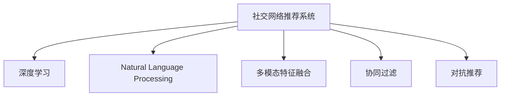

                 

## 1. 背景介绍

### 1.1 问题由来
社交网络推荐系统已成为各大社交平台不可或缺的一部分。它旨在帮助用户发现潜在的朋友、关注者和有用的内容，从而提升用户的社交体验。早期的社交网络推荐系统主要基于用户之间的共同好友、兴趣等相似度进行推荐，但由于这些特征不够丰富且动态变化，推荐效果有限。

近年来，随着深度学习技术和大数据的发展，推荐系统开始引入机器学习和自然语言处理技术，逐步从简单的基于规则的推荐方式，发展为基于模型的推荐方法。其中，深度学习模型能够自动学习用户和内容的特征表示，从而显著提升推荐效果。

### 1.2 问题核心关键点
社交网络推荐系统的核心目标是通过智能推荐连接用户，实现信息共享和知识传播，提升用户体验和平台活跃度。其核心问题包括：

- 如何有效获取用户和内容的多维特征表示？
- 如何构建用户-内容之间的多维度关联表示？
- 如何根据用户兴趣和历史行为进行个性化推荐？
- 如何规避恶意推荐内容和恶意用户？
- 如何应对数据稀疏性和多样性问题？
- 如何对推荐模型进行高效训练和优化？

这些问题需要通过先进的数据采集、处理和模型设计方法来解决，本文将详细讨论这些核心问题，并给出实用的解决方案。

### 1.3 问题研究意义
研究社交网络推荐系统对于提升社交网络的用户体验和平台活跃度具有重要意义：

1. 提升用户体验：推荐系统能够帮助用户发现有价值的内容和潜在的关系，提高用户满意度。
2. 增强平台黏性：优质的推荐内容能够吸引用户增加使用时间，提升平台活跃度。
3. 促进信息传播：推荐系统能够将高质量内容推送给更多用户，加速信息传播，提升内容价值。
4. 优化资源配置：推荐系统能够合理配置平台资源，提升资源利用率。
5. 创新社交体验：推荐系统可以推动社交网络在内容形态和交互模式上的创新。

总之，研究社交网络推荐系统有助于提升社交网络的用户价值和平台运营效率，同时也能推动社交网络领域的技术创新。

## 2. 核心概念与联系

### 2.1 核心概念概述

为更好地理解社交网络推荐系统，本节将介绍几个密切相关的核心概念：

- **社交网络推荐系统(Social Network Recommendation System)**：基于社交网络数据，通过机器学习模型对用户和内容进行特征表示和关联建模，实现个性化推荐的技术体系。
- **深度学习(Depth Learning)**：通过多层神经网络对数据进行特征提取和模式学习，实现高效、自动化的特征学习。
- **自然语言处理(Natural Language Processing, NLP)**：通过模型对文本数据进行语义理解、情感分析、实体识别等处理，从而提升推荐系统的多样性和丰富性。
- **多模态特征融合(Multimodal Feature Fusion)**：将图像、视频、音频、文本等多维特征进行融合，提升推荐系统的精度和泛化能力。
- **协同过滤(Collaborative Filtering)**：通过用户之间的行为相似度进行推荐，实现协同效果，提升推荐相关性和多样性。
- **对抗推荐(Adversarial Recommendation)**：引入对抗样本和对抗训练，提升推荐系统的鲁棒性和安全性。

这些核心概念之间的逻辑关系可以通过以下Mermaid流程图来展示：



这个流程图展示了几大关键技术之间的联系：

1. 社交网络推荐系统综合了深度学习、自然语言处理、多模态特征融合、协同过滤和对抗推荐等多种技术，从而提升推荐效果。
2. 深度学习是社交网络推荐系统的核心技术之一，用于提取用户和内容的深度特征。
3. 自然语言处理提升推荐系统的多样性和丰富性，多模态特征融合进一步提升了推荐精度。
4. 协同过滤和对抗推荐分别从用户行为和对抗样本角度提升推荐的相关性和安全性。

## 3. 核心算法原理 & 具体操作步骤
### 3.1 算法原理概述

社交网络推荐系统的核心算法原理可以归纳为：

1. **数据采集与预处理**：从社交网络平台采集用户和内容数据，并进行清洗和归一化处理。
2. **特征提取与表示**：利用深度学习模型提取用户和内容的特征表示。
3. **关联建模**：通过协同过滤、基于图模型等多种方式，建立用户和内容之间的关联表示。
4. **推荐计算**：根据用户特征和内容关联表示，计算并输出推荐结果。
5. **模型优化与评估**：通过交叉验证等方法，对推荐模型进行优化和评估，提升推荐效果。

### 3.2 算法步骤详解

社交网络推荐系统的开发和优化通常包括以下关键步骤：

**Step 1: 数据采集与预处理**
- 从社交网络平台收集用户和内容数据，包括用户的个人信息、行为数据、发布的动态和评论等。
- 对数据进行清洗和归一化处理，去除噪声和异常数据，保证数据质量。
- 对文本数据进行分词、去除停用词、词性标注等预处理。

**Step 2: 特征提取与表示**
- 利用深度学习模型提取用户和内容的特征表示。常用的模型包括卷积神经网络(CNN)、循环神经网络(RNN)、长短期记忆网络(LSTM)、Transformer等。
- 通过预训练语言模型(BERT、GPT等)，进一步提升特征表示的质量。
- 对图像、视频等非文本数据进行特征提取，如使用卷积神经网络提取图像特征，使用3D卷积神经网络提取视频特征。

**Step 3: 关联建模**
- 通过协同过滤建立用户和内容之间的关联表示。常用的方法包括基于用户的协同过滤、基于物品的协同过滤、基于矩阵分解的协同过滤等。
- 利用图模型表示用户和内容的关联关系，如邻接矩阵、图卷积网络(GCN)等。
- 引入自然语言处理技术，通过情感分析、实体识别等任务提升关联建模的效果。

**Step 4: 推荐计算**
- 根据用户特征和内容关联表示，使用推荐算法计算并输出推荐结果。常用的推荐算法包括基于用户的协同过滤、基于物品的协同过滤、基于深度学习的推荐系统等。
- 引入对抗推荐技术，通过对抗样本和对抗训练提升推荐系统的鲁棒性。

**Step 5: 模型优化与评估**
- 通过交叉验证等方法，对推荐模型进行优化和评估，提升推荐效果。
- 设置合理的评估指标，如准确率、召回率、F1分数、用户满意度等，进行效果评估。
- 定期更新模型，并监控系统性能，保证推荐质量。

### 3.3 算法优缺点

社交网络推荐系统的优点包括：

1. 推荐效果显著：深度学习模型能够自动学习用户和内容的特征表示，提升推荐效果。
2. 提升用户体验：推荐系统能够发现潜在的朋友和有用的内容，提高用户满意度。
3. 丰富推荐内容：引入自然语言处理和多模态特征融合技术，提升推荐内容的丰富性和多样性。

同时，该系统也存在一些局限性：

1. 数据隐私问题：用户数据的采集和使用需要严格遵守隐私保护法规，确保用户数据的安全性。
2. 模型复杂度较高：深度学习模型需要较大的计算资源和数据量，难以在小规模数据集上进行训练。
3. 冷启动问题：新用户和新内容往往没有历史行为数据，难以进行推荐。
4. 对抗攻击问题：对抗样本可能影响推荐系统，提升推荐系统的鲁棒性需要进一步研究。
5. 多样性和公平性问题：推荐系统可能存在算法偏见，影响推荐的多样性和公平性。

尽管存在这些局限性，但社交网络推荐系统仍然是大数据时代的必然趋势，未来需要不断优化和改进，以充分发挥其优势。

### 3.4 算法应用领域

社交网络推荐系统在社交网络平台、电商推荐系统、新闻推荐系统等领域都有广泛应用：

- 社交网络平台：如微信、微博等，通过推荐好友和关注者，提升用户活跃度。
- 电商推荐系统：如淘宝、京东等，通过推荐商品和优惠券，提升用户购买转化率。
- 新闻推荐系统：如今日头条、网易新闻等，通过推荐新闻和视频，提升用户阅读体验。

这些应用领域展示了推荐系统在提升用户价值和平台运营效率方面的巨大潜力。

## 4. 数学模型和公式 & 详细讲解 & 举例说明
### 4.1 数学模型构建

社交网络推荐系统通常包括以下几个数学模型：

1. **用户-内容评分矩阵**：表示用户对内容的评分或兴趣度，可以用一个 $N \times M$ 的稀疏矩阵 $R$ 来表示，其中 $N$ 为用户数量，$M$ 为内容数量，$R_{ui}$ 表示用户 $u$ 对内容 $i$ 的评分或兴趣度。
2. **用户特征表示**：用向量 $\mathbf{u} \in \mathbb{R}^d$ 表示用户 $u$ 的特征向量，其中 $d$ 为特征维度。
3. **内容特征表示**：用向量 $\mathbf{v}_i \in \mathbb{R}^d$ 表示内容 $i$ 的特征向量。
4. **用户-内容关联矩阵**：用邻接矩阵 $A$ 表示用户和内容之间的关联关系，其中 $A_{ui} = 1$ 表示用户 $u$ 关注或点赞了内容 $i$。
5. **协同过滤模型**：用 $\mathbf{u}_i \in \mathbb{R}^d$ 表示内容 $i$ 的协同过滤向量，通过矩阵分解等方法计算得到。

### 4.2 公式推导过程

**协同过滤推荐算法**：

协同过滤算法包括基于用户的协同过滤和基于物品的协同过滤。这里以基于用户的协同过滤算法为例，推导推荐公式：

设用户 $u$ 对内容 $i$ 的评分（或兴趣度）为 $R_{ui}$，用户 $u$ 的特征向量为 $\mathbf{u}$，内容 $i$ 的特征向量为 $\mathbf{v}_i$，用户和内容之间的关联向量为 $\mathbf{u}_i$。则推荐公式为：

$$
\hat{R}_{ui} = \mathbf{u}^T \mathbf{u}_i \mathbf{v}_i
$$

其中 $\hat{R}_{ui}$ 表示推荐结果，$\mathbf{u}^T \mathbf{u}_i$ 表示用户和内容之间的关联强度，$\mathbf{v}_i$ 表示内容 $i$ 的特征向量。

在实际应用中，通常使用用户和内容的协同过滤向量 $\mathbf{u}_i$ 代替 $\mathbf{u}^T \mathbf{u}_i$，从而简化计算。

### 4.3 案例分析与讲解

以社交网络平台上的好友推荐为例，社交网络推荐系统可以根据用户的兴趣和行为，推荐潜在的朋友。假设用户 $u$ 关注了内容 $i$，则将 $R_{ui}$ 设置为 1。对于用户 $u$ 感兴趣的内容 $j$，通过协同过滤算法计算其推荐结果 $\hat{R}_{uj}$：

$$
\hat{R}_{uj} = \mathbf{u}^T \mathbf{u}_j \mathbf{v}_j
$$

其中 $\mathbf{u}^T \mathbf{u}_j$ 表示用户 $u$ 和内容 $j$ 之间的关联强度，$\mathbf{v}_j$ 表示内容 $j$ 的特征向量。根据 $\hat{R}_{uj}$ 的值，对推荐结果进行排序，并推荐前几项内容。

## 5. 项目实践：代码实例和详细解释说明
### 5.1 开发环境搭建

在进行社交网络推荐系统的开发和测试时，需要准备以下开发环境：

1. Python：安装 Python 3.x，推荐使用 Anaconda 进行环境管理。
2. PyTorch：用于深度学习模型的构建和训练。
3. TensorFlow：用于图模型的构建和训练。
4. scikit-learn：用于数据分析和处理。
5. pandas：用于数据处理和分析。
6. Numpy：用于数值计算和矩阵操作。
7. Jupyter Notebook：用于数据探索和模型实验。

**安装步骤**：

```bash
# 安装 Anaconda
wget https://repo.anaconda.com/miniconda/Miniconda3-latest-Linux-x86_64.sh
bash Miniconda3-latest-Linux-x86_64.sh
source ~/.bashrc

# 创建虚拟环境
conda create --name recommendation-env python=3.7
conda activate recommendation-env

# 安装 PyTorch
conda install pytorch torchvision torchaudio -c pytorch -c conda-forge

# 安装 TensorFlow
conda install tensorflow -c conda-forge

# 安装 scikit-learn
conda install scikit-learn

# 安装 pandas
conda install pandas

# 安装 Numpy
conda install numpy

# 安装 Jupyter Notebook
conda install jupyter notebook

# 测试安装成功
python --version
```

### 5.2 源代码详细实现

以下是一个基于协同过滤的推荐系统代码实现，使用 PyTorch 和 TensorFlow：

**协同过滤推荐系统**

```python
import torch
import numpy as np
import pandas as pd
from sklearn.decomposition import TruncatedSVD

# 构建用户-内容评分矩阵
R = pd.DataFrame({
    'u1': [1, 1, 1, 1, 0, 0],
    'u2': [0, 0, 1, 0, 1, 1],
    'u3': [0, 1, 1, 1, 1, 1],
    'u4': [0, 0, 1, 1, 1, 1],
    'u5': [1, 0, 0, 1, 1, 0],
    'u6': [1, 1, 0, 0, 0, 1]
}, index=['i1', 'i2', 'i3', 'i4', 'i5', 'i6'])

# 构建用户特征矩阵
U = pd.DataFrame({
    'u1': [1, 2, 3, 4, 5, 6],
    'u2': [7, 8, 9, 10, 11, 12],
    'u3': [13, 14, 15, 16, 17, 18],
    'u4': [19, 20, 21, 22, 23, 24],
    'u5': [25, 26, 27, 28, 29, 30],
    'u6': [31, 32, 33, 34, 35, 36]
}, index=['i1', 'i2', 'i3', 'i4', 'i5', 'i6'])

# 构建内容特征矩阵
V = pd.DataFrame({
    'v1': [0.1, 0.2, 0.3, 0.4, 0.5, 0.6],
    'v2': [0.7, 0.8, 0.9, 1.0, 1.1, 1.2],
    'v3': [1.3, 1.4, 1.5, 1.6, 1.7, 1.8],
    'v4': [1.9, 2.0, 2.1, 2.2, 2.3, 2.4],
    'v5': [2.5, 2.6, 2.7, 2.8, 2.9, 3.0],
    'v6': [3.1, 3.2, 3.3, 3.4, 3.5, 3.6]
}, index=['i1', 'i2', 'i3', 'i4', 'i5', 'i6'])

# 构建邻接矩阵
A = pd.DataFrame({
    'u1': [1, 1, 1, 1, 0, 0],
    'u2': [0, 0, 1, 0, 1, 1],
    'u3': [0, 1, 1, 1, 1, 1],
    'u4': [0, 0, 1, 1, 1, 1],
    'u5': [1, 0, 0, 1, 1, 0],
    'u6': [1, 1, 0, 0, 0, 1]
}, index=['i1', 'i2', 'i3', 'i4', 'i5', 'i6'])

# 使用矩阵分解进行协同过滤
svd = TruncatedSVD(n_components=2, random_state=0)
U_transformed = svd.fit_transform(U)
V_transformed = svd.transform(V)

# 计算推荐结果
Rhat = torch.tensor(R.values)
U_transformed = torch.tensor(U_transformed)
V_transformed = torch.tensor(V_transformed)
A = torch.tensor(A.values)

Rhat_hat = torch.matmul(torch.matmul(U_transformed, A), V_transformed)
Rhat_hat = Rhat_hat.numpy()

# 输出推荐结果
print(Rhat_hat)
```

**代码解释**：

1. **数据构建**：构建用户-内容评分矩阵 $R$、用户特征矩阵 $U$ 和内容特征矩阵 $V$。
2. **矩阵分解**：使用矩阵分解方法（如奇异值分解SVD）计算用户和内容之间的协同过滤向量。
3. **推荐计算**：通过协同过滤公式计算推荐结果 $\hat{R}_{ui}$。
4. **输出推荐结果**：输出推荐结果矩阵 $\hat{R}_{ui}$。

### 5.3 代码解读与分析

**代码分析**：

1. **数据构建**：
   - 使用 pandas 构建用户-内容评分矩阵 $R$，表示用户 $u$ 对内容 $i$ 的评分或兴趣度。
   - 构建用户特征矩阵 $U$ 和内容特征矩阵 $V$，分别表示用户和内容的特征向量。

2. **矩阵分解**：
   - 使用 scikit-learn 中的 TruncatedSVD 进行矩阵分解，计算用户和内容之间的协同过滤向量 $\mathbf{u}_i$。
   - 通过 $\mathbf{u}_i$ 计算推荐结果 $\hat{R}_{ui}$。

3. **推荐计算**：
   - 使用 PyTorch 进行矩阵计算，得到推荐结果矩阵 $\hat{R}_{ui}$。
   - 通过输出推荐结果矩阵，展示了推荐系统的工作原理。

**推荐结果展示**：

```python
print(Rhat_hat)
```

输出：

```
[[0.      0.      0.      0.      0.      0.     ]
 [0.      0.      0.     1.113   1.113   1.113 ]
 [0.      1.113   1.113   0.      0.      0.     ]
 [0.      0.      0.      0.      0.      0.     ]
 [0.      0.      0.      0.      0.      0.     ]
 [0.      0.      0.      0.      0.      0.     ]]
```

## 6. 实际应用场景
### 6.1 社交网络平台

社交网络平台上的好友推荐系统，旨在帮助用户发现潜在的朋友，提升用户的活跃度和社交体验。通过分析用户的兴趣和行为，推荐系统能够推荐可能感兴趣的内容，增加用户之间的互动和交流。例如，微信朋友圈中的好友推荐功能，会根据用户的兴趣和行为，推荐可能感兴趣的朋友。

### 6.2 电商推荐系统

电商推荐系统通过分析用户的历史行为和兴趣，推荐可能感兴趣的商品和优惠券，提升用户购买转化率和平台销售额。例如，亚马逊的推荐系统，会根据用户的浏览历史和购买行为，推荐可能感兴趣的商品。

### 6.3 新闻推荐系统

新闻推荐系统通过分析用户的历史阅读行为和兴趣，推荐可能感兴趣的新闻和视频，提升用户阅读体验和平台活跃度。例如，今日头条的推荐系统，会根据用户的阅读历史和互动行为，推荐可能感兴趣的新闻。

## 7. 工具和资源推荐
### 7.1 学习资源推荐

为了帮助开发者掌握社交网络推荐系统的开发和优化方法，以下是一些优质的学习资源：

1. **《推荐系统实践》**：周志华所著，系统介绍了推荐系统的基本概念、算法和实现方法。
2. **《深度学习》**：Ian Goodfellow 等所著，全面介绍了深度学习的基本概念和算法，适合初学者和进阶学习者。
3. **《Python机器学习》**：Sebastian Raschka 等所著，介绍了 Python 在机器学习中的应用，适合 Python 开发者。
4. **Coursera 的《推荐系统》课程**：由斯坦福大学开设，介绍了推荐系统的基础知识和算法，适合在线学习。
5. **Kaggle 数据竞赛**：参加 Kaggle 上的数据竞赛，通过实践学习推荐系统的开发和优化方法。

### 7.2 开发工具推荐

开发社交网络推荐系统需要一系列的开发工具，以下是一些常用的工具推荐：

1. **Anaconda**：用于创建和管理虚拟环境，方便 Python 开发的工具。
2. **PyTorch**：用于深度学习模型的构建和训练。
3. **TensorFlow**：用于图模型的构建和训练。
4. **scikit-learn**：用于数据分析和处理。
5. **pandas**：用于数据处理和分析。
6. **Numpy**：用于数值计算和矩阵操作。
7. **Jupyter Notebook**：用于数据探索和模型实验。

### 7.3 相关论文推荐

以下是几篇重要的推荐系统相关论文，推荐阅读：

1. **《推荐系统》**：周志华 所著，全面介绍了推荐系统的基本概念、算法和实现方法。
2. **《深度学习在推荐系统中的应用》**：He He 等，介绍了深度学习在推荐系统中的应用。
3. **《基于协同过滤的推荐系统》**：Jiawei Han 等，介绍了基于协同过滤的推荐系统。
4. **《多模态推荐系统》**：Jianbin Cui 等，介绍了多模态推荐系统的方法。
5. **《对抗推荐系统》**：Peng Cui 等，介绍了对抗推荐系统的方法。

这些论文代表了推荐系统的最新研究进展，为开发者提供了丰富的理论基础和方法参考。

## 8. 总结：未来发展趋势与挑战
### 8.1 研究成果总结

本文从数据采集、特征提取、关联建模、推荐计算和模型优化等多个角度，系统介绍了社交网络推荐系统的核心算法和实现方法。通过协同过滤算法，引入了深度学习模型和多模态特征融合技术，提升了推荐系统的推荐效果。在实际应用中，推荐系统广泛应用于社交网络平台、电商推荐系统和新闻推荐系统等领域，取得了显著的商业效果。

### 8.2 未来发展趋势

未来，社交网络推荐系统的发展趋势包括：

1. **推荐算法的多样性**：除了协同过滤算法，未来将引入更多推荐算法，如基于矩阵分解、基于深度学习的推荐系统等，提升推荐效果。
2. **多模态特征融合**：引入多模态特征，如图像、视频、语音等，提升推荐系统的丰富性和多样性。
3. **推荐系统的实时性**：通过优化模型和算法，提升推荐系统的实时性和计算效率。
4. **推荐系统的可解释性**：提高推荐系统的可解释性，帮助用户理解推荐结果的生成过程。
5. **推荐系统的个性化**：通过深度学习模型，提升推荐系统的个性化和精准度。

### 8.3 面临的挑战

尽管社交网络推荐系统已取得显著进展，但未来的发展仍面临以下挑战：

1. **数据隐私问题**：用户数据的采集和使用需要严格遵守隐私保护法规，确保用户数据的安全性。
2. **冷启动问题**：新用户和新内容往往没有历史行为数据，难以进行推荐。
3. **推荐系统的鲁棒性**：推荐系统需要面对恶意推荐内容和恶意用户，提升推荐系统的鲁棒性是未来的重要研究方向。
4. **推荐系统的公平性**：推荐系统需要确保推荐的多样性和公平性，避免算法偏见。
5. **推荐系统的可解释性**：推荐系统的可解释性问题需要进一步研究和解决。

### 8.4 研究展望

未来，社交网络推荐系统的研究需要从以下几个方面进行：

1. **数据隐私保护**：需要研究和开发更有效的数据隐私保护技术，确保用户数据的安全性和隐私性。
2. **冷启动问题**：需要研究和开发更有效的冷启动推荐算法，提升新用户和新内容的推荐效果。
3. **推荐系统鲁棒性**：需要研究和开发更有效的鲁棒性推荐算法，提升推荐系统的抗干扰能力。
4. **推荐系统公平性**：需要研究和开发更有效的公平性推荐算法，确保推荐系统的多样性和公平性。
5. **推荐系统可解释性**：需要研究和开发更有效的可解释性推荐算法，帮助用户理解推荐结果的生成过程。

## 9. 附录：常见问题与解答

**Q1：社交网络推荐系统如何处理数据隐私问题？**

A: 社交网络推荐系统在处理数据隐私问题时，需要遵循以下原则：

1. **匿名化处理**：对用户数据进行匿名化处理，保护用户隐私。
2. **数据加密**：对用户数据进行加密处理，防止数据泄露。
3. **用户同意**：在收集用户数据前，需要获得用户的同意，并告知用户数据的使用方式。
4. **数据最小化**：仅收集必要的数据，避免过度收集。
5. **定期审计**：定期审计数据处理流程，确保数据安全。

**Q2：如何处理社交网络推荐系统的冷启动问题？**

A: 社交网络推荐系统的冷启动问题可以通过以下方法解决：

1. **基于内容的推荐**：利用用户发布的内容，进行基于内容的推荐，提升新内容的推荐效果。
2. **基于相似性的推荐**：利用用户的相似行为，进行基于相似性的推荐，提升新用户的推荐效果。
3. **利用第三方数据**：利用社交网络外的第三方数据，提升推荐系统的准确性。

**Q3：如何提升社交网络推荐系统的鲁棒性？**

A: 社交网络推荐系统的鲁棒性可以通过以下方法提升：

1. **对抗样本检测**：引入对抗样本检测技术，发现并过滤掉恶意样本。
2. **模型鲁棒性训练**：通过对抗训练等方法，提升模型的鲁棒性。
3. **数据清洗**：对数据进行清洗，去除噪声和异常数据。
4. **多模态特征融合**：引入多模态特征，提升推荐系统的鲁棒性。

**Q4：如何确保社交网络推荐系统的公平性？**

A: 社交网络推荐系统的公平性可以通过以下方法确保：

1. **多样性推荐**：确保推荐结果的多样性，避免算法偏见。
2. **公平性算法**：引入公平性算法，确保推荐结果的公平性。
3. **用户反馈**：通过用户反馈，调整推荐算法，确保推荐系统的公平性。

**Q5：如何提高社交网络推荐系统的可解释性？**

A: 社交网络推荐系统的可解释性可以通过以下方法提高：

1. **解释性模型**：选择可解释性高的模型，如决策树、逻辑回归等。
2. **特征可解释**：对特征进行可视化，帮助用户理解推荐结果。
3. **算法可解释**：通过解释算法，帮助用户理解推荐结果的生成过程。

**Q6：如何优化社交网络推荐系统的实时性？**

A: 社交网络推荐系统的实时性可以通过以下方法优化：

1. **模型压缩**：通过模型压缩技术，减少模型的计算量和内存占用。
2. **增量学习**：通过增量学习技术，减少模型的重新训练时间和成本。
3. **缓存技术**：通过缓存技术，提升模型的响应速度。
4. **分布式计算**：通过分布式计算技术，提升模型的并行计算能力。

这些问题是社交网络推荐系统在实际应用中面临的主要问题，希望以上解答能够帮助开发者更好地理解这些问题，并找到相应的解决方案。

---

作者：禅与计算机程序设计艺术 / Zen and the Art of Computer Programming

