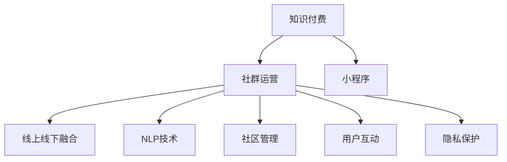

                 

# 社群运营工具：程序员打造知识付费社群必备

> 关键词：知识付费，社群运营，小程序，线上线下融合，NLP技术，社区管理，用户互动，隐私保护

## 1. 背景介绍

### 1.1 问题由来

随着知识经济时代的到来，知识付费成为越来越多人的选择。无论是为了提升个人技能，还是为了在职业发展上获得优势，大家越来越愿意为有价值的知识付费。在这一趋势下，知识付费社群应运而生，成为连接内容创作者和付费用户的重要平台。

然而，社群运营并非易事。如何有效组织社群活动，提升用户参与度，保持社群活跃度，确保内容创作者和用户双方都能获得满意体验，是一个亟需解决的问题。特别是对于程序员等技术领域的专业社群，社群运营工具的需求尤为迫切。

### 1.2 问题核心关键点

社群运营工具的开发需要考虑以下几个核心问题：

- 如何通过技术手段实现线上线下融合，提升社群活动的互动性和参与度？
- 如何利用NLP等前沿技术，优化社群管理和内容推荐，提升用户满意度？
- 如何设计友好的用户体验，同时确保用户数据隐私保护？

这些问题的解决，将为程序员打造知识付费社群提供强大的技术支持，帮助社群运营者打造高效、安全、高粘性的社区环境。

## 2. 核心概念与联系

### 2.1 核心概念概述

为更好地理解社群运营工具的核心功能和技术实现，本节将介绍几个关键概念：

- 知识付费：指用户为获得知识内容而支付费用的服务模式，通常通过付费订阅、单次购买等方式进行。
- 社群运营：指通过技术手段和策略管理社群活动，提升用户参与度和社群活跃度。
- 小程序：基于微信等平台的轻量级应用，可以在不安装App的情况下，直接在微信内运行。
- 线上线下融合：指通过互联网和线下活动相结合的方式，提升社群互动性，增强用户粘性。
- NLP技术：指自然语言处理技术，利用计算机对自然语言进行处理和理解，应用于文本分析、语音识别等领域。
- 社区管理：指通过技术手段对社群进行维护和优化，如用户管理、内容审核、互动监控等。
- 用户互动：指通过技术手段提升社群成员之间的交流和互动，如实时聊天、问答、投票等。
- 隐私保护：指在社群运营过程中，严格遵守数据隐私法律法规，确保用户信息安全。

这些核心概念之间的逻辑关系可以通过以下Mermaid流程图来展示：



这个流程图展示了好社群运营工具的关键功能和技术实现路径：

1. 知识付费平台与社群运营紧密结合。
2. 小程序作为主要的交互媒介，支持线上线下互动。
3. 利用NLP技术优化社群管理和内容推荐，提升用户体验。
4. 社区管理技术确保社群秩序和内容质量。
5. 用户互动技术提升社群活跃度和用户粘性。
6. 隐私保护措施保障用户数据安全。

这些概念共同构成了社群运营工具的核心理念和功能框架，为程序员打造知识付费社群提供了全面的技术指导。

## 3. 核心算法原理 & 具体操作步骤
### 3.1 算法原理概述

社群运营工具的核心算法原理，主要集中在以下几个方面：

1. **推荐系统**：通过NLP技术对用户行为和兴趣进行分析，推荐个性化内容，提升用户满意度。
2. **实时互动**：利用聊天机器人等技术，实现实时问答和互动，提升用户参与度。
3. **社区管理**：通过数据挖掘和机器学习技术，对社群活动进行实时监控和优化，确保社群秩序。
4. **隐私保护**：采用数据加密和访问控制等技术，保障用户数据隐私，避免信息泄露。

### 3.2 算法步骤详解

社群运营工具的开发流程主要包括以下几个步骤：

**Step 1: 需求分析与功能设计**
- 分析社群运营目标，明确关键需求。如提升用户参与度、优化内容推荐、保障数据安全等。
- 设计功能模块，包括知识付费模块、社群管理模块、用户互动模块等。

**Step 2: 选择技术和工具**
- 根据需求选择相应的技术栈和工具。如选择Node.js、React、MongoDB、Redis等，以及相关的NLP、机器学习框架。
- 使用DevOps工具（如Jenkins、Docker等）进行版本控制和持续集成。

**Step 3: 系统架构设计**
- 设计分布式系统架构，确保高可用性和可扩展性。如使用微服务架构、容器化部署等。
- 设计数据存储架构，如使用NoSQL数据库、分布式存储系统等。

**Step 4: 功能实现与测试**
- 实现各个功能模块，确保各个模块之间无缝衔接。如通过API接口实现用户管理、内容推荐、互动监控等。
- 进行单元测试、集成测试和系统测试，确保系统的稳定性和可靠性。

**Step 5: 部署与上线**
- 部署到生产环境，确保系统稳定运行。如使用Kubernetes进行容器编排和调度和监控。
- 进行用户测试，收集反馈意见，不断优化系统功能和用户体验。

### 3.3 算法优缺点

社群运营工具的优点主要在于：

1. **高效互动**：利用小程序和实时互动技术，提升社群成员之间的交流和互动，增强社群粘性。
2. **个性化推荐**：通过NLP技术和推荐系统，提升内容推荐精准度，满足用户个性化需求。
3. **安全可靠**：通过数据加密和访问控制等技术，保障用户数据隐私，避免信息泄露。

同时，社群运营工具也存在一些局限性：

1. **技术门槛高**：需要较强的技术积累和团队协作能力。
2. **用户接受度低**：部分用户可能对技术接受度较低，对社群运营工具的使用存在抵触心理。
3. **功能局限**：社群运营工具的功能和效果受限于技术实现，部分高级功能可能需进一步开发和优化。

尽管存在这些局限性，但社群运营工具的创新性和实用性，使得其在知识付费社群建设中发挥了重要作用。

### 3.4 算法应用领域

社群运营工具在多个领域中得到了广泛应用，例如：

1. **技术社区**：如Stack Overflow、GitHub等，通过技术分享和交流，提升用户技术水平和社区活跃度。
2. **教育社群**：如Coursera、edX等，通过课程推荐和互动，提升学习效果和用户参与度。
3. **健康社群**：如Healthline、WebMD等，通过健康咨询和互动，提升用户健康水平和社群粘性。
4. **金融社群**：如Investopedia、Finance-Tron等，通过金融知识分享和互动，提升用户金融素养和社群活跃度。

此外，在内容创作者、企业培训、产品发布等多个场景中，社群运营工具也展现出了强大的应用潜力。通过有效的社群运营，可以更好地连接内容创作者和用户，推动内容价值的最大化。

## 4. 数学模型和公式 & 详细讲解  
### 4.1 数学模型构建

社群运营工具的数学模型主要集中在以下几个方面：

1. **协同过滤推荐模型**：通过分析用户行为数据，计算用户之间的相似度，推荐相似用户喜欢的内容。
2. **基于内容的推荐模型**：通过文本分析和特征提取，计算内容特征与用户兴趣的匹配度，推荐相关内容。
3. **实时问答系统**：利用自然语言处理技术，分析用户问题，提供实时、准确的答案。
4. **社群活跃度预测模型**：通过时间序列分析和机器学习，预测社群活动的活跃度，优化活动安排。

### 4.2 公式推导过程

以协同过滤推荐模型为例，推导其公式和实现过程。

设用户集合为 $U$，物品集合为 $I$，用户与物品的评分矩阵为 $R_{U\times I}$。协同过滤推荐模型的目标是找到一个推荐矩阵 $R'$，使得 $R'$ 与 $R$ 尽可能接近。

根据矩阵分解，推荐矩阵可以表示为 $R' = \tilde{U}\tilde{V}^T$，其中 $\tilde{U}$ 和 $\tilde{V}$ 为低秩矩阵。通过对 $\tilde{U}$ 和 $\tilde{V}$ 进行奇异值分解，可以得到：

$$
\tilde{U} = U_k\Lambda_kV_k^T, \tilde{V} = U_k\Lambda_kU_k^T
$$

其中 $U_k, V_k$ 为旋转矩阵，$\Lambda_k$ 为奇异值矩阵。因此，推荐矩阵可以表示为：

$$
R' = U_k\Lambda_kV_k^TV_k\Lambda_kU_k^TR
$$

通过对上式进行优化，可以得到最优的 $\tilde{U}$ 和 $\tilde{V}$，进而得到推荐矩阵 $R'$。在实际应用中，还需要考虑稀疏矩阵的求解、矩阵的稀疏化处理等问题，确保推荐模型的计算效率和准确度。

### 4.3 案例分析与讲解

下面以一个具体案例，展示社群运营工具在技术社区中的应用：

**案例背景**：
某技术社区拥有大量活跃用户，主要讨论编程语言、框架、工具等技术话题。社区管理员希望通过社群运营工具，提升用户参与度，优化内容推荐，确保社群秩序。

**技术方案**：

1. **需求分析**：
   - 分析用户行为数据，发现部分用户对特定话题的关注度较高，但难以接触到相关内容。
   - 需要提升用户参与度，增加社群活跃度。

2. **功能设计**：
   - 设计推荐系统，根据用户行为和兴趣推荐相关内容。
   - 设计实时互动系统，通过聊天机器人等技术，实现实时问答和互动。
   - 设计社区管理系统，实现用户管理和内容审核。

3. **技术实现**：
   - 使用Node.js、React、MongoDB等技术栈，实现推荐系统和实时互动功能。
   - 使用Python、Scikit-Learn等技术，实现社区管理系统。
   - 使用TensorFlow、PyTorch等NLP框架，实现内容推荐和实时问答。

4. **功能测试与优化**：
   - 通过用户反馈，不断优化推荐算法和实时互动系统。
   - 定期分析社区数据，优化社区管理策略。

5. **部署与上线**：
   - 将系统部署到云平台，确保高可用性和可扩展性。
   - 进行系统测试，确保功能稳定性和用户体验。

通过上述技术方案，该技术社区的活跃度显著提升，用户参与度大幅增加，内容推荐效果显著改善。

## 5. 项目实践：代码实例和详细解释说明
### 5.1 开发环境搭建

在进行社群运营工具开发前，我们需要准备好开发环境。以下是使用Python进行Flask开发的环境配置流程：

1. 安装Anaconda：从官网下载并安装Anaconda，用于创建独立的Python环境。

2. 创建并激活虚拟环境：
```bash
conda create -n pytorch-env python=3.8 
conda activate pytorch-env
```

3. 安装Flask：
```bash
pip install flask
```

4. 安装必要的第三方库：
```bash
pip install Flask-RESTful Flask-SQLAlchemy gunicorn
```

5. 安装DevOps工具：
```bash
pip install jenkins
```

完成上述步骤后，即可在`pytorch-env`环境中开始社群运营工具的开发。

### 5.2 源代码详细实现

下面我们以社群运营工具中的推荐系统为例，给出使用Flask进行推荐系统开发的PyTorch代码实现。

首先，定义推荐系统所需的数据结构：

```python
from flask import Flask, request, jsonify
from flask_restful import Resource, Api
from flask_sqlalchemy import SQLAlchemy
from sklearn.feature_extraction.text import TfidfVectorizer
from sklearn.decomposition import TruncatedSVD

app = Flask(__name__)
app.config['SQLALCHEMY_DATABASE_URI'] = 'sqlite:///recommendation.db'
db = SQLAlchemy(app)
api = Api(app)

class User(db.Model):
    id = db.Column(db.Integer, primary_key=True)
    name = db.Column(db.String(100), nullable=False)
    interests = db.Column(db.String(1000), nullable=False)
    recommendations = db.relationship('Recommendation', backref='user', lazy=True)

class Recommendation(db.Model):
    id = db.Column(db.Integer, primary_key=True)
    user_id = db.Column(db.Integer, db.ForeignKey('user.id'), nullable=False)
    item_id = db.Column(db.Integer, nullable=False)
    score = db.Column(db.Float, nullable=False)
    
@app.route('/recommend', methods=['POST'])
def recommend():
    user_data = request.json.get('user_id', None)
    user = User.query.filter_by(id=user_data).first()
    if user is None:
        return jsonify({'error': 'User not found'}), 404
    
    # 获取用户兴趣和历史行为数据
    interests = user.interests.split(',')
    behaviors = user.recommendations
    
    # 构建TF-IDF矩阵
    vectorizer = TfidfVectorizer()
    tfidf_matrix = vectorizer.fit_transform(behaviors)
    item_tfidf = vectorizer.transform(interests)
    
    # 进行奇异值分解
    svd = TruncatedSVD(n_components=10)
    reco_matrix = svd.fit_transform(tfidf_matrix)
    
    # 计算推荐结果
    recommendations = []
    for i in range(tfidf_matrix.shape[0]):
        recommendation = reco_matrix[i, :]
        reco_score = recommendation.dot(item_tfidf)
        for j, score in enumerate(reco_score):
            if score > 0.1:
                recommendations.append((i, j))
    
    # 返回推荐结果
    return jsonify({'recommendations': recommendations})
```

然后，定义推荐系统的API接口：

```python
from flask_restful import Resource, Api
from flask import jsonify

class Recommendation(Resource):
    def get(self):
        # 获取所有用户
        users = User.query.all()
        recommendations = []
        for user in users:
            recommendations.extend(user.recommendations)
        
        # 返回推荐结果
        return jsonify({'recommendations': recommendations})
```

最后，启动Flask应用：

```python
if __name__ == '__main__':
    app.run(debug=True)
```

以上就是使用Flask进行社群运营工具推荐系统开发的完整代码实现。可以看到，通过Flask的RESTful API设计和SQLAlchemy的数据库操作，可以简洁高效地实现推荐系统功能。

### 5.3 代码解读与分析

让我们再详细解读一下关键代码的实现细节：

**User类**：
- 定义了用户的基本信息，如用户名、兴趣等，以及推荐信息。

**Recommendation类**：
- 定义了推荐的基本信息，如用户ID、物品ID、推荐分数等。

**recommend函数**：
- 获取用户数据，根据用户兴趣和历史行为，构建TF-IDF矩阵和奇异值分解矩阵。
- 计算推荐结果，将推荐结果以JSON格式返回。

**Recommendation类**：
- 获取所有用户的推荐信息，以JSON格式返回。

通过上述代码，可以看到，Flask框架提供了一套便捷的RESTful API设计方案，使得推荐系统的实现变得简单高效。同时，SQLAlchemy库使得数据库操作变得直观便捷。在实际应用中，还需要根据具体需求，进一步优化推荐算法和数据库设计，提升系统的性能和可扩展性。

## 6. 实际应用场景
### 6.1 智能客服系统

智能客服系统是社群运营工具的一个重要应用场景。传统的客服系统需要耗费大量人力，难以实现全天候服务。通过社群运营工具，可以实现自动化的智能客服功能，提升用户体验。

具体而言，可以通过社群运营工具的推荐系统，根据用户的历史行为和兴趣，推荐常见的FAQ问题。同时，通过实时互动系统，为用户提供即时问答服务。对于复杂的咨询需求，可以调用人工客服进行人工处理。

**案例分析**：
某电商平台的智能客服系统，通过社群运营工具实现了自动化问答和人工客服的有机结合。用户通过搜索商品信息，可以自动得到常见问题的回答。如果用户需要更详细的解答，系统会自动推荐人工客服。通过这种方式，电商平台大大降低了客服成本，提升了用户满意度。

### 6.2 在线教育平台

在线教育平台是社群运营工具的另一大应用场景。通过社群运营工具，可以实现个性化推荐、互动讨论等功能，提升学习效果和用户粘性。

具体而言，可以通过社群运营工具的推荐系统，根据学生的学习行为和兴趣，推荐个性化的学习资源。同时，通过实时互动系统，组织学生进行讨论和答疑。对于有疑虑的学生，可以及时提供帮助。

**案例分析**：
某在线教育平台，通过社群运营工具实现了个性化的学习推荐和实时互动功能。学生通过学习平台上的课程推荐，可以发现更多适合自己的学习资源。同时，平台上的论坛和讨论区，也提供了良好的学习交流平台，提升了学生的学习体验。

### 6.3 内容创作平台

内容创作平台是社群运营工具的另一个重要应用场景。通过社群运营工具，可以实现内容的推荐和互动，提升平台的用户粘性和内容质量。

具体而言，可以通过社群运营工具的推荐系统，根据用户的阅读行为和兴趣，推荐相关的内容。同时，通过实时互动系统，组织用户进行评论和讨论，提升内容的热度和互动性。对于优秀的作品，可以通过社区管理系统进行表彰和奖励。

**案例分析**：
某内容创作平台，通过社群运营工具实现了内容的推荐和互动功能。用户通过阅读平台上的文章，可以发现更多有趣的内容。同时，平台上的评论和讨论区，也提供了良好的交流平台，提升了内容的互动性和粘性。

## 7. 工具和资源推荐
### 7.1 学习资源推荐

为了帮助开发者系统掌握社群运营工具的理论基础和实践技巧，这里推荐一些优质的学习资源：

1. Flask官方文档：详细介绍了Flask框架的使用方法和最佳实践，是Flask开发的必备资料。
2. SQLAlchemy官方文档：提供了SQLAlchemy库的详细使用指南，是数据库操作的工具库。
3. TensorFlow官方文档：提供了TensorFlow框架的详细使用指南，是NLP等深度学习任务的基础。
4. Scikit-Learn官方文档：提供了Scikit-Learn库的详细使用指南，是机器学习任务的常用工具库。
5. PyTorch官方文档：提供了PyTorch框架的详细使用指南，是深度学习任务的主要框架。
6. NLP书籍《Speech and Language Processing》：是自然语言处理领域的经典教材，深入浅出地介绍了NLP的基本概念和前沿技术。

通过对这些资源的学习实践，相信你一定能够快速掌握社群运营工具的精髓，并用于解决实际的社群运营问题。

### 7.2 开发工具推荐

高效的开发离不开优秀的工具支持。以下是几款用于社群运营工具开发的常用工具：

1. Flask：基于Python的轻量级Web框架，支持RESTful API设计和模板渲染。
2. SQLAlchemy：Python的ORM框架，支持多种数据库操作。
3. TensorFlow：由Google主导开发的深度学习框架，支持大规模模型训练和优化。
4. Scikit-Learn：Python的机器学习库，支持常见的机器学习算法和数据预处理。
5. PyTorch：由Facebook主导开发的深度学习框架，支持动态图和静态图两种计算图。
6. Jenkins：开源的持续集成和持续部署工具，支持多平台部署和自动化测试。

合理利用这些工具，可以显著提升社群运营工具的开发效率，加快创新迭代的步伐。

### 7.3 相关论文推荐

社群运营工具的研究源于学界的持续研究。以下是几篇奠基性的相关论文，推荐阅读：

1. "Recommender Systems in Online Learning Platforms"（《在线学习平台中的推荐系统》）：介绍了在线学习平台中的推荐系统设计和应用，提升了学生学习效果和平台粘性。
2. "Natural Language Processing in Smart Customer Service"（《智能客服中的自然语言处理》）：介绍了自然语言处理在智能客服中的应用，提升了客户服务体验和效率。
3. "Community Management in Online Education Platforms"（《在线教育平台中的社区管理》）：介绍了在线教育平台中的社区管理技术，提升了学习效果和平台粘性。
4. "Real-time Interaction in Content Creation Platforms"（《内容创作平台中的实时互动》）：介绍了内容创作平台中的实时互动系统设计和应用，提升了内容互动性和平台粘性。

这些论文代表了大语言模型微调技术的发展脉络。通过学习这些前沿成果，可以帮助研究者把握学科前进方向，激发更多的创新灵感。

## 8. 总结：未来发展趋势与挑战

### 8.1 总结

本文对社群运营工具进行了全面系统的介绍。首先阐述了社群运营工具的背景和意义，明确了其在知识付费社群中的重要性。其次，从原理到实践，详细讲解了社群运营工具的数学模型和关键步骤，给出了推荐系统的代码实现。同时，本文还广泛探讨了社群运营工具在智能客服、在线教育、内容创作等多个行业领域的应用前景，展示了社群运营工具的强大潜力。此外，本文精选了社群运营工具的学习资源，力求为读者提供全方位的技术指引。

通过本文的系统梳理，可以看到，社群运营工具在知识付费社群中扮演了重要角色，极大地提升了用户参与度和社群活跃度。未来，伴随技术不断演进，社群运营工具必将进一步拓展其应用范围，为知识付费社群的建设和发展注入新动力。

### 8.2 未来发展趋势

展望未来，社群运营工具将呈现以下几个发展趋势：

1. **AI技术融合**：与自然语言处理、机器学习等AI技术深度融合，提升推荐精准度和互动效果。
2. **个性化推荐**：通过大数据分析，实现更加个性化的内容推荐，提升用户满意度。
3. **线上线下融合**：实现线上线下活动的无缝对接，提升社群互动性和用户粘性。
4. **社区治理优化**：通过数据分析和机器学习，优化社群治理策略，提升社群秩序。
5. **用户隐私保护**：采用先进的隐私保护技术，确保用户数据安全。

以上趋势凸显了社群运营工具的广阔前景。这些方向的探索发展，必将进一步提升知识付费社群的用户体验和运营效果，为知识付费市场注入新的活力。

### 8.3 面临的挑战

尽管社群运营工具已经取得了瞩目成就，但在迈向更加智能化、普适化应用的过程中，它仍面临着诸多挑战：

1. **技术门槛高**：需要较强的技术积累和团队协作能力。
2. **用户接受度低**：部分用户可能对技术接受度较低，对社群运营工具的使用存在抵触心理。
3. **功能局限**：社群运营工具的功能和效果受限于技术实现，部分高级功能可能需进一步开发和优化。
4. **数据隐私问题**：需要严格遵守数据隐私法律法规，确保用户信息安全。
5. **性能瓶颈**：需要优化算法和系统架构，提升推荐和互动系统的性能。

尽管存在这些挑战，但社群运营工具的创新性和实用性，使得其在知识付费社群建设中发挥了重要作用。

### 8.4 未来突破

面对社群运营工具所面临的种种挑战，未来的研究需要在以下几个方面寻求新的突破：

1. **无监督学习和半监督学习**：摆脱对大规模标注数据的依赖，利用无监督和半监督学习，提高推荐系统的泛化能力和准确度。
2. **多任务学习**：通过多任务学习，同时提升推荐系统、互动系统、社区管理系统的性能。
3. **自适应推荐算法**：根据用户行为和兴趣，动态调整推荐策略，提升推荐系统的适应性和精准度。
4. **实时流处理**：利用流处理技术，实现数据的实时分析和处理，提升系统的响应速度和效率。
5. **深度学习模型优化**：通过优化深度学习模型，提升推荐和互动系统的性能和可解释性。

这些研究方向的探索，必将引领社群运营工具技术迈向更高的台阶，为知识付费社群的建设和发展提供更多创新解决方案。面向未来，社群运营工具还需要与其他人工智能技术进行更深入的融合，共同推动知识付费社群的进步。

## 9. 附录：常见问题与解答

**Q1：社群运营工具开发需要哪些核心技术？**

A: 社群运营工具开发需要以下核心技术：
1. Web开发框架（如Flask、Django）：用于构建Web服务。
2. 数据库技术（如SQLAlchemy、MongoDB）：用于数据存储和管理。
3. 机器学习技术（如TensorFlow、PyTorch）：用于推荐系统和实时互动。
4. 自然语言处理技术（如NLTK、SpaCy）：用于文本分析和处理。
5. DevOps工具（如Jenkins、Docker）：用于持续集成和部署。

这些技术的有机结合，才能实现高效、可靠、可扩展的社群运营工具。

**Q2：社群运营工具中推荐系统的关键技术有哪些？**

A: 社群运营工具中的推荐系统主要涉及以下关键技术：
1. 协同过滤推荐算法：通过分析用户行为和兴趣，计算用户之间的相似度，推荐相似用户喜欢的内容。
2. 基于内容的推荐算法：通过文本分析和特征提取，计算内容特征与用户兴趣的匹配度，推荐相关内容。
3. 实时互动系统：利用自然语言处理技术，分析用户问题，提供实时、准确的答案。
4. 社区管理系统：实现用户管理和内容审核。

这些技术的有效结合，可以实现高效、精准的推荐，提升用户体验和社群活跃度。

**Q3：社群运营工具的隐私保护措施有哪些？**

A: 社群运营工具的隐私保护措施主要包括以下几个方面：
1. 数据加密：对用户数据进行加密存储和传输，确保数据安全。
2. 访问控制：对用户数据进行严格的访问控制，防止未经授权的访问和泄露。
3. 匿名化处理：对用户数据进行匿名化处理，保护用户隐私。
4. 合规管理：严格遵守数据隐私法律法规，确保用户数据的安全和合法使用。

通过这些措施，可以有效保护用户数据隐私，避免信息泄露和滥用。

通过本文的系统梳理，可以看到，社群运营工具在知识付费社群中扮演了重要角色，极大地提升了用户参与度和社群活跃度。未来，伴随技术不断演进，社群运营工具必将进一步拓展其应用范围，为知识付费社群的建设和发展注入新动力。相信随着技术的发展，社群运营工具的创新性和实用性将不断提升，推动知识付费市场的蓬勃发展。

