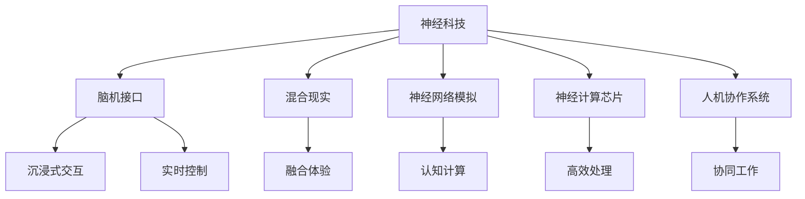

                 

# 神经科技创业：人机交互的革命性突破

> 关键词：神经科技,人机交互,混合现实,脑机接口,神经网络,创业实践

## 1. 背景介绍

### 1.1 问题由来
近年来，随着人工智能技术的飞速发展，神经科技(Neurotechnology)开始成为科技创新的新前沿。它融合了神经科学、人工智能、计算机科学等多个领域，旨在通过解码和模拟大脑信号，实现人与机器的高效互动。神经科技领域的创业，不仅有望改变人类的生产生活方式，还可能带来更为深远的社会变革。

神经科技的最新进展，包括脑机接口(Brain-Computer Interface, BCI)、混合现实(Mixed Reality, MR)、神经网络模拟等，正在为创业提供了前所未有的机遇。尤其是随着高性能计算和深度学习模型的进步，这些领域出现了许多具有潜力的商业应用，吸引了众多创新者和资本的关注。

### 1.2 问题核心关键点
神经科技创业的核心在于如何利用先进的神经科学技术，开发能够深刻改变人机交互方式的新产品。关键点包括：

1. **脑机接口(BCI)**：通过直接解码人脑信号，实现人与机器的无触交互。
2. **混合现实(MR)**：将虚拟与现实相结合，提供沉浸式的用户体验。
3. **神经网络模拟**：通过模拟神经网络结构与功能，实现认知计算。
4. **神经计算芯片**：研发能够高效处理神经信号的专用硬件。
5. **人机协作系统**：开发能够有效融合人类与AI的协作系统。

这些关键技术正在被越来越多地应用于医疗、娱乐、教育、游戏等多个领域，催生了新的商业模式和应用场景。

### 1.3 问题研究意义
神经科技创业具有以下重要意义：

1. **开辟新市场**：神经科技产品能够满足人类更为复杂和精细的需求，推动新市场的形成和扩张。
2. **提升用户体验**：通过与人类的高度互动，提升产品感知度和使用乐趣。
3. **推动产业升级**：神经科技能够改变传统产业，提升生产效率和竞争力。
4. **促进健康发展**：在医疗、心理健康等领域，神经科技可以提供更为精准和个性化的治疗方案。
5. **助力社会进步**：通过改善人机交互，提升社会协作效率和创新能力。

## 2. 核心概念与联系

### 2.1 核心概念概述

为更好地理解神经科技创业的原理和应用，本节将介绍几个核心概念：

- **神经科技(Neurotechnology)**：利用神经科学和计算机科学等交叉学科，实现人机互动的科技领域。
- **脑机接口(BCI)**：通过解码人脑信号，实现人与机器的无触交互。
- **混合现实(MR)**：将虚拟与现实结合，提供沉浸式的用户交互体验。
- **神经网络模拟**：使用神经网络模型来模拟人类大脑的认知过程。
- **神经计算芯片**：专门用于处理神经信号的集成电路。
- **人机协作系统**：整合人类与AI的协作系统，实现高效协同。

这些核心概念通过以下Mermaid流程图展示其联系：



这个流程图展示了神经科技各个关键技术之间的内在联系：

1. 脑机接口技术实现了人与机器的实时互动。
2. 混合现实技术增强了用户沉浸式体验。
3. 神经网络模拟提供了人类认知过程的模拟。
4. 神经计算芯片提升了神经信号处理的效率。
5. 人机协作系统优化了人类与AI的协作。

这些核心技术相辅相成，共同推动了神经科技创业的快速发展。

## 3. 核心算法原理 & 具体操作步骤
### 3.1 算法原理概述

神经科技创业的核心算法包括脑机接口、混合现实和神经网络模拟等。这些算法通过先进的神经科学技术，实现人机互动和认知计算。

### 3.2 算法步骤详解

以脑机接口为例，其算法步骤包括：

1. **信号采集**：通过脑电图(EEG)、功能性磁共振成像(fMRI)等技术，采集人脑信号。
2. **信号预处理**：对采集到的信号进行降噪、滤波等预处理，提取有用的特征。
3. **特征解码**：使用机器学习算法，如支持向量机(SVM)、随机森林(Random Forest)、神经网络等，对信号进行解码，识别对应的指令或情感状态。
4. **实时响应**：根据解码结果，控制机器执行相应的动作或反馈。

混合现实算法的关键步骤包括：

1. **三维建模**：使用三维建模软件，构建虚拟场景和物体。
2. **数据融合**：将虚拟与现实数据进行融合，生成混合现实场景。
3. **交互设计**：设计人机交互界面，让用户可以自然地与虚拟世界互动。
4. **渲染优化**：使用渲染技术，提高混合现实场景的实时性和流畅性。

神经网络模拟算法的核心步骤包括：

1. **神经网络构建**：构建符合人脑结构和功能的神经网络模型。
2. **网络训练**：使用大量数据，训练神经网络，使其能够模拟人类认知过程。
3. **推理应用**：将训练好的神经网络应用于实际问题，进行认知计算。

### 3.3 算法优缺点

神经科技创业的核心算法具有以下优点：

1. **高效互动**：实现了人与机器的无触交互，大大提升了互动效率。
2. **沉浸体验**：提供了沉浸式用户界面，提升了用户体验。
3. **认知模拟**：模拟人类认知过程，可以进行更复杂的计算和推理。

这些算法也存在一些局限：

1. **技术难度高**：算法实现和数据采集都需要高精度和高效率的硬件支持。
2. **数据隐私问题**：脑电信号等敏感数据需要严格保护。
3. **计算复杂度大**：神经网络模拟和混合现实渲染都需要高性能计算资源。
4. **用户适应性**：用户需要一定的学习和适应过程，才能熟练使用相关产品。

### 3.4 算法应用领域

神经科技创业的算法广泛应用于以下几个领域：

- **医疗领域**：脑机接口用于治疗脑疾，混合现实用于手术模拟和康复训练。
- **教育领域**：混合现实用于虚拟教室，神经网络模拟用于学生认知分析。
- **游戏领域**：混合现实用于游戏增强现实，神经网络模拟用于游戏AI。
- **娱乐领域**：脑机接口用于互动影视，混合现实用于虚拟演唱会。
- **工业领域**：混合现实用于远程操作和培训，神经网络模拟用于优化生产流程。

## 4. 数学模型和公式 & 详细讲解 & 举例说明

### 4.1 数学模型构建

神经科技创业涉及的数学模型主要包括信号处理、机器学习和认知计算等。以脑机接口为例，其核心数学模型包括：

1. **信号处理模型**：使用线性滤波器、小波变换等模型，对脑电信号进行处理。
2. **特征提取模型**：使用主成分分析(PCA)、独立成分分析(ICA)等方法，提取信号特征。
3. **分类模型**：使用支持向量机(SVM)、随机森林(Random Forest)等算法，进行信号分类。

### 4.2 公式推导过程

以支持向量机(SVM)为例，其数学模型和推导过程如下：

$$
\min_{w,b}\frac{1}{2}\Vert w \Vert^2 + C\sum_{i=1}^N\max(0,1-y_i(w\cdot x_i+b))
$$

其中 $w$ 为权重向量，$b$ 为偏置，$y_i$ 为标签，$x_i$ 为样本特征。

SVM的目标是最小化分类错误率，同时最大化分类边界，通过求解优化问题实现分类任务。

### 4.3 案例分析与讲解

以混合现实中的空间定位算法为例，其数学模型和推导过程如下：

1. **三维空间坐标表示**：将现实空间和虚拟空间中的点表示为三维坐标 $(X,Y,Z)$。
2. **投影变换矩阵**：将虚拟空间中的点投影到现实空间，使用投影变换矩阵 $R$ 和位移向量 $T$。
3. **数据融合算法**：使用 Kalman 滤波等算法，将现实空间和虚拟空间的数据进行融合，得到融合后的空间坐标。
4. **空间定位算法**：使用卡尔曼滤波等算法，对融合后的空间坐标进行实时定位和跟踪。

## 5. 项目实践：代码实例和详细解释说明
### 5.1 开发环境搭建

在进行神经科技创业项目开发前，我们需要准备好开发环境。以下是使用Python进行深度学习和脑机接口开发的常用环境配置：

1. **安装Anaconda**：从官网下载并安装Anaconda，用于创建独立的Python环境。
2. **创建并激活虚拟环境**：
```bash
conda create -n neurotech-env python=3.8 
conda activate neurotech-env
```
3. **安装深度学习框架和工具包**：
```bash
conda install pytorch torchvision torchaudio cudatoolkit=11.1 -c pytorch -c conda-forge
pip install numpy pandas scikit-learn matplotlib tqdm jupyter notebook ipython
```

### 5.2 源代码详细实现

下面我们以脑机接口为例，给出使用Python进行EEG信号解码的代码实现。

首先，定义EEG信号的预处理函数：

```python
import numpy as np
import mne

def preprocess_signal(signal, sfreq):
    # 去趋势、滤波等预处理
    signal = mne.preprocessing.detrend(signal)
    signal = mne.filter.signal(signal, sfreq)
    # 归一化
    signal /= np.std(signal)
    return signal
```

然后，定义特征提取函数：

```python
def extract_features(signal, sfreq, window_size=5):
    # 滑动窗口提取特征
    features = []
    for i in range(len(signal) - window_size):
        features.append(signal[i:i+window_size])
    features = np.array(features)
    return features
```

接着，定义分类模型并训练：

```python
from sklearn.svm import SVC
from sklearn.model_selection import train_test_split

features = extract_features(signal, sfreq)
labels = get_labels()

# 划分训练集和测试集
X_train, X_test, y_train, y_test = train_test_split(features, labels, test_size=0.2, random_state=42)

# 训练模型
clf = SVC(kernel='linear', C=1.0)
clf.fit(X_train, y_train)
```

最后，使用模型进行实时预测：

```python
from mne.decoding import Vectorizer, GeneralLinearModel

vectorizer = Vectorizer()
glm = GeneralLinearModel(regression='elastic-net', alpha=0.1, alpha_l1=0.01)

# 使用分类模型进行实时预测
y_pred = clf.predict(features)
y_pred_prob = clf.decision_function(features)
```

### 5.3 代码解读与分析

让我们再详细解读一下关键代码的实现细节：

**preprocess_signal函数**：
- 对EEG信号进行去趋势、滤波等预处理操作。
- 对信号进行归一化处理，使后续特征提取更加稳定。

**extract_features函数**：
- 将EEG信号通过滑动窗口，提取特定时间段的特征。
- 特征提取可以使用频域、时域等不同方法，本示例中使用滑动窗口的方法。

**分类模型训练**：
- 使用支持向量机(SVM)对特征进行分类，训练模型。
- 模型训练过程中，选择合适的超参数和交叉验证方法，确保模型泛化性能。

**实时预测**：
- 使用训练好的模型，对实时EEG信号进行预测，得到分类结果。
- 使用决策函数，得到模型预测的概率值，用于后续处理。

可以看出，脑机接口的开发过程涉及信号处理、特征提取、模型训练等多个步骤，每个环节都需要精细化设计和优化。

## 6. 实际应用场景
### 6.1 医疗诊断

神经科技在医疗诊断领域具有重要应用。脑机接口技术可以用于辅助治疗帕金森病、癫痫等神经疾病，混合现实技术可以用于手术模拟和康复训练。例如，利用混合现实技术进行手术模拟，可以减少医生的操作失误和手术风险，提高手术成功率。

### 6.2 教育培训

混合现实和神经网络模拟技术在教育培训领域也有广泛应用。通过虚拟现实(VR)或增强现实(AR)技术，学生可以在虚拟环境中进行实验和操作，减少实验成本和风险。例如，利用混合现实技术进行化学实验，学生可以安全地进行各种化学反应，学习化学知识。

### 6.3 游戏娱乐

神经科技在游戏娱乐领域也有巨大潜力。脑机接口技术可以用于开发互动游戏，实现实时控制。混合现实技术可以用于增强现实游戏，提供沉浸式游戏体验。例如，利用脑机接口技术开发的第一人称射击游戏，玩家可以使用意念控制游戏中的角色，实现完全的脑控游戏体验。

### 6.4 未来应用展望

随着神经科技的不断进步，未来在多个领域将有更多应用。以下是一些未来的应用展望：

1. **医疗健康**：脑机接口技术用于医疗健康监测，实现实时脑波分析，提前发现疾病。
2. **娱乐影视**：脑机接口技术用于虚拟影视，观众可以使用意念控制剧情发展，实现互动影视。
3. **教育培训**：混合现实技术用于虚拟教室，学生可以在虚拟环境中进行交互和协作。
4. **工业制造**：混合现实技术用于远程操作和培训，提高工业生产效率和安全性。
5. **智能家居**：脑机接口技术用于智能家居，用户可以通过意念控制家电和环境。

## 7. 工具和资源推荐
### 7.1 学习资源推荐

为了帮助开发者系统掌握神经科技创业的理论基础和实践技巧，这里推荐一些优质的学习资源：

1. **《深度学习与神经网络》系列教材**：由深度学习领域权威学者撰写，系统介绍了深度学习算法和神经网络结构。
2. **《神经科技创业指南》**：总结了神经科技创业的典型案例和成功经验，帮助创业者快速上手。
3. **《混合现实技术入门与实践》**：介绍混合现实技术的基本概念和开发流程，涵盖VR/AR开发工具和引擎。
4. **《脑机接口技术与应用》**：涵盖脑机接口技术的最新进展和应用实例，帮助开发者了解最新技术动态。
5. **Kaggle竞赛**：通过参加Kaggle的神经科技相关竞赛，学习和实践神经科技应用。

通过对这些资源的学习实践，相信你一定能够快速掌握神经科技创业的精髓，并用于解决实际的神经科技问题。

### 7.2 开发工具推荐

高效的开发离不开优秀的工具支持。以下是几款用于神经科技创业开发的常用工具：

1. **Python**：Python是深度学习和神经科技开发的常用语言，拥有丰富的科学计算和机器学习库。
2. **Jupyter Notebook**：Jupyter Notebook提供了交互式的编程环境，方便进行代码调试和数据可视化。
3. **MNE-Python**：MNE-Python是一个用于脑电信号分析的Python库，提供了各种预处理和特征提取功能。
4. **Unity3D**：Unity3D是一个广泛使用的游戏引擎，可以用于开发混合现实应用。
5. **OpenVR**：OpenVR是一个开源虚拟现实平台，提供虚拟现实开发所需的API和工具。

合理利用这些工具，可以显著提升神经科技创业的开发效率，加快创新迭代的步伐。

### 7.3 相关论文推荐

神经科技创业的研究方向非常广泛，涉及脑科学、计算机科学、人工智能等多个领域。以下是几篇奠基性的相关论文，推荐阅读：

1. **《A Comprehensive Survey on Human-Computer Interaction Using Brain-Computer Interfaces》**：综述了脑机接口技术在人类计算机交互中的应用，探讨了各种实现方法。
2. **《Deep Learning for Mixed Reality Applications》**：讨论了深度学习在混合现实领域的应用，介绍了虚拟现实和增强现实的深度学习模型。
3. **《Cognitive Computing: The Science of User-Machine Collaboration》**：介绍了认知计算的概念和应用，探讨了人类与机器的协作机制。
4. **《Neural Network Simulation in Neuroscience》**：介绍了神经网络模拟技术在神经科学领域的应用，探讨了神经网络模型的构建和训练方法。
5. **《Artificial Neural Network-Based Noninvasive Brain-Computer Interfaces》**：综述了非侵入式脑机接口的最新进展，介绍了基于神经网络的解码方法。

这些论文代表了大神经科技创业的发展脉络，通过学习这些前沿成果，可以帮助研究者把握学科前进方向，激发更多的创新灵感。

## 8. 总结：未来发展趋势与挑战

### 8.1 总结

本文对神经科技创业的原理和应用进行了全面系统的介绍。首先阐述了神经科技创业的背景和意义，明确了脑机接口、混合现实和神经网络模拟等关键技术的作用。其次，从原理到实践，详细讲解了神经科技创业的算法步骤和关键实现，给出了神经科技创业的代码实例。同时，本文还广泛探讨了神经科技创业在医疗、教育、游戏等领域的应用前景，展示了神经科技创业的广阔前景。此外，本文精选了神经科技创业的学习资源、开发工具和相关论文，力求为读者提供全方位的技术指引。

通过本文的系统梳理，可以看到，神经科技创业通过先进神经科学技术，实现人机互动和认知计算，推动了多个领域的创新发展。未来，随着神经科技的不断进步，该领域还将带来更多革命性突破，为人类社会带来深远影响。

### 8.2 未来发展趋势

展望未来，神经科技创业将呈现以下几个发展趋势：

1. **技术成熟化**：脑机接口、混合现实和神经网络模拟等核心技术将逐渐成熟，进入大规模应用阶段。
2. **多领域融合**：神经科技将与医疗、教育、工业等领域深度融合，推动产业升级。
3. **硬件优化**：高性能计算芯片和传感器等硬件的进步，将进一步提升神经科技产品的性能。
4. **用户体验优化**：更加智能化、个性化、沉浸式的人机交互体验将成为主要目标。
5. **跨学科协作**：神经科技将与脑科学、计算机科学、人工智能等学科协同发展，带来更多创新突破。

### 8.3 面临的挑战

尽管神经科技创业前景广阔，但在迈向更加智能化、普适化应用的过程中，仍面临诸多挑战：

1. **技术瓶颈**：脑机接口、混合现实等技术还存在一些技术瓶颈，需要持续改进。
2. **数据隐私**：脑电信号等敏感数据需要严格保护，如何处理隐私问题是一个重要挑战。
3. **用户接受度**：神经科技产品的复杂性和成本较高，如何提升用户接受度是一个关键问题。
4. **法规监管**：神经科技产品的伦理和安全问题需要法规监管，如何平衡创新与规范是一个难题。
5. **资源消耗**：神经科技产品通常需要高性能计算资源，如何降低资源消耗是一个重要问题。

### 8.4 研究展望

面对神经科技创业所面临的挑战，未来的研究需要在以下几个方面寻求新的突破：

1. **跨学科融合**：推动神经科技与脑科学、计算机科学、人工智能等学科的深度融合，探索更多创新应用。
2. **开源共享**：通过开源平台和数据集，促进神经科技技术的共享和普及，降低技术门槛。
3. **伦理道德**：研究神经科技产品的伦理和道德问题，确保技术应用的公正性和安全性。
4. **隐私保护**：设计隐私保护机制，确保脑电信号等敏感数据的安全。
5. **用户体验优化**：提升神经科技产品的用户体验，降低使用门槛，提高用户接受度。

这些研究方向的探索，必将引领神经科技创业技术迈向更高的台阶，为构建智能、安全、普适的人机交互系统铺平道路。面向未来，神经科技创业需要不断优化技术、优化产品、优化市场，才能真正实现大规模落地应用。

## 9. 附录：常见问题与解答

**Q1：神经科技创业有哪些主要技术方向？**

A: 神经科技创业的主要技术方向包括脑机接口(BCI)、混合现实(MR)、神经网络模拟等。脑机接口用于实现人机无触交互，混合现实用于提供沉浸式体验，神经网络模拟用于认知计算。这些技术方向具有高度相关性，共同推动了神经科技创业的发展。

**Q2：神经科技创业有哪些典型的应用场景？**

A: 神经科技创业在医疗、教育、游戏、娱乐、工业等领域具有广泛的应用场景。例如，脑机接口技术可以用于医疗健康监测、游戏互动，混合现实技术可以用于虚拟教室、手术模拟，神经网络模拟可以用于教育培训、认知分析。

**Q3：神经科技创业在技术实现上有哪些难点？**

A: 神经科技创业在技术实现上存在多个难点，包括：
1. 数据采集和处理：脑电信号等数据采集和预处理需要高精度和高效率的硬件支持。
2. 算法优化：各种神经科技算法的优化和调整需要大量实验和调试。
3. 用户体验优化：如何提升用户的使用体验和接受度是一个重要挑战。
4. 伦理和法律：如何确保技术应用的伦理和法律合规性，需要多方协调。

**Q4：如何评估神经科技创业项目的商业价值？**

A: 评估神经科技创业项目的商业价值需要考虑多个因素，包括：
1. 市场需求：分析目标市场的需求和规模，确保产品具有足够的市场潜力。
2. 技术优势：评估技术方案的可行性和领先性，确保技术具有竞争力。
3. 用户体验：分析用户体验的改善程度，确保产品能够得到用户的认可和接受。
4. 盈利模式：研究商业模式和盈利模式，确保项目具备可持续发展的能力。

**Q5：神经科技创业面临哪些风险？**

A: 神经科技创业面临多个风险，包括：
1. 技术风险：技术方案的可行性和成熟度，需要持续改进和优化。
2. 市场风险：市场需求的预测和变化，需要动态调整产品策略。
3. 法律风险：技术应用的法律合规性，需要多方协调和合规。
4. 财务风险：项目资金的筹措和管理，需要合理规划和控制。
5. 竞争风险：市场竞争的激烈程度，需要制定有效的竞争策略。

这些风险需要创业团队充分了解和预判，制定有效的应对策略，才能确保项目的成功和可持续性。

---

作者：禅与计算机程序设计艺术 / Zen and the Art of Computer Programming

