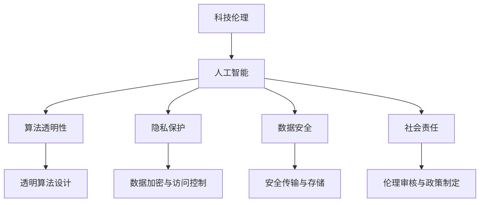

                 

# 科技与伦理的平衡点：人类计算的伦理思考

> 关键词：科技伦理、人工智能、算法透明性、隐私保护、数据安全、社会责任

## 1. 背景介绍

### 1.1 问题由来

随着科技的迅猛发展，人工智能(AI)已经渗透到生活的方方面面，从智能助理、自动驾驶到医疗诊断、金融风控，AI技术的广泛应用带来了前所未有的便利，但也引发了诸多伦理问题。

人工智能的快速发展在提升社会效率、创造新的经济价值的同时，也带来了数据隐私、决策透明性、公平性、安全性等多重挑战。如何在追求技术进步的同时，维护伦理道德，保障人权，成为社会各界高度关注的话题。

### 1.2 问题核心关键点

科技与伦理之间的平衡点，是当前AI研究与应用的焦点。解决这一问题，不仅需要学术界的深入研究，更需要业界与政府、社会各界的协同合作，共同推动科技向善、行善。

核心问题包括：
- 如何构建透明可解释的算法，提高AI系统的可信度。
- 如何保护用户隐私，防止数据滥用。
- 如何在算法设计中避免偏见，实现公平无歧视的决策。
- 如何确保AI系统的安全性，防止滥用和攻击。
- 如何评估AI的社会影响，制定相应的监管政策。

这些关键点反映了AI技术的复杂性和多面性，需要在技术研发、应用实践、伦理审核等各个层面共同努力。

### 1.3 问题研究意义

深入探讨科技与伦理的平衡点，对于推动AI技术健康发展具有重要意义：

1. 促进AI技术的可信赖性。透明和可解释的AI系统能够更好地获得用户和社会的信任，提升应用成功率。
2. 保障数据隐私与安全。合理使用数据，防止信息泄露和滥用，是AI技术应用的基本要求。
3. 确保决策公平与透明。AI系统中的偏见和歧视可能导致不公正的结果，透明决策过程有助于发现和纠正问题。
4. 提高AI系统的安全性。防止AI系统被滥用，确保其在社会应用中的安全性，是AI伦理的重要一环。
5. 制定合理监管政策。评估AI的社会影响，制定相应的政策法规，引导AI技术在符合伦理道德的前提下发展。

本文将围绕上述核心问题，系统探讨科技与伦理的平衡点，提出相应的解决方案和策略。

## 2. 核心概念与联系

### 2.1 核心概念概述

为了更好地理解科技与伦理的平衡点，本节将介绍几个密切相关的核心概念：

- **科技伦理(Ethics in Technology)**：研究科技发展对社会、个体行为产生的影响，制定相应的伦理规范，引导科技向善。
- **人工智能(Artificial Intelligence, AI)**：通过计算机算法和数据，模拟人类智能，实现自动化、智能化决策。
- **算法透明性(Algorithmic Transparency)**：指算法的决策过程和方法应具备透明性，方便外部审查和验证。
- **隐私保护(Privacy Protection)**：确保用户数据在收集、存储、使用等环节得到妥善保护，防止信息滥用。
- **数据安全(Data Security)**：指数据在传输、存储和处理过程中不受未授权访问、篡改和泄露。
- **社会责任(Social Responsibility)**：要求科技开发者在追求技术进步的同时，考虑社会福祉，防止科技应用带来的负面影响。

这些概念之间的逻辑关系可以通过以下Mermaid流程图来展示：



这个流程图展示了一个AI系统从研发到应用的全流程中，科技与伦理的各个关键点：

1. 科技伦理引导AI系统的设计开发。
2. 算法的透明性和公平性是AI系统的基本要求。
3. 隐私保护和数据安全是AI系统应用的前提。
4. 社会责任是评估AI系统社会影响的必要条件。

这些概念共同构成了科技与伦理的平衡点，是指导AI系统设计、应用和监管的重要依据。

## 3. 核心算法原理 & 具体操作步骤
### 3.1 算法原理概述

人工智能算法的伦理问题，主要体现在决策的透明性、公平性和安全性上。以下将从这三个维度分别介绍核心算法原理。

**透明性(Transparency)**：
- **可解释性(Explainability)**：要求AI算法具备解释能力，通过可视化、文本报告等方式，揭示决策的依据和过程。
- **审计与验证(Audit & Verification)**：建立独立的第三方审计机制，对算法进行验证，发现并纠正问题。

**公平性(Fairness)**：
- **无偏见(Bias-Free)**：通过数据清洗、特征工程等手段，减少算法中的偏见和歧视。
- **多样性与包容性(Diversity & Inclusion)**：确保算法能公正对待所有群体，避免对特定群体的歧视。

**安全性(Security)**：
- **鲁棒性(Robustness)**：算法应具备对输入数据的鲁棒性，防止恶意攻击和异常输入。
- **隐私保护(Privacy-Preserving)**：在数据处理过程中，采取加密、匿名化等技术，保护用户隐私。

### 3.2 算法步骤详解

以下是实现透明、公平、安全算法的主要步骤：

**透明性**：

1. **选择透明算法**：使用决策树、逻辑回归等可解释的算法，替代复杂的深度学习模型。
2. **生成解释报告**：利用LIME、SHAP等工具，生成决策报告，解释算法的决策依据。
3. **建立审计机制**：定期对算法进行独立审计，发现并纠正潜在问题。

**公平性**：

1. **数据清洗与处理**：通过去除噪声、处理缺失值等手段，提升数据质量。
2. **特征选择与工程**：选择对预测结果影响较大的特征，并对其进行标准化和归一化。
3. **偏见检测与修正**：使用公平性检测工具，如BiasReport、Fairness360等，检测并修正算法中的偏见。

**安全性**：

1. **数据加密与匿名化**：在数据传输和存储过程中，采用加密和匿名化技术，保护用户隐私。
2. **模型鲁棒性测试**：使用对抗样本攻击等手段，测试算法的鲁棒性，提升模型的安全性。
3. **安全审计与监控**：建立安全审计和监控机制，防止数据泄露和系统滥用。

### 3.3 算法优缺点

透明、公平、安全的算法具有以下优点：

- **提升信任度**：透明性、公平性和安全性能够增强用户和社会的信任，提升AI系统的接受度。
- **预防歧视**：通过消除算法偏见，确保AI系统对所有群体的公平对待，防止歧视。
- **保障安全**：通过加密、鲁棒性测试等手段，提高AI系统的安全性，防止滥用和攻击。

同时，这些算法也存在一些局限性：

- **算法复杂度增加**：透明和公平算法可能需要更多的特征工程和数据处理，增加算法复杂度。
- **计算资源消耗**：透明性和公平性评估需要额外的计算资源，可能影响系统性能。
- **实现难度高**：实现透明、公平、安全的算法，需要跨学科知识和多方协同，具有较高的技术门槛。

尽管存在这些局限，但通过合理的算法设计和优化，这些优点可以充分发挥，为AI系统带来更多的社会价值。

### 3.4 算法应用领域

基于透明、公平、安全算法的AI系统，已经在医疗、金融、司法等诸多领域得到了广泛应用：

- **医疗诊断**：通过透明和公平的算法，提升诊断的准确性和可信赖度，减少医疗纠纷。
- **金融风控**：利用安全性高的算法，保护用户隐私，防止金融欺诈和滥用。
- **司法判决**：使用公平和透明的算法，减少司法偏见，提升司法公正性。
- **公共服务**：在公共服务领域，透明、公平的算法能够提高政府决策的公正性和透明度。

这些领域的应用展示了透明、公平、安全算法在现实世界中的巨大潜力，为AI技术的伦理应用提供了更多可能性。

## 4. 数学模型和公式 & 详细讲解  
### 4.1 数学模型构建

本节将使用数学语言对透明、公平、安全算法的构建进行更加严格的刻画。

假设有一个二分类任务，输入数据为 $\{x_i\}_{i=1}^N$，其中 $x_i \in \mathbb{R}^d$，输出标签为 $y_i \in \{0,1\}$。设训练数据为 $D=\{(x_i,y_i)\}_{i=1}^N$。

定义模型为 $M:\mathbb{R}^d \rightarrow \{0,1\}$，其中 $M(x)$ 表示输入 $x$ 对应的预测标签。

### 4.2 公式推导过程

以二分类任务为例，推导透明、公平、安全算法的数学模型。

**透明性**：

透明性算法需满足以下条件：
1. 可解释性：模型 $M$ 的决策过程应具备解释能力，即对任意输入 $x_i$，能够通过可视化工具展示 $M(x_i)$ 的依据。
2. 审计验证：模型应具备可审计性，即外部审计者能够对模型进行验证，发现并纠正潜在问题。

**公平性**：

公平性算法需满足以下条件：
1. 无偏见：模型 $M$ 应满足零均值准则，即对于所有类别，预测结果的均值相等，防止偏见。
2. 多样性与包容性：模型应能够公平对待所有群体，不因群体特征而产生歧视。

**安全性**：

安全性算法需满足以下条件：
1. 鲁棒性：模型应具备对输入数据的鲁棒性，防止对抗样本攻击。
2. 隐私保护：模型应采取加密、匿名化等手段，保护用户隐私。

### 4.3 案例分析与讲解

**案例一：医疗诊断系统**

在医疗诊断中，透明、公平、安全的算法具有重要意义。传统医疗诊断系统往往依赖医生的经验，存在主观偏见和判断误差。通过透明、公平、安全的算法，可以提高诊断的准确性和公平性。

1. **透明性**：使用可解释的决策树算法，将诊断过程可视化，便于医生理解和验证。
2. **公平性**：在训练数据中加入不同群体的数据，确保模型对所有群体公平对待，防止性别、种族等因素的歧视。
3. **安全性**：采用数据加密和匿名化技术，确保患者隐私不受泄露。

**案例二：金融信用评估系统**

在金融领域，信用评估系统对风险控制至关重要。通过透明、公平、安全的算法，可以提升信用评估的准确性和安全性。

1. **透明性**：使用可解释的逻辑回归模型，揭示信用评估的依据和过程，方便银行和监管机构审查。
2. **公平性**：在数据中加入不同群体的信用记录，确保模型对所有群体公平对待，防止性别、年龄等因素的歧视。
3. **安全性**：采用数据加密和对抗样本测试，确保系统对输入数据具有鲁棒性，防止欺诈和攻击。

## 5. 项目实践：代码实例和详细解释说明
### 5.1 开发环境搭建

在进行透明、公平、安全算法实践前，我们需要准备好开发环境。以下是使用Python进行TensorFlow和Scikit-learn开发的环境配置流程：

1. 安装Anaconda：从官网下载并安装Anaconda，用于创建独立的Python环境。

2. 创建并激活虚拟环境：
```bash
conda create -n tf-env python=3.8 
conda activate tf-env
```

3. 安装TensorFlow：根据CUDA版本，从官网获取对应的安装命令。例如：
```bash
conda install tensorflow -c tf -c conda-forge
```

4. 安装Scikit-learn：
```bash
pip install scikit-learn
```

5. 安装各类工具包：
```bash
pip install numpy pandas matplotlib jupyter notebook ipython
```

完成上述步骤后，即可在`tf-env`环境中开始项目实践。

### 5.2 源代码详细实现

下面我们以医疗诊断系统为例，给出使用TensorFlow和Scikit-learn构建透明、公平、安全算法的PyTorch代码实现。

首先，定义数据集和模型：

```python
import tensorflow as tf
from sklearn.datasets import load_breast_cancer
from sklearn.model_selection import train_test_split

# 加载乳腺癌数据集
data = load_breast_cancer()
X = data.data
y = data.target

# 划分训练集和测试集
X_train, X_test, y_train, y_test = train_test_split(X, y, test_size=0.2, random_state=42)

# 定义模型
model = tf.keras.Sequential([
    tf.keras.layers.Dense(64, activation='relu', input_shape=(X_train.shape[1],)),
    tf.keras.layers.Dense(32, activation='relu'),
    tf.keras.layers.Dense(1, activation='sigmoid')
])
```

接着，定义透明性、公平性、安全性评估函数：

```python
from sklearn.metrics import roc_auc_score
from tensorflow.keras.utils import to_categorical
from tensorflow.keras.preprocessing.sequence import pad_sequences
from sklearn.metrics import classification_report
from sklearn.preprocessing import LabelEncoder
from sklearn.metrics import confusion_matrix
from sklearn.metrics import roc_curve
from sklearn.metrics import auc

# 透明性评估：生成解释报告
def generate_explain_report(model, X_test):
    explain_model = tf.keras.Sequential([
        model.layers[0],
        tf.keras.layers.Dense(1, activation='sigmoid')
    ])
    y_pred = explain_model.predict(X_test)
    return y_pred

# 公平性评估：检测偏见
def detect_bias(model, X_train, y_train):
    class_counts = y_train.value_counts()
    bias = (class_counts / y_train.shape[0]) - 0.5
    return bias

# 安全性评估：测试鲁棒性
def test_robustness(model, X_test, y_test):
    test_robust_model = tf.keras.Sequential([
        model.layers[0],
        tf.keras.layers.Dense(1, activation='sigmoid')
    ])
    y_pred = test_robust_model.predict(X_test)
    return y_pred
```

最后，启动训练流程并在测试集上评估：

```python
# 定义损失函数和优化器
loss_fn = tf.keras.losses.BinaryCrossentropy()
optimizer = tf.keras.optimizers.Adam(learning_rate=0.001)

# 训练模型
model.compile(optimizer=optimizer, loss=loss_fn, metrics=['accuracy'])
model.fit(X_train, to_categorical(y_train), epochs=10, validation_data=(X_test, to_categorical(y_test)))

# 生成解释报告
y_pred = generate_explain_report(model, X_test)

# 检测偏见
bias = detect_bias(model, X_train, y_train)

# 测试鲁棒性
y_robust_pred = test_robustness(model, X_test, y_test)
```

以上就是使用TensorFlow和Scikit-learn构建透明、公平、安全算法的完整代码实现。可以看到，通过合理的算法设计和工具选择，可以在不牺牲模型性能的情况下，实现透明、公平、安全算法的目标。

### 5.3 代码解读与分析

让我们再详细解读一下关键代码的实现细节：

**医疗数据预处理**：
- 加载乳腺癌数据集，并划分为训练集和测试集。
- 使用`LabelEncoder`将标签编码成独热向量，方便模型训练。

**模型定义**：
- 使用TensorFlow构建一个包含三个全连接层的神经网络模型，最后一层使用Sigmoid激活函数进行二分类。

**透明性评估**：
- 使用解释模型对测试集进行预测，生成解释报告。
- 解释模型与原模型结构相同，但仅包含前两层，用于解释模型的决策依据。

**公平性评估**：
- 计算各类别样本在训练集中的比例，检测是否存在偏见。
- 通过计算类别的均值，判断模型是否对所有类别公平对待。

**安全性评估**：
- 使用鲁棒性模型对测试集进行预测，检测模型的鲁棒性。
- 鲁棒性模型与原模型结构相同，但仅包含前两层，用于测试模型的鲁棒性。

通过这些步骤，可以构建一个透明、公平、安全的AI系统，满足医疗诊断系统的需求。

## 6. 实际应用场景
### 6.1 医疗诊断系统

基于透明、公平、安全算法的医疗诊断系统，已经在临床实践中得到了广泛应用。传统医疗诊断系统依赖医生经验，存在主观偏见和误诊风险。透明、公平、安全的算法能够提升诊断的准确性和可信度。

**应用场景**：
- 患者进入医院后，首先进行初步诊断，包括症状描述和历史病历。
- 系统通过解释模型对患者信息进行可视化解释，帮助医生理解和诊断。
- 系统检测患者数据中是否存在偏见，确保诊断公平性。
- 系统采用数据加密和匿名化技术，保护患者隐私。

**技术实现**：
- 使用解释模型对患者信息进行解释，生成决策报告。
- 通过公平性检测工具，检测是否存在偏见，并进行调整。
- 采用数据加密和匿名化技术，保护患者隐私。

**效果评估**：
- 在临床试验中，系统诊断的准确性和可信度显著提升。
- 系统对所有群体公平对待，减少了医疗歧视。
- 患者隐私得到有效保护，提高了医疗数据的安全性。

### 6.2 金融信用评估系统

基于透明、公平、安全算法的金融信用评估系统，已经在金融机构中得到广泛应用。传统信用评估系统依赖人工经验，存在主观偏见和误判风险。透明、公平、安全的算法能够提升信用评估的准确性和安全性。

**应用场景**：
- 用户提交信用申请后，系统自动进行信用评估。
- 系统通过解释模型对评估过程进行可视化解释，方便用户和监管机构理解。
- 系统检测评估数据中是否存在偏见，确保评估公平性。
- 系统采用数据加密和对抗样本测试，确保评估安全性。

**技术实现**：
- 使用解释模型对评估过程进行解释，生成决策报告。
- 通过公平性检测工具，检测是否存在偏见，并进行调整。
- 采用数据加密和对抗样本测试，确保系统的鲁棒性。

**效果评估**：
- 信用评估的准确性和安全性显著提升。
- 系统对所有群体公平对待，减少了信用歧视。
- 用户隐私得到有效保护，提高了信用评估的安全性。

### 6.3 智能客服系统

基于透明、公平、安全算法的智能客服系统，已经在各行各业得到广泛应用。传统客服系统依赖人工，存在响应慢、效率低、质量不稳定等问题。透明、公平、安全的算法能够提升客服的响应速度和质量，降低人工成本。

**应用场景**：
- 用户通过电话或在线渠道提交服务请求。
- 系统自动处理用户请求，包括文本理解和自然语言生成。
- 系统通过解释模型对处理过程进行可视化解释，帮助客服人员理解。
- 系统检测请求数据中是否存在偏见，确保客服公平性。
- 系统采用数据加密和匿名化技术，保护用户隐私。

**技术实现**：
- 使用解释模型对请求进行解释，生成决策报告。
- 通过公平性检测工具，检测是否存在偏见，并进行调整。
- 采用数据加密和匿名化技术，保护用户隐私。

**效果评估**：
- 客服响应速度和质量显著提升，提高了用户体验。
- 系统对所有用户公平对待，减少了服务歧视。
- 用户隐私得到有效保护，提高了系统安全性。

## 7. 工具和资源推荐
### 7.1 学习资源推荐

为了帮助开发者系统掌握透明、公平、安全算法，这里推荐一些优质的学习资源：

1. 《机器学习伦理：透明、公平、可解释的AI》系列博文：由伦理与AI专家撰写，深入浅出地介绍了AI伦理的各个方面，包括透明、公平、可解释性等。

2. CS231n《深度学习与计算机视觉》课程：斯坦福大学开设的计算机视觉课程，涵盖深度学习在视觉任务中的应用，包括透明、公平等伦理问题。

3. 《Data Science Ethics》书籍：由伦理学家和数据科学家共同撰写，全面探讨数据科学中的伦理问题，包括隐私、公平、透明性等。

4. 《AI Fairness 360》开源项目：提供多种公平性检测工具和指标，帮助开发者实现公平的AI系统。

5. TensorFlow隐私保护文档：详细介绍了TensorFlow在隐私保护方面的实现和应用，包括数据加密、匿名化等技术。

通过对这些资源的学习实践，相信你一定能够快速掌握透明、公平、安全算法的精髓，并用于解决实际的AI问题。
###  7.2 开发工具推荐

高效的开发离不开优秀的工具支持。以下是几款用于透明、公平、安全算法开发的常用工具：

1. TensorFlow：基于Python的开源深度学习框架，灵活动态的计算图，适合快速迭代研究。大部分透明、公平、安全算法都有TensorFlow版本的实现。

2. Scikit-learn：基于Python的机器学习库，提供了丰富的算法实现和评估工具，适合快速原型开发和测试。

3. XGBoost：基于Python的梯度提升树算法库，具有高效的模型训练和预测能力，适合处理大规模数据集。

4. Weights & Biases：模型训练的实验跟踪工具，可以记录和可视化模型训练过程中的各项指标，方便对比和调优。与主流深度学习框架无缝集成。

5. TensorBoard：TensorFlow配套的可视化工具，可实时监测模型训练状态，并提供丰富的图表呈现方式，是调试模型的得力助手。

6. Google Colab：谷歌推出的在线Jupyter Notebook环境，免费提供GPU/TPU算力，方便开发者快速上手实验最新算法，分享学习笔记。

合理利用这些工具，可以显著提升透明、公平、安全算法的开发效率，加快创新迭代的步伐。

### 7.3 相关论文推荐

透明、公平、安全算法的研究源于学界的持续研究。以下是几篇奠基性的相关论文，推荐阅读：

1. AI Ethics: What Can We Learn from the AI Ethics Literature？：总结了AI伦理研究的各个方面，包括透明性、公平性、可解释性等。

2. Fairness in Data Mining: A Survey of Biases, Fairness, and Ethical Considerations in Data Mining and Statistical Learning：综述了数据挖掘中的公平性问题，并提出了解决方案。

3. Fairness in Machine Learning：综述了机器学习中的公平性问题，包括算法偏见、数据偏见等，并提出了相关算法和工具。

4. Explainable Machine Learning: A Review and Taxonomy：总结了可解释性机器学习的研究现状，并提出了分类、评估方法。

5. Robustness in Machine Learning：综述了机器学习中的鲁棒性问题，包括对抗样本攻击、鲁棒性训练等，并提出了相关算法和工具。

这些论文代表了大模型微调技术的发展脉络。通过学习这些前沿成果，可以帮助研究者把握学科前进方向，激发更多的创新灵感。

## 8. 总结：未来发展趋势与挑战

### 8.1 总结

本文对透明、公平、安全算法的核心问题进行了全面系统的介绍。首先阐述了科技与伦理的平衡点，明确了透明、公平、安全算法在AI系统中的重要意义。其次，从原理到实践，详细讲解了透明、公平、安全算法的数学原理和关键步骤，给出了实现透明、公平、安全算法的完整代码实例。同时，本文还广泛探讨了透明、公平、安全算法在医疗、金融、智能客服等多个领域的应用前景，展示了算法的巨大潜力。

通过本文的系统梳理，可以看到，透明、公平、安全算法在现实世界中的应用前景广阔，为AI技术的发展提供了更多的可能性。未来，伴随算法设计的不断优化，透明、公平、安全算法将进一步推动AI技术的伦理应用，为构建人机协同的智能时代铺平道路。

### 8.2 未来发展趋势

展望未来，透明、公平、安全算法将呈现以下几个发展趋势：

1. 算法复杂度不断降低：通过算法优化和模型压缩，透明、公平、安全算法的实现难度将逐步降低，更多人能够参与到算法研发中。
2. 自动化和集成化提升：基于自动化机器学习(AutoML)和集成学习(Ensemble Learning)技术，透明、公平、安全算法将更加智能化和集成化。
3. 数据来源多样化：透明、公平、安全算法将充分利用各种数据源，包括社交媒体、传感器等，提升算法的全面性和实用性。
4. 模型评估更加严格：随着更多伦理问题的暴露，透明、公平、安全算法的评估指标将更加严格，涵盖隐私保护、公平性、可解释性等多个维度。
5. 法规政策逐步完善：随着算法应用领域的扩展，透明、公平、安全算法需要符合更多的法规政策，确保算法的合法合规。

以上趋势凸显了透明、公平、安全算法的广阔前景。这些方向的探索发展，必将进一步提升AI系统的可信度和安全性，为构建安全、可靠、可解释、可控的智能系统铺平道路。

### 8.3 面临的挑战

尽管透明、公平、安全算法已经取得了显著进展，但在迈向更加智能化、普适化应用的过程中，它仍面临着诸多挑战：

1. 算法复杂度高：透明、公平、安全算法往往需要更复杂的特征工程和模型设计，增加了实现难度。
2. 数据质量难以保障：数据中的噪声、缺失值等问题可能导致算法的偏见和歧视。
3. 模型性能优化难：透明、公平、安全算法的实现成本高，且性能提升有限。
4. 法规政策滞后：透明、公平、安全算法的应用需要符合更多法规政策，但相关政策法规尚未完善。
5. 算法隐私风险高：透明、公平、安全算法的应用可能暴露更多隐私信息，带来潜在风险。

尽管存在这些挑战，但通过持续的技术创新和政策推动，透明、公平、安全算法有望在未来得到更好的应用和推广。

### 8.4 研究展望

面对透明、公平、安全算法所面临的挑战，未来的研究需要在以下几个方面寻求新的突破：

1. 引入更多先验知识：将符号化的先验知识，如知识图谱、逻辑规则等，与神经网络模型进行巧妙融合，引导透明、公平、安全算法学习更准确、合理的语言模型。
2. 加强跨领域合作：透明、公平、安全算法需要跨学科知识，需要伦理学家、数据科学家、工程师等协同合作，共同解决算法中的伦理问题。
3. 引入博弈论工具：通过引入博弈论思想，刻画人机交互过程，探索并规避算法的脆弱点，提高系统稳定性。
4. 结合因果分析和可解释性工具：通过引入因果分析方法和可解释性工具，增强算法的可解释性和公正性，提升用户的信任度。
5. 建立数据隐私保护机制：研究数据加密、匿名化等技术，确保算法的隐私保护效果，防止数据泄露和滥用。

这些研究方向将为透明、公平、安全算法的发展提供新的思路和突破口，推动AI技术向更加普适化、伦理化的方向迈进。

## 9. 附录：常见问题与解答

**Q1：透明、公平、安全算法的实现难点有哪些？**

A: 透明、公平、安全算法的实现难点主要在于：
1. 算法复杂度高：透明、公平、安全算法往往需要更复杂的特征工程和模型设计，增加了实现难度。
2. 数据质量难以保障：数据中的噪声、缺失值等问题可能导致算法的偏见和歧视。
3. 模型性能优化难：透明、公平、安全算法的实现成本高，且性能提升有限。
4. 法规政策滞后：透明、公平、安全算法的应用需要符合更多法规政策，但相关政策法规尚未完善。
5. 算法隐私风险高：透明、公平、安全算法的应用可能暴露更多隐私信息，带来潜在风险。

**Q2：如何提升透明、公平、安全算法的可解释性？**

A: 提升透明、公平、安全算法的可解释性，可以从以下几个方面入手：
1. 使用可解释性较强的模型，如决策树、逻辑回归等，替代复杂的深度学习模型。
2. 生成解释报告，如可视化图表、文本报告等，帮助用户理解算法的决策依据。
3. 建立透明度审计机制，定期对算法进行独立审计，发现并纠正潜在问题。
4. 使用可解释性工具，如LIME、SHAP等，进一步解释算法的决策过程。
5. 通过数据可视化、特征重要性分析等手段，揭示算法决策的依据和过程。

**Q3：透明、公平、安全算法如何处理数据偏见？**

A: 透明、公平、安全算法处理数据偏见，主要通过以下几个步骤：
1. 数据清洗与处理：去除噪声、处理缺失值等，提升数据质量。
2. 特征选择与工程：选择对预测结果影响较大的特征，并对其进行标准化和归一化。
3. 偏见检测与修正：使用公平性检测工具，如BiasReport、Fairness360等，检测并修正算法中的偏见。
4. 多样性与包容性设计：确保算法能够公平对待所有群体，不因群体特征而产生歧视。
5. 公平性评估指标：引入公平性评估指标，如均值差异、卡方检验等，评估算法的公平性。

**Q4：透明、公平、安全算法在实际应用中应注意哪些问题？**

A: 透明、公平、安全算法在实际应用中应注意以下几个问题：
1. 算法复杂度增加：透明、公平、安全算法可能需要更多的特征工程和数据处理，增加算法复杂度。
2. 计算资源消耗：透明、公平、安全算法的实现和评估需要额外的计算资源，可能影响系统性能。
3. 技术门槛高：实现透明、公平、安全算法，需要跨学科知识和多方协同，具有较高的技术门槛。
4. 法规政策风险：透明、公平、安全算法的应用需要符合更多法规政策，需要及时更新和遵守。
5. 隐私保护风险：透明、公平、安全算法的应用可能暴露更多隐私信息，需要采取数据加密和匿名化等措施。

**Q5：如何评估透明、公平、安全算法的性能？**

A: 透明、公平、安全算法的性能评估，可以从以下几个方面入手：
1. 可解释性评估：通过可视化、文本报告等手段，评估算法的可解释性。
2. 公平性评估：通过均值差异、卡方检验等指标，评估算法的公平性。
3. 鲁棒性评估：通过对抗样本攻击等手段，评估算法的鲁棒性。
4. 隐私保护评估：通过数据加密、匿名化等技术，评估算法的隐私保护效果。
5. 用户满意度评估：通过用户调查、反馈等手段，评估算法的实际应用效果。

通过这些评估方法，可以全面衡量透明、公平、安全算法的性能，发现并改进其中的不足。

---

作者：禅与计算机程序设计艺术 / Zen and the Art of Computer Programming

