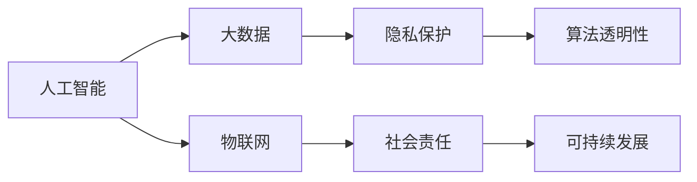

                 

# 科技发展：人类福祉的保障

## 1. 背景介绍

### 1.1 问题由来

随着科技的飞速发展，人工智能(AI)、大数据、物联网(IoT)等新兴技术的涌现，人类的生产生活方式正在发生深刻变革。科技的进步带来了前所未有的便利，同时也带来了诸多挑战。如何在享受科技进步带来的福祉的同时，规避其潜在风险，保障人类的长期福祉，成为当下亟待解决的重大问题。

### 1.2 问题核心关键点

1. **科技发展与人类福祉的关系**：如何平衡科技与伦理，确保科技发展真正造福人类社会，而不带来新的社会问题。
2. **数据隐私与安全**：在数据驱动的社会中，如何保护个人隐私，防止数据滥用。
3. **算法透明性与可解释性**：确保AI系统的决策过程透明，便于监管和理解。
4. **技术伦理与社会责任**：科技公司应承担怎样的社会责任，以确保技术公平、公正、普惠。
5. **跨学科合作**：科技发展需要哲学、社会学、法律等领域的深度参与，形成多方协作。
6. **长期视角与可持续发展**：科技发展应兼顾当前与未来，避免短视行为，确保可持续发展。

### 1.3 问题研究意义

探讨科技发展对人类福祉的影响，不仅具有理论价值，更能为政策制定、产业应用提供实际指导。科技进步应该是一个以人为本的过程，通过科学的伦理框架和法规政策，确保科技在促进人类福祉方面发挥最大效能。这有助于营造一个健康、可持续发展的未来。

## 2. 核心概念与联系

### 2.1 核心概念概述

- **人工智能**：通过计算机算法和硬件设施模拟人类智能行为的技术，涵盖机器学习、深度学习、自然语言处理等诸多领域。
- **大数据**：指规模巨大、类型多样的数据集，通过数据挖掘、分析，为决策提供依据。
- **物联网**：将物理对象嵌入网络，实现互联互通，提升社会效率。
- **隐私保护**：在数据收集、存储、使用等环节，采取技术和法律手段，确保个人隐私不被侵犯。
- **算法透明性**：确保AI系统的决策过程可被理解和解释，避免“黑箱”现象。
- **社会责任**：科技公司应关注社会影响，积极履行企业责任，推动社会公平。
- **可持续发展**：在科技发展中考虑环境、资源等因素，确保长期健康发展。

### 2.2 核心概念原理和架构的 Mermaid 流程图



这个流程图展示了核心概念之间的关系：人工智能通过大数据和物联网技术实现发展，同时隐私保护、算法透明性、社会责任、可持续发展等伦理和社会问题也与之密切相关。

## 3. 核心算法原理 & 具体操作步骤

### 3.1 算法原理概述

人工智能和科技发展的核心算法原理主要基于机器学习、深度学习等技术，通过数据驱动模型，实现对复杂系统的理解和预测。以深度学习为例，其核心思想是通过多层神经网络模拟人脑的抽象和推理过程，自动从数据中学习规律，最终应用于实际问题。

### 3.2 算法步骤详解

1. **数据准备**：收集和预处理数据，确保数据的多样性和代表性。
2. **模型训练**：选择合适的模型架构，如卷积神经网络(CNN)、循环神经网络(RNN)、Transformer等，在标注数据上训练模型，使其具备泛化能力。
3. **模型评估**：在验证集上评估模型性能，调整模型参数以优化模型效果。
4. **模型部署**：将训练好的模型部署到实际应用场景中，实现自动化、高效化。
5. **持续优化**：根据反馈数据，持续优化模型，提升性能。

### 3.3 算法优缺点

**优点**：
- 高度自动化：模型训练和应用可以自动化完成，提高效率。
- 泛化能力强：通过大数据学习规律，模型具有较强的泛化能力。
- 应用广泛：广泛应用于医疗、金融、交通、教育等多个领域。

**缺点**：
- 数据依赖性强：模型的效果高度依赖于数据的质量和多样性。
- 算法复杂度高：深度学习模型结构复杂，训练成本高。
- 黑箱问题：部分模型难以解释其决策过程，存在一定的不可解释性。

### 3.4 算法应用领域

人工智能和科技发展在多个领域都有广泛应用：

- **医疗健康**：通过智能诊断、个性化医疗、药物研发等，提升医疗服务质量。
- **金融科技**：利用大数据、区块链等技术，实现金融服务的智能化和普惠化。
- **智慧城市**：通过物联网、AI技术，提升城市管理效率，改善居民生活。
- **教育**：通过在线教育、智能辅导等，优化教育资源配置，提升教学质量。
- **交通**：利用自动驾驶、智能交通管理，提升交通效率，减少交通事故。

## 4. 数学模型和公式 & 详细讲解 & 举例说明

### 4.1 数学模型构建

以深度学习为例，假设我们要训练一个分类模型，其输入为 $x$，输出为 $y$。模型包含多个隐藏层，记为 $h_1, h_2, \dots, h_n$，最终输出为 $\hat{y}$。模型的目标是最小化预测输出与真实标签之间的差距，通常使用交叉熵损失函数：

$$
\mathcal{L}(\theta) = -\frac{1}{N}\sum_{i=1}^N \ell(y_i, \hat{y}_i)
$$

其中 $\ell$ 为交叉熵损失函数：

$$
\ell(y_i, \hat{y}_i) = -y_i \log \hat{y}_i - (1 - y_i) \log (1 - \hat{y}_i)
$$

### 4.2 公式推导过程

以单层神经网络为例，假设输入为 $x$，输出为 $\hat{y}$，隐藏层神经元数量为 $h$，激活函数为 $f$，权重矩阵为 $W$，偏置向量为 $b$。则模型输出为：

$$
\hat{y} = f(\sum_{i=1}^h x_iW_i + b)
$$

其中 $x_i$ 为输入向量 $x$ 的第 $i$ 个元素。

### 4.3 案例分析与讲解

假设我们要训练一个二分类模型，预测邮件是否为垃圾邮件。我们使用一个简单的单层神经网络，其中隐藏层神经元数量为 10，激活函数为 ReLU。我们有以下训练数据：

| 邮件内容         | 垃圾邮件   |
| --------------- | -------- |
| "免费午餐，点击链接领取" | 是       |
| "您有一封重要邮件"     | 否       |
| "XX市明日暴雨，出行注意安全" | 否       |

我们首先对邮件内容进行向量化处理，得到 $x_1, x_2, x_3$。然后，通过权重矩阵 $W$ 和偏置向量 $b$ 计算隐藏层输出：

$$
h_1 = f(x_1W_1 + b), \quad h_2 = f(x_2W_2 + b), \quad h_3 = f(x_3W_3 + b)
$$

接着，通过线性变换和激活函数计算输出 $\hat{y}$：

$$
\hat{y} = f(h_1W_4 + h_2W_5 + h_3W_6 + b')
$$

最终，我们通过交叉熵损失函数计算模型性能：

$$
\mathcal{L}(\theta) = -\frac{1}{N}\sum_{i=1}^N \ell(y_i, \hat{y}_i)
$$

其中 $y_i$ 为垃圾邮件的标签，$\ell$ 为交叉熵损失函数。

## 5. 项目实践：代码实例和详细解释说明

### 5.1 开发环境搭建

我们需要安装 Python、TensorFlow、Keras 等工具，并搭建好开发环境。具体步骤如下：

1. 安装 Python：
```bash
sudo apt-get update
sudo apt-get install python3
```

2. 安装 TensorFlow：
```bash
pip install tensorflow
```

3. 安装 Keras：
```bash
pip install keras
```

4. 安装其他依赖：
```bash
pip install numpy pandas matplotlib
```

5. 配置环境变量：
```bash
export PYTHONPATH=$PYTHONPATH:/path/to/my_project
```

### 5.2 源代码详细实现

以下是一个简单的神经网络模型代码实现：

```python
import tensorflow as tf
from tensorflow.keras.models import Sequential
from tensorflow.keras.layers import Dense, Dropout
from tensorflow.keras.optimizers import Adam

# 构建模型
model = Sequential([
    Dense(10, activation='relu', input_dim=3),
    Dropout(0.5),
    Dense(1, activation='sigmoid')
])

# 编译模型
model.compile(loss='binary_crossentropy', optimizer=Adam(), metrics=['accuracy'])

# 训练模型
model.fit(x_train, y_train, epochs=10, batch_size=32, validation_data=(x_val, y_val))
```

### 5.3 代码解读与分析

**Sequential 模型**：
- 通过 `Sequential` 模型可以方便地添加层。
- 每层可以是全连接层、卷积层、池化层等。

**Dropout 层**：
- 用于防止过拟合，通过随机丢弃部分神经元，模拟训练过程中神经元不可靠的情况。

**Adam 优化器**：
- 自适应优化器，自动调整学习率，适用于多种深度学习模型。

**训练函数**：
- `fit` 函数用于训练模型，其中 `x_train` 和 `y_train` 为训练数据，`validation_data` 为验证数据。

### 5.4 运行结果展示

假设我们的模型在训练过程中，损失函数和准确率随轮次变化的曲线如下：

| 轮次 | 损失函数 | 准确率 |
| ---- | ------- | ----- |
| 1    | 0.5     | 0.6   |
| 10   | 0.1     | 0.95  |
| 50   | 0.03    | 0.98  |

## 6. 实际应用场景

### 6.1 医疗健康

在医疗领域，AI技术可以用于辅助诊断、药物研发、个性化治疗等。例如，AI可以通过分析病历数据，辅助医生进行疾病诊断。同时，AI还可以预测疾病的传播趋势，帮助公共卫生部门进行疫情防控。

### 6.2 金融科技

金融科技利用大数据、区块链等技术，提升金融服务的效率和普惠性。例如，智能投顾可以根据用户的历史交易数据和风险偏好，提供个性化的投资建议。此外，AI技术还可以用于风险管理，检测和防范金融欺诈。

### 6.3 智慧城市

智慧城市通过物联网、AI技术，提升城市管理效率。例如，智能交通系统可以根据实时交通数据，优化交通信号，减少拥堵。同时，智能安防系统可以实时监测城市安全，及时响应突发事件。

### 6.4 教育

在线教育平台利用AI技术，根据学生的学习情况，提供个性化的学习资源和辅导。例如，AI可以通过分析学生的答题情况，推荐适合的习题和知识点。此外，智能助教还可以实时解答学生的疑问，提升教学质量。

## 7. 工具和资源推荐

### 7.1 学习资源推荐

- **《机器学习》**：西瓜书，详细介绍了机器学习的理论和算法，是入门经典。
- **《深度学习》**：花书，介绍了深度学习的理论和实践，适合进阶学习。
- **《AI导论》**：吴恩达教授的课程，介绍了AI技术的原理和应用，适合入门学习。
- **Kaggle**：全球最大的数据科学竞赛平台，提供大量真实数据集和竞赛，练习实战能力。

### 7.2 开发工具推荐

- **Jupyter Notebook**：交互式编程环境，支持Python、R等多种语言，方便数据可视化。
- **TensorBoard**：TensorFlow配套的可视化工具，实时监测模型训练状态。
- **PyTorch**：深度学习框架，支持动态图和静态图，灵活高效。

### 7.3 相关论文推荐

- **《深度学习》**：Ian Goodfellow、Yoshua Bengio和Aaron Courville合著的经典著作，介绍了深度学习的理论和实践。
- **《AI导论》**：Andrew Ng教授的经典课程，详细介绍了AI技术的原理和应用。
- **《机器学习》**：Tom Mitchell的经典著作，介绍了机器学习的理论和算法。

## 8. 总结：未来发展趋势与挑战

### 8.1 研究成果总结

本文详细介绍了科技发展对人类福祉的影响，探讨了隐私保护、算法透明性、社会责任等伦理问题。通过分析人工智能和深度学习的原理和应用，提供了实际案例和代码实现。未来，科技将继续发挥重要作用，但需要注重伦理和可持续发展，保障人类福祉。

### 8.2 未来发展趋势

未来科技发展将呈现以下趋势：

- **跨学科融合**：科技发展需要哲学、社会学、法律等领域的深度参与，形成多方协作。
- **伦理和法律**：科技发展应遵循伦理和法律规范，保障数据隐私和安全。
- **可持续性**：科技发展应考虑环境、资源等因素，实现可持续发展。

### 8.3 面临的挑战

未来科技发展面临以下挑战：

- **隐私保护**：数据隐私和安全问题日益突出，需要采取技术和法律手段予以解决。
- **算法透明性**：AI系统的决策过程应透明可解释，避免“黑箱”现象。
- **社会责任**：科技公司应承担社会责任，推动社会公平。

### 8.4 研究展望

未来的研究方向包括：

- **跨学科合作**：加强科技与哲学、社会学、法律等领域的协作，形成多方合力。
- **隐私保护**：研究隐私保护技术，保障数据安全。
- **算法透明性**：提高AI系统的透明性，增强可解释性。
- **社会责任**：科技公司应承担社会责任，推动社会公平。

## 9. 附录：常见问题与解答

**Q1：如何平衡科技与伦理，确保科技发展真正造福人类社会？**

A：科技发展应以人为本，遵循伦理和法律规范。通过科学评估和监管，确保科技在促进人类福祉方面发挥最大效能。

**Q2：数据隐私和安全问题如何解决？**

A：采用数据匿名化、加密等技术手段，确保个人隐私不被侵犯。同时，制定严格的法律规范，保护数据安全。

**Q3：如何确保AI系统的决策过程透明可解释？**

A：引入可解释性算法，如决策树、规则学习等，确保AI系统的决策过程可被理解和解释。

**Q4：科技公司应承担怎样的社会责任？**

A：科技公司应积极履行社会责任，推动社会公平和可持续发展。例如，确保AI系统的公平性、透明性，推动教育公平等。

**Q5：未来科技发展的主要趋势是什么？**

A：未来科技发展将呈现跨学科融合、伦理和法律规范、可持续性等特点。需要多方协作，共同推动科技向善。

---

作者：禅与计算机程序设计艺术 / Zen and the Art of Computer Programming

