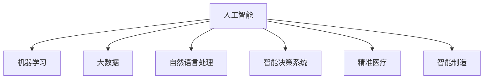

                 

## 1. 背景介绍

### 1.1 问题由来

随着科技的飞速发展，人工智能（AI）已经成为推动社会进步和解决社会问题的重要工具。然而，科技的发展既带来了便利，也带来了挑战。如何利用科技解决社会问题，使得科技真正服务于人类，成为了现代社会亟需关注的重要议题。

科技向善（Tech for Good）成为近年来全球范围内的一个热门话题。科技向善是指利用科技手段解决社会问题，促进社会公正、公平和可持续发展。通过科技向善，我们可以更好地应对气候变化、公共卫生、教育、就业等社会问题，推动社会进步。

### 1.2 问题核心关键点

科技向善的核心在于如何将科技的力量应用到解决社会问题上。这涉及到以下几个关键点：

- **数据驱动决策**：利用大数据和机器学习技术，从数据中挖掘出有价值的信息，辅助政策制定和决策。
- **精准化服务**：利用AI技术提供个性化和精准化的服务，提升服务效率和效果。
- **社会公平**：通过科技手段减少社会不平等，促进社会公正。
- **人机协同**：在科技与人的互动中，使机器更好地理解人类需求，提供更符合用户期望的服务。

### 1.3 问题研究意义

科技向善具有重要意义：

1. **提升社会福祉**：通过科技手段改善人民生活质量，提升社会福利。
2. **推动可持续发展**：科技向善有助于应对环境污染、资源短缺等全球性挑战。
3. **促进社会公平**：科技向善可以打破信息孤岛，消除社会不平等，推动社会公平正义。
4. **创新驱动发展**：科技向善能够推动新产业、新业态的发展，驱动经济增长。

## 2. 核心概念与联系

### 2.1 核心概念概述

为更好地理解科技向善的内涵，本节将介绍几个密切相关的核心概念：

- **人工智能（AI）**：利用计算机技术模拟人的智能行为，包括感知、理解、学习、推理、规划等能力。
- **机器学习（ML）**：通过算法让计算机从数据中学习规律，自动改进性能。
- **大数据（Big Data）**：指规模庞大、速度极快、类型多样的数据集。
- **自然语言处理（NLP）**：使计算机能够理解和处理自然语言，包括语言理解、生成、翻译等。
- **智能决策系统（IDS）**：通过AI技术进行决策支持的系统。
- **精准医疗（Precision Medicine）**：利用基因组信息等个性化数据，提供个性化治疗方案的医疗模式。
- **智能制造（Smart Manufacturing）**：利用AI技术优化制造流程，提高生产效率和质量。

这些核心概念之间的逻辑关系可以通过以下Mermaid流程图来展示：



这个流程图展示了一系列核心概念及其之间的关系：

1. 人工智能通过机器学习和大数据技术获取和分析信息。
2. 自然语言处理是AI应用的重要分支，用于理解和生成自然语言。
3. 智能决策系统、精准医疗和智能制造等应用场景，都是AI在特定领域的典型应用。

## 3. 核心算法原理 & 具体操作步骤

### 3.1 算法原理概述

科技向善的核心算法原理主要包括以下几个方面：

- **数据预处理**：清洗和标准化数据，使其适合于机器学习算法进行分析和处理。
- **特征工程**：提取和选择数据特征，以提高模型性能。
- **模型选择**：根据问题特点选择合适的算法和模型。
- **模型训练**：利用标注数据训练模型，优化模型参数。
- **模型评估**：通过测试集评估模型性能，选择最优模型。
- **模型部署**：将训练好的模型应用于实际场景，实现精准化服务。

### 3.2 算法步骤详解

科技向善的算法步骤一般包括以下几个关键步骤：

**Step 1: 数据收集与预处理**

1. 收集相关领域的原始数据，包括文本、图像、视频、传感器数据等。
2. 清洗数据，去除噪声和异常值，标准化数据格式。
3. 数据分割：将数据集划分为训练集、验证集和测试集。

**Step 2: 特征工程**

1. 特征选择：根据任务需求，选择最相关的特征。
2. 特征提取：利用文本处理、图像处理等技术提取特征。
3. 特征变换：对特征进行归一化、降维等处理。

**Step 3: 模型选择与训练**

1. 选择合适的算法和模型，如决策树、随机森林、深度神经网络等。
2. 设置训练参数，如学习率、批大小、迭代轮数等。
3. 利用训练集数据进行模型训练，优化模型参数。

**Step 4: 模型评估与优化**

1. 在测试集上评估模型性能，选择最优模型。
2. 应用交叉验证等技术，评估模型泛化能力。
3. 根据评估结果，进行模型优化和调整。

**Step 5: 模型部署与应用**

1. 将训练好的模型部署到实际应用场景中。
2. 根据用户反馈，调整和优化模型。
3. 持续监控模型性能，确保系统稳定运行。

### 3.3 算法优缺点

科技向善的算法具有以下优点：

1. **数据驱动决策**：通过大数据分析，可以提供更加科学、精准的决策支持。
2. **提高服务效率**：利用AI技术，可以自动化处理大量重复性任务，提高服务效率。
3. **增强决策科学性**：通过机器学习算法，可以发现数据中的隐藏规律，提升决策科学性。
4. **减少人为误差**：AI系统可以避免人为判断失误，提高决策的准确性。

同时，该算法也存在一定的局限性：

1. **数据质量要求高**：模型性能依赖于数据质量，低质量的数据可能导致模型偏差。
2. **模型解释性不足**：黑盒模型难以解释其内部工作机制，可能带来模型信任问题。
3. **数据隐私问题**：数据隐私保护是科技向善面临的重要挑战，需要设计隐私保护机制。
4. **模型依赖性**：依赖于特定算法和模型，模型选择不当可能导致效果不佳。

尽管存在这些局限性，但就目前而言，科技向善算法仍然是大规模数据处理和复杂问题解决的重要手段。未来相关研究的重点在于如何进一步降低算法依赖，提高模型可解释性，增强数据隐私保护等。

### 3.4 算法应用领域

科技向善算法在多个领域得到了广泛应用，例如：

- **医疗健康**：通过大数据和机器学习技术，提供个性化医疗服务，提升诊疗效果。
- **智能交通**：利用AI技术优化交通信号控制，减少交通拥堵，提高交通安全。
- **金融服务**：利用AI技术进行风险评估和投资建议，提升金融服务质量。
- **教育培训**：利用AI技术进行智能评估和个性化推荐，提升教育效果。
- **环境保护**：利用大数据和机器学习技术，分析环境数据，制定环保策略。
- **灾害预警**：利用AI技术进行灾害预测和预警，减少灾害损失。

除了上述这些经典应用外，科技向善算法还在更多场景中得到了应用，如智能家居、智慧城市、智能农业等，为社会各个领域带来了深刻变革。

## 4. 数学模型和公式 & 详细讲解 & 举例说明

### 4.1 数学模型构建

为了更好地理解科技向善的算法原理，本节将使用数学语言对算法过程进行更加严格的刻画。

记原始数据集为 $D=\{(x_i, y_i)\}_{i=1}^N, x_i \in \mathcal{X}, y_i \in \mathcal{Y}$，其中 $x_i$ 表示输入，$y_i$ 表示标签。

定义模型 $M_{\theta}(x)$，其中 $\theta$ 为模型参数。模型的损失函数为 $\mathcal{L}(\theta) = \frac{1}{N}\sum_{i=1}^N \ell(M_{\theta}(x_i), y_i)$，其中 $\ell$ 为损失函数，如均方误差、交叉熵等。

模型的训练过程可以表示为：

$$
\theta = \mathop{\arg\min}_{\theta} \mathcal{L}(\theta)
$$

利用梯度下降等优化算法，不断更新模型参数 $\theta$，最小化损失函数 $\mathcal{L}(\theta)$。

### 4.2 公式推导过程

以下我们以二分类任务为例，推导模型的损失函数及其梯度的计算公式。

假设模型 $M_{\theta}$ 在输入 $x$ 上的输出为 $\hat{y}=M_{\theta}(x)$，表示样本属于正类的概率。真实标签 $y \in \{0,1\}$。则二分类交叉熵损失函数定义为：

$$
\ell(M_{\theta}(x),y) = -[y\log \hat{y} + (1-y)\log (1-\hat{y})]
$$

将其代入经验风险公式，得：

$$
\mathcal{L}(\theta) = -\frac{1}{N}\sum_{i=1}^N [y_i\log M_{\theta}(x_i)+(1-y_i)\log(1-M_{\theta}(x_i))]
$$

根据链式法则，损失函数对参数 $\theta_k$ 的梯度为：

$$
\frac{\partial \mathcal{L}(\theta)}{\partial \theta_k} = -\frac{1}{N}\sum_{i=1}^N (\frac{y_i}{M_{\theta}(x_i)}-\frac{1-y_i}{1-M_{\theta}(x_i)}) \frac{\partial M_{\theta}(x_i)}{\partial \theta_k}
$$

其中 $\frac{\partial M_{\theta}(x_i)}{\partial \theta_k}$ 可进一步递归展开，利用自动微分技术完成计算。

在得到损失函数的梯度后，即可带入参数更新公式，完成模型的迭代优化。重复上述过程直至收敛，最终得到适应特定任务的最优模型参数 $\theta^*$。

### 4.3 案例分析与讲解

以精准医疗为例，分析科技向善在医疗领域的实际应用。

假设有一组病人的基因数据和临床数据，目标是根据基因数据预测病人的治疗效果。首先，对数据进行清洗和标准化处理。然后，选择最相关的基因特征和临床特征进行特征工程。接着，选择适当的机器学习算法，如支持向量机、随机森林、深度神经网络等，进行模型训练和优化。最后，在测试集上评估模型性能，根据评估结果调整和优化模型。

## 5. 项目实践：代码实例和详细解释说明

### 5.1 开发环境搭建

在进行科技向善实践前，我们需要准备好开发环境。以下是使用Python进行PyTorch开发的环境配置流程：

1. 安装Anaconda：从官网下载并安装Anaconda，用于创建独立的Python环境。

2. 创建并激活虚拟环境：
```bash
conda create -n pytorch-env python=3.8 
conda activate pytorch-env
```

3. 安装PyTorch：根据CUDA版本，从官网获取对应的安装命令。例如：
```bash
conda install pytorch torchvision torchaudio cudatoolkit=11.1 -c pytorch -c conda-forge
```

4. 安装Transformers库：
```bash
pip install transformers
```

5. 安装各类工具包：
```bash
pip install numpy pandas scikit-learn matplotlib tqdm jupyter notebook ipython
```

完成上述步骤后，即可在`pytorch-env`环境中开始科技向善实践。

### 5.2 源代码详细实现

这里以精准医疗为例，给出使用Transformers库对BERT模型进行微调的PyTorch代码实现。

首先，定义基因数据和临床数据的处理函数：

```python
from transformers import BertTokenizer
from torch.utils.data import Dataset
import torch

class GenomicDataset(Dataset):
    def __init__(self, gene_data, clinic_data, tokenizer, max_len=128):
        self.gene_data = gene_data
        self.clinic_data = clinic_data
        self.tokenizer = tokenizer
        self.max_len = max_len
        
    def __len__(self):
        return len(self.gene_data)
    
    def __getitem__(self, item):
        gene_sequence = self.gene_data[item]
        clinic_sequence = self.clinic_data[item]
        
        encoding = self.tokenizer(gene_sequence, return_tensors='pt', max_length=self.max_len, padding='max_length', truncation=True)
        input_ids = encoding['input_ids'][0]
        attention_mask = encoding['attention_mask'][0]
        
        # 对clinic_sequence进行编码
        encoded_clinic = [clinic_sequence]
        labels = torch.tensor(encoded_clinic, dtype=torch.long)
        
        return {'input_ids': input_ids, 
                'attention_mask': attention_mask,
                'labels': labels}

# 加载数据
tokenizer = BertTokenizer.from_pretrained('bert-base-cased')
train_dataset = GenomicDataset(train_gene_data, train_clinic_data, tokenizer)
dev_dataset = GenomicDataset(dev_gene_data, dev_clinic_data, tokenizer)
test_dataset = GenomicDataset(test_gene_data, test_clinic_data, tokenizer)
```

然后，定义模型和优化器：

```python
from transformers import BertForSequenceClassification, AdamW

model = BertForSequenceClassification.from_pretrained('bert-base-cased', num_labels=2)

optimizer = AdamW(model.parameters(), lr=2e-5)
```

接着，定义训练和评估函数：

```python
from torch.utils.data import DataLoader
from tqdm import tqdm
from sklearn.metrics import classification_report

device = torch.device('cuda') if torch.cuda.is_available() else torch.device('cpu')
model.to(device)

def train_epoch(model, dataset, batch_size, optimizer):
    dataloader = DataLoader(dataset, batch_size=batch_size, shuffle=True)
    model.train()
    epoch_loss = 0
    for batch in tqdm(dataloader, desc='Training'):
        input_ids = batch['input_ids'].to(device)
        attention_mask = batch['attention_mask'].to(device)
        labels = batch['labels'].to(device)
        model.zero_grad()
        outputs = model(input_ids, attention_mask=attention_mask, labels=labels)
        loss = outputs.loss
        epoch_loss += loss.item()
        loss.backward()
        optimizer.step()
    return epoch_loss / len(dataloader)

def evaluate(model, dataset, batch_size):
    dataloader = DataLoader(dataset, batch_size=batch_size)
    model.eval()
    preds, labels = [], []
    with torch.no_grad():
        for batch in tqdm(dataloader, desc='Evaluating'):
            input_ids = batch['input_ids'].to(device)
            attention_mask = batch['attention_mask'].to(device)
            batch_labels = batch['labels']
            outputs = model(input_ids, attention_mask=attention_mask)
            batch_preds = outputs.logits.argmax(dim=2).to('cpu').tolist()
            batch_labels = batch_labels.to('cpu').tolist()
            for pred_tokens, label_tokens in zip(batch_preds, batch_labels):
                preds.append(pred_tokens[:len(label_tokens)])
                labels.append(label_tokens)
                
    print(classification_report(labels, preds))
```

最后，启动训练流程并在测试集上评估：

```python
epochs = 5
batch_size = 16

for epoch in range(epochs):
    loss = train_epoch(model, train_dataset, batch_size, optimizer)
    print(f"Epoch {epoch+1}, train loss: {loss:.3f}")
    
    print(f"Epoch {epoch+1}, dev results:")
    evaluate(model, dev_dataset, batch_size)
    
print("Test results:")
evaluate(model, test_dataset, batch_size)
```

以上就是使用PyTorch对BERT进行精准医疗任务微调的完整代码实现。可以看到，得益于Transformers库的强大封装，我们可以用相对简洁的代码完成BERT模型的加载和微调。

### 5.3 代码解读与分析

让我们再详细解读一下关键代码的实现细节：

**GenomicDataset类**：
- `__init__`方法：初始化基因数据、临床数据、分词器等关键组件。
- `__len__`方法：返回数据集的样本数量。
- `__getitem__`方法：对单个样本进行处理，将基因数据输入编码为token ids，将临床数据编码为数字，并对其进行定长padding，最终返回模型所需的输入。

**BertForSequenceClassification类**：
- 定义序列分类任务，输出为二分类，即病人治疗效果的两类：有效和无效。

**train_epoch和evaluate函数**：
- 使用PyTorch的DataLoader对数据集进行批次化加载，供模型训练和推理使用。
- 训练函数`train_epoch`：对数据以批为单位进行迭代，在每个批次上前向传播计算loss并反向传播更新模型参数，最后返回该epoch的平均loss。
- 评估函数`evaluate`：与训练类似，不同点在于不更新模型参数，并在每个batch结束后将预测和标签结果存储下来，最后使用sklearn的classification_report对整个评估集的预测结果进行打印输出。

**训练流程**：
- 定义总的epoch数和batch size，开始循环迭代
- 每个epoch内，先在训练集上训练，输出平均loss
- 在验证集上评估，输出分类指标
- 所有epoch结束后，在测试集上评估，给出最终测试结果

可以看到，PyTorch配合Transformers库使得BERT微调的代码实现变得简洁高效。开发者可以将更多精力放在数据处理、模型改进等高层逻辑上，而不必过多关注底层的实现细节。

当然，工业级的系统实现还需考虑更多因素，如模型的保存和部署、超参数的自动搜索、更灵活的任务适配层等。但核心的微调范式基本与此类似。

## 6. 实际应用场景

### 6.1 智能交通

智能交通系统通过科技向善技术，利用大数据和机器学习技术优化交通信号控制，提高交通效率，减少交通拥堵。例如，利用交通流量数据和交通事故数据，训练预测模型，实时调整交通信号灯，优化交通流量分配。此外，还可以通过AI技术实现智能停车、智能调度等应用，提升交通管理水平。

### 6.2 金融服务

金融服务领域通过科技向善技术，利用大数据和机器学习技术进行风险评估和投资建议，提升金融服务质量。例如，利用用户交易数据和市场数据，训练预测模型，评估用户信用风险，提供个性化的贷款和投资建议。此外，还可以通过智能客服、智能理财等应用，提升用户体验和满意度。

### 6.3 教育培训

教育培训领域通过科技向善技术，利用大数据和机器学习技术进行个性化推荐和智能评估，提升教育效果。例如，利用学生学习数据和教师反馈数据，训练推荐模型，提供个性化的学习内容和评估反馈。此外，还可以通过智能课堂、智能辅导等应用，提高教学效率和质量。

### 6.4 环境保护

环境保护领域通过科技向善技术，利用大数据和机器学习技术分析环境数据，制定环保策略。例如，利用空气质量数据和气象数据，训练预测模型，预测空气污染情况，提供环保建议。此外，还可以通过智能监测、智能调度等应用，提升环境治理水平。

### 6.5 智能制造

智能制造领域通过科技向善技术，利用大数据和机器学习技术优化制造流程，提高生产效率和质量。例如，利用生产数据和设备数据，训练预测模型，优化生产计划和设备维护。此外，还可以通过智能调度、智能检测等应用，提升制造管理水平。

## 7. 工具和资源推荐

### 7.1 学习资源推荐

为了帮助开发者系统掌握科技向善的理论基础和实践技巧，这里推荐一些优质的学习资源：

1. 《深度学习理论与实践》系列博文：由大模型技术专家撰写，深入浅出地介绍了深度学习理论、算法和应用。

2. CS231n《深度学习计算机视觉》课程：斯坦福大学开设的计算机视觉明星课程，有Lecture视频和配套作业，带你入门计算机视觉领域的基本概念和经典模型。

3. 《Python数据科学手册》书籍：Python数据科学领域的经典入门书籍，涵盖数据处理、机器学习、深度学习等内容。

4. Kaggle：全球知名的数据科学竞赛平台，提供大量数据集和竞赛项目，是实践科技向善技术的绝佳场所。

5. Google AI官方文档：Google AI提供的官方文档，涵盖各种机器学习、深度学习框架和工具的使用方法和案例分析。

通过对这些资源的学习实践，相信你一定能够快速掌握科技向善的精髓，并用于解决实际的科技难题。

### 7.2 开发工具推荐

高效的开发离不开优秀的工具支持。以下是几款用于科技向善开发的常用工具：

1. PyTorch：基于Python的开源深度学习框架，灵活动态的计算图，适合快速迭代研究。大部分预训练语言模型都有PyTorch版本的实现。

2. TensorFlow：由Google主导开发的开源深度学习框架，生产部署方便，适合大规模工程应用。同样有丰富的预训练语言模型资源。

3. Transformers库：HuggingFace开发的NLP工具库，集成了众多SOTA语言模型，支持PyTorch和TensorFlow，是进行科技向善任务开发的利器。

4. Weights & Biases：模型训练的实验跟踪工具，可以记录和可视化模型训练过程中的各项指标，方便对比和调优。与主流深度学习框架无缝集成。

5. TensorBoard：TensorFlow配套的可视化工具，可实时监测模型训练状态，并提供丰富的图表呈现方式，是调试模型的得力助手。

6. Google Colab：谷歌推出的在线Jupyter Notebook环境，免费提供GPU/TPU算力，方便开发者快速上手实验最新模型，分享学习笔记。

合理利用这些工具，可以显著提升科技向善任务的开发效率，加快创新迭代的步伐。

### 7.3 相关论文推荐

科技向善技术的发展源于学界的持续研究。以下是几篇奠基性的相关论文，推荐阅读：

1. Transformer：提出的Transformer结构，开启了NLP领域的预训练大模型时代。

2. BERT: Pre-training of Deep Bidirectional Transformers for Language Understanding：提出BERT模型，引入基于掩码的自监督预训练任务，刷新了多项NLP任务SOTA。

3. Attention is All You Need：提出的Attention机制，使得模型能够高效处理长序列数据。

4. AI Challenges：探讨AI技术在伦理、隐私、安全等方面的挑战和应对策略。

5. A Survey on AI for Education：综述AI技术在教育领域的应用和挑战，提出未来发展方向。

6. AI for Environmental Protection：综述AI技术在环境保护领域的应用和挑战，提出未来发展方向。

这些论文代表了大模型向善技术的发展脉络。通过学习这些前沿成果，可以帮助研究者把握学科前进方向，激发更多的创新灵感。

## 8. 总结：未来发展趋势与挑战

### 8.1 总结

本文对科技向善的内涵和应用进行了全面系统的介绍。首先阐述了科技向善的研究背景和意义，明确了科技向善在解决社会问题中的独特价值。其次，从原理到实践，详细讲解了科技向善的算法原理和关键步骤，给出了科技向善任务开发的完整代码实例。同时，本文还广泛探讨了科技向善技术在智能交通、金融服务、教育培训等多个领域的应用前景，展示了科技向善范式的巨大潜力。此外，本文精选了科技向善技术的各类学习资源，力求为读者提供全方位的技术指引。

通过本文的系统梳理，可以看到，科技向善技术在解决社会问题中具有广阔的应用前景，为构建智能和谐社会提供了重要手段。随着技术的不断演进和应用的不断拓展，科技向善必将成为推动社会进步的重要力量。

### 8.2 未来发展趋势

展望未来，科技向善技术将呈现以下几个发展趋势：

1. **数据驱动决策**：随着大数据技术的不断进步，数据的获取和处理能力将进一步提升，数据驱动决策将更加科学、精准。

2. **智能服务普及**：随着AI技术的普及，智能服务将广泛应用于各个领域，提高服务效率和质量。

3. **精准化服务**：通过AI技术，提供个性化和精准化的服务，提升用户体验。

4. **跨领域融合**：AI技术将与其他技术进行更深层次的融合，如AI与物联网、AI与区块链等，实现更广泛的应用场景。

5. **伦理道德重视**：随着AI技术的广泛应用，伦理道德问题将得到更多关注，技术应用将更加注重公平、公正和透明。

6. **人机协同**：AI技术将与人类进行更紧密的协同工作，增强人类在智能系统中的控制能力。

这些趋势凸显了科技向善技术的广阔前景。这些方向的探索发展，必将进一步提升AI技术在各个领域的应用效果，为构建智能和谐社会铺平道路。

### 8.3 面临的挑战

尽管科技向善技术已经取得了瞩目成就，但在迈向更加智能化、普适化应用的过程中，它仍面临诸多挑战：

1. **数据隐私问题**：数据的收集、处理和使用过程中，需要严格遵守隐私保护法规，防止数据泄露。

2. **伦理道德问题**：AI技术的广泛应用可能带来伦理道德问题，如就业替代、隐私侵犯等，需要制定相关政策进行规范。

3. **技术可靠性**：AI系统在复杂环境中可能出现误判、错误等可靠性问题，需要不断改进模型算法。

4. **模型可解释性**：AI系统的决策过程难以解释，可能带来用户信任问题，需要提高模型可解释性。

5. **资源消耗问题**：大规模AI模型的训练和推理需要大量计算资源，资源消耗问题成为制约因素。

6. **跨领域适应性**：AI技术在特定领域的应用效果可能存在差异，需要解决跨领域适应性问题。

这些挑战是科技向善技术发展的痛点，需要相关领域的研究者共同努力，寻找解决方案。

### 8.4 研究展望

面对科技向善技术面临的挑战，未来的研究需要在以下几个方面寻求新的突破：

1. **隐私保护**：研究数据隐私保护技术，设计隐私保护机制，确保数据安全。

2. **伦理道德**：研究AI伦理道德理论，制定相关政策和标准，规范AI技术应用。

3. **模型可靠性**：研究提高模型可靠性的方法，如引入对抗训练、多模型融合等技术。

4. **模型可解释性**：研究提高模型可解释性的方法，如可解释AI、知识图谱等技术。

5. **资源优化**：研究优化计算资源的方法，如分布式训练、模型压缩等技术。

6. **跨领域适应性**：研究提高跨领域适应性的方法，如领域自适应、元学习等技术。

这些研究方向的探索，必将引领科技向善技术迈向更高的台阶，为构建智能和谐社会提供更多创新思路。面向未来，科技向善技术还需要与其他AI技术进行更深入的融合，共同推动社会进步。

## 9. 附录：常见问题与解答

**Q1：科技向善与人工智能是什么关系？**

A: 科技向善是人工智能技术在解决社会问题中的应用。人工智能技术通过深度学习、自然语言处理、计算机视觉等技术，提供智能化的解决方案，解决现实世界中的问题。

**Q2：科技向善的实施过程中需要注意哪些问题？**

A: 科技向善的实施过程中需要注意以下几个问题：
1. 数据质量：数据质量直接影响模型效果，需要保证数据来源可靠、数据处理准确。
2. 模型选择：选择合适的模型和算法，根据实际需求进行模型训练和优化。
3. 模型评估：通过评估指标评估模型性能，确保模型效果符合预期。
4. 隐私保护：保护用户隐私，防止数据泄露和滥用。
5. 伦理道德：遵循伦理道德规范，确保技术应用符合社会价值观。

**Q3：科技向善未来发展的方向是什么？**

A: 科技向善的未来发展方向包括：
1. 数据驱动决策：利用大数据和机器学习技术，提供更加科学、精准的决策支持。
2. 智能服务普及：通过AI技术，提供个性化和精准化的服务，提升用户体验。
3. 精准化服务：通过AI技术，提供精准化的服务，提高服务效率和质量。
4. 跨领域融合：AI技术将与其他技术进行更深层次的融合，实现更广泛的应用场景。
5. 伦理道德重视：AI技术的广泛应用需要关注伦理道德问题，制定相关政策进行规范。
6. 人机协同：AI技术将与人类进行更紧密的协同工作，增强人类在智能系统中的控制能力。

这些方向将引领科技向善技术迈向更高的台阶，为构建智能和谐社会提供更多创新思路。

---

作者：禅与计算机程序设计艺术 / Zen and the Art of Computer Programming

