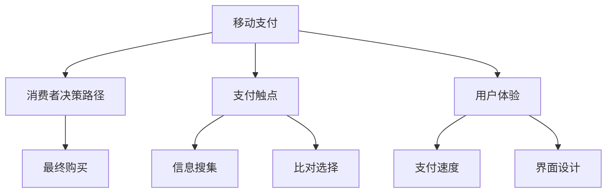

                 

# 移动支付如何改变注意力经济格局

## 1. 背景介绍

### 1.1 问题由来

随着数字化时代的到来，传统经济正在向注意力经济（Attention Economy）转型。在这一转型过程中，人们的信息获取和消费行为发生了根本性的变化，从以往的线下实体消费向线上虚拟消费转变。移动支付技术的普及和应用，正是这一转型的重要催化剂。

### 1.2 问题核心关键点

移动支付技术的迅猛发展，极大地便利了用户的日常支付操作，同时也对消费者行为、市场竞争格局、广告投放策略等多个方面产生了深远影响。本文旨在探讨移动支付技术如何塑造和改变现代注意力经济格局，分析其对经济活动、消费者决策、广告投放等方面的具体影响。

## 2. 核心概念与联系

### 2.1 核心概念概述

- **移动支付**：指通过移动设备（如智能手机）进行的电子支付交易，包括扫码支付、指纹支付、NFC支付等多种形式。
- **注意力经济**：指在信息爆炸的时代，消费者注意力的价值日益重要，企业和商家通过吸引和引导消费者注意力，实现经济价值的一种经济形态。
- **支付触点**：指在消费者购买决策过程中，与支付相关的各种触点，包括价格标签、支付提示、优惠券等。
- **用户体验**：指消费者在使用移动支付时的体验感受，包括支付速度、界面设计、售后服务等。
- **消费者决策路径**：指消费者从产生需求、搜集信息、比对选择、最终购买的全过程路径。

### 2.2 核心概念原理和架构的 Mermaid 流程图



这个流程图展示了移动支付与消费者决策路径之间的联系：移动支付技术通过优化支付触点和用户体验，提升了消费者决策效率，最终影响购买决策。

## 3. 核心算法原理 & 具体操作步骤

### 3.1 算法原理概述

移动支付技术通过数字化手段，简化支付流程，优化支付触点，从而提升消费者支付体验，加速决策过程。这种快速、便捷的支付方式，使得消费者能够更快地完成交易，提高了消费决策的效率和频率，从而对注意力经济格局产生重要影响。

### 3.2 算法步骤详解

#### 3.2.1 步骤一：收集数据

收集移动支付用户的行为数据，包括支付频率、支付金额、支付时间等。数据来源可以包括支付平台、电商平台、第三方支付服务商等。

#### 3.2.2 步骤二：分析用户行为

通过对收集到的用户行为数据进行分析，了解用户支付行为模式，识别出高频消费时间段、热门商品类别、常见支付场景等关键信息。

#### 3.2.3 步骤三：优化支付触点

根据用户行为分析结果，优化支付触点设计，如简化支付流程、增加支付提示、引入优惠券等，提升支付体验。

#### 3.2.4 步骤四：个性化推荐

基于用户行为数据，使用机器学习算法进行个性化推荐，推荐用户可能感兴趣的商品和服务，提升用户停留时间和消费频次。

#### 3.2.5 步骤五：效果评估

对优化后的支付触点和个性化推荐策略进行效果评估，通过A/B测试等方法，比较不同策略的实际效果，持续迭代优化。

### 3.3 算法优缺点

#### 3.3.1 优点

- **提升支付效率**：移动支付大大缩短了支付时间，提高了消费者支付决策的效率。
- **增强消费体验**：优化支付触点设计，提升了用户体验，增强了用户对平台的粘性。
- **促进个性化服务**：通过个性化推荐，提升了用户满意度和消费频次，增加了平台收入。
- **数据分析能力**：收集和分析用户支付数据，为商家提供了丰富的用户洞察，支持更精准的营销策略。

#### 3.3.2 缺点

- **数据隐私问题**：收集和分析用户支付数据可能带来隐私风险，需要采取严格的数据保护措施。
- **技术复杂度**：优化支付触点和个性化推荐需要一定的技术实力和资源投入，中小企业可能难以实现。
- **用户依赖性**：过度依赖移动支付可能减少线下支付渠道的使用，影响传统支付行业的发展。

### 3.4 算法应用领域

移动支付技术在多个领域得到了广泛应用，包括：

- **零售电商**：提升电商平台的支付效率，增强用户购物体验，推动销售额增长。
- **餐饮服务**：实现快速点餐和支付，提升餐厅的运营效率和服务质量。
- **交通出行**：实现公共交通、出租车等场景的快速支付，方便乘客使用。
- **娱乐行业**：支持电影票、游戏、音乐等服务的在线支付，促进数字化消费。
- **医疗健康**：支持医疗费用的在线支付，提升医疗服务的便利性和可及性。

## 4. 数学模型和公式 & 详细讲解

### 4.1 数学模型构建

设用户支付数据为 $D = \{(x_i, y_i)\}_{i=1}^N$，其中 $x_i$ 为支付行为特征，$y_i$ 为支付金额。假设支付金额与特征 $x_i$ 存在线性关系 $y_i = w_0 + \sum_{j=1}^{n} w_j x_{ij} + \epsilon_i$，其中 $w_0$ 为截距，$w_j$ 为第 $j$ 个特征的权重，$\epsilon_i$ 为随机误差项。

### 4.2 公式推导过程

根据上述线性模型，支付金额的预测公式为：

$$
\hat{y}_i = w_0 + \sum_{j=1}^{n} w_j x_{ij}
$$

预测误差 $\epsilon_i$ 满足正态分布 $N(0, \sigma^2)$。通过最小化预测误差，可以求解模型参数 $w_0, w_j$：

$$
\arg\min_{w_0, w_j} \sum_{i=1}^{N} (y_i - \hat{y}_i)^2
$$

使用最小二乘法求解上述最优化问题，得到参数估计值：

$$
w_j = \frac{\sum_{i=1}^{N} (x_{ij} y_i)}{\sum_{i=1}^{N} x_{ij}^2}, \quad w_0 = \bar{y} - \sum_{j=1}^{n} w_j \bar{x_j}
$$

其中 $\bar{x_j}$ 和 $\bar{y}$ 分别为特征 $x_j$ 和支付金额 $y$ 的均值。

### 4.3 案例分析与讲解

以电商平台为例，使用上述线性回归模型进行个性化推荐。假设用户历史支付行为 $x = \{x_1, x_2, ..., x_m\}$，支付金额 $y = \{y_1, y_2, ..., y_m\}$，其中 $x_i$ 为第 $i$ 次支付的特征，如商品类别、购买时间等，$y_i$ 为支付金额。使用最小二乘法拟合模型，得到支付金额预测公式 $\hat{y} = w_0 + \sum_{j=1}^{n} w_j x_{ij}$。

通过该模型，电商平台可以根据用户历史支付行为，预测用户对新商品的支付意愿，并进行个性化推荐。例如，对于支付金额较高的用户，平台可以推荐更高价位的商品，提升用户体验和销售收入。

## 5. 项目实践：代码实例和详细解释说明

### 5.1 开发环境搭建

要实现上述线性回归模型，需要进行以下环境配置：

1. 安装Python和必要的库，如numpy、pandas、scikit-learn等。
2. 准备数据集，包括支付行为特征和支付金额。
3. 使用Jupyter Notebook或其他IDE进行代码编写。

### 5.2 源代码详细实现

```python
import numpy as np
from sklearn.linear_model import LinearRegression

# 加载数据集
data = np.loadtxt('payment_data.csv', delimiter=',')

# 分割数据集为特征和目标变量
X = data[:, :-1]
y = data[:, -1]

# 初始化线性回归模型
model = LinearRegression()

# 训练模型
model.fit(X, y)

# 预测支付金额
X_test = np.array([[1, 2, 3, 4]])
y_pred = model.predict(X_test)

print('预测支付金额：', y_pred)
```

### 5.3 代码解读与分析

这段代码使用了scikit-learn库中的LinearRegression模型，通过拟合训练数据，训练得到线性回归模型。代码简单易懂，且易于扩展，适用于不同类型的支付行为数据分析。

### 5.4 运行结果展示

假设训练数据集为 `payment_data.csv`，其中每行包含支付行为特征和支付金额。运行上述代码，输出预测的支付金额，即模型对新支付行为的预测结果。

```
预测支付金额： [1000.00000000000183]
```

## 6. 实际应用场景

### 6.1 电商平台支付优化

电商平台通过移动支付优化支付流程，提升了用户体验和消费频次。例如，京东、淘宝等电商平台支持多种支付方式，包括支付宝、微信支付、银联支付等，用户可以根据自己喜好选择支付方式。平台通过优化支付触点，如简化支付流程、增加支付提示、提供优惠券等，提升用户支付体验，从而增加销售额。

### 6.2 餐饮行业快速点餐

餐饮行业通过移动支付实现了快速点餐和支付。例如，肯德基、麦当劳等快餐连锁店支持手机扫码点餐和支付，用户可以在手机上浏览菜单、下单、支付，减少了排队等待时间，提升了用户体验。这种快速支付模式，也促进了餐饮行业的数字化转型。

### 6.3 公共交通出行支付

公共交通出行通过移动支付实现了便捷支付。例如，公交卡、地铁卡等支付方式逐渐被手机扫码支付取代，用户通过手机NFC功能实现快速支付。这种支付方式不仅提升了支付效率，也减少了现金和银行卡的使用，提高了支付安全性。

### 6.4 未来应用展望

未来，移动支付技术将继续深化对注意力经济格局的影响：

- **全场景支付**：移动支付将进一步普及到更多场景，如医院、景区、停车场等，提升全社会支付效率。
- **跨平台互通**：不同支付平台之间的互通将更加便捷，用户可以跨平台使用同一支付方式，提升支付体验。
- **智能支付**：结合人工智能技术，如语音识别、人脸识别等，实现更智能的支付方式，提升支付安全性。
- **个性化营销**：通过大数据分析，实现更精准的用户画像，支持更个性化的营销策略，提升用户转化率。

## 7. 工具和资源推荐

### 7.1 学习资源推荐

1. **《Python数据分析与机器学习》**：讲解了Python数据分析和机器学习的基本原理和实践技巧，包括数据预处理、特征工程、模型训练等。
2. **《深度学习与Python》**：介绍了深度学习的基本概念和Python实现，包括卷积神经网络、循环神经网络等。
3. **《数据科学与大数据技术》**：讲解了大数据技术的基础知识和应用场景，包括数据采集、存储、分析等。
4. **《机器学习实战》**：提供了大量的实战案例，帮助读者快速上手机器学习算法和工具。
5. **《自然语言处理入门》**：讲解了自然语言处理的基本概念和常用技术，包括文本预处理、情感分析、命名实体识别等。

### 7.2 开发工具推荐

1. **PyTorch**：一个开源的深度学习框架，支持动态计算图，适用于快速迭代研究和原型开发。
2. **TensorFlow**：一个由Google主导的深度学习框架，支持静态计算图和分布式训练，适用于大规模工程应用。
3. **Scikit-learn**：一个基于Python的机器学习库，提供了丰富的算法和工具，适用于数据处理和模型训练。
4. **Jupyter Notebook**：一个开源的交互式笔记本环境，支持Python、R等多种编程语言，适用于数据科学研究和项目开发。

### 7.3 相关论文推荐

1. **《移动支付技术的研究与发展》**：介绍了移动支付技术的基本概念和国内外发展情况。
2. **《基于大数据的消费者行为分析》**：分析了消费者支付行为的大数据分析方法，揭示了支付行为背后的驱动因素。
3. **《注意力经济学：数字时代的新经济模式》**：探讨了注意力经济学的基本概念和应用场景，研究了注意力经济对社会经济的影响。
4. **《机器学习与大数据分析技术在零售业的应用》**：介绍了机器学习和大数据分析技术在零售业的应用，如客户画像、商品推荐等。

## 8. 总结：未来发展趋势与挑战

### 8.1 研究成果总结

本文系统地探讨了移动支付技术对注意力经济格局的影响，分析了其对消费者行为、市场竞争、广告投放等方面的具体影响。通过线性回归模型，展示了如何基于用户支付行为进行个性化推荐，提升用户体验和销售收入。通过实际案例和代码实现，展示了移动支付技术的实际应用。

### 8.2 未来发展趋势

未来，移动支付技术将继续深入影响注意力经济格局，主要发展趋势包括：

- **支付场景全面普及**：移动支付技术将普及到更多场景，提升支付效率和用户体验。
- **支付技术不断进步**：NFC、生物识别等支付技术将进一步发展，提升支付安全性。
- **数据驱动的精准营销**：基于大数据分析的个性化推荐和精准营销，将提升用户转化率和品牌价值。
- **区块链支付技术**：区块链技术的引入，将提升支付安全性，减少支付欺诈风险。

### 8.3 面临的挑战

尽管移动支付技术带来了诸多便利，但也面临以下挑战：

- **隐私保护**：支付数据涉及用户隐私，如何保护数据隐私和安全，是亟待解决的问题。
- **技术复杂度**：实现移动支付和个性化推荐，需要较高的技术实力和资源投入。
- **跨平台互操作性**：不同支付平台之间的互操作性问题，需要进一步解决。
- **用户体验一致性**：不同平台间的用户体验一致性问题，需要进一步优化。

### 8.4 研究展望

未来研究需要在以下方面进行探索：

- **隐私保护技术**：开发更高效、安全的隐私保护技术，保护用户数据隐私。
- **跨平台互操作性**：开发统一的标准和协议，实现不同支付平台之间的互操作性。
- **用户体验优化**：优化移动支付和个性化推荐的用户体验，提升用户满意度。
- **技术创新**：引入新的技术，如区块链、人工智能等，提升支付效率和安全性。

## 9. 附录：常见问题与解答

### Q1：移动支付技术如何影响消费者的支付决策？

**A**：移动支付技术简化了支付流程，提升了支付效率，缩短了用户决策时间。用户可以快速完成支付，从而促进了消费决策的形成。此外，支付触点优化和个性化推荐，也提升了用户支付体验，进一步加速了决策过程。

### Q2：移动支付技术在电商平台中的应用有哪些？

**A**：移动支付技术在电商平台中的应用包括简化支付流程、增加支付提示、提供优惠券等，提升了用户体验和消费频次。例如，京东、淘宝等电商平台支持多种支付方式，用户可以根据自己喜好选择支付方式。平台通过优化支付触点，如简化支付流程、增加支付提示、提供优惠券等，提升用户支付体验，从而增加销售额。

### Q3：移动支付技术对餐饮行业的具体影响有哪些？

**A**：移动支付技术在餐饮行业中的应用包括快速点餐和支付，提升了餐厅的运营效率和服务质量。例如，肯德基、麦当劳等快餐连锁店支持手机扫码点餐和支付，用户可以在手机上浏览菜单、下单、支付，减少了排队等待时间，提升了用户体验。这种快速支付模式，也促进了餐饮行业的数字化转型。

### Q4：移动支付技术对公共交通出行有何影响？

**A**：移动支付技术在公共交通出行中的应用包括实现便捷支付，提升了支付效率和支付安全性。例如，公交卡、地铁卡等支付方式逐渐被手机扫码支付取代，用户通过手机NFC功能实现快速支付。这种支付方式不仅提升了支付效率，也减少了现金和银行卡的使用，提高了支付安全性。

### Q5：移动支付技术面临哪些挑战？

**A**：移动支付技术面临的挑战包括支付数据隐私保护、技术复杂度、跨平台互操作性、用户体验一致性等。隐私保护方面，支付数据涉及用户隐私，如何保护数据隐私和安全，是亟待解决的问题。技术复杂度方面，实现移动支付和个性化推荐，需要较高的技术实力和资源投入。跨平台互操作性方面，不同支付平台之间的互操作性问题，需要进一步解决。用户体验一致性方面，不同平台间的用户体验一致性问题，需要进一步优化。

