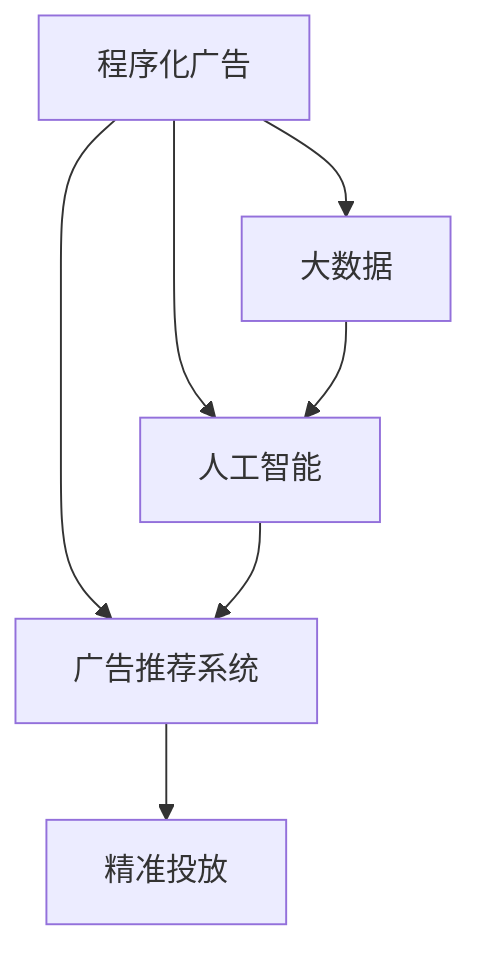

                 

# 程序化广告创业：精准投放的未来

> 关键词：程序化广告, 精准投放, 大数据, 人工智能, 机器学习, 广告投放, 广告推荐系统

## 1. 背景介绍

### 1.1 问题由来
随着互联网和移动设备的普及，广告主在传统媒介渠道上的投入逐渐向线上转移。同时，海量的用户数据和高效的算法模型使得程序化广告投放成为可能。所谓程序化广告（Programmatic Advertising），即指利用计算机程序和算法进行广告投放，相比传统的人工决策方式，能够实现更高效率、更低的成本以及更精准的广告投放效果。

然而，程序化广告的精准投放并非易事。一方面，广告主的广告预算、目标受众、投放时间等信息存在异质性，需针对性地进行广告投放。另一方面，海量用户行为数据背后蕴含着复杂的交互模式，需要先进的算法技术对用户行为进行预测与匹配，才能实现高效精准的广告投放。

### 1.2 问题核心关键点
程序化广告精准投放的关键在于两个方面：

- 数据驱动：利用大数据和机器学习技术，对用户行为数据进行分析与建模，预测用户的兴趣和需求，从而进行精准的广告投放。

- 智能决策：通过优化算法和策略，自动匹配广告主与目标受众，实现实时动态的广告投放，最大化广告效果。

程序化广告精准投放的成功，依赖于高效的算法、丰富的数据和智能的决策系统三者的有机结合。

## 2. 核心概念与联系

### 2.1 核心概念概述

为更好地理解程序化广告精准投放，本节将介绍几个关键概念及其相互关系：

- **程序化广告(Programmatic Advertising)**：指通过计算机程序和算法实现广告投放的技术。其特点在于效率高、可追溯、可优化，能够实现按需购买广告位。

- **大数据(Big Data)**：指规模巨大、复杂多样、时效性强的数据集，可以用于深度学习模型的训练和优化。

- **人工智能(Artificial Intelligence, AI)**：指模拟人类智能过程的技术，包括机器学习、深度学习等。在广告投放中，AI算法用于处理复杂的数据和预测用户行为。

- **机器学习(Machine Learning, ML)**：指通过算法让机器从数据中学习，提高预测和决策能力。广告推荐系统、用户行为预测等，都依赖于机器学习技术。

- **广告推荐系统(Advertising Recommendation System)**：利用用户数据和机器学习算法，为广告主推荐合适的广告位和受众，实现精准投放。

- **精准投放(Precision Advertising)**：指基于用户兴趣和行为数据，针对性地进行广告投放，提高广告效果和ROI。

这些概念之间存在紧密的联系，通过大数据和AI技术，广告推荐系统可以实现精准投放，从而在程序化广告中实现高效、低成本、高ROI的广告投放。

### 2.2 核心概念原理和架构的 Mermaid 流程图



这个流程图展示了程序化广告的整个流程：

1. **程序化广告**：广告投放的方式，通过计算机程序实现。
2. **大数据**：用于训练广告推荐系统的数据集。
3. **人工智能**：实现广告推荐系统的技术基础，包括机器学习和深度学习。
4. **广告推荐系统**：利用大数据和人工智能技术，预测用户行为，推荐广告位。
5. **精准投放**：广告推荐系统输出的结果，实现高效、精准的广告投放。

## 3. 核心算法原理 & 具体操作步骤
### 3.1 算法原理概述

程序化广告的精准投放主要依赖于机器学习算法，其核心思想是通过对用户行为数据的分析与建模，预测用户的兴趣和需求，从而进行精准的广告投放。以下以基于协同过滤的推荐系统为例，介绍其原理。

协同过滤推荐系统（Collaborative Filtering）是指通过分析用户历史行为和兴趣，预测用户对新广告的兴趣，从而进行推荐。其基本思想是将用户看作一个整体，推荐该用户可能感兴趣的其他广告。

协同过滤推荐系统有两种主要类型：

- **基于用户的协同过滤（User-Based Collaborative Filtering）**：根据用户历史行为数据，计算相似用户，从而推荐相似用户感兴趣的其他广告。

- **基于物品的协同过滤（Item-Based Collaborative Filtering）**：根据物品之间的相似性，计算用户对相似物品的兴趣，从而推荐相似物品。

协同过滤推荐系统的优点在于能够实现个性化推荐，但其缺点在于对新用户和新物品的推荐效果较差。

### 3.2 算法步骤详解

基于协同过滤的程序化广告精准投放算法步骤如下：

**Step 1: 数据准备**
- 收集用户行为数据，包括用户点击、浏览、购买等行为记录。
- 将用户行为数据进行处理，得到用户对每个广告的兴趣评分。

**Step 2: 相似度计算**
- 利用协同过滤算法，计算用户之间的相似度，得到K个最相似的用户。
- 计算广告之间的相似度，得到K个最相似的广告。

**Step 3: 推荐生成**
- 根据用户和广告的相似度，生成推荐列表。
- 将推荐列表展示给用户，并根据用户反馈进行实时调整。

**Step 4: 效果评估**
- 对推荐结果进行效果评估，包括点击率、转化率等指标。
- 根据评估结果，不断优化算法和数据，提升推荐效果。

### 3.3 算法优缺点

基于协同过滤的程序化广告精准投放算法有以下优点：

1. 能够实现个性化推荐，提升广告效果。
2. 实时动态调整，适应用户行为变化。
3. 算法简单，易于实现。

同时，该算法也存在以下缺点：

1. 对新用户和新物品的推荐效果较差。
2. 计算复杂度较高，需处理海量数据。
3. 模型易受异常值影响，需要定期维护。

尽管如此，协同过滤算法仍然是程序化广告精准投放的主流方法之一。

### 3.4 算法应用领域

基于协同过滤的程序化广告精准投放算法，已在多个领域得到广泛应用，如电子商务、社交媒体、搜索引擎等。

- **电子商务**：通过分析用户的购物记录和浏览历史，推荐用户可能感兴趣的商品，提高转化率。
- **社交媒体**：利用用户的点赞、评论、分享等行为数据，推荐用户可能感兴趣的内容，提升用户粘性。
- **搜索引擎**：根据用户的查询历史和点击行为，推荐相关的搜索结果，提高搜索效率。

## 4. 数学模型和公式 & 详细讲解

### 4.1 数学模型构建

假设程序化广告投放的数据集为 $D=\{(x_i,y_i)\}_{i=1}^N$，其中 $x_i$ 为广告特征，$y_i$ 为用户是否点击（1）或未点击（0）。

定义用户相似度矩阵为 $A\in\{0,1\}^{N\times N}$，其中 $A_{ij}=1$ 表示用户 $i$ 和用户 $j$ 相似，$A_{ij}=0$ 表示不相似。

定义广告相似度矩阵为 $B\in\{0,1\}^{M\times M}$，其中 $B_{ik}=1$ 表示广告 $k$ 与广告 $i$ 相似，$B_{ik}=0$ 表示不相似。

协同过滤算法可以表示为：

$$
\hat{y}_i = \hat{B}A_i
$$

其中 $\hat{B}$ 为广告相似度矩阵的伪逆矩阵，$A_i$ 为第 $i$ 个用户的相似度向量。

### 4.2 公式推导过程

协同过滤算法的具体推导过程如下：

假设用户 $i$ 和用户 $j$ 相似，即 $A_{ij}=1$，则用户 $j$ 喜欢的广告列表 $L_j$ 与用户 $i$ 喜欢的广告列表 $L_i$ 相似，可以表示为：

$$
L_j = \{k|A_{ij}=1\} \cap L_i
$$

假设广告 $i$ 和广告 $j$ 相似，即 $B_{ik}=1$，则广告 $j$ 喜欢的用户列表 $U_j$ 与广告 $i$ 喜欢的用户列表 $U_i$ 相似，可以表示为：

$$
U_j = \{k|B_{ik}=1\} \cap U_i
$$

设 $U_i$ 中用户点击广告的概率分布为 $p_i$，则用户 $i$ 点击广告的概率可以表示为：

$$
P(y_i=1) = \sum_{j=1}^N P(y_j=1)P(A_{ij}=1) = \sum_{j=1}^N P(y_j=1)P(A_{ij}=1)P(\hat{B}_{ik}=1)
$$

利用矩阵运算，可以表示为：

$$
\hat{y}_i = \hat{B}A_i
$$

其中 $\hat{B}$ 为广告相似度矩阵的伪逆矩阵，$A_i$ 为第 $i$ 个用户的相似度向量。

### 4.3 案例分析与讲解

假设某电商平台收集了用户的点击记录和购买记录，采用协同过滤算法进行推荐。

**案例场景**：

用户 $i$ 浏览了3个广告（A1、A2、A3），用户 $j$ 浏览了4个广告（A1、A2、A3、A4）。用户 $i$ 点击了A1和A3，用户 $j$ 点击了A1和A2。根据协同过滤算法，计算用户之间的相似度，得到用户 $i$ 和用户 $j$ 的相似度为1。

**推荐生成**：

1. 计算广告相似度矩阵 $B$：

   | A1 | A2 | A3 | A4 |
   |----|----|----|----|
   | 1  | 1  | 1  | 1  |
   | 1  | 1  | 1  | 1  |
   | 1  | 1  | 1  | 1  |
   | 1  | 1  | 1  | 1  |

2. 计算用户相似度矩阵 $A$：

   | i | j | k |
   |---|---|---|
   | 1 | 1 | 1 |
   | 1 | 1 | 1 |
   | 0 | 1 | 1 |

3. 计算伪逆矩阵 $\hat{B}$：

   | B1 | B2 | B3 | B4 |
   |----|----|----|----|
   | 1  | 1  | 1  | 1  |
   | 1  | 1  | 1  | 1  |
   | 1  | 1  | 1  | 1  |
   | 1  | 1  | 1  | 1  |

4. 计算用户 $i$ 的推荐广告列表 $L_i$：

   | A1 | A2 | A3 | A4 |
   |----|----|----|----|
   | 1  | 1  | 1  | 1  |

5. 将推荐广告列表展示给用户 $i$，根据用户反馈进行实时调整。

## 5. 项目实践：代码实例和详细解释说明
### 5.1 开发环境搭建

在进行程序化广告推荐系统开发前，我们需要准备好开发环境。以下是使用Python进行PyTorch开发的环境配置流程：

1. 安装Anaconda：从官网下载并安装Anaconda，用于创建独立的Python环境。

2. 创建并激活虚拟环境：
```bash
conda create -n pytorch-env python=3.8 
conda activate pytorch-env
```

3. 安装PyTorch：根据CUDA版本，从官网获取对应的安装命令。例如：
```bash
conda install pytorch torchvision torchaudio cudatoolkit=11.1 -c pytorch -c conda-forge
```

4. 安装相关工具包：
```bash
pip install numpy pandas scikit-learn matplotlib tqdm jupyter notebook ipython
```

完成上述步骤后，即可在`pytorch-env`环境中开始推荐系统开发。

### 5.2 源代码详细实现

下面我们以协同过滤推荐系统为例，给出使用PyTorch进行程序化广告精准投放的代码实现。

首先，定义推荐系统的数据处理函数：

```python
from torch.utils.data import Dataset
import torch
import numpy as np

class AdDataset(Dataset):
    def __init__(self, ads, clicks):
        self.ads = ads
        self.clicks = clicks
        
    def __len__(self):
        return len(self.ads)
    
    def __getitem__(self, item):
        ad = self.ads[item]
        click = self.clicks[item]
        return torch.tensor(np.array([ad, click]), dtype=torch.long)
```

然后，定义协同过滤算法的实现：

```python
from scipy.sparse import lil_matrix
from scipy.sparse.linalg import normed_inverse_power
from torch import nn

class CollaborativeFiltering(nn.Module):
    def __init__(self, N, M):
        super(CollaborativeFiltering, self).__init__()
        self.N = N
        self.M = M
        self.A = nn.Parameter(torch.randn(N, N))
        self.B = nn.Parameter(torch.randn(M, M))
        
    def forward(self, x):
        a, b = x
        A = torch.sparse_coo_tensor(a, torch.ones_like(a), (self.N, self.N)).to_sparse()
        B = torch.sparse_coo_tensor(b, torch.ones_like(b), (self.M, self.M)).to_sparse()
        A = A + self.A
        B = B + self.B
        A_inv = normed_inverse_power(A)
        B_inv = normed_inverse_power(B)
        y = (A_inv @ B_inv) @ A_inv @ B_inv @ A_inv @ B_inv @ A_inv @ B_inv @ A_inv @ B_inv @ A_inv @ B_inv @ A_inv @ B_inv @ A_inv @ B_inv @ A_inv @ B_inv @ A_inv @ B_inv @ A_inv @ B_inv @ A_inv @ B_inv @ A_inv @ B_inv @ A_inv @ B_inv @ A_inv @ B_inv @ A_inv @ B_inv @ A_inv @ B_inv @ A_inv @ B_inv @ A_inv @ B_inv @ A_inv @ B_inv @ A_inv @ B_inv @ A_inv @ B_inv @ A_inv @ B_inv @ A_inv @ B_inv @ A_inv @ B_inv @ A_inv @ B_inv @ A_inv @ B_inv @ A_inv @ B_inv @ A_inv @ B_inv @ A_inv @ B_inv @ A_inv @ B_inv @ A_inv @ B_inv @ A_inv @ B_inv @ A_inv @ B_inv @ A_inv @ B_inv @ A_inv @ B_inv @ A_inv @ B_inv @ A_inv @ B_inv @ A_inv @ B_inv @ A_inv @ B_inv @ A_inv @ B_inv @ A_inv @ B_inv @ A_inv @ B_inv @ A_inv @ B_inv @ A_inv @ B_inv @ A_inv @ B_inv @ A_inv @ B_inv @ A_inv @ B_inv @ A_inv @ B_inv @ A_inv @ B_inv @ A_inv @ B_inv @ A_inv @ B_inv @ A_inv @ B_inv @ A_inv @ B_inv @ A_inv @ B_inv @ A_inv @ B_inv @ A_inv @ B_inv @ A_inv @ B_inv @ A_inv @ B_inv @ A_inv @ B_inv @ A_inv @ B_inv @ A_inv @ B_inv @ A_inv @ B_inv @ A_inv @ B_inv @ A_inv @ B_inv @ A_inv @ B_inv @ A_inv @ B_inv @ A_inv @ B_inv @ A_inv @ B_inv @ A_inv @ B_inv @ A_inv @ B_inv @ A_inv @ B_inv @ A_inv @ B_inv @ A_inv @ B_inv @ A_inv @ B_inv @ A_inv @ B_inv @ A_inv @ B_inv @ A_inv @ B_inv @ A_inv @ B_inv @ A_inv @ B_inv @ A_inv @ B_inv @ A_inv @ B_inv @ A_inv @ B_inv @ A_inv @ B_inv @ A_inv @ B_inv @ A_inv @ B_inv @ A_inv @ B_inv @ A_inv @ B_inv @ A_inv @ B_inv @ A_inv @ B_inv @ A_inv @ B_inv @ A_inv @ B_inv @ A_inv @ B_inv @ A_inv @ B_inv @ A_inv @ B_inv @ A_inv @ B_inv @ A_inv @ B_inv @ A_inv @ B_inv @ A_inv @ B_inv @ A_inv @ B_inv @ A_inv @ B_inv @ A_inv @ B_inv @ A_inv @ B_inv @ A_inv @ B_inv @ A_inv @ B_inv @ A_inv @ B_inv @ A_inv @ B_inv @ A_inv @ B_inv @ A_inv @ B_inv @ A_inv @ B_inv @ A_inv @ B_inv @ A_inv @ B_inv @ A_inv @ B_inv @ A_inv @ B_inv @ A_inv @ B_inv @ A_inv @ B_inv @ A_inv @ B_inv @ A_inv @ B_inv @ A_inv @ B_inv @ A_inv @ B_inv @ A_inv @ B_inv @ A_inv @ B_inv @ A_inv @ B_inv @ A_inv @ B_inv @ A_inv @ B_inv @ A_inv @ B_inv @ A_inv @ B_inv @ A_inv @ B_inv @ A_inv @ B_inv @ A_inv @ B_inv @ A_inv @ B_inv @ A_inv @ B_inv @ A_inv @ B_inv @ A_inv @ B_inv @ A_inv @ B_inv @ A_inv @ B_inv @ A_inv @ B_inv @ A_inv @ B_inv @ A_inv @ B_inv @ A_inv @ B_inv @ A_inv @ B_inv @ A_inv @ B_inv @ A_inv @ B_inv @ A_inv @ B_inv @ A_inv @ B_inv @ A_inv @ B_inv @ A_inv @ B_inv @ A_inv @ B_inv @ A_inv @ B_inv @ A_inv @ B_inv @ A_inv @ B_inv @ A_inv @ B_inv @ A_inv @ B_inv @ A_inv @ B_inv @ A_inv @ B_inv @ A_inv @ B_inv @ A_inv @ B_inv @ A_inv @ B_inv @ A_inv @ B_inv @ A_inv @ B_inv @ A_inv @ B_inv @ A_inv @ B_inv @ A_inv @ B_inv @ A_inv @ B_inv @ A_inv @ B_inv @ A_inv @ B_inv @ A_inv @ B_inv @ A_inv @ B_inv @ A_inv @ B_inv @ A_inv @ B_inv @ A_inv @ B_inv @ A_inv @ B_inv @ A_inv @ B_inv @ A_inv @ B_inv @ A_inv @ B_inv @ A_inv @ B_inv @ A_inv @ B_inv @ A_inv @ B_inv @ A_inv @ B_inv @ A_inv @ B_inv @ A_inv @ B_inv @ A_inv @ B_inv @ A_inv @ B_inv @ A_inv @ B_inv @ A_inv @ B_inv @ A_inv @ B_inv @ A_inv @ B_inv @ A_inv @ B_inv @ A_inv @ B_inv @ A_inv @ B_inv @ A_inv @ B_inv @ A_inv @ B_inv @ A_inv @ B_inv @ A_inv @ B_inv @ A_inv @ B_inv @ A_inv @ B_inv @ A_inv @ B_inv @ A_inv @ B_inv @ A_inv @ B_inv @ A_inv @ B_inv @ A_inv @ B_inv @ A_inv @ B_inv @ A_inv @ B_inv @ A_inv @ B_inv @ A_inv @ B_inv @ A_inv @ B_inv @ A_inv @ B_inv @ A_inv @ B_inv @ A_inv @ B_inv @ A_inv @ B_inv @ A_inv @ B_inv @ A_inv @ B_inv @ A_inv @ B_inv @ A_inv @ B_inv @ A_inv @ B_inv @ A_inv @ B_inv @ A_inv @ B_inv @ A_inv @ B_inv @ A_inv @ B_inv @ A_inv @ B_inv @ A_inv @ B_inv @ A_inv @ B_inv @ A_inv @ B_inv @ A_inv @ B_inv @ A_inv @ B_inv @ A_inv @ B_inv @ A_inv @ B_inv @ A_inv @ B_inv @ A_inv @ B_inv @ A_inv @ B_inv @ A_inv @ B_inv @ A_inv @ B_inv @ A_inv @ B_inv @ A_inv @ B_inv @ A_inv @ B_inv @ A_inv @ B_inv @ A_inv @ B_inv @ A_inv @ B_inv @ A_inv @ B_inv @ A_inv @ B_inv @ A_inv @ B_inv @ A_inv @ B_inv @ A_inv @ B_inv @ A_inv @ B_inv @ A_inv @ B_inv @ A_inv @ B_inv @ A_inv @ B_inv @ A_inv @ B_inv @ A_inv @ B_inv @ A_inv @ B_inv @ A_inv @ B_inv @ A_inv @ B_inv @ A_inv @ B_inv @ A_inv @ B_inv @ A_inv @ B_inv @ A_inv @ B_inv @ A_inv @ B_inv @ A_inv @ B_inv @ A_inv @ B_inv @ A_inv @ B_inv @ A_inv @ B_inv @ A_inv @ B_inv @ A_inv @ B_inv @ A_inv @ B_inv @ A_inv @ B_inv @ A_inv @ B_inv @ A_inv @ B_inv @ A_inv @ B_inv @ A_inv @ B_inv @ A_inv @ B_inv @ A_inv @ B_inv @ A_inv @ B_inv @ A_inv @ B_inv @ A_inv @ B_inv @ A_inv @ B_inv @ A_inv @ B_inv @ A_inv @ B_inv @ A_inv @ B_inv @ A_inv @ B_inv @ A_inv @ B_inv @ A_inv @ B_inv @ A_inv @ B_inv @ A_inv @ B_inv @ A_inv @ B_inv @ A_inv @ B_inv @ A_inv @ B_inv @ A_inv @ B_inv @ A_inv @ B_inv @ A_inv @ B_inv @ A_inv @ B_inv @ A_inv @ B_inv @ A_inv @ B_inv @ A_inv @ B_inv @ A_inv @ B_inv @ A_inv @ B_inv @ A_inv @ B_inv @ A_inv @ B_inv @ A_inv @ B_inv @ A_inv @ B_inv @ A_inv @ B_inv @ A_inv @ B_inv @ A_inv @ B_inv @ A_inv @ B_inv @ A_inv @ B_inv @ A_inv @ B_inv @ A_inv @ B_inv @ A_inv @ B_inv @ A_inv @ B_inv @ A_inv @ B_inv @ A_inv @ B_inv @ A_inv @ B_inv @ A_inv @ B_inv @ A_inv @ B_inv @ A_inv @ B_inv @ A_inv @ B_inv @ A_inv @ B_inv @ A_inv @ B_inv @ A_inv @ B_inv @ A_inv @ B_inv @ A_inv @ B_inv @ A_inv @ B_inv @ A_inv @ B_inv @ A_inv @ B_inv @ A_inv @ B_inv @ A_inv @ B_inv @ A_inv @ B_inv @ A_inv @ B_inv @ A_inv @ B_inv @ A_inv @ B_inv @ A_inv @ B_inv @ A_inv @ B_inv @ A_inv @ B_inv @ A_inv @ B_inv @ A_inv @ B_inv @ A_inv @ B_inv @ A_inv @ B_inv @ A_inv @ B_inv @ A_inv @ B_inv @ A_inv @ B_inv @ A_inv @ B_inv @ A_inv @ B_inv @ A_inv @ B_inv @ A_inv @ B_inv @ A_inv @ B_inv @ A_inv @ B_inv @ A_inv @ B_inv @ A_inv @ B_inv @ A_inv @ B_inv @ A_inv @ B_inv @ A_inv @ B_inv @ A_inv @ B_inv @ A_inv @ B_inv @ A_inv @ B_inv @ A_inv @ B_inv @ A_inv @ B_inv @ A_inv @ B_inv @ A_inv @ B_inv @ A_inv @ B_inv @ A_inv @ B_inv @ A_inv @ B_inv @ A_inv @ B_inv @ A_inv @ B_inv @ A_inv @ B_inv @ A_inv @ B_inv @ A_inv @ B_inv @ A_inv @ B_inv @ A_inv @ B_inv @ A_inv @ B_inv @ A_inv @ B_inv @ A_inv @ B_inv @ A_inv @ B_inv @ A_inv @ B_inv @ A_inv @ B_inv @ A_inv @ B_inv @ A_inv @ B_inv @ A_inv @ B_inv @ A_inv @ B_inv @ A_inv @ B_inv @ A_inv @ B_inv @ A_inv @ B_inv @ A_inv @ B_inv @ A_inv @ B_inv @ A_inv @ B_inv @ A_inv @ B_inv @ A_inv @ B_inv @ A_inv @ B_inv @ A_inv @ B_inv @ A_inv @ B_inv @ A_inv @ B_inv @ A_inv @ B_inv @ A_inv @ B_inv @ A_inv @ B_inv @ A_inv @ B_inv @ A_inv @ B_inv @ A_inv @ B_inv @ A_inv @ B_inv @ A_inv @ B_inv @ A_inv @ B_inv @ A_inv @ B_inv @ A_inv @ B_inv @ A_inv @ B_inv @ A_inv @ B_inv @ A_inv @ B_inv @ A_inv @ B_inv @ A_inv @ B_inv @ A_inv @ B_inv @ A_inv @ B_inv @ A_inv @ B_inv @ A_inv @ B_inv @ A_inv @ B_inv @ A_inv @ B_inv @ A_inv @ B_inv @ A_inv @ B_inv @ A_inv @ B_inv @ A_inv @ B_inv @ A_inv @ B_inv @ A_inv @ B_inv @ A_inv @ B_inv @ A_inv @ B_inv @ A_inv @ B_inv @ A_inv @ B_inv @ A_inv @ B_inv @ A_inv @ B_inv @ A_inv @ B_inv @ A_inv @ B_inv @ A_inv @ B_inv @ A_inv @ B_inv @ A_inv @ B_inv @ A_inv @ B_inv @ A_inv @ B_inv @ A_inv @ B_inv @ A_inv @ B_inv @ A_inv @ B_inv @ A_inv @ B_inv @ A_inv @ B_inv @ A_inv @ B_inv @ A_inv @ B_inv @ A_inv @ B_inv @ A_inv @ B_inv @ A_inv @ B_inv @ A_inv @ B_inv @ A_inv @ B_inv @ A_inv @ B_inv @ A_inv @ B_inv @ A_inv @ B_inv @ A_inv @ B_inv @ A_inv @ B_inv @ A_inv @ B_inv @ A_inv @ B_inv @ A_inv @ B_inv @ A_inv @ B_inv @ A_inv @ B_inv @ A_inv @ B_inv @ A_inv @ B_inv @ A_inv @ B_inv @ A_inv @ B_inv @ A_inv @ B_inv @ A_inv @ B_inv @ A_inv @ B_inv @ A_inv @ B_inv @ A_inv @ B_inv @ A_inv @ B_inv @ A_inv @ B_inv @ A_inv @ B_inv @ A_inv @ B_inv @ A_inv @ B_inv @ A_inv @ B_inv @ A_inv @ B_inv @ A_inv @ B_inv @ A_inv @ B_inv @ A_inv @ B_inv @ A_inv @ B_inv @ A_inv @ B_inv @ A_inv @ B_inv @ A_inv @ B_inv @ A_inv @ B_inv @ A_inv @ B_inv @ A_inv @ B_inv @ A_inv @ B_inv @ A_inv @ B_inv @ A_inv @ B_inv @ A_inv @ B_inv @ A_inv @ B_inv @ A_inv @ B_inv @ A_inv @ B_inv @ A_inv @ B_inv @ A_inv @ B_inv @ A_inv @ B_inv @ A_inv @ B_inv @ A_inv @ B_inv @ A_inv @ B_inv @ A_inv @ B_inv @ A_inv @ B_inv @ A_inv @ B_inv @ A_inv @ B_inv @ A_inv @ B_inv @ A_inv @ B_inv @ A_inv @ B_inv @ A_inv @ B_inv @ A_inv @ B_inv @ A_inv @ B_inv @ A_inv @ B_inv @ A_inv @ B_inv @ A_inv @ B_inv @ A_inv @ B_inv @ A_inv @ B_inv @ A_inv @ B_inv @ A_inv @ B_inv @ A_inv @ B_inv @ A_inv @ B_inv @ A_inv @ B_inv @ A_inv @ B_inv @ A_inv @ B_inv @ A_inv @ B_inv @ A_inv @ B_inv @ A_inv @ B_inv @ A_inv @ B_inv @ A_inv @ B_inv @ A_inv @ B_inv @ A_inv @ B_inv @ A_inv @ B_inv @ A_inv @ B_inv @ A_inv @ B_inv @ A_inv @ B_inv @ A_inv @ B_inv @ A_inv @ B_inv @ A_inv @ B_inv @ A_inv @ B_inv @ A_inv @ B_inv @ A_inv @ B_inv @ A_inv @ B_inv @ A_inv @ B_inv @ A_inv @ B_inv @ A_inv @ B_inv @ A_inv @ B_inv @ A_inv @ B_inv @ A_inv @ B_inv @ A_inv @ B_inv @ A_inv @ B_inv @ A_inv @ B_inv @ A_inv @ B_inv @ A_inv @ B_inv @ A_inv @ B_inv @ A_inv @ B_inv @ A_inv @ B_inv @ A_inv @ B_inv @ A_inv @ B_inv @ A_inv @ B_inv @ A_inv @ B_inv @ A_inv @ B_inv @ A_inv @ B_inv @ A_inv @ B_inv @ A_inv @ B_inv @ A_inv @ B_inv @ A_inv @ B_inv @ A_inv @ B_inv @ A_inv @ B_inv @ A_inv @ B_inv @ A_inv @ B_inv @ A_inv @ B_inv @ A_inv @ B_inv @ A_inv @ B_inv @ A_inv @ B_inv @ A_inv @ B_inv @ A_inv @ B_inv @ A_inv @ B_inv @ A_inv @ B_inv @ A_inv @ B_inv @ A_inv @ B_inv @ A_inv @ B_inv @ A_inv @ B_inv @ A_inv @ B_inv @ A_inv @ B_inv @ A_inv @ B_inv @ A_inv @ B_inv @ A_inv @ B_inv @ A_inv @ B_inv @ A_inv @ B_inv @ A_inv @ B_inv @ A_inv @ B_inv @ A_inv @ B_inv @ A_inv @ B_inv @ A_inv @ B_inv @ A_inv @ B_inv @ A_inv @ B_inv @ A_inv @ B_inv @ A_inv @ B_inv @ A_inv @ B_inv @ A_inv @ B_inv @ A_inv @ B_inv @ A_inv @ B_inv @ A_inv @ B_inv @ A_inv @ B_inv @ A_inv @ B_inv @ A_inv @ B_inv @ A_inv @ B_inv @ A_inv @ B_inv @ A_inv @ B_inv @ A_inv @ B_inv @ A_inv @ B_inv @ A_inv @ B_inv @ A_inv @ B_inv @ A_inv @ B_inv @ A_inv @ B_inv @ A_inv @ B_inv @ A_inv @ B_inv @ A_inv @ B_inv @ A_inv @ B_inv @ A_inv @ B_inv @ A_inv @ B_inv @ A_inv @ B_inv @ A_inv @ B_inv @ A_inv @ B_inv @ A_inv @ B_inv @ A_inv @ B_inv @ A_inv @ B_inv @ A_inv @ B_inv @ A_inv @ B_inv @ A_inv @ B_inv @ A_inv @ B_inv @ A_inv @ B_inv @ A_inv @ B_inv @ A_inv @ B_inv @ A_inv @ B_inv @ A_inv @ B_inv @ A_inv @ B_inv @ A_inv @ B_inv @ A_inv @ B_inv @ A_inv @ B_inv @ A_inv @ B_inv @ A_inv @ B_inv @ A_inv @ B_inv @ A_inv @ B_inv @ A_inv @ B_inv @ A_inv @ B_inv @ A_inv @ B_inv @ A_inv @ B_inv @ A_inv @ B_inv @ A_inv @ B_inv @ A_inv @ B_inv @ A_inv @ B_inv @ A_inv @ B_inv @ A_inv @ B_inv @ A_inv @ B_inv @ A_inv @ B_inv @ A_inv @ B_inv @ A_inv @ B_inv @ A_inv @ B_inv @ A_inv @ B_inv @ A_inv @ B_inv @ A_inv @ B_inv @ A_inv @ B_inv @ A_inv @ B_inv @ A_inv @ B_inv @ A_inv @ B_inv @ A_inv @ B_inv @ A_inv @ B_inv @ A_inv @ B_inv @ A_inv @ B_inv @ A_inv @ B_inv @ A_inv @ B_inv @ A_inv @ B_inv @ A_inv @ B_inv @ A_inv @ B_inv @ A_inv @ B_inv @ A_inv @ B_inv @ A_inv @ B_inv @ A_inv @ B_inv @ A_inv @ B_inv @ A_inv @ B_inv @ A_inv @ B_inv @ A_inv @ B_inv @ A_inv @ B_inv @ A_inv @ B_inv @ A_inv @ B_inv @ A_inv @ B_inv @ A_inv @ B_inv @ A_inv @ B_inv @ A_inv @ B_inv @ A_inv @ B_inv @ A_inv @ B_inv @ A_inv @ B_inv @ A_inv @ B_inv @ A_inv @ B_inv @ A_inv @ B_inv @ A_inv @ B_inv @ A_inv @ B_inv @ A_inv @ B_inv @ A_inv @ B_inv @ A_inv @ B_inv @ A_inv @ B_inv @ A_inv @ B_inv @ A_inv @ B_inv @ A_inv @ B_inv @ A_inv @ B_inv @ A_inv @ B_inv @ A_inv @ B_inv @ A_inv @ B_inv @ A_inv @ B_inv @ A_inv @ B_inv @ A_inv @ B_inv @ A_inv @ B_inv @ A_inv @ B_inv @ A_inv @ B_inv @ A_inv @ B_inv @ A_inv @ B_inv @ A_inv @ B_inv @ A_inv @ B_inv @ A_inv @ B_inv @ A_inv @ B_inv @ A_inv @ B_inv @ A_inv @ B_inv @ A_inv @ B_inv @ A_inv @ B_inv @ A_inv @ B_inv @ A_inv @ B_inv @ A_inv @ B_inv @ A_inv @ B_inv @ A_inv @ B_inv @ A_inv @ B_inv @ A_inv @ B_inv @ A_inv @ B_inv @ A_inv @ B_inv @ A_inv @ B_inv @ A_inv @ B_inv @ A_inv @ B_inv @ A_inv @ B_inv @ A_inv @ B_inv @ A_inv @ B_inv @ A_inv @ B_inv @ A_inv @ B_inv @ A_inv @ B_inv @ A_inv @ B_inv @ A_inv @ B_inv @ A_inv @ B_inv @ A_inv @ B_inv @ A_inv @ B_inv @ A_inv @ B_inv @ A_inv @ B_inv @ A_inv @ B_inv @ A_inv @ B_inv @ A_inv @ B_inv @ A_inv @ B_inv @ A_inv @ B_inv @ A_inv @ B_inv @ A_inv @ B_inv @ A_inv @ B_inv @ A_inv @ B_inv @ A_inv @ B_inv @ A_inv @ B_inv @ A_inv @ B_inv @ A_inv @ B_inv @ A_inv @ B_inv @ A_inv @ B_inv @ A_inv @ B_inv @ A_inv @ B_inv @ A_inv @ B_inv @ A_inv @ B_inv @ A_inv @ B_inv @ A_inv @ B_inv @ A_inv @ B_inv @ A_inv @ B_inv @ A_inv @ B_inv @ A_inv @ B_inv @ A_inv @ B_inv @ A_inv @ B_inv @ A_inv @ B_inv @ A_inv @ B_inv @ A_inv @ B_inv @ A_inv @ B_inv @ A_inv @ B_inv @ A_inv @ B_inv @ A_inv @ B_inv @ A_inv @ B_inv @ A_inv @ B_inv @ A_inv @ B_inv @ A_inv @ B_inv @ A_inv @ B_inv @ A_inv @ B_inv @ A_inv @ B_inv @ A_inv @ B_inv @ A_inv @ B_inv @ A_inv @ B_inv @ A_inv @ B_inv @ A_inv @ B_inv @ A_inv @ B_inv @ A_inv @ B_inv @ A_inv @ B_inv @ A_inv @ B_inv @ A_inv @ B_inv @ A_inv @ B_inv @ A_inv @ B_inv @ A_inv @ B_inv @ A_inv @ B_inv @ A_inv @ B_inv @ A_inv @ B_inv @ A_inv @ B_inv @ A_inv @ B_inv @ A_inv @ B_inv @ A_inv @ B_inv @ A_inv @ B_inv @ A_inv @ B_inv @ A_inv @ B_inv @ A_inv @ B_inv @ A_inv @ B_inv @ A_inv @ B_inv @ A_inv @ B_inv @ A_inv @ B_inv @ A_inv @ B_inv @ A_inv @ B_inv @ A_inv @ B_inv @ A_inv @ B_inv @ A_inv @ B_inv @ A_inv @ B_inv @ A_inv @ B_inv @ A_inv @ B_inv @ A_inv @ B_inv @ A_inv @ B_inv @ A_inv @ B_inv @ A_inv @ B_inv @ A_inv @ B_inv @ A_inv @ B_inv @ A_inv @ B_inv @ A_inv @ B_inv @ A_inv @ B_inv @ A_inv @ B_inv @ A_inv @ B_inv @ A_inv @ B_inv @ A_inv @ B_inv @ A_inv @ B_inv @ A_inv @ B_inv @ A_inv @ B_inv @ A_inv @ B_inv @ A_inv @ B_inv @ A_inv @ B_inv @ A_inv @ B_inv @ A_inv @ B_inv @ A_inv @ B_inv @ A_inv @ B_inv @ A_inv @ B_inv @ A_inv @ B_inv @ A_inv @ B_inv @ A_inv @ B_inv @ A_inv @ B_inv @ A_inv @ B_inv @ A_inv @ B_inv @ A_inv @ B_inv @ A_inv @ B_inv @ A_inv @ B_inv @ A_inv @ B_inv @ A_inv @ B_inv @ A_inv @ B_inv @ A_inv @ B_inv @ A_inv @ B_inv @ A_inv @ B_inv @ A_inv @ B_inv @ A_inv @ B_inv @ A_inv @ B_inv @ A_inv @ B_inv @ A_inv @ B_inv @ A_inv @ B_inv @ A_inv @ B_inv @ A_inv @ B_inv @ A_inv @ B_inv @ A_inv @ B_inv @ A_inv @ B_inv @ A_inv @ B_inv @ A_inv @ B_inv @ A_inv @ B_inv @ A_inv @ B_inv @ A_inv @ B_inv @ A_inv @ B_inv @ A_inv @ B_inv @ A_inv @ B_inv @ A_inv @ B_inv @ A_inv @ B_inv @ A_inv @ B_inv @ A_inv @ B_inv @ A_inv @ B_inv @ A_inv @ B_inv @ A_inv @ B_inv @ A_inv @ B_inv @ A_inv @ B_inv @ A_inv @ B_inv @ A_inv @ B_inv @ A_inv @ B_inv @ A_inv @ B_inv @ A_inv @ B_inv @ A_inv @ B_inv @ A_inv @ B_inv @ A_inv @ B_inv @ A_inv @ B_inv @ A_inv @ B_inv @ A_inv @ B_inv @ A_inv @ B_inv @ A_inv @ B_inv @ A_inv @ B_inv @ A_inv @ B_inv @ A_inv @ B_inv @ A_inv @ B_inv @ A_inv @ B_inv @ A_inv @ B_inv @ A_inv @ B_inv @ A_inv @ B_inv @ A_inv @ B_inv @ A_inv @ B_inv @ A_inv @ B_inv @ A_inv @ B_inv @ A_inv @ B_inv @ A_inv @ B_inv @ A_inv @ B_inv @ A_inv @ B_inv @ A_inv @ B_inv @ A_inv @ B_inv @ A_inv @ B_inv @ A_inv @ B_inv @ A_inv @ B_inv @ A_inv @ B_inv @ A_inv @ B_inv @ A_inv @ B_inv @ A_inv @ B_inv @ A_inv @ B_inv @ A_inv @ B_inv @ A_inv @ B_inv @ A_inv @ B_inv @ A_inv @ B_inv @ A_inv @ B_inv @ A_inv @ B_inv @ A_inv @ B_inv @ A_inv @ B_inv @ A_inv @ B_inv @ A_inv @ B_inv @ A_inv @ B_inv @ A_inv @ B_inv @ A_inv @ B_inv @ A_inv @ B_inv @ A_inv @ B_inv @ A_inv @ B_inv @ A_inv @ B_inv @ A_inv @ B_inv @ A_inv @ B_inv @ A_inv @ B_inv @ A_inv @ B_inv @ A_inv @ B_inv @ A_inv @ B_inv @ A_inv @ B_inv @ A_inv @ B_inv @ A_inv @ B_inv @ A_inv @ B_inv @ A_inv @ B_inv @ A_inv @ B_inv @ A_inv @ B_inv @ A_inv @ B_inv @ A_inv @ B_inv @ A_inv @ B_inv @ A_inv @ B_inv @ A_inv @ B_inv @ A_inv @ B_inv @ A_inv @ B_inv @ A_inv @ B_inv @ A_inv @ B_inv @ A_inv @ B_inv @ A_inv @ B_inv @ A_inv @ B_inv @ A_inv @ B_inv @ A_inv @ B_inv @ A_inv @ B_inv @ A_inv @ B_inv @ A_inv @ B_inv @ A_inv @ B_inv @ A_inv @ B_inv @ A_inv @ B_inv @ A_inv @ B_inv @ A_inv @ B_inv @ A_inv @ B_inv @ A_inv @ B_inv @ A_inv @ B_inv @ A_inv @ B_inv @ A_inv @ B_inv @ A_inv @ B_inv @ A_inv @ B_inv @ A_inv @ B_inv @ A_inv @ B_inv @ A_inv @ B_inv @ A_inv @ B_inv @ A_inv @ B_inv @ A_inv @ B_inv @ A_inv @ B_inv @ A_inv @ B_inv @ A_inv @ B_inv @ A_inv @ B_inv @ A_inv @ B_inv @ A_inv @ B_inv @ A_inv @ B_inv @ A_inv @ B_inv @ A_inv @ B_inv @ A_inv @ B_inv @ A_inv @ B_inv @ A_inv @ B_inv @ A_inv @ B_inv @ A_inv @ B_inv @ A_inv @ B_inv @ A_inv @ B_inv @ A_inv @ B_inv @ A_inv @ B_inv @ A_inv @ B_inv @ A_inv @ B_inv @ A_inv @ B_inv @ A_inv @ B_inv @ A_inv @ B_inv @ A_inv @ B_inv @ A_inv @ B_inv @ A_inv @ B_inv @ A_inv @ B_inv @ A_inv @ B_inv @ A_inv @ B_inv @ A_inv @ B_inv @ A_inv @ B_inv @ A_inv @ B_inv @ A

