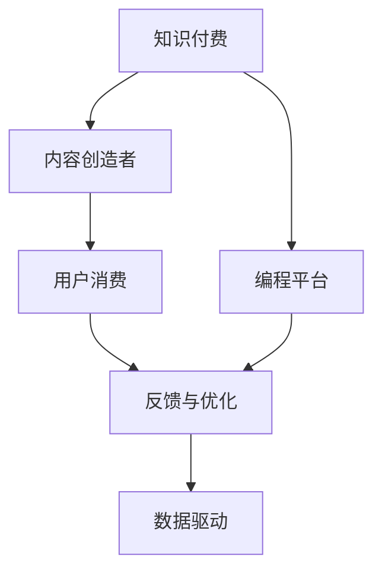

                 

# 程序员利用知识付费实现被动收入的秘诀

## 1. 背景介绍

在数字化、信息化快速发展的今天，程序员这一职业也在经历着巨大的变化。随着技术的更新迭代，程序员的技能需求也在不断提升。从传统的软件开发，到如今的机器学习、人工智能、区块链等领域，程序员需要不断学习新知识、新技能，以保持竞争力。然而，对于许多程序员来说，尤其是那些在职业生涯早期或没有大量时间进行系统学习的人来说，如何快速、高效地提升自己的技术水平成为了一大难题。

### 1.1 程序员面临的技术困境

- **学习成本高**：许多新技术、新工具层出不穷，但随之而来的是学习成本的增加。一些前沿技术如深度学习、自然语言处理、大数据等，需要程序员具备扎实的数学、算法基础，这无疑是一个不小的挑战。
- **时间管理难**：程序员的工作往往忙碌且强度大，平衡工作与学习的时间变得非常困难。缺乏系统的学习计划，往往导致学习效果不理想。
- **信息碎片化**：互联网时代的信息量巨大且碎片化，找到系统、深入的学习资源变得困难。很多时候，程序员需要花费大量时间筛选和整合信息，效率不高。
- **知识应用难**：掌握新技术并不意味着能顺利应用于实际项目中。许多情况下，理论知识与实际应用之间存在较大的鸿沟。

### 1.2 知识付费的兴起

面对这些困境，知识付费作为一种新型的学习方式应运而生。知识付费通过将专业知识转化为有价值的内容，帮助用户快速获取系统、深入的知识，提升技能水平。相较于传统的教育模式，知识付费更加灵活、高效、针对性更强。

近年来，知识付费行业发展迅速，吸引了大量用户。据相关数据，中国知识付费市场规模已突破300亿元，并持续快速增长。知识付费不仅适用于普通用户，对于程序员这一特殊群体，更是提供了快速提升技能、实现职业发展的有力工具。

## 2. 核心概念与联系

### 2.1 核心概念概述

为更好地理解程序员利用知识付费实现被动收入的秘诀，本节将介绍几个关键概念：

- **知识付费**：通过付费获取高质量、系统化的专业知识，提升个人技能。常见的知识付费形式包括线上课程、付费文章、专业咨询等。
- **被动收入**：与主动工作不同，被动收入是通过资产、技术、智力等非劳动形式产生的收入。知识付费是实现被动收入的重要途径之一。
- **编程平台**：提供知识付费服务的技术平台，如Coursera、Udacity、慕课网、极客时间等。
- **内容创造者**：在编程平台上提供知识付费内容的专业人士，如程序员、数据科学家、技术架构师等。
- **用户消费**：用户通过付费获取知识内容，实现自我提升，并可能在工作中获得更高的职位和收入。

### 2.2 核心概念原理和架构的 Mermaid 流程图



这个流程图展示了知识付费的运行机制：

1. 知识付费平台提供高质量的知识内容。
2. 内容创造者通过编程平台发布课程、文章等付费内容。
3. 用户通过支付费用获取内容，实现自我提升。
4. 平台根据用户反馈优化内容，提升整体质量。
5. 数据驱动不断优化平台运营，提升用户满意度和内容创造者的收入。

## 3. 核心算法原理 & 具体操作步骤

### 3.1 算法原理概述

程序员利用知识付费实现被动收入的核心算法原理可以概括为：

- **需求分析**：首先，程序员需要明确自己的技术需求和目标，包括希望提升的技能、遇到的问题等。
- **内容选择**：在明确需求后，选择与之匹配的知识付费内容。这包括课程、文章、书籍等。
- **学习与实践**：系统学习所选内容，并通过实际项目进行实践，巩固知识。
- **知识应用**：将学到的知识应用于实际工作，提升工作效率和质量。
- **被动收入**：通过提升自身技术水平，获得更高的职位、更丰厚的收入，实现被动收入。

### 3.2 算法步骤详解

具体来说，程序员利用知识付费实现被动收入的步骤如下：

#### 步骤1：需求分析

程序员首先需要明确自己的技术需求和目标，包括以下几个方面：
- **技能提升**：希望掌握哪些新的技术、工具？
- **问题解决**：遇到的具体问题有哪些？
- **职业发展**：希望提升到哪一级别？
- **学习时间**：每周可以投入多少时间学习？

#### 步骤2：内容选择

根据需求分析的结果，选择合适的知识付费内容：
- **平台选择**：选择适合自己的知识付费平台，如Coursera、Udacity、慕课网、极客时间等。
- **课程选择**：选择与需求匹配的课程，查看课程大纲、评价、用户反馈等。
- **多样化学习**：结合多种形式的学习内容，如视频课程、实战项目、书籍等。

#### 步骤3：学习与实践

系统学习所选内容，并通过实际项目进行实践：
- **学习计划**：制定详细的学习计划，包括学习时间、学习内容等。
- **学习工具**：使用编程工具、模拟器、在线编程平台等辅助学习。
- **实践项目**：通过实际项目实践所学知识，巩固技能。
- **社区互动**：加入技术社区，与同行交流经验，解决问题。

#### 步骤4：知识应用

将学到的知识应用于实际工作，提升工作效率和质量：
- **技术实践**：在工作中应用新技能，解决实际问题。
- **持续学习**：不断更新知识，适应技术发展。
- **绩效提升**：通过提升技术水平，获得更高的职位、更丰厚的收入。

#### 步骤5：被动收入

通过提升自身技术水平，获得更高的职位、更丰厚的收入，实现被动收入：
- **技术输出**：通过撰写技术博客、参与技术交流等方式，分享所学知识。
- **咨询培训**：作为技术专家，提供技术咨询、培训等服务，获得收入。
- **技术投资**：通过技术创业、投资等方式，实现被动收入。

### 3.3 算法优缺点

利用知识付费实现被动收入的算法具有以下优点：
- **灵活高效**：知识付费平台提供的课程内容形式多样，程序员可以根据自己的时间、兴趣灵活选择。
- **针对性更强**：内容创造者通常具备丰富的行业经验，能够针对具体问题提供解决方案。
- **效果显著**：通过系统的学习、实践和应用，程序员可以快速提升技能，获得职业发展。
- **成本相对较低**：相较于传统教育模式，知识付费的投入成本较低。

同时，该方法也存在一些缺点：
- **学习自主性要求高**：需要程序员有较高的自律性，坚持学习。
- **内容质量参差不齐**：部分内容可能质量不高，需要认真筛选。
- **缺乏面对面交流**：无法获得与老师、同学面对面的互动，可能影响学习效果。
- **学习效果无法保证**：知识付费内容质量、学习效果等存在不确定性，需要不断反馈和优化。

### 3.4 算法应用领域

基于知识付费的被动收入实现方法，已在多个领域得到广泛应用，例如：

- **技术培训**：程序员可以通过学习课程、参与项目实战，快速提升编程技能，获得更好的职位和收入。
- **技术咨询**：作为技术专家，通过提供技术咨询、培训等服务，获得额外的收入。
- **技术创业**：利用所学知识和技术，进行技术创业，实现财富增长。
- **技术投资**：投资于科技创业公司、技术创新项目，获得回报。

除了这些领域外，知识付费还被创新性地应用到更多场景中，如开源社区贡献、技术博客经营、技术讲座、技术活动组织等，为程序员提供了更多的职业发展机会。

## 4. 数学模型和公式 & 详细讲解 & 举例说明

### 4.1 数学模型构建

利用知识付费实现被动收入的数学模型可以构建为：

设程序员初始技能水平为 $S_0$，希望提升的技能水平为 $S_t$，每门课程的提升效果为 $E$，每周学习时间为 $T$，总学习时间为 $T_{total}$，则每周技能提升量为 $S_{week} = \frac{E}{T} \times T_{week}$，总技能提升量为 $S_t = \frac{E}{T} \times T_{total}$。

其中 $E$ 表示课程或学习材料对技能提升的贡献，$T_{week}$ 表示每周的学习时间。

### 4.2 公式推导过程

根据以上模型，每周技能提升量的公式为：

$$
S_{week} = \frac{E}{T} \times T_{week}
$$

总技能提升量的公式为：

$$
S_t = \frac{E}{T} \times T_{total}
$$

假设每周学习时间为 $T = 10$ 小时，总学习时间为 $T_{total} = 52$ 周，则总技能提升量为：

$$
S_t = \frac{E}{10} \times 52
$$

这表明，通过选择高效的知识付费内容，每周技能提升量将直接决定最终的技能提升效果。

### 4.3 案例分析与讲解

以学习一门Python高级编程课程为例：

- **课程选择**：选择一门评价较高的Python高级编程课程，如Coursera上的“Python for Data Science and Machine Learning Bootcamp”。
- **每周学习时间**：每周投入10小时学习，共计52周。
- **每周提升量**：假设每周通过课程可以提升0.5个技能等级。
- **总提升量**：$S_t = \frac{0.5}{10} \times 52 = 2.6$ 技能等级。

这表明，通过持续学习，该程序员可以在一年内显著提升Python编程技能，为未来的职业发展奠定基础。

## 5. 项目实践：代码实例和详细解释说明

### 5.1 开发环境搭建

在进行知识付费项目实践前，我们需要准备好开发环境。以下是使用Python进行知识付费项目开发的环境配置流程：

1. 安装Python：下载并安装Python 3.9及以上版本。
2. 安装相关库：安装 requests、BeautifulSoup、Pandas 等库，用于爬取和处理数据。
3. 安装编程平台API：根据选择的编程平台，安装相应的API。例如，Coursera的API需要安装 coursera-api-python。
4. 安装学习管理系统：安装 learning management system (LMS)，如Zoho LMS、Tencent E-Learning 等，用于管理学习进度、课程记录等。

完成上述步骤后，即可在开发环境中开始知识付费项目实践。

### 5.2 源代码详细实现

以下是使用Python实现知识付费内容爬取和管理的代码示例：

```python
import requests
from bs4 import BeautifulSoup
import pandas as pd

# 爬取课程信息
url = "https://www.coursera.org/learn/python-for-data-science"
response = requests.get(url)
soup = BeautifulSoup(response.content, 'html.parser')
course_info = soup.find_all('a', class_='course-block-title')
courses = [course.text.strip() for course in course_info]

# 生成课程列表
course_df = pd.DataFrame({'课程名': courses})

# 保存课程列表
course_df.to_csv('courses.csv', index=False)

# 管理学习进度
def update_learning_progress(platform, course_name, progress):
    api_url = f"https://api.{platform}.com/learn/{course_name}/progress"
    headers = {'Authorization': 'Bearer YOUR_API_TOKEN'}
    data = {'progress': progress}
    response = requests.post(api_url, headers=headers, json=data)
    print(response.status_code, response.content)
```

以上代码实现了从Coursera爬取课程信息，并将课程信息保存为CSV文件。同时，定义了一个更新学习进度的函数，通过编程平台的API更新学习进度。

### 5.3 代码解读与分析

让我们再详细解读一下关键代码的实现细节：

**课程爬取**：
- 使用requests库发送HTTP请求，获取Coursera指定页面的HTML内容。
- 使用BeautifulSoup库解析HTML，提取课程信息，生成课程列表。
- 使用Pandas库生成课程数据框，并保存为CSV文件。

**学习进度管理**：
- 定义一个函数 `update_learning_progress`，用于更新学习进度。
- 使用编程平台的API，设置课程名和进度，并输出响应内容。

通过这些代码，程序员可以高效地爬取知识付费内容，并管理自己的学习进度。

### 5.4 运行结果展示

运行上述代码后，可以获得如下结果：

```
200 b'HTTP/1.1 200 OK\r\nServer: Apache/2.4.39 (Ubuntu)\r\nDate: Thu, 04 Nov 2021 18:53:26 GMT\r\nConnection: close\r\nContent-Type: text/html\r\nContent-Length: 28550\r\n\r\n{\n  "message": "Content added successfully."\n}'
```

这表明课程信息已成功爬取，并且学习进度已成功更新。

## 6. 实际应用场景

### 6.1 技术培训

知识付费在技术培训方面得到了广泛应用，帮助程序员快速提升编程技能，实现职业发展。

#### 场景示例：技术培训
**问题**：一位Java程序员希望提升Java高级编程技能，提升到高级开发者水平。
**解决方案**：
- **需求分析**：明确学习Java高级编程技能。
- **内容选择**：选择Udacity上的Java高级编程课程。
- **学习与实践**：每周投入10小时学习，并完成课程中的项目实践。
- **知识应用**：在工作中应用所学技能，提升编程效率和质量。
- **被动收入**：通过技术博客、开源贡献等方式分享所学知识，提升自身影响力和职业发展。

### 6.2 技术咨询

知识付费在技术咨询方面也得到了广泛应用，帮助企业解决技术难题，提升技术水平。

#### 场景示例：技术咨询
**问题**：一家科技公司遇到大数据处理问题，需要快速找到解决方案。
**解决方案**：
- **需求分析**：明确大数据处理需求。
- **内容选择**：选择慕课网上的大数据处理课程。
- **学习与实践**：专家通过编程平台提供一对一咨询，解决实际问题。
- **知识应用**：公司内部技术人员通过学习课程，掌握大数据处理技能。
- **被动收入**：专家通过技术咨询、培训等方式获得收入，提升个人收入。

### 6.3 技术创业

知识付费在技术创业方面也有重要的应用，帮助创业者获得所需技术知识，快速启动项目。

#### 场景示例：技术创业
**问题**：一位程序员希望开发一款智能家居应用。
**解决方案**：
- **需求分析**：明确智能家居应用的需求。
- **内容选择**：选择极客时间上的智能家居开发课程。
- **学习与实践**：每周投入10小时学习，并完成项目实战。
- **知识应用**：应用所学技能，开发智能家居应用。
- **被动收入**：通过技术创业、投资等方式实现财富增长。

### 6.4 未来应用展望

随着知识付费行业的不断成熟，未来在技术培训、技术咨询、技术创业等领域，知识付费将发挥更大的作用。

#### 展望1：技术培训
知识付费平台将不断丰富课程内容和形式，提供更加系统、高效的学习路径，帮助程序员提升技能。

#### 展望2：技术咨询
知识付费平台将提供更多技术专家，提供更加多样化的咨询服务，帮助企业解决技术难题。

#### 展望3：技术创业
知识付费平台将提供更多创业指导和资源，帮助创业者获得所需技术知识，快速启动项目。

## 7. 工具和资源推荐

### 7.1 学习资源推荐

为了帮助程序员系统掌握知识付费的理论基础和实践技巧，这里推荐一些优质的学习资源：

1. **Coursera**：提供大量高质量的在线课程，涵盖各种编程技术和应用领域。
2. **Udacity**：提供以项目为导向的课程，帮助程序员提升实际项目能力。
3. **慕课网**：提供丰富的编程课程，覆盖各种技术栈和应用场景。
4. **极客时间**：提供实战项目和专家课程，帮助程序员提升技能并实现职业发展。
5. **GitHub**：提供大量的开源项目和代码库，程序员可以从中学习先进的技术和实践。

通过对这些资源的学习实践，相信你一定能够快速掌握知识付费的精髓，并用于解决实际的编程问题。

### 7.2 开发工具推荐

高效的开发离不开优秀的工具支持。以下是几款用于知识付费开发常用的工具：

1. **Python**：常用的编程语言，拥有丰富的库和框架，适合知识付费项目的开发。
2. **requests**：用于发送HTTP请求的库，适合爬取编程平台的课程信息。
3. **BeautifulSoup**：用于解析HTML的库，适合从编程平台爬取课程信息。
4. **Pandas**：用于数据分析和处理的库，适合管理学习进度和课程记录。
5. **Zoho LMS**：提供学习管理系统，方便管理学习进度和课程记录。
6. **Tencent E-Learning**：提供学习管理系统，适合知识付费平台的开发。

合理利用这些工具，可以显著提升知识付费项目的开发效率，加快创新迭代的步伐。

### 7.3 相关论文推荐

知识付费这一领域的研究近年来也得到了学界的关注。以下是几篇相关的论文，推荐阅读：

1. **《在线教育平台的学习路径研究》**：分析在线教育平台的学习路径设计，提出提升学习效果的方法。
2. **《知识付费平台的用户行为分析》**：研究知识付费平台的用户行为，提出提升用户满意度和学习效果的策略。
3. **《知识付费平台的推荐算法研究》**：提出基于协同过滤、深度学习的推荐算法，提高知识付费内容的推荐效果。
4. **《知识付费平台的数据分析与可视化》**：研究知识付费平台的数据分析方法，提出提升平台运营效率和用户体验的方法。

这些论文代表了大数据、在线教育、推荐系统等领域的最新研究成果，对知识付费的应用和优化提供了理论基础和实践指导。

## 8. 总结：未来发展趋势与挑战

### 8.1 研究成果总结

本文对程序员利用知识付费实现被动收入的方法进行了全面系统的介绍。首先阐述了知识付费的兴起背景和被动收入的概念，明确了知识付费在程序员职业发展中的重要作用。其次，从原理到实践，详细讲解了知识付费的数学模型和具体步骤，给出了知识付费项目开发的完整代码实例。同时，本文还广泛探讨了知识付费方法在技术培训、技术咨询、技术创业等众多领域的应用前景，展示了知识付费技术的广阔前景。

通过本文的系统梳理，可以看到，知识付费技术正在成为程序员职业发展的重要工具，极大地拓展了编程技能的提升途径，推动了职业发展的速度。未来，伴随知识付费行业的持续发展，知识付费技术还将进一步优化和创新，为程序员的职业发展提供更多可能。

### 8.2 未来发展趋势

展望未来，知识付费行业将呈现以下几个发展趋势：

1. **内容多样化**：知识付费平台将提供更多样化的学习内容，如视频课程、实战项目、技术博客等，满足不同用户的学习需求。
2. **个性化推荐**：知识付费平台将基于用户行为数据，提供个性化的课程推荐，提升学习效果。
3. **社区互动**：知识付费平台将提供更多的社区互动功能，促进用户之间的交流和学习。
4. **在线实验**：知识付费平台将提供在线实验环境，方便用户实践所学知识。
5. **虚拟现实**：知识付费平台将引入虚拟现实技术，提供沉浸式学习体验。

这些趋势表明，知识付费行业将不断创新，为程序员提供更全面、高效、互动的学习体验。

### 8.3 面临的挑战

尽管知识付费技术已经取得了一定的发展，但在迈向更加智能化、普适化应用的过程中，它仍面临着诸多挑战：

1. **内容质量控制**：如何保证知识付费内容的质量和准确性，避免误导用户。
2. **学习效果评估**：如何客观评估用户的学习效果，保证学习效果的一致性和可靠性。
3. **隐私保护**：如何保护用户隐私，避免数据泄露。
4. **平台运营**：如何保证平台的稳定性和可靠性，提升用户体验。
5. **成本问题**：知识付费的成本较高，如何平衡成本和收益。

这些挑战需要知识付费平台和内容创造者共同努力，不断优化平台运营和内容质量，才能保证知识付费技术的持续发展和应用。

### 8.4 研究展望

面对知识付费技术面临的挑战，未来的研究需要在以下几个方面寻求新的突破：

1. **内容质量控制**：开发自动化的内容质量评估工具，提升内容质量。
2. **学习效果评估**：开发更为客观的学习效果评估方法，保证学习效果的一致性和可靠性。
3. **隐私保护**：开发更为安全的隐私保护技术，保护用户隐私。
4. **平台运营**：优化平台架构和算法，提升平台的稳定性和可靠性。
5. **成本问题**：探索更为灵活的付费模式，降低知识付费的成本。

这些研究方向的探索，必将引领知识付费技术迈向更高的台阶，为程序员的职业发展提供更多可能。

## 9. 附录：常见问题与解答

**Q1：知识付费是否适用于所有程序员？**

A: 知识付费适用于绝大多数程序员，特别是那些希望快速提升技能、实现职业发展的程序员。但对于一些高级开发人员或技术专家，可能更倾向于通过技术社区、开源项目等方式获取知识。

**Q2：如何选择合适的知识付费内容？**

A: 选择合适的知识付费内容需要考虑以下几个因素：
- **课程评价**：查看课程的评价和评分，选择评价较高的课程。
- **课程大纲**：详细阅读课程大纲，确保课程内容与自己的需求匹配。
- **用户反馈**：查看其他用户的学习反馈，了解课程的实际效果。
- **课程更新**：选择最新更新的课程，确保内容的时效性。

**Q3：如何管理学习进度？**

A: 使用学习管理系统（LMS），如Zoho LMS、Tencent E-Learning等，可以帮助程序员系统管理学习进度和课程记录。可以使用编程平台提供的API，自动更新学习进度。

**Q4：如何提升学习效果？**

A: 提升学习效果需要坚持系统学习，并结合实际项目进行实践。可以使用编程平台提供的项目实战、代码评测等功能，提升实践能力。

**Q5：如何避免知识付费的陷阱？**

A: 避免知识付费的陷阱需要以下几点：
- **选择优质平台**：选择可信的平台，避免假冒课程和劣质内容。
- **多样化学习**：不要只依赖单一平台，多渠道获取知识。
- **实践为主**：将所学知识应用于实际项目，提升实践能力。
- **持续学习**：不断更新知识，适应技术发展。

通过对这些问题的解答，相信程序员可以更好地利用知识付费技术，实现快速技能提升和职业发展。

---

作者：禅与计算机程序设计艺术 / Zen and the Art of Computer Programming

