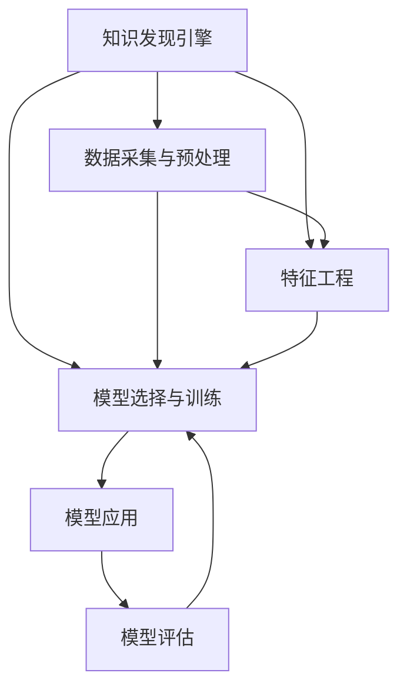

                 

# 程序员利用知识发现引擎提高解决问题的能力

> 关键词：知识发现引擎(Knowledge Discovery Engine, KDE), 数据挖掘, 数据预处理, 特征工程, 机器学习, 模型评估, 软件工具

## 1. 背景介绍

### 1.1 问题由来

在现代软件开发中，程序员面临各种复杂的任务和挑战，例如项目管理和代码重构、代码审查和测试、性能优化和调试等。这些问题不仅需要深厚的编程技能和经验，还需要广泛的知识储备。传统上，程序员依赖文档、社区问答和经验积累等方式来解决问题，但这些方法的效率和效果往往有限。

近年来，随着数据挖掘和人工智能技术的发展，知识发现引擎(KDE)应运而生，通过数据驱动的方法，帮助程序员更高效地解决问题。知识发现引擎利用数据挖掘和机器学习等技术，从代码、文档、社区和在线资源中挖掘知识，为程序员提供有效的解决方案和建议。

### 1.2 问题核心关键点

知识发现引擎的核心在于利用数据驱动的方法，从大量数据中提取有用的知识，帮助程序员更快速、更准确地解决问题。其关键点包括：

1. **数据采集和预处理**：从代码库、文档、社区和在线资源中采集数据，并进行清洗、去重和规范化等预处理。
2. **特征工程**：通过自动提取和生成特征，将原始数据转换为模型可以理解的输入。
3. **模型选择和训练**：选择合适的机器学习模型（如分类、回归、聚类等），并利用训练数据对其进行训练和优化。
4. **模型应用和评估**：将训练好的模型应用到新的问题上，并使用评估指标（如准确率、召回率、F1分数等）进行效果评估。

### 1.3 问题研究意义

知识发现引擎能够显著提高程序员的工作效率，降低技术债务，提升软件质量和维护性。具体来说，它可以从以下几个方面带来改进：

1. **问题解决效率**：通过自动化的知识挖掘和推荐，帮助程序员更快找到问题的解决方案。
2. **知识获取能力**：提供广泛的知识库和资源，扩展程序员的知识边界。
3. **代码质量提升**：利用模型对代码进行分析和优化，提升代码可读性和可维护性。
4. **性能优化和调试**：通过分析代码和日志数据，发现性能瓶颈和调试问题，提供优化建议。
5. **团队协作和知识共享**：利用知识发现引擎的集体智慧，促进团队之间的知识共享和协作。

## 2. 核心概念与联系

### 2.1 核心概念概述

为了更好地理解知识发现引擎，本节将介绍几个密切相关的核心概念：

- **知识发现引擎(KDE)**：利用数据挖掘和机器学习技术，从代码、文档、社区和在线资源中挖掘知识，为程序员提供有效解决方案和建议的工具。
- **数据挖掘(Data Mining)**：从大量数据中提取有用信息和知识的过程，包括数据清洗、特征提取、模型训练和结果解释等步骤。
- **特征工程(Feature Engineering)**：通过手工设计或自动生成特征，将原始数据转换为模型可以理解的输入，提升模型性能。
- **机器学习(Machine Learning)**：通过训练数据，使计算机从经验中学习，自动改进模型性能的过程，包括监督学习、无监督学习和强化学习等方法。
- **模型评估(Model Evaluation)**：使用各种评估指标（如准确率、召回率、F1分数等）对模型进行测试和评估，衡量模型的性能。
- **软件工具(Tools)**：支持知识发现引擎开发和应用的软件平台，如Python、R、Jupyter Notebook等。

这些核心概念之间的逻辑关系可以通过以下Mermaid流程图来展示：



这个流程图展示的知识发现引擎的核心概念及其之间的关系：

1. 知识发现引擎通过数据采集与预处理，从各种数据源获取原始数据。
2. 特征工程将原始数据转换为模型可以理解的特征。
3. 选择合适的机器学习模型，并进行训练和优化。
4. 将训练好的模型应用到新的问题上，并使用模型评估方法进行效果评估。
5. 根据评估结果，调整模型和特征工程策略，提升模型性能。

## 3. 核心算法原理 & 具体操作步骤
### 3.1 算法原理概述

知识发现引擎的核心算法原理基于数据挖掘和机器学习技术，其核心思想是通过对大量数据进行分析，发现数据中蕴含的规律和知识，并将这些知识应用于解决实际问题。

形式化地，假设知识发现引擎从数据集 $D=\{(x_i,y_i)\}_{i=1}^N$ 中挖掘知识，其中 $x_i$ 为特征向量，$y_i$ 为目标标签。知识发现引擎的目标是构建模型 $M$，使得 $M(x)$ 能准确预测目标标签 $y$。其基本流程如下：

1. **数据采集与预处理**：从代码库、文档、社区和在线资源中收集相关数据，并进行清洗、去重和规范化等预处理。
2. **特征工程**：通过手工设计或自动生成特征，将原始数据转换为模型可以理解的特征向量。
3. **模型选择与训练**：选择合适的机器学习模型（如决策树、支持向量机、随机森林等），并利用训练数据对其进行训练和优化。
4. **模型应用与评估**：将训练好的模型应用到新的问题上，并使用评估指标（如准确率、召回率、F1分数等）进行效果评估。
5. **模型优化与迭代**：根据评估结果，调整模型和特征工程策略，提升模型性能。

### 3.2 算法步骤详解

知识发现引擎的实现一般包括以下几个关键步骤：

**Step 1: 数据采集与预处理**
- 确定需要挖掘的数据源，如代码库、文档、社区和在线资源。
- 使用爬虫技术或API接口采集相关数据。
- 进行数据清洗，去除噪声和冗余数据，并进行去重和规范化。

**Step 2: 特征工程**
- 根据任务需求，手动设计或自动生成特征，将原始数据转换为模型可以理解的特征向量。
- 选择合适的特征提取方法，如词袋模型、TF-IDF、词嵌入等。
- 对特征进行归一化和标准化处理，提升模型的鲁棒性。

**Step 3: 模型选择与训练**
- 选择合适的机器学习模型，如分类、回归、聚类等。
- 使用训练数据对模型进行训练，并进行交叉验证和超参数调优。
- 使用网格搜索或随机搜索等方法，选择最优模型和超参数组合。

**Step 4: 模型应用与评估**
- 将训练好的模型应用到新的问题上，进行预测和分类。
- 使用评估指标（如准确率、召回率、F1分数等）对模型进行测试和评估。
- 根据评估结果，进行模型调整和优化。

**Step 5: 模型优化与迭代**
- 根据评估结果，调整特征工程和模型选择策略，提升模型性能。
- 利用新的数据和反馈，进行模型迭代和更新。

### 3.3 算法优缺点

知识发现引擎具有以下优点：
1. 自动化：通过自动化数据采集和预处理，大大降低了人工干预的需求，提升了效率。
2. 全面性：利用广泛的数据源，获取全面的知识，提高了问题解决的全面性和准确性。
3. 可扩展性：可以灵活扩展数据源和特征，适应各种复杂场景。
4. 灵活性：支持多种机器学习算法，能够根据具体问题选择最优算法。

同时，知识发现引擎也存在一些缺点：
1. 数据质量依赖：知识发现的效果高度依赖数据的质量和全面性，低质量数据可能导致错误的推荐。
2. 模型复杂性：选择合适的特征和模型需要经验和知识，复杂度较高。
3. 解释性不足：黑盒模型难以解释其内部工作机制，可能缺乏可解释性。
4. 性能瓶颈：大数据处理和模型训练需要高性能计算资源，可能存在性能瓶颈。

尽管存在这些局限性，知识发现引擎在提高程序员问题解决能力方面仍具有重要价值。未来相关研究的重点在于如何进一步降低数据处理和模型训练的复杂度，提升模型的可解释性和鲁棒性，同时优化资源利用效率。

### 3.4 算法应用领域

知识发现引擎在软件开发和维护中具有广泛的应用，具体包括：

1. **代码审查和重构**：利用知识发现引擎挖掘代码中的潜在问题，如代码风格、可读性、可维护性等，提供代码重构建议。
2. **代码生成和自动完成**：根据已有代码和文档，自动生成新代码或补全代码片段，提升开发效率。
3. **性能优化和调试**：分析代码和日志数据，发现性能瓶颈和调试问题，提供优化建议。
4. **问题解决和知识库构建**：利用知识发现引擎挖掘问题解决方案和最佳实践，构建知识库，供开发者查询和学习。
5. **版本控制和协作**：通过分析代码变更历史和开发日志，发现代码变更的原因和影响，促进版本控制和团队协作。
6. **文档生成和维护**：自动生成和维护代码文档，提升代码的可读性和可维护性。

除了上述这些常见应用外，知识发现引擎还被创新性地应用于自动化测试、自动化部署、安全分析等领域，为软件开发提供了更多可能性。

## 4. 数学模型和公式 & 详细讲解  
### 4.1 数学模型构建

本节将使用数学语言对知识发现引擎的数据挖掘和机器学习过程进行更加严格的刻画。

假设知识发现引擎从数据集 $D=\{(x_i,y_i)\}_{i=1}^N$ 中挖掘知识，其中 $x_i$ 为特征向量，$y_i$ 为目标标签。

定义知识发现引擎的模型为 $M(x;\theta)$，其中 $\theta$ 为模型参数。知识发现引擎的目标是构建最优模型 $M^*$，使得 $M^*(x)$ 在目标标签 $y$ 上表现最佳。常用的评价指标包括：

- 准确率（Accuracy）：预测正确的样本占总样本的比例，即 $Accuracy=\frac{\sum_{i=1}^N\mathbb{I}(M^*(x_i)=y_i)}{N}$。
- 召回率（Recall）：正确预测的正样本占真实正样本的比例，即 $Recall=\frac{\sum_{i=1}^N\mathbb{I}(M^*(x_i)=1)}{\sum_{i=1}^N\mathbb{I}(y_i=1)}$。
- F1分数（F1 Score）：综合考虑准确率和召回率，即 $F1 Score=\frac{2*Accuracy*Recall}{Accuracy+Recall}$。

知识发现引擎的建模过程包括以下几个关键步骤：

1. **特征提取**：将原始数据转换为模型可以理解的特征向量，即 $x \rightarrow X$。
2. **模型训练**：使用训练数据 $D$ 对模型进行训练，得到最优参数 $\theta$，即 $\min_{\theta}\mathcal{L}(D;M)$。
3. **模型应用**：将训练好的模型应用到新的问题上，进行预测和分类。

其中，损失函数 $\mathcal{L}$ 通常选择交叉熵损失（Cross-Entropy Loss）：

$$
\mathcal{L}(D;M)=\frac{1}{N}\sum_{i=1}^N\log\frac{e^{M(x_i)}}{\sum_{j=1}^K e^{M(x_j)}} - y_iM(x_i)
$$

其中 $K$ 为分类数目，$y_i$ 为真实标签，$M(x_i)$ 为模型预测。

### 4.2 公式推导过程

以二分类任务为例，推导交叉熵损失函数及其梯度的计算公式。

假设模型 $M(x;\theta)$ 在输入 $x$ 上的输出为 $\hat{y}=M(x;\theta) \in [0,1]$，表示样本属于正类的概率。真实标签 $y \in \{0,1\}$。则二分类交叉熵损失函数定义为：

$$
\ell(M(x),y) = -[y\log \hat{y} + (1-y)\log (1-\hat{y})]
$$

将其代入经验风险公式，得：

$$
\mathcal{L}(\theta) = -\frac{1}{N}\sum_{i=1}^N [y_i\log M(x_i)+(1-y_i)\log(1-M(x_i))]
$$

根据链式法则，损失函数对参数 $\theta_k$ 的梯度为：

$$
\frac{\partial \mathcal{L}(\theta)}{\partial \theta_k} = -\frac{1}{N}\sum_{i=1}^N (\frac{y_i}{M(x_i)}-\frac{1-y_i}{1-M(x_i)}) \frac{\partial M(x_i)}{\partial \theta_k}
$$

其中 $\frac{\partial M(x_i)}{\partial \theta_k}$ 可进一步递归展开，利用自动微分技术完成计算。

在得到损失函数的梯度后，即可带入参数更新公式，完成模型的迭代优化。重复上述过程直至收敛，最终得到最优模型参数 $\theta^*$。

## 5. 项目实践：代码实例和详细解释说明
### 5.1 开发环境搭建

在进行知识发现引擎的实践前，我们需要准备好开发环境。以下是使用Python进行PyTorch开发的环境配置流程：

1. 安装Anaconda：从官网下载并安装Anaconda，用于创建独立的Python环境。

2. 创建并激活虚拟环境：
```bash
conda create -n pytorch-env python=3.8 
conda activate pytorch-env
```

3. 安装PyTorch：根据CUDA版本，从官网获取对应的安装命令。例如：
```bash
conda install pytorch torchvision torchaudio cudatoolkit=11.1 -c pytorch -c conda-forge
```

4. 安装Scikit-learn：
```bash
pip install scikit-learn
```

5. 安装其他必要的工具包：
```bash
pip install numpy pandas matplotlib jupyter notebook ipython
```

完成上述步骤后，即可在`pytorch-env`环境中开始知识发现引擎的实践。

### 5.2 源代码详细实现

下面以二分类问题为例，给出使用Scikit-learn进行知识发现引擎的PyTorch代码实现。

首先，定义数据集：

```python
from sklearn.datasets import load_breast_cancer
from sklearn.model_selection import train_test_split
from sklearn.preprocessing import StandardScaler
import torch
import torch.nn as nn
import torch.optim as optim
import numpy as np

# 加载数据集
data = load_breast_cancer()
X = data.data
y = data.target

# 划分训练集和测试集
X_train, X_test, y_train, y_test = train_test_split(X, y, test_size=0.2, random_state=42)

# 标准化数据
scaler = StandardScaler()
X_train = scaler.fit_transform(X_train)
X_test = scaler.transform(X_test)

# 转换为PyTorch张量
X_train = torch.tensor(X_train, dtype=torch.float32)
y_train = torch.tensor(y_train, dtype=torch.long)
X_test = torch.tensor(X_test, dtype=torch.float32)
y_test = torch.tensor(y_test, dtype=torch.long)
```

然后，定义模型和优化器：

```python
# 定义模型结构
class Net(nn.Module):
    def __init__(self):
        super(Net, self).__init__()
        self.fc1 = nn.Linear(30, 64)
        self.fc2 = nn.Linear(64, 64)
        self.fc3 = nn.Linear(64, 2)
        self.dropout = nn.Dropout(0.5)

    def forward(self, x):
        x = self.fc1(x)
        x = nn.functional.relu(x)
        x = self.dropout(x)
        x = self.fc2(x)
        x = nn.functional.relu(x)
        x = self.dropout(x)
        x = self.fc3(x)
        return x

# 定义优化器
model = Net()
criterion = nn.CrossEntropyLoss()
optimizer = optim.Adam(model.parameters(), lr=0.001)
```

接着，定义训练和评估函数：

```python
# 训练函数
def train(model, data_loader, optimizer, criterion):
    model.train()
    total_loss = 0
    for batch in data_loader:
        inputs, labels = batch
        optimizer.zero_grad()
        outputs = model(inputs)
        loss = criterion(outputs, labels)
        loss.backward()
        optimizer.step()
        total_loss += loss.item()
    return total_loss / len(data_loader)

# 评估函数
def evaluate(model, data_loader, criterion):
    model.eval()
    total_loss = 0
    total_correct = 0
    with torch.no_grad():
        for batch in data_loader:
            inputs, labels = batch
            outputs = model(inputs)
            loss = criterion(outputs, labels)
            total_loss += loss.item()
            total_correct += torch.sum(torch.argmax(outputs, 1) == labels).item()
    return total_correct / len(data_loader), total_loss / len(data_loader)
```

最后，启动训练流程并在测试集上评估：

```python
# 划分数据集
train_loader = torch.utils.data.DataLoader(X_train, y_train, batch_size=32, shuffle=True)
test_loader = torch.utils.data.DataLoader(X_test, y_test, batch_size=32)

# 训练
epochs = 100
for epoch in range(epochs):
    loss = train(model, train_loader, optimizer, criterion)
    print(f"Epoch {epoch+1}, train loss: {loss:.3f}")
    
    # 评估
    accuracy, loss = evaluate(model, test_loader, criterion)
    print(f"Epoch {epoch+1}, test accuracy: {accuracy:.3f}, test loss: {loss:.3f}")
```

以上就是使用PyTorch进行二分类任务的知识发现引擎的完整代码实现。可以看到，利用Scikit-learn和PyTorch，我们能够快速构建和训练知识发现引擎，并评估其性能。

### 5.3 代码解读与分析

让我们再详细解读一下关键代码的实现细节：

**数据集定义**：
- 使用Scikit-learn的`load_breast_cancer`函数加载乳腺癌数据集。
- 使用`train_test_split`函数将数据集划分为训练集和测试集。
- 使用`StandardScaler`对数据进行标准化处理。
- 将数据转换为PyTorch张量，方便模型训练。

**模型定义**：
- 定义一个简单的全连接神经网络结构，包含两个隐藏层和一个输出层。
- 使用`nn.functional.relu`和`nn.Dropout`进行非线性激活和正则化。

**优化器和损失函数**：
- 使用`Adam`优化器进行参数更新。
- 使用`nn.CrossEntropyLoss`作为损失函数，适用于多分类问题。

**训练和评估函数**：
- `train`函数定义了模型的前向传播和反向传播过程，计算损失并更新参数。
- `evaluate`函数用于在测试集上评估模型性能，计算准确率和损失。

**训练流程**：
- 在每个epoch中，首先使用训练集进行训练，输出损失。
- 在测试集上评估模型性能，输出准确率和损失。
- 重复上述过程，直到训练结束。

可以看到，PyTorch配合Scikit-learn使得知识发现引擎的代码实现变得简洁高效。开发者可以将更多精力放在模型设计和调优等高层逻辑上，而不必过多关注底层的实现细节。

当然，工业级的系统实现还需考虑更多因素，如模型的保存和部署、超参数的自动搜索、更灵活的任务适配层等。但核心的知识发现引擎范式基本与此类似。

## 6. 实际应用场景
### 6.1 智能问答系统

知识发现引擎可以广泛应用于智能问答系统的构建。传统的问答系统往往依赖于规则和专家知识库，难以应对复杂多变的用户问题。而基于知识发现引擎的问答系统，能够自动从历史问题和答案中挖掘知识，动态生成答案，提升系统的智能化水平。

在技术实现上，可以收集用户的历史问答记录，将问题和最佳答复构建成监督数据，在此基础上对知识发现引擎进行训练。训练后的引擎能够自动理解用户意图，匹配最合适的答案模板进行回复。对于用户提出的新问题，还可以接入检索系统实时搜索相关内容，动态组织生成回答。如此构建的智能问答系统，能大幅提升用户咨询体验和问题解决效率。

### 6.2 代码审查与重构

知识发现引擎可以帮助开发者快速识别代码中的潜在问题，如代码风格、可读性、可维护性等，提供代码重构建议。具体而言，可以自动分析代码结构、依赖关系和使用规范，生成代码质量报告，并给出改进建议。利用知识发现引擎的集体智慧，开发者能够更高效地进行代码审查和重构，提升代码质量。

### 6.3 性能优化和调试

知识发现引擎可以分析代码和日志数据，发现性能瓶颈和调试问题，提供优化建议。具体而言，可以分析代码调用链、函数执行时间、内存占用等指标，发现性能瓶颈，并给出优化建议。利用知识发现引擎的智能分析和建议，开发者能够更快速地进行性能优化和调试，提升应用性能。

### 6.4 未来应用展望

随着知识发现引擎技术的发展，其在软件开发和维护中的应用将越来越广泛。未来，知识发现引擎可能将应用于更多领域，如医疗、金融、物流等，为各行各业带来变革性影响。

在医疗领域，知识发现引擎可以自动挖掘医疗文献和临床数据，提取疾病知识和治疗方案，辅助医生诊断和治疗。

在金融领域，知识发现引擎可以分析金融市场数据，提取投资策略和风险预测模型，为投资者提供决策支持。

在物流领域，知识发现引擎可以分析物流数据，提取优化策略和配送路径，提升物流效率和用户体验。

此外，在教育、制造、环境保护等众多领域，知识发现引擎也将不断涌现，为各行各业带来新的解决方案。相信随着技术的发展，知识发现引擎必将在更多领域发挥其巨大价值。

## 7. 工具和资源推荐
### 7.1 学习资源推荐

为了帮助开发者系统掌握知识发现引擎的理论基础和实践技巧，这里推荐一些优质的学习资源：

1. 《Python机器学习》书籍：由机器学习专家撰写，详细介绍了数据挖掘、特征工程和机器学习等知识发现引擎的核心技术。

2. 《数据挖掘：概念与技术》课程：由斯坦福大学开设的著名课程，系统讲解了数据挖掘的理论和实践，涵盖数据预处理、特征选择、模型训练等环节。

3. 《Feature Engineering for Data Science》书籍：讲解了特征工程在数据挖掘中的重要性，提供了丰富的特征工程方法和案例。

4. 《TensorFlow数据科学实战》书籍：介绍了TensorFlow在数据科学中的应用，包括数据预处理、特征工程和模型训练等技术。

5. 《Scikit-learn实战》书籍：详细讲解了Scikit-learn库的使用方法和实例，涵盖了数据预处理、模型训练和评估等环节。

6. Kaggle平台：提供丰富的数据集和竞赛，可以帮助开发者实践和提升知识发现引擎的开发技能。

通过对这些资源的学习实践，相信你一定能够快速掌握知识发现引擎的精髓，并用于解决实际的NLP问题。
###  7.2 开发工具推荐

高效的开发离不开优秀的工具支持。以下是几款用于知识发现引擎开发和应用的常用工具：

1. Python：数据挖掘和机器学习的主流编程语言，支持多种数据处理和科学计算库，如Pandas、NumPy、Scikit-learn等。

2. Jupyter Notebook：交互式编程环境，支持数据可视化、代码注释和版本控制，方便调试和协作。

3. PyTorch：开源深度学习框架，支持动态计算图和GPU加速，适合快速迭代研究和开发。

4. Scikit-learn：机器学习库，提供多种常用机器学习算法和工具，支持数据预处理和特征工程。

5. TensorFlow：开源深度学习框架，支持分布式计算和GPU加速，适合大规模工程应用。

6. Weights & Biases：模型训练的实验跟踪工具，可以记录和可视化模型训练过程中的各项指标，方便对比和调优。

7. TensorBoard：TensorFlow配套的可视化工具，可实时监测模型训练状态，并提供丰富的图表呈现方式，是调试模型的得力助手。

合理利用这些工具，可以显著提升知识发现引擎的开发效率，加快创新迭代的步伐。

### 7.3 相关论文推荐

知识发现引擎的发展源于学界的持续研究。以下是几篇奠基性的相关论文，推荐阅读：

1. "Knowledge Discovery in Databases"（数据库中的知识发现）：由Wang、Wang等在1999年提出，奠定了知识发现领域的理论基础。

2. "Data Mining: Concepts and Techniques"（数据挖掘：概念与技术）：由Iyengar等在2010年编写，全面介绍了数据挖掘的理论和实践，包括数据预处理、特征选择、模型训练等环节。

3. "Feature Engineering: A Data Mining Perspective"（特征工程：数据挖掘视角）：由Gofine、Berk等在2014年编写，详细讲解了特征工程在数据挖掘中的重要性，提供了丰富的特征工程方法和案例。

4. "Mining of Massive Datasets"（大规模数据挖掘）：由Kargupta、Najork在2001年编写，介绍了大规模数据挖掘的技术和方法。

5. "The Elements of Statistical Learning"（统计学习要素）：由Hastie、Tibshirani等在2009年编写，全面介绍了统计学习和机器学习的理论和方法。

这些论文代表了大数据挖掘技术的发展脉络。通过学习这些前沿成果，可以帮助研究者把握学科前进方向，激发更多的创新灵感。

## 8. 总结：未来发展趋势与挑战

### 8.1 总结

本文对知识发现引擎的知识挖掘和机器学习过程进行了全面系统的介绍。首先阐述了知识发现引擎的核心思想和主要应用场景，明确了其对提升程序员问题解决能力的重要价值。其次，从原理到实践，详细讲解了知识发现引擎的数学模型和核心算法，提供了完整的代码实例和详细解释。同时，本文还广泛探讨了知识发现引擎在软件开发和维护中的应用，展示了其巨大的应用前景。最后，本文精选了知识发现引擎的相关学习资源和开发工具，力求为读者提供全方位的技术指引。

通过本文的系统梳理，可以看到，知识发现引擎正在成为软件开发和维护的重要工具，极大地提升了程序员的工作效率和问题解决能力。未来，伴随知识发现引擎技术的不断演进，相信其在各行各业的应用将更加广泛，为人类认知智能的进化带来深远影响。

### 8.2 未来发展趋势

展望未来，知识发现引擎将呈现以下几个发展趋势：

1. **自动化和智能化**：随着深度学习和大数据技术的进步，知识发现引擎将更加自动化和智能化，能够自动进行数据预处理、特征选择和模型训练，提升开发效率。

2. **多模态融合**：知识发现引擎将支持多种数据源和数据类型，能够融合文本、图像、语音等多种模态数据，提升问题解决的全面性和准确性。

3. **跨领域应用**：知识发现引擎将从传统的软件开发领域扩展到更多领域，如医疗、金融、物流等，为各行各业带来变革性影响。

4. **实时性提升**：知识发现引擎将支持实时数据处理和动态模型训练，能够快速响应用户需求和环境变化，提升系统的实时性和响应速度。

5. **可解释性和可控性**：知识发现引擎将引入更多的可解释性技术，如特征重要性分析和模型可视化，提升模型的可解释性和可控性。

6. **伦理和安全**：知识发现引擎将引入伦理和安全约束，确保数据隐私和安全，避免模型的误用和有害影响。

以上趋势凸显了知识发现引擎的广阔前景。这些方向的探索发展，必将进一步提升知识发现引擎的应用价值，为各行各业带来更高效、更智能、更安全的服务。

### 8.3 面临的挑战

尽管知识发现引擎在提升程序员问题解决能力方面取得了显著成果，但在迈向更加智能化、普适化应用的过程中，仍面临诸多挑战：

1. **数据质量和多样性**：知识发现引擎的效果高度依赖数据的质量和多样性，低质量数据可能导致错误的推荐。如何获取全面、高质量的数据，是关键挑战之一。

2. **模型复杂度和鲁棒性**：知识发现引擎需要选择合适的特征和模型，并进行超参数调优。复杂的模型可能难以解释，且在面对新数据时容易出现泛化不足或过拟合问题。

3. **资源和计算成本**：知识发现引擎需要高性能计算资源，数据处理和模型训练可能存在性能瓶颈。如何优化资源利用效率，降低计算成本，是重要挑战之一。

4. **可解释性和可控性**：知识发现引擎的决策过程和内部机制往往难以解释，可能缺乏可解释性和可控性。如何提升模型的可解释性，确保其决策过程透明可控，是关键问题之一。

5. **伦理和安全**：知识发现引擎可能会学习到有偏见、有害的信息，通过微调传递到下游任务，产生误导性、歧视性的输出。如何确保模型的公平性和安全性，是重要课题之一。

6. **跨领域应用**：知识发现引擎在跨领域应用时，可能存在数据格式、标签体系等方面的差异，需要更灵活的适配策略和模型迁移方法。

这些挑战表明，知识发现引擎在实际应用中仍需不断优化和改进。相信随着学界和产业界的共同努力，这些挑战终将一一克服，知识发现引擎必将在构建智能系统和提升问题解决能力方面发挥更大作用。

### 8.4 研究展望

面对知识发现引擎所面临的挑战，未来的研究需要在以下几个方面寻求新的突破：

1. **自动化和智能化**：开发更智能的自动特征工程和模型选择算法，提升知识发现引擎的自动化程度。

2. **多模态融合**：开发支持多模态数据融合的技术和方法，提升问题解决的全面性和准确性。

3. **可解释性和可控性**：引入更多的可解释性技术，如特征重要性分析和模型可视化，提升模型的可解释性和可控性。

4. **伦理和安全**：引入伦理和安全约束，确保数据隐私和安全，避免模型的误用和有害影响。

5. **跨领域应用**：开发灵活的跨领域适配策略和模型迁移方法，提升知识发现引擎的通用性和适用性。

6. **实时性和实时性提升**：开发支持实时数据处理和动态模型训练的技术和方法，提升系统的实时性和响应速度。

这些研究方向将为知识发现引擎的未来发展提供新的动力，推动其在更多领域和应用场景中发挥更大的作用。相信随着技术的发展，知识发现引擎必将在构建智能系统和提升问题解决能力方面发挥更大的价值。

## 9. 附录：常见问题与解答
----------------------------------------------------------------

**Q1：如何选择合适的特征和模型？**

A: 选择合适的特征和模型需要根据具体问题和数据特点进行判断。一般来说，可以先进行初步的数据探索和可视化，了解数据的结构和分布。然后可以尝试不同的特征和模型，通过交叉验证和超参数调优，选择效果最好的模型和特征。常用的特征工程方法包括词袋模型、TF-IDF、词嵌入等，常用的模型包括决策树、支持向量机、随机森林等。

**Q2：如何处理不平衡数据集？**

A: 对于不平衡数据集，可以使用多种方法进行处理。常用的方法包括欠采样、过采样、生成合成样本等。欠采样是指从多数类中随机抽取样本，以减少多数类的样本数，使之与少数类平衡。过采样是指在少数类中生成合成样本，以增加少数类的样本数，使之与多数类平衡。生成合成样本是指使用生成对抗网络（GAN）等方法，生成与真实数据分布接近的合成样本。

**Q3：知识发现引擎在软件开发和维护中的优势是什么？**

A: 知识发现引擎在软件开发和维护中的优势主要体现在以下几个方面：

1. 自动化：通过自动化数据采集和预处理，大大降低了人工干预的需求，提升了效率。
2. 全面性：利用广泛的数据源，获取全面的知识，提高了问题解决的全面性和准确性。
3. 可扩展性：可以灵活扩展数据源和特征，适应各种复杂场景。
4. 可解释性：通过特征工程和模型解释，可以理解模型的决策过程，提升可解释性。
5. 优化建议：利用知识发现引擎的智能分析和建议，开发者能够更快速地进行性能优化和调试，提升应用性能。

**Q4：知识发现引擎在医疗和金融领域的应用前景是什么？**

A: 知识发现引擎在医疗和金融领域具有广阔的应用前景，具体包括：

1. 医疗领域：知识发现引擎可以自动挖掘医疗文献和临床数据，提取疾病知识和治疗方案，辅助医生诊断和治疗。
2. 金融领域：知识发现引擎可以分析金融市场数据，提取投资策略和风险预测模型，为投资者提供决策支持。

**Q5：知识发现引擎在多模态数据融合方面的挑战是什么？**

A: 知识发现引擎在多模态数据融合方面的挑战主要体现在以下几个方面：

1. 数据格式和标签体系：不同数据格式和标签体系可能会导致数据不一致，需要进行数据转换和标准化。
2. 特征提取和融合：如何从不同模态的数据中提取有用的特征，并有效地融合这些特征，是关键问题之一。
3. 模型选择和训练：如何选择和训练支持多模态数据的模型，并优化模型性能，是重要挑战之一。

这些挑战表明，知识发现引擎在多模态数据融合方面仍需不断优化和改进。相信随着技术的进步，知识发现引擎必将在更多领域和应用场景中发挥更大的作用。

**Q6：知识发现引擎的可解释性和可控性如何提升？**

A: 提升知识发现引擎的可解释性和可控性需要从多个方面进行改进：

1. 特征工程：选择具有可解释性的特征，并提供特征重要性分析，帮助理解模型的决策过程。
2. 模型解释：使用模型可视化技术，如图表、热图、可解释性模型等，帮助理解模型的内部机制和决策过程。
3. 规则和约束：引入领域知识、规则和约束，限制模型的决策范围和行为，提升模型的可控性。
4. 用户交互：提供用户交互界面，让用户参与模型的训练和优化，提升模型的可解释性和可控性。

通过以上方法，可以提升知识发现引擎的可解释性和可控性，使其更透明、可控，为实际应用提供更可靠的保障。

---

作者：禅与计算机程序设计艺术 / Zen and the Art of Computer Programming

