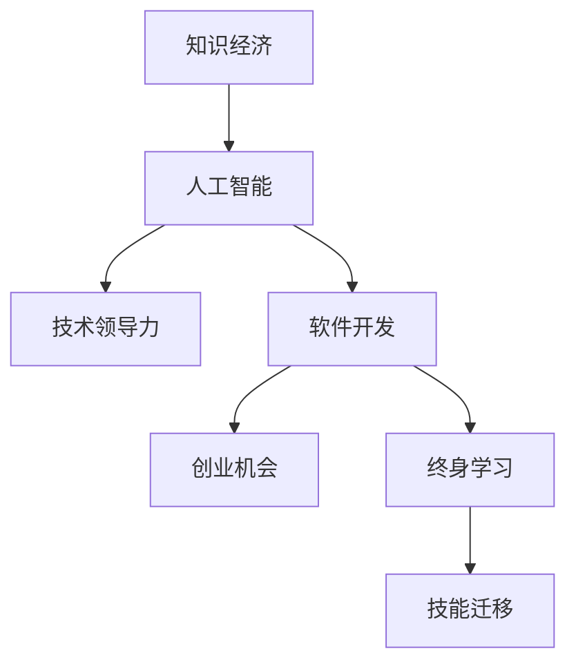

                 

# 程序员在知识经济时代的发展机会

> 关键词：知识经济, 人工智能, 技术领导力, 软件开发, 创业机会, 终身学习, 技能迁移

## 1. 背景介绍

### 1.1 问题由来
当前，全球正处于第四次工业革命的关键时期，以信息技术为核心的知识经济正在迅速崛起。随着数字化、智能化进程的推进，越来越多的行业依赖于软件的支持和创新驱动。而程序员作为软件开发和运维的核心力量，其技能和知识体系正经历前所未有的变革。

在知识经济时代，技术的快速迭代、市场的多样化需求、以及新职业形态的涌现，为程序员提供了前所未有的发展机会和挑战。这一变革不仅要求程序员具备更高的技术能力，也需要在个人职业发展、团队合作、以及创业等多个方面进行适应和突破。

### 1.2 问题核心关键点
技术变革是知识经济时代的关键特征。人工智能、大数据、云计算、物联网等技术的兴起，不仅重塑了软件开发的范式，也催生了新的商业模式和职业机会。程序员在应对这些变化时，需要具备以下关键能力：

1. **技术迭代能力**：紧跟技术前沿，持续学习新知识，适应新技术。
2. **跨领域整合能力**：将多学科知识融合，构建多模态系统。
3. **创新与创业能力**：识别市场机会，将技术创新转化为商业价值。
4. **软技能**：如团队协作、项目管理、沟通协调等，以适应复杂项目和跨团队协作。
5. **终身学习**：保持学习和更新知识，适应技术变化和工作需求。

### 1.3 问题研究意义
了解程序员在知识经济时代的发展机会，对于软件开发行业具有重要意义：

1. **人才培养**：明确编程技术及软技能需求，指导教育机构和培训机构培养符合市场需求的人才。
2. **职业规划**：为程序员提供清晰的职业发展路径，帮助其制定长期职业规划。
3. **企业发展**：指导企业合理配置人力资源，提升团队整体技术水平和创新能力。
4. **社会影响**：促进技术创新和社会进步，提升社会整体的技术水平和竞争力。

## 2. 核心概念与联系

### 2.1 核心概念概述

为更好地理解程序员在知识经济时代的发展机会，本节将介绍几个密切相关的核心概念：

- **知识经济（Knowledge Economy）**：以知识和信息为重要生产要素的经济模式，强调创新和技术对经济增长的贡献。
- **人工智能（AI）**：通过模拟人类智能行为，实现机器学习、自然语言处理等技术，推动自动化、智能化应用。
- **技术领导力（Technical Leadership）**：在技术团队或项目中，指导、协调和激励团队成员，推动技术创新和项目成功。
- **软件开发（Software Development）**：涉及软件需求分析、设计、编码、测试、维护等全过程。
- **创业机会（Entrepreneurial Opportunities）**：结合技术创新和市场需求，识别和把握新的商业机会，创建技术型企业。
- **终身学习（Lifelong Learning）**：在职业生涯中不断学习新知识、技能，适应技术和市场变化。
- **技能迁移（Skill Transferability）**：将一种领域的专业技能应用于其他领域，实现跨领域技能整合。

这些核心概念之间的逻辑关系可以通过以下Mermaid流程图来展示：



这个流程图展示了一个程序员在知识经济时代可能经历的发展路径：从人工智能技术的掌握，到技术领导力的提升，再到软件开发和创业机会的拓展，以及终身学习和技能迁移的重要性。

## 3. 核心算法原理 & 具体操作步骤
### 3.1 算法原理概述

在知识经济时代，程序员面临的算法原理和技术栈更加多样化和复杂化。以下是几种主要算法原理和具体操作步骤：

- **机器学习（Machine Learning, ML）**：通过数据训练模型，实现预测和分类等任务。常用的算法包括决策树、随机森林、支持向量机等。
- **深度学习（Deep Learning, DL）**：使用神经网络模型处理复杂数据，如图像识别、自然语言处理等。常用的框架包括TensorFlow、PyTorch等。
- **自然语言处理（Natural Language Processing, NLP）**：利用算法处理和理解人类语言，如语言模型、词向量等。
- **软件开发框架（Software Development Frameworks）**：如MVC、MVVM、RESTful API等，提供编程结构，简化开发过程。
- **敏捷开发（Agile Development）**：采用迭代、增量的开发方式，提高项目适应性和效率。

### 3.2 算法步骤详解

以机器学习和深度学习为例，展示如何进行算法实践：

**Step 1: 数据准备**
- 收集、清洗和预处理数据。
- 划分为训练集、验证集和测试集。
- 进行特征工程，提取和转化输入数据。

**Step 2: 模型训练**
- 选择合适的模型和算法。
- 设置超参数，如学习率、批大小、迭代轮数等。
- 使用梯度下降等优化算法进行模型训练。
- 使用交叉验证等技术评估模型性能。

**Step 3: 模型评估与优化**
- 在测试集上评估模型效果。
- 根据评估结果调整超参数和模型结构。
- 使用正则化、dropout等技术提高模型泛化能力。

**Step 4: 模型部署与监控**
- 将模型部署到实际应用中。
- 实时监控模型性能和系统状态。
- 根据需求定期更新和优化模型。

### 3.3 算法优缺点

机器学习和深度学习算法具有以下优点：
- 强大的数据分析能力。
- 能够处理非结构化数据。
- 具有较好的泛化能力。

同时，这些算法也存在一些缺点：
- 对数据质量和数量要求较高。
- 模型复杂度高，计算成本大。
- 需要大量的数据和计算资源。
- 模型解释性较差。

软件开发框架和敏捷开发方法具有以下优点：
- 提高开发效率。
- 增强代码可维护性和可扩展性。
- 适应需求变更，提高项目成功率。

但同时也存在一些缺点：
- 学习曲线较陡峭。
- 依赖工具和平台。
- 需要良好的团队协作和沟通能力。

### 3.4 算法应用领域

这些算法和开发方法广泛应用在各个领域，例如：

- **金融科技（Fintech）**：利用机器学习进行风险评估、反欺诈检测，提高金融服务的安全性和效率。
- **医疗健康（Healthcare）**：采用深度学习进行医学影像分析、疾病诊断，提升医疗服务的精准性和可及性。
- **零售电商（E-commerce）**：通过数据分析和推荐算法，提升商品推荐和个性化营销效果。
- **智能制造（Smart Manufacturing）**：利用机器学习进行预测性维护、工艺优化，提升生产效率和质量。
- **自动驾驶（Autonomous Driving）**：使用深度学习和计算机视觉技术，实现智能驾驶和环境感知。

除了上述这些典型应用外，人工智能和软件开发技术还在更多场景中得到创新性应用，如智能客服、智能家居、智慧城市等，为各行各业带来全新的技术突破。

## 4. 数学模型和公式 & 详细讲解 & 举例说明

### 4.1 数学模型构建

在知识经济时代，程序员需要掌握的数学模型和公式更加多样化。以下是几种常见模型和公式的构建过程：

**线性回归（Linear Regression）**：
- 目标：最小化预测值和实际值之间的平方误差。
- 公式：$$
\min_{\theta} \sum_{i=1}^n (y_i - \theta \cdot x_i)^2
$$
- 求解：使用梯度下降法，计算梯度并更新参数。

**卷积神经网络（Convolutional Neural Networks, CNNs）**：
- 目标：通过卷积操作提取特征，进行图像分类。
- 公式：$$
f(x) = \sigma(\mathcal{F}^{L}(\mathcal{F}^{L-1}(...(\mathcal{F}^{1}(x))))
$$
- 求解：通过前向传播和反向传播算法，训练卷积核和全连接层参数。

**递归神经网络（Recurrent Neural Networks, RNNs）**：
- 目标：处理序列数据，如时间序列预测、语言模型。
- 公式：$$
\begin{aligned}
&h_t = f(h_{t-1}, x_t)\\
&\hat{y}_t = g(h_t)
\end{aligned}
$$
- 求解：通过时间步迭代，更新隐藏状态和输出。

**算法示例**：
- 输入数据：样本集X和标签集Y。
- 模型构建：选择模型结构，设置参数。
- 训练过程：循环迭代，更新参数。
- 结果输出：预测结果和评估指标。

### 4.2 公式推导过程

以下是线性回归和卷积神经网络的具体推导过程：

**线性回归**：
- 假设模型为 $$\hat{y} = \theta_0 + \theta_1 x_1 + \theta_2 x_2$$
- 最小化误差 $$\epsilon = \sum_{i=1}^n (\hat{y}_i - y_i)^2$$
- 使用梯度下降法更新参数 $$\theta_k \leftarrow \theta_k - \eta \frac{\partial \epsilon}{\partial \theta_k}$$
- 推导得到 $$\theta_k = \frac{1}{n} \sum_{i=1}^n (x_{ki} - \bar{x}_k)(y_i - \bar{y})$$

**卷积神经网络**：
- 假设输入为 $$x \in \mathbb{R}^m$$
- 卷积层公式为 $$\mathcal{F}(x) = \sum_{i=0}^{n-1} w_i x_i + b$$
- 激活函数为 $$\sigma(x) = \frac{1}{1+e^{-x}}$$
- 堆叠多层次卷积和池化操作，进行特征提取和降维。

### 4.3 案例分析与讲解

以图像分类为例，展示如何使用卷积神经网络进行模型构建和训练：

- 输入数据：图像数据集，如MNIST。
- 模型构建：使用PyTorch框架，设计卷积神经网络。
- 数据预处理：对图像进行归一化、缩放、标准化等处理。
- 模型训练：使用小批量随机梯度下降（SGD），迭代训练模型。
- 结果评估：使用准确率、损失等指标评估模型性能。

## 5. 项目实践：代码实例和详细解释说明
### 5.1 开发环境搭建

在进行项目实践前，我们需要准备好开发环境。以下是使用Python进行PyTorch开发的环境配置流程：

1. 安装Anaconda：从官网下载并安装Anaconda，用于创建独立的Python环境。

2. 创建并激活虚拟环境：
```bash
conda create -n pytorch-env python=3.8 
conda activate pytorch-env
```

3. 安装PyTorch：根据CUDA版本，从官网获取对应的安装命令。例如：
```bash
conda install pytorch torchvision torchaudio cudatoolkit=11.1 -c pytorch -c conda-forge
```

4. 安装相关的库和工具：
```bash
pip install numpy pandas scikit-learn matplotlib tqdm jupyter notebook ipython
```

完成上述步骤后，即可在`pytorch-env`环境中开始项目实践。

### 5.2 源代码详细实现

下面我们以图像分类项目为例，给出使用PyTorch进行卷积神经网络训练的代码实现。

```python
import torch
import torch.nn as nn
import torch.optim as optim
import torchvision.transforms as transforms
import torchvision.datasets as datasets

# 定义卷积神经网络模型
class ConvNet(nn.Module):
    def __init__(self):
        super(ConvNet, self).__init__()
        self.conv1 = nn.Conv2d(3, 6, 5)
        self.pool = nn.MaxPool2d(2, 2)
        self.conv2 = nn.Conv2d(6, 16, 5)
        self.fc1 = nn.Linear(16 * 5 * 5, 120)
        self.fc2 = nn.Linear(120, 84)
        self.fc3 = nn.Linear(84, 10)

    def forward(self, x):
        x = self.pool(nn.functional.relu(self.conv1(x)))
        x = self.pool(nn.functional.relu(self.conv2(x)))
        x = x.view(-1, 16 * 5 * 5)
        x = nn.functional.relu(self.fc1(x))
        x = nn.functional.relu(self.fc2(x))
        x = self.fc3(x)
        return nn.functional.log_softmax(x, dim=1)

# 加载数据集
train_dataset = datasets.MNIST(root='./data', train=True, transform=transforms.ToTensor(), download=True)
test_dataset = datasets.MNIST(root='./data', train=False, transform=transforms.ToTensor(), download=True)

# 定义模型、损失函数和优化器
model = ConvNet()
criterion = nn.CrossEntropyLoss()
optimizer = optim.SGD(model.parameters(), lr=0.001, momentum=0.9)

# 训练过程
for epoch in range(10):
    train_loss = 0
    for data, target in train_loader:
        optimizer.zero_grad()
        output = model(data)
        loss = criterion(output, target)
        loss.backward()
        optimizer.step()
        train_loss += loss.item() * data.size(0)
    print('Epoch [%d/%d], Loss: %.4f' % (epoch + 1, 10, train_loss / train_loader.dataset.size()))

# 测试过程
test_loss = 0
correct = 0
with torch.no_grad():
    for data, target in test_loader:
        output = model(data)
        test_loss += criterion(output, target).item()
        predicted = output.argmax(dim=1, keepdim=True)
        correct += predicted.eq(target.view_as(predicted)).sum().item()

print('Test Loss: %.4f' % (test_loss / test_loader.dataset.size()))
print('Test Accuracy: %.4f' % (correct / test_loader.dataset.size()))
```

以上就是使用PyTorch进行卷积神经网络训练的完整代码实现。可以看到，通过PyTorch框架，可以方便地构建、训练和测试卷积神经网络模型。

### 5.3 代码解读与分析

让我们再详细解读一下关键代码的实现细节：

**ConvNet类**：
- `__init__`方法：初始化卷积神经网络的结构。
- `forward`方法：定义前向传播的计算过程。

**数据加载**：
- 使用`torchvision`库加载MNIST数据集。
- 使用`transforms`库进行数据预处理，如归一化、缩放等。

**模型训练**：
- 定义模型、损失函数和优化器。
- 使用`for`循环进行多轮迭代。
- 在每个批次上前向传播计算损失，反向传播更新模型参数。
- 使用`print`输出训练过程中的损失值。

**模型测试**：
- 在测试集上评估模型的性能。
- 使用`torch.no_grad`关闭梯度计算，避免对模型参数的修改。
- 统计预测准确率。

## 6. 实际应用场景
### 6.1 智能客服系统

智能客服系统在知识经济时代具有广泛的应用。传统客服依赖人工处理，响应速度慢，服务质量难以保证。基于深度学习的智能客服系统能够24小时不间断服务，提升客户满意度，降低运营成本。

具体而言，可以采用自然语言处理技术，训练智能客服模型，使其能够理解客户咨询意图，匹配最合适的答案，提供个性化服务。在实际应用中，系统通过语音识别、语义分析、知识图谱查询等技术，实现自动化服务，显著提升客户体验和问题解决效率。

### 6.2 金融科技

金融科技在知识经济时代发展迅速。传统的金融服务依赖人工操作，效率低，易出错。利用深度学习和自然语言处理技术，可以实现自动化的金融风险评估、反欺诈检测、智能投顾等功能。

具体而言，可以采用监督学习和迁移学习方法，训练金融风险预测模型，实时监控金融交易数据，预测潜在风险。系统通过多维度数据分析和机器学习模型，提升金融服务的精准性和安全性，为投资者和金融机构提供全方位的支持。

### 6.3 医疗健康

医疗健康在知识经济时代也面临重大变革。传统的医疗服务依赖医生经验和纸质病历，效率低，误诊率高。利用深度学习和自然语言处理技术，可以实现医疗影像分析、疾病诊断、智能问诊等功能。

具体而言，可以采用卷积神经网络和自然语言处理技术，训练医疗影像分析模型，提升医疗影像诊断的准确性和速度。系统通过多模态数据融合和知识图谱查询，提供智能问诊和个性化治疗建议，提升医疗服务的可及性和精准性。

### 6.4 未来应用展望

随着人工智能技术的不断发展，基于深度学习和自然语言处理的应用将更加广泛和深入。未来，智能客服、金融科技、医疗健康等领域还将涌现更多创新应用，为社会带来深远影响。

在智能制造、智慧城市、自动驾驶等领域，基于深度学习的智能系统也将获得广泛应用。系统通过感知、分析和决策，提升生产效率、城市管理水平和交通安全，推动社会进步和经济发展。

## 7. 工具和资源推荐
### 7.1 学习资源推荐

为了帮助程序员掌握知识经济时代的核心技术，这里推荐一些优质的学习资源：

1. **《深度学习》（Ian Goodfellow等著）**：深入浅出地介绍深度学习的理论和实践，适合初学者和进阶者阅读。
2. **《Python深度学习》（Francois Chollet著）**：通过实际项目讲解深度学习的应用，适合动手实践。
3. **Coursera《机器学习》（Andrew Ng主讲的课程）**：系统的机器学习课程，涵盖算法原理和应用案例。
4. **Udacity《深度学习基础》课程**：提供深度学习的实际项目实践，适合进阶学习。
5. **Kaggle竞赛**：通过实际数据集和问题，进行深度学习和数据科学竞赛，提升实战能力。

### 7.2 开发工具推荐

高效的开发离不开优秀的工具支持。以下是几款用于深度学习开发和部署的常用工具：

1. **PyTorch**：基于Python的开源深度学习框架，具有动态计算图和灵活的模型定义，适合研究和原型开发。
2. **TensorFlow**：由Google主导开发的深度学习框架，生产部署方便，适合大规模工程应用。
3. **Jupyter Notebook**：支持多语言的交互式编程和数据可视化，适合数据科学和深度学习研究。
4. **Hugging Face Transformers库**：提供预训练语言模型和微调API，适合自然语言处理任务开发。
5. **TensorBoard**：TensorFlow配套的可视化工具，实时监测模型训练状态，提供丰富的图表呈现方式。

### 7.3 相关论文推荐

深度学习和大数据技术的发展，催生了大量的创新研究。以下是几篇奠基性的相关论文，推荐阅读：

1. **《深度学习》（Ian Goodfellow等著）**：详细介绍了深度学习的原理和实践，适合理论学习。
2. **《图像分类与对象检测的深度学习》（Christian Szegedy等著）**：介绍了卷积神经网络的原理和应用，适合技术应用。
3. **《分布式深度学习》（Cheng Xu等著）**：介绍了分布式深度学习的原理和实践，适合大规模工程应用。
4. **《自然语言处理综述》（Yann Lecun等著）**：详细介绍了自然语言处理的理论和实践，适合研究者阅读。
5. **《强化学习》（Richard Sutton和Andrew Barto著）**：介绍了强化学习的原理和应用，适合研究者和工程师阅读。

## 8. 总结：未来发展趋势与挑战
### 8.1 研究成果总结

本文对程序员在知识经济时代的发展机会进行了全面系统的介绍。首先阐述了知识经济时代的技术变革和市场需求，明确了程序员在技术迭代、跨领域整合、创新与创业、终身学习和技能迁移等方面的重要能力。其次，从算法原理、具体操作步骤和实际应用场景等角度，详细讲解了机器学习、深度学习、自然语言处理等核心技术的理论基础和实践方法。最后，提供了丰富的学习资源、开发工具和研究论文，为程序员提供了全面的学习路径和实践指南。

通过本文的系统梳理，可以看到，知识经济时代为程序员提供了前所未有的发展机遇和挑战。技术快速迭代、市场多样化需求、以及新职业形态的涌现，都要求程序员不断学习和适应。唯有持续学习、提升技能、创新思维，才能在知识经济时代取得成功。

### 8.2 未来发展趋势

展望未来，程序员在知识经济时代的发展将呈现以下几个趋势：

1. **技术持续更新**：新技术、新框架层出不穷，程序员需要不断学习新技术，提升技术水平。
2. **跨领域融合**：编程技术将与其他学科如数据科学、人工智能、物联网等进行深度融合，产生更多交叉领域的机会。
3. **创新驱动**：技术创新和商业创新相结合，程序员将更多参与到创业和创新项目中，提升自身价值。
4. **软技能提升**：团队协作、项目管理、沟通协调等软技能的重要性日益突出，程序员需要不断提升这些能力。
5. **人工智能普及**：人工智能技术将广泛应用于各个领域，程序员需要具备人工智能相关的知识和技能。

### 8.3 面临的挑战

尽管知识经济时代提供了丰富的发展机会，但程序员在适应这一变化时也面临诸多挑战：

1. **技术迭代速度快**：新技术层出不穷，程序员需要不断学习和适应。
2. **跨领域技能要求高**：不同领域的知识需要交叉融合，对程序员的跨领域整合能力提出了更高要求。
3. **技术创新压力大**：持续的技术创新和商业化压力，要求程序员具备更强的创新能力和适应能力。
4. **软技能提升难度大**：团队协作、项目管理等软技能需要时间和经验积累，提升难度较大。
5. **技术伦理和安全性**：人工智能和深度学习技术的应用，需要关注伦理和安全问题，确保技术的正向应用。

### 8.4 研究展望

面对知识经济时代的技术挑战，未来研究需要在以下几个方面寻求新的突破：

1. **跨学科融合**：将编程技术与数据科学、人工智能、物联网等学科进行深度融合，产生更多交叉领域的机会。
2. **软技能培养**：加强团队协作、项目管理、沟通协调等软技能的教育和培训，提升程序员的综合能力。
3. **创新能力提升**：通过项目实践和创新竞赛，提升程序员的创新能力和技术应用能力。
4. **技术伦理和安全**：关注人工智能和深度学习技术的伦理和安全问题，确保技术的应用符合社会价值观和道德规范。

这些研究方向将引领程序员在知识经济时代的发展，促进技术创新和社会进步，为人类社会的数字化、智能化进程做出更大贡献。总之，程序员需要紧跟技术前沿，不断提升自身技能，才能在知识经济时代取得成功。

## 9. 附录：常见问题与解答

**Q1：程序员在知识经济时代需要掌握哪些新技术？**

A: 程序员在知识经济时代需要掌握以下新技术：

1. 深度学习：用于处理复杂数据，如图像识别、自然语言处理等。
2. 自然语言处理：用于理解和生成人类语言，如语言模型、词向量等。
3. 数据科学：用于数据收集、分析和可视化，提高数据驱动决策能力。
4. 分布式计算：用于处理大规模数据和模型，提高计算效率和可靠性。
5. 人工智能：结合多种技术，提升系统的智能水平和自动化能力。

**Q2：如何提升程序员的软技能？**

A: 提升程序员的软技能可以从以下几个方面入手：

1. 团队协作：积极参与团队项目，提高沟通协调能力。
2. 项目管理：学习项目管理工具和方法，提升项目规划和执行能力。
3. 领导力：培养领导能力，提升团队管理和激励能力。
4. 沟通能力：学习沟通技巧，提升表达和倾听能力。
5. 问题解决：多参与实际项目，积累问题解决的经验和能力。

**Q3：程序员如何在知识经济时代持续学习？**

A: 程序员在知识经济时代持续学习可以从以下几个方面入手：

1. 在线学习平台：如Coursera、Udacity、edX等，提供丰富的在线课程和资源。
2. 技术社区：如Stack Overflow、GitHub、Kaggle等，获取技术资讯和交流经验。
3. 技术书籍：阅读经典和前沿的技术书籍，深入理解理论基础和实践方法。
4. 开源项目：参与开源项目，提升实战能力和社区影响力。
5. 技术博客：关注技术博客和论坛，了解最新的技术动态和应用案例。

这些方法可以帮助程序员在知识经济时代持续学习，保持技术水平和职业竞争力。

**Q4：如何提升程序员的技术领导力？**

A: 提升程序员的技术领导力可以从以下几个方面入手：

1. 项目管理：掌握项目管理工具和方法，提升项目规划和执行能力。
2. 团队协作：积极参与团队项目，提高沟通协调能力。
3. 技术分享：组织技术分享会，提升技术影响力。
4. 技术创新：推动技术创新，提升团队整体技术水平。
5. 领导力培训：参加领导力培训课程，提升领导能力。

**Q5：程序员如何在知识经济时代保持技术前沿性？**

A: 程序员在知识经济时代保持技术前沿性可以从以下几个方面入手：

1. 持续学习：通过在线课程、技术博客、开源项目等途径，持续学习新技术和新方法。
2. 参与社区：积极参与技术社区，获取最新技术资讯和交流经验。
3. 技术实验：多参与技术实验和创新项目，积累实战经验。
4. 技术交流：参加技术会议、研讨会等活动，与同行交流最新技术进展。
5. 技术博客：通过技术博客分享学习心得和技术见解，提升技术影响力。

这些方法可以帮助程序员保持技术前沿性，提升技术水平和职业竞争力。

---

作者：禅与计算机程序设计艺术 / Zen and the Art of Computer Programming

