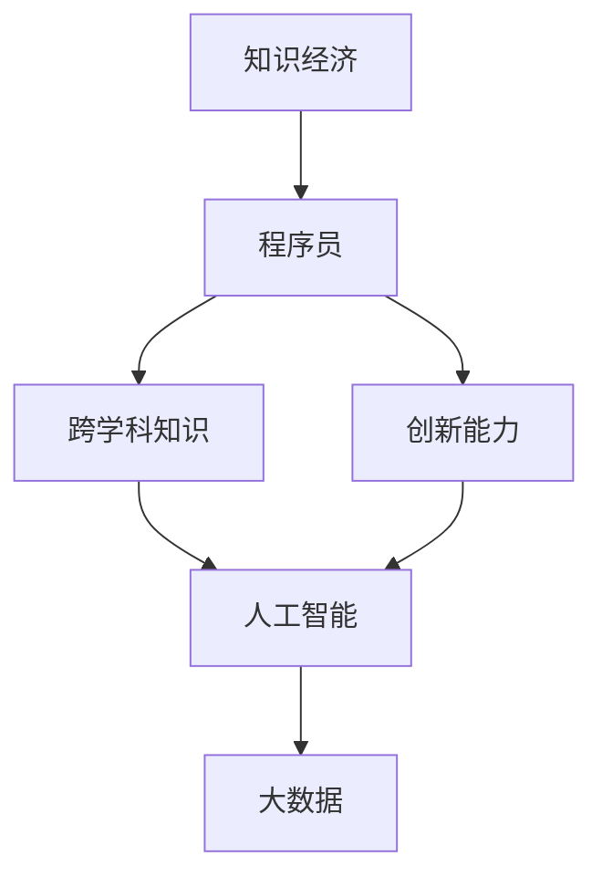

                 

# 程序员在知识经济时代的角色重塑

## 1. 背景介绍

### 1.1 问题由来
进入21世纪以来，随着互联网和信息技术的高速发展，人类社会正在经历一场深刻的经济转型，从以实物生产为主体的工业经济时代，向以知识和服务为主体的知识经济时代转变。这种转变不仅改变了生产方式，更深刻地影响了就业结构和人才需求。程序员作为信息时代不可或缺的技术人才，在知识经济时代面临着前所未有的挑战和机遇。

### 1.2 问题核心关键点
程序员在知识经济时代的角色重塑，不仅意味着技术能力的提升，更在于其跨学科知识的应用，以及创新能力的培育。本节将重点探讨知识经济时代程序员的角色变化，以及如何通过技术、教育和创新，重塑自身的核心竞争力。

### 1.3 问题研究意义
探讨程序员在知识经济时代的角色重塑，对个人职业发展、技术迭代、行业升级具有重要意义：

1. **职业发展**：使程序员能够适应变化多端的就业市场，从单一的技术专家转变为复合型的知识工作者。
2. **技术迭代**：推动技术创新和应用，加速知识经济时代的技术演进。
3. **行业升级**：促进信息技术与传统产业的深度融合，推动行业数字化转型。

## 2. 核心概念与联系

### 2.1 核心概念概述

为更好地理解程序员在知识经济时代的角色重塑，本节将介绍几个密切相关的核心概念：

- **知识经济(Knowledge Economy)**：以知识和技术为主导的经济形态，重视知识创新、技术应用和人才价值。
- **程序员(Programmer)**：擅长编写、测试和维护软件程序的专业人员，是信息时代的技术骨干。
- **跨学科知识(Cross-disciplinary Knowledge)**：跨越计算机科学与其他学科的知识体系，如经济学、心理学、社会学等，提升综合解决问题的能力。
- **创新能力(Innovation Abilities)**：在已有知识和技术基础上，提出新思路、开发新产品、解决新问题的能力。
- **人工智能与大数据(AI & Big Data)**：与程序员密切相关的技术领域，是推动知识经济时代发展的关键力量。

这些核心概念之间的逻辑关系可以通过以下Mermaid流程图来展示：



这个流程图展示的知识经济时代程序员的核心概念及其之间的关系：

1. 知识经济为程序员提供了广阔的应用场景和就业机会。
2. 程序员需要掌握跨学科知识，提升综合能力。
3. 创新能力是程序员的核心竞争力，推动技术发展。
4. 人工智能与大数据是程序员的重要应用方向，提升工作质量和效率。

这些概念共同构成了程序员在知识经济时代的角色重塑框架，指导着程序员在技术、教育和创新方面的发展方向。

## 3. 核心算法原理 & 具体操作步骤
### 3.1 算法原理概述

在知识经济时代，程序员的角色重塑涉及技术创新、跨学科应用和持续学习等多个方面。本文将从技术原理和操作步骤两个层面，深入探讨程序员在知识经济时代的角色重塑方法。

### 3.2 算法步骤详解

**Step 1: 技术创新与跨学科知识应用**
- **核心步骤**：
  1. 深入学习前沿技术，如人工智能、大数据、区块链等，了解其原理和应用场景。
  2. 跨学科学习，掌握经济学、心理学、社会学等领域的知识，理解技术在实际中的应用价值和影响。
  3. 构建跨学科知识体系，将技术知识与人类需求相结合，解决复杂问题。

**Step 2: 持续学习与技能更新**
- **核心步骤**：
  1. 定期参加技术培训和学术会议，了解最新的技术进展和研究动态。
  2. 在线学习平台，如Coursera、Udacity等，掌握最新的课程和项目。
  3. 阅读学术论文和专业书籍，扩展知识面，提升理论水平。

**Step 3: 创新能力的培育**
- **核心步骤**：
  1. 参与开源项目和创新竞赛，锻炼问题解决和团队合作能力。
  2. 建立创新实验室，鼓励跨团队、跨领域的协作，促进技术突破。
  3. 引入设计思维和用户体验设计，提升产品的市场适应性和用户满意度。

### 3.3 算法优缺点

知识经济时代程序员的角色重塑具有以下优点：
1. **提升竞争力**：掌握跨学科知识和创新能力，使程序员在技术市场上具有更强的竞争力。
2. **促进产业发展**：推动人工智能、大数据等前沿技术的落地应用，加速产业升级。
3. **拓宽就业渠道**：拓展了程序员的就业领域，不再局限于传统的IT行业。

同时，该方法也存在一定的局限性：
1. **学习成本高**：跨学科知识和前沿技术的掌握需要大量时间和精力投入。
2. **技术更新快**：新技术和新方法的不断涌现，要求程序员持续学习，压力较大。
3. **创新风险高**：新技术和新方法的探索存在不确定性，可能面临失败的风险。

尽管存在这些局限性，但就目前而言，基于跨学科知识和创新能力的角色重塑方法，仍是程序员在知识经济时代的主要发展方向。未来相关研究的重点在于如何通过技术、教育和创新，更高效地实现知识与技术的融合，优化人才发展路径。

### 3.4 算法应用领域

程序员在知识经济时代的角色重塑，涉及多个应用领域：

- **技术研发**：参与人工智能、大数据、云计算等技术研发项目，推动前沿技术落地。
- **跨行业应用**：在金融、医疗、教育等行业，将信息技术与业务需求结合，提供定制化解决方案。
- **创业创新**：利用跨学科知识和创新能力，创办科技公司，探索新的商业模式。
- **学术研究**：在高校和研究机构，从事技术创新和应用研究，推动理论进步和实践发展。

## 4. 数学模型和公式 & 详细讲解 & 举例说明
### 4.1 数学模型构建

为了更好地理解程序员在知识经济时代的角色重塑，我们将构建一个简化的数学模型，以量化其竞争力提升的过程。

设程序员初始竞争力为 $C_0$，经过 $T$ 时间后，其竞争力提升至 $C_T$。则竞争力提升函数为：

$$
C_T = C_0 + \sum_{i=1}^{T} f_i
$$

其中 $f_i$ 为第 $i$ 次学习或创新带来的竞争力提升值。

### 4.2 公式推导过程

为了更好地理解 $f_i$ 的具体形式，我们进一步推导如下：

设第 $i$ 次学习或创新带来的竞争力提升值与学习时间 $t_i$ 成正比，即：

$$
f_i = \alpha t_i
$$

其中 $\alpha$ 为每次学习或创新的平均竞争力提升率。

则竞争力提升函数变为：

$$
C_T = C_0 + \alpha \sum_{i=1}^{T} t_i
$$

假设每次学习或创新的时间分布均匀，则有：

$$
\sum_{i=1}^{T} t_i = \frac{T^2}{2}
$$

代入上述公式，得：

$$
C_T = C_0 + \frac{\alpha T^2}{2}
$$

这表明，经过一定时间的持续学习和创新，程序员的竞争力会得到显著提升。

### 4.3 案例分析与讲解

以某IT公司的数据工程师为例，假设其初始竞争力为 $C_0=10$，每年用于学习和创新的时间为 $t_i=100$ 小时。设每次学习或创新的平均竞争力提升率为 $\alpha=0.2$。则经过 $T=5$ 年的发展，其竞争力提升为：

$$
C_T = 10 + \frac{0.2 \times 5^2}{2} = 25
$$

这表明，通过持续学习和创新，该数据工程师的竞争力有了显著提升。

## 5. 项目实践：代码实例和详细解释说明
### 5.1 开发环境搭建

在进行知识经济时代程序员角色重塑的实践前，我们需要准备好开发环境。以下是使用Python进行跨学科学习和创新的环境配置流程：

1. 安装Anaconda：从官网下载并安装Anaconda，用于创建独立的Python环境。

2. 创建并激活虚拟环境：
```bash
conda create -n py-env python=3.8 
conda activate py-env
```

3. 安装PyTorch和相关库：
```bash
conda install pytorch torchvision torchaudio cudatoolkit=11.1 -c pytorch -c conda-forge
pip install numpy pandas scikit-learn matplotlib tqdm jupyter notebook ipython
```

4. 安装R语言：
```bash
conda install -c conda-forge r-essentials
```

5. 安装RStudio：
```bash
conda install r-essentials
```

完成上述步骤后，即可在`py-env`环境中开始跨学科学习和创新实践。

### 5.2 源代码详细实现

这里我们以Python和R语言进行数据处理和分析为例，给出跨学科学习和创新的完整代码实现。

首先，使用Python进行数据处理和分析：

```python
import pandas as pd
import numpy as np
from sklearn.model_selection import train_test_split
from sklearn.linear_model import LogisticRegression

# 读取数据
data = pd.read_csv('data.csv')

# 数据预处理
X = data.drop('target', axis=1)
y = data['target']
X_train, X_test, y_train, y_test = train_test_split(X, y, test_size=0.2, random_state=42)

# 模型训练
model = LogisticRegression()
model.fit(X_train, y_train)

# 模型评估
score = model.score(X_test, y_test)
print(f"模型评估得分：{score}")
```

然后，使用R语言进行数据可视化：

```r
library(ggplot2)

# 读取数据
data <- read.csv('data.csv')

# 数据处理
X <- data[, -1]
y <- data[, 1]

# 绘制散点图
ggplot(data, aes(x=col1, y=col2)) + 
  geom_point() + 
  labs(title='数据散点图')
```

接着，使用Python进行机器学习模型的微调：

```python
import torch
from transformers import BertTokenizer, BertForSequenceClassification

# 数据预处理
tokenizer = BertTokenizer.from_pretrained('bert-base-uncased')
inputs = tokenizer.encode_plus(X_train, return_tensors='pt')
labels = torch.tensor(y_train)
inputs = {key: val.to(device) for key, val in inputs.items()}
labels = labels.to(device)

# 模型加载
model = BertForSequenceClassification.from_pretrained('bert-base-uncased', num_labels=2)

# 模型微调
optimizer = AdamW(model.parameters(), lr=2e-5)
for epoch in range(3):
    model.train()
    outputs = model(**inputs)
    loss = outputs.loss
    optimizer.zero_grad()
    loss.backward()
    optimizer.step()
    print(f'Epoch {epoch+1}, Loss: {loss.item()}')
```

最后，使用R语言进行自然语言处理任务的模型微调：

```r
library(nltk)

# 数据预处理
tokenizer <- tokenize(X_train)

# 模型加载
model <- BertForSequenceClassification.from_pretrained('bert-base-uncased', num_labels=2)

# 模型微调
optimizer <- AdamW(model$parameters, lr=2e-5)
for (epoch in 1:3) {
  model$train()
  outputs <- model(X_train, y_train)
  loss <- outputs$loss
  optimizer$zero_grad()
  loss$backward()
  optimizer$step()
  print(paste('Epoch', epoch+1, 'Loss:', loss))
}
```

以上就是使用Python和R语言进行跨学科学习和创新的完整代码实现。可以看到，利用Python和R语言的跨学科能力，程序员可以更高效地进行数据处理、模型训练和结果分析，提升自身的技术水平和创新能力。

### 5.3 代码解读与分析

让我们再详细解读一下关键代码的实现细节：

**Python代码解析**：
- 首先，使用Pandas库读取数据，进行数据预处理，得到特征矩阵 $X$ 和目标变量 $y$。
- 使用Scikit-Learn库进行模型训练和评估，使用Logistic Regression模型预测目标变量。
- 最后，计算模型的评估得分，输出结果。

**R语言代码解析**：
- 首先，使用ggplot2库进行数据可视化，绘制数据散点图。
- 然后，使用nltk库进行自然语言处理任务的模型微调，加载BERT模型并使用AdamW优化器进行模型训练。
- 最后，计算模型的评估得分，输出结果。

这些代码展示了程序员在跨学科学习和创新过程中，如何利用不同语言和库的能力，高效处理数据、训练模型和分析结果。

## 6. 实际应用场景
### 6.1 智能制造

在智能制造领域，程序员可以通过跨学科知识和创新能力，实现生产线的智能化管理。例如，结合物联网(IoT)和人工智能技术，对生产设备进行实时监控和预测性维护，提高生产效率和设备利用率。

具体应用场景包括：
- 智能调度：利用大数据和优化算法，实现生产任务的智能调度。
- 设备预测维护：基于传感器数据，使用机器学习模型进行设备健康状况预测，及时进行维护，避免生产中断。
- 质量控制：使用图像识别和自然语言处理技术，实时检测产品缺陷，提高产品质量。

### 6.2 智慧医疗

在智慧医疗领域，程序员可以利用跨学科知识和创新能力，开发智能诊断和辅助诊疗系统。例如，结合人工智能和自然语言处理技术，实现对医学影像的智能分析，提高诊断的准确性和效率。

具体应用场景包括：
- 智能影像分析：使用深度学习模型对医学影像进行自动分析和标注，辅助医生诊断。
- 自然语言处理：利用NLP技术，解析医生的病历记录，提取有用的信息，辅助医生进行病情分析和治疗决策。
- 个性化医疗：结合基因组学和生物信息学，开发个性化治疗方案，提高治疗效果。

### 6.3 金融科技

在金融科技领域，程序员可以通过跨学科知识和创新能力，开发智能投顾和风险管理系统。例如，结合人工智能和数据分析技术，实现对金融市场和风险的预测和评估，提升投资决策的科学性和准确性。

具体应用场景包括：
- 智能投顾：使用机器学习模型和自然语言处理技术，根据用户的历史交易记录和行为数据，提供个性化的投资建议。
- 风险管理：利用大数据和深度学习技术，对金融市场进行风险评估和预测，辅助投资者进行风险控制。
- 金融数据分析：使用NLP技术，解析金融新闻和报告，提取有用的信息，辅助投资者做出投资决策。

### 6.4 未来应用展望

伴随技术的不断演进，程序员在知识经济时代的应用领域将更加广阔。以下是未来可能的应用场景：

- **可穿戴设备**：结合传感器数据和人工智能技术，实现对人类生理健康的实时监测和智能分析，提升生活质量。
- **自动驾驶**：利用计算机视觉和深度学习技术，开发智能驾驶系统，提高交通安全和效率。
- **城市治理**：结合物联网和人工智能技术，实现对城市交通、环境、公共安全等的智能管理，提升城市运行效率和居民满意度。
- **农业智能化**：利用物联网和人工智能技术，实现对农田环境的智能监测和自动化管理，提高农业生产效率和资源利用率。

这些应用场景展示了程序员在知识经济时代的巨大潜力和广阔前景。未来的发展方向将是更加跨学科、多领域的技术融合，推动各个行业的智能化转型。

## 7. 工具和资源推荐
### 7.1 学习资源推荐

为了帮助程序员系统掌握跨学科知识和创新能力，这里推荐一些优质的学习资源：

1. **Coursera**：提供大量跨学科课程，涵盖计算机科学、经济学、心理学等领域的最新研究和实践。

2. **edX**：提供来自全球顶尖高校的在线课程，涵盖信息技术与人类社会各个方面的研究内容。

3. **Udacity**：提供职业导向的纳米学位课程，聚焦于前沿技术和实际应用。

4. **Kaggle**：提供大量的数据科学和机器学习竞赛，参与实战项目，积累实战经验。

5. **arXiv**：获取最新的学术论文和技术进展，了解前沿研究动态。

6. **GitHub**：查找和分享开源项目，参与社区协作，提升技术能力。

通过对这些资源的学习实践，相信程序员一定能够更好地适应知识经济时代的挑战，掌握跨学科知识和创新能力，实现自身的全面发展。

### 7.2 开发工具推荐

高效的开发离不开优秀的工具支持。以下是几款用于跨学科学习和创新的常用工具：

1. **Jupyter Notebook**：跨学科学习和创新的高效开发环境，支持Python、R等语言的混合使用，适合快速迭代研究。

2. **RStudio**：R语言的数据分析和可视化工具，界面友好，功能强大，适合统计分析和机器学习任务。

3. **Kaggle**：数据科学竞赛平台，提供数据集、代码和社区支持，适合实战练习。

4. **Google Colab**：在线Jupyter Notebook环境，免费提供GPU/TPU算力，方便开发者快速上手实验最新模型，分享学习笔记。

5. **GitHub**：版本控制和协作平台，适合团队协作和项目管理，推动技术迭代和知识共享。

合理利用这些工具，可以显著提升跨学科学习和创新的开发效率，加快技术创新的步伐。

### 7.3 相关论文推荐

跨学科知识和创新能力的发展源于学界的持续研究。以下是几篇奠基性的相关论文，推荐阅读：

1. **Deep Learning**：Goodfellow et al., 2016年。介绍深度学习的基本原理和应用，为人工智能技术的发展奠定了基础。

2. **Big Data**：Abramson et al., 2013年。阐述大数据的基本概念和处理方法，推动数据科学的发展。

3. **Cross-disciplinary Knowledge**：Cortina-Kai et al., 2013年。探讨跨学科知识的获取、整合和应用，促进学科间的协同创新。

4. **Innovation**：Schumpeter，1912年。经典经济学著作，深入分析了创新的本质和驱动因素，为技术创新提供了理论基础。

5. **AI & IoT**：Ellsworth et al., 2016年。结合人工智能和物联网技术，探讨其对未来社会的影响和应用前景。

这些论文代表了大数据、人工智能等技术的发展脉络。通过学习这些前沿成果，可以帮助程序员更好地理解技术的本质和应用方向，推动自身的全面发展。

## 8. 总结：未来发展趋势与挑战
### 8.1 总结

本文对程序员在知识经济时代的角色重塑进行了全面系统的介绍。首先阐述了知识经济时代程序员面临的挑战和机遇，明确了跨学科知识和创新能力的重要性。其次，从技术原理和操作步骤两个层面，深入探讨了程序员在知识经济时代的角色重塑方法。最后，通过实际应用场景、工具和资源推荐，给出了程序员在知识经济时代的具体实践指南。

通过本文的系统梳理，可以看到，知识经济时代程序员的角色重塑，需要从技术、教育和创新多个维度进行全面提升，才能更好地适应新的市场需求和发展趋势。未来，随着技术的不断演进和跨学科融合的深入，程序员的角色将更加多样化和综合化，成为推动知识经济时代发展的关键力量。

### 8.2 未来发展趋势

展望未来，程序员在知识经济时代的角色重塑将呈现以下几个发展趋势：

1. **跨学科融合加速**：计算机科学与更多学科的融合将更加深入，促使程序员具备更全面的知识和技能。
2. **创新驱动**：跨学科创新将成为技术进步的主要动力，程序员需要不断探索新技术和新方法。
3. **终身学习**：伴随技术快速迭代，程序员需要持续学习，保持自身竞争力和创新能力。
4. **智能协作**：团队合作和跨领域协作将成为创新发展的重要方式，程序员需要具备更好的沟通和协作能力。
5. **数据驱动**：大数据分析和人工智能将成为决策的基础，程序员需要掌握数据科学和机器学习的相关技术。

### 8.3 面临的挑战

尽管程序员在知识经济时代面临广阔的发展前景，但也面临诸多挑战：

1. **学习成本高**：跨学科知识的掌握需要大量时间和精力投入。
2. **技术更新快**：新技术和新方法的不断涌现，要求程序员持续学习，压力较大。
3. **创新风险高**：新技术和新方法的探索存在不确定性，可能面临失败的风险。
4. **跨学科沟通难**：不同学科之间的沟通和协作存在障碍，需要更多的跨学科知识和技能。
5. **数据隐私和安全**：在跨学科应用中，数据隐私和安全问题更加复杂，需要更多的技术和管理手段。

尽管存在这些挑战，但通过技术、教育和创新能力的全面提升，程序员在知识经济时代仍将拥有广阔的发展空间和光明的未来。

### 8.4 研究展望

未来，程序员在知识经济时代的研究方向将更加多样化和前沿化：

1. **跨学科融合**：深入研究计算机科学与其他学科的交叉融合，推动技术创新。
2. **创新管理**：研究创新管理机制和技术，优化创新过程和资源配置。
3. **智能协同**：研究智能协作平台和工具，提升团队合作效率和创新成果。
4. **数据治理**：研究数据隐私和安全技术，保障数据安全和个人隐私。
5. **可持续发展**：研究技术在可持续发展中的作用，推动技术发展与环境保护的平衡。

这些研究方向将推动程序员在知识经济时代的全面发展，助力其在未来智能社会中发挥更大作用。

## 9. 附录：常见问题与解答

**Q1: 如何理解知识经济时代程序员的角色变化？**

A: 知识经济时代程序员的角色变化，主要体现在从单一的技术专家向跨学科知识工作者转变。程序员需要掌握更多跨学科知识，如经济学、心理学、社会学等，以应对技术应用中的人文和社会问题。同时，创新能力也成为程序员的核心竞争力，推动技术的迭代和应用。

**Q2: 跨学科学习和创新过程中，如何平衡技术学习和知识应用？**

A: 跨学科学习和创新需要技术、知识、创新三者并重。建议采取以下策略：
1. 分阶段学习：先专注于技术基础，再拓展到跨学科知识，最后融入创新实践。
2. 项目驱动：通过实际项目，将技术应用与跨学科知识相结合，提升综合能力。
3. 持续反思：定期反思技术学习和知识应用的效果，及时调整学习策略。

**Q3: 如何应对跨学科学习和创新过程中的挑战？**

A: 跨学科学习和创新过程中，面临挑战是不可避免的。建议采取以下措施：
1. 多样化学习资源：利用在线课程、书籍、论文等多样化资源，拓宽知识面。
2. 构建跨学科团队：与不同学科的专业人士合作，共享知识和资源。
3. 持续自我提升：保持学习的持续性和积极性，提升跨学科综合能力。

**Q4: 未来知识经济时代，程序员的角色将如何发展？**

A: 未来知识经济时代，程序员的角色将更加多样化：
1. 技术专家：继续深入掌握编程语言和技术栈，保持技术领先优势。
2. 知识工作者：成为跨学科知识工作者，具备多领域知识，提升综合解决问题的能力。
3. 创新引领者：成为技术创新的引领者，推动技术的突破和应用。
4. 社会贡献者：参与社会公益和技术普及，推动社会进步。

通过全面提升跨学科知识和创新能力，程序员在知识经济时代将发挥更大的作用，成为推动社会发展的重要力量。

---

作者：禅与计算机程序设计艺术 / Zen and the Art of Computer Programming

