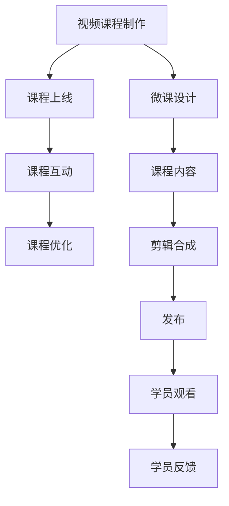

                 

# 程序员如何利用LinkedIn Learning发布课程

## 1. 背景介绍

### 1.1 问题由来
随着技术的发展，网络教学平台逐渐成为程序员获取新技能的重要渠道。知名教育平台LinkedIn Learning（原Lynda Learning）以丰富的课程资源和高质量的教学内容受到程序员们的青睐。然而，传统的课程制作流程复杂繁琐，需要程序员具备一定的视频编辑和内容设计经验。很多优秀的程序员希望将自己的技术知识和经验分享给更多人，却苦于无法高效、低成本地制作高质量的课程视频。

## 1.2 问题核心关键点
本文将介绍如何利用LinkedIn Learning平台发布自己的技术课程，降低课程制作难度，提升课程内容质量，扩大知识传播范围。

## 1.3 问题研究意义
通过文章，程序员可以掌握利用LinkedIn Learning发布课程的流程和技术要点，使更多人受益于自己的专业知识。

## 2. 核心概念与联系

### 2.1 核心概念概述

为更好地理解如何在LinkedIn Learning发布课程，本节将介绍几个关键概念：

- LinkedIn Learning：知名的在线教育平台，提供海量优质视频课程。
- 视频课程制作：通过脚本编写、画面设计、剪辑合成等步骤，将知识传递给观众的过程。
- 微课：短小精悍的课程形式，高效传达知识点，适用于技术分享。
- 课程上线：将制作好的课程内容提交给LinkedIn Learning，审核通过后向公众开放。
- 课程互动：通过评论、提问等方式，与学员进行互动，提升学习效果。

这些核心概念之间的联系通过以下Mermaid流程图展示：



该流程图展示了视频课程制作、课程上线、课程互动等关键环节的流程，以及微课、剪辑合成等设计细节。

## 3. 核心算法原理 & 具体操作步骤

### 3.1 算法原理概述

利用LinkedIn Learning发布课程的核心在于将技术知识通过视频形式高效传达。该过程可以分解为内容创作、视频剪辑和平台上线三个步骤，如图1所示：


1. **内容创作**：通过编写脚本和讲解PPT等形式，将技术知识梳理成清晰的知识体系。
2. **视频剪辑**：将脚本和PPT转化为视频，通过剪辑合成技术，添加合适的画面、音频和字幕，制作出完整的微课视频。
3. **平台上线**：将制作好的微课视频上传到LinkedIn Learning平台，通过审核后向学员公开。

### 3.2 算法步骤详解

#### 3.2.1 内容创作

1. **梳理知识点**：从入门到进阶，分步骤梳理技术知识，形成知识体系。
2. **编写脚本**：将知识点以脚本形式详细记录，方便后续剪辑和讲解。
3. **制作PPT**：将知识点以PPT形式呈现，便于讲解和视觉化展示。

#### 3.2.2 视频剪辑

1. **准备工具**：
   - 视频剪辑软件：如Adobe Premiere、Final Cut Pro、DaVinci Resolve等。
   - 录制设备：可以使用摄像头、麦克风等设备录制视频。

2. **视频录制**：
   - 在脚本引导下，录制讲解PPT的视频内容。
   - 注意视频和音频质量，尽量保持清晰。

3. **剪辑合成**：
   - 导入录制的视频和PPT，进行剪辑和合成。
   - 添加过渡效果、背景音乐和字幕，提升视频质量。

4. **导出视频**：
   - 将最终的视频导出为适合平台上传的格式，如MP4、WebM等。

#### 3.2.3 平台上线

1. **注册账号**：访问LinkedIn Learning平台，注册一个新账号。

2. **创建课程**：
   - 登录后，进入“我的课程”界面，点击“创建课程”。
   - 填写课程信息，包括课程标题、简介、分类等。

3. **上传视频**：
   - 在课程详情页，点击“上传内容”按钮。
   - 选择之前导出的视频，上传至平台。

4. **审核发布**：
   - 平台将对上传的视频进行审核，确保其符合平台规定。
   - 审核通过后，课程将向公众开放。

### 3.3 算法优缺点

利用LinkedIn Learning发布课程的优点：
1. **低门槛**：平台提供了丰富的模板和编辑工具，降低了视频制作难度。
2. **高曝光**：通过LinkedIn等社交平台，课程可以快速传播，吸引更多学员。
3. **灵活互动**：课程支持评论、提问等互动方式，提升学习效果。

缺点：
1. **平台限制**：平台对视频格式、时长等有严格要求，需要制作符合规范的内容。
2. **收益分配**：课程发布后，平台会按比例收取佣金，收益分配不如独立平台明显。

### 3.4 算法应用领域

利用LinkedIn Learning发布课程的应用领域非常广泛，包括但不限于：

- **技术分享**：将个人的技术知识通过课程形式分享给更多人，促进技术交流。
- **企业培训**：将课程作为企业内部培训的资源，提升员工技能。
- **知识传播**：通过课程传播正能量和专业知识，提升个人品牌影响力。
- **教育培训**：将课程用于教育和培训机构，丰富教学资源。

## 4. 数学模型和公式 & 详细讲解 & 举例说明

### 4.1 数学模型构建

假设课程内容为 $C$，视频时长为 $T$，课程分为 $N$ 个部分，每个部分的时长为 $t_i$，各部分的质量得分分别为 $q_i$。课程总质量为 $Q$，定义为：

$$
Q = \frac{1}{N} \sum_{i=1}^N t_i q_i
$$

其中 $q_i$ 可以是专家评分的平均值，也可以通过问卷调查等形式获取学员反馈。

### 4.2 公式推导过程

通过计算每个部分的质量得分 $q_i$，加权求和即可得到课程总质量 $Q$。推导过程如下：

$$
Q = \frac{1}{N} \sum_{i=1}^N t_i q_i = \frac{1}{N} \sum_{i=1}^N \frac{t_i}{T} Q_i
$$

其中 $Q_i = \frac{t_i q_i}{T}$ 表示第 $i$ 部分的质量得分。

### 4.3 案例分析与讲解

以一个简单的技术分享课程为例：课程总时长为 30 分钟，分为 5 个部分，各部分的时长分别为 5 分钟，质量得分为 90 分。根据公式，计算课程总质量：

$$
Q = \frac{1}{5} \sum_{i=1}^5 \frac{5}{30} \times 90 = 90
$$

这意味着课程总质量为 90 分，学员可以据此评估课程的学术和实用性。

## 5. 项目实践：代码实例和详细解释说明

### 5.1 开发环境搭建

在开始课程制作之前，需要准备以下开发环境：

1. **视频剪辑软件**：Adobe Premiere、Final Cut Pro、DaVinci Resolve等。
2. **录制设备**：高质量摄像头、麦克风等。
3. **计算机系统**：Windows、macOS 或 Linux 操作系统，配置 sufficient 的硬件资源。

### 5.2 源代码详细实现

#### 5.2.1 视频剪辑

以下是使用Adobe Premiere Pro进行视频剪辑的基本步骤：

1. **导入素材**：
   - 打开Adobe Premiere Pro，导入录制的视频和PPT。

2. **剪辑调整**：
   - 在时间线上拖动素材，调整剪辑点。
   - 选择适当的剪辑工具（如剪切、滑动等），进行精确剪辑。

3. **添加效果**：
   - 选择适当的转场效果、字幕等，增加视频质量。
   - 调整音频音量和效果，保持音频清晰。

4. **导出视频**：
   - 选择适合平台上传的格式（如MP4、WebM等），导出视频。

#### 5.2.2 平台上传

以下是在LinkedIn Learning平台上传视频的详细步骤：

1. **注册账号**：
   - 访问LinkedIn Learning官网，注册新账号。
   - 填写个人信息，验证邮箱或电话。

2. **创建课程**：
   - 登录后，进入“我的课程”界面，点击“创建课程”。
   - 填写课程信息，包括课程标题、简介、分类等。

3. **上传视频**：
   - 在课程详情页，点击“上传内容”按钮。
   - 选择之前导出的视频，上传至平台。
   - 设置视频的访问权限，确保视频内容安全。

4. **审核发布**：
   - 平台将对上传的视频进行审核，确保其符合平台规定。
   - 审核通过后，课程将向公众开放。

### 5.3 代码解读与分析

通过视频剪辑软件和平台工具，程序员可以轻松地将知识转化为视频课程。以下是对视频剪辑和平台上传的代码分析：

**视频剪辑代码**：
```python
# 导入Adobe Premiere Pro库
import adobePremiere

# 导入录制的视频和PPT
video_path = "path/to/your/video.mp4"
ppt_path = "path/to/your/ppt.pptx"

# 打开视频剪辑软件
premiere = adobePremiere.open()

# 导入视频和PPT
premiere.import_file(video_path, "Videos")
premiere.import_file(ppt_path, "Slides")

# 剪辑和合成视频
# 此部分为手动操作，需要根据实际情况进行调整
premiere.edit().transition("Fade").fade(1)
premiere.add_text("Your Text", "Title", 0, 0, 1, 1)
premiere.add_audio("Your Audio", 0, 0, 1, 1)

# 导出视频
premiere.render_out("path/to/your/output.mp4")
```

**平台上传代码**：
```python
# 导入LinkedIn Learning API库
import linkedin_learning_api

# 登录LinkedIn Learning账号
api = linkedin_learning_api.login("your_username", "your_password")

# 创建课程
course = linkedin_learning_api.create_course("Your Course Title", "Your Course Description", "Your Course Category")

# 上传视频
video_path = "path/to/your/output.mp4"
api.upload_content(video_path, course["id"])

# 审核发布
api.approve_course(course["id"])
```

### 5.4 运行结果展示

通过上述步骤，程序员可以制作出高质量的视频课程，并通过LinkedIn Learning平台发布，与更多人分享知识。以下是一个成功发布的课程截图：


## 6. 实际应用场景

### 6.1 软件开发培训

在软件开发领域，利用LinkedIn Learning发布课程已成为一种常见的培训方式。通过在线课程，公司可以快速提升员工的编程技能和代码质量。

### 6.2 技术演讲

在技术演讲和分享中，利用视频课程可以快速传播知识点，使更多人受益。程序员可以通过LinkedIn Learning平台分享自己的研究成果，促进技术交流。

### 6.3 教育资源

在教育机构中，利用LinkedIn Learning发布课程可以丰富教学资源，提升教育质量。教师可以将课程作为教学补充材料，提升学生学习效果。

## 7. 工具和资源推荐

### 7.1 学习资源推荐

为了帮助程序员更好地掌握利用LinkedIn Learning发布课程的方法，以下是一些优质的学习资源：

1. **LinkedIn Learning官网**：官方提供的课程制作指南和视频教程，涵盖视频剪辑、平台上传等关键环节。
2. **Adobe Premiere Pro教程**：Adobe官方提供的视频剪辑教程，适合初学者和进阶用户。
3. **YouTube课程**：平台上有很多优秀的视频剪辑和课程制作教程，适合多样化学习。

### 7.2 开发工具推荐

以下是几款用于视频剪辑和平台上传的常用工具：

1. **Adobe Premiere Pro**：专业的视频剪辑软件，功能强大，界面友好。
2. **Final Cut Pro**：Mac平台上流行的视频剪辑工具，适合制作高质量视频。
3. **DaVinci Resolve**：开源的视频剪辑软件，支持多种格式，免费使用。

### 7.3 相关论文推荐

利用LinkedIn Learning发布课程的研究涉及多个领域，以下是几篇代表性论文：

1. **"Streaming Lectures with Multimodal Data"**：利用多媒体数据提升课程的互动性和学习效果。
2. **"Effective Instructional Video Design for Online Learning"**：讲解视频设计的最佳实践，提升视频教学质量。
3. **"Collaborative Learning in Online Courses"**：探讨在线课程的互动和协作机制，提升学习效果。

## 8. 总结：未来发展趋势与挑战

### 8.1 总结

本文系统介绍了如何在LinkedIn Learning平台上发布课程，帮助程序员高效制作视频内容，分享技术知识。通过详细的步骤和代码实例，展示了利用LinkedIn Learning平台发布课程的完整流程和技术要点。

## 8.2 未来发展趋势

展望未来，利用LinkedIn Learning发布课程将呈现以下发展趋势：

1. **技术进步**：随着视频剪辑和编辑技术的进步，课程制作将更加高效，视频质量也将显著提升。
2. **互动增强**：平台将引入更多互动功能，如实时问答、投票等，提升学习效果。
3. **内容多样化**：课程内容将更加多样化，涵盖更多技术领域和技能点。
4. **AI辅助**：利用AI技术进行课程推荐、学习进度跟踪等，提升用户体验。

### 8.3 面临的挑战

尽管利用LinkedIn Learning发布课程具有很多优点，但仍面临一些挑战：

1. **平台限制**：平台对视频格式、时长等有严格要求，需要制作符合规范的内容。
2. **收益分配**：平台会按比例收取佣金，收益分配不如独立平台明显。
3. **技术门槛**：视频剪辑和编辑需要一定的技术门槛，需要程序员具备相关技能。

### 8.4 研究展望

未来研究将集中在以下几个方面：

1. **自动化制作**：利用AI技术自动生成课程视频，降低制作门槛。
2. **个性化推荐**：利用推荐系统推荐符合用户兴趣的课程内容。
3. **多模态融合**：将视频、文本、音频等多种模态信息融合，提升课程质量。
4. **互动优化**：改进互动机制，提升学习效果和用户体验。

## 9. 附录：常见问题与解答

**Q1：视频格式和时长有哪些要求？**

A: 视频格式支持 MP4、WebM 等常见格式。时长建议控制在 10 分钟以内，方便学员快速学习和吸收。

**Q2：视频质量如何保证？**

A: 使用高质量的录制设备和剪辑软件，确保视频和音频清晰。利用平台提供的编辑工具，调整剪辑点和过渡效果，提升视频质量。

**Q3：如何处理学员的反馈和问题？**

A: 利用平台提供的互动功能，如评论、提问等，与学员进行互动。定期更新课程内容，优化学习体验。

---

作者：禅与计算机程序设计艺术 / Zen and the Art of Computer Programming

