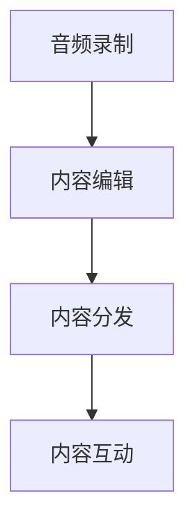

                 

# 程序员如何利用podcast进行知识传播

> 关键词：知识传播, 技术分享, podcast, 软件开发, 软件开发社区, 编码文化, 技术博客, 软件开发技巧, 软件开发工具

## 1. 背景介绍

在快速发展的IT行业，知识传播和技能分享已经成为了推动技术进步和创新不可缺少的一环。尤其是在软件开发领域，技术日新月异，新的框架、工具和编程语言层出不穷，开发者需要不断学习和适应。传统的技术文档、线上课程和线下培训虽然仍是学习的重要途径，但这些方式往往存在信息滞后、交互性差、难以即时交流等缺点。随着互联网和移动互联网的发展，一种全新的知识传播形式——podcast（播客），逐渐成为程序员分享和获取知识的重要渠道。

Podcast是一种通过网络传播的音频内容形式，通常由主播录制和发布，听众可以随时随地通过互联网收听。相比于传统媒体，Podcast更加灵活、互动性强，且易于制作和传播。程序员可以通过Podcast分享自己的开发经验、技术心得，也可以从Podcast中获取最新的技术动态和行业趋势，促进个人和团队的技术成长。

本文将详细介绍如何利用Podcast进行知识传播，包括Podcast的创建、发布和听取的流程，以及Podcast对软件开发社区和程序员职业发展的重要作用。

## 2. 核心概念与联系

为了更好地理解Podcast知识传播的原理和架构，我们需要首先了解几个核心概念：

- **Podcast**：即播客，是一种通过网络传播的音频内容形式，通常由主播录制和发布，听众可以随时随地通过互联网收听。
- **音频录制**：指通过麦克风录制音频内容的过程，包括主播的讲话、访谈、背景音效等。
- **内容编辑**：指在录制完成后对音频进行剪辑、混音、音效处理等后期工作，使音频内容更加专业和悦耳。
- **内容分发**：指将录制好的音频内容发布到各种平台，如Apple Podcasts、Spotify、Anchor等，使听众可以方便地收听。
- **内容互动**：指Podcast听众可以通过评论区、社交媒体等渠道与主播进行交流和互动，增强知识传播的效果。

这些核心概念之间存在紧密联系，共同构成了Podcast知识传播的基本框架：主播通过音频录制分享知识，内容编辑提升内容质量，内容分发扩大传播范围，而内容互动则增强了听众的参与感和满意度。以下是一个简单的Mermaid流程图，展示了这些概念之间的联系：



这个流程图展示了Podcast知识传播的基本流程：主播录制内容后，经过编辑和分发，最终与听众进行互动。这些步骤相互关联，缺一不可，共同完成了知识的有效传播。

## 3. 核心算法原理 & 具体操作步骤

### 3.1 算法原理概述

Podcast知识传播的原理是基于音频数据的处理和分发。具体来说，主播录制音频内容，通过内容编辑工具进行处理，将处理后的音频内容上传到各种Podcast平台，听众则通过平台收听。Podcast的成功传播，依赖于主播的专业知识、编辑团队的技术水平以及平台的优化算法。

### 3.2 算法步骤详解

Podcast知识传播的详细步骤包括：

1. **选题与策划**：主播需要根据自身专长和兴趣，选择适合的话题进行播客策划。选题应具有实际应用价值，能引起听众的共鸣。
2. **音频录制**：主播通过麦克风录制音频内容，注意声音清晰、语速适中、表达清晰。录制时可以考虑加入背景音乐或音效，增强听感。
3. **内容编辑**：录制完成的音频内容需要经过剪辑、混音、音效处理等后期工作，使内容更加专业和悦耳。内容编辑需要使用专业的音频编辑软件，如Audacity、Adobe Audition等。
4. **内容发布**：将编辑好的音频内容上传到Podcast平台，如Apple Podcasts、Spotify、Anchor等。平台会自动进行内容分发，使听众可以方便地收听。
5. **内容互动**：听众可以通过评论区、社交媒体等渠道与主播进行交流和互动，增强知识传播的效果。主播也需要及时回复听众的评论和问题，保持互动的连续性。

### 3.3 算法优缺点

Podcast知识传播的优点包括：

1. **灵活性强**：Podcast的录制和发布相对简单，主播可以根据时间和精力灵活安排内容制作和发布。
2. **互动性强**：主播和听众可以通过评论区、社交媒体等渠道进行实时互动，增强知识的传播效果。
3. **易于获取**：听众可以随时随地通过互联网收听Podcast，不受时间和地点的限制。

Podcast知识传播的缺点包括：

1. **技术门槛较高**：主播需要具备一定的音频录制和编辑技术，否则内容质量难以保证。
2. **传播范围有限**：虽然平台众多，但听众的聚集和传播效果仍受限于主播的影响力和内容质量。
3. **缺乏系统性**：相比传统的技术文档和线上课程，Podcast内容可能缺乏系统的知识结构和完整的学习路径。

### 3.4 算法应用领域

Podcast知识传播在软件开发领域具有广泛的应用场景，包括但不限于：

- **技术分享**：程序员可以通过Podcast分享自己的开发经验、技术心得，提升个人品牌和影响力。
- **行业趋势**：Podcast可以及时传播最新的技术动态和行业趋势，帮助开发者了解市场变化。
- **团队协作**：团队内部可以通过Podcast进行技术交流和知识共享，增强团队协作和知识传递效率。
- **教育培训**：Podcast可以作为线上课程的补充，提供更为灵活和互动的教学形式，帮助学员掌握新知识和技能。
- **职业发展**：Podcast可以帮助程序员建立专业形象，提升职业竞争力，拓展职业发展机会。

## 4. 数学模型和公式 & 详细讲解 & 举例说明

### 4.1 数学模型构建

Podcast知识传播的数学模型可以简单地描述为主播和听众之间的信息流动。假设主播为 $M$，听众为 $L$，则知识传播过程可以表示为：

$$
K = f_{\theta}(M, L)
$$

其中 $K$ 表示知识传播的效果，$f_{\theta}$ 是知识传播的函数，$\theta$ 表示模型的参数，包括主播的专业知识、内容质量和互动效果等。

### 4.2 公式推导过程

为了更直观地理解知识传播的效果，我们可以进一步构建知识传播的评估指标，如收听率、互动率、分享率等。假设一个Podcast的听众数量为 $N$，收听率为 $R$，互动率为 $I$，分享率为 $S$，则知识传播的效果可以表示为：

$$
K = R \times I \times S
$$

其中 $R$ 表示听众收听的比例，$I$ 表示听众参与互动的比例，$S$ 表示听众分享内容的比例。

### 4.3 案例分析与讲解

假设某个Podcast的听众数量为 $N=1000$，收听率为 $R=0.8$，互动率为 $I=0.2$，分享率为 $S=0.1$。根据上述公式，该Podcast的知识传播效果为：

$$
K = 0.8 \times 0.2 \times 0.1 = 0.016
$$

即每100个听众中，有1.6个人会收听、互动和分享该Podcast，这表明该Podcast在知识传播方面的效果较好，能够引起听众的共鸣和参与。

## 5. 项目实践：代码实例和详细解释说明

### 5.1 开发环境搭建

要进行Podcast知识传播，首先需要搭建一个适合音频录制和编辑的环境。以下是一些常用的开发工具和环境配置：

1. **音频录制软件**：Audacity、Adobe Audition等软件支持高质量音频录制，功能强大且易于使用。
2. **音频编辑软件**：Audacity、Adobe Audition等软件支持音频剪辑、混音、音效处理等后期工作。
3. **Podcast平台**：Apple Podcasts、Spotify、Anchor等平台支持Podcast发布和分发。
4. **音频上传工具**：Adobe Audition、FFmpeg等工具支持音频文件格式的转换和上传。

### 5.2 源代码详细实现

以下是一个简单的Podcast创建和发布的代码实现示例：

```python
import os
import pyaudio
import wave

# 音频录制
def record_audio():
    CHUNK = 1024
    FORMAT = pyaudio.paInt16
    CHANNELS = 2
    RATE = 44100
    RECORD_SECONDS = 60
    WAVE_OUTPUT_FILENAME = "output.wav"

    audio = pyaudio.PyAudio()
    stream = audio.open(format=FORMAT, channels=CHANNELS, rate=RATE, input=True, frames_per_buffer=CHUNK)

    frames = []

    print("Recording...")

    for _ in range(0, int(RATE / CHUNK * RECORD_SECONDS)):
        data = stream.read(CHUNK)
        frames.append(data)

    print("Recording Complete")

    stream.stop_stream()
    stream.close()
    audio.terminate()

    # 音频保存
    wf = wave.open(WAVE_OUTPUT_FILENAME, 'wb')
    wf.setnchannels(CHANNELS)
    wf.setsampwidth(audio.get_sample_size(FORMAT))
    wf.setframerate(RATE)
    wf.writeframes(b''.join(frames))
    wf.close()

record_audio()
```

以上代码使用PyAudio库实现音频录制，并通过Wave文件保存音频文件。

### 5.3 代码解读与分析

**录音函数**：
- 使用PyAudio库打开音频输入流，配置音频参数。
- 循环读取音频数据，并将其保存在列表中。
- 在录制完成后关闭音频流和PyAudio对象，保存音频文件。

**音频编辑**：
音频编辑可以使用Audacity等工具进行剪辑、混音、音效处理等操作。以下是一个简单的音频编辑示例：

1. 打开Audacity，导入录制好的音频文件。
2. 进行剪辑，去掉开头和结尾的噪音部分。
3. 添加背景音乐和音效，增强听感。
4. 进行混音，调整各音频轨道的音量和位置。
5. 导出编辑好的音频文件，保存为WAV格式。

**内容分发**：
Podcast的内容分发可以通过Apple Podcasts、Spotify、Anchor等平台进行。以下是Apple Podcasts平台的内容发布示例：

1. 登录Apple Podcasts平台，创建新的Podcast。
2. 上传编辑好的音频文件。
3. 配置Podcast的元数据，如标题、描述、封面图等。
4. 发布Podcast，使其在平台上公开可见。

## 6. 实际应用场景

Podcast知识传播在软件开发领域具有广泛的应用场景，以下是几个典型的实际应用场景：

### 6.1 技术分享

许多技术博客和线上课程的作者，往往会通过Podcast分享自己的技术心得和经验。这种方式更加灵活、互动性强，能够吸引更多听众的关注和参与。例如，著名的“Runtime Podcast” 就是一个专注于Java和Java虚拟机技术分享的Podcast，吸引了大量的技术爱好者和从业者。

### 6.2 行业趋势

Podcast可以及时传播最新的技术动态和行业趋势，帮助开发者了解市场变化。例如，“Programming Throwdown”是一个专注于软件开发和计算机科学的Podcast，邀请多位行业专家和开发者分享最新的技术进展和行业趋势。

### 6.3 团队协作

团队内部可以通过Podcast进行技术交流和知识共享，增强团队协作和知识传递效率。例如，“The Morning Brew”是一个专注于软件开发和IT行业的Podcast，邀请团队成员分享各自的技术心得和项目经验，促进团队内部知识共享和交流。

### 6.4 教育培训

Podcast可以作为线上课程的补充，提供更为灵活和互动的教学形式，帮助学员掌握新知识和技能。例如，“The Code Interview”是一个专注于软件开发面试的Podcast，邀请多位开发者分享面试技巧和编程经验，帮助学员提高面试成功率。

### 6.5 职业发展

Podcast可以帮助程序员建立专业形象，提升职业竞争力，拓展职业发展机会。例如，“Full Stack Radio”是一个专注于全栈开发技术的Podcast，邀请多位开发者分享自己的职业发展经历和技术心得，帮助听众在职业道路上取得更好的成绩。

## 7. 工具和资源推荐

### 7.1 学习资源推荐

为了帮助开发者系统掌握Podcast知识传播的理论基础和实践技巧，这里推荐一些优质的学习资源：

1. **《Podcasting for Journalists》**：由IBM的Podcast专家撰写，介绍了Podcast的基本概念、制作流程和发布策略，适合初学者入门。
2. **《Podcast Show Hosting: Crafting and Launching Your Podcast》**：由Podcast行业的资深专家撰写，介绍了Podcast的制作、发布和运营策略，适合希望提升Podcast质量的主播。
3. **《The Podcast Hosting Guide》**：由Podcast平台Anchor提供，介绍了Podcast的基本制作流程和发布策略，适合希望快速上手Podcast的主播。
4. **《Podcast Academy》**：由Apple Podcasts提供，提供了Podcast制作和发布的详细教程和指南，适合希望提升Podcast质量的主播。

### 7.2 开发工具推荐

Podcast知识传播的开发工具包括音频录制和编辑软件、Podcast平台等。以下是一些常用的开发工具：

1. **音频录制软件**：Audacity、Adobe Audition等软件支持高质量音频录制，功能强大且易于使用。
2. **音频编辑软件**：Audacity、Adobe Audition等软件支持音频剪辑、混音、音效处理等后期工作。
3. **Podcast平台**：Apple Podcasts、Spotify、Anchor等平台支持Podcast发布和分发。
4. **音频上传工具**：Adobe Audition、FFmpeg等工具支持音频文件格式的转换和上传。

### 7.3 相关论文推荐

Podcast知识传播的研究涉及音频处理、内容分析、平台优化等多个领域，以下是几篇相关论文，推荐阅读：

1. **《Podcast Analytics and Insights》**：介绍Podcast数据分析和洞察，帮助主播了解听众的行为和偏好，优化内容制作和发布策略。
2. **《Audio Tagging for Podcast Discovery》**：介绍音频标签和分类技术，帮助听众通过关键词和标签发现和收听感兴趣的内容。
3. **《Interactive Podcast Systems: A Survey》**：介绍交互式Podcast系统和技术，帮助主播和听众进行实时互动和交流，增强知识传播效果。

## 8. 总结：未来发展趋势与挑战

### 8.1 总结

本文对Podcast知识传播的原理和实践进行了全面系统的介绍。Podcast通过音频录制、内容编辑和分发等步骤，实现了知识的高效传播和互动。主播可以通过Podcast分享自己的技术心得和经验，听众也可以通过Podcast获取最新的技术动态和行业趋势。Podcast在软件开发社区和程序员职业发展中扮演着越来越重要的角色，成为知识和技能的分享平台。

通过本文的系统梳理，可以看到Podcast知识传播的广泛应用前景和强大影响力。Podcast不仅能够促进个人和团队的技术成长，还能加速技术知识的传播和扩散，推动整个行业的进步和发展。未来，Podcast知识传播还将与更多技术和平台进行深度融合，带来更多的创新和突破。

### 8.2 未来发展趋势

展望未来，Podcast知识传播将呈现以下几个发展趋势：

1. **多样化内容**：Podcast内容将更加多样化，涵盖更多的技术领域和行业趋势，满足不同听众的需求。
2. **交互式体验**：Podcast将引入更多的交互式元素，如实时问答、互动投票等，增强听众的参与感和满意度。
3. **跨平台集成**：Podcast平台将与更多技术平台进行集成，如智能音箱、视频平台等，提供更丰富的听讲体验。
4. **个性化推荐**：通过数据分析和机器学习技术，Podcast平台将能够提供个性化的内容推荐，帮助听众发现和收听感兴趣的内容。
5. **视频和音频结合**：Podcast将融合视频和音频内容，提供更加直观和丰富的听讲体验。

这些趋势将进一步推动Podcast知识传播的发展，使其成为更加高效、灵活和互动的知识传播形式。

### 8.3 面临的挑战

尽管Podcast知识传播已经取得了显著成果，但在迈向更加智能化、普适化应用的过程中，它仍面临诸多挑战：

1. **技术门槛较高**：Podcast的制作和发布需要一定的技术和设备支持，门槛较高，可能限制一些主播的参与。
2. **内容质量参差不齐**：由于缺乏统一的标准和规范，Podcast内容质量参差不齐，难以保证听众的收听体验。
3. **平台碎片化**：不同的Podcast平台之间的数据和内容互操作性较低，听众可能需要注册多个平台才能收听感兴趣的内容。
4. **听众注意力分散**：互联网时代，听众的注意力分散，难以集中精力收听完整的Podcast内容。

### 8.4 研究展望

面对Podcast知识传播所面临的挑战，未来的研究需要在以下几个方面寻求新的突破：

1. **降低技术门槛**：开发更加易用的音频录制和编辑工具，降低Podcast的制作门槛，吸引更多主播参与。
2. **统一标准和规范**：制定统一的Podcast制作和发布标准，提高内容质量和可操作性。
3. **跨平台集成**：推动Podcast平台之间的数据和内容互操作性，增强听众的使用体验。
4. **内容推荐算法**：开发智能化的内容推荐算法，帮助听众发现和收听感兴趣的内容。
5. **交互式技术**：引入更多的交互式元素，如实时问答、互动投票等，增强听众的参与感和满意度。

这些研究方向将推动Podcast知识传播技术的进一步发展，使其成为更加高效、灵活和互动的知识传播形式，为软件开发社区和程序员职业发展提供更广阔的平台。

## 9. 附录：常见问题与解答

**Q1: 如何提高Podcast的听讲率？**

A: 提高Podcast的听讲率需要从多个方面入手：
1. 内容质量：主播应提供高质量的内容，具有实际应用价值，能够引起听众的共鸣。
2. 听众互动：主播应鼓励听众通过评论区、社交媒体等渠道进行交流和互动，增强听众的参与感。
3. 内容预告：主播应提前预告下一期内容，吸引听众的注意力。
4. 个性化推荐：平台应提供个性化的内容推荐，帮助听众发现和收听感兴趣的内容。

**Q2: 如何选择适合的Podcast平台？**

A: 选择适合的Podcast平台应考虑以下几个因素：
1. 平台用户规模：选择用户规模较大的平台，可以获取更多的曝光和听众。
2. 平台功能：选择功能完善、操作便捷的平台，如Apple Podcasts、Spotify等。
3. 平台费用：选择费用合理、性价比高的平台，如Anchor等。
4. 平台支持：选择支持多种音频格式和发布的平台，如Apple Podcasts、Spotify等。

**Q3: 如何优化Podcast的音频质量？**

A: 优化Podcast的音频质量可以从以下几个方面入手：
1. 使用高质量的音频录制设备，如麦克风、录音棚等。
2. 使用专业的音频编辑软件，如Audacity、Adobe Audition等，进行剪辑、混音、音效处理等后期工作。
3. 进行多次试听和调整，确保音频清晰、流畅、悦耳。

**Q4: 如何推广Podcast？**

A: 推广Podcast可以通过以下几个渠道：
1. 社交媒体：通过Twitter、Facebook等社交媒体平台宣传Podcast。
2. 合作推广：与其他Podcast或技术博客进行合作，互相推广。
3. 内容营销：通过撰写技术博客、分享Podcast内容等方式，吸引更多的听众。
4. 听众互动：通过评论区、社交媒体等渠道与听众互动，增强听众的参与感。

通过以上问题与解答，我们看到了Podcast知识传播的广泛应用前景和强大影响力。随着技术的不断进步和应用的深入，Podcast必将在软件开发社区和程序员职业发展中扮演更加重要的角色。

