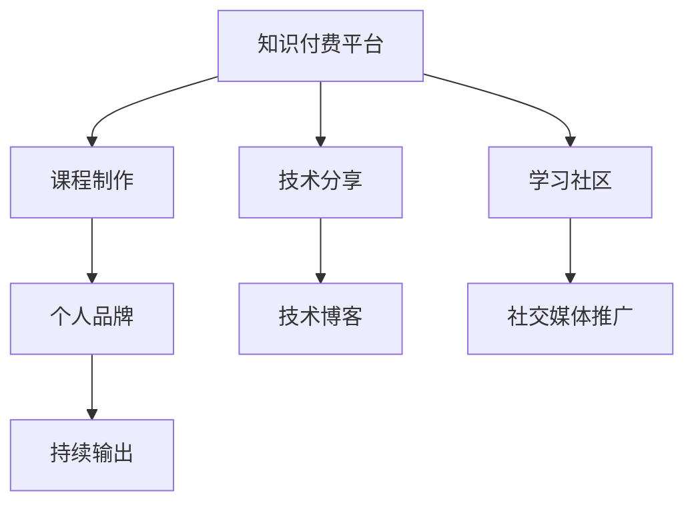

                 

# 程序员如何利用知识付费打造个人品牌

> 关键词：程序员，知识付费，个人品牌，技术分享，学习社区，专业影响力，在线课程，博客写作，SEO优化

## 1. 背景介绍

### 1.1 问题由来

随着互联网的快速发展，信息技术在各个行业中的应用日益普及，越来越多的企业开始重视对信息技术专业人才的培养和需求。然而，优秀的技术人才却相对稀缺，培养周期长、成本高，且难以找到具有实际经验的导师。在这样的背景下，知识付费应运而生，并迅速成为一种流行的学习方式。

知识付费平台为程序员提供了一个展示自己专业技能和经验的机会，使他们能够通过提供高质量的课程和内容获得收入，提升自己在行业中的知名度和影响力，进而打造个人品牌。本文将从多个角度探讨如何利用知识付费打造个人品牌，帮助程序员实现职业发展和生活改善的双重目标。

### 1.2 问题核心关键点

知识付费的核心在于知识的传播和共享，使得知识的价值得以充分发挥。知识付费的成功与否，依赖于个人品牌的影响力和课程内容的优质程度。本文将从以下几方面阐述如何利用知识付费打造个人品牌：

- 选择合适的知识付费平台
- 确定自己的专业方向
- 制作高质量的课程内容
- 利用社交媒体和社区推广课程
- 通过持续输出建立专业影响力

## 2. 核心概念与联系

### 2.1 核心概念概述

在探讨如何利用知识付费打造个人品牌之前，我们先了解一些核心概念及其联系：

- **知识付费**：通过付费的方式获取专业知识和信息，而不是免费获取。知识付费平台如Udemy、Coursera、知乎live等。
- **个人品牌**：个人在特定领域内的知名度和影响力，通常通过课程内容、技术博客、社交媒体等途径建立。
- **技术分享**：将个人的技术经验、知识、技能等内容分享给他人，建立信任和认可。
- **学习社区**：由一群对特定技术或领域感兴趣的人组成的网络，通常借助知识付费平台、博客、论坛等形式聚集。

### 2.2 核心概念原理和架构的 Mermaid 流程图(Mermaid 流程节点中不要有括号、逗号等特殊字符)



这个流程图展示了知识付费、技术分享、学习社区与个人品牌之间的关系：

1. 知识付费平台为技术分享者提供展示和变现的渠道。
2. 技术分享者通过创建高质量的课程内容，提升自己在特定领域的知名度。
3. 学习社区为技术分享者提供了与用户互动的机会，增强信任和影响力。
4. 持续的输出和技术分享，进一步强化个人品牌。

## 3. 核心算法原理 & 具体操作步骤

### 3.1 算法原理概述

知识付费的实施过程涉及到算法原理和具体操作步骤，具体如下：

1. **算法原理**：通过数据分析、推荐算法、定价策略等算法手段，知识付费平台能够将高质量的内容推荐给潜在用户，并通过合理的定价策略吸引用户购买。

2. **操作步骤**：
   - **内容创作**：制作并上传高质量的课程内容，包括课程大纲、视频讲解、习题测试等。
   - **平台选择**：选择合适的知识付费平台，根据自身的专业方向和目标用户群体选择合适的平台。
   - **营销推广**：通过社交媒体、社区、博客等渠道进行课程推广，吸引潜在用户。
   - **用户互动**：在平台上与用户互动，回答用户提问，增加用户粘性。
   - **持续输出**：定期更新课程内容，参与技术社区的讨论，保持技术和知识的前沿性。

### 3.2 算法步骤详解

以下是知识付费过程中的详细操作步骤：

#### 3.2.1 内容创作

1. **确定课程大纲**：
   - 根据自身的专业知识和经验，确定课程的核心内容，并制定详细的课程大纲。
   - 将课程内容分为若干章节，每章设置具体学习目标和知识点。
2. **制作课程视频**：
   - 录制课程讲解视频，注意语言清晰、内容丰富，确保能够解答用户的疑问。
   - 视频可以结合案例、代码、演示等方式，帮助用户更好地理解知识点。
3. **编写习题测试**：
   - 设计合理的习题测试，确保用户能够通过实际操作加深对知识的理解。
   - 测试可以包括选择题、编程题、项目实践等形式。

#### 3.2.2 平台选择

1. **调研知识付费平台**：
   - 了解不同知识付费平台的优势和劣势，如Udemy、Coursera、知乎live等。
   - 根据平台的用户群体和定价策略，选择最适合自己的平台。
2. **创建课程**：
   - 在平台注册账号，创建课程，填写课程名称、简介、定价等信息。
   - 上传视频、PPT、习题测试等课程资料。

#### 3.2.3 营销推广

1. **社交媒体推广**：
   - 在微博、微信、LinkedIn等社交媒体上发布课程信息，吸引关注。
   - 利用社交媒体平台的广告功能，定向推广课程给潜在用户。
2. **博客写作**：
   - 在技术博客或个人网站上发布课程内容摘要和技术分享，吸引用户点击访问。
   - 通过SEO优化，提升博客的搜索排名，增加曝光度。

#### 3.2.4 用户互动

1. **回答用户提问**：
   - 在课程发布后，积极在平台上的评论区回答用户的问题，解决他们的疑惑。
   - 定期进行直播，与用户互动，增加用户粘性。
2. **收集用户反馈**：
   - 收集用户对课程内容的反馈，根据反馈不断优化课程内容。
   - 通过用户反馈，了解用户需求，调整课程内容和教学方式。

#### 3.2.5 持续输出

1. **定期更新课程**：
   - 根据技术的发展和用户的需求，定期更新课程内容，保持课程的时效性。
   - 结合新技术和新知识，不断丰富课程内容，增加课程吸引力。
2. **参与技术社区**：
   - 在技术论坛、GitHub、Stack Overflow等社区积极参与讨论，分享自己的技术经验。
   - 通过在社区中的活跃表现，提升个人影响力。

### 3.3 算法优缺点

#### 3.3.1 优点

- **变现能力强**：通过知识付费，程序员能够快速获得收入，提升生活品质。
- **提升知名度**：高质量的课程内容和持续的输出，能够吸引更多用户关注，提升自身在技术领域的知名度。
- **知识共享**：通过课程分享自己的技术经验，帮助他人学习，建立信任和认可。

#### 3.3.2 缺点

- **制作成本高**：制作高质量的课程需要大量的时间和精力，需要投入较多的成本。
- **竞争激烈**：知识付费市场竞争激烈，需要不断创新和改进课程内容才能保持竞争力。
- **知识更新快**：技术更新快，课程需要定期更新，才能保持课程的先进性和实用性。

### 3.4 算法应用领域

知识付费和课程制作技术广泛应用于以下几个领域：

- **软件开发**：Java、Python、C++等编程语言课程。
- **数据科学**：数据挖掘、机器学习、大数据等技术课程。
- **网络安全**：网络安全基础、渗透测试、漏洞利用等课程。
- **人工智能**：深度学习、自然语言处理、计算机视觉等技术课程。
- **云计算**：云计算基础、云架构、云开发等课程。

## 4. 数学模型和公式 & 详细讲解 & 举例说明

### 4.1 数学模型构建

在知识付费和课程制作过程中，涉及到数学模型和公式的应用，主要包括以下几个方面：

1. **课程定价模型**：
   - **动态定价模型**：根据市场需求、竞争情况、课程内容等因素，动态调整课程价格。
   - **收益预测模型**：预测课程的销售量和收益，为定价策略提供依据。

2. **推荐算法**：
   - **协同过滤算法**：通过用户行为数据，推荐相似用户喜欢的课程。
   - **内容推荐算法**：根据课程内容、用户评价等信息，推荐给感兴趣的用户。

3. **用户互动模型**：
   - **用户反馈模型**：通过分析用户评论、评分等数据，评估课程质量。
   - **用户活跃度模型**：预测用户在平台上的活跃度，提高课程销售量。

### 4.2 公式推导过程

以下是一些典型的数学模型和公式推导过程：

#### 4.2.1 动态定价模型

1. **市场需求分析**：
   - 分析市场需求量，预测未来市场需求变化。
   - 市场需求量可以用以下公式表示：
     \[
     d(t) = \alpha + \beta f(t) + \gamma g(t)
     \]
    其中 \(d(t)\) 表示在时间 \(t\) 时的市场需求量，\(\alpha\) 为常数项，\(\beta\) 为市场趋势系数，\(f(t)\) 表示市场趋势变化，\(\gamma\) 为市场波动系数，\(g(t)\) 表示市场波动因素。

2. **竞争情况分析**：
   - 分析竞争对手的定价策略，评估其市场份额和影响。
   - 使用以下公式表示竞争对手的市场份额：
     \[
     S_i(t) = \frac{C_i(t)}{C_0(t)}
     \]
     其中 \(S_i(t)\) 表示在时间 \(t\) 时第 \(i\) 个竞争对手的市场份额，\(C_i(t)\) 表示第 \(i\) 个竞争对手的课程销售量，\(C_0(t)\) 表示市场总销售量。

3. **课程内容评估**：
   - 评估课程内容的质量和深度，使用以下公式表示课程评分：
     \[
     C(t) = \frac{\sum_{i=1}^N r_i(t)}{N}
     \]
     其中 \(C(t)\) 表示在时间 \(t\) 时的课程评分，\(r_i(t)\) 表示第 \(i\) 个用户对课程的评分。

#### 4.2.2 协同过滤算法

1. **用户兴趣模型**：
   - 通过分析用户的历史行为，建立用户兴趣模型。
   - 使用以下公式表示用户对课程的兴趣评分：
     \[
     \hat{r}_{ui}(t) = \hat{\alpha} + \hat{\beta} \sum_{j=1}^{M} \frac{(r_{uj}(t) - \hat{r}_{uj}(t)) (r_{ij}(t) - \hat{r}_{ij}(t))}
     {\sum_{k=1}^{M} (r_{uk}(t) - \hat{r}_{uk}(t))^2}
     \]
     其中 \(\hat{r}_{ui}(t)\) 表示用户 \(u\) 对课程 \(i\) 的预测评分，\(r_{ui}(t)\) 表示用户 \(u\) 对课程 \(i\) 的实际评分，\(\hat{\alpha}\) 和 \(\hat{\beta}\) 为回归系数，\(r_{uj}(t)\) 表示用户 \(u\) 对课程 \(j\) 的评分，\(r_{ij}(t)\) 表示课程 \(i\) 对用户 \(j\) 的评分。

2. **课程推荐模型**：
   - 使用用户兴趣模型，推荐用户感兴趣的其他课程。
   - 使用以下公式表示课程推荐分数：
     \[
     P_i(t) = \frac{\sum_{j=1}^{M} w_j(t) \hat{r}_{ij}(t)}
     {\sqrt{\sum_{j=1}^{M} w_j(t)^2} + \epsilon}
     \]
     其中 \(P_i(t)\) 表示课程 \(i\) 在时间 \(t\) 的推荐分数，\(w_j(t)\) 表示用户 \(j\) 的兴趣权重，\(\epsilon\) 为正则化参数。

### 4.3 案例分析与讲解

#### 4.3.1 案例一：Java编程课程

1. **市场需求分析**：
   - 分析Java编程课程的市场需求，预测未来市场需求变化。
   - 根据市场需求分析结果，动态调整课程价格。

2. **竞争情况分析**：
   - 分析其他Java编程课程的定价策略，评估市场份额和影响。
   - 根据竞争对手的市场份额和定价策略，调整自身的定价策略。

3. **课程内容评估**：
   - 评估课程内容的质量和深度，使用用户评分作为评估依据。
   - 根据用户评分，不断优化课程内容和教学方式。

#### 4.3.2 案例二：数据科学课程

1. **市场需求分析**：
   - 分析数据科学课程的市场需求，预测未来市场需求变化。
   - 根据市场需求分析结果，动态调整课程价格。

2. **竞争情况分析**：
   - 分析其他数据科学课程的定价策略，评估市场份额和影响。
   - 根据竞争对手的市场份额和定价策略，调整自身的定价策略。

3. **课程内容评估**：
   - 评估课程内容的质量和深度，使用用户评分作为评估依据。
   - 根据用户评分，不断优化课程内容和教学方式。

## 5. 项目实践：代码实例和详细解释说明

### 5.1 开发环境搭建

在进行知识付费和课程制作实践前，我们需要准备好开发环境。以下是使用Python进行知识付费平台开发的常见环境配置流程：

1. **安装Python和相关库**：
   - 安装Python 3.6及以上版本，推荐使用Anaconda创建虚拟环境。
   - 使用pip安装相关的Python库，如Flask、SQLAlchemy、TensorFlow等。

2. **创建虚拟环境**：
   - 使用Anaconda创建虚拟环境，例如：
     \[
     conda create -n course-env python=3.8
     \]
   - 激活虚拟环境：
     \[
     conda activate course-env
     \]

3. **安装知识付费平台所需库**：
   - 安装Flask库，用于搭建Web应用。
   - 安装SQLAlchemy库，用于数据库操作。
   - 安装TensorFlow库，用于课程内容的展示和交互。

### 5.2 源代码详细实现

以下是使用Python和Flask框架搭建知识付费平台的代码实现：

#### 5.2.1 创建Flask应用

```python
from flask import Flask, render_template, request, redirect, url_for

app = Flask(__name__)

@app.route('/')
def index():
    return render_template('index.html')

@app.route('/login', methods=['GET', 'POST'])
def login():
    if request.method == 'POST':
        # 处理登录请求
        pass
    return render_template('login.html')

@app.route('/courses')
def courses():
    # 从数据库查询课程列表
    courses = db.session.query(Course).all()
    return render_template('courses.html', courses=courses)

@app.route('/course/<id>')
def course(id):
    # 从数据库查询指定课程的详细信息
    course = db.session.query(Course).filter_by(id=id).first()
    return render_template('course.html', course=course)

@app.route('/register', methods=['GET', 'POST'])
def register():
    if request.method == 'POST':
        # 处理注册请求
        pass
    return render_template('register.html')

@app.route('/submit_review', methods=['POST'])
def submit_review():
    # 处理用户提交的课程评价请求
    pass

@app.route('/user/<id>')
def user(id):
    # 从数据库查询指定用户的详细信息
    user = db.session.query(User).filter_by(id=id).first()
    return render_template('user.html', user=user)
```

#### 5.2.2 创建数据库模型

```python
from flask_sqlalchemy import SQLAlchemy

db = SQLAlchemy(app)

class User(db.Model):
    id = db.Column(db.Integer, primary_key=True)
    username = db.Column(db.String(80), unique=True, nullable=False)
    password = db.Column(db.String(120), nullable=False)

class Course(db.Model):
    id = db.Column(db.Integer, primary_key=True)
    name = db.Column(db.String(80), nullable=False)
    description = db.Column(db.Text, nullable=False)
    price = db.Column(db.Float, nullable=False)
    user_id = db.Column(db.Integer, db.ForeignKey('user.id'), nullable=False)

class Review(db.Model):
    id = db.Column(db.Integer, primary_key=True)
    course_id = db.Column(db.Integer, db.ForeignKey('course.id'), nullable=False)
    user_id = db.Column(db.Integer, db.ForeignKey('user.id'), nullable=False)
    rating = db.Column(db.Float, nullable=False)
    comment = db.Column(db.Text, nullable=False)
```

#### 5.2.3 创建课程界面

```html
<!-- index.html -->
<!DOCTYPE html>
<html>
<head>
    <title>Course Platform</title>
</head>
<body>
    <h1>Welcome to our Course Platform</h1>
    <ul>
        
            <li><a href="{{ url_for('course', id=course.id) }}">{{ course.name }}</a></li>
        
    </ul>
    <form action="{{ url_for('register') }}" method="post">
        <input type="text" name="username" placeholder="Username">
        <input type="password" name="password" placeholder="Password">
        <input type="submit" value="Register">
    </form>
</body>
</html>
```

#### 5.2.4 创建课程详情界面

```html
<!-- course.html -->
<!DOCTYPE html>
<html>
<head>
    <title>{{ course.name }}</title>
</head>
<body>
    <h1>{{ course.name }}</h1>
    <p>{{ course.description }}</p>
    <h2>Price</h2>
    <p>${{ course.price }}</p>
    <h2>Reviews</h2>
    
        <p>{{ review.user.username }}: {{ review.rating }} - {{ review.comment }}</p>
    
    <form action="{{ url_for('submit_review') }}" method="post">
        <input type="text" name="username" placeholder="Username">
        <input type="text" name="rating" placeholder="Rating">
        <textarea name="comment" placeholder="Comment"></textarea>
        <input type="submit" value="Submit Review">
    </form>
    <a href="{{ url_for('user', id=course.user_id) }}">Course Instructor</a>
</body>
</html>
```

#### 5.2.5 创建用户界面

```html
<!-- user.html -->
<!DOCTYPE html>
<html>
<head>
    <title>{{ user.username }}</title>
</head>
<body>
    <h1>{{ user.username }}</h1>
    
        <h2>{{ course.name }}</h2>
        <p>${{ course.price }}</p>
        <p>Reviews</p>
        
            <p>{{ review.user.username }}: {{ review.rating }} - {{ review.comment }}</p>
        
    
    <a href="{{ url_for('logout') }}">Logout</a>
</body>
</html>
```

### 5.3 代码解读与分析

#### 5.3.1 Flask应用解析

1. **创建Flask应用**：
   - 通过Flask应用创建路由，用于处理用户请求。
   - 使用`render_template`函数渲染页面模板，显示给用户。

2. **用户管理**：
   - 用户注册、登录、注销等功能通过`/login`、`/register`、`/logout`等路由实现。
   - 用户课程管理、课程评价等功能通过`/user`、`/course`等路由实现。

3. **课程管理**：
   - 课程列表、课程详情、课程评价等功能通过`/courses`、`/course/<id>`等路由实现。

#### 5.3.2 数据库模型解析

1. **User模型**：
   - 用户信息存储在数据库中，包括用户名和密码。
   - 使用`db.Model`继承关系，实现数据库操作。

2. **Course模型**：
   - 课程信息存储在数据库中，包括课程名称、描述、价格、创建者等信息。
   - 使用`db.Model`继承关系，实现数据库操作。

3. **Review模型**：
   - 用户课程评价存储在数据库中，包括评价评分、评价内容、用户信息、课程信息等。
   - 使用`db.Model`继承关系，实现数据库操作。

### 5.4 运行结果展示

运行Flask应用后，可以在浏览器中访问`http://localhost:5000`，查看课程列表、课程详情、用户管理等功能。通过此代码实例，展示了知识付费平台的基本功能实现。

## 6. 实际应用场景

### 6.1 智能招聘

1. **背景**：
   - 招聘企业需要筛选大量的求职者简历，工作量巨大。
   - 需要一种高效、准确的筛选方式，缩短招聘周期。

2. **应用**：
   - 程序员通过知识付费平台发布招聘课程，传授招聘技巧和面试经验。
   - 求职者可以购买课程，提升自身竞争力，增加求职成功的概率。
   - 企业可以采用推荐算法，根据求职者的课程学习情况，筛选出最合适的候选人。

### 6.2 在线教育

1. **背景**：
   - 在线教育市场迅速发展，用户对高质量课程的需求日益增加。
   - 在线教育平台需要不断引入优质的课程内容，提升用户满意度。

2. **应用**：
   - 程序员通过知识付费平台发布高质量的课程内容，吸引用户购买。
   - 平台通过推荐算法，将用户感兴趣的课程推荐给潜在用户。
   - 用户通过课程学习，提升自身技能，进入更好的职业发展阶段。

### 6.3 技术咨询

1. **背景**：
   - 企业需要快速解决技术问题，寻求专业人员的帮助。
   - 传统咨询方式成本高、效率低，难以满足企业需求。

2. **应用**：
   - 程序员通过知识付费平台提供技术咨询服务，收取服务费用。
   - 企业可以在平台上寻找合适的技术顾问，快速解决问题。
   - 平台通过用户评价，为技术顾问建立信誉，增加用户信任。

### 6.4 未来应用展望

1. **内容多样化**：
   - 未来的知识付费平台将提供更多类型的课程内容，如编程、设计、营销等。
   - 课程形式也将更加丰富，包括视频、文本、代码等。

2. **交互性增强**：
   - 平台将增加互动性，如在线问答、代码协作、实时演示等。
   - 用户可以通过互动，更加深入地学习课程内容。

3. **技术集成**：
   - 平台将集成更多技术工具，如GitHub、Jupyter Notebook等。
   - 用户可以通过集成工具，更好地完成课程项目和实践。

4. **数据驱动**：
   - 平台将更加注重数据驱动，通过数据分析优化课程内容和推荐算法。
   - 通过用户行为数据，提升用户体验和课程质量。

## 7. 工具和资源推荐

### 7.1 学习资源推荐

为了帮助程序员系统掌握知识付费和课程制作的技术，这里推荐一些优质的学习资源：

1. **Udemy**：全球最大的在线课程平台之一，提供大量高质量的编程和IT课程。
2. **Coursera**：全球知名的在线教育平台，与世界顶尖大学和公司合作，提供各类课程。
3. **edX**：由麻省理工学院和哈佛大学等顶尖学府创办的在线学习平台，提供各类课程和专业认证。
4. **LinkedIn Learning**：全球最大的职业发展平台之一，提供各类IT课程和认证。
5. **Kaggle**：数据科学和机器学习领域的领先平台，提供大量开源数据集和竞赛项目。
6. **Stack Overflow**：全球最大的技术问答社区，提供各类编程问题的解答和讨论。

### 7.2 开发工具推荐

为了提高知识付费平台的开发效率，以下是一些常用的开发工具：

1. **Flask**：轻量级的Web框架，适合开发小型应用。
2. **SQLAlchemy**：Python的ORM工具，方便进行数据库操作。
3. **TensorFlow**：流行的机器学习框架，适合开发课程推荐等复杂应用。
4. **Scikit-learn**：Python的机器学习库，提供各类经典机器学习算法。
5. **Jupyter Notebook**：交互式编程环境，方便进行代码调试和数据分析。
6. **GitHub**：全球最大的代码托管平台，方便进行代码版本控制和协作开发。

### 7.3 相关论文推荐

知识付费和课程制作技术的发展离不开学界的持续研究。以下是几篇奠基性的相关论文，推荐阅读：

1. **Pattern of Use for Online Learning**：研究在线学习平台的趋势和用户行为。
2. **Online Learning Platforms: From Commercial to Institutional Use**：分析在线学习平台的发展历程和应用前景。
3. **Sustainable Pedagogy in Online Learning**：探讨在线学习平台的教学模式和可持续性。
4. **A Survey of Online Learning and e-Learning**：综述在线学习平台的发展现状和应用前景。
5. **Design and Evaluation of Online Learning Platforms**：设计并评估在线学习平台，提供可行的解决方案。

## 8. 总结：未来发展趋势与挑战

### 8.1 总结

本文对知识付费和课程制作技术的实施过程进行了详细探讨。通过系统介绍知识付费平台的基本功能，以及如何利用平台进行内容创作和用户管理，帮助程序员通过知识付费实现个人品牌的打造。

### 8.2 未来发展趋势

1. **技术进步**：
   - 未来知识付费平台将借助AI和大数据技术，提升内容推荐和用户管理的智能化水平。
   - 利用自然语言处理和机器学习技术，实现更加精准的课程推荐和用户画像分析。

2. **内容丰富化**：
   - 知识付费平台将提供更多类型的课程内容，涵盖更多领域和技能。
   - 课程形式也将更加多样化，结合视频、文本、代码等多种形式。

3. **用户体验优化**：
   - 平台将更加注重用户体验，通过互动性、个性化、可视化的方式提升用户满意度。
   - 通过数据分析，不断优化课程内容和推荐算法，提高用户转化率。

### 8.3 面临的挑战

1. **用户获取成本高**：
   - 知识付费平台需要投入大量的推广和营销费用，获取更多用户。
   - 用户获取成本高，平台需要找到更加高效的用户获取方式。

2. **课程质量参差不齐**：
   - 目前市场上存在大量低质量课程，用户难以选择优质的课程。
   - 平台需要建立课程质量评估机制，筛选高质量课程内容。

3. **竞争激烈**：
   - 知识付费市场竞争激烈，平台需要不断创新和改进，才能保持竞争力。
   - 课程内容需要紧跟技术发展趋势，不断更新和优化。

4. **用户粘性不足**：
   - 用户对知识付费平台的粘性不足，需要提供更多互动和奖励机制，增加用户粘性。
   - 平台需要设计更好的用户激励机制，提升用户活跃度。

### 8.4 研究展望

未来的知识付费和课程制作技术将继续发展，以下是几个潜在的研究方向：

1. **个性化推荐系统**：
   - 利用机器学习和数据挖掘技术，设计更加智能的推荐系统，提升用户满意度。
   - 通过用户行为数据和课程特征，实现精准的课程推荐。

2. **多模态课程内容**：
   - 结合文本、视频、代码等多模态内容，提升课程内容的丰富性和互动性。
   - 通过多模态学习，提升用户的学习效果和理解深度。

3. **用户行为分析**：
   - 通过数据分析和行为挖掘，提升用户画像分析的准确性和智能化水平。
   - 通过用户行为数据，优化课程推荐和内容定制。

4. **课程质量控制**：
   - 建立课程质量评估机制，筛选高质量的课程内容。
   - 利用用户评价和反馈，不断优化课程内容，提高课程质量。

5. **社交互动功能**：
   - 设计更加丰富的社交互动功能，增加用户间的交流和学习。
   - 通过社区讨论和协作，提升用户的学习效果和课程质量。

这些研究方向将推动知识付费和课程制作技术的发展，为用户提供更加优质和高效的学习体验。未来的知识付费市场将充满更多创新和机会，为程序员提供更多的职业发展机会和生活改善空间。

## 9. 附录：常见问题与解答

**Q1: 知识付费平台的盈利模式有哪些？**

A: 知识付费平台的盈利模式主要包括以下几种：
1. **课程销售**：通过销售课程获得收入。
2. **广告收入**：通过平台广告获得收益。
3. **会员收费**：提供会员特权，通过会员收费获得收入。
4. **企业合作**：与企业合作，提供定制化课程和咨询服务。

**Q2: 如何选择合适的知识付费平台？**

A: 选择知识付费平台时，需要考虑以下几个方面：
1. **平台知名度和用户数量**：选择知名度高、用户数量多的平台，吸引更多用户。
2. **平台功能和技术支持**：平台应提供丰富的课程管理、用户管理、数据分析等功能，技术支持稳定可靠。
3. **平台收费标准**：平台收费应合理透明，避免高额抽成和隐藏费用。
4. **平台推广和营销支持**：平台应提供推广和营销支持，帮助课程内容更快传播。

**Q3: 如何提高课程质量和用户满意度？**

A: 提高课程质量和用户满意度需要从以下几个方面入手：
1. **课程内容设计**：课程内容应紧跟技术发展趋势，深入浅出，易于理解。
2. **互动性增强**：增加互动性和实践环节，帮助用户更好地理解课程内容。
3. **用户反馈收集**：定期收集用户反馈，不断优化课程内容和技术支持。
4. **优质导师引入**：引入具有丰富经验和良好口碑的导师，提升课程质量和用户信任度。

**Q4: 知识付费平台的数据安全问题如何解决？**

A: 解决知识付费平台的数据安全问题需要从以下几个方面入手：
1. **数据加密**：对用户数据进行加密处理，保护用户隐私。
2. **访问控制**：设置严格的访问控制策略，防止数据泄露和滥用。
3. **安全审计**：定期进行安全审计，发现并修复潜在的安全漏洞。
4. **合规性审查**：确保平台遵守相关的法律法规，避免法律风险。

**Q5: 知识付费平台的扩展性问题如何解决？**

A: 解决知识付费平台的扩展性问题需要从以下几个方面入手：
1. **系统架构设计**：设计合理的系统架构，支持高并发和弹性伸缩。
2. **分布式部署**：采用分布式部署，提高系统可用性和稳定性。
3. **缓存机制**：引入缓存机制，减少数据库负载，提升系统性能。
4. **微服务架构**：采用微服务架构，提高系统的可扩展性和可维护性。

通过解决知识付费平台面临的各种挑战，程序员可以更好地利用知识付费技术，打造个人品牌，实现职业发展和个人生活改善的双重目标。未来，随着知识付费技术的不断发展和应用，知识付费市场将迎来更多的机遇和挑战，相信知识付费平台将成为程序员展示专业技能和提升影响力的重要舞台。

---

作者：禅与计算机程序设计艺术 / Zen and the Art of Computer Programming

