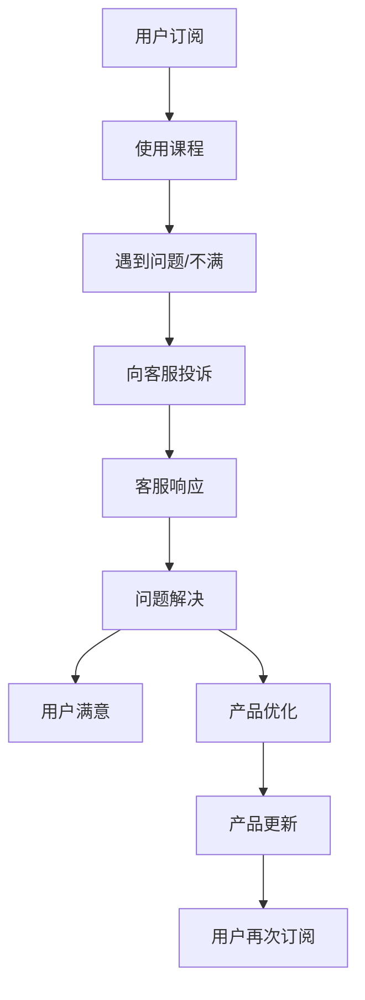

                 

# 程序员如何处理知识付费的客户投诉

> 关键词：知识付费, 客户投诉, 在线客服, 用户体验, 产品优化

## 1. 背景介绍

在知识付费的浪潮中，优质的内容创作者和平台吸引了大量用户订阅。然而，由于知识付费产品特性及用户需求的多样性，客户投诉事件频发。作为产品的直接参与者和技术实现者，程序员需要通过有效的方式处理客户投诉，提升用户体验，优化产品功能，从而确保知识付费业务的持续发展。

## 2. 核心概念与联系

### 2.1 核心概念概述

- **知识付费**：消费者通过订阅或购买的方式，获取专业知识、技术技能等内容。知识付费产品包括在线课程、专业书籍、培训视频等。
- **客户投诉**：用户在使用知识付费产品时遇到问题或不满，向平台或开发者反馈的过程。
- **在线客服**：在知识付费平台部署的客服系统，提供即时的线上问题解答和问题解决服务。
- **用户体验**：用户在使用知识付费产品时的感知和感受，包括界面友好度、学习效率、内容质量等。
- **产品优化**：通过收集用户反馈，改进产品功能，提升产品质量和服务质量，增加用户粘性和满意度。

### 2.2 核心概念原理和架构的 Mermaid 流程图



## 3. 核心算法原理 & 具体操作步骤

### 3.1 算法原理概述

处理客户投诉的流程可以视为一个反馈循环系统。该系统通过用户反馈信息，不断调整和优化产品功能，最终提升用户体验。具体而言，包括以下几个核心步骤：

1. **数据收集**：通过在线客服系统、用户调查问卷、社区讨论等渠道，收集用户反馈信息。
2. **数据分析**：对收集到的反馈信息进行分类、归纳、统计，分析用户常见问题和痛点。
3. **问题解决**：根据用户反馈，制定并实施问题解决策略，如修复已知bug、增加新功能、改进用户体验等。
4. **产品优化**：评估问题解决策略的效果，根据用户反馈和业务需求进行产品优化和迭代。
5. **用户反馈**：将优化后的产品功能重新推送给用户，获取用户反馈信息，形成新的反馈循环。

### 3.2 算法步骤详解

#### 步骤1: 数据收集

- **客服系统记录**：使用专业的客服系统记录用户投诉信息，包括时间、人员、问题描述、处理结果等。
- **问卷调查**：通过定期问卷调查收集用户对产品功能的满意度、存在的问题和改进建议。
- **社区讨论**：监控在线社区、论坛、社交媒体等平台，获取用户对产品的意见和建议。

#### 步骤2: 数据分析

- **用户行为分析**：利用数据挖掘技术分析用户行为数据，识别常见问题和瓶颈。
- **情感分析**：使用自然语言处理技术对用户投诉内容进行情感分析，评估用户情绪和问题严重性。
- **关联分析**：通过关联规则挖掘等技术分析不同用户投诉之间的关联性，发现共性问题。

#### 步骤3: 问题解决

- **优先级划分**：根据用户投诉的数量、频率、严重性等因素，划分问题的优先级。
- **技术方案设计**：根据优先级制定技术解决方案，如修复bug、优化算法、增加功能等。
- **资源分配**：合理分配技术资源和开发人力，优先解决高优先级问题。

#### 步骤4: 产品优化

- **A/B测试**：设计并实施A/B测试，评估新功能和改进措施的效果。
- **用户反馈收集**：通过在线问卷、用户访谈等方式收集用户对优化后的产品功能的反馈信息。
- **持续迭代**：根据用户反馈，不断改进产品功能，提升用户体验。

#### 步骤5: 用户反馈

- **反馈渠道多样化**：提供多种渠道供用户反馈，包括在线客服、邮件、社交媒体等。
- **反馈流程透明**：确保用户反馈渠道的畅通和处理流程的透明，及时告知用户问题解决进展。

### 3.3 算法优缺点

#### 优点：

- **用户反馈驱动**：通过用户反馈直接驱动产品优化，有助于快速响应用户需求，提升产品竞争力。
- **动态调整**：实时监控用户反馈，动态调整产品功能，保证产品与市场需求的同步。
- **提升用户体验**：通过持续优化产品功能，提升用户满意度和粘性，促进知识付费业务的增长。

#### 缺点：

- **数据质量问题**：用户反馈可能包含误导性信息或不完整描述，需要数据分析和验证。
- **资源消耗**：处理大量用户反馈和问题解决需要投入大量人力和时间资源。
- **跨部门协作**：涉及多部门协同工作，沟通协调成本高。

### 3.4 算法应用领域

该算法不仅适用于知识付费平台，也适用于其他在线服务，如电子商务、在线教育、社交媒体等，需要处理用户投诉和反馈信息的场景。

## 4. 数学模型和公式 & 详细讲解 & 举例说明

### 4.1 数学模型构建

处理客户投诉的数学模型可以通过用户反馈频率、问题严重性、解决效率等多个维度构建。例如，可以定义如下模型：

$$
\text{Total Satisfaction} = \sum_{i=1}^{N} \text{UserSatisfaction}_i \times \text{Importance}_i
$$

其中 $N$ 为总用户数，$\text{UserSatisfaction}_i$ 为第 $i$ 个用户的满意度评分，$\text{Importance}_i$ 为第 $i$ 个用户的反馈重要性权重。

### 4.2 公式推导过程

1. **用户满意度评分**：可以采用李克特量表或5分制评分，用户对不同问题进行评分。
2. **反馈重要性权重**：通过分析用户行为数据，识别不同问题的严重性和影响范围，为每个问题设定权重。
3. **总满意度计算**：将每个用户的评分和重要性权重相乘，累加得到总体满意度。

### 4.3 案例分析与讲解

假设某知识付费平台收集了100个用户反馈，平均满意度为3.5分（满分5分），其中优先级最高的问题的权重为0.4，其余问题的权重分别为0.1、0.1、0.1、0.1、0.1、0.1、0.1、0.1、0.1、0.1。那么总满意度为：

$$
\text{Total Satisfaction} = 100 \times 3.5 \times 0.4 + 100 \times 3 \times 0.1 + 100 \times 2.5 \times 0.1 + \cdots + 100 \times 1 \times 0.1 = 140
$$

因此，该平台总体满意度为140分。

## 5. 项目实践：代码实例和详细解释说明

### 5.1 开发环境搭建

#### 环境要求：

- Python 3.7+
- Flask
- Redis
- SQLAlchemy
- ELK Stack（Elasticsearch、Logstash、Kibana）

#### 安装步骤：

1. 安装Flask：

```bash
pip install Flask
```

2. 安装Redis：

```bash
sudo apt-get update
sudo apt-get install redis-server
```

3. 安装SQLAlchemy：

```bash
pip install sqlalchemy
```

4. 安装ELK Stack：

```bash
# Elasticsearch
sudo apt-get install elasticsearch
# Logstash
sudo apt-get install logstash
# Kibana
sudo apt-get install kibana
```

### 5.2 源代码详细实现

#### Flask应用示例

```python
from flask import Flask, request, jsonify
from flask_sqlalchemy import SQLAlchemy
from flask_redis import FlaskRedis
from elasticsearch import Elasticsearch

app = Flask(__name__)
app.config['SQLALCHEMY_DATABASE_URI'] = 'sqlite:///feedback.db'
db = SQLAlchemy(app)
redis_client = FlaskRedis(app)
es = Elasticsearch()

# 定义数据库模型
class Feedback(db.Model):
    id = db.Column(db.Integer, primary_key=True)
    user_id = db.Column(db.String(255), nullable=False)
    feedback = db.Column(db.String(255), nullable=False)
    timestamp = db.Column(db.DateTime, nullable=False, default=datetime.utcnow)

    def __repr__(self):
        return f"<Feedback(id={self.id}, user_id={self.user_id}, feedback='{self.feedback}')>"

# 添加反馈记录
@app.route('/feedback', methods=['POST'])
def add_feedback():
    data = request.get_json()
    feedback = Feedback(user_id=data['user_id'], feedback=data['feedback'])
    db.session.add(feedback)
    db.session.commit()
    redis_client.set(feedback.id, feedback.feedback)
    es.index(index='feedback', id=feedback.id, body=feedback.to_dict())
    return jsonify({'success': True})

# 获取反馈记录
@app.route('/feedback/<int:id>')
def get_feedback(id):
    feedback = Feedback.query.get(id)
    return jsonify(feedback.to_dict())

# 用户满意度计算
@app.route('/satisfaction')
def satisfaction():
    results = Feedback.query.order_by(Feedback.timestamp.desc()).limit(100).all()
    total_score = 0
    total_weight = 0
    for feedback in results:
        score = float(feedback.feedback)
        weight = float(redis_client.get(feedback.id))
        total_score += score * weight
        total_weight += weight
    if total_weight > 0:
        average_score = total_score / total_weight
        return jsonify({'satisfaction': average_score})
    else:
        return jsonify({'satisfaction': 0})

if __name__ == '__main__':
    app.run(debug=True)
```

### 5.3 代码解读与分析

#### Flask应用

- **数据库模型定义**：定义Feedback模型，包含用户ID、反馈内容、时间戳等字段。
- **添加反馈记录**：接收POST请求，将用户反馈记录添加到数据库中，并异步存储到Redis和Elasticsearch中。
- **获取反馈记录**：接收GET请求，根据ID获取反馈记录。
- **用户满意度计算**：接收GET请求，计算所有反馈的平均满意度，返回结果。

#### Redis和Elasticsearch

- **Redis存储**：使用Redis存储反馈记录的ID和反馈内容，以便快速查询和统计。
- **Elasticsearch索引**：将反馈记录异步索引到Elasticsearch，便于全文搜索和数据分析。

## 6. 实际应用场景

### 6.1 在线课程平台

在线课程平台常常遇到用户对课程内容、平台功能、购买流程等方面的投诉。通过在线客服系统记录用户反馈，分析用户满意度，及时修复bug、改进功能，提升用户的学习体验。

### 6.2 电子商务平台

电子商务平台的用户投诉主要集中在产品质量、物流配送、客服响应等方面。通过处理用户反馈，优化产品功能，提高用户购物体验和满意度。

### 6.3 社交媒体平台

社交媒体平台的用户反馈形式多样，包括评论、私信、投诉等。通过高效处理用户反馈，提升平台的用户粘性和活跃度。

### 6.4 未来应用展望

未来，随着AI和大数据技术的发展，可以通过智能客服系统自动处理用户反馈，提高响应速度和处理效率。同时，结合情感分析和自然语言处理技术，可以更加精准地识别用户情绪和问题类型，快速定位问题源头，提升用户满意度。

## 7. 工具和资源推荐

### 7.1 学习资源推荐

- **《Python Web开发实战》**：介绍使用Flask等技术搭建在线客服平台的基础知识和实践经验。
- **《Elasticsearch官方文档》**：提供详细的Elasticsearch部署和使用教程，帮助开发者构建高效的搜索系统。
- **《自然语言处理与深度学习》**：讲解NLP技术在用户反馈分析中的应用，提升数据分析的准确性和智能化。

### 7.2 开发工具推荐

- **Flask**：轻量级的Web框架，适合快速搭建在线客服平台。
- **Redis**：高速缓存和消息队列，用于存储用户反馈记录和计算结果。
- **SQLAlchemy**：ORM框架，用于数据库操作。
- **Elasticsearch**：分布式搜索与分析引擎，用于高效存储和搜索用户反馈记录。
- **Kibana**：数据可视化工具，用于监控和分析用户反馈数据。

### 7.3 相关论文推荐

- **《基于自然语言处理的用户反馈分析》**：探讨使用NLP技术处理用户反馈的方法和应用。
- **《在线客服系统设计与实现》**：介绍在线客服系统架构和实现技术，提升用户满意度。
- **《知识付费产品用户满意度提升策略》**：研究知识付费平台的用户反馈处理策略，提升用户体验。

## 8. 总结：未来发展趋势与挑战

### 8.1 总结

本文详细介绍了程序员如何通过处理客户投诉，优化知识付费产品的功能，提升用户体验。处理客户投诉的流程是一个动态调整、持续优化的反馈循环系统，有助于快速响应用户需求，提升产品竞争力。通过数据分析和反馈处理，程序员可以不断改进产品，满足用户多样化需求，实现业务的可持续发展。

### 8.2 未来发展趋势

- **智能客服系统**：未来，智能客服系统将通过自然语言处理和机器学习技术，实现自动化问题处理，大幅提升响应速度和处理效率。
- **实时数据分析**：借助大数据和实时计算技术，可以实时监控和分析用户反馈，及时发现问题并进行优化。
- **用户情感识别**：通过情感分析和自然语言处理技术，可以更准确地识别用户情绪和需求，提升用户体验。

### 8.3 面临的挑战

- **数据隐私保护**：用户反馈涉及隐私信息，需要严格保护用户数据，避免数据泄露。
- **技术实现难度**：处理大量用户反馈需要高水平的开发和数据分析能力，技术实现难度较大。
- **跨部门协作**：处理客户投诉需要产品、技术、运营等多部门协同工作，沟通协调成本高。

### 8.4 研究展望

- **用户行为预测**：结合机器学习和大数据分析，预测用户行为和需求，主动提供个性化服务。
- **情感识别与干预**：使用情感分析技术识别用户情绪，及时进行干预和安抚，提升用户体验。
- **社区反馈融合**：将社区讨论和用户反馈结合，形成更加全面和准确的问题处理策略。

## 9. 附录：常见问题与解答

### Q1: 如何优化用户满意度评分模型？

A: 可以通过引入更多特征（如用户活跃度、课程质量、技术支持等），提升模型预测的准确性。同时，定期更新模型参数，适应新数据的分布变化。

### Q2: 如何快速处理大量用户反馈？

A: 可以使用分布式存储和处理技术，如Redis、Elasticsearch等，提高数据存储和查询效率。同时，采用消息队列和异步处理技术，减少系统负载，提升响应速度。

### Q3: 如何保证用户反馈数据的安全性？

A: 使用数据加密、访问控制等技术，确保用户反馈数据的安全性。同时，建立数据访问审计机制，记录和监控数据访问行为，及时发现和应对安全威胁。

### Q4: 如何提高智能客服系统的响应速度？

A: 通过引入自然语言处理技术，实现快速问题理解和匹配，减少人工干预。同时，优化系统架构，采用缓存、负载均衡等技术，提高系统的可扩展性和响应速度。

### Q5: 如何应对客户投诉的个性化需求？

A: 通过分析用户行为数据，识别个性化需求，提供个性化的产品推荐和功能优化。同时，建立反馈机制，鼓励用户提出个性化建议，持续改进产品。

---

作者：禅与计算机程序设计艺术 / Zen and the Art of Computer Programming

