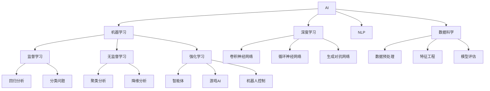

                 

# 程序员如何应对人工智能时代的职业转型

> 关键词：职业转型,人工智能,编程技能,数据科学,机器学习,深度学习,软件工程

## 1. 背景介绍

### 1.1 问题由来
随着人工智能(AI)技术的快速发展，各行各业正经历着深刻的变化。对于广大程序员而言，如何在这个时代背景下进行职业转型，成为当前热议的话题。AI技术的迅猛发展，不仅改变了传统的软件开发范式，也拓展了新的技术岗位，带来了更多职业机遇。本文将围绕如何应对人工智能时代的职业转型，展开系统化的探讨和分析。

### 1.2 问题核心关键点
当前，人工智能时代对程序员的职业转型提出了新的要求，关键点包括：
- 编程技能向数据科学、机器学习、深度学习等方向的拓展。
- 从传统的软件工程师向AI算法工程师、数据科学家、自然语言处理(NLP)工程师等新岗位的转变。
- 跨学科技能的需求增加，如统计学、数学、计算机视觉等。
- 持续学习和自我更新的要求提高。
- 人工智能工具和框架的广泛应用，如TensorFlow、PyTorch、Scikit-learn等。

这些关键点不仅反映了技术趋势的变化，也指明了程序员在职业转型中应具备的素质和能力。

### 1.3 问题研究意义
探讨如何应对人工智能时代的职业转型，对于程序员个体和整个软件行业的发展都具有重要意义：

1. **个体发展**：帮助程序员明确职业发展方向，提升竞争力，适应未来的技术需求。
2. **行业进步**：推动软件开发范式的变革，促进AI技术在各行各业中的应用。
3. **社会影响**：促进人工智能与传统行业的深度融合，加速数字化转型进程。

## 2. 核心概念与联系

### 2.1 核心概念概述

在探讨职业转型前，先介绍几个核心概念及其联系：

- **人工智能(AI)**：利用计算机模拟人类智能的科学和技术，涵盖机器学习、深度学习、自然语言处理等子领域。
- **机器学习(ML)**：让计算机从数据中学习规律，并应用到新的数据中的一种技术。
- **深度学习(Deep Learning)**：一种特殊形式的机器学习，通过多层神经网络模拟人类大脑的神经网络结构。
- **自然语言处理(NLP)**：使计算机能够理解、处理和生成自然语言的技术。
- **数据科学**：通过数据驱动的方法，解决实际问题的一门科学。
- **软件工程**：将系统性、规范化的方法应用于软件开发和维护的技术。

这些概念之间存在紧密的联系，构成了人工智能时代的技术基石。掌握这些概念及其相互关系，有助于程序员在职业转型中更好地理解和应用新技术。

### 2.2 核心概念原理和架构的 Mermaid 流程图



这个流程图展示了人工智能及其子领域之间的相互联系和影响，为后续职业转型提供了理论基础。

## 3. 核心算法原理 & 具体操作步骤
### 3.1 算法原理概述

在人工智能时代，掌握基本的机器学习、深度学习算法及其原理，对于程序员的职业转型至关重要。算法原理不仅帮助理解现有技术，也为未来创新提供方向。

### 3.2 算法步骤详解

基于深度学习的数据科学流程包括数据准备、模型训练、模型评估、模型应用等步骤，具体如下：

1. **数据准备**：数据预处理、数据增强、特征提取等。
2. **模型训练**：选择算法、设置超参数、训练模型等。
3. **模型评估**：选择评估指标、划分验证集、计算性能等。
4. **模型应用**：模型部署、结果解释、迭代优化等。

这些步骤相互依赖，构成了一个完整的机器学习项目。

### 3.3 算法优缺点

- **优点**：
  - 高效自动化处理大量数据。
  - 通过学习规律提高决策准确性。
  - 可以处理非结构化数据，如文本、图像等。

- **缺点**：
  - 需要大量高质量数据。
  - 模型复杂，计算资源消耗大。
  - 难以解释模型的决策过程。

### 3.4 算法应用领域

深度学习在多个领域取得了显著成果，如计算机视觉、自然语言处理、推荐系统等。具体应用包括：
- 计算机视觉：图像识别、目标检测、人脸识别等。
- 自然语言处理：机器翻译、文本生成、情感分析等。
- 推荐系统：电商推荐、新闻推荐、音乐推荐等。

## 4. 数学模型和公式 & 详细讲解 & 举例说明

### 4.1 数学模型构建

典型的深度学习模型包括卷积神经网络(CNN)、循环神经网络(RNN)和长短期记忆网络(LSTM)。

### 4.2 公式推导过程

以卷积神经网络为例，其基本结构包含卷积层、池化层、全连接层等。公式推导如下：

$$
y = \sigma(\sum_{i=1}^{n} w_i x_i + b)
$$

其中，$y$为输出，$x_i$为输入，$w_i$为权重，$b$为偏置，$\sigma$为激活函数。

### 4.3 案例分析与讲解

在计算机视觉中，通过CNN模型可以识别出图像中的物体。例如，使用LeNet-5网络对手写数字进行识别，流程如下：

1. 输入图像经过卷积层提取特征。
2. 特征图通过池化层进行降维。
3. 降维后的特征图通过全连接层进行分类。
4. 最终输出图像中数字的类别。

## 5. 项目实践：代码实例和详细解释说明

### 5.1 开发环境搭建

搭建开发环境需安装Python、TensorFlow、Keras等工具。

```bash
pip install tensorflow keras
```

### 5.2 源代码详细实现

以下是一个简单的手写数字识别模型的实现：

```python
from tensorflow.keras.datasets import mnist
from tensorflow.keras.models import Sequential
from tensorflow.keras.layers import Conv2D, MaxPooling2D, Flatten, Dense
from tensorflow.keras.utils import to_categorical

# 加载数据集
(x_train, y_train), (x_test, y_test) = mnist.load_data()

# 数据预处理
x_train = x_train.reshape(-1, 28, 28, 1).astype('float32') / 255.0
x_test = x_test.reshape(-1, 28, 28, 1).astype('float32') / 255.0
y_train = to_categorical(y_train)
y_test = to_categorical(y_test)

# 构建模型
model = Sequential()
model.add(Conv2D(32, (3, 3), activation='relu', input_shape=(28, 28, 1)))
model.add(MaxPooling2D((2, 2)))
model.add(Conv2D(64, (3, 3), activation='relu'))
model.add(MaxPooling2D((2, 2)))
model.add(Flatten())
model.add(Dense(64, activation='relu'))
model.add(Dense(10, activation='softmax'))

# 编译模型
model.compile(optimizer='adam', loss='categorical_crossentropy', metrics=['accuracy'])

# 训练模型
model.fit(x_train, y_train, epochs=5, batch_size=64, validation_data=(x_test, y_test))
```

### 5.3 代码解读与分析

这段代码实现了手写数字识别的CNN模型。具体步骤如下：
1. 加载MNIST数据集。
2. 对数据进行预处理，包括图像归一化和标签one-hot编码。
3. 构建模型，包含两个卷积层、两个池化层和两个全连接层。
4. 编译模型，选择Adam优化器、交叉熵损失函数和准确率指标。
5. 训练模型，在训练集和验证集上迭代训练。

## 6. 实际应用场景

### 6.1 智能推荐系统

在电商平台上，基于用户行为数据和商品特征，使用深度学习模型进行个性化推荐，显著提高了用户购物体验和销售转化率。例如，使用协同过滤算法、矩阵分解等技术，推荐系统能够精准预测用户可能感兴趣的商品。

### 6.2 自然语言处理(NLP)

NLP技术在机器翻译、情感分析、文本生成等方面取得了显著进展。例如，使用BERT模型进行情感分析，可以对社交媒体上的评论进行情感分类，帮助企业了解用户情感，改进产品和服务。

### 6.3 图像识别与处理

在医疗领域，通过深度学习模型进行图像识别和分析，可以辅助医生诊断疾病，提高诊断效率和准确性。例如，使用卷积神经网络(CNN)进行皮肤癌检测，能够快速识别出病变区域。

### 6.4 未来应用展望

未来，随着AI技术的进一步发展，深度学习将在更多领域发挥重要作用。例如，在自动驾驶、智能家居、智慧城市等领域，AI技术将带来深远变革。程序员需要不断学习和掌握新技术，以适应未来需求。

## 7. 工具和资源推荐

### 7.1 学习资源推荐

1. 《深度学习》系列书籍：Ian Goodfellow、Yoshua Bengio和Aaron Courville合著，深入浅出地介绍了深度学习的基本概念和算法。
2. Coursera深度学习课程：由Andrew Ng教授主讲，系统介绍了深度学习的理论和实践。
3. TensorFlow官方文档：提供了深度学习框架的使用指南和样例代码，适合初学者和专业人士。
4. Kaggle竞赛平台：参与实际数据集竞赛，提升机器学习技能，积累实战经验。
5. GitHub项目：通过查看和参与开源项目，学习前沿技术和最佳实践。

### 7.2 开发工具推荐

1. PyTorch：灵活易用的深度学习框架，适合研究和快速迭代。
2. TensorFlow：功能强大，易于部署和扩展，适合大规模工程应用。
3. Jupyter Notebook：交互式编程环境，方便进行数据处理和模型调试。
4. Weights & Biases：实验管理和可视化工具，帮助跟踪和优化模型训练过程。
5. TensorBoard：可视化工具，监控模型训练和推理过程。

### 7.3 相关论文推荐

1. Yann LeCun、Yoshua Bengio和Geoffrey Hinton的《深度学习》论文，奠定了深度学习理论基础。
2. Ian Goodfellow等人的《生成对抗网络》论文，介绍了GAN技术的原理和应用。
3. Fei-Fei Li等人的《计算机视觉: 模型、学习和推理》，系统介绍了计算机视觉的基本方法和技术。

## 8. 总结：未来发展趋势与挑战

### 8.1 研究成果总结

本文详细探讨了如何应对人工智能时代的职业转型，并介绍了机器学习、深度学习等核心概念和应用。掌握了这些知识，程序员可以更好地适应新技术，拓展职业发展路径。

### 8.2 未来发展趋势

1. **算法发展**：深度学习算法将进一步优化，提升模型性能和效率。
2. **跨学科融合**：AI技术与其他领域的结合将更加紧密，催生更多创新应用。
3. **硬件加速**：GPU、TPU等硬件加速设备将推动AI计算效率提升。
4. **伦理和安全**：AI技术的伦理和安全问题将受到更多关注，相关研究和标准将逐步完善。

### 8.3 面临的挑战

1. **数据获取与处理**：高质量数据获取和处理是AI技术应用的基础。
2. **模型复杂度**：深度学习模型复杂度高，计算资源消耗大。
3. **可解释性**：AI模型的决策过程难以解释，影响其可信度。
4. **隐私保护**：AI技术的应用涉及大量数据，隐私保护问题亟需解决。

### 8.4 研究展望

未来，AI技术的普及将推动各行各业的数字化转型，为程序员带来新的职业机遇。需重点关注以下几个方向：
1. **自动化与机器人**：推动AI与机器人技术的融合，实现自动驾驶、工业自动化等。
2. **医疗健康**：AI在医疗影像分析、疾病预测等方面的应用将带来革命性变化。
3. **金融科技**：AI技术在金融风控、智能投顾等方面的应用将大幅提升金融服务效率。
4. **教育与培训**：AI技术将助力个性化教育和终身学习，推动教育公平。

## 9. 附录：常见问题与解答

**Q1: 如何从传统软件开发转向AI领域？**

A: 1. 学习相关基础知识，如统计学、数学、计算机视觉等。
2. 参加线上/线下课程和培训，积累实战经验。
3. 参与开源项目，积累社区经验。
4. 利用现有数据集和框架进行项目实践。

**Q2: 学习AI技术需要哪些基本数学基础？**

A: 1. 线性代数：矩阵运算、向量空间等。
2. 概率论与统计学：数据分布、假设检验、回归分析等。
3. 微积分：导数、偏导数、梯度等。
4. 计算复杂性：时间复杂度、空间复杂度、算法效率等。

**Q3: 推荐哪些学习资源？**

A: 1. Coursera深度学习课程。
2. 《深度学习》系列书籍。
3. Kaggle竞赛平台。
4. GitHub开源项目。

**Q4: 如何提升AI模型的可解释性？**

A: 1. 采用可解释的算法，如决策树、LIME等。
2. 引入可视化工具，如SHAP、LIME等，分析模型决策过程。
3. 进行模型解释和审计，确保其符合伦理要求。

**Q5: 未来AI技术的发展方向？**

A: 1. 自动化与机器人：推动AI与机器人技术的融合，实现自动驾驶、工业自动化等。
2. 医疗健康：AI在医疗影像分析、疾病预测等方面的应用将带来革命性变化。
3. 金融科技：AI技术在金融风控、智能投顾等方面的应用将大幅提升金融服务效率。
4. 教育与培训：AI技术将助力个性化教育和终身学习，推动教育公平。

通过系统的学习、实践和持续探索，程序员可以更好地应对人工智能时代的职业转型，把握未来的发展机遇。

