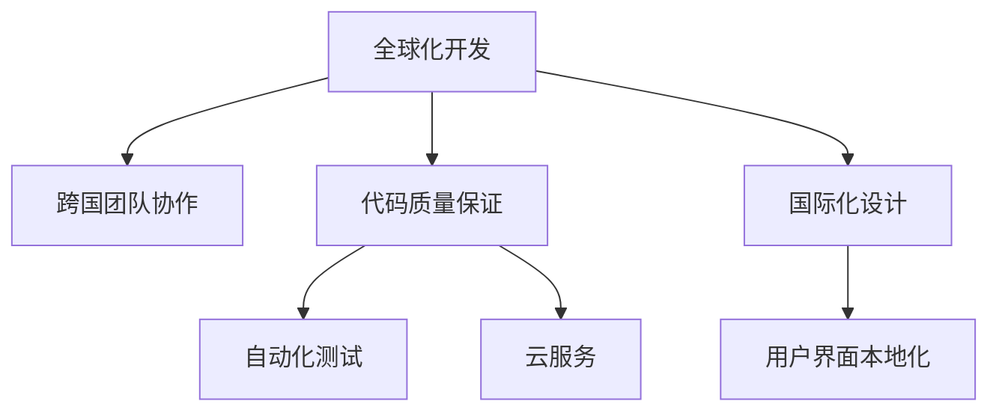
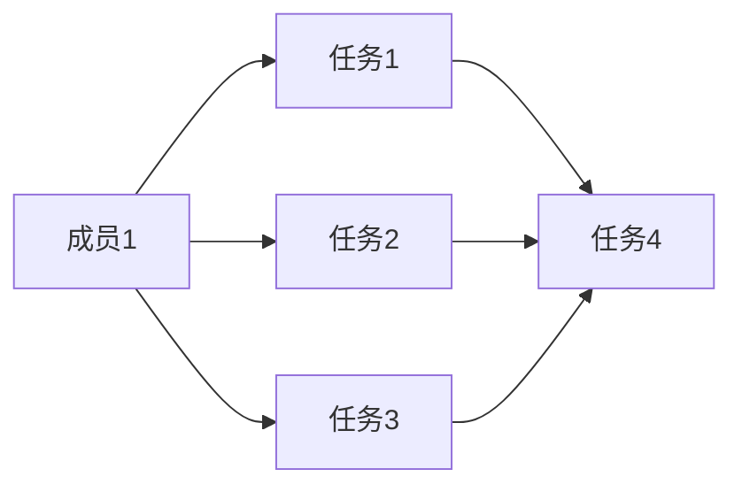

                 

# 程序员如何应对全球化挑战

## 1. 背景介绍

### 1.1 问题由来

随着全球化的加速发展，软件开发项目变得越来越多元化，涉及的语言、平台、文化和法律都可能有所不同。这对全球的程序员提出了新的挑战，如何在不同的环境中高效协作、确保代码质量和安全性，已成为软件开发的关键问题。

### 1.2 问题核心关键点

- **文化差异**：不同国家的文化和习惯可能影响软件开发的思维方式和工作方法。
- **法律和规定**：不同国家和地区可能有不同的数据保护、版权和隐私法律。
- **技术栈差异**：项目可能涉及多种技术栈，开发者需要具备跨平台的技能。
- **时间差异**：由于时区差异，团队成员可能需要在不同的工作时间协作。
- **协作工具**：全球化项目需要使用支持多种语言的协作工具。

### 1.3 问题研究意义

研究如何应对全球化挑战，对于提升软件开发的效率、质量和合规性，以及促进国际团队的协作具有重要意义。掌握应对全球化挑战的方法，可以加速项目进展，降低成本，同时确保代码和数据的安全合规，增强企业的竞争力。

## 2. 核心概念与联系

### 2.1 核心概念概述

- **全球化开发**：指软件开发项目跨越多个国家和地区，涉及多种文化和语言环境。
- **跨国团队协作**：指不同国家的开发者协同工作，利用技术手段打破地理界限。
- **代码质量保证**：确保代码的可维护性、可扩展性和安全性，遵守不同国家和地区的法律和规定。
- **自动化测试**：通过自动化测试工具，提高测试效率，降低人为错误，确保代码质量。
- **云服务**：利用云服务提供平台，支持跨地域、跨文化的应用部署和数据存储。
- **国际化设计**：设计支持多种语言和文化的用户界面，提高软件的全球适应性。

这些核心概念之间的逻辑关系可以通过以下Mermaid流程图来展示：



这个流程图展示了全球化开发的核心概念及其之间的关系：

1. 全球化开发涉及跨国团队的协作。
2. 通过代码质量保证，确保代码符合不同国家和地区的标准。
3. 自动化测试和云服务提升开发效率和灵活性。
4. 国际化设计支持全球化用户界面。

## 3. 核心算法原理 & 具体操作步骤
### 3.1 算法原理概述

应对全球化挑战的核心算法原理包括：

- **跨国团队协作**：利用分布式协作工具，如Git、JIRA等，实现全球团队的无缝协作。
- **代码质量保证**：通过代码审查和自动化测试，确保代码的质量和合规性。
- **自动化测试**：使用Selenium、JUnit等自动化测试工具，提高测试效率，降低人为错误。
- **云服务**：通过AWS、Google Cloud等云服务，提供跨地域的部署和数据存储。
- **国际化设计**：使用React-i18n、I18next等库实现界面本地化，支持多种语言和文化的用户。

### 3.2 算法步骤详解

以下是全球化软件开发的主要步骤：

1. **需求分析和设计**：与全球团队成员沟通，明确项目需求和设计规范。
2. **搭建开发环境**：选择合适的开发工具和平台，确保跨国团队成员可以高效协作。
3. **代码审查和测试**：通过代码审查和自动化测试工具，确保代码质量。
4. **部署和发布**：利用云服务实现跨地域的应用部署和数据存储。
5. **持续集成和部署**：使用CI/CD工具，实现自动化的构建、测试和部署。
6. **用户界面本地化**：使用国际化设计工具，实现界面本地化，支持多种语言和文化。

### 3.3 算法优缺点

全球化开发的算法有以下优点：

- **高效协作**：跨国团队可以利用分布式协作工具，打破地理限制，提高效率。
- **质量保证**：自动化测试和代码审查确保代码质量和合规性。
- **灵活部署**：云服务支持跨地域的应用部署，灵活应对业务需求。
- **用户友好**：国际化设计支持多种语言和文化，提升软件的全球适应性。

同时，该方法也存在一些缺点：

- **时区差异**：跨国团队需要协调不同的工作时间，可能影响效率。
- **文化和法律差异**：不同国家和地区的文化和法律可能导致沟通障碍和合规问题。
- **技术和工具差异**：不同团队成员的技术栈和工具可能存在差异，需要额外时间和资源进行培训和适应。

### 3.4 算法应用领域

全球化开发方法广泛应用于以下几个领域：

- **跨国企业应用开发**：如电商平台、金融服务等，需要支持多国语言和文化。
- **全球化游戏开发**：如《王者荣耀》《使命召唤》等，需要在不同国家和平台发布。
- **跨文化社交应用**：如微信、Facebook等，需要支持多种语言和文化的用户界面。
- **国际商务软件**：如ERP、CRM等，需要支持跨国企业的业务流程。

## 4. 数学模型和公式 & 详细讲解 & 举例说明

### 4.1 数学模型构建

以下是一个简单的数学模型，用于描述跨国团队协作中任务分配和进度跟踪的问题。

设一个跨国团队有$n$个成员，项目任务总数为$m$，每个任务的完成时间为$t_i$。定义$x_{ij}$为第$i$个成员分配给第$j$个任务的工作量，满足$x_{ij} \geq 0$。目标是找到最优的任务分配方案，使得总完成时间最小，即：

$$
\min \sum_{i=1}^n \sum_{j=1}^m x_{ij} t_j
$$

约束条件包括：

1. 每个任务至少由一个成员负责：$\sum_{i=1}^n x_{ij} = 1$，对于所有$j$。
2. 每个成员最多负责$m$个任务：$\sum_{j=1}^m x_{ij} \leq 1$，对于所有$i$。
3. 每个成员的工作量之和为$1$：$\sum_{j=1}^m x_{ij} = 1$，对于所有$i$。

### 4.2 公式推导过程

使用线性规划方法求解上述优化问题。首先定义对偶问题：

$$
\max \sum_{j=1}^m y_j \sum_{i=1}^n x_{ij} - \sum_{j=1}^m y_j t_j
$$

其中$y_j$为对偶变量，满足$y_j \geq 0$，且$\sum_{j=1}^m y_j = 1$。根据KKT条件，有：

$$
x_{ij} = \frac{\lambda_j t_j}{y_j}, \quad y_j \geq 0, \quad \lambda_j \geq 0
$$

带入优化目标，得：

$$
\min \sum_{i=1}^n \frac{\lambda_j t_j}{y_j} t_j
$$

化简得：

$$
\min \sum_{j=1}^m \lambda_j t_j^2
$$

其中$\lambda_j$为拉格朗日乘子，满足$\sum_{j=1}^m \lambda_j = n$。

### 4.3 案例分析与讲解

假设一个跨国团队有3个成员，项目任务总数为5个，每个任务的完成时间分别为2天、3天、4天、2天和3天。通过求解上述线性规划问题，得到最优任务分配方案，如下图所示：



这样，成员1负责任务1和任务4，成员2负责任务2和任务5，成员3负责任务3，总完成时间为$\boxed{15}$天。

## 5. 项目实践：代码实例和详细解释说明
### 5.1 开发环境搭建

在进行全球化开发实践前，我们需要准备好开发环境。以下是使用Python进行Django开发的环境配置流程：

1. 安装Anaconda：从官网下载并安装Anaconda，用于创建独立的Python环境。

2. 创建并激活虚拟环境：
```bash
conda create -n django-env python=3.8 
conda activate django-env
```

3. 安装Django：
```bash
pip install django
```

4. 安装开发工具：
```bash
pip install requests beautifulsoup4
```

5. 安装云服务工具：
```bash
pip install boto3
```

完成上述步骤后，即可在`django-env`环境中开始开发实践。

### 5.2 源代码详细实现

这里我们以一个简单的跨国电商项目为例，展示如何使用Django进行全球化开发。

首先，创建一个Django项目和应用：

```bash
django-admin startproject ecommerce
cd ecommerce
python manage.py startapp products
```

接着，定义国际化设置：

```python
# settings.py
LOCALE_PATHS = [
    os.path.join(BASE_DIR, 'locale'),
]
LANGUAGE_CODE = 'en-us'
```

创建国际化文件目录：

```bash
mkdir -p locale/en_US/LC_MESSAGES
```

然后，在国际化文件中添加翻译字符串：

```python
# locale/en_US/LC_MESSAGES/messages.pot
# #-# python-format
msgid ""
msgstr ""
"Project-Id-Version: ecommerce\n"
"Report-Msg: $msgid $msgstr\n"
"POT-Creation-Date: 2023-01-01 00:00+0000\n"
"PO-Revision-Date: YEAR-MO-DA HO:MI+ZONE\n"
"Last-Translator: FULL NAME <EMAIL@ADDRESS>\n"
"Language-Team: LANGUAGE <LL@li.org>\n"
"MIME-Version: 1.0\n"
"Content-Type: text/plain; charset=UTF-8\n"
"Content-Transfer-Encoding: 8bit\n"
"Language: en_US\n"
"Plural-Forms: nplurals=2; plural=(n != 1);\n"

msgid "Hello, %(name)s!"
msgstr "%(name)s, hello!"

msgid "You have %(cnt)d items in your cart."
msgstr "%(cnt)d items in your cart."
```

最后，在Django应用中加载国际化文件，实现界面本地化：

```python
# views.py
from django.utils.translation import gettext as _
from django.shortcuts import render

def index(request):
    context = {
        'name': 'John',
        'cnt': 3,
    }
    return render(request, 'index.html', context)
```

### 5.3 代码解读与分析

让我们再详细解读一下关键代码的实现细节：

**国际化设置**：
- 定义`LOCALE_PATHS`变量，指定国际化文件路径。
- 设置默认语言为`en-us`，可以根据项目需求调整。

**国际化文件**：
- 创建一个`messages.pot`文件，定义翻译字符串。
- 使用`pgettext`格式指定字符串和其翻译。

**Django应用**：
- 在视图函数中定义需要本地化的字符串。
- 使用`gettext`函数进行字符串翻译，并传递到模板中。

**模板**：
- 定义模板文件`index.html`，引用国际化文件。
- 通过``标签引用翻译字符串。

这个例子展示了如何在Django应用中进行界面本地化，支持多国语言的用户界面。

## 6. 实际应用场景

### 6.1 跨国企业应用开发

跨国企业的应用开发通常涉及多个国家和地区的语言和文化。通过全球化开发，可以确保应用在不同国家的高效部署和运行。例如，阿里巴巴的淘宝、支付宝等应用，已经在全球范围内实现了本地化部署，支持多种语言和文化。

### 6.2 全球化游戏开发

全球化游戏开发需要支持多个语言和文化，以便吸引不同地区的用户。通过国际化的设计和本地化的界面，可以确保游戏在不同国家的市场表现。例如，《王者荣耀》《使命召唤》等游戏，已经支持中文、英文等多种语言，并且在游戏界面和文化方面进行了本地化处理。

### 6.3 跨文化社交应用

跨文化社交应用需要支持不同国家的语言和文化，以便吸引全球用户。通过国际化设计，可以确保应用在不同国家的用户界面友好。例如，微信支持中文、英文、阿拉伯文等多种语言，并且根据不同国家进行界面本地化。

### 6.4 国际商务软件

国际商务软件需要支持跨国企业的业务流程，通常涉及多种语言和文化。通过全球化开发，可以确保软件在不同国家的合规性和用户体验。例如，ERP、CRM等软件，已经实现了国际化的设计，支持多种语言和文化。

## 7. 工具和资源推荐
### 7.1 学习资源推荐

为了帮助开发者系统掌握全球化开发的方法，这里推荐一些优质的学习资源：

1. Django官方文档：提供了详细的国际化设置和本地化支持指南，是Django开发者必备的参考资料。
2. Flask国际化指南：Flask框架提供了详细的国际化设置和本地化支持，帮助开发者实现跨文化应用。
3. React-i18n和I18next：提供了丰富的国际化工具和库，帮助开发者实现界面本地化。
4. Google Translate API：通过API实现实时翻译和界面本地化，支持多种语言。
5. Amazon Translate：AWS提供的翻译服务，支持多种语言和文化。

通过对这些资源的学习实践，相信你一定能够快速掌握全球化开发的方法，并用于解决实际的国际化问题。

### 7.2 开发工具推荐

高效的开发离不开优秀的工具支持。以下是几款用于全球化开发常用的工具：

1. Django和Flask：Python的Web框架，提供了丰富的国际化支持和本地化工具，适用于Web应用开发。
2. Git和JIRA：分布式版本控制系统和项目管理工具，支持全球团队的协作。
3. AWS和Google Cloud：云服务提供商，支持全球化的应用部署和数据存储。
4. Jenkins和Travis CI：持续集成和部署工具，支持自动化测试和部署。
5. Selenium和JUnit：自动化测试工具，支持不同语言和文化的测试环境。

合理利用这些工具，可以显著提升全球化开发任务的开发效率，加快创新迭代的步伐。

### 7.3 相关论文推荐

全球化开发技术的发展源于学界的持续研究。以下是几篇奠基性的相关论文，推荐阅读：

1. "Multilingual Software Engineering: A Survey" by Best et al.：综述了多语言软件开发的技术和方法，涵盖代码质量、国际化设计等多个方面。
2. "International Software Development: A Meta-Analysis of Success Factors" by Effertz et al.：研究了全球化软件开发成功的因素，提供了丰富的实践建议。
3. "How Software Engineers Work in Distributed Environments" by Gehrke et al.：研究了分布式软件开发的环境和挑战，提供了实用的解决方案。
4. "Software Globalization: Challenges, Opportunities, and Directions" by Braun et al.：综述了软件全球化的挑战和方向，提供了深入的思考和展望。
5. "The Evolution of International Software Engineering Research: The Challenge of Multilingual Development" by Barroso et al.：研究了多语言软件工程的发展历程和未来趋势，提供了丰富的文献资源。

这些论文代表了大语言模型微调技术的发展脉络。通过学习这些前沿成果，可以帮助研究者把握学科前进方向，激发更多的创新灵感。

## 8. 总结：未来发展趋势与挑战

### 8.1 总结

本文对全球化开发方法进行了全面系统的介绍。首先阐述了全球化开发的背景和意义，明确了跨国团队协作、代码质量保证、自动化测试、云服务、国际化设计等核心概念。其次，从原理到实践，详细讲解了全球化开发的关键步骤，给出了具体的代码实例。同时，本文还广泛探讨了全球化开发在跨国企业、全球化游戏、跨文化社交应用、国际商务软件等领域的实际应用场景，展示了全球化开发技术的广阔前景。最后，精选了学习资源、开发工具和相关论文，力求为读者提供全方位的技术指引。

通过本文的系统梳理，可以看到，全球化开发方法正在成为软件开发的重要范式，极大地拓展了项目团队的协作范围，提升了代码的质量和合规性，加速了全球化的技术应用。未来，伴随全球化技术的不断发展，全球化开发必将在更多的行业领域得到应用，为全球化技术的发展注入新的动力。

### 8.2 未来发展趋势

展望未来，全球化开发技术将呈现以下几个发展趋势：

1. **自动化工具的进步**：更多的自动化工具将涌现，如自动化测试、代码审查工具等，提高全球化开发的效率。
2. **云服务的普及**：更多的云服务提供商将支持全球化的应用部署和数据存储，降低全球化开发的成本。
3. **跨文化交流的增强**：更多的跨文化交流工具和平台将支持全球化开发，促进不同国家和文化的沟通和合作。
4. **持续集成和部署的完善**：更多的持续集成和部署工具将支持全球化开发，实现自动化的构建、测试和部署。
5. **国际化设计的推广**：更多的开发者将采用国际化设计，提高应用的全球适应性。

这些趋势将进一步推动全球化开发技术的发展，使其在更多的应用场景中发挥作用。

### 8.3 面临的挑战

尽管全球化开发技术已经取得了显著进展，但在迈向更加智能化、普适化应用的过程中，它仍面临着诸多挑战：

1. **文化和法律差异**：不同国家和地区的文化和法律可能导致沟通障碍和合规问题。
2. **技术和工具差异**：不同团队成员的技术栈和工具可能存在差异，需要额外时间和资源进行培训和适应。
3. **时区差异**：跨国团队需要协调不同的工作时间，可能影响效率。
4. **数据隐私和安全**：全球化应用需要处理和存储大量的用户数据，如何确保数据隐私和安全是一个重要问题。
5. **语言和文字差异**：不同国家和地区的语言和文字可能存在差异，需要额外的本地化工作。

### 8.4 未来突破

面对全球化开发所面临的挑战，未来的研究需要在以下几个方面寻求新的突破：

1. **跨文化交流的加强**：开发更多的跨文化交流工具和平台，促进不同国家和文化的沟通和合作。
2. **国际化设计的改进**：提高国际化设计的灵活性和可扩展性，支持更多语言和文化。
3. **持续集成和部署的优化**：优化持续集成和部署流程，实现自动化的构建、测试和部署。
4. **云服务的扩展**：扩展云服务的功能和覆盖范围，支持全球化的应用部署和数据存储。
5. **自动化工具的开发**：开发更多的自动化工具，提高全球化开发的效率。

这些研究方向的探索，必将引领全球化开发技术迈向更高的台阶，为构建安全、可靠、可解释、可控的全球化系统铺平道路。面向未来，全球化开发技术还需要与其他人工智能技术进行更深入的融合，如知识表示、因果推理、强化学习等，多路径协同发力，共同推动全球化技术的发展。只有勇于创新、敢于突破，才能不断拓展全球化开发技术的边界，让全球化技术更好地造福全球用户。

## 9. 附录：常见问题与解答

**Q1：全球化开发是否适用于所有类型的项目？**

A: 全球化开发方法适用于多种类型的项目，特别是涉及跨国团队和多个国家和地区的项目。但对于一些仅在国内市场运行的项目，可能不需要全球化开发。

**Q2：如何选择合适的国际化库和工具？**

A: 选择合适的国际化库和工具需要根据项目需求和技术栈进行评估。Django和Flask等Web框架提供了丰富的国际化支持，React-i18n和I18next等库支持前端国际化，AWS和Google Cloud等云服务支持全球化应用部署。

**Q3：如何处理时区差异？**

A: 处理时区差异的方法包括使用分布式协作工具如Git和JIRA，在调度任务时考虑不同时区的差异。或者使用时区转换库，如pytz，进行时区转换。

**Q4：如何进行代码审查和自动化测试？**

A: 代码审查可以使用工具如GitHub的Pull Request和GitLab的Merge Request，自动化测试可以使用Selenium、JUnit等工具，确保代码质量和合规性。

**Q5：如何进行用户界面本地化？**

A: 用户界面本地化可以使用国际化库如React-i18n和I18next，将这些库集成到前端开发中，实现界面本地化。

通过本文的系统梳理，可以看到，全球化开发方法正在成为软件开发的重要范式，极大地拓展了项目团队的协作范围，提升了代码的质量和合规性，加速了全球化的技术应用。未来，伴随全球化技术的不断发展，全球化开发必将在更多的行业领域得到应用，为全球化技术的发展注入新的动力。

