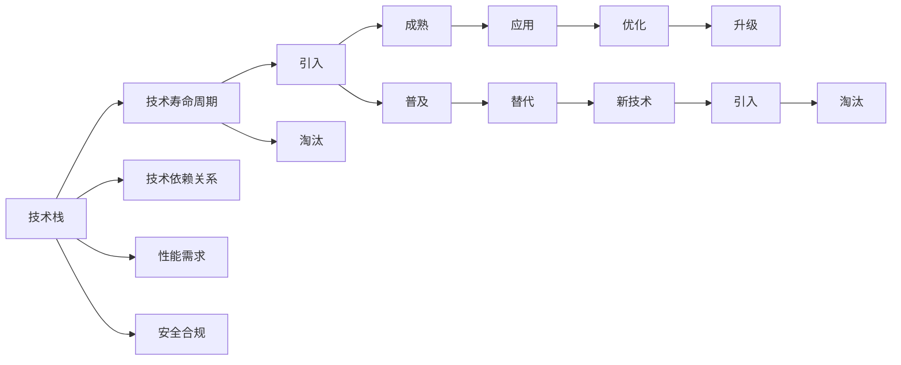

                 

# 程序员如何应对技术栈快速迭代

技术栈的快速迭代已成为IT行业的新常态，无论是新兴技术的爆发还是已有技术的演进，都要求程序员不断学习、适应，甚至主动拥抱变化。本文旨在为IT行业的从业人员提供应对技术栈快速迭代的策略和方法，帮助他们在快速变化的市场环境中保持竞争力。

## 1. 背景介绍

### 1.1 问题由来

在过去十年间，软件技术的发展日新月异，新技术的涌现速度之快前所未有。随着人工智能、区块链、云计算等新兴技术的兴起，以及现有技术的不断演进，程序员需要不断学习新技能，适应新的编程语言、框架、工具和标准。这不仅是对个体的挑战，也对企业的技术团队提出了更高的要求。

### 1.2 问题核心关键点

快速迭代的本质是对技术栈中各组件的不停更新和替换。技术栈的变化通常由以下几个关键点驱动：
1. 技术寿命周期：新技术的引入和老技术的淘汰在不断交替。
2. 技术依赖关系：不同技术之间的依赖性和适配性变化。
3. 性能需求升级：业务增长对技术栈性能需求的提升。
4. 安全与合规：法律法规和行业标准对技术栈安全性和合规性的要求。
5. 用户体验优化：用户对应用性能、稳定性和易用性的新要求。

这些因素共同推动了技术栈的快速迭代，也使得程序员必须不断适应和更新自身技能，以应对变化。

### 1.3 问题研究意义

面对快速变化的技术栈，如何有效应对成为程序员必须解决的问题。良好的应对策略不仅有助于提升个人技能水平，还能为企业带来更大的竞争优势。具体来说，意义如下：
1. 提升个人竞争力：保持技能更新，掌握新技术，增强市场适应性。
2. 提高团队效率：促进团队成员协同学习，快速适应新技术，缩短开发周期。
3. 加速业务创新：技术栈升级和优化，支持企业快速响应市场变化，推动产品迭代。
4. 确保安全合规：适应新的安全标准和法律法规，保护数据和系统安全。

## 2. 核心概念与联系

### 2.1 核心概念概述

要有效应对技术栈的快速迭代，首先需要理解其中涉及的核心概念：

1. **技术栈（Technical Stack）**：指用于构建和维护软件应用的多种技术和工具的集合。包括编程语言、框架、库、数据库、中间件等。
2. **技术寿命周期（Technology Life Cycle）**：新技术的引入、成熟、普及和淘汰的过程。
3. **技术依赖关系（Technology Dependency）**：不同技术之间相互依赖、支持的关系。
4. **性能需求（Performance Requirement）**：业务增长对技术栈性能的要求。
5. **安全合规（Security & Compliance）**：技术栈在安全性和合规性方面的要求。

这些概念之间相互关联，共同构成了技术栈快速迭代的基础。通过理解这些概念，我们可以更好地把握技术栈的变化规律，制定有效的应对策略。

### 2.2 核心概念原理和架构的 Mermaid 流程图



这个流程图展示了技术栈各组成部分及其相互关系：

1. 技术栈（A）：包含编程语言（Python, Java等）、框架（Spring, Django等）、库（TensorFlow, React等）、数据库（MySQL, MongoDB等）、中间件（Apache Kafka等）等。
2. 技术寿命周期（B）：技术从引入到成熟、普及再到淘汰的过程，如Java到Kotlin的转变。
3. 技术依赖关系（C）：技术之间相互依赖、支持的关系，如Spring Boot对Spring Framework的依赖。
4. 性能需求（D）：随着业务增长，对技术栈性能的要求提升，如响应时间、并发量等。
5. 安全合规（E）：对技术栈的安全性和合规性要求，如GDPR合规。

## 3. 核心算法原理 & 具体操作步骤

### 3.1 算法原理概述

技术栈快速迭代的应对策略需要从理论层面进行深入理解，以下是基于核心的算法原理和具体操作步骤的描述：

1. **持续学习（Continuous Learning）**：保持对新技术、新框架的持续学习，提升自身技能水平。
2. **技术评估（Technology Assessment）**：定期评估现有技术栈的性能和稳定性，识别改进点。
3. **技术适配（Technology Adaptation）**：根据评估结果，选择适合的替代技术，实现平滑过渡。
4. **自动化和工具化（Automation & Tooling）**：引入自动化工具和持续集成/持续部署（CI/CD）流程，提高开发效率。
5. **版本控制（Version Control）**：使用版本控制工具如Git，跟踪技术栈变化，确保代码版本安全。
6. **性能优化（Performance Optimization）**：针对性能瓶颈进行优化，提升应用响应速度和稳定性。
7. **安全合规（Security & Compliance）**：确保技术栈符合安全标准和法规要求，保护数据和系统安全。

### 3.2 算法步骤详解

以下是应对技术栈快速迭代的具体操作步骤：

**Step 1: 技术评估**
- 定期对技术栈的各组件进行评估，包括性能、稳定性、安全性等指标。
- 使用自动化工具（如JMeter、Apache Bench等）进行性能测试，获取关键指标。
- 分析技术栈中的瓶颈和薄弱环节，记录评估结果。

**Step 2: 技术适配**
- 根据评估结果，选择适合的替代技术。
- 制定迁移计划，逐步替换现有技术，避免大规模停机和数据丢失。
- 引入新的技术时，先进行小规模试点，验证效果后再逐步推广。

**Step 3: 自动化和工具化**
- 引入自动化工具，如Jenkins、Travis CI等，实现自动化测试和部署。
- 使用容器化技术（如Docker、Kubernetes），实现代码和环境的打包、部署和管理。
- 配置CI/CD流程，实现持续集成和持续部署，提升开发效率和代码质量。

**Step 4: 版本控制**
- 使用版本控制工具如Git，记录技术栈的变更历史。
- 分支管理策略，如特征分支（Feature Branch）和主分支（Main Branch），确保代码的独立性和可维护性。
- 定期合并代码，确保新功能的集成和旧功能的维护。

**Step 5: 性能优化**
- 使用性能分析工具（如New Relic、Grafana），监控应用性能指标。
- 针对性能瓶颈，优化代码、数据库查询、缓存策略等。
- 引入缓存、负载均衡、分布式系统等架构优化，提升系统响应速度和稳定性。

**Step 6: 安全合规**
- 确保技术栈符合最新的安全标准和法规要求，如GDPR、CCPA等。
- 引入安全扫描工具（如SonarQube、OWASP ZAP），检测代码中的安全漏洞。
- 实施访问控制、数据加密、权限管理等安全措施，保护用户数据和系统安全。

### 3.3 算法优缺点

技术栈快速迭代的应对策略有如下优点：
1. 提升效率：通过引入自动化和持续集成，大大缩短开发和部署时间。
2. 降低风险：平滑的技术过渡，避免大规模系统停机和数据丢失。
3. 提高质量：性能优化和安全合规措施，提升应用质量和用户体验。

同时，也存在一些局限性：
1. 学习成本高：新技术的学习曲线陡峭，需要大量时间和精力投入。
2. 技术复杂度高：技术栈复杂多变，需要深入理解各组件之间的关系和依赖。
3. 资源投入大：引入新技术需要额外的硬件、软件和人力资源。
4. 迁移难度大：大规模技术迁移，可能面临数据迁移、应用兼容等问题。

### 3.4 算法应用领域

技术栈快速迭代的方法，广泛应用于IT行业的各个领域，包括但不限于：

1. 软件开发：实现快速迭代，提升产品开发效率和质量。
2. 数据处理：通过引入大数据技术（如Hadoop、Spark），提升数据处理和分析能力。
3. 人工智能：应用深度学习、机器学习等技术，实现智能应用。
4. 云服务：利用云计算平台（如AWS、Azure），实现弹性计算和数据存储。
5. 移动开发：引入跨平台开发框架（如React Native、Flutter），快速构建跨平台应用。
6. 系统架构：采用微服务、容器化、分布式等架构，提升系统可扩展性和稳定性。

## 4. 数学模型和公式 & 详细讲解 & 举例说明

### 4.1 数学模型构建

在技术栈快速迭代的背景下，我们可以构建一个简单的数学模型来描述技术栈变化和评估过程：

设技术栈的性能指标为 $P(t)$，其中 $t$ 表示时间。我们假设在 $t_1$ 时刻，引入新技术 $T_1$，对现有技术 $T_0$ 进行评估和替换。新技术的引入效果可以通过以下模型来描述：

$$
P(t) = \begin{cases}
P_0(t) & t < t_1 \\
P_{T_1}(t) & t \geq t_1
\end{cases}
$$

其中 $P_0(t)$ 为现有技术的性能随时间变化的模型，$P_{T_1}(t)$ 为新技术的性能随时间变化的模型。

### 4.2 公式推导过程

假设 $P_0(t)$ 为指数衰减模型，$P_{T_1}(t)$ 为线性增长模型，则有：

$$
P_0(t) = P_0 \cdot e^{-\lambda_0 t}, \quad P_{T_1}(t) = P_{T_1} + k_1 t
$$

其中 $P_0$ 和 $P_{T_1}$ 为初始性能指标，$\lambda_0$ 和 $k_1$ 为衰减和增长速率，$t$ 为时间。

将两者代入上述公式，得：

$$
P(t) = \begin{cases}
P_0 \cdot e^{-\lambda_0 t} & t < t_1 \\
P_{T_1} + k_1 (t - t_1) & t \geq t_1
\end{cases}
$$

推导过程展示了技术栈性能随时间变化的模型，有助于理解和评估新技术引入的效果。

### 4.3 案例分析与讲解

以微服务架构为例，分析其对性能的影响。假设应用从单体架构迁移到微服务架构，引入新的性能模型 $P_{微服务}(t)$：

- 单体架构：$P_0(t) = P_0 \cdot e^{-\lambda_0 t}$
- 微服务架构：$P_{微服务}(t) = P_{微服务} + k_{微服务} t$

通过引入微服务架构，应用性能得到显著提升。在 $t_1$ 时刻引入微服务架构，性能提升效果为：

$$
\Delta P(t) = P_{微服务}(t) - P_0(t) = k_{微服务} (t - t_1) - \lambda_0 (P_0 - P_{微服务})
$$

通过实际数据分析，可以找到 $k_{微服务}$ 和 $t_1$，进一步优化应用性能。

## 5. 项目实践：代码实例和详细解释说明

### 5.1 开发环境搭建

以下是使用Python进行项目开发的开发环境搭建流程：

1. 安装Anaconda：从官网下载并安装Anaconda，用于创建独立的Python环境。

2. 创建并激活虚拟环境：
```bash
conda create -n pyenv python=3.8 
conda activate pyenv
```

3. 安装PyTorch：根据CUDA版本，从官网获取对应的安装命令。例如：
```bash
conda install pytorch torchvision torchaudio cudatoolkit=11.1 -c pytorch -c conda-forge
```

4. 安装TensorFlow：使用pip安装TensorFlow，并进行相应的环境配置。

5. 安装各类工具包：
```bash
pip install numpy pandas scikit-learn matplotlib tqdm jupyter notebook ipython
```

完成上述步骤后，即可在`pyenv`环境中开始项目实践。

### 5.2 源代码详细实现

我们以一个简单的Web应用为例，展示如何通过引入新技术提升性能。

首先，定义Web应用的基本结构：

```python
from flask import Flask, request, jsonify
import time

app = Flask(__name__)

@app.route('/')
def index():
    # 模拟业务逻辑处理
    result = do_some_computation()
    return jsonify(result)

def do_some_computation():
    # 假设为耗时计算，模拟耗时10秒
    time.sleep(10)
    return {'status': 'success', 'data': 'result'}
```

然后，定义性能评估函数：

```python
import time
from flask import Flask

app = Flask(__name__)

@app.route('/')
def index():
    result = do_some_computation()
    return jsonify(result)

def do_some_computation():
    time.sleep(10)
    return {'status': 'success', 'data': 'result'}

# 性能评估函数
def measure_performance():
    import time
    import requests

    # 初始性能评估
    response = requests.get('http://127.0.0.1:5000/')
    response_time = response.elapsed.total_seconds()
    print(f'Initial performance: {response_time} seconds')

    # 引入新技术前后性能变化
    time.sleep(5)  # 引入新技术前，模拟耗时计算
    response = requests.get('http://127.0.0.1:5000/')
    response_time = response.elapsed.total_seconds()
    print(f'Performance after 5 seconds: {response_time} seconds')

    time.sleep(5)  # 引入新技术后，模拟耗时计算
    response = requests.get('http://127.0.0.1:5000/')
    response_time = response.elapsed.total_seconds()
    print(f'Performance after 10 seconds: {response_time} seconds')

    return response_time
```

最后，启动Web应用并评估性能：

```python
if __name__ == '__main__':
    app.run(host='127.0.0.1', port=5000)
    measure_performance()
```

### 5.3 代码解读与分析

以下是关键代码的解读和分析：

- **Flask应用**：定义了一个简单的Web应用，使用Flask框架处理HTTP请求。
- **do_some_computation函数**：模拟了一个耗时计算，用于衡量性能。
- **measure_performance函数**：使用requests库对Web应用进行性能测试，测量从请求发送到接收到响应的时间。
- **结果展示**：通过不同时间点的响应时间，分析引入新技术前后的性能变化。

这个代码实例展示了如何通过测试和分析，评估新技术引入的效果，并作出决策。在实际开发中，我们需要结合具体的业务场景和性能指标，不断优化技术栈，提升应用性能。

## 6. 实际应用场景

### 6.1 软件开发

软件开发中，快速迭代是保证产品竞争力的关键。通过持续学习和引入新技术，可以显著提升开发效率和应用质量。

**案例：敏捷开发**
- 敏捷开发（Agile Development）：通过持续集成（CI）和持续部署（CD），实现快速迭代和快速反馈，提升产品开发效率。
- 自动化测试：引入自动化测试工具（如Selenium、Jest），减少手动测试的工作量，提高测试覆盖率和质量。
- 持续集成（CI）：通过自动化构建和测试，快速识别和修复代码缺陷，提升开发效率。
- 持续部署（CD）：通过自动化部署，减少手动部署的时间和风险，提升发布频率和稳定性。

### 6.2 数据处理

数据处理是现代企业的重要环节，通过引入新技术，可以大幅提升数据处理和分析能力。

**案例：大数据处理**
- 大数据平台：引入Hadoop、Spark等大数据处理平台，提升数据处理和分析能力。
- 数据仓库：通过构建数据仓库（如Hive、Presto），优化数据查询和分析效率。
- 数据清洗：使用数据清洗工具（如Apache Nifi、Presto），提升数据质量和可用性。
- 数据可视化：引入数据可视化工具（如Tableau、PowerBI），帮助业务决策和分析。

### 6.3 人工智能

人工智能是当前技术栈的重要方向，通过引入新技术，可以实现智能应用和自动化。

**案例：自然语言处理（NLP）**
- 自然语言处理：引入BERT、GPT等预训练模型，提升文本处理和分析能力。
- 语音识别：使用Google Speech-to-Text、Amazon Transcribe等技术，实现语音转文本。
- 计算机视觉：通过引入TensorFlow、Keras等深度学习框架，实现图像处理和识别。
- 智能推荐：使用协同过滤、内容推荐等算法，提升个性化推荐效果。

### 6.4 云服务

云服务是现代企业的重要基础设施，通过引入云计算平台，可以实现弹性计算和数据存储。

**案例：云平台**
- 云基础设施：引入AWS、Azure等云平台，实现弹性计算和存储。
- 容器化部署：通过Docker、Kubernetes等容器技术，实现应用部署和管理的自动化。
- 自动化运维：使用Ansible、Puppet等自动化运维工具，提升系统运维效率和稳定性。
- 监控告警：通过New Relic、Grafana等监控工具，实现系统性能和异常监控。

## 7. 工具和资源推荐

### 7.1 学习资源推荐

为了帮助开发者系统掌握技术栈快速迭代的理论基础和实践技巧，这里推荐一些优质的学习资源：

1. 《软件架构设计》（Software Architecture Design）：由Gang of Four编写，系统介绍了软件架构设计的原则和方法。
2. 《持续集成与持续部署》（Continuous Integration and Continuous Deployment）：由Jez Humble和David Farley编写，详细讲解了持续集成和持续部署的实践。
3. 《深入理解分布式系统》（Understanding Distributed Systems）：由George Papadopoulos编写，介绍了分布式系统的设计和管理。
4. 《大数据处理实战》（Real-Time Data Processing）：由Vladimir Kim编写，涵盖了大数据处理和分析的实用技巧。
5. 《深度学习入门与实践》（Deep Learning for Computer Vision）：由Adrian Rosebrock编写，介绍了深度学习在计算机视觉中的应用。

通过对这些资源的学习实践，相信你一定能够快速掌握技术栈快速迭代的精髓，并用于解决实际的业务问题。

### 7.2 开发工具推荐

高效的开发离不开优秀的工具支持。以下是几款用于技术栈快速迭代开发的常用工具：

1. Python：简单易学的高级编程语言，生态丰富，应用广泛。
2. Java：面向对象的编程语言，适用于企业级应用开发。
3. JavaScript：脚本语言，适用于Web前端和后端开发。
4. Docker：容器化技术，实现应用打包和部署的自动化。
5. Kubernetes：容器编排工具，实现大规模容器集群的管理和部署。
6. Ansible：自动化运维工具，实现脚本化运维。

合理利用这些工具，可以显著提升技术栈快速迭代的开发效率，加快创新迭代的步伐。

### 7.3 相关论文推荐

技术栈快速迭代的发展源于学界的持续研究。以下是几篇奠基性的相关论文，推荐阅读：

1. "A Survey on Architectural Styles for Distributed Systems"：由Martín Rincon-Ramos等人编写，总结了分布式系统架构的设计和演变。
2. "The Impact of Technologies Adoption in Technology Adoption"：由Simon O'Leary等人编写，探讨了新技术采纳对企业技术栈的影响。
3. "A Comparative Study of Big Data Technologies"：由Abhilash Kathiria等人编写，对比了大数据技术的优缺点和适用场景。
4. "Deep Learning for Computer Vision"：由Yann LeCun等人编写，介绍了深度学习在计算机视觉中的应用。
5. "Continuous Integration and Continuous Deployment"：由Jez Humble和David Farley编写，详细讲解了持续集成和持续部署的实践。

这些论文代表了大数据、人工智能、持续集成等领域的最新研究，通过学习这些前沿成果，可以帮助研究者把握学科前进方向，激发更多的创新灵感。

## 8. 总结：未来发展趋势与挑战

### 8.1 总结

本文对技术栈快速迭代的方法进行了全面系统的介绍。首先阐述了技术栈快速迭代的基本概念和意义，明确了技术栈迭代对程序员和企业的价值。其次，从原理到实践，详细讲解了技术栈迭代的具体操作步骤，给出了技术栈迭代的完整代码实例。同时，本文还探讨了技术栈迭代在软件开发、数据处理、人工智能、云服务等多个领域的应用前景，展示了技术栈迭代的广阔前景。最后，本文精选了技术栈迭代的技术资源，力求为开发者提供全方位的技术指引。

通过本文的系统梳理，可以看到，技术栈快速迭代是IT行业的重要趋势，只有不断学习和适应新技术，才能保持竞争力。同时，技术栈迭代也带来了诸如学习成本高、技术复杂度高、资源投入大等挑战，需要不断优化技术栈，提升开发效率和系统稳定性。

### 8.2 未来发展趋势

展望未来，技术栈快速迭代将呈现以下几个发展趋势：

1. 技术集成化：集成更多先进技术和工具，提升开发效率和应用质量。
2. 技术平台化：引入云平台、微服务等技术，实现应用的弹性计算和数据存储。
3. 技术智能化：引入AI、大数据等技术，实现智能应用和自动化。
4. 技术可视化：引入可视化工具，提升系统监控和管理的可视化水平。
5. 技术协同化：引入DevOps、敏捷开发等方法，提升团队协作和开发效率。

这些趋势凸显了技术栈快速迭代的应用前景，技术的深度融合将带来更高效、更智能的开发体验。

### 8.3 面临的挑战

尽管技术栈快速迭代技术已经取得了一定的成果，但在迈向更加智能化、普适化应用的过程中，仍面临诸多挑战：

1. 学习成本高：新技术的学习曲线陡峭，需要大量时间和精力投入。
2. 技术复杂度高：技术栈复杂多变，需要深入理解各组件之间的关系和依赖。
3. 资源投入大：引入新技术需要额外的硬件、软件和人力资源。
4. 迁移难度大：大规模技术迁移，可能面临数据迁移、应用兼容等问题。

### 8.4 未来突破

面对技术栈快速迭代所面临的挑战，未来的研究需要在以下几个方面寻求新的突破：

1. 引入自动化工具：自动化测试、持续集成和持续部署（CI/CD）流程，减少人工干预，提升开发效率。
2. 优化技术架构：采用微服务、容器化、分布式等架构，提升系统可扩展性和稳定性。
3. 引入人工智能：引入深度学习、机器学习等技术，实现智能应用和自动化。
4. 引入云计算：利用云计算平台，实现弹性计算和数据存储，降低资源投入成本。
5. 引入数据治理：通过数据治理，提升数据质量和可用性，降低数据迁移难度。

这些研究方向的探索，必将引领技术栈快速迭代技术迈向更高的台阶，为构建更加高效、智能、可扩展的IT系统铺平道路。面向未来，技术栈快速迭代技术还需要与其他人工智能技术进行更深入的融合，如知识表示、因果推理、强化学习等，多路径协同发力，共同推动自然语言理解和智能交互系统的进步。只有勇于创新、敢于突破，才能不断拓展技术栈的边界，让IT技术更好地服务于社会。

## 9. 附录：常见问题与解答

**Q1：技术栈快速迭代如何降低学习成本？**

A: 降低学习成本的方法包括：
1. 选择容易上手的新技术：选择已有广泛应用的技术，降低学习难度。
2. 在线学习资源：利用在线课程、博客、视频等资源，快速掌握新技术。
3. 实践项目：通过实际项目练习，巩固所学知识。
4. 学习社区：加入技术社区，与同行交流，解决学习中的问题。

**Q2：如何选择合适的技术栈组件？**

A: 选择合适的技术栈组件需要考虑以下几点：
1. 组件的成熟度：选择成熟、稳定、广泛应用的技术组件。
2. 组件的性能：选择性能高、可扩展性好的组件。
3. 组件的适用性：选择符合项目需求和业务场景的组件。
4. 组件的兼容性：选择与现有技术栈兼容的组件，避免大规模技术迁移。

**Q3：技术栈快速迭代如何提升团队协作效率？**

A: 提升团队协作效率的方法包括：
1. 持续集成和持续部署：通过自动化工具和流程，减少手动操作，提升开发效率。
2. 版本控制：使用版本控制工具（如Git），记录技术栈变更，确保代码版本安全。
3. 代码审查：引入代码审查机制，提升代码质量和开发规范性。
4. 定期同步：定期召开技术讨论会，分享技术栈进展和经验。

这些方法有助于提升团队协作效率，降低技术栈迭代的复杂度。

---

作者：禅与计算机程序设计艺术 / Zen and the Art of Computer Programming

