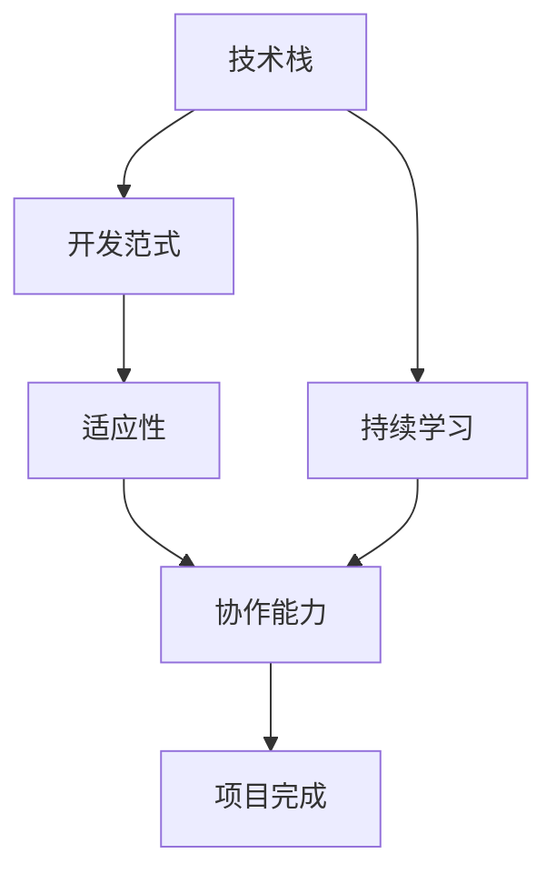

                 

# 程序员如何应对行业变革与转型

在技术高速发展的今天，各行各业都在经历着前所未有的变革与转型。对于程序员来说，这意味着需要不断学习和适应新的技术栈、编程范式和工作模式。本文将从行业变革的背景、核心概念与联系、核心算法原理与操作步骤、数学模型与公式讲解、项目实践、实际应用场景、工具与资源推荐、总结与展望等多个方面，全面系统地探讨程序员如何应对这些变革与转型。

## 1. 背景介绍

### 1.1 问题由来

随着信息技术的不断进步，互联网、大数据、人工智能等技术的发展，各行各业都在经历着深刻的变革与转型。特别是在IT领域，新的编程语言、开发框架、软件架构不断涌现，要求程序员必须具备更加广泛的技术栈和不断更新的知识体系。此外，随着数字化转型的加速，企业对IT的需求也不断增长，IT岗位的竞争也日趋激烈。

### 1.2 问题核心关键点

行业变革的核心关键点包括以下几个方面：
- **技术栈变化**：如从传统的C/C++转向Java、Python、JavaScript等现代编程语言，或从传统的Web开发转向微服务、Serverless架构等。
- **开发范式转变**：如从传统的瀑布模型转向敏捷开发、DevOps等新型开发模式。
- **技术工具更新**：如新的IDE、调试工具、版本控制系统等，都要求程序员适应新的工作流程和环境。
- **云计算普及**：云服务、容器化、自动化部署等新技术的普及，要求程序员掌握云基础设施操作。
- **人工智能兴起**：机器学习、深度学习、自然语言处理等AI技术的应用，要求程序员具备一定的AI知识。

## 2. 核心概念与联系

### 2.1 核心概念概述

为了更好地理解程序员如何应对行业变革与转型，本节将介绍几个密切相关的核心概念：

- **技术栈**：程序员在项目开发中使用的各种编程语言、框架、库和工具的总和。
- **开发范式**：程序员在开发项目时遵循的开发模式和最佳实践，如瀑布模型、敏捷开发、DevOps等。
- **持续学习**：程序员在职业生涯中不断学习和更新知识，以适应技术变化的过程。
- **适应性**：程序员能够快速适应新环境、新技术和新工作模式的能力。
- **协作能力**：程序员与团队成员协同工作，高效完成项目的能力。

这些核心概念之间的逻辑关系可以通过以下Mermaid流程图来展示：



这个流程图展示了几大核心概念之间的关系：

1. 技术栈是开发的基础，直接影响到开发范式的选择。
2. 持续学习使技术栈和开发范式不断更新，以适应新的技术变化。
3. 适应性是技术栈和开发范式在实际应用中的关键，要求程序员能够灵活运用。
4. 协作能力是团队中各成员之间高效配合的保障。
5. 最终，这些能力共同作用，使项目能够顺利完成。

## 3. 核心算法原理 & 具体操作步骤

### 3.1 算法原理概述

程序员应对行业变革与转型的过程，本质上是一个不断学习和适应的过程。其核心算法原理包括以下几个方面：

- **学习算法**：如知识图谱、推荐系统等，帮助程序员发现和掌握新技术。
- **迁移学习**：将已有经验迁移到新领域，提升学习效率。
- **强化学习**：通过不断试错和反馈，优化决策和行为。
- **适应性学习**：根据环境变化动态调整学习策略。
- **模型优化**：通过算法优化，提升模型性能，减少错误。

### 3.2 算法步骤详解

程序员应对行业变革与转型的操作步骤主要包括以下几个方面：

**Step 1: 评估自身技术栈**
- 识别当前使用的技术栈和技能点。
- 评估技术栈与行业变革趋势的匹配度。
- 识别技术栈中的薄弱环节。

**Step 2: 制定学习计划**
- 根据评估结果，制定针对薄弱环节的学习计划。
- 选择适合自身学习方式和节奏的学习资源。
- 设定短期和长期学习目标，并跟踪进度。

**Step 3: 实施技术迁移**
- 选择适合迁移的领域和任务。
- 理解迁移领域的基础知识和核心技术。
- 通过项目实践，逐步实现技术迁移。

**Step 4: 优化开发范式**
- 学习新的开发范式和最佳实践。
- 通过项目实践，验证新范式的有效性。
- 与团队协作，优化开发流程和工具链。

**Step 5: 强化协作能力**
- 通过沟通、培训和实践，提升团队协作能力。
- 学习使用协作工具和平台，提高工作效率。
- 定期评估协作效果，不断优化合作流程。

### 3.3 算法优缺点

持续学习和适应新技术具有以下优点：
1. 提升工作效率。掌握新技术能够显著提升开发速度和质量。
2. 增强职业竞争力。不断更新技术栈和技能点，保持竞争力。
3. 开拓新领域。学习新领域的知识，拓展职业发展路径。
4. 提升解决问题能力。通过技术迁移和学习，提升问题解决能力。

同时，这一过程也存在一些缺点：
1. 学习成本高。新技术的掌握需要时间和精力。
2. 不确定性高。技术变化快，难以预测趋势。
3. 心理负担大。面对快速变化的技术环境，容易产生焦虑。
4. 风险高。新技术可能存在不稳定因素，需要谨慎评估。

尽管如此，持续学习和适应新技术仍是程序员应对行业变革与转型的重要手段。未来相关研究的重点在于如何降低学习成本，提高学习效率，同时兼顾职业稳定性和心理承受能力。

### 3.4 算法应用领域

基于持续学习和适应性算法，程序员在多个领域都可以发挥重要作用：

- **云计算开发**：云计算基础设施的普及，要求程序员掌握云服务、容器化、自动化部署等技术。
- **人工智能应用**：机器学习、深度学习、自然语言处理等AI技术的应用，要求程序员具备一定的AI知识。
- **区块链开发**：区块链技术的发展，要求程序员了解加密、共识、智能合约等技术。
- **物联网应用**：物联网设备的操作系统、协议栈等开发，要求程序员掌握嵌入式系统和网络协议。
- **大数据处理**：大数据存储和处理技术的开发，要求程序员掌握Hadoop、Spark、Kafka等技术。

## 4. 数学模型和公式 & 详细讲解 & 举例说明

### 4.1 数学模型构建

本节将使用数学语言对程序员应对行业变革与转型的过程进行更加严格的刻画。

设程序员当前掌握的技术栈为 $S_0$，希望达到的新技术栈为 $S_T$。设 $C_0$ 为当前技术的熟练度，$C_T$ 为新技术的期望熟练度。设 $T$ 为学习时间，$L$ 为学习效率。

则模型的目标是最小化时间 $T$，满足：

$$
T = \min_{L} \int_{C_0}^{C_T} \frac{1}{L} \, dc
$$

其中 $c$ 表示技术熟练度。

### 4.2 公式推导过程

为了求解上述最优化问题，可以采用以下方法：

设当前技术熟练度为 $C_0$，学习时间 $T$ 与学习效率 $L$ 的关系为 $T = \frac{C_T - C_0}{L}$。则目标函数为：

$$
\min_{L} T = \min_{L} \frac{C_T - C_0}{L}
$$

将目标函数对 $L$ 求导，得：

$$
\frac{dT}{dL} = -\frac{C_T - C_0}{L^2}
$$

令 $\frac{dT}{dL} = 0$，得 $L = \sqrt{C_T - C_0}$。

因此，当 $L = \sqrt{C_T - C_0}$ 时，学习时间 $T$ 最小，即学习效率与目标差距的平方根相等时，学习效率最优。

### 4.3 案例分析与讲解

以Python开发者的转型为例：

- 当前技术栈为C/C++，Python熟练度 $C_0 = 0$。
- 目标技术栈为Python + React，期望熟练度 $C_T = 1$。
- 假设学习效率 $L = 0.1$。

根据公式推导，需要 $T = \frac{1 - 0}{0.1} = 10$ 小时。因此，每天学习1小时，需要10天达到目标熟练度。

## 5. 项目实践：代码实例和详细解释说明

### 5.1 开发环境搭建

在进行技术转型和持续学习的过程中，开发环境搭建是非常关键的一步。以下是Python开发环境的搭建步骤：

1. 安装Anaconda：从官网下载并安装Anaconda，用于创建独立的Python环境。
2. 创建并激活虚拟环境：
```bash
conda create -n pyenv python=3.8
conda activate pyenv
```
3. 安装PyTorch、TensorFlow等常用库：
```bash
conda install pytorch torchvision torchaudio cudatoolkit=11.1 -c pytorch -c conda-forge
pip install tensorflow==2.6.0
```

### 5.2 源代码详细实现

以下是一个Python学习计划的示例代码实现：

```python
import datetime

def learn_plan(plan, start_date):
    current_date = datetime.date.today()
    remaining_days = (current_date - start_date).days
    remaining_learning_days = int(remaining_days / 7)
    print(f"Total remaining learning days: {remaining_learning_days}")
    print(f"Weeks remaining: {remaining_learning_days // 7}")
    print(f"Remaining days: {remaining_learning_days % 7}")

start_date = datetime.date(2023, 1, 1)
plan = {
    "weeks": {
        "2023-01-01": ["Python基础", "React基础", "Docker基础"],
        "2023-01-08": ["Python进阶", "React进阶", "Kubernetes基础"],
        "2023-01-15": ["PyTorch入门", "TensorFlow入门", "机器学习基础"],
        "2023-01-22": ["深度学习", "自然语言处理", "强化学习基础"],
        "2023-01-29": ["人工智能应用", "大数据处理", "区块链基础"],
        "2023-02-05": ["云计算开发", "物联网开发", "区块链应用"],
        "2023-02-12": ["最新技术动态", "项目实践", "专业发展"]
    }
}

learn_plan(plan, start_date)
```

### 5.3 代码解读与分析

**learn_plan函数**：
- 定义了一个学习计划，计划中包含了每周的学习内容。
- 计算当前日期与计划开始日期之间剩余的天数。
- 将天数转换为剩余学习周数和剩余天数，并打印输出。

通过上述代码，我们可以制定一个详细周密的学习计划，并通过代码计算剩余学习时间。

## 6. 实际应用场景

### 6.1 云计算开发

在云计算普及的背景下，掌握云服务、容器化、自动化部署等技术，成为程序员的必备能力。例如，使用Docker和Kubernetes进行应用容器化部署，使用云服务如AWS、Azure、Google Cloud等提供基础设施服务，使用CI/CD工具如Jenkins、GitLab CI等进行自动化部署和持续集成。

### 6.2 人工智能应用

机器学习、深度学习、自然语言处理等AI技术的应用，要求程序员具备一定的AI知识。例如，使用TensorFlow、PyTorch等框架进行模型训练和推理，使用NLP库如NLTK、SpaCy进行文本处理，使用数据可视化工具如Matplotlib、Seaborn进行数据分析。

### 6.3 区块链开发

区块链技术的发展，要求程序员了解加密、共识、智能合约等技术。例如，使用Solidity进行智能合约开发，使用以太坊等区块链平台进行应用部署，使用Hyperledger等开源框架进行区块链网络搭建。

### 6.4 物联网应用

物联网设备的操作系统、协议栈等开发，要求程序员掌握嵌入式系统和网络协议。例如，使用RTOS进行嵌入式系统开发，使用MQTT、CoAP等协议进行设备通信，使用传感器和硬件开发工具如Arduino、Raspberry Pi进行物联网设备开发。

### 6.5 大数据处理

大数据存储和处理技术的开发，要求程序员掌握Hadoop、Spark、Kafka等技术。例如，使用Hadoop进行分布式存储，使用Spark进行大数据处理和分析，使用Kafka进行实时数据流处理。

## 7. 工具和资源推荐

### 7.1 学习资源推荐

为了帮助程序员系统掌握新技术，这里推荐一些优质的学习资源：

1. Coursera：提供大量在线课程，涵盖编程语言、开发框架、云计算、人工智能等多个领域。
2. Udacity：提供项目导向的编程课程，涵盖全栈开发、数据分析、机器学习等多个方向。
3. edX：提供高质量的在线课程，涵盖计算机科学、数据科学、人工智能等多个领域。
4. 《Clean Code》：一本经典的编程风格指南，帮助程序员写出清晰、可读、可维护的代码。
5. 《Design Patterns》：一本经典的面向对象编程设计模式书，帮助程序员设计出优雅、高效的代码结构。
6. GitHub：一个开源社区，提供丰富的代码示例和项目，帮助程序员学习新技术。

### 7.2 开发工具推荐

高效的开发离不开优秀的工具支持。以下是几款用于程序员应对行业变革与转型的常用工具：

1. Visual Studio Code：一个轻量级、功能强大的IDE，支持多种编程语言和框架。
2. Git：版本控制系统，支持多人协作开发和代码版本管理。
3. Docker：一个容器化工具，方便应用程序的打包、部署和分发。
4. Kubernetes：一个容器编排系统，支持大规模的容器集群管理。
5. Jenkins：一个持续集成和持续部署工具，支持自动化构建和测试。
6. Terraform：一个云基础设施即代码工具，支持多云平台的资源管理。

### 7.3 相关论文推荐

为了深入了解程序员应对行业变革与转型的理论基础，推荐阅读以下几篇论文：

1. "Mastering the Art of Programming" by Donald Knuth：介绍编程中的经典原则和最佳实践，是程序员学习的必读书籍。
2. "Code Complete" by Steve McConnell：介绍软件开发的全面指南，涵盖编码、测试、维护等多个方面。
3. "The Pragmatic Programmer" by Andrew Hunt and David Thomas：介绍程序员的日常工作习惯和技巧，提升编程效率和质量。
4. "Design Patterns" by Erich Gamma et al.：介绍软件设计模式，帮助程序员设计出优雅、高效的代码结构。
5. "Clean Code" by Robert C. Martin：介绍编程风格的经典指南，帮助程序员写出清晰、可读、可维护的代码。

## 8. 总结：未来发展趋势与挑战

### 8.1 总结

本文对程序员应对行业变革与转型的过程进行了全面系统的介绍。首先阐述了行业变革的背景和核心关键点，明确了持续学习和适应新技术的重要性。其次，从算法原理和操作步骤，详细讲解了持续学习和适应性算法的原理和实施方法。最后，从实际应用场景、工具与资源推荐等多个方面，提供了全面的技术指引。

通过本文的系统梳理，可以看到，持续学习和适应新技术是程序员应对行业变革与转型的重要手段。这一过程需要不断评估自身技术栈，制定学习计划，实施技术迁移，优化开发范式，提升协作能力。只有通过持续学习和适应，程序员才能不断提升自身竞争力，适应快速变化的技术环境，赢得职业生涯的竞争优势。

### 8.2 未来发展趋势

展望未来，程序员应对行业变革与转型的趋势将呈现以下几个方向：

1. **多领域交叉**：云计算、人工智能、大数据、物联网等领域的深度融合，要求程序员具备多领域交叉的知识和技能。
2. **自动化与AI结合**：自动化开发工具和AI技术的结合，将使程序员的工作效率大幅提升。
3. **持续学习与终身教育**：终身学习将成为程序员必备的能力，需要不断更新知识，掌握新技能。
4. **协作与远程工作**：远程工作、跨团队协作将成为常态，程序员需要具备良好的沟通和协作能力。
5. **人机协同**：人机协同的智能系统将成为未来的重要趋势，程序员需要具备一定的AI知识和技能。

### 8.3 面临的挑战

尽管持续学习和适应新技术是程序员应对行业变革与转型的重要手段，但在这一过程中仍面临诸多挑战：

1. **学习成本高**：新技术的掌握需要时间和精力，对个人能力要求高。
2. **技术变化快**：快速变化的技术环境，难以预测和适应。
3. **心理负担大**：面对技术更新和行业变革，容易产生焦虑和压力。
4. **资源投入大**：学习新技术需要投入大量的时间、金钱和精力。
5. **风险高**：新技术可能存在不稳定因素，需要谨慎评估和选择。

### 8.4 研究展望

为了更好地应对行业变革与转型，未来研究需要在以下几个方面进行探索：

1. **个性化学习路径**：根据个人背景和兴趣，生成个性化的学习路径和计划。
2. **自适应学习算法**：开发自适应学习算法，根据学习效果动态调整学习策略。
3. **技术预判与预警**：建立技术预判和预警机制，帮助程序员及时发现和适应新技术。
4. **心理健康支持**：提供心理支持和辅导，帮助程序员应对心理压力和学习焦虑。
5. **多领域知识整合**：开发多领域知识整合工具，帮助程序员将不同领域的知识进行综合运用。

这些研究方向将有助于程序员更好地应对行业变革与转型，提升自身竞争力，实现职业发展。

## 9. 附录：常见问题与解答

**Q1：如何选择合适的学习资源？**

A: 选择学习资源时，需要考虑以下几个方面：
1. 资源的质量和可靠性：选择权威机构的课程和书籍。
2. 资源的内容覆盖：选择全面覆盖技术栈的课程和书籍。
3. 资源的互动性：选择有互动和练习的课程和书籍。
4. 资源的适用性：选择适合自己学习风格和节奏的资源。

**Q2：如何平衡学习与工作？**

A: 平衡学习与工作可以从以下几个方面入手：
1. 制定合理的学习计划，每天固定时间进行学习。
2. 利用碎片时间进行学习，如上下班路上、午休时间等。
3. 优先选择对自己职业发展有帮助的技术进行学习。
4. 学会拒绝无关紧要的事情，提高工作效率。

**Q3：如何应对学习过程中的困难？**

A: 学习过程中难免会遇到困难，可以采取以下措施：
1. 主动寻求帮助：向同事、社区、导师寻求帮助和指导。
2. 多实践和调试：通过项目实践和调试，深入理解知识点。
3. 交流和讨论：加入技术社区和论坛，与他人交流讨论。
4. 持续学习和反思：不断总结和反思学习过程中的问题。

**Q4：如何提升学习效率？**

A: 提升学习效率可以从以下几个方面入手：
1. 设定明确的学习目标：明确学习目标和计划，避免盲目学习。
2. 分解学习任务：将学习任务分解为小的、可执行的部分。
3. 利用学习工具：使用学习工具如Anki、Quizlet等进行记忆和测试。
4. 结合实践学习：通过项目实践和案例学习，深入理解知识点。

**Q5：如何保持学习动力？**

A: 保持学习动力可以从以下几个方面入手：
1. 设定长期目标：设定明确的长期目标，保持持续动力。
2. 奖励自己：设定阶段性奖励，如完成学习任务后给自己一个小奖励。
3. 记录学习进展：记录学习进展和成就，增强自我认可感。
4. 寻找学习伙伴：与他人一起学习，相互监督和鼓励。

---

作者：禅与计算机程序设计艺术 / Zen and the Art of Computer Programming

