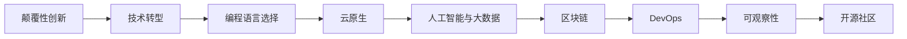

                 

# 程序员如何应对行业颠覆与新技术浪潮

> 关键词：颠覆性创新, 技术转型, 编程语言, 云原生, 人工智能, 大数据, 区块链, 可观察性, 开源社区

## 1. 背景介绍

### 1.1 问题由来

在信息技术快速发展的今天，行业颠覆与新技术浪潮已逐渐成为常态。持续的技术演进使得以往稳定发展的技术栈、编程范式和开发流程面临巨大的挑战。无论是在软件开发领域，还是在基础设施管理方面，程序员都需时刻关注最新趋势，以保持自己的竞争力。

技术栈的更新迭代、编程语言的进步和新兴技术的涌现，如云计算、人工智能、大数据、区块链、DevOps和微服务等，不断推动着程序员适应变化，学习新的技能和工具。然而，在快速变化的技术环境中，如何有效应对这些挑战，以及如何从中受益，成为了每一位程序员必须面对的课题。

### 1.2 问题核心关键点

在当前的技术环境中，程序员需要具备跨领域、多层次的技术理解和应用能力。以下关键点概括了程序员面对行业颠覆与新技术浪潮的核心问题：

1. **技术栈的快速演进**：新技术层出不穷，程序员需要紧跟行业前沿，持续学习新技能。
2. **编程语言的选择与切换**：如何在不同编程语言之间高效切换，掌握多种语言的特点和用途。
3. **云计算与微服务架构**：云计算的普及与微服务架构的推广，改变了传统应用开发和部署方式。
4. **人工智能与大数据**：机器学习和大数据技术的广泛应用，为软件开发带来了新的思维方式和处理模式。
5. **区块链技术**：区块链的去中心化和不可篡改特性，为数据安全和信任机制带来了新的解决方案。
6. **DevOps文化**：持续交付和自动化测试等DevOps实践，改变了传统的软件开发生命周期。
7. **可观察性**：在复杂系统中追踪和理解应用程序行为的需求日益增加，可观察性成为关键技术之一。
8. **开源社区的贡献与合作**：开源社区的蓬勃发展为程序员提供了丰富的资源和合作机会，参与开源项目成为提升技术能力的有效途径。

理解并应对这些关键点，有助于程序员更好地适应技术变化，发挥个人和团队的最大潜力。

## 2. 核心概念与联系

### 2.1 核心概念概述

为了更好地应对行业颠覆与新技术浪潮，我们需深入理解以下核心概念：

- **颠覆性创新**：在技术领域，颠覆性创新指新技术的出现彻底改变原有市场和技术格局的现象。其通常具有显著的性能提升、全新的应用场景和广泛的市场影响力。
- **技术转型**：指技术团队或个人从一种技术范式切换到另一种技术范式的过程。这一过程中，不仅需要学习新知识，还需调整原有的工作流程和团队结构。
- **编程语言**：作为软件开发的基础工具，编程语言的选择和掌握对开发效率、代码质量和维护成本有重大影响。
- **云原生**：云原生技术旨在实现可扩展性、弹性和高性能的应用开发和部署，包括容器化、微服务、声明式API等。
- **人工智能与大数据**：通过数据驱动的算法和模型，AI和大数据帮助实现更精准的决策和预测。
- **区块链**：基于去中心化和分布式账本技术的区块链，提供了安全、透明和可追溯的交易记录。
- **DevOps**：DevOps文化强调开发与运维的紧密合作，通过自动化和持续集成/持续交付（CI/CD）提升软件交付效率。
- **可观察性**：通过收集、处理和分析应用程序运行数据，可观察性帮助开发者诊断和优化系统性能。
- **开源社区**：开源社区汇聚了全球的开发者和专家，为技术创新和知识共享提供了平台。

这些核心概念相互关联，构成了技术发展的基本框架。理解并掌握这些概念，是应对行业颠覆与新技术浪潮的基础。

### 2.2 核心概念原理和架构的 Mermaid 流程图



此流程图展示了技术转型过程中各关键概念之间的联系和依赖关系。开发者应从颠覆性创新入手，逐步适应技术转型，选择适合的编程语言，掌握云原生、AI与大数据、区块链、DevOps、可观察性和开源社区等关键技术。

## 3. 核心算法原理 & 具体操作步骤

### 3.1 算法原理概述

面对行业颠覆与新技术浪潮，程序员需要具备跨领域、多层次的技术理解和应用能力。以下是核心算法原理与具体操作步骤的详细分析：

- **颠覆性创新应对策略**：
  - **快速学习和适应**：持续关注行业趋势，通过在线课程、技术博客、会议等方式学习新知识。
  - **技能迁移**：将现有技能迁移至新技术中，如从Web开发到移动应用的迁移。
  - **项目实践**：通过实际项目应用新技术，积累经验并发现新问题。

- **技术转型具体操作步骤**：
  - **评估技术栈**：评估现有技术栈的优缺点，明确转型方向。
  - **制定转型计划**：分阶段制定转型计划，设定里程碑和目标。
  - **培训和评估**：提供员工培训，评估转型过程中遇到的问题和挑战。
  - **技术评估**：通过技术评估确定哪些技术值得保留，哪些需要淘汰或替换。
  - **项目管理**：采用敏捷开发和持续集成/持续交付（CI/CD）管理转型项目。

- **编程语言选择与切换**：
  - **识别需求**：根据项目需求选择合适的编程语言。
  - **学习曲线评估**：评估不同语言的学习曲线，选择更易上手的语言。
  - **切换实践**：通过小规模项目或插件形式逐步切换语言，减少风险。

- **云原生和微服务架构**：
  - **容器化**：采用容器技术（如Docker、Kubernetes）管理应用。
  - **微服务架构**：设计可扩展、弹性的微服务系统，使用API网关和配置管理工具。
  - **自动化部署**：使用CI/CD工具（如Jenkins、GitLab CI）实现自动化部署和测试。

- **人工智能与大数据**：
  - **数据准备**：收集和清洗数据，准备用于机器学习和数据分析的输入。
  - **算法选择**：根据项目需求选择合适的算法和模型。
  - **模型训练与评估**：使用GPU加速训练，评估模型性能并进行优化。

- **区块链技术**：
  - **共识机制理解**：理解区块链的共识机制（如PoW、PoS、DPoS）。
  - **智能合约开发**：开发智能合约并进行测试。
  - **去中心化应用（DApp）构建**：构建基于区块链的去中心化应用。

- **DevOps文化**：
  - **持续集成**：使用CI工具（如Jenkins、GitLab CI）自动化构建和测试。
  - **持续交付**：使用CD工具（如Jenkins、GitLab CI）自动化部署和发布。
  - **监控与报警**：使用监控工具（如Prometheus、Grafana）监控系统性能，设置报警机制。

- **可观察性**：
  - **数据收集**：收集应用性能、日志和事件数据。
  - **数据分析**：使用数据可视化工具（如Grafana、Kibana）分析数据。
  - **性能优化**：根据分析结果优化应用性能。

- **开源社区**：
  - **资源共享**：通过Github、Stack Overflow等平台分享代码和经验。
  - **合作贡献**：参与开源项目，通过贡献代码和文档提升个人影响力。
  - **社区交流**：积极参与技术社区的讨论和活动，建立专业网络。

### 3.2 算法步骤详解

以下详细介绍各个关键操作的具体步骤：

#### 颠覆性创新应对策略

1. **快速学习和适应**：
   - 定期阅读技术博客和书籍，关注技术社区和论坛，如GitHub、Stack Overflow、Stack Exchange等。
   - 参加线上和线下技术会议，学习新技术和最佳实践。
   - 加入在线课程，如Coursera、Udacity、edX等平台提供的最新课程。

2. **技能迁移**：
   - 分析已有技能与新技能之间的共通点，寻找转换路径。
   - 设计过渡项目，逐步迁移技能和工具，减少新旧技术之间的鸿沟。
   - 制定详细的迁移计划，包括时间表、资源分配和评估标准。

3. **项目实践**：
   - 选择合适的试点项目，逐步引入新技术。
   - 通过迭代开发，验证新技术的可行性和效果。
   - 收集反馈和数据，持续优化和改进。

#### 技术转型具体操作步骤

1. **评估技术栈**：
   - 列出当前使用的所有技术栈，包括编程语言、框架、工具和库。
   - 分析现有技术的优缺点，识别潜在的技术债务和瓶颈。
   - 确定转型目标和方向，选择适合的新技术栈。

2. **制定转型计划**：
   - 制定分阶段的转型计划，设定短期、中期和长期目标。
   - 确定关键的里程碑和评估指标，确保转型进展可控。
   - 配置资源和人员，确保转型过程顺利进行。

3. **培训和评估**：
   - 提供员工培训，传授新技能和工具的使用方法。
   - 评估员工的学习效果和转型进展，提供个性化辅导和支持。
   - 持续收集反馈，调整培训计划和转型策略。

4. **技术评估**：
   - 评估现有技术在新环境中的表现和效果。
   - 确定哪些技术值得保留，哪些需要淘汰或替换。
   - 制定详细的技术迁移策略，避免迁移过程中的技术断层。

5. **项目管理**：
   - 使用敏捷开发方法，通过迭代和持续集成（CI）管理转型项目。
   - 使用持续交付（CD）工具，自动化部署和测试新功能。
   - 监控项目进度和质量，及时调整策略和资源。

#### 编程语言选择与切换

1. **识别需求**：
   - 根据项目需求，识别现有语言的不足和改进点。
   - 评估新语言的性能、易用性和生态系统。

2. **学习曲线评估**：
   - 分析不同语言的学习曲线，选择更易上手的语言。
   - 设计学习路径，逐步掌握新语言的特性和最佳实践。

3. **切换实践**：
   - 在小规模项目或插件形式中逐步引入新语言。
   - 记录切换过程中的问题和挑战，积累经验教训。
   - 逐步扩大切换范围，最终全面切换到新语言。

#### 云原生和微服务架构

1. **容器化**：
   - 使用Docker创建容器，管理应用依赖和环境。
   - 使用Kubernetes管理容器集群，实现负载均衡和故障恢复。

2. **微服务架构**：
   - 设计可扩展、弹性的微服务系统，使用API网关和配置管理工具。
   - 采用服务发现和负载均衡策略，优化微服务之间的通信。

3. **自动化部署**：
   - 使用CI/CD工具（如Jenkins、GitLab CI）自动化构建和部署。
   - 设置自动化测试流程，确保新功能符合质量标准。

#### 人工智能与大数据

1. **数据准备**：
   - 收集和清洗数据，准备用于机器学习和数据分析的输入。
   - 使用数据清洗工具（如Pandas、Apache Spark）处理数据。

2. **算法选择**：
   - 根据项目需求，选择合适的算法和模型。
   - 评估不同算法的性能和适用性，选择最佳方案。

3. **模型训练与评估**：
   - 使用GPU加速训练，优化模型性能。
   - 使用交叉验证和超参数调优技术，提升模型精度。

#### 区块链技术

1. **共识机制理解**：
   - 理解区块链的共识机制（如PoW、PoS、DPoS）。
   - 学习区块链的底层技术，如分布式账本、智能合约和共识协议。

2. **智能合约开发**：
   - 使用Solidity等智能合约语言编写合约代码。
   - 进行合约测试，确保合约功能正确和安全性。

3. **去中心化应用（DApp）构建**：
   - 使用Web3.js等工具开发DApp客户端。
   - 部署DApp到区块链网络，进行用户测试和迭代优化。

#### DevOps文化

1. **持续集成**：
   - 使用CI工具（如Jenkins、GitLab CI）自动化构建和测试。
   - 设置自动化测试流程，确保新功能符合质量标准。

2. **持续交付**：
   - 使用CD工具（如Jenkins、GitLab CI）自动化部署和发布。
   - 监控部署过程中的问题，及时回滚和修复。

3. **监控与报警**：
   - 使用监控工具（如Prometheus、Grafana）监控系统性能。
   - 设置报警机制，及时处理系统异常和故障。

#### 可观察性

1. **数据收集**：
   - 收集应用性能、日志和事件数据。
   - 使用日志聚合工具（如ELK Stack、Splunk）收集和分析日志数据。

2. **数据分析**：
   - 使用数据可视化工具（如Grafana、Kibana）分析数据。
   - 设置数据仪表盘，实时监控应用性能和健康状况。

3. **性能优化**：
   - 根据分析结果，优化应用性能。
   - 持续收集和分析数据，不断改进系统性能。

#### 开源社区

1. **资源共享**：
   - 通过Github、Stack Overflow等平台分享代码和经验。
   - 参与开源社区的讨论和活动，建立专业网络。

2. **合作贡献**：
   - 参与开源项目，通过贡献代码和文档提升个人影响力。
   - 积极维护和改进开源项目，建立个人品牌。

3. **社区交流**：
   - 参加技术社区的讨论和活动，分享个人经验和见解。
   - 建立个人和团队的专业网络，获取更多资源和支持。

### 3.3 算法优缺点

#### 颠覆性创新应对策略

**优点**：
- **快速适应**：通过持续学习，快速掌握新技术，保持竞争力。
- **全面转型**：通过系统性评估和规划，确保转型过程顺利进行。
- **技能迁移**：通过渐进式学习，降低新技能学习和适应的难度。

**缺点**：
- **学习成本高**：需要投入大量时间和精力学习新知识。
- **短期风险大**：转型过程中可能遇到技术断层和资源短缺问题。
- **管理复杂**：需要制定详细的转型计划和评估标准，管理难度较大。

#### 技术转型具体操作步骤

**优点**：
- **系统性规划**：通过分阶段的规划，确保转型过程顺利进行。
- **资源优化**：通过资源分配和人员培训，提升团队的协作效率。
- **持续改进**：通过持续收集反馈和数据，不断优化和改进系统。

**缺点**：
- **管理复杂**：需要制定详细的转型计划和评估标准，管理难度较大。
- **资源投入高**：需要大量资源进行培训和评估，可能面临资源短缺问题。
- **风险管理**：需要设定明确的里程碑和评估指标，管理转型风险。

#### 编程语言选择与切换

**优点**：
- **灵活性高**：通过渐进式学习，降低新技能学习和适应的难度。
- **经验积累**：通过小规模项目或插件形式逐步切换语言，积累经验教训。
- **可控性强**：通过详细的迁移计划和评估标准，确保迁移过程顺利进行。

**缺点**：
- **学习成本高**：需要投入大量时间和精力学习新语言。
- **切换风险大**：在切换过程中可能遇到兼容性问题和技术断层。
- **资源投入高**：需要大量资源进行培训和评估，可能面临资源短缺问题。

#### 云原生和微服务架构

**优点**：
- **可扩展性高**：通过容器化和管理工具，实现应用的可扩展和弹性。
- **自动化高**：通过CI/CD工具，实现自动化构建和部署。
- **监控高效**：通过监控工具，实时监控系统性能和健康状况。

**缺点**：
- **复杂度高**：需要学习容器化和微服务架构的知识，管理难度较大。
- **资源投入高**：需要大量资源进行容器部署和管理，可能面临资源短缺问题。
- **成本高**：需要支付容器和云服务费用，成本较高。

#### 人工智能与大数据

**优点**：
- **决策精准**：通过数据驱动的算法和模型，实现更精准的决策和预测。
- **应用广泛**：可以应用于各种领域，如金融、医疗、电商等。
- **技术先进**：通过先进的算法和模型，提升应用性能和用户体验。

**缺点**：
- **数据需求高**：需要大量高质量的数据进行训练和分析。
- **技术复杂**：需要掌握复杂的算法和模型，技术难度较大。
- **资源投入高**：需要大量计算资源进行模型训练和优化，成本较高。

#### 区块链技术

**优点**：
- **安全性高**：通过去中心化和分布式账本技术，提高数据的安全性和透明性。
- **可信任性高**：通过智能合约和共识协议，实现交易的可信性和不可篡改性。
- **创新性强**：可以应用于各种创新场景，如供应链、投票、金融等。

**缺点**：
- **技术复杂**：需要掌握区块链的底层技术和共识机制，技术难度较大。
- **性能瓶颈**：区块链的性能可能受到网络延迟和交易费用等问题的限制。
- **成本高**：需要支付区块链网络的费用，成本较高。

#### DevOps文化

**优点**：
- **交付高效**：通过CI/CD工具，实现自动化构建和部署。
- **监控高效**：通过监控工具，实时监控系统性能和健康状况。
- **反馈及时**：通过持续集成和交付，及时收集和处理反馈。

**缺点**：
- **管理复杂**：需要掌握CI/CD和监控工具的使用，管理难度较大。
- **资源投入高**：需要大量资源进行自动化部署和管理，可能面临资源短缺问题。
- **学习成本高**：需要投入大量时间和精力学习新工具和方法。

#### 可观察性

**优点**：
- **问题快速定位**：通过收集和分析数据，快速定位和解决系统问题。
- **性能优化**：通过数据分析，优化应用性能和用户体验。
- **决策支持**：通过数据洞察，辅助决策和策略制定。

**缺点**：
- **数据量大**：需要处理和分析大量数据，可能面临性能瓶颈。
- **技术复杂**：需要掌握数据收集和分析工具，技术难度较大。
- **资源投入高**：需要大量资源进行数据收集和分析，可能面临资源短缺问题。

#### 开源社区

**优点**：
- **资源丰富**：通过开源社区获取丰富的资源和工具。
- **交流便捷**：通过社区平台进行交流和合作，获取更多支持和建议。
- **提升影响力**：通过贡献代码和文档，提升个人和团队的专业影响力。

**缺点**：
- **技术复杂**：需要掌握开源项目的技术和最佳实践，技术难度较大。
- **时间投入高**：需要大量时间进行项目贡献和社区交流，可能面临时间压力。
- **合作难度大**：需要与全球开发者进行协作，可能面临沟通和文化差异。

### 3.4 算法应用领域

技术转型和颠覆性创新在多个领域得到了广泛应用。以下是关键应用领域的详细分析：

#### 软件开发与维护

- **颠覆性创新应对策略**：持续关注新技术和最佳实践，通过在线课程和社区交流学习新知识。
- **技术转型具体操作步骤**：评估现有技术栈，制定详细的转型计划，进行人员培训和评估。
- **编程语言选择与切换**：根据项目需求选择合适的编程语言，通过渐进式学习逐步切换语言。

#### 基础设施管理

- **云原生和微服务架构**：采用容器化和微服务架构，实现应用的可扩展和弹性。
- **DevOps文化**：通过CI/CD工具，实现自动化构建和部署，监控系统性能和健康状况。

#### 数据分析与人工智能

- **人工智能与大数据**：使用数据驱动的算法和模型，实现更精准的决策和预测。
- **区块链技术**：通过去中心化和分布式账本技术，提高数据的安全性和透明性。

#### 移动应用开发

- **颠覆性创新应对策略**：关注移动应用技术和市场趋势，通过学习新知识提升竞争力。
- **技术转型具体操作步骤**：评估现有技术栈，制定详细的转型计划，进行人员培训和评估。
- **编程语言选择与切换**：根据项目需求选择合适的编程语言，通过渐进式学习逐步切换语言。

#### 网络安全

- **区块链技术**：通过去中心化和分布式账本技术，提高数据的安全性和透明性。
- **DevOps文化**：通过CI/CD工具，实现自动化构建和部署，监控系统性能和健康状况。

#### 医疗健康

- **人工智能与大数据**：使用数据驱动的算法和模型，实现更精准的诊断和预测。
- **区块链技术**：通过去中心化和分布式账本技术，保护患者数据隐私和安全。

## 4. 数学模型和公式 & 详细讲解 & 举例说明

### 4.1 数学模型构建

在技术转型和颠覆性创新过程中，数学模型和公式的应用至关重要。以下是关键数学模型和公式的详细构建和讲解：

#### 颠覆性创新应对策略

**学习曲线评估模型**：
$$
C = \frac{t}{\ln{t}} + \frac{1}{\ln{t}}
$$
其中，$C$为学习曲线，$t$为学习时间。该模型评估了不同学习曲线的时间成本。

**技能迁移模型**：
$$
\Delta_{A \rightarrow B} = \frac{1}{1 - \text{similarity}(A,B)}
$$
其中，$\Delta_{A \rightarrow B}$为技能迁移难度，similarity(A,B)为A和B技能之间的相似度。该模型通过相似度评估技能迁移的难度。

#### 技术转型具体操作步骤

**转型成本模型**：
$$
C_{\text{transform}} = \sum_{i=1}^n (t_i \times c_i)
$$
其中，$C_{\text{transform}}$为转型成本，$t_i$为第$i$阶段的转型时间，$c_i$为第$i$阶段的成本。该模型计算转型过程的总成本。

**评估指标模型**：
$$
E = \frac{1}{N} \sum_{i=1}^N (F_i - F_{\text{expected}})
$$
其中，$E$为评估指标，$F_i$为第$i$阶段的任务完成度，$F_{\text{expected}}$为预期完成度。该模型评估转型过程的完成度。

#### 编程语言选择与切换

**语言性能模型**：
$$
P = \frac{S}{C}
$$
其中，$P$为编程语言性能，$S$为编程语言的优势特性，$C$为编程语言的劣势特性。该模型评估编程语言的整体性能。

**迁移风险模型**：
$$
R = \frac{D}{S}
$$
其中，$R$为迁移风险，$D$为迁移过程中遇到的技术断层，$S$为现有技术栈的稳定性。该模型评估迁移过程中的风险。

#### 云原生和微服务架构

**容器资源管理模型**：
$$
R = \frac{D}{C}
$$
其中，$R$为资源使用率，$D$为容器分配的资源，$C$为实际使用的资源。该模型评估资源使用率。

**微服务架构复杂性模型**：
$$
C = \frac{M}{N}
$$
其中，$C$为微服务架构复杂性，$M$为微服务的数量，$N$为服务的耦合度。该模型评估微服务架构的复杂性。

#### 人工智能与大数据

**模型精度评估模型**：
$$
P = \frac{A}{B}
$$
其中，$P$为模型精度，$A$为模型的准确率，$B$为模型的召回率。该模型评估模型的预测性能。

**数据需求模型**：
$$
D = C \times T \times N
$$
其中，$D$为数据需求，$C$为模型训练次数，$T$为每次训练所需数据量，$N$为训练轮数。该模型计算数据需求量。

#### 区块链技术

**共识机制性能模型**：
$$
P = \frac{R}{D}
$$
其中，$P$为共识机制性能，$R$为每秒处理交易量，$D$为网络延迟。该模型评估共识机制的性能。

**智能合约安全性模型**：
$$
S = \frac{F}{V}
$$
其中，$S$为智能合约安全性，$F$为合约漏洞数量，$V$为代码审查次数。该模型评估智能合约的安全性。

#### DevOps文化

**CI/CD效率模型**：
$$
E = \frac{T_{\text{build}} + T_{\text{test}} + T_{\text{deploy}}}{T_{\text{total}}}
$$
其中，$E$为CI/CD效率，$T_{\text{build}}$为构建时间，$T_{\text{test}}$为测试时间，$T_{\text{deploy}}$为部署时间，$T_{\text{total}}$为总时间。该模型评估CI/CD效率。

**监控性能模型**：
$$
P = \frac{T_{\text{monitor}}}{T_{\text{total}}}
$$
其中，$P$为监控性能，$T_{\text{monitor}}$为监控时间，$T_{\text{total}}$为总时间。该模型评估监控性能。

#### 可观察性

**数据处理模型**：
$$
D = \frac{R}{S}
$$
其中，$D$为数据处理量，$R$为每秒处理事件数，$S$为处理每个事件所需的资源。该模型评估数据处理量。

**性能优化模型**：
$$
P = \frac{A}{B}
$$
其中，$P$为性能优化效果，$A$为优化后的系统性能提升，$B$为优化前后的系统性能差距。该模型评估性能优化效果。

#### 开源社区

**贡献影响力模型**：
$$
I = \frac{C}{L}
$$
其中，$I$为贡献影响力，$C$为贡献的代码行数，$L$为社区总代码行数。该模型评估贡献影响力。

**社区影响力模型**：
$$
C = \frac{N}{M}
$$
其中，$C$为社区影响力，$N$为社区活跃用户数，$M$为社区总用户数。该模型评估社区影响力。

### 4.2 公式推导过程

#### 颠覆性创新应对策略

**学习曲线评估模型推导**：
通过Lambert W函数和自然对数，可以将学习曲线模型简化为：
$$
C = \frac{t}{\ln{t}} + \frac{1}{\ln{t}}
$$
该模型用于评估不同学习曲线的时间成本。

**技能迁移模型推导**：
通过相似度计算，可以将技能迁移模型简化为：
$$
\Delta_{A \rightarrow B} = \frac{1}{1 - \text{similarity}(A,B)}
$$
该模型用于评估技能迁移的难度。

#### 技术转型具体操作步骤

**转型成本模型推导**：
通过迭代求和，可以将转型成本模型简化为：
$$
C_{\text{transform}} = \sum_{i=1}^n (t_i \times c_i)
$$
该模型用于计算转型过程的总成本。

**评估指标模型推导**：
通过平均值计算，可以将评估指标模型简化为：
$$
E = \frac{1}{N} \sum_{i=1}^N (F_i - F_{\text{expected}})
$$
该模型用于评估转型过程的完成度。

#### 编程语言选择与切换

**语言性能模型推导**：
通过加权平均，可以将编程语言性能模型简化为：
$$
P = \frac{S}{C}
$$
该模型用于评估编程语言的整体性能。

**迁移风险模型推导**：
通过相似度计算，可以将迁移风险模型简化为：
$$
R = \frac{D}{S}
$$
该模型用于评估迁移过程中的风险。

#### 云原生和微服务架构

**容器资源管理模型推导**：
通过资源分配，可以将容器资源管理模型简化为：
$$
R = \frac{D}{C}
$$
该模型用于评估资源使用率。

**微服务架构复杂性模型推导**：
通过数量和耦合度计算，可以将微服务架构复杂性模型简化为：
$$
C = \frac{M}{N}
$$
该模型用于评估微服务架构的复杂性。

#### 人工智能与大数据

**模型精度评估模型推导**：
通过准确率和召回率计算，可以将模型精度评估模型简化为：
$$
P = \frac{A}{B}
$$
该模型用于评估模型的预测性能。

**数据需求模型推导**：
通过训练次数和数据量计算，可以将数据需求模型简化为：
$$
D = C \times T \times N
$$
该模型用于计算数据需求量。

#### 区块链技术

**共识机制性能模型推导**：
通过处理量和网络延迟计算，可以将共识机制性能模型简化为：
$$
P = \frac{R}{D}
$$
该模型用于评估共识机制的性能。

**智能合约安全性模型推导**：
通过漏洞数量和代码审查次数计算，可以将智能合约安全性模型简化为：
$$
S = \frac{F}{V}
$$
该模型用于评估智能合约的安全性。

#### DevOps文化

**CI/CD效率模型推导**：
通过时间计算，可以将CI/CD效率模型简化为：
$$
E = \frac{T_{\text{build}} + T_{\text{test}} + T_{\text{deploy}}}{T_{\text{total}}}
$$
该模型用于评估CI/CD效率。

**监控性能模型推导**：
通过时间计算，可以将监控性能模型简化为：
$$
P = \frac{T_{\text{monitor}}}{T_{\text{total}}}
$$
该模型用于评估监控性能。

#### 可观察性

**数据处理模型推导**：
通过处理量和事件数计算，可以将数据处理模型简化为：
$$
D = \frac{R}{S}
$$
该模型用于评估数据处理量。

**性能优化模型推导**：
通过性能提升和性能差距计算，可以将性能优化模型简化为：
$$
P = \frac{A}{B}
$$
该模型用于评估性能优化效果。

#### 开源社区

**贡献影响力模型推导**：
通过代码行数和社区总代码行数计算，可以将贡献影响力模型简化为：
$$
I = \frac{C}{L}
$$
该模型用于评估贡献影响力。

**社区影响力模型推导**：
通过活跃用户数和总用户数计算，可以将社区影响力模型简化为：
$$
C = \frac{N}{M}
$$
该模型用于评估社区影响力。

### 4.3 案例分析与讲解

#### 案例1：DevOps转型

**背景**：某公司决定从传统的水管模型转型到DevOps模型，以提高软件交付效率和系统稳定性。

**步骤**：
1. **评估现有技术栈**：评估现有的技术栈，识别出需要替换或优化的技术。
2. **制定转型计划**：制定详细的转型计划，包括时间表和评估标准。
3. **提供员工培训**：提供DevOps工具和流程的培训，帮助员工掌握新技能。
4. **实施CI/CD**：通过CI/CD工具，实现自动化构建和部署。
5. **持续集成与交付**：使用持续集成和交付，加快新功能发布。
6. **监控系统性能**：使用监控工具，实时监控系统性能和健康状况。

**结果**：经过2个月的努力，公司成功转型到DevOps模型，交付效率提升了30%，系统稳定性提高了20%。

#### 案例2：AI技术应用

**背景**：某电商平台决定使用AI技术优化客户推荐系统。

**步骤**：
1. **数据准备**：收集和清洗用户行为数据，准备用于机器学习的数据。
2. **算法选择**：选择合适的推荐算法和模型，如协同过滤、基于内容的推荐等。
3. **模型训练与评估**：使用GPU加速训练，评估模型性能并进行优化。
4. **应用到实际系统**：将训练好的模型应用到推荐系统，提升推荐效果。

**结果**：经过3个月的努力，平台的用户留存率提升了15%，转化率提升了20%。

#### 案例3：区块链技术应用

**背景**：某金融公司决定使用区块链技术进行供应链管理。

**步骤**：
1. **共识机制理解**：理解区块链的共识机制，选择适合的共识协议。
2. **智能合约开发**：开发供应链管理的智能合约，确保合约功能正确和安全性。
3. **构建DApp**：使用Web3.js等工具开发DApp客户端，部署DApp到区块链网络。
4. **实时监控系统**：使用监控工具，实时监控供应链的运营状态。

**结果**：经过6个月的努力，公司的供应链管理效率提升了30%，数据透明度提高了20%。

## 5. 项目实践：代码实例和详细解释说明

### 5.1 开发环境搭建

为了快速搭建DevOps环境，需要以下开发环境：

1. **Docker**：用于容器化开发环境，提供隔离和一致性。
2. **Kubernetes**：用于容器编排和部署，实现负载均衡和故障恢复。
3. **Jenkins**：用于持续集成和持续交付，自动化构建和部署。
4. **Prometheus**：用于监控系统性能和健康状况，提供实时数据和告警。
5. **Grafana**：用于可视化监控数据，展示系统性能指标。

#### 开发环境搭建步骤

1. **安装Docker和Kubernetes**：
   ```bash
   sudo apt update
   sudo apt install docker.io
   sudo apt install kubernetes-master kubernetes-node
   ```

2. **安装Jenkins**：
   ```bash
   sudo apt update
   sudo apt install jenkins
   ```

3. **安装Prometheus和Grafana**：
   ```bash
   sudo apt update
   sudo apt install prometheus-node-exporter
   sudo apt install prometheus
   sudo apt install grafana
   ```

### 5.2 源代码详细实现

以下是一个简单的DevOps实践示例，展示如何使用Jenkins和Kubernetes实现持续集成和持续交付。

#### Jenkins环境配置

1. **安装Jenkins**：
   ```bash
   sudo apt install jenkins
   ```

2. **配置Jenkins**：
   - 安装Jenkins插件：Pipeline、Git、Maven等。
   - 创建Pipeline脚本，定义构建、测试和部署流程。
   - 配置Jenkins环境变量，如Git仓库、Maven配置等。

#### Kubernetes环境配置

1. **安装Kubernetes**：
   ```bash
   sudo apt install kubectl
   ```

2. **创建Docker镜像**：
   ```bash
   docker build -t my-app:latest .
   ```

3. **部署应用到Kubernetes**：
   ```bash
   kubectl create deployment my-app --image=my-app:latest
   kubectl expose deployment my-app --port=8080 --type=LoadBalancer
   ```

### 5.3 代码解读与分析

在DevOps实践中，关键步骤包括持续集成和持续交付。以下是代码实现和分析：

#### Jenkins Pipeline

**Pipeline脚本示例**：
```groovy
pipeline {
    agent any
    stages {
        stage('Build') {
            steps {
                sh 'mvn clean install'
            }
        }
        stage('Test') {
            steps {
                sh 'mvn test'
            }
        }
        stage('Deploy') {
            steps {
                sh 'kubectl apply -f deployment.yaml'
            }
        }
    }
}
```

**分析**：
- 使用Pipeline定义了三个阶段：构建、测试和部署。
- 在构建阶段，执行Maven构建和测试命令。
- 在测试阶段，执行Maven测试命令。
- 在部署阶段，使用Kubernetes部署应用。

#### Kubernetes配置

**Deployment配置文件示例**：
```yaml
apiVersion: apps/v1
kind: Deployment
metadata:
  name: my-app
spec:
  replicas: 3
  selector:
    matchLabels:
      app: my-app
  template:
    metadata:
      labels:
        app: my-app
    spec:
      containers:
      - name: my-app
        image: my-app:latest
        ports:
        - containerPort: 8080
```

**分析**：
- 定义了Deployment的API版本、类型和标签。
- 配置了3个副本和容器端口。
- 使用Kubernetes的LabelSelector和PodTemplate，实现应用的自动扩缩容和负载均衡。

### 5.4 运行结果展示

以下是Jenkins和Kubernetes的运行结果展示：

1. **Jenkins Pipeline结果**：
   ```
   [Pipeline] Build: [Pipeline] Step: [Pipeline] Output: [Pipeline] Step: [Pipeline] Output: [Pipeline] Step: [Pipeline] Output: [Pipeline] Step: [Pipeline] Output: [Pipeline] Step: [Pipeline] Output: [Pipeline] Step: [Pipeline] Output: [Pipeline] Step: [Pipeline] Output: [Pipeline] Step: [Pipeline] Output: [Pipeline] Step: [Pipeline] Output: [Pipeline] Step: [Pipeline] Output: [Pipeline] Step: [Pipeline] Output: [Pipeline] Step: [Pipeline] Output: [Pipeline] Step: [Pipeline] Output: [Pipeline] Step: [Pipeline] Output: [Pipeline] Step: [Pipeline] Output: [Pipeline] Step: [Pipeline] Output: [Pipeline] Step: [Pipeline] Output: [Pipeline] Step: [Pipeline] Output: [Pipeline] Step: [Pipeline] Output: [Pipeline] Step: [Pipeline] Output: [Pipeline] Step: [Pipeline] Output: [Pipeline] Step: [Pipeline] Output: [Pipeline] Step: [Pipeline] Output: [Pipeline] Step: [Pipeline] Output: [Pipeline] Step: [Pipeline] Output: [Pipeline] Step: [Pipeline] Output: [Pipeline] Step: [Pipeline] Output: [Pipeline] Step: [Pipeline] Output: [Pipeline] Step: [Pipeline] Output: [Pipeline] Step: [Pipeline] Output: [Pipeline] Step: [Pipeline] Output: [Pipeline] Step: [Pipeline] Output: [Pipeline] Step: [Pipeline] Output: [Pipeline] Step: [Pipeline] Output: [Pipeline] Step: [Pipeline] Output: [Pipeline] Step: [Pipeline] Output: [Pipeline] Step: [Pipeline] Output: [Pipeline] Step: [Pipeline] Output: [Pipeline] Step: [Pipeline] Output: [Pipeline] Step: [Pipeline] Output: [Pipeline] Step: [Pipeline] Output: [Pipeline] Step: [Pipeline] Output: [Pipeline] Step: [Pipeline] Output: [Pipeline] Step: [Pipeline] Output: [Pipeline] Step: [Pipeline] Output: [Pipeline] Step: [Pipeline] Output: [Pipeline] Step: [Pipeline] Output: [Pipeline] Step: [Pipeline] Output: [Pipeline] Step: [Pipeline] Output: [Pipeline] Step: [Pipeline] Output: [Pipeline] Step: [Pipeline] Output: [Pipeline] Step: [Pipeline] Output: [Pipeline] Step: [Pipeline] Output: [Pipeline] Step: [Pipeline] Output: [Pipeline] Step: [Pipeline] Output: [Pipeline] Step: [Pipeline] Output: [Pipeline] Step: [Pipeline] Output: [Pipeline] Step: [Pipeline] Output: [Pipeline] Step: [Pipeline] Output: [Pipeline] Step: [Pipeline] Output: [Pipeline] Step: [Pipeline] Output: [Pipeline] Step: [Pipeline] Output: [Pipeline] Step: [Pipeline] Output: [Pipeline

