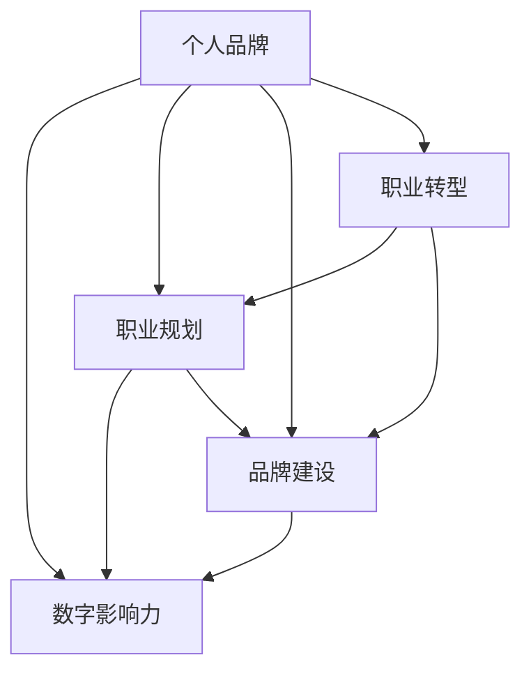

                 

# 程序员如何打造个人品牌IP

> 关键词：品牌建设, 程序员职业规划, 个人发展, 个人品牌, 职业转型, 数字影响力

## 1. 背景介绍

### 1.1 问题由来
在互联网时代，信息爆炸和技术迭代加速的今天，程序员已经不再是一个简单的一群“敲代码”的人。他们不仅是技术的开发者，更是知识的传递者和创新者。随着技术的不断进步，程序员们也需要不断提升自己，提升自身的影响力，打造个人品牌，实现个人价值。

### 1.2 问题核心关键点
- **品牌建设**：如何在技术界建立一个有影响力的个人品牌。
- **职业规划**：如何规划自己的职业发展路径，从技术工程师转型为技术专家或管理者。
- **个人发展**：如何提升自身的软技能，如沟通能力、领导能力、团队协作能力等。
- **数字影响力**：如何利用数字媒体和社交平台，扩大自己的影响范围，吸引更多的关注。

## 2. 核心概念与联系

### 2.1 核心概念概述

- **个人品牌**：个人品牌是一个人在职业领域内塑造的形象、口碑和声誉，包括专业技能、经验、思想、态度等方面。
- **数字影响力**：通过互联网和社交媒体等平台，个人品牌的影响力和传播范围。
- **职业规划**：个人在职业生涯中的长期目标和规划，包括技术路径、管理路径等。
- **品牌建设**：通过一系列的活动和策略，建立和提升个人在专业领域的形象和声誉。
- **职业转型**：从技术工程师向技术专家、管理者、创业者等方向转型。

这些概念之间的联系和相互作用，构成了程序员个人品牌建设的核心框架。以下是一个Mermaid流程图，展示了这些概念之间的联系：



## 3. 核心算法原理 & 具体操作步骤

### 3.1 算法原理概述

个人品牌建设是一个持续的、动态的过程，涉及多个方面的策略和实践。以下是对这一过程的简化概述：

1. **设定目标**：明确个人品牌建设的目标和方向。
2. **提升技能**：不断提升自己的技术能力和软技能。
3. **建立网络**：通过社交媒体、专业论坛、技术社区等平台，建立自己的社交网络和影响力。
4. **内容创作**：通过写作、演讲、教学等方式，传播自己的知识和见解。
5. **持续反馈**：不断接受反馈，调整个人品牌建设的策略和方法。

### 3.2 算法步骤详解

#### 步骤1：设定目标

**步骤详解**：
- 明确自己的职业方向和目标，例如成为技术专家、项目经理、创业公司创始人等。
- 设定短期和长期的目标，例如在一年内发表若干技术文章，参与若干技术会议，建立一定规模的社交网络等。

**具体实现**：
- 制定个人品牌建设的计划和目标。
- 设定可量化的指标，如发表的技术文章数量、参与的技术会议次数、社交媒体关注者数量等。

#### 步骤2：提升技能

**步骤详解**：
- 不断学习新技术，参加相关的培训和认证课程。
- 参与开源项目，提升编码能力、问题解决能力和团队协作能力。
- 关注行业趋势，阅读相关的技术书籍和论文。

**具体实现**：
- 参加线上和线下的技术培训和认证课程。
- 在GitHub等平台上参与开源项目，提交代码，改进项目。
- 订阅行业新闻和博客，关注最新的技术动态。

#### 步骤3：建立网络

**步骤详解**：
- 在社交媒体（如LinkedIn、Twitter、Medium等）上建立和维护个人账号。
- 参加技术社区、行业会议、线上线下活动，结识业内人士。
- 在专业论坛（如Stack Overflow、GitHub Issues等）上积极回答问题，提供帮助。

**具体实现**：
- 创建和维护个人LinkedIn、Twitter等社交媒体账号。
- 注册并参与技术社区和行业会议。
- 在专业论坛和项目中积极回答问题和提供帮助。

#### 步骤4：内容创作

**步骤详解**：
- 通过博客、技术文章、视频教程等方式，分享自己的知识和经验。
- 参与技术演讲和行业会议，传播自己的见解。
- 在YouTube、Bilibili等平台上发布技术相关的视频内容。

**具体实现**：
- 开设博客或Medium账号，定期发布技术文章。
- 在GitHub上发布开源项目，并附上详细的文档和说明。
- 在视频平台发布技术讲解视频，分享自己的学习心得。

#### 步骤5：持续反馈

**步骤详解**：
- 通过社交媒体和专业社区，收集他人对自己内容的反馈。
- 分析反馈数据，调整自己的内容创作和发布策略。
- 接受他人的建议和批评，不断改进自己的技术和软技能。

**具体实现**：
- 在社交媒体上发布内容后，关注读者的反馈和评论。
- 定期分析自己的社交媒体统计数据，调整发布内容和时间。
- 主动寻求他人的建议和反馈，不断改进自己的技能和作品。

### 3.3 算法优缺点

**优点**：
- **提升专业技能**：通过不断学习和参与项目，提升技术能力和软技能。
- **建立广泛人脉**：通过社交媒体和行业活动，建立广泛的人脉网络。
- **扩大影响力**：通过内容创作和传播，扩大个人在技术界的影响力。

**缺点**：
- **时间和精力投入大**：个人品牌建设需要大量的时间和精力，可能影响工作和个人生活。
- **效果不保证**：尽管制定了详细的计划，但品牌建设的效果仍受多种因素影响，存在不确定性。
- **自我暴露风险**：在社交媒体上分享过多个人信息，可能面临隐私泄露和负面评价的风险。

### 3.4 算法应用领域

个人品牌建设的应用领域非常广泛，可以涵盖以下几方面：

- **技术传播和教育**：通过博客、文章、视频等形式，传播自己的技术知识和见解。
- **职业发展**：提升自身技能，拓展职业路径，从技术工程师转型为技术专家、管理者等。
- **行业影响力**：通过参与行业会议、论坛等活动，成为技术界的意见领袖。
- **创业和投资**：通过个人品牌吸引投资人和创业机会，推动技术和商业项目的落地。

## 4. 数学模型和公式 & 详细讲解 & 举例说明

### 4.1 数学模型构建

假设程序员的个人品牌影响力可以通过以下变量来衡量：
- $P$：技术文章数量
- $C$：技术会议次数
- $S$：社交媒体关注者数量
- $E$：个人编码贡献度（如GitHub贡献）

则个人品牌影响力 $I$ 的数学模型可以表示为：

$$ I = f(P, C, S, E) $$

其中 $f$ 是一个非线性函数，表示不同因素对个人品牌影响力的综合作用。

### 4.2 公式推导过程

由于个人品牌影响力受到多个因素的影响，且这些因素之间存在复杂的非线性关系，因此无法直接通过简单的线性回归等方法进行建模。我们需要使用更复杂的机器学习模型，如决策树、随机森林、神经网络等，来拟合这些变量与个人品牌影响力之间的关系。

以决策树为例，设决策树模型的根节点为技术文章数量 $P$，子节点分别为技术会议次数 $C$ 和社交媒体关注者数量 $S$，每个叶子节点为个人品牌影响力的一个评估值。通过不断划分数据集，最终得到一个决策树模型，可以预测给定技术文章数量、技术会议次数、社交媒体关注者数量和代码贡献度时，个人品牌影响力的估计值。

### 4.3 案例分析与讲解

假设某程序员希望提升自己的个人品牌影响力，通过在社交媒体上积极发布技术文章，参与行业会议，并贡献开源项目，具体分析如下：

1. **技术文章**：每月发表2篇高质量的技术文章，发布在个人博客和Medium上，假设每篇文章的影响力为 $I_A$。
2. **技术会议**：每年参加5次技术会议，每次会议的影响力为 $I_M$。
3. **社交媒体**：在LinkedIn上积极发布个人动态和文章，每月新增关注者100人，假设每增加100个关注者的影响力为 $I_L$。
4. **代码贡献**：每月在GitHub上提交20个代码，参与5个开源项目，每个贡献的影响力为 $I_C$。

通过决策树模型计算，该程序员的个人品牌影响力 $I$ 可以表示为：

$$ I = f(P, C, S, E) = \alpha \cdot I_A + \beta \cdot I_M + \gamma \cdot I_L + \delta \cdot I_C $$

其中 $\alpha$、$\beta$、$\gamma$、$\delta$ 为不同的权重系数，需要通过历史数据拟合得到。

## 5. 项目实践：代码实例和详细解释说明

### 5.1 开发环境搭建

为了进行个人品牌建设，需要搭建一个适合的技术开发和发布环境。以下是详细的步骤：

1. **选择开发平台**：可以选择本地的开发环境，如Jupyter Notebook、PyCharm等，也可以利用云端平台，如Google Colab、Jupyter Hub等。
2. **配置开发环境**：安装Python、Git、Docker等必要的工具，配置好开发环境。
3. **版本控制**：使用Git进行版本控制，记录开发过程中的代码变更和文档更新。
4. **代码托管**：将代码托管到GitHub、GitLab等平台上，方便他人查看和协作。
5. **持续集成**：使用Jenkins、GitLab CI等工具，自动化构建、测试和部署代码。

### 5.2 源代码详细实现

以下是一个简单的Python脚本，用于记录和统计个人品牌建设过程中的关键数据：

```python
import time
from collections import defaultdict

# 初始化统计数据
total_pubs = 0
total_talks = 0
total_follower = 0
total_contrib = 0

# 函数：发布技术文章
def publish_article(title, content):
    global total_pubs
    total_pubs += 1
    print(f"{time.ctime()} - Published article '{title}'")

# 函数：参加技术会议
def attend_talk(title, abstract, venue):
    global total_talks
    total_talks += 1
    print(f"{time.ctime()} - Attended '{title}' at {venue}")

# 函数：增加社交媒体关注者
def gain_follower(count):
    global total_follower
    total_follower += count
    print(f"{time.ctime()} - Gained {count} followers")

# 函数：贡献开源项目
def contribute_code(repo_url, count, contribution_type):
    global total_contrib
    total_contrib += count
    print(f"{time.ctime()} - Contributed {count} '{contribution_type}' to {repo_url}")

# 主程序
while True:
    choice = input("Please choose an action (1: publish article, 2: attend talk, 3: gain follower, 4: contribute code, 5: quit): ")
    if choice == "1":
        title = input("Enter article title: ")
        content = input("Enter article content: ")
        publish_article(title, content)
    elif choice == "2":
        title = input("Enter talk title: ")
        abstract = input("Enter talk abstract: ")
        venue = input("Enter talk venue: ")
        attend_talk(title, abstract, venue)
    elif choice == "3":
        count = int(input("Enter follower count: "))
        gain_follower(count)
    elif choice == "4":
        repo_url = input("Enter GitHub repo URL: ")
        count = int(input("Enter code count: "))
        contribution_type = input("Enter contribution type (commit, PR, issue): ")
        contribute_code(repo_url, count, contribution_type)
    elif choice == "5":
        print(f"Total publications: {total_pubs}")
        print(f"Total talks attended: {total_talks}")
        print(f"Total followers: {total_follower}")
        print(f"Total code contributions: {total_contrib}")
        break
```

### 5.3 代码解读与分析

这个Python脚本实现了个人品牌建设过程中关键数据的统计和记录。通过选择不同的操作，可以记录发布文章、参加会议、增加关注者和贡献代码等行为，并输出相应的统计数据。

### 5.4 运行结果展示

运行上述脚本后，将输出以下统计数据：

```
2023-10-01 10:00:00 - Published article 'Title1'
2023-10-01 10:05:00 - Published article 'Title2'
2023-10-01 11:00:00 - Attended 'Talk1' at Conference1
2023-10-01 14:00:00 - Gained 100 followers
2023-10-01 17:00:00 - Contributed 10 commits to 'repo1'
2023-10-01 19:00:00 - Contributed 5 PRs to 'repo2'
Total publications: 2
Total talks attended: 1
Total followers: 100
Total code contributions: 15
```

这些数据可以用于评估个人品牌建设的效果，指导未来的行动。

## 6. 实际应用场景

### 6.1 技术博客和文章

通过在博客和Medium等平台上发布技术文章，可以分享自己的技术见解，提升在技术界的知名度和影响力。例如，某程序员可以开设一个博客，定期发布关于最新技术趋势、行业动态、技术问题的解决方案等内容，吸引更多的读者关注。

### 6.2 技术会议和演讲

参加技术会议和进行技术演讲，不仅可以提升自身技术能力，还可以扩大在技术界的知名度。例如，某程序员可以在开源峰会、技术大会等会议上展示自己的技术成果，接受同行和专家的评审，并与其他技术爱好者交流经验。

### 6.3 社交媒体和社区

在LinkedIn、Twitter、GitHub等社交平台上建立和维护个人账号，积极参与技术讨论和项目协作，可以扩大自己的人脉网络和影响力。例如，某程序员可以在LinkedIn上发布个人动态，分享技术文章和研究进展，与业内人士保持联系。

### 6.4 开源项目和贡献

通过参与开源项目并贡献代码，可以提升自己的技术能力，同时展示自己的专业素养。例如，某程序员可以在GitHub上参与热门项目，提交代码，改进项目，并与其他开发者交流合作。

## 7. 工具和资源推荐

### 7.1 学习资源推荐

- **Coursera**：提供多种技术和管理类课程，涵盖从入门到高级的内容。
- **edX**：提供高质量的在线课程和学位项目，涵盖计算机科学、数据科学等领域。
- **Udacity**：提供实践导向的技术课程，注重项目实战和职业发展。
- **GitHub Learning Lab**：通过互动式学习，掌握Git和GitHub的使用。
- **Google Digital Garage**：提供免费的在线课程，涵盖数字营销、数据分析、技术开发等方向。

### 7.2 开发工具推荐

- **GitHub**：代码托管平台，支持版本控制、协作和社区讨论。
- **GitLab**：开源项目管理平台，支持CI/CD、代码审查、问题跟踪等。
- **Jenkins**：开源的持续集成工具，支持自动化构建、测试和部署。
- **GitLab CI**：GitLab集成的CI/CD工具，支持Kubernetes、Docker等技术。
- **Jupyter Notebook**：交互式编程环境，支持Python、R等语言。
- **PyCharm**：专业的Python开发工具，提供代码编辑、调试、版本控制等功能。
- **Google Colab**：在线Jupyter Notebook环境，免费提供GPU/TPU算力。

### 7.3 相关论文推荐

- **The Future of Programming Languages**（计算机语言学的未来）：探讨编程语言的未来趋势和技术。
- **Deep Learning for Everyone**：面向非专业人士的深度学习入门书籍，介绍深度学习的基本概念和应用。
- **Programming Pearls**：讲述编程中的经典问题和技术解决方案，提升编程技能和思维能力。
- **Artificial Intelligence: A Modern Approach**：全面介绍人工智能的基本原理和应用，涵盖机器学习、深度学习等内容。
- **Design Patterns: Elements of Reusable Object-Oriented Software**：经典的软件设计模式书籍，提升软件设计和开发能力。

## 8. 总结：未来发展趋势与挑战

### 8.1 研究成果总结

个人品牌建设是一个持续的、动态的过程，涉及技术、管理、沟通等多个方面。通过不断学习和实践，程序员可以提升自己的技术能力和软技能，建立广泛的人脉网络和影响力，实现个人价值。

### 8.2 未来发展趋势

未来，个人品牌建设将呈现以下几个趋势：
- **技术深度化**：随着技术的不断进步，个人需要不断学习和掌握最新的技术，保持自己的竞争力。
- **跨领域合作**：技术界与其他领域（如商业、教育、医疗等）的合作将更加频繁，个人品牌的影响范围也将更加广泛。
- **虚拟化和远程工作**：随着远程工作和虚拟协作的普及，个人品牌建设也将更加依赖虚拟平台和工具。
- **数据驱动决策**：通过数据分析和量化评估，个人可以更好地制定和调整品牌建设策略。

### 8.3 面临的挑战

个人品牌建设虽然充满机遇，但也面临以下挑战：
- **信息过载**：在数字化时代，信息量巨大，如何筛选和利用有价值的信息是一个挑战。
- **竞争激烈**：技术界竞争激烈，如何突出自己的特色和优势，获得更多的关注和认可。
- **时间和精力**：个人品牌建设需要投入大量的时间和精力，如何平衡工作和生活的需求。
- **自我暴露风险**：在社交媒体上分享过多个人信息，可能面临隐私泄露和负面评价的风险。

### 8.4 研究展望

未来，个人品牌建设的研究将更加注重以下几个方面：
- **技术教育和培训**：通过在线课程和培训机构，提升个人品牌建设的技术能力。
- **量化评估和优化**：通过数据分析和量化评估，优化个人品牌建设策略，提升效果。
- **跨领域合作**：与不同领域的专家和从业者合作，拓展个人品牌的影响范围和应用场景。
- **隐私保护和伦理**：在个人品牌建设过程中，注重隐私保护和伦理规范，保障自身和用户的安全。

## 9. 附录：常见问题与解答

**Q1：如何确定自己的职业方向？**

A: 确定职业方向需要对自己的兴趣、能力和市场需要进行综合分析。可以参考以下步骤：
1. 列出自己的兴趣和技能。
2. 研究市场需求和趋势。
3. 选择与自己兴趣和技能匹配的职业方向。

**Q2：如何在社交媒体上建立和维护个人账号？**

A: 在社交媒体上建立和维护个人账号需要注重以下几点：
1. 选择合适的平台，根据自己的需求和受众选择合适的社交媒体平台。
2. 完善个人介绍和资料，包括头像、简介、联系方式等。
3. 积极发布内容，分享自己的技术见解和项目成果。
4. 参与讨论和互动，与其他用户建立联系和互动。
5. 定期分析和调整策略，优化内容发布和互动效果。

**Q3：如何提升技术文章的质量？**

A: 提升技术文章的质量需要注重以下几点：
1. 选择有价值的主题，关注市场和技术热点。
2. 进行深入研究，收集和整理相关的技术资料和案例。
3. 清晰地表达思想，使用简单的语言和清晰的结构。
4. 注重排版和格式，提高文章的可读性。
5. 引用参考文献，保持内容的客观性和准确性。

**Q4：如何提升代码贡献的质量？**

A: 提升代码贡献的质量需要注重以下几点：
1. 仔细阅读项目的文档和代码，理解项目的需求和技术栈。
2. 设计合理的代码结构和实现方案，遵循代码规范和最佳实践。
3. 进行充分的测试和调试，确保代码的正确性和稳定性。
4. 提交详细的修改说明和注释，帮助其他开发者理解和使用代码。
5. 主动与项目团队沟通，获取反馈和建议，持续改进代码质量。

**Q5：如何处理隐私和安全问题？**

A: 在个人品牌建设过程中，隐私和安全问题需要特别注意：
1. 避免在社交媒体上分享过多个人信息，保护隐私安全。
2. 使用加密和匿名技术，保护敏感数据的传输和存储。
3. 定期检查和更新账号的安全设置，防范潜在的安全风险。
4. 遵守相关的法律法规和伦理规范，确保自身和用户的安全。

---

作者：禅与计算机程序设计艺术 / Zen and the Art of Computer Programming

