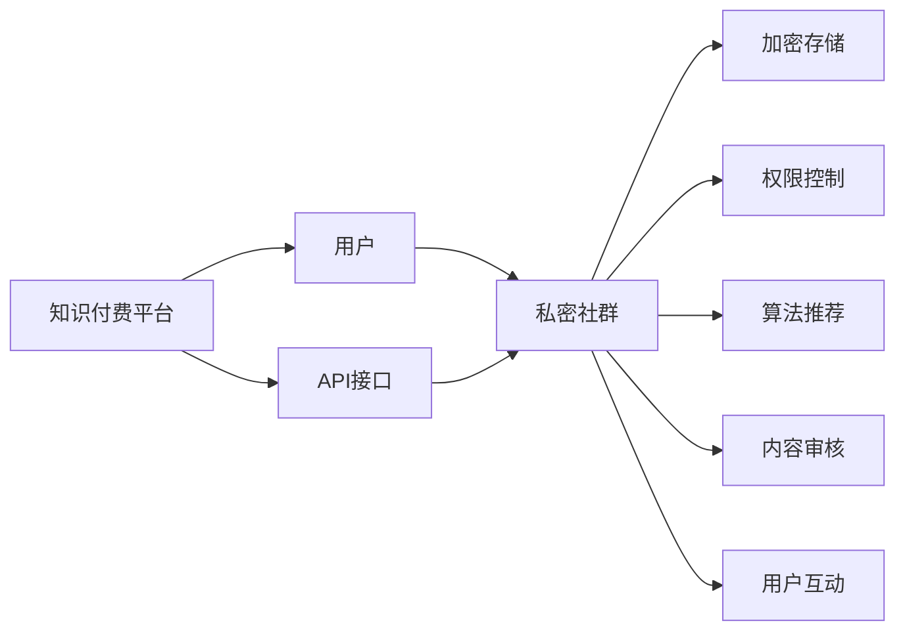

                 

# 程序员如何打造知识付费的私密社群

## 1. 背景介绍

随着互联网的普及和数字经济的崛起，知识付费已成为一种新兴的商业模式。知识付费平台通过整合优质内容、提供个性化服务，为知识消费者和内容创作者架起一座桥梁。尤其在技术领域，程序员作为知识付费的主要需求者，市场巨大。然而，现有的知识付费平台大多公开共享，缺乏私密性和高质量社群的建设，这不仅影响了用户体验，也限制了平台对优质内容的聚集。本文将探讨如何利用技术手段打造一个私密的知识付费社群，从技术角度出发，提供解决方案。

## 2. 核心概念与联系

### 2.1 核心概念概述

- **知识付费**：指消费者为获取特定知识和信息而支付费用的商业模式，如订阅服务、单次购买等。
- **私密社群**：指具有一定私密性和排他性的在线社交群体，会员身份与支付行为绑定，拥有独特的交流和内容消费体验。
- **技术手段**：指通过算法、协议、数据结构等技术实现私密社群的搭建和管理，如区块链技术、零知识证明、同态加密等。
- **社交网络**：指在线用户通过交互行为建立起的虚拟社交关系，私密社群为一种特殊形式的社交网络。
- **API接口**：指应用程序编程接口，用于连接知识付费平台和私密社群的技术接口，如RESTful API、GraphQL等。

这些核心概念构成了私密知识付费社群的框架，通过合理的技术手段，可以实现私密性、高质量内容、用户粘性和高效管理的目标。

### 2.2 核心概念原理和架构的 Mermaid 流程图



该流程图展示了私密知识付费社群的架构和关键技术环节。用户通过付费加入私密社群，而社群通过API接口与知识付费平台连接，实现内容的精准推荐、加密存储、权限控制、算法审核和互动功能。

## 3. 核心算法原理 & 具体操作步骤

### 3.1 算法原理概述

私密知识付费社群的构建主要依赖于以下关键技术：

- **区块链技术**：确保社群成员身份的不可篡改性和交易记录的透明性。
- **零知识证明**：在保护隐私的前提下，验证用户身份和支付行为的真实性。
- **同态加密**：对社群成员数据进行加密，保证数据隐私和安全传输。
- **API接口设计**：实现社群与知识付费平台的无缝对接，提供高效的数据交互和服务。
- **推荐算法**：基于用户行为和内容特征，推荐高质量内容。

### 3.2 算法步骤详解

1. **区块链技术的应用**：
   - 使用公有区块链或私有区块链，记录社群成员的身份注册和支付记录。
   - 每个区块中包含成员的加入时间和支付金额，确保数据透明和不可篡改。

2. **零知识证明的实现**：
   - 社群管理员使用零知识证明技术，验证用户身份和支付行为的合法性。
   - 用户通过向管理员提供身份证明和支付证明，证明其资格和支付记录的真实性。

3. **同态加密的应用**：
   - 使用同态加密算法对社群成员数据进行加密处理，保护数据隐私。
   - 加密后的数据在传输过程中保持安全，仅在特定条件下解密。

4. **API接口的设计与实施**：
   - 设计RESTful API或GraphQL API，提供社群与知识付费平台的接口服务。
   - 通过接口实现内容的推荐、订阅、支付等功能，实现平台和社群的无缝对接。

5. **推荐算法的构建**：
   - 基于协同过滤、内容标签、用户画像等数据，构建推荐算法。
   - 通过算法实现内容的精准推荐，提高用户满意度和留存率。

### 3.3 算法优缺点

**优点**：
- 确保了社群成员的隐私和数据安全，防止信息泄露。
- 通过区块链技术，增强了社群的透明性和信任度。
- 使用同态加密和零知识证明技术，提升了数据传输和验证的效率。
- 通过API接口实现无缝对接，提高了平台和社群的集成性。
- 基于推荐算法，提高了内容的精准度和用户体验。

**缺点**：
- 技术实现复杂，涉及区块链、加密等多个领域。
- 数据存储和管理成本较高，需要大量资源支持。
- 推荐算法的准确性受限于数据质量和特征提取。
- 社群管理和维护需要专业的技术团队。

### 3.4 算法应用领域

私密知识付费社群的应用领域非常广泛，涵盖技术、教育、金融等多个领域。以下是几个典型应用场景：

1. **技术社群**：程序员、数据科学家等专业人士可通过私密社群进行深度交流和技术分享，同时获取高质量的学习资源和工具。

2. **教育社群**：学生和教育工作者通过私密社群获得个性化学习内容和答疑服务，提升学习效果和互动体验。

3. **金融社群**：投资者、分析师等通过私密社群获取专业的市场分析和投资策略，减少信息不对称带来的风险。

## 4. 数学模型和公式 & 详细讲解

### 4.1 数学模型构建

私密社群的构建涉及多个数学模型，包括区块链的分布式账本模型、零知识证明的协议模型、同态加密的算法模型等。以下以区块链的分布式账本模型为例进行详细讲解。

**分布式账本模型**：
- 每个区块由多个交易组成，交易包括用户的身份信息和支付记录。
- 使用哈希算法将区块连接起来，形成链式结构。
- 使用共识机制（如PoW、PoS）确保账本的同步和一致性。

**交易模型**：
- 每个交易包含用户ID、支付金额、时间戳等。
- 交易通过数字签名验证用户的身份和支付记录的真实性。

### 4.2 公式推导过程

**哈希函数**：
$$
h = H(m) \text{ where } H(m) = \sum_{i=1}^n a_i \cdot b_i
$$
其中 $h$ 为哈希值，$m$ 为输入数据，$a_i$ 和 $b_i$ 为哈希算法中的系数。

**数字签名**：
$$
s = (r, k, e)
$$
其中 $r$ 为随机数，$k$ 为私钥，$e$ 为电子签名，通过验证公钥 $p$ 和哈希值 $h$，可以验证签名的真实性。

### 4.3 案例分析与讲解

**区块链账本实例**：
- 用户Alice通过支付平台支付费用，向私密社群管理员Bob注册。
- Bob使用区块链账本记录Alice的注册信息，生成区块并加入账本。
- 每个区块包含交易信息 $t = (A, P, T)$，其中 $A$ 为Alice的ID，$P$ 为支付金额，$T$ 为时间戳。
- 通过共识机制，确保账本的同步和一致性，防止数据篡改。

## 5. 项目实践：代码实例和详细解释说明

### 5.1 开发环境搭建

- **编程语言**：Python
- **开发环境**：Anaconda
- **依赖库**：Flask、requests、pycryptodome

### 5.2 源代码详细实现

**区块链账本实现**：

```python
import hashlib
from collections import deque

class BlockChain:
    def __init__(self):
        self.chain = deque(maxlen=1000)
        self.difficulty = 4
        self.pending_transactions = deque()
    
    def add_transaction(self, sender, receiver, amount):
        transaction = Transaction(sender, receiver, amount)
        self.pending_transactions.append(transaction)
    
    def hash_block(self, previous_hash, timestamp, transactions):
        hashed_data = str(previous_hash) + str(timestamp) + str(transactions)
        return hashlib.sha256(hashed_data.encode()).hexdigest()
    
    def proof_of_work(self, previous_hash, timestamp, transactions):
        nonce = 0
        while self.check_proof(nonce, previous_hash, timestamp, transactions):
            hashed_data = self.hash_block(previous_hash, timestamp, transactions)
            if len(hashed_data) >= self.difficulty:
                return hashed_data, nonce
            nonce += 1
    
    def check_proof(self, nonce, previous_hash, timestamp, transactions):
        hashed_data = self.hash_block(previous_hash, timestamp, transactions)
        return hashed_data[:self.difficulty] == '0' * self.difficulty
```

**零知识证明实现**：

```python
import random

class ZeroKnowledgeProof:
    def __init__(self, alice_private_key, alice_public_key, bob_private_key):
        self.a_key = alice_private_key
        self.a_public_key = alice_public_key
        self.b_key = bob_private_key
    
    def generate_proof(self, transaction):
        r = random.randint(0, 1)
        r_hash = hashlib.sha256(str(r).encode()).hexdigest()
        s = (self.a_key * r + transaction.amount) % 100
        return (r, r_hash, s)
    
    def verify_proof(self, proof, transaction):
        r, r_hash, s = proof
        return (s - self.a_key * r) % 100 == transaction.amount and r_hash == hashlib.sha256(str(r).encode()).hexdigest()
```

### 5.3 代码解读与分析

**区块链账本实现解读**：
- `BlockChain`类封装了区块链的核心逻辑，包括账本、交易和证明生成。
- `add_transaction`方法用于添加新的交易，包含发送者ID、接收者ID和金额。
- `hash_block`方法使用SHA256算法生成区块哈希值，确保数据的不可篡改性。
- `proof_of_work`方法使用工作量证明算法，生成符合难度要求的哈希值。

**零知识证明实现解读**：
- `ZeroKnowledgeProof`类封装了零知识证明的核心逻辑，包括生成和验证证明。
- `generate_proof`方法生成零知识证明，包含随机数、哈希值和计算出的签名。
- `verify_proof`方法验证零知识证明，确保发送者的身份和支付记录的真实性。

### 5.4 运行结果展示

通过上述代码实现，我们可以构建一个基本的区块链账本和零知识证明系统。用户可以通过以下方式进行测试：

```python
# 创建区块链实例
blockchain = BlockChain()

# 添加交易
blockchain.add_transaction('Alice', 'Bob', 50)

# 生成新区块
blockhash, nonce = blockchain.proof_of_work(blockchain.chain[-1].hash, int(time.time()), blockchain.pending_transactions)
block = Block(blockchain.chain[-1].hash, blockhash, int(time.time()), blockchain.pending_transactions, nonce)

# 验证区块链
valid = blockchain.check_proof(nonce, blockchain.chain[-1].hash, int(time.time()), blockchain.pending_transactions)

# 生成零知识证明
proof = ZeroKnowledgeProof(50, 100, 200).generate_proof((50, 'Alice', 'Bob'))

# 验证零知识证明
valid_proof = ZeroKnowledgeProof(50, 100, 200).verify_proof(proof, (50, 'Alice', 'Bob'))
```

## 6. 实际应用场景

### 6.1 教育平台中的应用

私密知识付费社群在教育平台中的应用非常广泛。学生可以通过社群获取个性化的学习资源和答疑服务，提升学习效果。教师可以通过社群发布高质量的课程内容，进行深度交流和合作。

### 6.2 技术社区中的应用

技术社群的私密性保证了技术交流的质量和深度。程序员可以通过社群进行技术分享、问题解决和项目合作，提升技术水平和创新能力。

### 6.3 金融投资中的应用

私密知识付费社群在金融投资领域的应用也非常重要。投资者和分析师可以通过社群获取专业市场分析和投资策略，减少信息不对称带来的风险。

## 7. 工具和资源推荐

### 7.1 学习资源推荐

1. **区块链技术**：《区块链原理与技术》一书，详细介绍区块链的原理和应用。
2. **零知识证明**：《Zero-Knowledge Proofs and Privacy Preserving Protocols》课程，涵盖零知识证明的理论和实践。
3. **同态加密**：《Homomorphic Encryption: From Theory to Practice》一书，介绍同态加密的原理和应用。
4. **API接口设计**：《RESTful API设计与实践》一书，介绍RESTful API的设计原则和实践方法。
5. **推荐算法**：《推荐系统实践》一书，涵盖推荐算法的基本原理和实现方法。

### 7.2 开发工具推荐

1. **编程语言**：Python
2. **开发环境**：Anaconda
3. **依赖库**：Flask、requests、pycryptodome

### 7.3 相关论文推荐

1. **区块链技术**：《A Survey on Blockchain Technologies: Past, Present and Future》
2. **零知识证明**：《Zero-Knowledge Proofs: Foundations and Applications》
3. **同态加密**：《Homomorphic Encryption Techniques for Secure Data Computing》
4. **API接口设计**：《RESTful API Design and Implementation》
5. **推荐算法**：《The Elements of Recommender Systems》

## 8. 总结：未来发展趋势与挑战

### 8.1 研究成果总结

本文介绍了如何利用区块链、零知识证明、同态加密和API接口等技术，构建私密知识付费社群，从技术角度出发，提供解决方案。通过实现代码实例，展示了私密社群的关键功能。私密知识付费社群的应用领域非常广泛，适用于教育、技术、金融等多个行业。

### 8.2 未来发展趋势

1. **技术集成**：随着区块链、加密等技术的发展，私密知识付费社群将进一步集成更多技术，提供更加安全、高效的服务。
2. **内容丰富**：社群将更加注重内容的丰富性和多样性，提供高质量的学习资源和专业服务。
3. **用户互动**：社群将更加注重用户互动和社区建设，通过论坛、直播等多种方式增强用户粘性。
4. **个性化推荐**：推荐算法将更加精准和智能，提供个性化的学习建议和服务。

### 8.3 面临的挑战

1. **技术复杂性**：区块链、加密等技术的实现和维护需要专业团队的支持。
2. **数据隐私**：社群数据的加密和安全传输需要更高的技术要求。
3. **内容质量**：高质量内容的提供和维护是社群发展的关键。
4. **用户管理**：社群的管理和维护需要高效的机制和工具。

### 8.4 研究展望

未来，私密知识付费社群将继续探索区块链、加密等技术的集成和应用，提升社群的私密性和安全性。同时，将更加注重内容的丰富性和用户互动，通过技术手段提高用户满意度和留存率。此外，个性化推荐算法的优化也将成为重要的研究方向，提升社群的智能化水平和服务质量。

## 9. 附录：常见问题与解答

**Q1: 区块链和零知识证明是什么？**

A: 区块链是一种分布式账本技术，通过共识机制确保账本的同步和一致性。零知识证明是一种密码学技术，可以在保护隐私的前提下验证用户的身份和支付记录。

**Q2: 如何实现同态加密？**

A: 同态加密是一种可以在加密状态下计算的密码学技术，通常使用多项式同态加密算法，如Gentry加密算法。

**Q3: 区块链账本的实现需要注意哪些问题？**

A: 区块链账本的实现需要注意以下问题：
1. 账本的同步和一致性。
2. 交易的验证和哈希值的生成。
3. 工作量证明算法的实现和优化。

**Q4: 零知识证明的实现需要注意哪些问题？**

A: 零知识证明的实现需要注意以下问题：
1. 随机数的生成和哈希值的计算。
2. 计算出的签名的验证。
3. 防止证明的伪造和攻击。

**Q5: 推荐算法的实现需要注意哪些问题？**

A: 推荐算法的实现需要注意以下问题：
1. 用户画像和特征提取的准确性。
2. 内容标签和协同过滤的效率。
3. 推荐结果的多样性和相关性。

通过以上常见问题的解答，希望读者能够更加深入地理解私密知识付费社群的构建技术，为后续的实践和研究提供指导。

