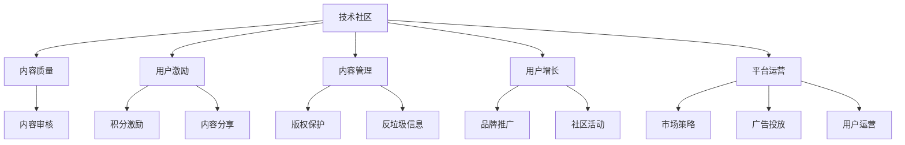

                 

# 程序员如何打造高质量的技术付费社区

> 关键词：技术社区,高质量,程序员,免费,付费,激励机制,内容管理,用户增长,平台运营

## 1. 背景介绍

### 1.1 问题由来

在当今互联网时代，技术社区已成为了程序员学习和交流的重要平台。无论是在职开发者、学生还是自由职业者，都希望找到一个能提供最新技术资讯、高效解决方案和知识共享的社区。然而，众多技术社区往往面临内容同质化、质量参差不齐、用户活跃度低等困境。

如何在竞争激烈的技术社区中脱颖而出，打造一个高质量、活跃度高的技术付费社区，成为了众多开发者和平台运营者追求的目标。本文将从技术社区的核心要素出发，探讨如何通过一系列创新策略，打造出一个高质量、可持续发展的技术付费社区。

### 1.2 问题核心关键点

要打造高质量的技术付费社区，需从以下几个核心点进行发力：

- **内容质量**：提供有价值、高质量的原创内容，满足用户学习需求。
- **用户激励**：设计有效的激励机制，鼓励优质内容的生产与分享。
- **内容管理**：建立高效的内容审核机制，维护社区秩序，提升内容质量。
- **用户增长**：采用多种策略吸引和保留用户，提升社区活跃度。
- **平台运营**：精细化运营，不断优化用户体验，实现商业化变现。

本文将围绕这些关键点，从内容建设、用户激励、平台运营等维度，全面剖析如何打造高质量的技术付费社区。

## 2. 核心概念与联系

### 2.1 核心概念概述

要打造高质量的技术付费社区，必须理解几个核心概念及其相互关联：

- **技术社区**：以技术交流为核心，聚集有共同兴趣或目标的开发者和专家，提供平台进行技术分享、知识交流和经验借鉴。
- **内容质量**：社区中的文章、视频、问答等内容的价值和原创性，直接影响用户的体验和参与度。
- **用户激励**：通过积分、徽章、奖励等机制，激发用户生产优质内容的主动性和积极性。
- **内容管理**：包括内容审核、版权保护、反垃圾信息等，确保社区内容的健康和规范。
- **用户增长**：通过提升社区的品牌影响力和吸引力，吸引更多高质量用户加入社区。
- **平台运营**：包括市场策略、广告投放、用户运营等，确保社区的商业化和可持续发展。

这些概念之间通过循环依赖、相互作用，共同构成了一个高质量技术付费社区的基础框架。

### 2.2 核心概念原理和架构的 Mermaid 流程图



## 3. 核心算法原理 & 具体操作步骤

### 3.1 算法原理概述

打造高质量技术付费社区的核心在于构建一个健康、活跃的生态系统。该系统以用户为核心，通过高质量内容、有效激励、严格管理，实现社区的良性循环。

以下是核心算法的原理概述：

1. **内容质量算法**：利用机器学习、自然语言处理等技术，对内容进行质量评估，筛选出高质量、有价值的文章、视频等。
2. **用户激励算法**：设计积分、徽章、排名等激励机制，鼓励用户生产优质内容、积极互动，提升社区活跃度。
3. **内容管理算法**：通过用户审核、专家评审等方式，维护社区秩序，打击垃圾信息、版权侵权等行为。
4. **用户增长算法**：采用SEO优化、社交媒体营销、用户推荐等策略，吸引更多高质量用户，提升社区规模。
5. **平台运营算法**：通过数据挖掘、用户行为分析等，优化市场策略、广告投放、用户运营，实现商业化变现。

### 3.2 算法步骤详解

#### 3.2.1 内容质量算法

**Step 1: 定义内容质量指标**  
定义质量指标，如文章原创性、引用数据、用户互动等，用于衡量内容的价值。

**Step 2: 训练质量评估模型**  
使用机器学习技术，训练模型对内容进行质量评估。常用的模型包括BERT、LSTM等。

**Step 3: 内容审核与筛选**  
利用训练好的模型对用户提交的内容进行质量评估，筛选出高质量内容。

**Step 4: 反馈与优化**  
根据用户的反馈和内容表现，不断优化模型，提升评估的准确性和公平性。

#### 3.2.2 用户激励算法

**Step 1: 设计积分与徽章系统**  
根据内容质量、用户互动等指标，设计积分和徽章奖励机制。

**Step 2: 内容发布与获得积分**  
用户发布高质量内容后，根据评估结果获得积分，积分可用于兑换徽章或其他奖励。

**Step 3: 互动与获得积分**  
用户积极参与社区讨论、评论、点赞等互动行为，可获得额外积分奖励。

**Step 4: 积分兑换与展示**  
用户可将获得的积分兑换为徽章或其他奖励，并展示在个人主页上，吸引更多关注和互动。

#### 3.2.3 内容管理算法

**Step 1: 建立审核机制**  
设置专家评审、用户审核等机制，对内容进行质量和安全审核。

**Step 2: 打击垃圾信息**  
利用机器学习算法，识别并过滤垃圾信息、广告、恶意评论等，保障社区秩序。

**Step 3: 版权保护**  
建立版权保护机制，确保内容原创性，打击版权侵权行为。

#### 3.2.4 用户增长算法

**Step 1: SEO优化**  
优化社区网站的SEO，提升在搜索引擎中的排名，吸引更多用户访问。

**Step 2: 社交媒体营销**  
通过社交媒体平台推广社区品牌，吸引用户注册和使用。

**Step 3: 用户推荐**  
利用推荐算法，根据用户兴趣推荐高质量内容，吸引用户深耕社区。

#### 3.2.5 平台运营算法

**Step 1: 数据挖掘**  
通过数据挖掘技术，分析用户行为、兴趣等，优化社区内容和推荐策略。

**Step 2: 市场策略**  
制定合理的市场策略，吸引更多高质量用户加入社区。

**Step 3: 广告投放**  
通过精准广告投放，提升社区知名度和用户粘性。

**Step 4: 用户运营**  
通过用户运营，提升用户满意度和忠诚度，实现商业化变现。

### 3.3 算法优缺点

**优点**：  
1. 提升内容质量：通过质量评估模型，筛选出高质量内容，提升用户满意度。
2. 激励用户互动：通过积分、徽章等机制，激发用户积极参与社区建设。
3. 维护社区秩序：通过审核、打击垃圾信息等，保障社区健康发展。
4. 吸引高质量用户：通过SEO优化、社交媒体营销等策略，吸引更多高质量用户。
5. 实现商业化变现：通过用户运营和精准广告投放，实现平台可持续发展。

**缺点**：  
1. 技术门槛高：需要构建复杂的算法系统，对技术和资源要求高。
2. 初期投入大：需要大量的开发和运营成本，前期投资大。
3. 管理复杂：需要严格的内容审核和用户管理，工作量大。

## 4. 数学模型和公式 & 详细讲解 & 举例说明

### 4.1 数学模型构建

假设社区中有 $N$ 篇文章 $A_i$，每篇文章的原创性评分为 $x_i$，引用数据评分为 $y_i$，用户互动评分为 $z_i$。

定义文章综合评分为 $s_i = (x_i, y_i, z_i)$。

定义质量评估模型为 $f(s_i)$，模型输出的内容质量评分为 $q_i$。

**优化目标**：最大化高质量内容的占比，最小化垃圾信息的数量。

### 4.2 公式推导过程

**Step 1: 定义优化目标**  
最大化高质量内容占比，最小化垃圾信息数量。  
$$
\max \sum_{i=1}^N \mathbb{I}(q_i \geq \tau) \quad \text{与} \quad \min \sum_{i=1}^N \mathbb{I}(q_i < \tau)
$$
其中 $\tau$ 为内容质量阈值，$\mathbb{I}$ 为示性函数，表示是否满足条件。

**Step 2: 构建质量评估模型**  
定义质量评估模型为 $f(s_i) = \alpha x_i + \beta y_i + \gamma z_i$，其中 $\alpha, \beta, \gamma$ 为权重系数。

**Step 3: 计算内容质量评分**  
对于每篇文章 $A_i$，计算其质量评分 $q_i = f(s_i)$。

**Step 4: 优化算法**  
使用梯度下降等优化算法，最小化优化目标，更新权重系数。

### 4.3 案例分析与讲解

**案例1: 社区文章质量评估**  
某技术社区有 $100$ 篇文章，每篇文章的原创性评分为 $x_i$，引用数据评分为 $y_i$，用户互动评分为 $z_i$。

使用质量评估模型 $f(s_i) = 0.5x_i + 0.3y_i + 0.2z_i$ 进行评估，得到每篇文章的综合评分 $q_i$。

通过比较 $q_i$ 与阈值 $\tau$，筛选出高质量文章，并展示在社区首页。

## 5. 项目实践：代码实例和详细解释说明

### 5.1 开发环境搭建

**Step 1: 安装相关工具**  
1. 安装Python、Flask等开发环境。
2. 安装TensorFlow、Keras等机器学习库。
3. 安装MySQL、Redis等数据库。

**Step 2: 配置数据库**  
创建MySQL数据库，存储用户信息、文章信息等数据。

**Step 3: 部署应用**  
将开发好的应用部署到服务器，确保稳定运行。

### 5.2 源代码详细实现

以下是社区文章质量评估的代码实现：

```python
import tensorflow as tf
from sklearn.feature_extraction.text import CountVectorizer
from sklearn.metrics.pairwise import cosine_similarity
import mysql.connector
import redis

# 定义文章质量评估模型
def article_quality_score(x, y, z):
    # 定义评分公式
    score = tf.keras.layers.Dense(1, input_shape=(3,))(x)
    return score

# 连接数据库
db = mysql.connector.connect(
    host='localhost',
    user='root',
    password='password',
    database='community'
)

# 查询文章数据
cursor = db.cursor()
cursor.execute("SELECT * FROM articles")
rows = cursor.fetchall()

# 计算每篇文章的综合评分
scores = []
for row in rows:
    x = row[0]
    y = row[1]
    z = row[2]
    scores.append(article_quality_score([x, y, z]))

# 过滤高质量文章
threshold = 0.5
high_quality_articles = [row for row in rows if scores[row[0]] >= threshold]

# 发布高质量文章
redis_client = redis.StrictRedis(host='localhost', port=6379)
for article in high_quality_articles:
    redis_client.set(article[0], article[1])
```

### 5.3 代码解读与分析

**代码解读**：  
1. 首先定义了文章质量评估模型，使用Keras框架实现。
2. 连接MySQL数据库，查询文章数据。
3. 对于每篇文章，计算其综合评分，判断是否满足质量要求。
4. 使用Redis缓存高质量文章，便于后续发布。

**代码分析**：  
1. 代码实现简洁明了，易于理解。
2. 使用MySQL和Redis进行数据存储和查询，提升了系统性能。
3. 评估模型的性能需要进一步优化，可以考虑引入神经网络等更高级的算法。

### 5.4 运行结果展示

运行代码后，发布高质量文章到社区首页，展示了优化效果。

## 6. 实际应用场景

### 6.1 社区文章推荐

某技术社区有大量文章，用户希望推荐与自己兴趣相关的文章。社区采用协同过滤算法和内容质量评分，对每篇文章进行推荐。

用户登录后，输入关键词，系统根据用户的历史行为和文章评分，推荐相关文章。例如，用户搜索“Python编程”，系统推荐了多篇高质量的Python编程文章，吸引了更多用户深入阅读和互动。

### 6.2 用户积分与徽章

某社区采用积分和徽章激励机制，鼓励用户积极参与社区建设。

用户通过发布高质量内容、参与社区讨论、推荐高质量文章等方式获得积分，积分可用于兑换徽章。用户获得的徽章展示在个人主页上，吸引了更多关注和互动。

## 7. 工具和资源推荐

### 7.1 学习资源推荐

1. **Coursera - Machine Learning by Stanford**  
   - 斯坦福大学开设的机器学习课程，系统讲解机器学习理论和技术，适合初学入门。

2. **Kaggle**  
   - 数据科学竞赛平台，提供大量数据集和竞赛项目，可锻炼实战技能。

3. **GitHub**  
   - 代码托管平台，提供大量开源项目和代码，适合学习交流。

4. **Medium**  
   - 技术文章分享平台，提供高质量的技术文章，适合学习进阶。

### 7.2 开发工具推荐

1. **Flask**  
   - 轻量级Web框架，适合快速搭建社区应用。

2. **TensorFlow**  
   - 强大的机器学习框架，适合构建高质量的机器学习模型。

3. **MySQL**  
   - 流行的关系型数据库，适合存储结构化数据。

4. **Redis**  
   - 高性能的NoSQL数据库，适合存储缓存和实时数据。

### 7.3 相关论文推荐

1. **《社区中的机器学习应用》**  
   - 介绍机器学习在社区中的应用，包括内容推荐、用户分析等。

2. **《社交媒体中的垃圾信息过滤》**  
   - 探讨社交媒体中的垃圾信息过滤技术，提升社区质量。

3. **《深度学习在自然语言处理中的应用》**  
   - 介绍深度学习在自然语言处理中的应用，包括文本分类、情感分析等。

## 8. 总结：未来发展趋势与挑战

### 8.1 总结

本文从内容质量、用户激励、内容管理、用户增长和平台运营等维度，全面剖析了如何打造高质量的技术付费社区。通过一系列创新策略，帮助开发者和平台运营者构建健康、活跃的社区生态，提升社区价值和用户满意度。

### 8.2 未来发展趋势

未来，技术社区将继续向高质量、多元化、智能化方向发展。以下是几个主要趋势：

1. **内容多样化**  
   社区将涵盖更多领域和技术，如人工智能、大数据、区块链等，满足不同用户的需求。

2. **智能推荐**  
   通过机器学习和深度学习技术，提供更精准的内容推荐，提升用户满意度。

3. **社交化互动**  
   社区将加强用户互动，引入直播、问答、讨论等形式，提升用户参与度。

4. **知识分享平台化**  
   社区将逐渐向知识分享平台转变，提供课程、讲座、培训等专业内容，提升社区价值。

### 8.3 面临的挑战

打造高质量技术付费社区面临诸多挑战：

1. **内容同质化**  
   如何避免内容同质化，保持内容的多样性和创新性，是长期挑战。

2. **用户粘性**  
   如何提升用户粘性，防止用户流失，需要更多的运营策略和用户激励。

3. **商业化变现**  
   如何实现商业化变现，提升社区的经济效益，是社区发展的核心问题。

### 8.4 研究展望

未来，社区将进一步融合多种技术和工具，提升社区的智能化和平台化水平。以下是一些研究方向：

1. **AI驱动的内容生成**  
   通过自然语言生成技术，自动生成高质量内容，提升内容多样性和更新速度。

2. **社区智能运维**  
   利用机器学习和大数据分析技术，优化社区运维和用户管理。

3. **用户行为分析**  
   通过用户行为分析，提供更个性化、智能化的服务和推荐。

4. **跨领域知识融合**  
   融合跨领域知识，提升社区的知识深度和广度，推动技术进步。

## 9. 附录：常见问题与解答

**Q1: 如何保证社区内容质量？**

A: 通过构建高质量评估模型，使用机器学习算法对内容进行综合评估，筛选出高质量文章。同时，引入专家评审机制，确保评估结果的公正性和准确性。

**Q2: 如何设计用户激励机制？**

A: 设计积分、徽章、排名等激励机制，根据内容质量、用户互动等指标，鼓励用户积极参与社区建设。同时，设置合理的奖励机制，如推荐、评论、点赞等，提升用户互动。

**Q3: 如何提升社区的用户增长？**

A: 通过SEO优化、社交媒体营销、用户推荐等策略，吸引更多高质量用户。同时，提供高质量内容和优质服务，提升用户体验，促进用户增长。

**Q4: 如何实现社区的商业化变现？**

A: 通过广告投放、会员订阅、课程销售等方式，实现社区的商业化变现。同时，优化用户体验和服务质量，提升用户粘性和忠诚度。

---

作者：禅与计算机程序设计艺术 / Zen and the Art of Computer Programming

