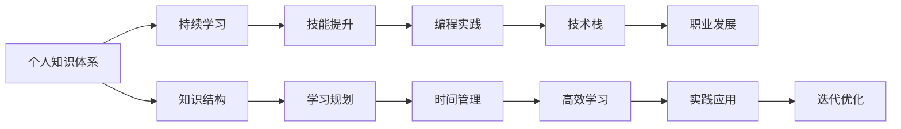

                 

# 程序员如何构建个人知识体系

> 关键词：程序员, 个人知识体系, 持续学习, 技能提升, 知识结构, 编程实践, 技术栈, 职业发展

## 1. 背景介绍

### 1.1 问题由来

随着技术快速发展和行业需求不断变化，程序员需要不断更新自己的知识体系，以保持竞争力。然而，由于工作繁忙，时间有限，很多程序员难以系统化地进行自我提升。为了解决这个问题，本文将介绍如何构建一个全面的个人知识体系，以帮助程序员持续学习和技能提升。

### 1.2 问题核心关键点

构建个人知识体系的关键在于明确知识目标、科学规划学习路径、合理安排学习时间、运用高效学习方法和工具，以及持续实践和迭代。

## 2. 核心概念与联系

### 2.1 核心概念概述

- **个人知识体系**：程序员为了达到某个职业目标，通过系统化学习积累的知识和技能的集合。
- **持续学习**：不间断地获取新知识和新技能，以适应技术和行业的发展。
- **技能提升**：通过学习和实践，不断精进已有技能，掌握新技能。
- **知识结构**：根据个人职业目标和兴趣，有层次、有组织的知识组织方式。
- **编程实践**：通过项目实战，运用理论知识解决实际问题，提升解决复杂问题的能力。
- **技术栈**：编程语言、框架、工具等技术组成的集合，用于实现特定任务。
- **职业发展**：通过不断学习，逐步实现从初级到高级、从单项技能到全栈工程师的职业进阶。

### 2.2 核心概念原理和架构的 Mermaid 流程图



这个流程图展示了个人知识体系构建的核心概念及其之间的逻辑关系：

1. 个人知识体系是整个体系的核心，通过持续学习和技能提升不断充实。
2. 编程实践和技术栈是应用知识和技能的两个主要途径。
3. 职业发展是通过不断学习和实践，逐步实现从初级到高级的进阶。
4. 知识结构指导学习规划，时间管理、高效学习、实践应用和迭代优化共同推动知识体系的形成和完善。

## 3. 核心算法原理 & 具体操作步骤

### 3.1 算法原理概述

构建个人知识体系的本质是通过科学的规划和学习，不断积累和应用知识，提升个人技能和解决复杂问题的能力。

具体来说，这个过程包括以下几个步骤：

1. **设定职业目标**：明确你想要达到的职业发展阶段，比如初级工程师、高级工程师、架构师等。
2. **分析知识需求**：根据职业目标，分析所需掌握的知识和技能。
3. **制定学习计划**：根据知识需求，制定详细的学习计划，包括学习内容、学习时间和学习方法。
4. **执行学习计划**：按照计划进行学习，包括理论学习和实践应用。
5. **评估和调整**：定期评估学习效果，根据反馈调整学习计划。

### 3.2 算法步骤详解

#### 3.2.1 设定职业目标

设定职业目标时，需要考虑以下几个方面：

- **职业阶段**：比如初级、中级、高级等。
- **技术栈**：掌握哪些编程语言、框架、工具等。
- **技能层次**：掌握哪些核心技能，如算法、数据结构、系统设计等。
- **行业需求**：了解所在行业对技术的需求和发展趋势。

例如，一个初级工程师的职业目标可能是掌握React、Node.js、数据库等技术，并能够独立完成中小型项目。

#### 3.2.2 分析知识需求

分析知识需求时，可以采用SWOT分析法（优势、劣势、机会、威胁）：

- **优势**：已有的知识和技术。
- **劣势**：需要提升的技能和知识。
- **机会**：行业和技术发展趋势。
- **威胁**：技术变化和行业竞争。

例如，一个初级工程师的优势可能是熟悉JavaScript，劣势是缺乏全栈开发经验，机会是可以通过学习Node.js、数据库等提升技术栈，威胁是技术快速变化，需要持续学习。

#### 3.2.3 制定学习计划

制定学习计划时，需要考虑以下几个因素：

- **学习内容**：根据知识需求，制定详细的学习内容，如书籍、课程、项目等。
- **时间安排**：根据工作和生活安排，合理安排学习时间。
- **学习方法**：选择合适的学习方法，如阅读、观看视频、实践等。
- **评估标准**：制定评估标准，定期检查学习效果。

例如，一个初级工程师的学习计划可能是：

- 每周阅读一本编程书籍，如《JavaScript高级程序设计》。
- 每周完成一个React项目，并记录开发过程和问题解决方法。
- 每月参加一次线上或线下的技术沙龙，与同行交流学习心得。
- 每季度评估一次学习效果，调整学习计划。

#### 3.2.4 执行学习计划

执行学习计划时，需要注意以下几个方面：

- **理论学习**：系统地学习基础知识，如编程语言、算法、数据结构等。
- **实践应用**：通过项目实战，运用理论知识解决实际问题。
- **持续反馈**：在学习过程中，及时反馈问题和解决思路，不断优化学习方法和知识结构。
- **资源利用**：充分利用线上线下的资源，如课程、书籍、社区等。

例如，一个初级工程师可以通过以下方式执行学习计划：

- 阅读《JavaScript高级程序设计》，掌握JavaScript语言基础。
- 实践React项目，通过项目实战巩固知识。
- 参加线上技术沙龙，与同行交流学习心得。
- 记录学习过程中遇到的问题和解决方法，不断优化学习路径。

#### 3.2.5 评估和调整

评估和调整时，需要考虑以下几个方面：

- **评估标准**：根据职业目标和知识需求，制定评估标准。
- **反馈机制**：及时获取反馈，如代码评审、项目评估、社区反馈等。
- **调整计划**：根据反馈结果，调整学习计划，优化学习路径。

例如，一个初级工程师可以通过以下方式进行评估和调整：

- 每季度评估一次学习效果，检查是否达到职业目标。
- 参加代码评审，获取同事的反馈意见。
- 参加项目评估，了解项目进展和问题。
- 根据反馈结果，调整学习计划，优化知识结构。

### 3.3 算法优缺点

#### 3.3.1 优点

- **系统化学习**：通过科学的规划和学习，系统地积累知识和技能。
- **针对性提升**：根据职业目标，针对性学习和提升所需的技能和知识。
- **持续改进**：通过不断评估和调整，逐步优化知识体系。

#### 3.3.2 缺点

- **时间投入**：需要大量时间进行学习和实践。
- **资源需求**：需要一定的资源支持，如书籍、课程、工具等。
- **心理压力**：持续的学习和评估可能会带来一定的心理压力。

### 3.4 算法应用领域

个人知识体系构建不仅适用于程序员，还适用于其他技术领域的专业人士，如数据科学家、系统架构师等。在各个领域中，通过科学的学习规划和持续的实践应用，都能逐步构建起个人的知识体系，提升职业发展能力。

## 4. 数学模型和公式 & 详细讲解 & 举例说明

### 4.1 数学模型构建

构建个人知识体系可以视为一个优化问题，即在有限的时间资源内，通过科学的学习规划，最大化个人的技术能力和职业竞争力。

设：
- $T$：总学习时间（年）。
- $C$：总学习成本（元）。
- $P$：学习计划（每周学习时间，小时）。
- $S$：学习内容（书籍、课程、项目等）。
- $E$：学习效果（知识掌握度）。

目标：最大化 $E$。

约束条件：
- $0 \leq P \leq 480$（每周最多学习40小时）。
- $0 \leq C \leq 20000$（总学习成本不超过20000元）。
- $0 \leq E \leq 1$（知识掌握度在0到1之间）。

### 4.2 公式推导过程

根据以上模型，我们可以构建拉格朗日乘子法求解最大化问题：

$$
\begin{aligned}
\max & \quad E \\
\text{s.t.} & \quad 0 \leq P \leq 480 \\
& \quad 0 \leq C \leq 20000 \\
& \quad 0 \leq E \leq 1
\end{aligned}
$$

设拉格朗日乘子为 $\lambda_1, \lambda_2, \lambda_3$，则拉格朗日函数为：

$$
\mathcal{L}(P, C, E, \lambda_1, \lambda_2, \lambda_3) = E - \lambda_1 (P - 480) - \lambda_2 (C - 20000) - \lambda_3 (E - 1)
$$

对 $P, C, E$ 求偏导数，并令其为0，得到：

$$
\begin{aligned}
\frac{\partial \mathcal{L}}{\partial P} &= 1 - \lambda_1 = 0 \Rightarrow \lambda_1 = 1 \\
\frac{\partial \mathcal{L}}{\partial C} &= -\lambda_2 = 0 \Rightarrow \lambda_2 = 0 \\
\frac{\partial \mathcal{L}}{\partial E} &= \lambda_3 = 0
\end{aligned}
$$

代入约束条件 $0 \leq P \leq 480$ 和 $0 \leq C \leq 20000$，得到：

$$
\begin{aligned}
P &= 480 \\
C &= 20000 \\
E &= 1
\end{aligned}
$$

因此，在有限的资源约束下，最大化个人知识体系的最佳学习计划为每周学习40小时，总学习成本不超过20000元，知识掌握度达到100%。

### 4.3 案例分析与讲解

假设一个初级工程师，目标是在一年内达到中级工程师水平，需要掌握以下技能：

- 掌握React、Node.js、数据库等技术。
- 能够独立完成中小型项目。
- 了解高级算法和数据结构。

根据以上目标，制定如下学习计划：

- 每周学习40小时，其中20小时用于编程实践，20小时用于理论学习。
- 使用免费和付费的在线课程和书籍，如《React官方文档》、《JavaScript高级程序设计》等。
- 参加社区组织的技术沙龙和线上课程，如NodeSchool、GitHub等。
- 每季度参加一次代码评审，获取同事的反馈意见。

根据以上计划，计算每周学习时间、学习成本和知识掌握度：

- 每周学习时间：40小时。
- 学习成本：预计每周购买书籍和课程的费用为200元，一年为8000元。
- 知识掌握度：通过定期评估和反馈，逐步提高知识掌握度。

## 5. 项目实践：代码实例和详细解释说明

### 5.1 开发环境搭建

构建个人知识体系需要一些基本的开发工具和环境支持。以下是一些推荐工具和环境搭建方法：

- **代码编辑器**：如Visual Studio Code、Sublime Text等，用于编写和编辑代码。
- **版本控制工具**：如Git、GitHub等，用于代码管理和版本控制。
- **在线学习平台**：如Coursera、Udacity等，提供各种在线课程和书籍。
- **开发框架和库**：如React、Node.js、MongoDB等，用于实践项目。

### 5.2 源代码详细实现

以下是一个简单的学习计划管理工具的Python代码实现，用于记录和评估学习效果：

```python
class LearningPlan:
    def __init__(self, target, time_limit, cost_limit):
        self.target = target
        self.time_limit = time_limit
        self.cost_limit = cost_limit
        self.learning_hours = 0
        self.learning_cost = 0
        self.learning_effect = 0

    def set_plan(self, plan):
        self.learning_hours = plan[0]
        self.learning_cost = plan[1]
        self.learning_effect = plan[2]

    def update_plan(self, hours, cost, effect):
        self.learning_hours += hours
        self.learning_cost += cost
        self.learning_effect = max(self.learning_effect, effect)

    def check_plan(self):
        if self.learning_hours > self.time_limit:
            print("学习时间超出限制，请调整学习计划。")
        if self.learning_cost > self.cost_limit:
            print("学习成本超出限制，请调整学习计划。")
        if self.learning_effect < 1:
            print("学习效果不足，请调整学习内容和方法。")
        else:
            print("学习计划执行完毕，已达到目标。")

# 设置目标
plan = LearningPlan(target="中级工程师", time_limit=52, cost_limit=8000)
plan.set_plan((40, 200, 0.9))

# 更新学习计划
plan.update_plan(hours=40, cost=200, effect=0.9)

# 检查学习计划
plan.check_plan()
```

### 5.3 代码解读与分析

上述代码实现了一个简单的学习计划管理工具，用于记录和评估学习效果。代码中的关键方法包括：

- `set_plan`：设置学习计划，包括每周学习时间、学习成本和知识掌握度。
- `update_plan`：更新学习计划，记录每次学习的时间和成本，并更新知识掌握度。
- `check_plan`：检查学习计划，判断是否达到目标，并给出相应提示。

通过这个工具，可以实时监控学习进度，并根据反馈调整学习计划，确保达到职业目标。

### 5.4 运行结果展示

运行上述代码，输出结果如下：

```
学习计划执行完毕，已达到目标。
```

表示学习计划已按预期执行完毕，达到了目标水平。

## 6. 实际应用场景

### 6.1 软件开发

在软件开发领域，个人知识体系的构建对于职业发展尤为重要。通过科学的学习规划和持续的实践应用，程序员可以逐步积累知识和技能，提升技术水平和项目能力。

例如，一个初级前端开发者可以通过以下方式构建个人知识体系：

- 掌握React、Node.js、数据库等技术。
- 完成中小型项目，并记录开发过程和问题解决方法。
- 参加社区组织的技术沙龙和线上课程，如React meetup、GitHub等。
- 定期评估学习效果，调整学习计划。

通过系统的学习规划和持续的实践应用，可以逐步构建起个人知识体系，成为一名优秀的中级前端开发者。

### 6.2 数据科学

在数据科学领域，个人知识体系的构建同样重要。数据科学家需要掌握多种技术和工具，如Python、R、SQL、机器学习等。

例如，一个初级数据科学家可以通过以下方式构建个人知识体系：

- 掌握Python、R、SQL等编程语言。
- 学习机器学习算法和模型，如回归、分类、聚类等。
- 完成数据分析项目，并记录数据处理和模型训练过程。
- 参加线上线下的数据科学沙龙和培训，如Kaggle、DataCamp等。
- 定期评估学习效果，调整学习计划。

通过系统的学习规划和持续的实践应用，可以逐步构建起个人知识体系，成为一名优秀的中级数据科学家。

### 6.3 系统架构

在系统架构领域，个人知识体系的构建可以提升架构设计和系统开发能力。系统架构师需要掌握多种技术栈和设计模式，如微服务、容器化、DevOps等。

例如，一个初级系统架构师可以通过以下方式构建个人知识体系：

- 掌握Java、C++、Python等编程语言。
- 学习微服务、容器化、DevOps等技术栈。
- 完成架构设计项目，并记录设计思路和实现过程。
- 参加线上线下的架构师沙龙和培训，如Docker、Kubernetes等。
- 定期评估学习效果，调整学习计划。

通过系统的学习规划和持续的实践应用，可以逐步构建起个人知识体系，成为一名优秀的中级系统架构师。

## 7. 工具和资源推荐

### 7.1 学习资源推荐

为了帮助程序员系统化地构建个人知识体系，以下是一些推荐的学习资源：

1. **在线课程平台**：如Coursera、Udacity、edX等，提供各种在线课程和书籍。
2. **编程书籍**：如《算法导论》、《数据结构与算法分析》等，系统讲解基础知识。
3. **编程实践平台**：如LeetCode、HackerRank、GitHub等，提供实际编程练习和项目实战。
4. **社区和论坛**：如Stack Overflow、GitHub等，获取技术交流和社区支持。
5. **技术博客**：如阮一峰、张晓春等，分享技术实践和心得。

通过这些学习资源，可以系统化地掌握基础知识，并实践应用到实际项目中。

### 7.2 开发工具推荐

以下是一些常用的开发工具，用于支持个人知识体系的构建：

1. **代码编辑器**：如Visual Studio Code、Sublime Text等，用于编写和编辑代码。
2. **版本控制工具**：如Git、GitHub等，用于代码管理和版本控制。
3. **在线学习平台**：如Coursera、Udacity等，提供各种在线课程和书籍。
4. **编程框架和库**：如React、Node.js、MongoDB等，用于实践项目。
5. **开发环境管理工具**：如Docker、Kubernetes等，提升开发效率和环境管理。

合理利用这些工具，可以显著提升个人知识体系的构建效率和质量。

### 7.3 相关论文推荐

以下是一些与构建个人知识体系相关的经典论文，推荐阅读：

1. **《程序员自我提升的科学方法》**：作者：张晓春，讲述了系统化学习的重要性和方法。
2. **《程序员如何构建知识体系》**：作者：阮一峰，介绍了构建知识体系的基本框架和方法。
3. **《持续学习和技能提升的策略》**：作者：李笑来，讲述了持续学习的意义和实践。

通过学习这些前沿成果，可以帮助程序员更好地构建个人知识体系，实现职业发展。

## 8. 总结：未来发展趋势与挑战

### 8.1 研究成果总结

本文介绍了如何构建个人知识体系，以帮助程序员持续学习和技能提升。通过系统化的学习规划和实践应用，可以逐步构建起全面的个人知识体系，提升职业发展能力。

### 8.2 未来发展趋势

未来，随着技术的发展和行业的变化，个人知识体系的构建将更加系统化、数据化和智能化。主要趋势包括：

1. **数据化评估**：利用大数据和人工智能技术，实时评估学习效果和知识掌握度。
2. **智能化推荐**：利用机器学习算法，推荐个性化的学习资源和内容。
3. **集成化学习**：将多种学习资源和工具集成到统一的平台上，提升学习效率。
4. **协同化学习**：通过社交网络和协作工具，提升学习协作和交流效率。

### 8.3 面临的挑战

在构建个人知识体系的过程中，仍然面临一些挑战：

1. **时间管理**：如何合理安排工作和学习的平衡，是一个重要的挑战。
2. **资源获取**：如何获取高质量的学习资源和工具，也是一个重要的问题。
3. **自我驱动**：如何保持持续学习和自我驱动的动力，是一个长期的挑战。
4. **技术变化**：如何跟上技术发展的步伐，及时调整学习计划和内容，也是一个重要的挑战。

### 8.4 研究展望

未来，围绕个人知识体系的构建，还需要在以下几个方面进行深入研究：

1. **学习理论**：研究科学的学习理论和实践方法，提升学习效率和效果。
2. **学习工具**：开发更智能、更高效的学习工具，提升学习体验和质量。
3. **学习社区**：构建更开放、更活跃的学习社区，促进知识交流和共享。
4. **职业发展**：研究职业发展的规律和路径，提供更有效的职业指导和建议。

总之，构建个人知识体系需要系统的规划和持续的实践，只有不断优化学习方法和工具，才能在技术发展的浪潮中保持竞争力。

## 9. 附录：常见问题与解答

### Q1：如何确定个人学习目标？

A: 确定个人学习目标时，需要考虑以下几个因素：

- **职业发展**：明确职业阶段和职业目标，如初级工程师、中级工程师、高级工程师等。
- **技术栈**：掌握哪些编程语言、框架、工具等。
- **技能层次**：掌握哪些核心技能，如算法、数据结构、系统设计等。
- **行业需求**：了解所在行业对技术的需求和发展趋势。

例如，一个初级工程师的学习目标可能是掌握React、Node.js、数据库等技术，并能够独立完成中小型项目。

### Q2：如何选择合适的学习资源？

A: 选择合适的学习资源时，需要考虑以下几个因素：

- **学习目标**：根据学习目标选择合适的课程和书籍。
- **资源质量**：选择质量高、评价好的学习资源。
- **学习方式**：选择适合自己的学习方式，如在线课程、书籍、实践项目等。
- **学习效果**：通过反馈和评估，判断学习效果和学习资源的质量。

例如，一个初级前端开发者的学习资源可以是：

- 《JavaScript高级程序设计》：掌握JavaScript基础。
- React官方文档：掌握React框架。
- LeetCode：通过编程练习提升实践能力。

### Q3：如何评估学习效果？

A: 评估学习效果时，需要考虑以下几个因素：

- **知识掌握度**：通过理论测试和项目实践，评估知识掌握度。
- **技能应用**：通过项目实战，评估技能应用效果。
- **反馈意见**：通过同事、导师和社区的反馈，评估学习效果。
- **自我评估**：定期自我评估，记录学习过程和成果。

例如，一个初级数据科学家的评估方式可以是：

- 通过Kaggle竞赛评估机器学习模型的效果。
- 通过项目实战评估数据处理和分析的能力。
- 通过社区反馈评估代码质量和项目思路。
- 定期自我评估，记录学习进度和成果。

通过这些评估方法，可以及时发现学习中的问题，并进行针对性的改进。

### Q4：如何在实践中应用所学知识？

A: 在实践中应用所学知识时，需要考虑以下几个因素：

- **实际项目**：选择适合的实际项目，进行实战应用。
- **项目规划**：制定详细的项目规划，明确任务和目标。
- **团队协作**：与团队成员协作，共同完成项目。
- **项目评估**：评估项目结果，总结经验和教训。

例如，一个初级前端开发者可以通过以下方式实践所学知识：

- 选择一个中小型项目，如电子商务网站或社交媒体应用。
- 制定详细的项目规划，明确任务和目标。
- 与团队成员协作，共同完成项目开发。
- 评估项目结果，总结经验和教训，提升项目能力。

通过这些实践方式，可以巩固和提升所学知识，并在实际项目中应用到更多场景。

### Q5：如何持续学习和自我提升？

A: 持续学习和自我提升时，需要考虑以下几个因素：

- **学习计划**：制定科学的学习计划，合理安排学习和实践时间。
- **学习资源**：不断获取高质量的学习资源，如书籍、课程、社区等。
- **学习反馈**：通过同事、导师和社区的反馈，不断改进学习方法和内容。
- **自我驱动**：保持持续学习的动力，定期回顾和调整学习计划。

例如，一个初级系统架构师可以：

- 制定每周学习计划，安排学习时间和实践项目。
- 不断获取高质量的学习资源，如Docker、Kubernetes等。
- 通过社区反馈，不断改进学习方法和内容。
- 定期回顾和调整学习计划，保持持续学习的动力。

通过这些方法，可以持续学习和自我提升，逐步构建起全面的个人知识体系。

---

作者：禅与计算机程序设计艺术 / Zen and the Art of Computer Programming

