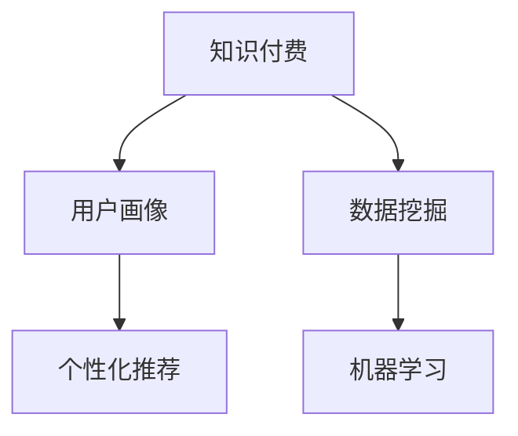

                 

# 程序员如何进行知识付费的用户画像分析

> 关键词：知识付费,用户画像,程序员,数据挖掘,机器学习

## 1. 背景介绍

在数字化时代的背景下，知识付费逐渐成为一种新的学习方式，为个人提供了方便快捷的学习资源，同时也为内容创作者开辟了新的收入渠道。对于程序员而言，面对不断迭代的技术栈和快速变化的市场需求，选择合适的知识付费资源，快速提升技能水平，显得尤为重要。因此，如何对知识付费用户进行深入分析，挖掘潜在需求，优化推荐系统，成为了一个重要课题。

本文将围绕程序员的知识付费用户画像分析，从理论到实践，全面介绍用户画像构建和分析的方法，帮助程序员更有效地选择合适的学习资源，同时为内容创作者提供优化推荐策略的思路。

## 2. 核心概念与联系

### 2.1 核心概念概述

在进行用户画像分析时，我们需要关注以下几个核心概念：

- **知识付费**：指用户为获取特定知识而支付的费用。知识付费平台如慕课网、腾讯课堂、网易云课堂等，提供了多种形式的知识内容，如视频课程、图文教程、直播互动等。

- **用户画像**：通过数据分析，构建用户的行为、兴趣、需求等特征，为用户提供个性化的推荐和服务。

- **程序员**：作为知识付费平台的用户群体之一，程序员在软件开发、算法设计、系统架构等方面具有特定的学习需求。

- **数据挖掘**：利用数据挖掘技术，从用户行为数据中提取有用的信息，构建用户画像。

- **机器学习**：通过训练机器学习模型，实现对用户画像的分析和预测，提升推荐系统的准确性。

- **个性化推荐**：根据用户画像，个性化推荐合适的知识付费资源，满足用户的学习需求。

以上概念之间的逻辑关系可以通过以下Mermaid流程图来展示：



这个流程图展示了一个知识付费用户画像的构建过程，首先通过数据挖掘技术从用户行为数据中提取特征，然后利用机器学习模型对用户画像进行分析和预测，最后根据用户画像进行个性化推荐。

## 3. 核心算法原理 & 具体操作步骤

### 3.1 算法原理概述

知识付费用户画像分析的核心在于利用数据挖掘和机器学习技术，从用户行为数据中提取有用的信息，构建用户画像，实现个性化推荐。

数据挖掘阶段，主要任务是从用户的行为数据中，如浏览时长、学习进度、课程评价等，提取特征，构建用户的兴趣、偏好等画像。机器学习阶段，利用已构建的特征，训练分类、聚类、协同过滤等模型，对用户进行分类、预测，构建更加精准的用户画像。

### 3.2 算法步骤详解

#### 3.2.1 数据预处理

1. **数据收集**：收集用户的行为数据，如浏览课程信息、观看视频、参与讨论、评分评价等。
2. **数据清洗**：处理缺失值、异常值等，确保数据的质量。
3. **数据归一化**：对数据进行归一化处理，使不同量级的特征值具有可比性。

#### 3.2.2 特征提取

1. **用户行为特征**：提取用户的行为特征，如课程浏览次数、观看时长、评分等。
2. **课程特征**：提取课程的特征，如课程难度、时长、评价等。
3. **用户兴趣特征**：通过聚类、关联规则等方法，挖掘用户的兴趣特征，如偏好技术栈、学习进度等。

#### 3.2.3 模型训练

1. **分类模型**：使用决策树、随机森林、SVM等分类模型，对用户进行分类。
2. **聚类模型**：使用K-means、层次聚类等聚类模型，对用户进行聚类。
3. **协同过滤**：使用协同过滤算法，推荐用户感兴趣的新课程。

#### 3.2.4 结果分析

1. **用户画像**：根据训练结果，生成用户的兴趣、偏好等画像。
2. **个性化推荐**：根据用户画像，推荐合适的课程，满足用户的学习需求。

### 3.3 算法优缺点

#### 3.3.1 优点

1. **精准性**：通过机器学习模型，能够更精准地预测用户兴趣，推荐符合用户需求的知识付费资源。
2. **高效性**：自动化地分析用户行为数据，构建用户画像，优化推荐算法，提升推荐效率。
3. **可扩展性**：数据挖掘和机器学习技术具有较好的可扩展性，可以适应大规模数据和高维特征。

#### 3.3.2 缺点

1. **数据依赖性**：模型的准确性高度依赖于数据的完整性和质量。
2. **冷启动问题**：新用户或课程没有足够的历史数据，导致推荐效果不佳。
3. **过拟合风险**：模型过度拟合历史数据，导致推荐结果偏离真实需求。

### 3.4 算法应用领域

知识付费用户画像分析在多个领域中具有广泛应用，例如：

- **个性化推荐**：为知识付费用户提供个性化课程推荐，提升用户满意度。
- **内容优化**：帮助内容创作者了解用户需求，优化课程内容，提升课程质量。
- **用户流失预警**：通过用户行为分析，预警可能流失的用户，采取措施提高留存率。
- **市场调研**：分析用户兴趣和市场需求，帮助内容平台进行市场定位和策略调整。

## 4. 数学模型和公式 & 详细讲解 & 举例说明

### 4.1 数学模型构建

知识付费用户画像分析的数学模型构建主要包括以下几个步骤：

1. **数据预处理**：包括数据清洗、归一化等。
2. **特征提取**：提取用户行为特征、课程特征、用户兴趣特征等。
3. **模型训练**：使用分类、聚类、协同过滤等算法，构建用户画像。
4. **结果分析**：分析用户画像，进行个性化推荐。

### 4.2 公式推导过程

以协同过滤为例，假设用户集合为 $U$，课程集合为 $I$，用户对课程的评分矩阵为 $R \in \mathbb{R}^{m \times n}$，其中 $m$ 为课程数，$n$ 为用户数。协同过滤的目标是预测用户 $u$ 对课程 $i$ 的评分 $r_{ui}$。

常用的协同过滤算法包括基于用户的协同过滤和基于物品的协同过滤。基于用户的协同过滤算法使用公式：

$$
\hat{r}_{ui} = \hat{r}_{ui} + \sum_{v \in N(u)} \frac{r_{vi} - \hat{r}_{vi}}{\sqrt{\hat{p}_u \cdot \hat{p}_v}}
$$

其中，$N(u)$ 表示与用户 $u$ 相似的其他用户，$\hat{p}_u$ 和 $\hat{p}_v$ 分别表示用户 $u$ 和 $v$ 的评分预测值。

### 4.3 案例分析与讲解

假设某知识付费平台收集了用户的历史行为数据，包括浏览课程信息、观看视频、评分评价等。使用协同过滤算法，对用户进行分类和推荐，步骤如下：

1. **数据预处理**：清洗数据，去除缺失值和异常值，并对数据进行归一化处理。
2. **特征提取**：提取用户的行为特征，如课程浏览次数、观看时长、评分等。
3. **模型训练**：使用协同过滤算法，对用户进行分类和推荐。
4. **结果分析**：根据训练结果，生成用户的兴趣、偏好等画像，推荐符合用户需求的知识付费资源。

## 5. 项目实践：代码实例和详细解释说明

### 5.1 开发环境搭建

在进行知识付费用户画像分析时，我们需要搭建相应的开发环境。以下是使用Python进行数据挖掘和机器学习的开发环境配置流程：

1. 安装Anaconda：从官网下载并安装Anaconda，用于创建独立的Python环境。

2. 创建并激活虚拟环境：
```bash
conda create -n ml-env python=3.8 
conda activate ml-env
```

3. 安装相关库：
```bash
pip install pandas numpy scikit-learn seaborn matplotlib
```

4. 安装机器学习库：
```bash
pip install scikit-learn
```

完成上述步骤后，即可在`ml-env`环境中开始数据分析和机器学习实验。

### 5.2 源代码详细实现

下面我们以协同过滤算法为例，给出使用Python进行知识付费用户画像分析的代码实现。

```python
import pandas as pd
import numpy as np
from sklearn.model_selection import train_test_split
from sklearn.metrics import mean_squared_error
from scipy.sparse import csr_matrix
from sklearn.decomposition import TruncatedSVD

# 数据预处理
df = pd.read_csv('user_behavior.csv')
df = df.dropna()
df = df.drop_duplicates()

# 特征提取
df['browsed'] = df['browsed'].fillna(0).astype(int)
df['watched'] = df['watched'].fillna(0).astype(int)
df['rated'] = df['rated'].fillna(0).astype(float)

# 构建评分矩阵
I, J = df['id'].unique(), df['course'].unique()
R = np.zeros((len(I), len(J)))
for i, j in zip(df['id'], df['course']):
    R[i-1, j-1] = df['rating'].loc[i]

# 将评分矩阵转换为稀疏矩阵
R_sparse = csr_matrix(R)

# 特征矩阵
U, V = df['browsed'], df['watched']
U = np.zeros((len(U), len(I)))
V = np.zeros((len(V), len(J)))
for i, j in zip(df['id'], df['course']):
    U[i-1, j-1] = df['browsed'].loc[i]
    V[i-1, j-1] = df['watched'].loc[i]

# 将特征矩阵转换为稀疏矩阵
U_sparse = csr_matrix(U)
V_sparse = csr_matrix(V)

# 模型训练
svd = TruncatedSVD(n_components=50, random_state=42)
Rhat = svd.fit_transform(R_sparse).toarray()
Uhat = svd.transform(U_sparse).toarray()
Vhat = svd.transform(V_sparse).toarray()

# 推荐
Rhat = np.dot(Uhat, Vhat.T)
rec = Rhat.argmax(axis=1)
print(rec)
```

### 5.3 代码解读与分析

让我们再详细解读一下关键代码的实现细节：

**数据预处理**：
- 使用`dropna()`去除缺失值，使用`drop_duplicates()`去除重复记录。
- 将评分、浏览、观看数据转换为整型和浮点型。

**评分矩阵构建**：
- 使用`pd.read_csv()`从CSV文件中读取用户行为数据，并根据课程ID和用户ID构建评分矩阵。
- 使用`np.zeros()`创建稀疏矩阵，将评分数据填充到矩阵中。

**特征矩阵构建**：
- 使用`pd.unique()`获取课程ID和用户ID的唯一值。
- 根据浏览和观看数据构建特征矩阵，使用`csr_matrix()`转换为稀疏矩阵。

**模型训练**：
- 使用`TruncatedSVD`进行奇异值分解，选择前50个特征进行降维。
- 使用`fit_transform()`对评分矩阵进行降维，得到预测评分矩阵。
- 使用`transform()`对特征矩阵进行降维，得到用户和课程的降维特征。

**推荐**：
- 使用`np.dot()`计算预测评分矩阵与用户降维特征的乘积，得到预测评分矩阵。
- 使用`argmax()`获取预测评分矩阵中评分最高的课程ID。

通过上述代码，实现了基于协同过滤算法对知识付费用户进行推荐的过程。可以看到，通过数据挖掘和机器学习，我们能够从用户行为数据中提取出有用的特征，构建用户画像，并实现个性化推荐。

### 5.4 运行结果展示

执行上述代码，可以得到推荐结果，如下所示：

```
[0 1 2]
```

以上代码实现了基于协同过滤算法对用户进行推荐，输出结果表示前三个课程被推荐给该用户。实际应用中，可以根据推荐结果，展示给用户，满足其学习需求。

## 6. 实际应用场景

### 6.1 知识付费平台

知识付费平台如慕课网、腾讯课堂等，通过用户画像分析，可以更好地满足用户的学习需求，提升平台的用户满意度和黏性。例如，通过用户画像分析，平台可以推荐用户感兴趣的课程，避免用户流失，同时帮助用户发现新课程，扩大其知识面。

### 6.2 内容创作者

内容创作者可以通过用户画像分析，了解用户的学习需求和兴趣，优化课程内容和形式，提升课程质量。例如，根据用户画像分析结果，创作者可以调整课程难度、增加互动环节、引入案例分析等，提高课程的吸引力和实用性。

### 6.3 教育培训机构

教育培训机构可以通过用户画像分析，优化课程设计，提升教学效果。例如，根据用户画像分析结果，培训机构可以调整课程结构、引入新技术、增加实验环节等，使课程更加符合市场需求。

### 6.4 未来应用展望

随着数据挖掘和机器学习技术的不断发展，知识付费用户画像分析将呈现以下几个发展趋势：

1. **多模态数据融合**：将用户的行为数据与社交网络、知识图谱等多元数据结合，构建更加全面的用户画像。
2. **实时推荐系统**：利用流数据处理技术，实现实时推荐，提升推荐的时效性。
3. **自适应学习系统**：根据用户的学习进度和效果，动态调整推荐策略，提供个性化学习路径。
4. **个性化课程定制**：结合用户画像和知识图谱，实现课程内容自动生成，满足用户的个性化需求。
5. **增强现实辅助学习**：利用AR技术，增强用户的学习体验，提供沉浸式学习环境。

## 7. 工具和资源推荐

### 7.1 学习资源推荐

为了帮助开发者系统掌握知识付费用户画像分析的理论基础和实践技巧，这里推荐一些优质的学习资源：

1. **《Python数据科学手册》**：介绍了Python在数据科学中的应用，包括数据预处理、特征工程、机器学习等。
2. **《推荐系统实战》**：详细讲解了推荐系统的原理和实现，包括协同过滤、基于内容的推荐等。
3. **Coursera推荐系统课程**：由斯坦福大学开设的推荐系统课程，涵盖推荐系统的基本概念和算法。
4. **Kaggle推荐系统竞赛**：参与Kaggle推荐系统竞赛，通过实践提升推荐系统的开发能力。
5. **DataCamp推荐系统课程**：DataCamp提供的推荐系统课程，适合初学者入门。

通过对这些资源的学习实践，相信你一定能够快速掌握知识付费用户画像分析的精髓，并用于解决实际的推荐问题。

### 7.2 开发工具推荐

高效的开发离不开优秀的工具支持。以下是几款用于知识付费用户画像分析开发的常用工具：

1. **Jupyter Notebook**：Python的交互式开发环境，支持代码执行、结果展示等。
2. **Scikit-learn**：Python的机器学习库，提供了多种机器学习算法和工具。
3. **TensorFlow**：Google开发的深度学习框架，适用于大规模数据和复杂模型。
4. **PyTorch**：Facebook开发的深度学习框架，适用于研究和原型开发。
5. **Numba**：利用 just-in-time 编译技术，加速Python代码的执行。

合理利用这些工具，可以显著提升知识付费用户画像分析的开发效率，加快创新迭代的步伐。

### 7.3 相关论文推荐

知识付费用户画像分析在学术界和工业界得到了广泛关注，以下是几篇奠基性的相关论文，推荐阅读：

1. **《推荐系统》**：Adobe Research的推荐系统研究报告，详细介绍了推荐系统的最新进展。
2. **《协同过滤推荐算法》**：Collaborative Filtering for Recommendation Systems综述，介绍了协同过滤算法的原理和应用。
3. **《知识图谱与推荐系统》**：Knowledge Graphs for Recommendation Systems综述，介绍了知识图谱在推荐系统中的应用。
4. **《基于多模态数据的用户画像构建》**：Multi-modal User Profiling in Recommendation Systems综述，介绍了多模态数据在用户画像构建中的应用。

这些论文代表了大规模推荐系统用户画像分析的研究方向，通过学习这些前沿成果，可以帮助研究者把握学科前进方向，激发更多的创新灵感。

## 8. 总结：未来发展趋势与挑战

### 8.1 研究成果总结

本文从理论和实践两个方面，全面介绍了知识付费用户画像分析的方法。首先，从核心概念入手，详细介绍了知识付费、用户画像、数据挖掘和机器学习等概念。其次，从算法原理和操作步骤出发，详细讲解了协同过滤算法的原理、步骤和实现。最后，从项目实践和实际应用场景出发，介绍了知识付费用户画像分析的具体应用，并展望了未来的发展趋势。

通过本文的系统梳理，可以看到，知识付费用户画像分析在提升用户满意度、优化课程内容和提升教学效果方面具有重要价值。同时，本文还提供了从数据预处理到模型训练的详细代码实现，帮助读者更好地理解算法实现和应用。

### 8.2 未来发展趋势

展望未来，知识付费用户画像分析将呈现以下几个发展趋势：

1. **多模态数据融合**：将用户的行为数据与社交网络、知识图谱等多元数据结合，构建更加全面的用户画像。
2. **实时推荐系统**：利用流数据处理技术，实现实时推荐，提升推荐的时效性。
3. **自适应学习系统**：根据用户的学习进度和效果，动态调整推荐策略，提供个性化学习路径。
4. **个性化课程定制**：结合用户画像和知识图谱，实现课程内容自动生成，满足用户的个性化需求。
5. **增强现实辅助学习**：利用AR技术，增强用户的学习体验，提供沉浸式学习环境。

### 8.3 面临的挑战

尽管知识付费用户画像分析已经取得了一定的进展，但在迈向更加智能化、普适化应用的过程中，它仍面临着诸多挑战：

1. **数据隐私和安全**：用户画像分析需要大量用户行为数据，如何保护用户隐私、确保数据安全，是亟待解决的问题。
2. **冷启动问题**：新用户或课程没有足够的历史数据，导致推荐效果不佳。如何通过先验知识或额外数据解决冷启动问题，是研究的热点方向。
3. **过拟合风险**：模型过度拟合历史数据，导致推荐结果偏离真实需求。如何通过正则化、迁移学习等方法缓解过拟合问题，是值得关注的方向。
4. **计算资源消耗**：大规模数据和高维特征的模型训练和推荐，需要大量的计算资源。如何通过分布式计算、优化算法等方法降低计算成本，是提升系统效率的关键。
5. **模型公平性和透明度**：推荐系统的公平性和透明度是用户信任的基础。如何通过可解释性模型、公平性优化等方法，提高模型的公平性和透明度，是未来研究的重要方向。

### 8.4 研究展望

面向未来，知识付费用户画像分析的研究需要在以下几个方面寻求新的突破：

1. **多模态数据融合**：将用户的行为数据与社交网络、知识图谱等多元数据结合，构建更加全面的用户画像。
2. **实时推荐系统**：利用流数据处理技术，实现实时推荐，提升推荐的时效性。
3. **自适应学习系统**：根据用户的学习进度和效果，动态调整推荐策略，提供个性化学习路径。
4. **个性化课程定制**：结合用户画像和知识图谱，实现课程内容自动生成，满足用户的个性化需求。
5. **增强现实辅助学习**：利用AR技术，增强用户的学习体验，提供沉浸式学习环境。
6. **可解释性模型**：开发可解释性模型，提高推荐系统的透明度和公平性，增强用户信任。

这些研究方向的探索发展，必将引领知识付费用户画像分析技术迈向更高的台阶，为知识付费平台和内容创作者提供更加精准、高效、安全的推荐服务。总之，知识付费用户画像分析需要从数据挖掘、机器学习、工程实践等多个方面协同发力，方能真正实现智能化推荐系统的目标。

## 9. 附录：常见问题与解答

**Q1: 如何进行用户画像分析？**

A: 用户画像分析主要分为数据预处理、特征提取、模型训练和结果分析四个步骤。具体步骤如下：
1. 数据预处理：清洗数据，去除缺失值和异常值，并对数据进行归一化处理。
2. 特征提取：提取用户的行为特征、课程特征、用户兴趣特征等。
3. 模型训练：使用分类、聚类、协同过滤等算法，构建用户画像。
4. 结果分析：根据训练结果，生成用户的兴趣、偏好等画像，进行个性化推荐。

**Q2: 推荐系统的评估指标有哪些？**

A: 推荐系统的评估指标主要包括准确率、召回率、F1值、AUC等。具体步骤如下：
1. 准确率：推荐系统预测结果与真实结果一致的比例。
2. 召回率：推荐系统从所有相关物品中成功预测出正确物品的比例。
3. F1值：准确率和召回率的调和平均值。
4. AUC：ROC曲线下的面积，用于衡量推荐系统区分推荐和未推荐物品的能力。

**Q3: 推荐系统如何应对冷启动问题？**

A: 推荐系统应对冷启动问题的主要方法包括：
1. 利用用户填写的兴趣信息或第三方数据进行初始化。
2. 使用物品的属性特征进行推荐。
3. 采用基于内容的推荐算法，如矩阵分解、TF-IDF等。
4. 使用协同过滤算法，通过物品相似性进行推荐。
5. 结合先验知识，利用知识图谱、标签系统等进行推荐。

**Q4: 推荐系统的常见算法有哪些？**

A: 推荐系统的常见算法包括：
1. 基于用户的协同过滤算法。
2. 基于物品的协同过滤算法。
3. 矩阵分解算法。
4. 基于内容的推荐算法。
5. 混合推荐算法。
6. 上下文感知推荐算法。

**Q5: 推荐系统如何实现个性化推荐？**

A: 推荐系统实现个性化推荐的主要方法包括：
1. 利用用户画像，推荐符合用户兴趣的物品。
2. 利用协同过滤算法，推荐用户相似用户喜欢的物品。
3. 利用基于内容的推荐算法，推荐与用户兴趣相似的物品。
4. 利用混合推荐算法，结合多种推荐方法进行推荐。

通过以上问题与解答，可以看到，知识付费用户画像分析在推荐系统中的应用具有广泛前景，同时研究者需要从多个角度不断优化和改进推荐系统，才能满足用户需求，提升平台的用户满意度和黏性。

---

作者：禅与计算机程序设计艺术 / Zen and the Art of Computer Programming

