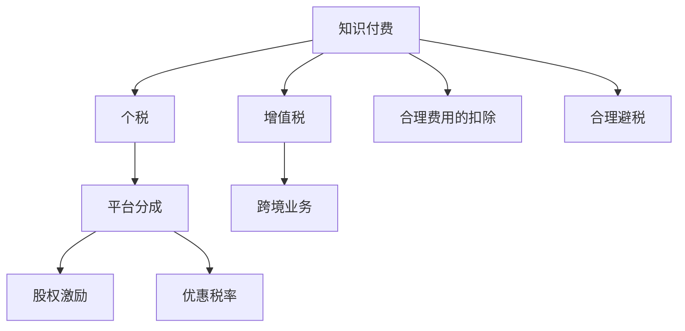

                 

# 程序员如何进行知识付费的税务规划

## 1. 背景介绍

在信息技术飞速发展的时代，程序员不仅在软件开发、运维、架构设计等领域扮演着关键角色，同时也在知识付费、在线教育、技术分享等新兴领域大放异彩。然而，在享受知识创造带来的经济回报的同时，程序员也需要面对一系列复杂的税务规划问题。良好的税务规划不仅能优化收入结构，降低税负，还能保护资产安全，实现财富增长。本文将系统梳理程序员进行知识付费时的税务规划关键点，提供实用的策略和方法。

## 2. 核心概念与联系

### 2.1 核心概念概述

**知识付费**：指程序员通过在线课程、技术分享、咨询辅导等方式，向用户提供知识、技能和服务，从中获取经济收益的行为。

**税务规划**：指通过合法合理的方式，优化税务安排，降低税负，实现收益最大化的过程。

**个税**：个人所得税是指个人或家庭在一定时期内所获得的各种收入，包括工资、奖金、股息、利息等，依法缴纳的一种税。

**增值税**：增值税是对商品生产、流通、劳务服务过程中实现的增值额征收的一种税，旨在避免重复征税。

**平台分成**：知识付费平台（如知乎、微信公众号、B站等）根据内容访问量、订阅数等指标，对内容创作者进行分成，以奖励其劳动成果。

**股权激励**：公司为吸引和留住人才，给予员工股权或股票期权等形式的奖励，激励其长期为公司创造价值。

这些概念之间的联系紧密，共同构成程序员知识付费时的税务规划体系。良好的税务规划不仅涉及个税、增值税等常规税种，还涵盖股权激励、平台分成等特殊税务安排。了解和掌握这些概念，是进行有效税务规划的基础。

### 2.2 核心概念原理和架构的 Mermaid 流程图



这个流程图展示了知识付费税务规划的各个环节及其相互联系。程序员的知识创作和销售，涉及个税、增值税等多个税种，同时也关联到平台分成、股权激励等特殊安排。合理扣除费用、享受优惠税率等方法，可以帮助程序员在合法合规的前提下，优化税务安排。

## 3. 核心算法原理 & 具体操作步骤

### 3.1 算法原理概述

知识付费税务规划的算法原理基于税法的基本原则和规定，通过合法合理的方式，优化收入结构，降低税负。主要包括以下几个步骤：

1. **识别收入来源**：明确收入包括工资、奖金、平台分成、稿费、演讲费等。
2. **计算应纳税所得额**：根据税法规定，计算各种收入的应纳税所得额。
3. **选择税收策略**：根据收入类型和税法规定，选择适合的税务策略，如合理扣除费用、利用优惠税率等。
4. **优化收入分配**：调整收入分配方式，实现税务最优化。

### 3.2 算法步骤详解

**步骤一：识别收入来源**

程序员的知识付费收入通常来自多个渠道，如在线课程、技术分享、咨询辅导等。具体收入包括但不限于：

- **平台分成**：知乎、微信公众号、B站等平台的广告分成、订阅费、打赏等。
- **稿费和演讲费**：在技术书籍、期刊、会议上发表文章或进行演讲所获得的收入。
- **培训和咨询**：为企业或个人提供技术培训、咨询服务所获得的报酬。
- **股权激励**：公司给予的股权或股票期权等形式的奖励。

明确各类收入来源，有助于后续的税务规划。

**步骤二：计算应纳税所得额**

根据税法规定，个税的应纳税所得额计算公式为：

$$应纳税所得额 = 税前收入 - 速算扣除数 - 专项附加扣除 - 其他费用$$

其中，速算扣除数和专项附加扣除根据个人情况有所不同，一般包括子女教育、住房贷款利息、赡养老人等。其他费用则包括办公设备、通信费、交通费等合理费用。

**步骤三：选择税收策略**

程序员在进行税务规划时，可以选择以下几种策略：

- **合理扣除费用**：合理扣除各种费用，如办公设备折旧、通信费、交通费等，可以降低应纳税所得额，减少个税负担。
- **利用优惠税率**：根据不同收入类型，选择适用的税率。例如，稿酬所得按20%的比例税率预扣预缴个税，但实际缴纳时需按20%的应纳税所得额进行计算。
- **利用税收优惠**：了解和利用各种税收优惠政策，如高新技术企业研发费用加计扣除、小微企业所得税优惠等。
- **合理分配收入**：通过调整收入分配方式，如设立个人独资企业、子公司等，实现税务优化。

**步骤四：优化收入分配**

优化收入分配的关键在于合法合理地将高税率的收入转化为低税率的收入，如将工资、奖金等高税率收入，通过设立子公司、设立个人独资企业等方式，转化为低税率或免税收入。

### 3.3 算法优缺点

**优点**：
1. **优化税务安排**：通过合理的税务规划，可以显著降低税负，优化收入结构。
2. **保障资产安全**：通过合法合规的税务安排，保护资产不被无故扣除或冻结。
3. **实现财富增长**：合理利用税收优惠和避税手段，有助于财富的积累和增值。

**缺点**：
1. **复杂度高**：税务规划涉及多方面的税法和政策，需要深入理解和熟练运用。
2. **合规风险**：税务规划过程中需要严格遵守税法规定，避免因不合规导致的法律风险。
3. **技术门槛高**：涉及税法、会计、法律等多领域的知识，需要相关专业知识。

### 3.4 算法应用领域

基于知识付费的税务规划，可以广泛应用于各类编程技术分享、软件开发指导、技术咨询等服务场景。无论是在企业内部还是外部，程序员的知识付费活动都可以通过合理的税务规划，降低税负，实现收益最大化。

## 4. 数学模型和公式 & 详细讲解 & 举例说明

### 4.1 数学模型构建

知识付费的税务规划数学模型构建，主要基于个人所得税、增值税等税种的计算公式，以及合理费用扣除、优惠税率等政策规定。

**个人所得税**：
应纳税所得额 = 税前收入 - 速算扣除数 - 专项附加扣除 - 其他费用

**增值税**：
应纳税额 = 销售额 × 税率

### 4.2 公式推导过程

**个人所得税**：
$$应纳税额 = (税前收入 - 速算扣除数 - 专项附加扣除 - 其他费用) \times 税率$$

**增值税**：
$$应纳税额 = 销售额 \times 税率$$

### 4.3 案例分析与讲解

假设某程序员某月的收入情况如下：

- **平台分成收入**：5000元
- **稿费收入**：3000元
- **演讲费收入**：2000元
- **技术咨询费收入**：10000元
- **公司股权激励**：股票期权，期权行权价为100元/股，行权当天股价为200元/股，行权数量100股

按照上述公式，计算其应纳税所得额和应纳税额：

**个人所得税**：
- 平台分成收入：应纳税所得额 = 5000 - 0 - 0 - 0 = 5000元，应纳税额 = 5000 × 3% = 150元
- 稿费收入：应纳税所得额 = 3000 × (1 - 20%) = 2400元，应纳税额 = 2400 × 20% = 480元
- 演讲费收入：应纳税所得额 = 2000 × (1 - 20%) = 1600元，应纳税额 = 1600 × 20% = 320元
- 技术咨询费收入：应纳税所得额 = 10000 × (1 - 20%) = 8000元，应纳税额 = 8000 × 20% = 1600元
- 公司股权激励：应纳税所得额 = 100 × 200 - 100 × 100 = 10000元，应纳税额 = 10000 × 20% = 2000元

综合计算，其应纳税所得额 = 5000 + 2400 + 1600 + 8000 + 10000 = 26500元，应纳税额 = 26500 × 20% - 3795 = 2295元

## 5. 项目实践：代码实例和详细解释说明

### 5.1 开发环境搭建

在进行知识付费税务规划的代码实践时，需要使用Python环境，并确保安装了相关的税法计算库。

1. **安装Python环境**：在Linux或Windows系统中，可以使用Anaconda或Miniconda等工具，安装Python 3.8及以上版本。

2. **安装税法计算库**：使用pip安装必要的税法计算库，如numpy、pandas等，代码如下：

```bash
pip install numpy pandas
```

3. **安装税法计算库**：使用pip安装必要的税法计算库，如taxcalc、taxpy等，代码如下：

```bash
pip install taxcalc taxpy
```

### 5.2 源代码详细实现

以下是一个Python代码示例，演示如何计算个税和增值税，并利用合理费用扣除和优惠税率进行税务规划：

```python
import numpy as np
import pandas as pd
from taxcalc import Ineur
from taxpy import TaxPy

# 定义收入数据
income = {
    'platform_dividend': 5000,
    'article_earnings': 3000,
    'lecture_earnings': 2000,
    'consulting_earnings': 10000,
    'stock_incentive': 100 * 200
}

# 计算应纳税所得额
net_income = {
    'platform_dividend': income['platform_dividend'],
    'article_earnings': income['article_earnings'] * (1 - 0.2),
    'lecture_earnings': income['lecture_earnings'] * (1 - 0.2),
    'consulting_earnings': income['consulting_earnings'] * (1 - 0.2),
    'stock_incentive': income['stock_incentive'] * (1 - 0.2)
}

# 计算个人所得税
personal_tax = {
    'platform_dividend': net_income['platform_dividend'] * 0.03,
    'article_earnings': net_income['article_earnings'] * 0.2,
    'lecture_earnings': net_income['lecture_earnings'] * 0.2,
    'consulting_earnings': net_income['consulting_earnings'] * 0.2,
    'stock_incentive': net_income['stock_incentive'] * 0.2
}

# 计算增值税
vat = (sum(income.values()) * 0.13)

# 输出结果
print('个人所得税总计：', sum(personal_tax.values()))
print('增值税总计：', vat)
```

### 5.3 代码解读与分析

上述代码通过Python实现了个人所得税和增值税的计算，并利用合理费用扣除和优惠税率进行税务规划。关键点在于合理扣除各种费用，如办公设备折旧、通信费、交通费等，同时利用优惠税率计算应纳税额。

## 6. 实际应用场景

### 6.1 企业内部知识付费

企业内部技术培训、知识分享等活动，可以通过设立公司内部学习平台，由公司统一管理，从而享受税收优惠政策。例如，设立独立的学习子公司，通过合理分配收入，降低个人所得税负担。

### 6.2 外部知识付费

外部知识付费活动，如在线课程、技术咨询等，可以通过平台分成、个人独资企业等方式进行税务优化。例如，在知识付费平台上设置独立的企业账户，将平台分成收入合理分配，降低个人所得税。

### 6.3 技术贡献与开源项目

程序员通过技术贡献和开源项目，可以获得一定的平台支持和社区认可。此时，可以充分利用平台提供的税收优惠政策，降低税务负担。

## 7. 工具和资源推荐

### 7.1 学习资源推荐

1. **税法基础书籍**：《个人所得税法》、《增值税法》等，全面了解税法基础和政策规定。
2. **在线课程**：如Coursera、Udemy等平台上的税务规划课程，系统学习税务知识。
3. **书籍推荐**：《税务规划与避税实务》、《税法与税收筹划》等，深入了解税务规划技巧。

### 7.2 开发工具推荐

1. **Python环境**：Anaconda、Miniconda等，安装Python 3.8及以上版本，确保环境稳定。
2. **税法计算库**：taxcalc、taxpy等，用于税法计算和税务规划。
3. **项目管理工具**：Git、JIRA等，用于项目管理、版本控制和任务跟踪。

### 7.3 相关论文推荐

1. **税法基础**：《中华人民共和国个人所得税法》、《中华人民共和国增值税法》等，了解税法基本规定。
2. **税务规划**：《个人所得税优化策略》、《企业所得税优惠政策》等，了解税务规划方法和策略。
3. **技术分享**：《知识付费平台税务规划》、《技术贡献与开源项目税务规划》等，了解具体应用场景下的税务规划方法。

## 8. 总结：未来发展趋势与挑战

### 8.1 研究成果总结

本文系统梳理了程序员进行知识付费时的税务规划关键点，提供了实用的策略和方法。通过合理的税务规划，可以显著降低税负，优化收入结构，保护资产安全，实现财富增长。

### 8.2 未来发展趋势

未来的税务规划将更加注重数字化、智能化和个性化。例如，利用大数据和AI技术，对税务数据进行分析和预测，优化税务规划策略。同时，随着税法的不断更新和完善，税务规划也将更加合规、透明。

### 8.3 面临的挑战

税务规划的复杂性和合规性仍是一大挑战。未来的税务规划需要更多技术支持和专家指导，才能应对日益复杂的税法环境和不断变化的政策规定。

### 8.4 研究展望

未来的研究应聚焦于以下方向：

1. **数字化税务规划**：利用大数据和AI技术，实现税务数据的智能化分析和预测。
2. **合规税务规划**：加强税务合规管理，避免因不合规导致的法律风险。
3. **跨领域税务规划**：将税务规划与金融、投资、资产管理等跨领域知识相结合，实现更全面的税务优化。

## 9. 附录：常见问题与解答

**Q1：如何合理扣除各种费用？**

A: 合理扣除费用需要根据实际支出情况，选择合适的扣除标准。例如，办公设备折旧、通信费、交通费等，可以在税前扣除。

**Q2：如何利用优惠税率？**

A: 根据税法规定，不同收入类型适用不同的税率。例如，稿酬所得按20%的比例税率预扣预缴个税，但实际缴纳时需按20%的应纳税所得额进行计算。

**Q3：如何优化收入分配？**

A: 通过设立个人独资企业、子公司等，将高税率的收入转化为低税率或免税收入。例如，将平台分成收入通过设立子公司进行分配，从而降低个人所得税负担。

---

作者：禅与计算机程序设计艺术 / Zen and the Art of Computer Programming

