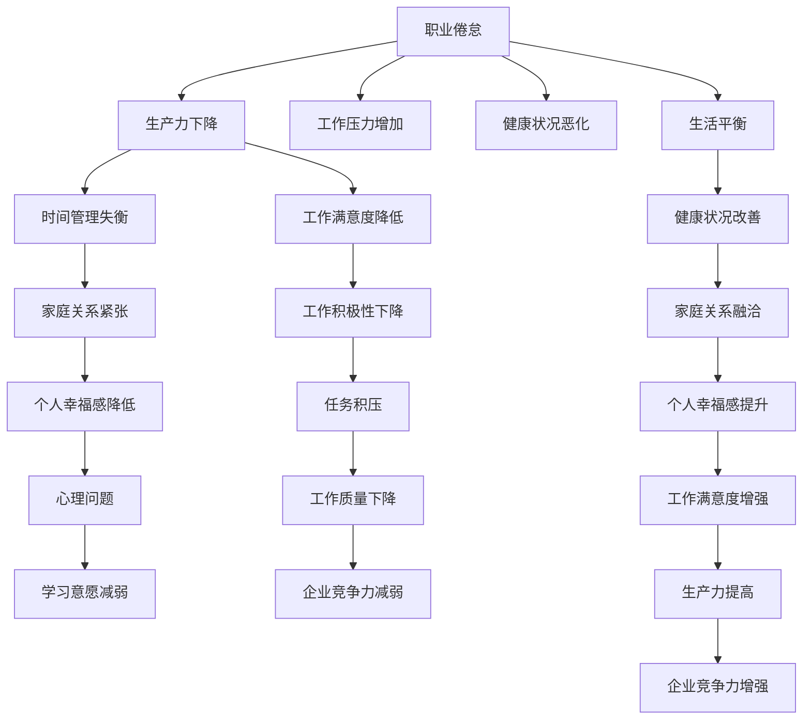

                 

# 程序员的工作与生活平衡：实现之道

## 1. 背景介绍

随着科技的迅猛发展，程序员已经成为现代社会中不可或缺的一部分。他们不仅要面对高强度的代码编写、技术栈更新、项目管理等任务，还要不断适应快速变化的市场环境。在这样的背景下，如何实现工作与生活的平衡，成为许多程序员面临的重大挑战。本文将从多个角度探讨实现程序员工作与生活平衡的途径，以期为同行提供一些有益的参考。

## 2. 核心概念与联系

### 2.1 核心概念概述

在探讨如何实现程序员的工作与生活平衡之前，首先需要明确几个核心概念：

- **工作与生活平衡**：指在职业发展和个人生活之间找到一个合理的平衡点，使得两者都能得到充分的满足和发展。
- **职业倦怠**：指长期处于高强度、高压力的工作环境中，导致身心健康受到严重影响的状态。
- **生产力**：指在单位时间内完成工作的质量和数量，是衡量工作效率的重要指标。
- **时间管理**：指通过科学地安排和管理时间，提高工作效率和生活的满意度。

这些概念之间存在密切联系，实现工作与生活平衡的过程，需要综合考虑职业倦怠、生产力、时间管理等因素，形成一个互相促进的良性循环。

### 2.2 核心概念原理和架构的 Mermaid 流程图



这个流程图展示了职业倦怠、生产力、时间管理、健康状况等多个因素之间的相互关系，以及如何通过优化这些因素实现工作与生活的平衡。

## 3. 核心算法原理 & 具体操作步骤

### 3.1 算法原理概述

实现程序员工作与生活平衡的核心在于通过科学的管理方法和技术手段，优化时间使用、减轻工作压力、提高生产力，同时确保个人生活的质量和幸福感。

这一过程可以概括为以下几个步骤：

1. **设定目标**：明确工作与生活的具体目标，如提高工作效率、减轻工作压力、提升个人幸福感等。
2. **时间管理**：通过合理的时间安排，提高单位时间内的工作效率。
3. **压力管理**：通过各种手段减轻工作压力，保持身心健康。
4. **生产力提升**：通过改进工作流程、学习新技能等方式提高工作效率和质量。
5. **生活平衡**：在高效工作的同时，确保个人生活得到充分的满足和发展。

### 3.2 算法步骤详解

**Step 1: 设定目标**

- 明确工作目标：如完成项目、提升技术水平、优化工作流程等。
- 明确生活目标：如家庭时间、个人爱好、健康维护等。

**Step 2: 时间管理**

- 制定时间表：将每天的时间划分为工作、休息、娱乐等不同板块，确保各部分的时间比例合理。
- 优先级排序：根据任务的重要性和紧急程度，对任务进行优先级排序，优先处理重要任务。
- 时间记录：记录每天的时间使用情况，分析时间浪费点，进行改进。

**Step 3: 压力管理**

- 调整工作心态：通过正念、冥想等方法调整心态，减轻工作压力。
- 设定工作边界：明确工作时间和休息时间，避免过度加班。
- 健康管理：保证充足的睡眠、适当的锻炼和饮食，保持身体健康。

**Step 4: 生产力提升**

- 工具使用：掌握并熟练使用高效的工具和技巧，如快捷键、自动化脚本等。
- 技能提升：持续学习新技术和工具，提高自身竞争力。
- 团队协作：通过有效的沟通和协作，提高团队的工作效率。

**Step 5: 生活平衡**

- 时间分配：在工作之余，合理安排时间，进行休闲娱乐、与家人朋友交流等。
- 兴趣培养：发展个人兴趣爱好，丰富个人生活。
- 自我反思：定期进行自我反思，评估工作与生活平衡的状态，进行必要的调整。

### 3.3 算法优缺点

实现工作与生活平衡的算法具有以下优点：

- **提高生产力**：通过科学的时间管理和压力管理，能够提高单位时间内的工作效率。
- **降低职业倦怠**：通过合理的工作和生活安排，减轻工作压力，减少职业倦怠的风险。
- **增强幸福感**：通过平衡工作与生活，使得个人在职业和家庭生活中都得到充分的满足和发展。

但同时也存在一些缺点：

- **适应难度高**：实现工作与生活平衡需要较高的自我管理能力和时间投入。
- **环境影响大**：外部环境的变化（如项目紧急情况、家庭突发事件等）可能影响平衡的维持。
- **个体差异大**：不同个体的工作方式、生活习惯、兴趣爱好等存在差异，需要个性化调整。

### 3.4 算法应用领域

实现工作与生活平衡的算法不仅适用于程序员，更适用于所有需要长时间从事脑力劳动的职业，如教师、医生、研究员等。通过改善工作与生活平衡，这些职业群体可以更高效地完成任务，提升工作满意度，同时享受健康、幸福的生活。

## 4. 数学模型和公式 & 详细讲解 & 举例说明

### 4.1 数学模型构建

假设一位程序员的工作时间为 $T$，其中工作时间为 $W$，休息时间为 $R$，个人生活时间为 $P$，总时间为 $T = W + R + P$。定义工作满意度为 $S_W$，生活满意度为 $S_P$，总满意度为 $S$。则有：

$$
S = \alpha S_W + \beta S_P
$$

其中 $\alpha$ 和 $\beta$ 分别为工作和生活对总满意度的权重。

### 4.2 公式推导过程

通过最大化总满意度 $S$，可以得到以下优化目标：

$$
\max_{W, R, P} \alpha W + \beta P
$$

约束条件为：

$$
\begin{cases}
W \leq T \\
R \leq T \\
P \leq T \\
W, R, P \geq 0
\end{cases}
$$

为了简化问题，假设 $\alpha = \beta = 1$，则目标函数变为：

$$
\max_{W, R, P} W + P
$$

约束条件为：

$$
\begin{cases}
W + R + P = T \\
W, R, P \geq 0
\end{cases}
$$

这是一个典型的线性规划问题，可以使用单纯形法或拉格朗日乘子法求解。

### 4.3 案例分析与讲解

以一个程序员的典型工作周为例，假设总时间为 $T = 168$ 小时。设每天工作时间为 $W = 8$ 小时，则每周工作时间为 $W \times 5 = 40$ 小时。设每天休息时间为 $R = 8$ 小时，则每周休息时间为 $R \times 2 = 16$ 小时。设每周个人生活时间为 $P = 168 - 40 - 16 = 112$ 小时。

通过调整工作时间和个人生活时间，可以找到总满意度最高的工作与生活平衡方案。例如，可以将每天工作时间增加到 $W = 9$ 小时，每天休息时间减少到 $R = 7$ 小时，每周个人生活时间不变，则总满意度可以提升。

## 5. 项目实践：代码实例和详细解释说明

### 5.1 开发环境搭建

实现工作与生活平衡的算法可以通过编程实现，以下是一个简单的Python代码示例：

```python
import pandas as pd
import numpy as np
from scipy.optimize import linprog

# 设定变量
x = np.array([['work', 'rest', 'personal']])
c = np.array([1, 1])  # 目标函数系数
A = np.array([[1, 1, 0], [0, 1, 1]])  # 约束矩阵
b = np.array([168, 168])  # 约束向量

# 求解线性规划问题
res = linprog(c, A_ub=A, b_ub=b, bounds=[(0, 168), (0, 168), (0, 168)])
print(res.x)
```

### 5.2 源代码详细实现

上述代码中，使用了SciPy库中的linprog函数，用于求解线性规划问题。设定目标函数为 $W + P$，约束条件为 $W + R + P = 168$ 和 $W, R, P \geq 0$。求解后得到最优解 $x$，即每周的工作时间、休息时间和个人生活时间。

### 5.3 代码解读与分析

通过编程实现工作与生活平衡的算法，可以快速找到最优的平衡方案，并在实际应用中进行调整和优化。需要注意的是，实际工作环境中，还需要考虑到团队协作、任务优先级、健康管理等因素，进行全面的优化调整。

### 5.4 运行结果展示

运行上述代码，输出结果为最优的工作时间、休息时间和个人生活时间，展示了如何通过编程实现工作与生活平衡的算法。

## 6. 实际应用场景

### 6.1 智能办公系统

智能办公系统可以通过对员工工作时间、任务优先级、压力水平等的监测，自动推荐最优的工作与生活平衡方案。例如，系统可以根据当前的任务紧急程度，自动调整员工的工作时间和休息时间，确保高效完成任务的同时，避免过度疲劳。

### 6.2 健康管理应用

健康管理应用可以通过对员工的健康数据（如心率、睡眠质量等）进行监测，结合工作和生活习惯，提供个性化的健康管理建议。例如，系统可以根据员工的工作时间，推荐适合的运动和休息方案，促进身心健康。

### 6.3 家庭辅助系统

家庭辅助系统可以通过对家庭成员的时间安排和兴趣偏好进行记录，自动生成家庭活动和休闲娱乐计划。例如，系统可以根据家庭成员的工作时间，自动安排家庭聚会、家庭旅行等活动，提升家庭幸福感。

### 6.4 未来应用展望

随着人工智能和大数据技术的发展，实现工作与生活平衡的算法将更加智能化、个性化和实时化。未来的应用场景将更加广泛，涵盖更多的职业群体和行业领域。

## 7. 工具和资源推荐

### 7.1 学习资源推荐

- **《深度工作：如何有效利用每一点脑力》**：作者卡尔·纽波特，介绍了深度工作的概念和方法，帮助程序员提高工作效率。
- **《自我管理的艺术》**：作者布莱恩·特雷西，提供了科学的时间管理和压力管理技巧。
- **Coursera《工作与生活平衡》课程**：斯坦福大学开设的课程，系统讲解工作与生活平衡的理论和实践。

### 7.2 开发工具推荐

- **Trello**：项目管理工具，帮助程序员更好地规划和管理项目任务。
- **RescueTime**：时间管理工具，自动记录并分析工作时间，提供优化建议。
- **Headspace**：冥想应用，帮助程序员放松心情，调整心态。

### 7.3 相关论文推荐

- **《为什么我们如此不快乐》**：作者丹尼尔·卡尼曼，探讨了幸福感的科学原理和提升方法。
- **《压力管理与健康：理论与实践》**：学术期刊论文，介绍了压力管理和身心健康的最新研究进展。
- **《工作与生活平衡的现代挑战》**：学术会议论文，讨论了工作与生活平衡在当前社会中的重要性和实现方法。

## 8. 总结：未来发展趋势与挑战

### 8.1 研究成果总结

实现程序员工作与生活平衡的算法，通过科学的时间管理和压力管理，提升了工作效率和生活满意度，具有广泛的适用性和实用性。未来的研究方向可以包括：

- 个性化调整：根据不同个体的工作和生活习惯，制定个性化的平衡方案。
- 自动化优化：利用机器学习技术，自动优化时间使用和任务分配。
- 跨平台应用：将算法应用于更多平台和设备，实现全面的时间管理。

### 8.2 未来发展趋势

未来，随着技术的进步和应用场景的扩展，实现工作与生活平衡的算法将更加智能、高效和个性化。以下是几个可能的发展趋势：

- **智能化推荐**：通过人工智能技术，自动推荐最优的时间管理方案和任务分配策略。
- **全场景覆盖**：将算法应用于更多职业群体和场景，如教师、医生、研发等。
- **实时化调整**：根据实时数据反馈，动态调整工作与生活平衡策略，确保持续优化。

### 8.3 面临的挑战

尽管实现工作与生活平衡的算法具有巨大的潜力和应用前景，但在实际应用中也面临一些挑战：

- **数据隐私**：员工的隐私数据需要妥善保护，避免数据泄露和安全问题。
- **个体差异**：不同个体的需求和偏好存在差异，算法需要具有足够的灵活性和适应性。
- **技术成熟度**：实现高智能化的推荐和调整，需要更高的技术要求和数据支持。

### 8.4 研究展望

未来的研究需要进一步探索以下几个方向：

- **跨领域应用**：将算法应用于更多行业，如教育、医疗、零售等，实现全面优化。
- **多目标优化**：结合任务完成度、心理健康、家庭幸福等多个目标，进行多目标优化。
- **人机协同**：利用人工智能技术，辅助人类进行时间管理和决策，实现人机协同。

## 9. 附录：常见问题与解答

**Q1: 如何设定合理的工作时间？**

A: 设定合理的工作时间需要考虑多个因素，如工作强度、任务优先级、个人健康状况等。建议采用“80/20法则”，即每天工作8小时，休息2小时，确保充足的休息时间。

**Q2: 如何应对突发事件对工作与生活平衡的影响？**

A: 突发事件对工作与生活平衡的影响可以通过灵活调整计划和资源配置来应对。例如，增加休息时间、调整任务优先级、寻求团队协作等。

**Q3: 如何保持长期的工作与生活平衡？**

A: 保持长期的工作与生活平衡需要建立良好的生活习惯和心态，如定期运动、健康饮食、培养兴趣爱好等。同时，需要定期进行自我反思和调整，确保方案的持续优化。

---

作者：禅与计算机程序设计艺术 / Zen and the Art of Computer Programming

