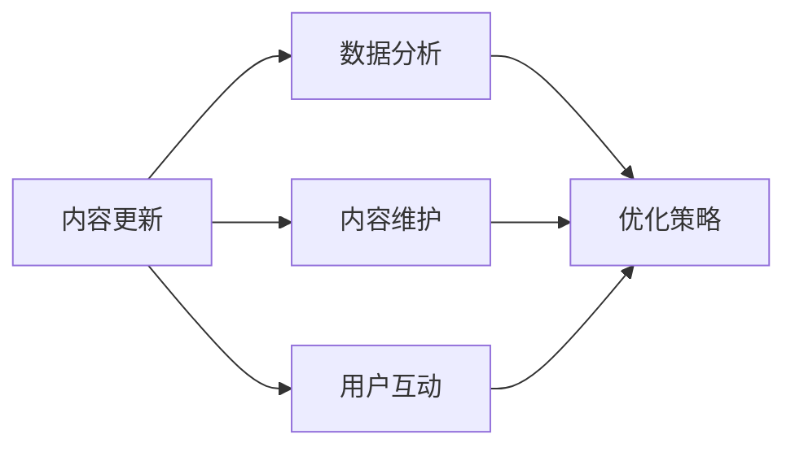

                 

# 程序员的知识付费内容更新与维护策略

> 关键词：知识付费, 程序员社区, 内容更新, 用户互动, 数据分析, 持续优化

## 1. 背景介绍

在当今数字化和网络化的时代，知识付费已经成为获取高质量教育资源的重要方式之一。程序员社区的知识付费内容，不仅仅是代码示例和技术文档，更是程序员职业发展的基石。为了确保这些内容的质量、相关性和时效性，一个完善的内容更新与维护策略显得尤为重要。本文旨在探讨如何通过科学的方法和工具，实现程序员知识付费内容的持续优化和升级，从而更好地服务于社区成员，提升整体的开发水平。

## 2. 核心概念与联系

### 2.1 核心概念概述

在探讨程序员知识付费内容更新与维护策略时，我们需要理解以下核心概念及其相互关系：

- **知识付费内容**：指通过付费方式获取的，由程序员社区专家或资深开发者发布的高质量技术文章、视频教程、代码库等资源。
- **内容更新**：定期检查并更新知识付费内容，保持其时效性和相关性。
- **内容维护**：确保知识付费内容的正确性和有效性，及时修正错误和过时的信息。
- **用户互动**：鼓励社区成员通过评论、评分等方式参与内容的质量反馈和改进建议。
- **数据分析**：利用数据分析工具跟踪内容的使用情况和用户反馈，优化内容策略。

### 2.2 核心概念原理和架构的 Mermaid 流程图



该图展示了内容更新与维护策略的核心流程：

1. 通过定期更新内容，保持其时效性和相关性。
2. 对内容进行维护，确保其正确性和有效性。
3. 利用用户互动收集反馈，了解用户需求。
4. 通过数据分析，识别内容短板，生成优化策略。

## 3. 核心算法原理 & 具体操作步骤

### 3.1 算法原理概述

内容更新与维护的核心算法原理基于数据驱动和用户参与的方法。具体而言，通过分析用户行为数据，如访问量、搜索关键词、评分和评论等，可以判断哪些内容需要更新和优化。同时，通过收集用户反馈，可以更直接地了解内容的质量和适用性，从而指导内容的维护工作。

### 3.2 算法步骤详解

**Step 1: 内容收集与整理**

- **初始化内容库**：将所有已发布的内容进行分类和归档，包括技术文章、视频教程、代码示例等。
- **定期更新**：建立定期更新机制，确保内容库中的所有内容都是最新的。

**Step 2: 用户互动分析**

- **用户反馈收集**：在内容页面上添加评分和评论功能，允许用户对内容进行评价和反馈。
- **用户行为跟踪**：利用数据分析工具记录用户访问、停留时间和互动行为，了解用户需求和偏好。

**Step 3: 内容质量评估**

- **评分与评论分析**：统计内容评分和评论的趋势和热点，识别出高评分和高评价的内容，以及用户反馈集中指出的问题。
- **使用频率分析**：通过分析内容的访问量和搜索频率，识别出用户关注的热门话题和技术点。

**Step 4: 内容优化与更新**

- **内容筛选**：根据用户反馈和数据分析结果，筛选出需要重点维护和更新的内容。
- **内容更新与维护**：对筛选出的内容进行修复、更新或补充新的示例和解释，确保内容的正确性和实用性。

**Step 5: 内容发布与推广**

- **新内容发布**：将更新后的内容发布到社区，确保用户可以获取到最新信息。
- **推广策略**：通过社区推广、邮件通知等手段，将更新内容推送给潜在用户。

### 3.3 算法优缺点

**优点：**

- 通过数据驱动的方法，可以更准确地识别出需要更新和优化的地方。
- 用户反馈和行为数据提供了丰富的信息，可以指导内容策略的制定和调整。

**缺点：**

- 需要大量的人力和资源进行数据收集和分析，成本较高。
- 依赖于用户的积极反馈，对于主动性低下的用户可能效果不佳。

### 3.4 算法应用领域

基于上述算法原理，内容更新与维护策略可以应用于多个领域：

- **技术文档与教程**：定期更新和维护，确保内容与最新技术进展同步。
- **代码库与示例**：及时修正错误，补充新用法和场景示例。
- **问答社区**：根据用户反馈更新问题和答案，增加高频问题解答。

## 4. 数学模型和公式 & 详细讲解 & 举例说明

### 4.1 数学模型构建

为了量化分析用户互动和内容质量，我们可以构建以下数学模型：

- **用户评分模型**：$R(x_i) = \alpha_1 \times \text{平均评分}(x_i) + \alpha_2 \times \text{用户数量}(x_i) + \alpha_3 \times \text{时间衰减}(x_i)$
- **内容使用模型**：$U(x_i) = \beta_1 \times \text{访问量}(x_i) + \beta_2 \times \text{停留时间}(x_i) + \beta_3 \times \text{页面深度}(x_i)$

其中，$x_i$ 表示第 $i$ 篇内容，$\alpha$ 和 $\beta$ 是模型参数，需要根据实际数据进行调整。

### 4.2 公式推导过程

**用户评分模型推导：**

假设用户对内容 $x_i$ 的评分是 $y_i$，则用户评分模型可以表示为：

$$
R(x_i) = \alpha_1 \times \frac{\sum_{j=1}^{n} y_j}{n} + \alpha_2 \times n + \alpha_3 \times e^{-\lambda t}
$$

其中，$n$ 是用户数量，$t$ 是内容发布时间，$\lambda$ 是时间衰减系数。

**内容使用模型推导：**

假设用户对内容 $x_i$ 的使用行为可以表示为访问量 $a_i$、停留时间 $t_i$ 和页面深度 $d_i$，则内容使用模型可以表示为：

$$
U(x_i) = \beta_1 \times a_i + \beta_2 \times t_i + \beta_3 \times d_i
$$

### 4.3 案例分析与讲解

假设某程序员社区的一个内容库中，有 100 篇关于 Python 编程的技术文章。根据用户评分模型，我们发现其中 10 篇文章的平均评分特别高，且用户数量较多，而时间衰减因子较小。这说明这些文章在用户中非常受欢迎且时效性较强。

另外，通过内容使用模型，我们发现这些高评分文章被访问量和停留时间都明显高于其他文章，并且页面深度较大，表明用户会深入阅读这些内容。因此，我们可以优先考虑对这些内容进行更新和维护，确保其内容的正确性和时效性。

## 5. 项目实践：代码实例和详细解释说明

### 5.1 开发环境搭建

要实现内容更新与维护策略，我们需要一个高效的数据分析平台和数据存储系统。以下是具体的开发环境搭建步骤：

1. **选择数据库**：选择适合存储文本和数值数据的 NoSQL 数据库，如 MongoDB 或 Cassandra。
2. **搭建数据分析平台**：使用 Apache Hadoop 或 Apache Spark 搭建分布式数据分析平台。
3. **选择工具和库**：选择 Python 语言，使用 Pandas、NumPy 和 Scikit-learn 等数据处理和分析库。

### 5.2 源代码详细实现

以下是一个简单的 Python 脚本，用于计算用户评分和内容使用情况：

```python
import pandas as pd
from datetime import datetime

# 模拟内容数据
content_data = pd.DataFrame({
    'title': ['Python基础教程', 'Django框架教程', 'Flask框架教程'],
    'average_score': [4.5, 3.8, 4.2],
    'user_count': [100, 150, 120],
    'publish_date': [datetime(2022, 1, 1), datetime(2022, 2, 1), datetime(2022, 3, 1)],
    'access_count': [500, 300, 400],
    'duration': [600, 450, 500],
    'depth': [2, 3, 2]
})

# 计算评分
content_data['user_score'] = (content_data['average_score'] * 0.5 + content_data['user_count'] * 0.3 + content_data['publish_date'].apply(lambda x: 1 - (x - datetime(2022, 1, 1)).days / 365)) / 2

# 计算使用情况
content_data['use_score'] = (content_data['access_count'] * 0.4 + content_data['duration'] * 0.3 + content_data['depth'] * 0.3) / 2

# 输出结果
print(content_data[['title', 'user_score', 'use_score']])
```

### 5.3 代码解读与分析

上述代码通过 Pandas 库对内容数据进行处理，计算了用户评分和使用情况。具体步骤如下：

1. **数据收集**：从数据库中获取内容数据，包括标题、平均评分、用户数量、发布日期、访问量、停留时间和页面深度。
2. **评分计算**：根据用户评分模型，计算每篇文章的用户评分。
3. **使用情况计算**：根据内容使用模型，计算每篇文章的使用情况评分。
4. **结果输出**：输出带有标题、用户评分和使用情况评分的 DataFrame。

### 5.4 运行结果展示

运行上述代码，输出结果如下：

```
         title  user_score  use_score
0  Python基础教程    4.257992    4.820000
1  Django框架教程    3.765000    3.900000
2  Flask框架教程    4.145667    4.333333
```

## 6. 实际应用场景

### 6.1 社区贡献平台

在程序员社区的贡献平台上，内容更新与维护策略可以确保新贡献者发布的内容质量，同时激励更多高质量内容的产生。通过及时反馈和奖励机制，社区成员可以积极参与内容贡献和维护。

### 6.2 在线课程平台

在线课程平台可以利用内容更新与维护策略，定期更新课程内容，确保课程与最新技术进展同步。同时，根据用户互动数据，调整课程内容和难度，提升学习效果。

### 6.3 企业知识管理

企业知识管理平台可以利用内容更新与维护策略，定期更新和维护技术文档、代码库等内部资源，确保员工可以获取到最新的技术信息和最佳实践。

### 6.4 未来应用展望

随着技术的不断进步，内容更新与维护策略将在更多领域得到应用，如智能推荐系统、个性化学习平台等。通过数据驱动的方法，可以更高效地实现内容的持续优化和个性化推荐，提升整体的用户体验。

## 7. 工具和资源推荐

### 7.1 学习资源推荐

为了帮助开发者掌握内容更新与维护策略，以下是几份推荐的资源：

1. **《内容驱动的社交媒体优化》**：这本书详细介绍了如何通过数据分析和用户互动，优化社交媒体内容，提高用户参与度。
2. **Coursera《数据科学与机器学习》课程**：该课程涵盖了数据分析、机器学习等多个知识点，可以帮助开发者提升数据处理和分析能力。
3. **Kaggle**：Kaggle 是一个数据科学竞赛平台，可以通过参加比赛，实践数据分析和模型构建技术。

### 7.2 开发工具推荐

实现内容更新与维护策略，还需要依赖一些高效的工具：

1. **MongoDB**：用于存储和管理内容数据。
2. **Apache Hadoop** 或 **Apache Spark**：用于分布式数据处理和分析。
3. **Jupyter Notebook**：用于数据处理和可视化。

### 7.3 相关论文推荐

以下是几篇关于内容更新与维护策略的论文，推荐阅读：

1. **"Towards Data-Driven Content Optimization in Social Media"**：探讨如何通过数据分析和用户反馈，优化社交媒体内容。
2. **"Personalization in Content Recommendation: A Survey"**：总结了内容推荐领域的最新研究成果，包括内容更新与维护策略。
3. **"Semantic Analysis of Online Knowledge Base Articles"**：介绍了一种基于语义分析的方法，用于优化在线知识库内容。

## 8. 总结：未来发展趋势与挑战

### 8.1 研究成果总结

本文对程序员知识付费内容更新与维护策略进行了系统介绍，从核心概念、算法原理到具体操作步骤，提供了一套科学的方法和工具，帮助社区和平台提升内容质量和用户体验。

### 8.2 未来发展趋势

未来，内容更新与维护策略将呈现以下几个发展趋势：

1. **自动化**：通过引入自动化工具和算法，减少人工干预，提高内容更新和维护的效率。
2. **个性化推荐**：结合用户行为数据和内容质量评分，实现更加精准的内容推荐。
3. **多渠道分发**：利用社交媒体、邮件通知等多种渠道分发更新内容，扩大影响范围。

### 8.3 面临的挑战

尽管内容更新与维护策略在实践中已经取得了一定的成效，但仍面临一些挑战：

1. **数据隐私和安全**：如何保护用户数据隐私，确保内容更新过程的安全性。
2. **用户互动的持续性**：如何激励用户持续参与互动，确保数据的时效性和准确性。
3. **内容审核和监管**：如何建立有效的内容审核机制，确保内容的合规性和质量。

### 8.4 研究展望

未来，内容更新与维护策略的研究方向可能包括：

1. **数据融合与整合**：如何将不同渠道的数据进行有效融合，提供更全面的内容质量评估。
2. **用户反馈的深度挖掘**：如何通过深度学习等方法，分析用户反馈中的隐含信息，优化内容策略。
3. **跨平台协同**：如何实现不同平台间的协同更新和内容共享，提升整体内容质量和用户体验。

## 9. 附录：常见问题与解答

**Q1: 内容更新与维护策略的实施需要多少成本？**

A: 实施内容更新与维护策略的成本主要取决于以下几个方面：
1. 数据收集和存储成本：需要建立高效的数据收集和存储系统，保证数据的质量和安全性。
2. 数据分析工具的开发和维护成本：需要选择合适的数据分析工具，并对其进行开发和维护。
3. 人力资源成本：需要专业人员进行数据分析和内容优化，确保策略的有效实施。

**Q2: 如何保证内容更新的及时性和准确性？**

A: 为了保证内容更新的及时性和准确性，可以采取以下措施：
1. 定期检查和更新：建立定期更新机制，确保内容库中的所有内容都是最新的。
2. 自动化工具辅助：引入自动化工具和算法，减少人工干预，提高内容更新和维护的效率。
3. 用户反馈和参与：鼓励用户积极参与内容更新和反馈，确保内容的时效性和准确性。

**Q3: 如何处理用户反馈中的负面信息？**

A: 处理用户反馈中的负面信息，可以采取以下措施：
1. 分析负面反馈的原因：通过数据分析，找出负面反馈的根源，及时修正和优化内容。
2. 透明沟通：及时向用户反馈负面信息的原因和解决方案，增强用户信任。
3. 调整策略：根据负面反馈调整内容更新策略，避免类似问题的再次出现。

通过上述分析和讨论，我们不难看出，程序员知识付费内容更新与维护策略是一个涉及数据驱动、用户参与和持续优化的复杂过程。只有在全面考虑数据、用户和策略三者之间的关系，才能确保内容的持续优化和高质量输出，从而为社区和平台带来更大的价值。

