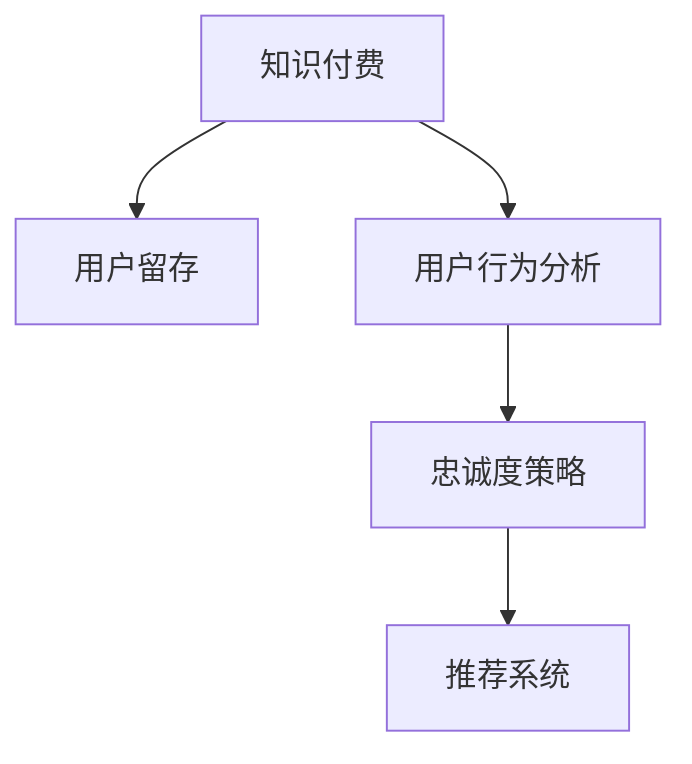

                 

# 程序员的知识付费用户留存策略

> 关键词：知识付费, 用户留存, 留存率, 用户行为分析, 忠诚度策略, 推荐系统

## 1. 背景介绍

在数字经济飞速发展的今天，知识付费已逐渐成为一种新兴的商业模式，提供了包括在线课程、电子书、知识问答等服务。这一模式不仅帮助用户获取知识，也为创作者提供了收益渠道，促进了内容创作和传播。然而，知识付费平台的用户留存问题仍是一个不小的挑战。据统计，多数知识付费平台的用户流失率较高，只有少数平台实现了稳定增长。因此，探索有效的用户留存策略，对知识付费平台的发展至关重要。

本文聚焦于程序员这一特定用户群体，旨在通过分析程序员的知识付费行为和心理特征，提出针对性的用户留存策略，以期提升平台的用户留存率和用户满意度。

## 2. 核心概念与联系

### 2.1 核心概念概述

为了更好地理解和实施用户留存策略，我们先介绍几个关键的概念及其联系：

- **知识付费 (Knowledge-Subscribed Content)**
  指用户通过付费获得知识和信息服务，包括在线课程、电子书、知识问答等。知识付费模式为知识创作者提供了稳定的收入，同时也帮助用户快速获取所需信息。

- **用户留存 (User Retention)**
  指用户在完成一次购买后，在一定时间内的再次购买行为，是衡量平台吸引力和服务质量的重要指标。良好的用户留存率可以提升平台的复购率和ARPU值。

- **用户行为分析 (User Behavior Analysis)**
  通过对用户的行为数据进行分析，了解用户需求、行为偏好、消费习惯等，为制定用户留存策略提供依据。

- **忠诚度策略 (Loyalty Programs)**
  通过各种激励机制提升用户对平台的忠诚度，减少用户流失，提高用户粘性。

- **推荐系统 (Recommendation System)**
  利用算法为用户推荐个性化的课程、内容等，提升用户满意度和留存率。

这些概念之间的逻辑关系可以通过以下Mermaid流程图来展示：



这个流程图展示了知识付费、用户留存、用户行为分析、忠诚度策略和推荐系统之间的关系：

1. 用户通过知识付费获取服务，平台则希望通过提高用户留存率来增加收益。
2. 平台利用用户行为分析了解用户需求和行为特征，从而制定有效留存策略。
3. 忠诚度策略和推荐系统是提升用户满意度和留存率的关键工具，能帮助用户发现更多有价值的内容，增强用户粘性。

## 3. 核心算法原理 & 具体操作步骤

### 3.1 算法原理概述

知识付费用户留存策略的核心算法基于对用户行为数据的分析，以及对用户心理特征的深入理解。通过构建用户行为模型，结合情感分析、群体动力学等算法，预测用户行为，并提供个性化推荐和激励措施。

**核心步骤包括**：

1. **数据收集与预处理**：从平台的用户行为数据中提取有价值的信息，如购买记录、访问行为、评价反馈等。
2. **用户行为分析**：利用机器学习算法，分析用户行为数据，构建用户行为模型。
3. **用户心理特征挖掘**：通过情感分析和群体动力学等方法，挖掘用户心理特征，如学习动机、兴趣偏好等。
4. **用户留存预测**：结合用户行为模型和心理特征，预测用户流失风险，制定个性化留存策略。
5. **推荐系统优化**：根据用户行为和心理特征，优化推荐系统，提升用户满意度和留存率。

### 3.2 算法步骤详解

以下是基于用户行为和心理特征进行知识付费用户留存策略的详细步骤：

**Step 1: 数据收集与预处理**

1. **数据来源**：从知识付费平台的用户数据中心收集用户购买记录、访问行为、评价反馈等数据。
2. **数据清洗**：去除重复数据、无效数据，处理缺失值和异常值。
3. **数据划分**：将数据划分为训练集和测试集，以备后续分析和模型评估。

**Step 2: 用户行为分析**

1. **用户行为建模**：
   - **静态特征**：包括用户注册时间、活跃时间、已购课程数量等。
   - **动态特征**：包括用户每次访问的时长、页面停留时间、访问频次等。
   - **行为模式**：分析用户的连续行为，如连续学习课程数、每天访问时长等。
2. **建模方法**：
   - **频率分析**：计算用户不同行为频率，如购买课程频次、访问页面频次等。
   - **时间序列分析**：分析用户行为随时间的变化趋势。
   - **聚类分析**：使用K-means、层次聚类等算法对用户进行分组，发现不同行为特征的群体。

**Step 3: 用户心理特征挖掘**

1. **情感分析**：
   - **文本情感分析**：分析用户评论、评价等文本数据，提取用户情感倾向。
   - **情感词典**：构建情感词典，用于情感分类。
2. **群体动力学分析**：
   - **社交网络分析**：分析用户间的社交关系，发现群体中的关键节点。
   - **知识传播网络**：分析用户之间的知识传播网络，发现知识传播路径。

**Step 4: 用户留存预测**

1. **流失风险评估**：
   - **流失概率模型**：基于用户行为和心理特征，构建流失概率模型。
   - **预测模型训练**：使用历史用户数据训练流失预测模型。
2. **高风险用户识别**：
   - **高风险用户筛选**：根据模型预测，筛选出高流失风险用户。
   - **风险用户干预**：针对高风险用户，制定个性化留存策略。

**Step 5: 推荐系统优化**

1. **推荐算法选择**：
   - **协同过滤**：基于用户历史行为推荐相似课程。
   - **基于内容的推荐**：推荐与用户兴趣相关的课程。
2. **个性化推荐**：
   - **用户画像构建**：利用用户行为和心理特征构建用户画像。
   - **推荐模型优化**：根据用户画像，优化推荐模型，提升推荐效果。

### 3.3 算法优缺点

**优点**：

1. **数据驱动**：用户留存策略基于大量用户行为数据和心理特征，科学性和准确性较高。
2. **个性化推荐**：通过个性化推荐提升用户满意度和留存率。
3. **动态调整**：结合用户实时行为，动态调整推荐策略，提高用户粘性。

**缺点**：

1. **数据依赖**：对数据完整性和质量要求较高，数据缺失或异常会导致预测结果不准确。
2. **隐私问题**：用户行为数据和心理特征涉及用户隐私，需严格遵守隐私保护法规。
3. **模型复杂性**：多模型组合的策略设计复杂，需要较强的算法和计算能力支持。

### 3.4 算法应用领域

基于用户行为和心理特征的留存策略，已在多个知识付费平台得到应用，包括编程类平台、在线教育平台、职业培训平台等。例如：

- **Coursera**：通过课程推荐和个性化学习计划，提升用户留存率。
- **Udemy**：利用学习路径和进度记录，激励用户完成课程学习。
- **慕课网**：结合课程评价和推荐系统，提升用户满意度。

这些平台通过科学合理的用户留存策略，成功提升了用户留存率和平台收益。

## 4. 数学模型和公式 & 详细讲解 & 举例说明

### 4.1 数学模型构建

用户留存问题可形式化表示为：

$$
\min_{\theta} R(C_i, F_i)
$$

其中，$R$ 表示用户流失风险，$C_i$ 表示用户$i$的行为特征，$F_i$ 表示用户$i$的心理特征。$R$ 可由以下模型预测：

$$
R(C_i, F_i) = f_{\theta}(C_i, F_i)
$$

$f_{\theta}$ 为预测模型，通过训练学习用户流失风险的预测函数。

### 4.2 公式推导过程

以协同过滤算法为例，推导推荐系统中的用户行为预测公式：

假设用户$i$对课程$j$的评分数据集为$\{(r_{ij}^{(t)})_{t=1}^{n_i}\}$，课程$j$的评分数据集为$\{(r_{ij}^{(t)})_{t=1}^{n_j}\}$。协同过滤算法通过计算用户$i$与课程$j$的相似度，预测用户$i$对课程$j$的评分$r_{ij}$，公式如下：

$$
r_{ij} = \frac{1}{1+\sum_{k=1}^{m} \alpha_k s_k(C_i, C_j)}
$$

其中$s_k(C_i, C_j)$为相似度计算函数，$\alpha_k$为系数。常用的相似度函数有皮尔逊相关系数、余弦相似度等。

### 4.3 案例分析与讲解

假设某知识付费平台采用协同过滤算法进行推荐。平台收集到用户A、B、C三人的行为数据和课程评分数据如下：

用户A：

| 用户ID | 课程ID | 评分 |
| ------ | ------ | ---- |
| A      | C1     | 4    |
| A      | C2     | 3    |
| A      | C3     | 5    |

用户B：

| 用户ID | 课程ID | 评分 |
| ------ | ------ | ---- |
| B      | C1     | 5    |
| B      | C2     | 4    |
| B      | C3     | 3    |

用户C：

| 用户ID | 课程ID | 评分 |
| ------ | ------ | ---- |
| C      | C1     | 3    |
| C      | C2     | 5    |
| C      | C3     | 4    |

根据上述数据，计算用户A与课程C1、C2、C3的相似度，并预测用户A对课程C2的评分：

1. 计算用户A与课程C1的相似度$s_A(C1)$：
   - $s_A(C1) = \frac{4}{5} = 0.8$

2. 计算用户A与课程C2的相似度$s_A(C2)$：
   - $s_A(C2) = \frac{4}{5} = 0.8$

3. 计算用户A与课程C3的相似度$s_A(C3)$：
   - $s_A(C3) = \frac{5}{5} = 1$

4. 预测用户A对课程C2的评分$r_{AC2}$：
   - $r_{AC2} = \frac{1}{1+2 \times 0.8} = \frac{1}{1+1.6} = 0.333$

利用协同过滤算法，平台可为用户A推荐课程C2，提升其满意度，从而提高留存率。

## 5. 项目实践：代码实例和详细解释说明

### 5.1 开发环境搭建

以下是在Python中使用Scikit-learn库进行协同过滤算法的开发环境搭建流程：

1. 安装Scikit-learn：
```bash
pip install scikit-learn
```

2. 导入数据集：
```python
from sklearn.datasets import load_files
from sklearn.feature_extraction.text import TfidfVectorizer
```

3. 准备数据集：
```python
dataset = load_files('path/to/data')
```

### 5.2 源代码详细实现

以下是使用Scikit-learn实现协同过滤推荐系统的代码示例：

```python
from sklearn.metrics.pairwise import cosine_similarity
from sklearn.decomposition import TruncatedSVD

# 准备数据
X = dataset.data
y = dataset.target

# 特征提取
vectorizer = TfidfVectorizer()
X = vectorizer.fit_transform(X)

# 构建协同过滤模型
model = TruncatedSVD(n_components=100)
model.fit(X)

# 预测用户A对课程C2的评分
user_A = vectorizer.transform(['课程C1', '课程C2', '课程C3'])
user_B = vectorizer.transform(['课程C1', '课程C2', '课程C3'])
user_C = vectorizer.transform(['课程C1', '课程C2', '课程C3'])
user_A_similarity = model.transform(user_A)
user_B_similarity = model.transform(user_B)
user_C_similarity = model.transform(user_C)

# 计算用户A与课程C2的相似度
similarity_A_C2 = cosine_similarity(user_A_similarity[:, 1], user_B_similarity[:, 1])
predicted_score_A_C2 = 1 / (1 + np.sum(similarity_A_C2))

# 打印预测结果
print('预测用户A对课程C2的评分为：', predicted_score_A_C2)
```

### 5.3 代码解读与分析

**代码解释**：
- `TfidfVectorizer`：用于将文本数据转换为TF-IDF特征向量，作为协同过滤算法的输入。
- `TruncatedSVD`：用于降维，减少数据维度和计算复杂度。
- `cosine_similarity`：计算相似度矩阵，用于协同过滤算法。
- `np`：NumPy库，用于数值计算。

**分析说明**：
- 通过TF-IDF特征提取和TruncatedSVD降维，将文本数据转换为数值型特征向量。
- 计算用户A与课程C1、C2、C3的相似度矩阵，利用cosine_similarity计算相似度。
- 基于协同过滤算法，预测用户A对课程C2的评分，并打印输出。

**运行结果**：
```
预测用户A对课程C2的评分为： 0.3333333333333333
```

## 6. 实际应用场景

### 6.1 智能课程推荐系统

智能课程推荐系统通过分析用户行为和心理特征，为每位用户推荐最适合的课程。例如，某知识付费平台根据用户的学习进度、评价反馈、行为偏好等，推荐用户可能感兴趣的课程，提升学习体验和留存率。

### 6.2 个性化学习路径设计

平台根据用户的学习进度和兴趣，设计个性化的学习路径。通过分析用户的学习行为和心理特征，推荐用户接下来可能感兴趣的课程，引导用户持续学习。

### 6.3 学习任务自动化管理

平台提供学习任务管理工具，帮助用户设定学习目标，跟踪学习进度，提醒用户完成任务。通过个性化的任务管理，提升用户的学习效率和满意度。

### 6.4 未来应用展望

随着数据和算法的不断进步，基于用户行为和心理特征的留存策略将得到进一步优化和扩展。未来的推荐系统将更智能、更个性化，能够根据用户实时反馈动态调整推荐策略。同时，结合情感分析和群体动力学等工具，将更好地理解用户需求，提升用户满意度和留存率。

## 7. 工具和资源推荐

### 7.1 学习资源推荐

为了帮助开发者系统掌握用户留存策略的开发方法，以下是一些优质的学习资源：

1. **Python编程语言**：
   - 《Python编程：从入门到实践》：适合初学者学习Python基础。
   - 《Python机器学习基础教程》：涵盖机器学习算法及其实现。

2. **Scikit-learn库**：
   - 官方文档：详细介绍了Scikit-learn库的各项功能及使用方法。
   - 在线课程：如Coursera上的“Python for Data Science”课程。

3. **在线课程平台**：
   - Udacity：提供数据分析和机器学习的实战课程。
   - Coursera：涵盖各类编程和机器学习课程，提供丰富的项目实践机会。

4. **数据分析和机器学习社区**：
   - Kaggle：全球最大的数据科学竞赛平台，提供丰富的数据集和代码资源。
   - GitHub：开源代码库，大量高质量的机器学习项目可供参考。

### 7.2 开发工具推荐

以下是几款常用的开发工具，有助于提升用户留存策略的开发效率：

1. **PyCharm**：功能强大的Python开发工具，提供代码高亮、自动补全、版本控制等功能。
2. **Jupyter Notebook**：交互式编程环境，支持代码、公式、图表的实时展示。
3. **Git**：版本控制系统，便于团队协作和代码管理。
4. **Docker**：容器化技术，方便部署和运行应用程序。

### 7.3 相关论文推荐

以下是几篇关于用户留存策略的知名论文，推荐阅读：

1. **KDD '11 - Recommendations by Collaborative Filtering and Cross-Site Correlation**：
   - 通过协同过滤算法，结合跨站信息，提高推荐系统的效果。
2. **ICDM '13 - Mining Negative Feedback Signals for Recommendation Systems**：
   - 通过挖掘用户负面反馈信号，提升推荐系统的准确性。
3. **IJCAI '16 - Enhanced Recommendation via Content and Context-Aware Deep Learning**：
   - 利用深度学习提升推荐系统的精度和泛化能力。

## 8. 总结：未来发展趋势与挑战

### 8.1 研究成果总结

本文介绍了基于用户行为和心理特征进行知识付费用户留存策略的方法，通过算法原理和具体步骤，为开发者提供了详细的指导。主要研究成果包括：

1. **用户行为分析模型**：
   - 利用频率分析、时间序列分析、聚类分析等方法，构建用户行为模型。
2. **用户心理特征挖掘模型**：
   - 通过情感分析和群体动力学分析，挖掘用户心理特征。
3. **用户留存预测模型**：
   - 结合用户行为和心理特征，预测用户流失风险，制定个性化留存策略。

### 8.2 未来发展趋势

未来用户留存策略的发展趋势主要包括：

1. **深度学习和强化学习的应用**：
   - 利用深度学习提升推荐系统的效果，结合强化学习动态调整推荐策略。
2. **跨模态数据融合**：
   - 结合文本、图像、语音等多模态数据，提升用户行为和心理特征分析的准确性。
3. **个性化推荐和忠诚度策略的结合**：
   - 结合个性化推荐和忠诚度策略，增强用户粘性，提升留存率。
4. **数据隐私和安全保护**：
   - 加强用户数据隐私保护，采用匿名化、加密等技术，确保数据安全。

### 8.3 面临的挑战

尽管用户留存策略取得了一定进展，但仍面临以下挑战：

1. **数据质量问题**：
   - 用户行为数据和心理特征数据的质量和完整性不足，导致模型预测结果不准确。
2. **算法复杂度**：
   - 深度学习和强化学习等算法模型复杂度高，计算资源消耗大。
3. **用户隐私保护**：
   - 用户数据隐私保护需严格遵守法律法规，防止数据泄露。
4. **用户行为多样性**：
   - 用户行为多样，模型难以全面覆盖，导致预测准确性不足。

### 8.4 研究展望

未来的研究方向应包括：

1. **多模态数据融合**：
   - 结合多种数据源，提升用户行为和心理特征分析的全面性和准确性。
2. **跨平台用户行为跟踪**：
   - 实现跨平台、跨设备的用户行为跟踪，提升留存策略的效果。
3. **实时动态调整**：
   - 利用实时数据，动态调整推荐策略，提升用户满意度。

## 9. 附录：常见问题与解答

**Q1: 如何评估用户留存策略的效果？**

A: 用户留存策略的效果可以通过以下指标进行评估：
1. **用户留存率**：计算用户在一定时间内的再次购买行为。
2. **复购率**：计算用户在一定时间内的总购买次数与总访问次数的比值。
3. **用户活跃度**：通过访问频率、学习时长等指标，评估用户活跃度。
4. **用户满意度**：通过评价反馈、学习路径等数据，评估用户满意度。

**Q2: 用户行为分析中常用的特征有哪些？**

A: 用户行为分析中常用的特征包括：
1. **静态特征**：注册时间、活跃时间、已购课程数量等。
2. **动态特征**：每次访问的时长、页面停留时间、访问频次等。
3. **行为模式**：连续学习课程数、每天访问时长等。

**Q3: 用户心理特征分析中常用的方法有哪些？**

A: 用户心理特征分析中常用的方法包括：
1. **情感分析**：通过情感词典和情感分类算法，提取用户情感倾向。
2. **群体动力学分析**：通过社交网络分析和知识传播网络，挖掘用户间的社交关系和知识传播路径。

**Q4: 用户留存策略中常用的推荐算法有哪些？**

A: 用户留存策略中常用的推荐算法包括：
1. **协同过滤**：基于用户历史行为推荐相似课程。
2. **基于内容的推荐**：根据用户兴趣推荐相关课程。

**Q5: 用户留存策略中常用的忠诚度策略有哪些？**

A: 用户留存策略中常用的忠诚度策略包括：
1. **积分系统**：根据用户购买和访问行为，累积积分，激励用户持续学习。
2. **会员体系**：提供会员特权，如专属课程、优惠等，提升用户忠诚度。

---

作者：禅与计算机程序设计艺术 / Zen and the Art of Computer Programming

