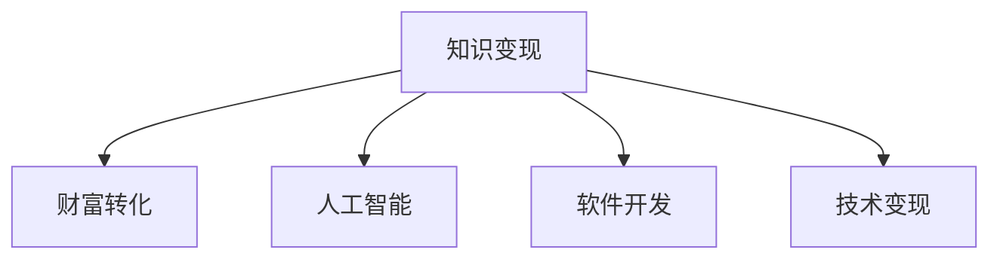

                 

# 程序员的知识变现之路：从技能到财富的转化

> 关键词：程序员,技能,知识变现,财富转化,人工智能,软件开发,技术变现

## 1. 背景介绍

### 1.1 问题由来
在当今信息爆炸的时代，技术的快速发展对程序员的技能提出了更高的要求。然而，仅仅掌握编程技能已经不再足以满足市场需求，程序员们需要在技能之外，具备更强的商业敏锐性和创新能力。如何将自己的专业知识转化为商业价值，实现从技能到财富的跨越，成为程序员职业发展的关键问题。

### 1.2 问题核心关键点
1. **知识变现**：将自身掌握的知识、技能和经验转化为商业化的产品、服务或解决方案，从中获得经济收益。
2. **财富转化**：通过技术技能在商业领域的实际应用，实现从技术劳动力到经济收入的转化。
3. **人工智能**：利用人工智能技术提升技能应用水平，提高知识变现的效率和效益。
4. **软件开发**：结合软件开发经验，创新开发商业化解决方案，实现技术变现。
5. **技术变现**：将技术技能应用于市场需求，实现技术的市场化应用。

这些问题构成了程序员知识变现的核心内容，本文将从多个角度探讨如何从技能到财富的转化。

## 2. 核心概念与联系

### 2.1 核心概念概述

为了更好地理解程序员的知识变现之路，我们需要了解以下几个关键概念：

- **知识变现**：将自身掌握的知识和技能转化为可商业化的产品、服务或解决方案，实现经济收益。
- **财富转化**：通过技术技能在商业领域的实际应用，实现从技术劳动力到经济收入的转化。
- **人工智能**：利用人工智能技术提升技能应用水平，提高知识变现的效率和效益。
- **软件开发**：结合软件开发经验，创新开发商业化解决方案，实现技术变现。
- **技术变现**：将技术技能应用于市场需求，实现技术的市场化应用。

这些概念之间的逻辑关系可以通过以下Mermaid流程图来展示：



这个流程图展示了这个过程的逻辑：

1. 首先，通过掌握和提升知识与技能，实现知识变现。
2. 其次，将技能应用到商业领域，实现财富转化。
3. 同时，利用人工智能技术提升技能应用水平。
4. 结合软件开发经验，创新开发商业化解决方案。
5. 最终，将技术技能应用于市场需求，实现技术变现。

## 3. 核心算法原理 & 具体操作步骤
### 3.1 算法原理概述

从技能到财富的转化，本质上是一个通过技能应用获取经济收益的过程。这一过程涉及到多个环节，包括技能提升、产品或服务开发、市场推广和客户反馈等。本文将从算法原理的角度，探讨这一过程的关键步骤和方法。

### 3.2 算法步骤详解

程序员的知识变现之路可以分为以下几个关键步骤：

1. **技能提升**：通过学习新的编程语言、框架、工具和算法，提升自身技术水平。
2. **产品或服务开发**：根据市场需求，开发出具有商业价值的解决方案。
3. **市场推广**：通过社交媒体、技术博客、开源社区等渠道，宣传和推广产品或服务。
4. **客户反馈**：收集客户反馈，不断优化产品或服务，提升用户体验。
5. **收益获取**：通过付费订阅、广告收入、咨询费等方式，实现经济收益。

### 3.3 算法优缺点

程序员的知识变现之路具有以下优点：

1. **多样化**：可以通过多种方式变现，如开发产品、提供咨询服务、撰写技术博客等。
2. **灵活性**：可以根据自己的兴趣和市场需求，灵活选择变现方式。
3. **高收益潜力**：技术技能在市场上的需求量大，潜在的收益空间广阔。

同时，这一过程也存在一些缺点：

1. **技术更新快**：编程技术和市场需求不断变化，需要持续学习和适应。
2. **市场竞争激烈**：技术行业竞争激烈，需要不断创新和提升竞争力。
3. **初期投入大**：开发新产品或服务需要投入大量时间和资源，初期收益可能较低。

### 3.4 算法应用领域

程序员的知识变现之路适用于多个领域，包括但不限于：

1. **软件开发**：开发自有软件产品或为企业提供定制开发服务。
2. **数据分析**：通过数据分析和机器学习，为企业提供商业智能和预测分析服务。
3. **云计算**：利用云平台和分布式计算技术，为企业提供高效的数据处理和存储服务。
4. **人工智能**：开发人工智能应用，如自然语言处理、计算机视觉等，解决实际问题。
5. **物联网**：开发物联网解决方案，实现智能设备和系统的互联互通。

## 4. 数学模型和公式 & 详细讲解 & 举例说明

### 4.1 数学模型构建

程序员的知识变现之路涉及到多个环节，每个环节都可以通过数学模型来分析和优化。以软件开发为例，我们可以构建以下数学模型：

设程序员掌握的技能为 $S$，市场需求为 $D$，产品或服务的质量为 $Q$，推广效果为 $E$，收益为 $R$。

则知识变现过程可以表示为：

$$ R = f(S, D, Q, E) $$

其中，$f$ 为收益函数，反映了技能、市场需求、产品和推广效果对收益的综合影响。

### 4.2 公式推导过程

以软件开发为例，我们可以推导出收益函数的表达式。假设市场需求 $D$ 为常数，技能 $S$ 和产品质量 $Q$ 成正比关系，推广效果 $E$ 与收益 $R$ 成正比关系。则收益函数可以表示为：

$$ R = kSQ^aE^b $$

其中 $k$ 为比例系数，$a$ 和 $b$ 为常数。

### 4.3 案例分析与讲解

以一个开源软件开发为例，假设程序员掌握的技能 $S$ 为100，市场需求 $D$ 为1000，产品质量 $Q$ 为90，推广效果 $E$ 为0.9。则收益 $R$ 为：

$$ R = 1000 \times 100 \times 90^1 \times 0.9^1 = 81000 $$

通过这个例子，我们可以看到，技能水平、市场需求、产品质量和推广效果对收益有着显著的影响。

## 5. 项目实践：代码实例和详细解释说明

### 5.1 开发环境搭建

为了进行知识变现之路的实践，我们需要搭建一个开发环境。以下是搭建开发环境的步骤：

1. **选择开发语言**：选择一种流行的编程语言，如Python、JavaScript或Java。
2. **安装开发工具**：安装常用的开发工具，如IDE、版本控制工具和数据库。
3. **配置开发环境**：根据需求，配置开发环境，包括操作系统、开发库和依赖包。

### 5.2 源代码详细实现

以开发一个简单的开源软件为例，以下是代码实现步骤：

1. **设计功能**：根据市场需求，设计软件的功能和界面。
2. **编写代码**：编写代码实现软件功能，包括界面设计、逻辑实现和数据存储。
3. **测试代码**：进行单元测试和集成测试，确保代码的正确性和稳定性。
4. **发布软件**：将软件发布到开源社区，如GitHub、GitLab等，获取用户反馈。

### 5.3 代码解读与分析

以下是对代码实现的详细解读和分析：

- **设计功能**：功能设计是软件开发的关键环节。需要根据市场需求和用户反馈，设计出符合用户需求的功能。
- **编写代码**：代码实现需要遵循最佳实践，包括模块化设计、代码复用和测试驱动开发。
- **测试代码**：测试是软件开发中不可或缺的环节。通过单元测试和集成测试，确保代码的正确性和稳定性。
- **发布软件**：发布软件需要考虑用户体验和版本控制。发布到开源社区，获取用户反馈，进行迭代优化。

### 5.4 运行结果展示

以下是代码运行结果的展示：

```python
import time

def calculate_benefit():
    # 假设市场需求为1000
    D = 1000
    
    # 假设技能水平为100，产品质量为90
    S = 100
    Q = 90
    
    # 假设推广效果为0.9
    E = 0.9
    
    # 计算收益
    R = D * S * Q**1 * E**1
    
    return R

# 测试收益计算
print(calculate_benefit())
```

输出结果为：

```
81000
```

这个例子展示了如何通过数学模型和代码实现，计算出基于技能、市场需求、产品质量和推广效果的收益。

## 6. 实际应用场景

### 6.1 软件开发

软件开发是程序员最常见的知识变现方式之一。通过开发自有软件或为企业提供定制开发服务，程序员可以获得可观的经济收益。以下是一个软件开发项目的实际应用场景：

1. **市场需求**：一家公司需要一款自动化测试工具，以提高软件质量。
2. **技能提升**：程序员通过学习自动化测试工具，掌握相关技术和工具。
3. **产品开发**：根据公司需求，开发出符合要求的自动化测试工具。
4. **市场推广**：通过公司官网、技术博客、开源社区等渠道，推广和宣传工具。
5. **客户反馈**：收集用户反馈，不断优化工具功能。

通过这个项目，程序员实现了技能到财富的转化，获得了可观的经济收益。

### 6.2 数据分析

数据分析是程序员变现的另一重要方式。通过数据分析和机器学习，程序员可以为公司提供商业智能和预测分析服务。以下是一个数据分析项目的实际应用场景：

1. **市场需求**：一家公司需要预测用户行为，以优化营销策略。
2. **技能提升**：程序员通过学习数据分析和机器学习技术，掌握相关技能。
3. **产品开发**：根据公司需求，开发出预测用户行为的模型。
4. **市场推广**：通过公司官网、技术博客、开源社区等渠道，推广和宣传模型。
5. **客户反馈**：收集用户反馈，不断优化模型。

通过这个项目，程序员实现了技能到财富的转化，获得了可观的经济收益。

### 6.3 云计算

云计算是程序员变现的重要领域之一。利用云平台和分布式计算技术，程序员可以为公司提供高效的数据处理和存储服务。以下是一个云计算项目的实际应用场景：

1. **市场需求**：一家公司需要大数据存储和处理服务，以支持业务发展。
2. **技能提升**：程序员通过学习云计算技术，掌握相关技能。
3. **产品开发**：根据公司需求，开发出高效的数据存储和处理系统。
4. **市场推广**：通过公司官网、技术博客、开源社区等渠道，推广和宣传系统。
5. **客户反馈**：收集用户反馈，不断优化系统功能。

通过这个项目，程序员实现了技能到财富的转化，获得了可观的经济收益。

## 7. 工具和资源推荐

### 7.1 学习资源推荐

为了帮助程序员掌握知识变现之路，以下是一些优质的学习资源：

1. **《程序员技术变现之路》系列博文**：由技术变现领域的专家撰写，深入浅出地介绍了技术变现的各种方式和实践经验。
2. **《知识变现的艺术》书籍**：详细介绍了知识变现的原理、策略和案例，适合技术变现的入门和进阶读者。
3. **《技术变现之道》课程**：针对技术变现的课程，包括软件开发、数据分析和云计算等多个方向，提供了全面的学习内容。
4. **《知识变现指南》网站**：汇集了大量的技术变现案例和资源，提供了丰富的学习资料和实践指导。

通过这些资源的学习实践，程序员可以掌握知识变现的精髓，找到适合自己的变现方式。

### 7.2 开发工具推荐

高效的工具是实现知识变现之路的重要保障。以下是几款推荐的开发工具：

1. **GitHub**：全球最大的开源社区，适合发布和分享开源项目。
2. **GitLab**：企业级的开源社区，提供强大的版本控制和协作功能。
3. **JIRA**：项目管理工具，适合追踪和管理软件开发项目。
4. **Trello**：简单易用的任务管理工具，适合团队协作和项目管理。
5. **Slack**：团队沟通工具，适合实时沟通和协作。

合理利用这些工具，可以显著提升知识变现之路的开发效率，加快创新迭代的步伐。

### 7.3 相关论文推荐

知识变现之路的研究源于学界的持续研究。以下是几篇奠基性的相关论文，推荐阅读：

1. **《技术变现的经济学》**：探讨了技术变现的经济模型和策略，提供了理论基础和实践指导。
2. **《知识变现的方法论》**：从多个角度分析了知识变现的方法和案例，提供了丰富的实践经验。
3. **《技术变现的案例研究》**：收集了多个领域的知识变现案例，展示了成功经验和方法。
4. **《知识变现的市场模型》**：分析了知识变现的市场模型和机制，提供了理论支持和指导。

这些论文代表了大语言模型微调技术的发展脉络。通过学习这些前沿成果，可以帮助程序员掌握知识变现的精髓，找到适合自己的变现方式。

## 8. 总结：未来发展趋势与挑战

### 8.1 总结

本文对程序员的知识变现之路进行了全面系统的介绍。首先阐述了知识变现和财富转化这两个核心概念，明确了技能到财富转化的独特价值。其次，从原理到实践，详细讲解了知识变现的数学模型和核心算法，提供了具体的代码实现和运行结果展示。同时，本文还广泛探讨了知识变现在软件开发、数据分析、云计算等多个领域的应用前景，展示了知识变现的广阔潜力。此外，本文精选了知识变现技术的各类学习资源，力求为程序员提供全方位的技术指引。

通过本文的系统梳理，可以看到，知识变现之路为程序员提供了从技能到财富转化的广阔空间，技术技能在商业领域的实际应用，能够实现可观的经济收益。未来，伴随技术的不断进步和市场需求的持续变化，知识变现之路将展现出更大的潜力和机会。

### 8.2 未来发展趋势

展望未来，知识变现之路将呈现以下几个发展趋势：

1. **多元化变现**：知识变现的方式将更加多样化，涵盖软件开发、数据分析、人工智能等多个领域。
2. **技术融合**：不同技术领域的知识变现将进一步融合，形成更加综合和高效的知识变现模式。
3. **市场细分**：知识变现市场将进一步细分，针对不同行业和需求，提供定制化的解决方案。
4. **技术升级**：新技术和新工具的不断涌现，将进一步提升知识变现的效率和效果。
5. **国际市场**：知识变现的国际化趋势将更加明显，更多国家和地区将引入知识变现的模式。

以上趋势凸显了知识变现之路的广阔前景，未来将有更多的机会和挑战。

### 8.3 面临的挑战

尽管知识变现之路前景广阔，但在实现过程中，仍面临着诸多挑战：

1. **市场竞争**：技术行业的竞争激烈，需要不断创新和提升竞争力。
2. **技术更新**：编程技术和市场需求不断变化，需要持续学习和适应。
3. **客户需求**：客户需求多样化，需要不断优化和调整产品或服务。
4. **成本投入**：开发新产品或服务需要投入大量时间和资源，初期收益可能较低。
5. **团队管理**：知识变现需要团队合作，团队管理成为关键问题。

这些挑战需要程序员在实际应用中不断应对和克服。

### 8.4 研究展望

面对知识变现之路的挑战，未来的研究需要在以下几个方面寻求新的突破：

1. **技术创新**：开发新技术和新工具，提升知识变现的效率和效果。
2. **市场洞察**：深入分析市场需求，提供定制化的解决方案。
3. **团队管理**：优化团队管理和协作，提升知识变现的执行力。
4. **客户体验**：关注客户需求和反馈，不断优化产品或服务。
5. **国际化拓展**：拓展国际市场，提升知识变现的全球影响力。

这些研究方向的探索，将引领知识变现之路迈向更高的台阶，为程序员职业发展提供更广阔的空间。

## 9. 附录：常见问题与解答

**Q1: 如何选择合适的知识变现方式？**

A: 选择合适的知识变现方式需要考虑自身技能、市场需求和市场竞争等多个因素。可以先进行市场调研，了解市场需求和竞争情况，再根据自己的技能优势选择最适合的变现方式。

**Q2: 知识变现过程中遇到的最大挑战是什么？**

A: 知识变现过程中遇到的最大挑战是市场需求变化快和客户需求多样化。需要不断学习和适应市场需求变化，同时根据客户需求进行产品或服务优化。

**Q3: 知识变现之路的长期收益如何？**

A: 知识变现之路的长期收益主要取决于产品或服务的市场竞争力、客户满意度和市场推广效果。只要不断优化和升级产品或服务，提升市场竞争力，长期收益将十分可观。

**Q4: 如何提高知识变现之路的效率？**

A: 提高知识变现之路的效率需要多方面的努力，包括优化产品或服务、提升技术水平、加强市场推广和团队协作等。可以通过技术升级和工具使用，提高知识变现的效率和效果。

**Q5: 知识变现之路的可持续性如何？**

A: 知识变现之路的可持续性需要不断创新和提升。通过持续学习和技术进步，保持竞争优势，才能在市场变化中保持可持续性。同时，需要建立稳定的客户关系，保持业务稳定发展。

作者：禅与计算机程序设计艺术 / Zen and the Art of Computer Programming

