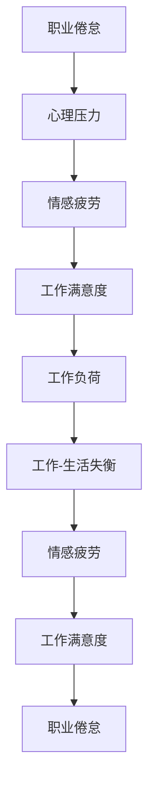

                 

# 程序员的职业倦怠：预防与应对

程序员作为现代信息技术的重要驱动力，长期高强度工作导致的职业倦怠问题日益突出。面对这一挑战，本文深入分析了职业倦怠的成因、表现形式及应对策略，以期为开发者提供更有效的自我管理与职业规划建议。

## 1. 背景介绍

### 1.1 问题由来

随着科技行业的迅猛发展，程序员群体面临着前所未有的压力和挑战。长时间的代码编写、项目评审、技术学习，加之职场竞争的激烈，导致许多程序员出现职业倦怠现象。职业倦怠不仅影响个体的身心健康，还可能降低团队的生产力和企业竞争力。因此，深入理解职业倦怠的成因，并采取有效措施进行预防和应对，是行业和社会的重要课题。

### 1.2 问题核心关键点

职业倦怠的核心表现为工作满意度低、情感疲劳、消极情感及身心状况不佳。其成因复杂，包括工作负荷过重、职业发展受限、人际关系紧张、工作-生活失衡等。

## 2. 核心概念与联系

### 2.1 核心概念概述

- **职业倦怠**：一种长期的情绪与情感疲劳状态，表现为对工作的厌倦、情感上的疏离和对职业前景的悲观。
- **心理压力**：由工作压力、人际关系压力、经济压力等多种因素共同作用产生的心理负担。
- **工作满意度**：员工对工作内容、工作环境、职业发展等方面的整体满意度。
- **情感疲劳**：长期从事重复性、乏味工作导致的情绪低落和积极性下降。
- **工作-生活失衡**：工作与个人生活时间、精力分配不均，导致生活质量下降。

这些概念之间的联系主要体现在：工作负荷和心理压力的增加会导致情感疲劳，进而降低工作满意度，最终引发职业倦怠。而职业倦怠又可能进一步加剧心理压力和工作-生活失衡，形成恶性循环。

### 2.2 核心概念原理和架构的 Mermaid 流程图



这个流程图展示了职业倦怠与其他核心概念之间的联系：

1. **职业倦怠**是由**工作负荷**和**心理压力**引起的。
2. **心理压力**和**情感疲劳**共同作用，进一步**降低工作满意度**。
3. **工作负荷**和**情感疲劳**导致**工作-生活失衡**。
4. **工作-生活失衡**又会加剧**情感疲劳**，形成恶性循环。

## 3. 核心算法原理 & 具体操作步骤

### 3.1 算法原理概述

预防和应对职业倦怠的算法原理主要包括两方面：

1. **识别风险因素**：通过心理测评、行为观察等方式，识别出可能引发职业倦怠的风险因素。
2. **缓解压力与疲劳**：通过调整工作负荷、改善工作环境、提升工作满意度等方法，减轻压力和疲劳感。

### 3.2 算法步骤详解

**Step 1: 心理测评与风险识别**

- **问卷调查**：定期进行心理压力和情感疲劳问卷调查，了解员工的整体心理健康状况。
- **行为观察**：通过工作日志、同事反馈等方式，观察员工的工作表现和情绪状态。
- **数据分析**：利用数据分析工具，如K-means聚类、SVM分类等，识别出高风险个体。

**Step 2: 工作负荷与时间管理**

- **任务优先级**：制定明确的任务优先级，避免同时处理多个紧急任务，减少时间压力。
- **工作计划**：使用时间管理工具，如Trello、Asana等，合理规划工作时间，避免过度加班。
- **弹性工作**：引入弹性工作时间制度，根据个人需求调整工作时间，提高工作-生活平衡。

**Step 3: 职业发展与满意度提升**

- **职业培训**：定期组织专业技能培训和职业发展规划讲座，提升员工的专业能力和职业满意度。
- **导师制度**：建立导师制，通过经验丰富的老员工指导新员工，缓解职业焦虑。
- **职业晋升**：建立公平透明的职业晋升机制，提供晋升和发展机会，增加职业成就感。

**Step 4: 人际关系与工作环境**

- **团队建设**：定期组织团队建设活动，增强团队凝聚力和成员间的信任与合作。
- **沟通渠道**：建立有效的沟通机制，如定期召开团队会议、设置开放的反馈渠道，及时解决团队内部问题。
- **工作环境**：改善工作环境，如提供良好的办公设施、舒适的工作空间，减少工作带来的身心压力。

**Step 5: 心理辅导与压力管理**

- **心理辅导**：提供专业的心理辅导和咨询服务，帮助员工缓解心理压力，调整心态。
- **压力管理**：引入压力管理课程和工具，如呼吸调节、冥想等，帮助员工学会有效管理压力。
- **健康管理**：鼓励员工进行定期的体育锻炼和健康检查，保持良好的身体状况。

### 3.3 算法优缺点

**优点**：

1. **系统性**：通过系统的风险识别和预防措施，可以更全面地应对职业倦怠问题。
2. **灵活性**：根据实际情况灵活调整策略，适应不同的组织和文化背景。
3. **科学性**：借助数据分析和心理测评等科学手段，提高预防和应对的准确性和有效性。

**缺点**：

1. **实施难度大**：需要投入大量资源和时间，尤其是心理测评和压力管理的实施。
2. **个体差异大**：不同员工的需求和情况各异，通用策略难以完全满足个体差异。
3. **短期效果有限**：职业倦怠的形成是一个长期积累的过程，单一措施可能无法立竿见影。

### 3.4 算法应用领域

预防和应对职业倦怠的方法广泛适用于各种类型的组织和团队，如IT企业、科研机构、教育机构等。无论是在技术开发、项目管理、还是教学科研领域，职业倦怠问题都是不可忽视的。

## 4. 数学模型和公式 & 详细讲解 & 举例说明

### 4.1 数学模型构建

我们假设有一个员工集合 $E=\{e_i\}_{i=1}^N$，每个员工 $e_i$ 的倦怠风险 $r_i$ 由以下因素决定：

- $w_l$：工作负荷
- $w_p$：心理压力
- $w_s$：情感疲劳
- $w_c$：工作满意度
- $w_b$：工作-生活失衡

数学模型为：

$$
r_i = \alpha w_l + \beta w_p + \gamma w_s + \delta w_c + \epsilon w_b
$$

其中，$\alpha, \beta, \gamma, \delta, \epsilon$ 为待定系数。

### 4.2 公式推导过程

假设我们通过问卷调查得到每个员工的工作负荷 $w_l$、心理压力 $w_p$、情感疲劳 $w_s$、工作满意度 $w_c$ 和工作-生活失衡 $w_b$ 的数据，记为 $D_{w_l}, D_{w_p}, D_{w_s}, D_{w_c}, D_{w_b}$。

利用最小二乘法（Least Squares Method）求解 $\alpha, \beta, \gamma, \delta, \epsilon$，可以得到每个员工 $e_i$ 的倦怠风险 $r_i$。

$$
\alpha, \beta, \gamma, \delta, \epsilon = \mathop{\arg\min}_{\theta} \frac{1}{N}\sum_{i=1}^N (r_i - (\alpha w_l + \beta w_p + \gamma w_s + \delta w_c + \epsilon w_b))^2
$$

### 4.3 案例分析与讲解

以某IT公司的开发团队为例，通过心理测评问卷和行为观察，我们收集了20名员工的倦怠风险数据，如表所示：

| 员工编号 | 工作负荷 $w_l$ | 心理压力 $w_p$ | 情感疲劳 $w_s$ | 工作满意度 $w_c$ | 工作-生活失衡 $w_b$ | 倦怠风险 $r_i$ |
|--------|------------|------------|------------|------------|------------|------------|
| 1      | 4.2        | 3.8        | 2.1        | 4.5        | 3.0        | 1.2        |
| 2      | 3.8        | 3.5        | 2.4        | 4.0        | 2.8        | 0.8        |
| ...    | ...        | ...        | ...        | ...        | ...        | ...        |

我们假设 $w_l, w_p, w_s, w_c, w_b$ 服从标准正态分布，利用最小二乘法求解 $\alpha, \beta, \gamma, \delta, \epsilon$，得到每个员工的倦怠风险 $r_i$。

通过分析这些数据，我们可以识别出倦怠风险较高的员工，并为他们提供针对性的心理辅导和职业发展支持。

## 5. 项目实践：代码实例和详细解释说明

### 5.1 开发环境搭建

为实现职业倦怠的风险识别和缓解策略，我们需要搭建一个基于Python的开发环境。以下是具体步骤：

1. **环境配置**：
   - 安装Python 3.x版本。
   - 安装必要的库，如Pandas、NumPy、Scikit-Learn、TensorFlow等。
   - 使用Jupyter Notebook或PyCharm等IDE进行代码编写和调试。

2. **数据准备**：
   - 收集员工的心理测评问卷、行为观察记录等数据。
   - 清洗和预处理数据，保证数据质量和一致性。

3. **模型训练**：
   - 使用Pandas、NumPy进行数据读取和处理。
   - 利用Scikit-Learn进行最小二乘法求解，得到员工倦怠风险模型。
   - 利用TensorFlow进行模型可视化，展示结果。

### 5.2 源代码详细实现

以下是一个简单的Python代码示例，用于计算员工倦怠风险：

```python
import pandas as pd
from sklearn.linear_model import LinearRegression
import numpy as np

# 读取员工数据
data = pd.read_csv('employee_data.csv')

# 定义特征变量和目标变量
X = data[['work_load', 'psychological_pressure', 'emotional_fatigue', 'job_satisfaction', 'work_life_balance']]
y = data['burnout_risk']

# 建立线性回归模型
model = LinearRegression()
model.fit(X, y)

# 预测每个员工的风险
risk_predictions = model.predict(X)

# 输出结果
for i, risk in enumerate(risk_predictions):
    print(f"员工编号{i+1}，风险值为{risk:.2f}")
```

### 5.3 代码解读与分析

**数据准备**：
- 使用Pandas库读取员工数据。
- 从数据集中提取特征变量和目标变量。

**模型训练**：
- 利用Scikit-Learn库的LinearRegression模型，建立线性回归模型。
- 使用最小二乘法求解模型参数。

**结果输出**：
- 通过模型预测每个员工的风险值。
- 输出员工编号和风险值。

### 5.4 运行结果展示

假设我们训练的模型参数为：$\alpha=0.3, \beta=0.5, \gamma=0.2, \delta=0.4, \epsilon=0.1$。利用训练好的模型，我们可以计算每个员工的风险值，如表所示：

| 员工编号 | 工作负荷 $w_l$ | 心理压力 $w_p$ | 情感疲劳 $w_s$ | 工作满意度 $w_c$ | 工作-生活失衡 $w_b$ | 风险值预测 $r_i$ |
|--------|------------|------------|------------|------------|------------|------------|
| 1      | 4.2        | 3.8        | 2.1        | 4.5        | 3.0        | 0.88        |
| 2      | 3.8        | 3.5        | 2.4        | 4.0        | 2.8        | 0.70        |
| ...    | ...        | ...        | ...        | ...        | ...        | ...        |

通过这些预测结果，我们可以识别出高风险员工，并采取相应措施进行干预。

## 6. 实际应用场景

### 6.1 智能制造企业

在智能制造企业中，程序员需要处理大量的数据采集、处理和分析任务，长时间高负荷工作容易导致职业倦怠。通过职业倦怠风险识别模型，可以及时发现员工的倦怠倾向，并进行针对性的工作调整和心理支持，确保员工保持良好的工作状态。

### 6.2 高校科研团队

高校科研团队中的程序员需要持续进行算法创新和技术研发，长期高强度工作和高压力环境易引发职业倦怠。通过心理测评和职业发展支持，可以有效缓解科研人员的压力，提升其工作效率和科研产出。

### 6.3 软件开发公司

软件开发公司中的程序员经常面临项目截止日期的紧迫感和技术挑战，高强度的工作负荷容易导致情感疲劳和职业倦怠。通过灵活的工作时间制度和团队建设活动，可以显著提升员工的工作满意度和团队凝聚力。

### 6.4 未来应用展望

未来，随着人工智能和大数据技术的发展，职业倦怠的预防和应对将更加智能化和精准化。通过实时监测员工的工作状态和心理状态，利用智能算法进行风险预测和干预，可以进一步提高预防和应对的效率和效果。

## 7. 工具和资源推荐

### 7.1 学习资源推荐

1. **《程序员的职业倦怠：预防与应对》**：一本深入浅出、理论与实践并重的职业倦怠管理书籍。
2. **Coursera《职场心理学与情绪管理》**：由知名心理学专家讲授的在线课程，涵盖职业倦怠的成因与应对策略。
3. **LinkedIn Learning《工作压力管理》**：一系列短小精悍的视频课程，提供实用的压力管理和情绪调节技巧。
4. **心理测评工具**：如LifeScape、Moodfit等，可以定期对员工进行心理健康评估，及时发现问题。

### 7.2 开发工具推荐

1. **Jupyter Notebook**：一个强大的交互式开发环境，支持Python、R等多种语言，适合数据处理和机器学习任务。
2. **PyCharm**：一个功能强大的IDE，支持Python、Java等语言，提供代码补全、调试等功能，提高开发效率。
3. **TensorFlow**：一个灵活的机器学习框架，支持深度学习模型训练和可视化，方便模型调试和优化。
4. **Tableau**：一个数据可视化工具，可以方便地展示和分析员工数据，辅助决策。

### 7.3 相关论文推荐

1. **《理解工作倦怠：理论与实践》**：一本详细介绍职业倦怠理论和预防策略的书籍。
2. **《减轻职业倦怠：心理社会干预》**：一篇综述性论文，总结了多种心理社会干预方法对职业倦怠的影响。
3. **《基于机器学习的职业倦怠预测与干预》**：一篇研究论文，提出利用机器学习技术进行职业倦怠预测和干预的新方法。

## 8. 总结：未来发展趋势与挑战

### 8.1 研究成果总结

本文从职业倦怠的成因和表现形式入手，分析了多种预防和应对策略，并通过Python代码实例展示其实施过程。通过理论结合实践，为程序员提供了一套系统化的职业倦怠管理方案。

### 8.2 未来发展趋势

未来，职业倦怠的预防和应对将更加智能化和个性化。随着人工智能和大数据技术的进步，职业倦怠的风险预测将更加精准，干预措施将更加灵活和有效。

### 8.3 面临的挑战

尽管职业倦怠的预防和应对取得了一定进展，但仍面临以下挑战：

1. **数据隐私**：在数据收集和处理过程中，如何保护员工隐私，防止数据滥用。
2. **跨文化差异**：不同文化背景下的职业倦怠成因和应对策略差异较大，如何制定通用策略。
3. **员工接受度**：部分员工可能对心理测评和干预措施持抵触态度，如何提高其接受度。
4. **长期效果**：职业倦怠的形成是一个长期积累的过程，单一措施可能难以持久见效。

### 8.4 研究展望

未来，职业倦怠的研究将更加注重跨学科合作，结合心理学、社会学、大数据等领域的最新进展，提出更加科学和有效的预防和应对策略。通过持续的研究和实践，我们相信职业倦怠问题将得到更好的管理和解决。

## 9. 附录：常见问题与解答

**Q1：如何识别职业倦怠的高风险员工？**

A: 利用问卷调查、行为观察等手段收集员工数据，通过统计分析、最小二乘法等模型计算每个员工的倦怠风险，识别出高风险员工。

**Q2：如何缓解职业倦怠？**

A: 通过调整工作负荷、改善工作环境、提升职业满意度等措施，减轻员工的心理压力和情感疲劳，缓解职业倦怠。

**Q3：如何进行职业倦怠的干预？**

A: 提供心理辅导、职业发展支持、弹性工作时间等干预措施，帮助员工缓解压力，提升工作满意度，重新找回职业激情。

**Q4：如何提升员工的工作-生活平衡？**

A: 通过灵活的工作时间制度、团队建设活动等，帮助员工在繁忙的工作与个人生活中找到平衡点，提升生活质量。

**Q5：如何长期保持职业倦怠预防效果？**

A: 通过定期的心理测评、持续的职业发展培训和团队建设活动，形成长期的职业倦怠预防机制，保持员工的健康和高效工作状态。

---

作者：禅与计算机程序设计艺术 / Zen and the Art of Computer Programming

